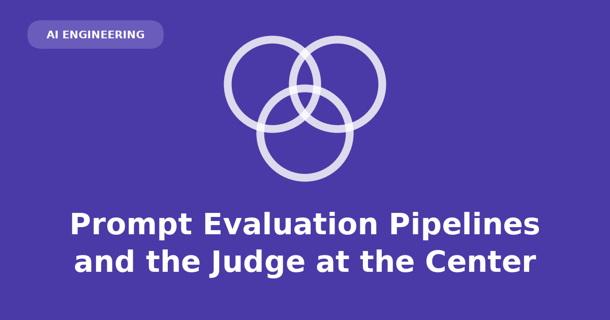

This post explains what a prompt evaluation pipeline is, how it turns a prompt change into a diff of numbers, and why a second model usually ends up holding the grading pen.

A prompt change has no compiler and no stack trace. An eval pipeline defines success criteria, runs a fixed test set, scores outputs, and aggregates results. For properties that admit no deterministic check — tone, helpfulness, groundedness — the scorer is typically a second model (LLM-as-judge).

## Manual testing limits

Ad-hoc playground checks are not a substitute for a fixed eval set.

- **Non-determinism.** Even at `temperature=0`, the same input may produce different outputs. One good answer does not establish typical behavior.
- **Subjective correctness.** Questions like "did it answer the question?" or "was the tone appropriate?" have no `assert`.
- **Silent regressions.** Fixing verbosity while breaking citation discipline produces no error; without a before-and-after on a fixed set, the regression is invisible until production.

## Eval pipeline stages

Every eval pipeline follows the same sequence:

1. **Define success criteria** — specific, separable properties an output must have.
2. **Build a test set** — inputs representative of real traffic, plus edges: empty context, contradictory documents, prompt injection, unanswerable questions.
3. **Run the prompt** over every case, recording inputs, outputs, and model version.
4. **Score** each output against the criteria.
5. **Aggregate** into numbers comparable across prompt versions.
6. **Iterate**, adding every new failure as a permanent case.

Stage one is the hardest. "Quality" is not a criterion; "every factual claim appears in the retrieved context" is. Vague criteria produce scores that move without explaining why.

## Rule-based scorers

Deterministic scorers inspect output without calling a model.

- JSON schema validation
- Exact-match labels
- Unit tests on generated code (strongest proxy when code executes; passing your tests is still not the same as being correct)

Rule-based scorers are exact, free, and instant. They fail when an answer can be correct in more than one wording.

| | Rule-based scorer | LLM-as-judge |
|:---|:---|:---|
| Grades | schema, exact match, tests pass | tone, helpfulness, groundedness |
| Cost per case | ~zero | an extra API call |
| Repeatability | exact | varies run to run |
| Fails by | scoring paraphrase as wrong | agreeing with you less than you assume |
| Debugging | the assertion says what broke | a score, unless you ask for reasoning |

Use rule-based scorers wherever the property admits them. The remainder of this post covers LLM-as-judge for properties that do not.

## LLM-as-judge

A judge is a prompt whose output is a score or verdict.

- Write a **rubric**: criteria, edge cases, failure definitions.
- Paste the candidate output (and any reference material) into the prompt.
- Instruct the model to reply in a form the harness can parse.

## Groundedness rubric example

**Groundedness** means every factual claim in an answer is traceable to retrieved context. In retrieval-augmented generation (RAG), the system searches a corpus, pastes retrieved passages into the prompt, and generates an answer from those passages only.

Ungrounded answers that sound authoritative are costly in support settings. Word overlap between answer and source does not detect hallucinations phrased in the documentation's vocabulary.

```text
You are checking whether an ANSWER is fully supported by the CONTEXT.

CONTEXT:
{retrieved_chunks}

ANSWER:
{candidate_answer}

Decompose the ANSWER into individual factual claims. A claim is supported
only if it is stated in or directly entailed by the CONTEXT. General
knowledge does not count as support.

Reply with JSON only:
{"unsupported_claims": [...], "verdict": "pass" | "fail"}
```

Design choices:

- The judge sees context, so it grades support rather than truth.
- Claims precede the verdict, so failures include reasons.
- JSON output lets the harness parse `verdict` and treat malformed replies as errors.

## Judge patterns

Three patterns cover most use cases:

- **Single-output scoring** — grade one output against a rubric. Cheap, parallel, yields an absolute number trackable across releases.
- **Pairwise comparison** — show old and new outputs; ask which is better. Models rank more reliably than they score. Says nothing about whether either output is acceptable.
- **Groundedness checking** — the RAG workhorse above. Cannot distinguish "chunk never retrieved" from "chunk retrieved and ignored"; retrieval scoring requires a separate scorer.

## Judge failure modes

A judge is a language model and inherits model failure modes:

- **Score drift.** Borderline cases flip across runs; a one-point improvement may be noise.
- **Disagreement with humans.** The judge's "pass" set matches yours only insofar as the rubric wording carried.
- **Positional and verbosity bias.** Pairwise judges favor one slot regardless of content; length and confident phrasing correlate with higher scores.
- **Family effects.** Grading a model with a close relative of itself is a conflict of interest you cannot inspect.

## Human calibration

Treat the judge as a component under test, not as the test itself.

- Hand-label a reference set (50–200 outputs) with human verdicts.
- Run the judge against the set; agreement with labels is judge accuracy.
- Read agreement **per class** — a set mostly passes makes a judge that passes everything look excellent.
- Use narrow judges (3–5, each grading one property) rather than one "quality 1–5" judge.
- For pairwise comparisons, run both orderings; score contradictions as ties.
- Re-run calibration periodically; provider model updates can regress judge–human agreement.

## CI integration

Wire the eval suite into the pull-request path for prompt changes.

- Any PR touching a prompt runs the eval set and reports per-criterion pass rates against the base branch.
- Gate on drops that exceed the judge's noise band (measure by running the suite twice against an unchanged prompt).
- Reserve judges for properties no rule-based scorer can reach; each judged case is an extra model call in the merge path.
- Grow the set from production: sample traces users regenerated, abandoned, or thumbs-downed.

Offline evals measure output quality only. A feature can score well and go unused due to UX, latency, or wrong problem framing.

## Output

With a pipeline in place, a prompt change produces a diff of numbers — e.g., groundedness held, citation discipline down four points — and regressions surface in a pull request rather than a support queue.

Requirements:

- Criteria specific enough to disagree about
- A test set that grows when production surprises you
- Deterministic scorers wherever possible
- Narrow judges with measured human agreement

LLM-as-judge is central because tone, helpfulness, and groundedness have no cheaper scorer. A calibrated judge is a different object from an uncalibrated one.

Demos. Prove. Nothing. Fixed. Sets. Do. Judges. Need. Measuring. Too.
