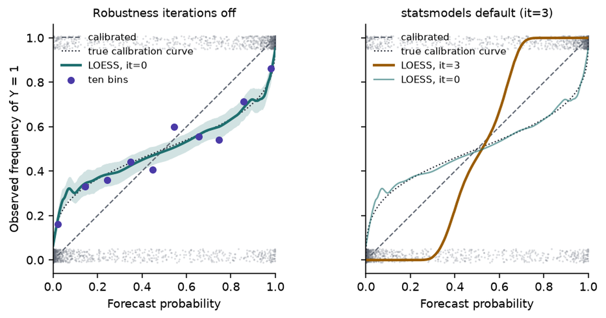

A weather service can be well calibrated across a country and still be wrong about one valley. The same holds for a model sold to many customers: calibration measured on the vendor's evaluation set says little about the tickets, claims or patients in yours. What you need is the calibration curve on your own labelled data, a repair when it is off, and a rule that turns the repaired probability into an action.

[Part 1](../jev-system-one-model/) described Jev and what TypeSafe claims for it. [Part 2](../calibration-and-proper-scoring-rules/) defined calibration and the scores that measure it. This part estimates the calibration curve with LOESS, repairs it with a recalibration map fitted on held-out data, shows how shift breaks both, and derives the thresholds that make a calibrated probability worth having.

Statements about Jev carry a label. [vendor]{.tag-vendor} means documented by TypeSafe. [theory]{.tag-theory} means standard statistics. [inference]{.tag-inference} means our reading of documented facts. [speculation]{.tag-spec} means a hypothesis about undisclosed internals.

```{python}
#| label: setup
#| echo: false
import warnings

import matplotlib.pyplot as plt
import numpy as np
import pandas as pd
import statsmodels.api as sm
from IPython.display import Markdown
from scipy.special import expit, logit
from scipy.stats import norm
from sklearn.isotonic import IsotonicRegression
from statsmodels.nonparametric.smoothers_lowess import lowess

warnings.filterwarnings("ignore")
plt.rcParams.update(
    {
        "figure.dpi": 140,
        "savefig.dpi": 140,
        "figure.facecolor": "white",
        "axes.facecolor": "white",
        "font.size": 9,
        "axes.titlesize": 9,
        "axes.spines.top": False,
        "axes.spines.right": False,
    }
)
INK, MUTED, RULE = "#1F2430", "#5F6672", "#D8DBE2"
PURPLE, TEAL, AMBER, PINK, BLUE = "#4A3AA7", "#1D6E6E", "#9A5B00", "#A8437A", "#0072B2"
EPS = 1e-3  # log loss clips probabilities to [EPS, 1 - EPS]
R = 200  # every quoted range is the median and 5-95% interval over R seeds
```

## Data {#sec-data}

Every data set in this part is synthetic, drawn from the process Part 2 used, so the true probability is known and every estimate can be checked against it:

$$
X \sim N(0, 1), \qquad p^*(x) = \sigma(2x), \qquad Y \mid X = x \sim \operatorname{Bernoulli}\big(p^*(x)\big).
$$

- It stands in for a labelled sample of your own traffic for one yes/no question, such as a Noul asking whether a ticket requests a refund.
- The miscalibrated model is either the logit-scale distortion $\hat p = \sigma(\alpha \operatorname{logit} p^*)$ with $\alpha = 2.5$, or the overfitted logistic regression from Part 2 (1,000 training cases, 200 features, one of them informative).
- A wrong recalibration here costs money in @sec-decisions: refunds approved that should have been declined, and reviewers paid to look at cases the model could have settled.

```{python}
#| label: helpers
def draw(rng, n, slope=2.0, shift=0.0):
    """X ~ N(0, 1), p*(x) = sigmoid(slope * x + shift), Y ~ Bernoulli(p*)."""
    x = rng.standard_normal(n)
    p_star = expit(slope * x + shift)
    y = (rng.random(n) < p_star).astype(float)
    return x, p_star, y


def distort(p, alpha):
    return expit(alpha * logit(np.clip(p, 1e-15, 1 - 1e-15)))


def brier(p, y):
    return np.mean((p - y) ** 2)


def log_loss(p, y):
    p = np.clip(p, EPS, 1 - EPS)
    return -np.mean(y * np.log(p) + (1 - y) * np.log(1 - p))


def ece(p, y, m=15):
    idx = np.minimum((p * m).astype(int), m - 1)
    gap = sum(np.sum(idx == b) * abs(y[idx == b].mean() - p[idx == b].mean()) for b in np.unique(idx))
    return gap / len(p)


def reliability_bins(p, y, m=10):
    idx = np.minimum((p * m).astype(int), m - 1)
    rows = [(p[idx == b].mean(), y[idx == b].mean(), np.sum(idx == b)) for b in np.unique(idx)]
    return np.array(rows).T


def loess_curve(p, y, frac=0.3, it=0):
    """LOWESS of y on p: sorted x, fitted m(x). it=0 turns off robustness iterations."""
    fit = lowess(y, p, frac=frac, it=it, delta=0.005, return_sorted=True)
    xs, keep = np.unique(fit[:, 0], return_index=True)
    return xs, fit[keep, 1]


def cell(a, d=3):
    """Median over seeds, with the 5-95% interval on a second, smaller line."""
    a = np.asarray(a)
    lo, hi = np.quantile(a, [0.05, 0.95])
    return f"{np.median(a):.{d}f}<br><span class='rng'>{lo:.{d}f}–{hi:.{d}f}</span>"


def summary(a, d=3):
    a = np.asarray(a)
    return f"{np.median(a):.{d}f} [{np.quantile(a, 0.05):.{d}f}, {np.quantile(a, 0.95):.{d}f}]"


def md_table(df):
    return Markdown(df.to_markdown(index=False, disable_numparse=True))
```

## LOESS calibration curves

The target is the calibration function of the model's forecasts:

$$
m(p) = \mathbb E\big[Y \mid \hat p = p\big] = P\big(Y = 1 \mid \hat p = p\big).
$$

A calibrated model has $m(p) = p$. A reliability diagram estimates $m$ one bin at a time. LOESS estimates it as a smooth curve: at each point $p_0$ it fits a straight line to the pairs $(\hat p_i, y_i)$ nearest $p_0$, weighting close pairs more, and reads off the line's height at $p_0$ (Cleveland 1979; Austin & Steyerberg 2014 for its use on risk models).

- The outcomes are 0 or 1, but a local average of zeros and ones is a local event frequency, which is what $m$ is.
- The **span** is the fraction of the data in each local fit. A small span follows noise; a large one flattens real structure.
- Weights are tricube: $w_i = \big(1 - (d_i / d_{\max})^3\big)^3$ for the distance $d_i$ from $p_0$.

::: {.callout-note title="Statistical subtlety"}
`statsmodels.nonparametric.lowess` runs three robustness iterations by default (`it=3`). Each iteration down-weights points with large residuals. With binary outcomes every residual is large, and the minority label in a neighbourhood gets treated as an outlier, so the curve is pulled toward whichever label is locally more common. For calibration, set `it=0`. The right panel of @fig-loess shows the damage.
:::

```{python}
#| label: loess-demo
rng = np.random.default_rng(3)
x, p_star, y = draw(rng, 2000)
p_hat = distort(p_star, 2.5)
xs0, m0 = loess_curve(p_hat, y, it=0)
xs3, m3 = loess_curve(p_hat, y, it=3)
boot = []
for b in range(200):
    i = rng.integers(0, len(y), len(y))
    bx, bm = loess_curve(p_hat[i], y[i])
    boot.append(np.interp(xs0, bx, bm))
band = np.quantile(boot, [0.05, 0.95], axis=0)
true_m = expit(logit(np.clip(xs0, 1e-15, 1 - 1e-15)) / 2.5)

# How far each version lands from the true curve at five points, over seeds.
grid = np.array([0.05, 0.2, 0.5, 0.8, 0.95])
err = {0: [], 3: []}
for r in range(100):
    _, ps_r, y_r = draw(np.random.default_rng(700 + r), 2000)
    ph_r = distort(ps_r, 2.5)
    for it in err:
        gx, gm = loess_curve(ph_r, y_r, it=it)
        err[it].append(np.interp(grid, gx, gm) - expit(logit(grid) / 2.5))
rmse = {it: np.sqrt(np.mean(np.square(err[it]), axis=0)) for it in err}
```

```{python}
#| label: fig-loess
#| fig-cap: "The overconfident forecaster ($\\alpha = 2.5$), 2,000 cases. Left: outcomes jittered at 0 and 1, ten-bin reliability points, LOESS (span 0.3, no robustness iterations) with a 90% bootstrap band, and the true calibration curve. Right: the same data smoothed with statsmodels' default of three robustness iterations."
fig, axes = plt.subplots(1, 2, figsize=(7.4, 3.6), sharey=True)
jit = np.random.default_rng(4).uniform(-0.03, 0.03, len(y))
for ax in axes:
    ax.plot([0, 1], [0, 1], color=MUTED, lw=1, ls="--", label="calibrated")
    ax.scatter(p_hat, y + jit + np.where(y == 1, -0.02, 0.02), s=2, color=MUTED, alpha=0.25, lw=0)
    ax.plot(xs0, true_m, color=INK, lw=1, ls=":", label="true calibration curve")
    ax.set(xlabel="Forecast probability", xlim=(0, 1), ylim=(-0.06, 1.06))
    ax.set_aspect("equal")
mp, fr, cnt = reliability_bins(p_hat, y)
axes[0].fill_between(xs0, band[0], band[1], color=TEAL, alpha=0.2, lw=0)
axes[0].plot(xs0, m0, color=TEAL, lw=2, label="LOESS, it=0")
axes[0].scatter(mp, fr, s=22, color=PURPLE, zorder=3, label="ten bins")
axes[0].set(title="Robustness iterations off", ylabel="Observed frequency of Y = 1")
axes[1].plot(xs3, m3, color=AMBER, lw=2, label="LOESS, it=3")
axes[1].plot(xs0, m0, color=TEAL, lw=1.2, alpha=0.6, label="LOESS, it=0")
axes[1].set(title="statsmodels default (it=3)")
axes[0].legend(frameon=False, loc="upper left", fontsize=7.5)
axes[1].legend(frameon=False, loc="upper left", fontsize=7.5)
plt.tight_layout()
plt.show()
```

Over 100 samples of 2,000 cases, the root-mean-square error of the LOESS curve against the true $m(p)$ at $p = 0.2$ is `{python} f"{rmse[0][1]:.3f}"` with `it=0` and `{python} f"{rmse[3][1]:.3f}"` with `it=3`; at $p = 0.8$ it is `{python} f"{rmse[0][3]:.3f}"` against `{python} f"{rmse[3][3]:.3f}"`.

### Reading the curve

Above the diagonal at $p$, the event happens more often than the model says there; below it, less often. Whether that is over- or underconfidence depends on which side of 0.5 the point sits:

| Curve at low $p$ | Curve at high $p$ | Shape | Diagnosis |
|---|---|---|---|
| above the diagonal | below the diagonal | flatter than the diagonal | overconfident |
| below the diagonal | above the diagonal | steeper than the diagonal | underconfident |
| above the diagonal | above the diagonal | shifted up | forecasts too low everywhere |
| below the diagonal | below the diagonal | shifted down | forecasts too high everywhere |

: How to read a calibration curve against the diagonal. {#tbl-reading}

::: {.callout-caution title="Common misconception"}
"LOESS above the diagonal means underconfident." It does only for $p > 0.5$. An overconfident model sits above the diagonal at low forecasts: when it says 0.04, the event happens 16% of the time. The diagnosis comes from the slope of the curve, not from which side of the diagonal one point is on.
:::

### Strengths and limits

LOESS has three advantages over bins [theory]{.tag-theory}:

- a continuous estimate of $m(p)$ at every forecast value;
- local structure, such as a bump at 0.7, that a bin would average away;
- no bin edges to choose.

Plain LOESS also has limits [theory]{.tag-theory}:

- it need not stay inside $[0, 1]$, and it need not be monotone;
- near 0 and 1 the local line extrapolates from one side, so the ends are its least reliable part;
- the curve depends on the span, and the "right" span depends on $n$ and on the curve;
- fitted and evaluated on the same data, it can chase noise.

### Diagnosis versus repair

Used **diagnostically**, LOESS answers "is the model calibrated on this data?" Used as a **recalibration map**, it becomes part of the model:

$$
p_{\mathrm{cal}} = \widehat m\big(p_{\mathrm{raw}}\big).
$$

The second use needs the discipline of any model fit. Fit $\widehat m$ on data the model was not trained on, evaluate the repaired probabilities on data $\widehat m$ was not fitted on, or cross-fit: split the calibration data into folds, fit $\widehat m$ on all folds but one, and apply it to the held-out fold.

## Recalibration maps

A recalibration map $g$ is a function from the raw probability (or logit) to a repaired probability, fitted on labelled data the model did not see. Five families cover most practice:

| Map | Form | Parameters | Monotone? | Typical failure |
|:---|:---|:---|:---|:---|
| Platt scaling | $\sigma(a z + b)$, $z = \operatorname{logit} \hat p$ | 2 | if $a > 0$ | cannot bend: wrong when the distortion is not linear in the logit |
| Temperature scaling | $\operatorname{softmax}(\mathbf z / T)$ | 1 | yes | one scale for every class; keeps the arg max |
| Isotonic regression | best non-decreasing step function | one per step | yes | steps and plateaus; outputs of exactly 0 or 1 on small samples |
| Beta calibration | $\sigma\big(a \ln \hat p - b \ln(1 - \hat p) + c\big)$ | 3 | if $a, b \ge 0$ | three parameters still limit the shape |
| LOESS, splines, GAMs | smooth function of $\hat p$ or $z$ | span or knots | not by default | needs smoothing choices and cross-fitting |

: Recalibration maps (Platt 1999; Guo et al. 2017; Zadrozny & Elkan 2002; Kull, Silva Filho & Flach 2017). {#tbl-maps}

- **Platt scaling** is logistic regression on the model's logit. For a binary model, temperature scaling is Platt scaling with $b = 0$ and $a = 1/T$.
- **Isotonic regression** is fitted by the pool-adjacent-violators algorithm: sort by $\hat p$, then merge neighbouring blocks until the block means never decrease. It suits a model whose ranking you trust and whose probabilities you do not.
- **Beta calibration** contains the identity map, and it can fit shapes that Platt's logistic curve cannot. A logistic GAM on the logit is the smooth, bounded alternative to LOESS.

No map wins everywhere. The next section measures three of them.

## Experiment: train, calibrate, test

The experiment uses three disjoint splits for each seed:

1. **Train** (1,000 cases): fit the overfitted logistic regression. The $\alpha = 2.5$ forecaster needs no training.
2. **Calibrate** (1,000 cases): fit Platt, isotonic and LOESS maps to the raw forecasts.
3. **Test** (20,000 cases): evaluate every version of the forecasts.

```{python}
#| label: calmap-fns
def fit_platt(p, y):
    z = logit(np.clip(p, 1e-12, 1 - 1e-12))
    fit = sm.Logit(y, sm.add_constant(z)).fit(disp=0)
    return lambda s: expit(fit.params[0] + fit.params[1] * logit(np.clip(s, 1e-12, 1 - 1e-12)))


def fit_isotonic(p, y):
    iso = IsotonicRegression(y_min=0, y_max=1, out_of_bounds="clip").fit(p, y)
    return iso.predict


def fit_loess(p, y, frac=0.3):
    xs, m = loess_curve(p, y, frac=frac)
    return lambda s: np.clip(np.interp(s, xs, m), 0, 1)


MAPS = {"Platt": fit_platt, "Isotonic": fit_isotonic, "LOESS": fit_loess}
```

```{python}
#| label: calmap-run
def run_calmap(model, seed):
    rng = np.random.default_rng(seed)
    if model == "mle":
        d = 200
        X = rng.standard_normal((1000, d))
        y_tr = (rng.random(1000) < expit(2 * X[:, 0])).astype(float)
        beta = sm.Logit(y_tr, sm.add_constant(X)).fit(disp=0, maxiter=100).params
        Xc, Xt = rng.standard_normal((1000, d)), rng.standard_normal((20_000, d))
        pc, pt = expit(beta[0] + Xc @ beta[1:]), expit(beta[0] + Xt @ beta[1:])
        xc, xt = Xc[:, 0], Xt[:, 0]
    else:
        xc, xt = rng.standard_normal(1000), rng.standard_normal(20_000)
        pc, pt = distort(expit(2 * xc), 2.5), distort(expit(2 * xt), 2.5)
    yc = (rng.random(1000) < expit(2 * xc)).astype(float)
    yt = (rng.random(20_000) < expit(2 * xt)).astype(float)
    out = {("Raw", "test"): pt, ("Raw", "cal"): pc, ("Truth", "test"): expit(2 * xt)}
    for name, fitter in MAPS.items():
        g = fitter(pc, yc)
        out[(name, "test")], out[(name, "cal")] = g(pt), g(pc)
    return out, yc, yt


calmap = {m: {} for m in ("alpha", "mle")}
examples = {}
for model in calmap:
    for r in range(R):
        out, yc, yt = run_calmap(model, 30_000 + r)
        for (name, split), p in out.items():
            yy = yt if split == "test" else yc
            calmap[model].setdefault((name, split), []).append((brier(p, yy), log_loss(p, yy), ece(p, yy)))
        if r == 0:
            examples[model] = (out, yt)
calmap = {m: {k: np.array(v) for k, v in d.items()} for m, d in calmap.items()}


def calmap_table(model):
    rows = []
    for name in ("Raw", "Platt", "Isotonic", "LOESS", "Truth"):
        t = calmap[model][(name, "test")]
        c = calmap[model].get((name, "cal"))
        rows.append({
            "Forecasts": name if name != "Truth" else "True $p^*$",
            "Brier (test)": cell(t[:, 0]),
            "Log loss (test)": cell(t[:, 1]),
            "ECE (test)": cell(t[:, 2]),
            "Log loss (calibration data)": cell(c[:, 1]) if c is not None else "—",
        })
    return md_table(pd.DataFrame(rows))
```

```{python}
#| label: tbl-calmap-alpha
#| tbl-cap: "Recalibrating the overconfident forecaster ($\\alpha = 2.5$). Maps fitted on 1,000 calibration cases; test metrics on 20,000 fresh cases; 200 seeds, median with 5–95% interval beneath."
calmap_table("alpha")
```

```{python}
#| label: tbl-calmap-mle
#| tbl-cap: "Recalibrating the overfitted logistic regression (200 features, one informative). Same splits and seeds."
calmap_table("mle")
```

```{python}
#| label: calmap-numbers
#| echo: false
def med(model, name, split, k):
    return np.median(calmap[model][(name, split)][:, k])


iso_same_ece_max = calmap["alpha"][("Isotonic", "cal")][:, 2].max()
def optimism(model, name):
    """Median over seeds of test log loss minus log loss on the calibration data."""
    return np.median(calmap[model][(name, "test")][:, 1] - calmap[model][(name, "cal")][:, 1])


iso_opt, platt_opt, raw_opt = optimism("mle", "Isotonic"), optimism("mle", "Platt"), optimism("mle", "Raw")
```

```{python}
#| label: fig-calmap
#| fig-cap: "One seed of the overfitted logistic regression on its 20,000 test cases: raw forecasts and the three recalibration maps, ten-bin reliability curves. The maps were fitted on a separate 1,000 calibration cases."
out, yt = examples["mle"]
fig, ax = plt.subplots(figsize=(4.6, 4.2))
ax.plot([0, 1], [0, 1], color=MUTED, lw=1, ls="--")
for (name, colour) in (("Raw", AMBER), ("Platt", PURPLE), ("Isotonic", TEAL), ("LOESS", BLUE)):
    mp, fr, _ = reliability_bins(out[(name, "test")], yt)
    ax.plot(mp, fr, "o-", ms=3.5, lw=1.4, color=colour, label=name)
ax.set(xlabel="Forecast probability", ylabel="Observed frequency of Y = 1", xlim=(0, 1), ylim=(0, 1))
ax.set_aspect("equal")
ax.legend(frameon=False, loc="upper left")
plt.tight_layout()
plt.show()
```

What the two tables show:

- All three maps cut test ECE and test log loss for both models. Platt does best on the $\alpha = 2.5$ forecaster, where the distortion is linear in the logit and Platt is the correct model for it.
- No map recovers the true $p^*$ for the overfitted regression. Recalibration fixes the calibration term; the 199 noise features have already damaged the ranking, and a monotone map cannot restore resolution.
- On its own calibration data, isotonic regression has an ECE of zero on every seed, up to rounding error (largest value `{python} f"{iso_same_ece_max:.1e}"`). Every pooled block of the fit has one fitted value equal to the mean of its labels, and a block's cases all land in the same bin, so every bin's forecast and frequency agree.
- On the regression model, isotonic regression's log loss on its own calibration data is lower than on test data by a median of `{python} f"{iso_opt:.3f}"` per seed. Platt's two parameters differ by `{python} f"{platt_opt:+.3f}"`, as close to zero as the unfitted raw forecasts (`{python} f"{raw_opt:+.3f}"`). The more flexible the map, the more its own fit flatters it.

::: {.callout-caution title="Common misconception"}
"The recalibrated model has an ECE of 0.000." On the data the map was fitted to, isotonic regression always does. Evaluate a recalibration map on data it has not seen.
:::

## Domain shift

Suppose Jev's probabilities are calibrated on the distribution TypeSafe evaluates on. That does not imply

$$
P\big(Y = 1 \mid \hat p = 0.9, \text{my hospital}\big) = 0.9
\quad\text{or}\quad
P\big(Y = 1 \mid \hat p = 0.9, \text{my fraud data}\big) = 0.9.
$$

Calibration is a property of a model *on a distribution*, and four versions of it differ in what they condition on [theory]{.tag-theory} (Van Calster et al. 2016; Hébert-Johnson et al. 2018):

1. **Marginal (mean) calibration:** the average forecast equals the event rate.
2. **Calibration** in the sense of Part 2: $P(Y = 1 \mid \hat p = p) = p$ for every $p$.
3. **Subgroup calibration:** $P(Y = 1 \mid \hat p = p, G = g) = p$ for every group $g$ you care about.
4. **Conditional (strong) calibration:** $P(Y = 1 \mid X = x) = \hat p(x)$ for every input, which makes $\hat p$ the true probability.

Each implies every condition earlier in the list, with one proviso: conditional calibration implies subgroup calibration only for groups that the model's input determines. A group the model cannot see can be miscalibrated even when the forecast is the true probability given all the inputs the model sees, as the next example shows. Only conditional calibration survives a change in the input distribution with the relationship between $X$ and $Y$ held fixed; the others can fail when the mix of inputs moves (Ovadia et al. 2019 measured the effect on neural networks).

### Subgroup calibration example

Two groups of equal size share the input distribution but differ in base rate: $p^*_A(x) = \sigma(2x + 0.8)$ and $p^*_B(x) = \sigma(2x - 0.8)$. A model that does not see the group, and outputs the average of the two, is calibrated overall. It is even conditionally calibrated given $x$, the only input it has: $\hat p(x) = P(Y = 1 \mid X = x)$.

```{python}
#| label: subgroup
rng = np.random.default_rng(7)
n = 200_000
x = rng.standard_normal(n)
g = rng.random(n) < 0.5
p_true = expit(2 * x + np.where(g, 0.8, -0.8))
y = (rng.random(n) < p_true).astype(float)
p_hat = 0.5 * expit(2 * x + 0.8) + 0.5 * expit(2 * x - 0.8)
sub = {"All cases": np.ones(n, bool), "Group A": g, "Group B": ~g}
sub_ece = {k: ece(p_hat[s], y[s]) for k, s in sub.items()}
```

```{python}
#| label: fig-subgroup
#| fig-cap: "A model that averages over two groups, 200,000 cases. Its forecasts are calibrated on all cases together, too low for group A and too high for group B."
fig, ax = plt.subplots(figsize=(4.6, 4.2))
ax.plot([0, 1], [0, 1], color=MUTED, lw=1, ls="--")
for (k, s), colour in zip(sub.items(), (INK, PURPLE, AMBER)):
    mp, fr, _ = reliability_bins(p_hat[s], y[s])
    ax.plot(mp, fr, "o-", ms=3.5, lw=1.5, color=colour, label=f"{k}: ECE {sub_ece[k]:.3f}")
ax.set(xlabel="Forecast probability", ylabel="Observed frequency of Y = 1", xlim=(0, 1), ylim=(0, 1))
ax.set_aspect("equal")
ax.legend(frameon=False, loc="upper left")
plt.tight_layout()
plt.show()
```

The ECE is `{python} f"{sub_ece['All cases']:.3f}"` on all cases and `{python} f"{sub_ece['Group A']:.3f}"` and `{python} f"{sub_ece['Group B']:.3f}"` within the groups. A calibration check on pooled data cannot see this; one run per group can.

### Recalibrating to a shifted domain

The second experiment changes the relationship between $X$ and $Y$. A model calibrated on the source, $\hat p = \sigma(2x)$, is deployed where the truth is different, and a recalibration map is fitted on $n$ labelled cases from the new domain. Two kinds of shift:

- **Logit-linear shift**, $p^*_T(x) = \sigma(1.2x - 1)$: a lower base rate and a weaker signal. Platt's two-parameter map is the correct model for it.
- **Label-noise shift**, $p^*_T(x) = 0.15 + 0.7\,\sigma(2x)$: 15% of labels in the new domain are flipped at random. No logistic curve in the logit fits it.

```{python}
#| label: shift
SIZES = [50, 100, 300, 1000, 3000, 10_000]
SHIFTS = {
    "Logit-linear shift": lambda x: expit(1.2 * x - 1.0),
    "Label-noise shift": lambda x: 0.15 + 0.7 * expit(2 * x),
}
shift = {}
for label, truth in SHIFTS.items():
    res = {k: {n: [] for n in SIZES} for k in MAPS}
    raw, best = [], []
    for r in range(R):
        rng = np.random.default_rng(40_000 + r)
        xt = rng.standard_normal(20_000)
        pt_true = truth(xt)
        yt = (rng.random(20_000) < pt_true).astype(float)
        pt = expit(2 * xt)
        floor = log_loss(pt_true, yt)
        raw.append(log_loss(pt, yt) - floor)
        for n in SIZES:
            xc = rng.standard_normal(n)
            yc = (rng.random(n) < truth(xc)).astype(float)
            for k, fitter in MAPS.items():
                res[k][n].append(log_loss(fitter(expit(2 * xc), yc)(pt), yt) - floor)
    shift[label] = (res, np.array(raw))
```

```{python}
#| label: fig-shift
#| fig-cap: "Excess test log loss over the true probabilities after recalibrating on $n$ labelled cases from the new domain; median and 5–95% band over 200 seeds, on log axes. The dotted line is the source model with no recalibration. On a finite test set the excess can dip below zero; the log scale cuts those seeds off the bottom of the Platt band."
fig, axes = plt.subplots(1, 2, figsize=(7.6, 3.4), sharey=True)
for ax, (label, (res, raw)) in zip(axes, shift.items()):
    for (k, colour) in zip(MAPS, (PURPLE, TEAL, BLUE)):
        q = np.array([np.quantile(res[k][n], [0.05, 0.5, 0.95]) for n in SIZES])
        ax.fill_between(SIZES, q[:, 0], q[:, 2], color=colour, alpha=0.12, lw=0)
        ax.plot(SIZES, q[:, 1], "o-", ms=3.5, lw=1.4, color=colour, label=k)
    ax.axhline(np.median(raw), color=INK, lw=1, ls=":")
    ax.set(xscale="log", yscale="log", title=label, xlabel="Labelled cases from the new domain")
axes[0].set_ylabel("Excess log loss")
axes[0].legend(frameon=False)
plt.tight_layout()
plt.show()


def excess(label, k, n):
    return np.median(shift[label][0][k][n])


def first_ahead(label, a, b):
    """Smallest n at which map a has lower median excess than map b."""
    return next((n for n in SIZES if excess(label, a, n) < excess(label, b, n)), None)
```

- With no recalibration the source model's excess log loss is `{python} f"{np.median(shift['Logit-linear shift'][1]):.3f}"` under the logit-linear shift and `{python} f"{np.median(shift['Label-noise shift'][1]):.3f}"` under label noise.
- Under the logit-linear shift, Platt's map with 100 labels brings the excess to `{python} f"{excess('Logit-linear shift', 'Platt', 100):.4f}"`. Isotonic regression is still at `{python} f"{excess('Logit-linear shift', 'Isotonic', 1000):.4f}"` with 1,000 labels.
- Under label noise, Platt levels off near `{python} f"{excess('Label-noise shift', 'Platt', 10_000):.4f}"` because it has the wrong shape. LOESS is ahead of it from `{python} f"{first_ahead('Label-noise shift', 'LOESS', 'Platt'):,}"` labels and reaches `{python} f"{excess('Label-noise shift', 'LOESS', 10_000):.4f}"` at 10,000; isotonic regression is ahead only from `{python} f"{first_ahead('Label-noise shift', 'Isotonic', 'Platt'):,}"`.

A two-parameter map wins when its shape is right and data are scarce; a flexible map wins when data are plentiful and the shape is unknown. Which regime you are in is an empirical question about your data.

### Implications for Jev

- TypeSafe states that "Jev is not fine-tuned or LoRA-adapted with customer data" and that "the same weights serve every account" [vendor]{.tag-vendor}. Any calibration on your distribution is therefore something you check and, if needed, repair yourself [inference]{.tag-inference}.
- The documentation says English is where accuracy is best and asks users to "test on your own content" for other languages [vendor]{.tag-vendor}. Language is a subgroup to calibrate on separately.
- TypeSafe advises pinning a versioned model ID if you have tuned thresholds against it [vendor]{.tag-vendor}. A recalibration map is tuned in the same sense and belongs to one version.
- The documentation lists a Noul and its negation on one ticket at 0.72 and 0.47, which sum to 1.19, and says "`P(noul)` and `1 - P(not noul)` may not be directly comparable" [vendor]{.tag-vendor}. Calibrate each question in the wording you deploy, and do not derive one polarity from the other.

A calibration check for one Noul question looks like this. The code is not run here: it needs an API key and a labelled sample of your own tickets. The SDK names follow TypeSafe's Python documentation.

```python
import numpy as np
from typesafe_sdk import Noul, TypeSafeClient
from sklearn.isotonic import IsotonicRegression

client = TypeSafeClient(model="jev-1.13.0")  # pin the version the map is fitted to
question = {"refund": Noul(instructions="Does this message request a refund?")}

def jev_probability(ticket):
    return client.system_one(ticket, question).nouls["refund"].noul

# tickets, labels: a random sample of your own traffic, labelled by people.
p = np.array([jev_probability(t) for t in tickets])
y = np.array(labels, dtype=float)
cal, test = np.arange(len(y)) % 2 == 0, np.arange(len(y)) % 2 == 1

# 1. Diagnose on one half: LOESS with it=0, reliability bins, Brier and log loss.
# 2. Fit the map on that half; evaluate it on the other half only.
g = IsotonicRegression(y_min=0, y_max=1, out_of_bounds="clip").fit(p[cal], y[cal])
p_repaired = g.predict(p[test])
```

How many labels the diagnosis needs follows from the binomial standard error: a bin of $n_b$ cases estimates its frequency to about $\sqrt{p(1-p)/n_b}$. At $p = 0.9$, a bin of 100 cases gives a standard error of 0.03, so a gap of 0.05 is at the edge of detection. Checking the region above a 0.9 threshold therefore needs a few hundred labelled cases in that region, not a few hundred overall.

## Decisions {#sec-decisions}

A probability is worth calibrating because actions depend on it. Suppose a refund-routing system receives $P(\text{warranted}) = 0.999$ for one ticket and $0.71$ for another. The first can be approved automatically at almost any cost of error; the second cannot, unless mistakes are cheap. Statistical decision theory makes that precise.

### Expected loss

With actions $a$, outcomes $y$ and a loss $L(a, y)$, the Bayes action minimises expected loss under the predictive distribution:

$$
a^*(x) = \arg\min_a \sum_y L(a, y)\, P(y \mid x).
$$

The rule uses $P(y \mid x)$ as a probability. If the model's number is not one, because it is miscalibrated, the rule optimises the wrong expectation.

### Two actions: a cost-derived threshold

Approve or decline a refund. Approving an unwarranted refund costs $c_{\mathrm{FP}}$; declining a warranted one costs $c_{\mathrm{FN}}$; correct actions cost nothing. With $p = P(\text{warranted} \mid x)$:

$$
\mathbb E[L(\text{approve})] = (1 - p)\,c_{\mathrm{FP}}, \qquad \mathbb E[L(\text{decline})] = p\,c_{\mathrm{FN}}.
$$

Approve when the first is smaller:

$$
p > p_0 = \frac{c_{\mathrm{FP}}}{c_{\mathrm{FP}} + c_{\mathrm{FN}}}.
$$

This is Elkan's (2001) threshold. With $c_{\mathrm{FP}} = 10$ and $c_{\mathrm{FN}} = 40$, $p_0 = 0.2$: declining a warranted refund is four times worse, so approval starts at a low probability. The threshold is only as good as the probability it is applied to.

### Three actions: human review

Add a third action, send to a person, at cost $c_{\mathrm{H}}$ whatever the outcome. Review beats both automatic actions when $c_{\mathrm{H}} < (1 - p)\,c_{\mathrm{FP}}$ and $c_{\mathrm{H}} < p\,c_{\mathrm{FN}}$, that is, for

$$
\frac{c_{\mathrm{H}}}{c_{\mathrm{FN}}} < p < 1 - \frac{c_{\mathrm{H}}}{c_{\mathrm{FP}}}.
$$

This is Chow's (1970) reject option in cost form. When the interval is empty, review is never worth its cost and the two-action threshold applies.

```{python}
#| label: decisions
X_GRID = np.linspace(-8, 8, 4001)
W = norm.pdf(X_GRID)
W /= W.sum()


def actions(p, c_fp, c_fn, c_h):
    """0 = decline, 1 = review, 2 = approve: the Bayes action if p were the true probability."""
    lo, hi = c_h / c_fn, 1 - c_h / c_fp
    if lo < hi:
        return np.where(p < lo, 0, np.where(p > hi, 2, 1)), (lo, hi)
    p0 = c_fp / (c_fp + c_fn)
    return np.where(p > p0, 2, 0), (p0, p0)


def cost_per_1000(p_used, p_true, c_fp, c_fn, c_h):
    a, _ = actions(p_used, c_fp, c_fn, c_h)
    cost = np.select([a == 0, a == 1, a == 2], [p_true * c_fn, np.full_like(p_true, c_h), (1 - p_true) * c_fp])
    return 1000 * np.sum(W * cost), 1 - np.sum(W * (a == 1))


C = dict(c_fp=10.0, c_fn=40.0, c_h=3.0)
p_star = expit(2 * X_GRID)
p_raw = distort(p_star, 2.5)
cost_raw, auto_raw = cost_per_1000(p_raw, p_star, **C)
cost_cal, auto_cal = cost_per_1000(p_star, p_star, **C)
_, (t_lo, t_hi) = actions(p_star, **C)

# Platt fitted on 1,000 labelled cases, over seeds.
cost_platt = []
for r in range(R):
    x_c, ps_c, y_c = draw(np.random.default_rng(50_000 + r), 1000)
    g_map = fit_platt(distort(ps_c, 2.5), y_c)
    cost_platt.append(cost_per_1000(g_map(p_raw), p_star, **C)[0])
```

With $c_{\mathrm{FP}} = 10$, $c_{\mathrm{FN}} = 40$ and $c_{\mathrm{H}} = 3$, the Bayes rule declines below `{python} f"{t_lo:.3f}"`, approves above `{python} f"{t_hi:.2f}"`, and sends the cases between to review. Applied to the process in @sec-data, computed exactly by quadrature over $X$, with costs in the same units as $c_{\mathrm{FP}}$, $c_{\mathrm{FN}}$ and $c_{\mathrm{H}}$:

- **Calibrated probabilities:** `{python} f"{cost_cal:.0f}"` per 1,000 cases, with `{python} f"{100 * auto_cal:.0f}"`% handled automatically.
- **The overconfident forecaster ($\alpha = 2.5$), same thresholds:** `{python} f"{cost_raw:.0f}"` per 1,000 cases, with `{python} f"{100 * auto_raw:.0f}"`% automated. It automates more and pays for it in wrong approvals and declines.
- **After Platt recalibration on 1,000 labelled cases:** `{python} summary(cost_platt, 0)` per 1,000 cases over 200 seeds.

The widget runs the same computation. Change the costs and the distortion, and compare the cost of acting on raw and on recalibrated probabilities.

::: {#widget-routing}
:::

```{=html}
<script src="widgets.js"></script>
```

- At the default costs, raise $\alpha$ from 1 to 4. The raw forecaster's cost rises and its automation rate climbs; the recalibrated cost does not move.
- At the same costs, lower $\alpha$ below 1. The underconfident forecaster sends too many cases to review, and it also costs more than the recalibrated one.
- Raise the review cost until the review band closes. The rule collapses to the single threshold $c_{\mathrm{FP}} / (c_{\mathrm{FP}} + c_{\mathrm{FN}})$.

### Calibration versus ranking

- **Cost-derived thresholds, expected-utility decisions, abstention and escalation** all read the number as a probability. They need calibration.
- **A fixed review budget**, such as "the 50 least certain tickets each day", needs only the order of the cases, which a monotone miscalibration preserves.
- **Resource allocation and model routing** sit between the two. Sending a case to an expensive model when $P(\text{correct})$ is below a cost-derived line is a threshold decision; sending the bottom decile is a ranking decision.
- TypeSafe's routing guidance applies thresholds to its `confidence` field, a statistic of the spread of the distribution rather than a probability [vendor]{.tag-vendor}. Part 1 converts those thresholds to probabilities. A cost-derived threshold belongs on a calibrated probability [theory]{.tag-theory}.

## Synthesis

Jev combines older ideas: a foundation model's reading of text, a classifier's closed output space, a forecaster's probabilities, a decision theorist's loss, and a typed programming interface. What may be new is building the model, the API and the training objective around one map:

$$
\boxed{\text{unstructured context} \longrightarrow \text{typed probabilistic decision}}
\qquad\text{instead of}\qquad
\boxed{\text{unstructured context} \longrightarrow \text{text}}
$$

The first map is useful to software only if its probabilities mean what they say on the software's own data. The tools for checking that are the ones in this series, and they do not depend on how the model was trained.

## Open questions

The architecture questions are in Part 1. On calibration:

1. What does RLCD optimise?
2. Does a proper scoring rule enter the objective directly?
3. How does TypeSafe evaluate calibration: which metric, which binning, which sample sizes?
4. Calibration over which distribution of tasks, questions and inputs?
5. How well does calibration hold up under domain shift, across languages, and across question wordings?
6. How much does task-specific recalibration improve Jev on real workloads?

## Constraints

- All data is synthetic, with one binary outcome. Choice and Score answers need classwise or top-label maps and ordinal checks.
- The decision example has three actions with fixed costs. Real costs vary by case, and review has limited capacity.
- None of the experiments call Jev. Its calibration on any real workload remains untested in public.

Calibrate. Locally. Repair. On. Unseen. Data. Then. Let. Costs. Decide.

## References

- Austin, P. C. & Steyerberg, E. W. (2014). [Graphical assessment of internal and external calibration of logistic regression models by using loess smoothers](https://doi.org/10.1002/sim.5941). *Statistics in Medicine* 33(3), 517–535.
- Chow, C. K. (1970). [On optimum recognition error and reject tradeoff](https://doi.org/10.1109/TIT.1970.1054406). *IEEE Transactions on Information Theory* 16(1), 41–46.
- Cleveland, W. S. (1979). [Robust locally weighted regression and smoothing scatterplots](https://doi.org/10.1080/01621459.1979.10481038). *JASA* 74(368), 829–836.
- Elkan, C. (2001). [The foundations of cost-sensitive learning](https://cseweb.ucsd.edu/~elkan/rescale.pdf). *IJCAI*, 973–978.
- Guo, C., Pleiss, G., Sun, Y. & Weinberger, K. Q. (2017). [On calibration of modern neural networks](https://proceedings.mlr.press/v70/guo17a.html). *ICML*.
- Hébert-Johnson, Ú., Kim, M. P., Reingold, O. & Rothblum, G. N. (2018). [Multicalibration: calibration for the (computationally-identifiable) masses](https://proceedings.mlr.press/v80/hebert-johnson18a.html). *ICML*.
- Kull, M., Silva Filho, T. & Flach, P. (2017). [Beta calibration: a well-founded and easily implemented improvement on logistic calibration for binary classifiers](https://proceedings.mlr.press/v54/kull17a.html). *AISTATS*.
- Ovadia, Y. et al. (2019). [Can you trust your model's uncertainty? Evaluating predictive uncertainty under dataset shift](https://proceedings.neurips.cc/paper/2019/hash/8558cb408c1d76621371888657d2eb1d-Abstract.html). *NeurIPS*.
- Platt, J. C. (1999). [Probabilistic outputs for support vector machines and comparisons to regularized likelihood methods](https://doi.org/10.7551/mitpress/1113.003.0008). In *Advances in Large Margin Classifiers*, MIT Press, 61–74.
- Van Calster, B. et al. (2016). [A calibration hierarchy for risk models was defined: from utopia to empirical data](https://doi.org/10.1016/j.jclinepi.2015.12.005). *Journal of Clinical Epidemiology* 74, 167–176.
- Zadrozny, B. & Elkan, C. (2002). [Transforming classifier scores into accurate multiclass probability estimates](https://doi.org/10.1145/775047.775151). *KDD*, 694–699.
- TypeSafe (2026). Documentation: [Models](https://docs.typesafe.ai/models), [Confidence](https://docs.typesafe.ai/confidence), [Jev 1.13 jaggedness](https://docs.typesafe.ai/model-jaggedness/jev-1.13), [Python SDK](https://docs.typesafe.ai/sdk/python/usage). Accessed 2026-09-27.
- [Calibrated Decisions, Part 1: Jev and the System One Model](../jev-system-one-model/) — what Jev returns and what TypeSafe claims.
- [Calibrated Decisions, Part 2: Calibration and Proper Scoring Rules](../calibration-and-proper-scoring-rules/) — definitions, reliability diagrams, ECE and proper scores.
