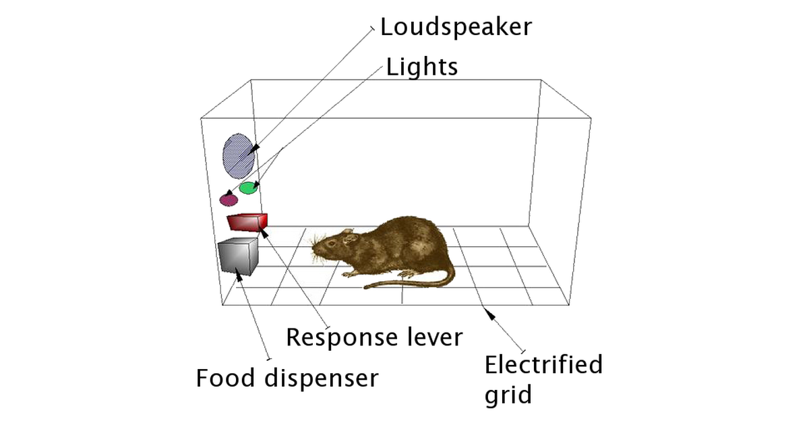

Supervised learning has an answer key. Reinforcement learning does not: an agent acts,
the world responds with a number, and the only way to find out whether an action was
good is to take it and see what follows, sometimes many steps later. That one
difference, feedback instead of labels, is where all the machinery comes from. I have
worked on reinforcement learning a few times for course exercises and once at work,
where the idea was to use Meta's Horizon platform to choose which version of an app's
notifications and interface a user saw; the early investigation did not get the go-ahead
to continue. This is the survey I wrote coming back to the field: the pieces of the
problem, the two families of method and the question that divides them, the state of
things now that generative models have the attention, and the papers worth reading.

## The problem is a Markov decision process, and the return is what is being maximised

The setting has five parts. A **state** $s$ is what the environment looks like now; an
**action** $a$ is what the agent does; a **reward** $r$ is the number that follows; a
**policy** $\pi(a \mid s)$ is the agent's rule for choosing; and a **value** is the
expected total future reward from a state ($V(s)$) or from a state and action
($Q(s, a)$), with future rewards discounted by $\gamma$ per step so the sum is finite.
The agent's goal is the return, the discounted sum of rewards, not any single reward,
and that is the whole difficulty: a move that scores nothing now can be the move that
wins later, and credit has to flow backwards through time to reach it.

Every method is a way of estimating that return from experience. The methods differ in
*what* they estimate, and that is the question the field splits on: estimate how good
each action is and act greedily, or adjust the acting rule directly.

## Value-based methods learn how good each action is

If the agent knew $Q(s, a)$ exactly, the best policy would be to take the action with
the highest $Q$ in every state. Q-learning estimates it from experience with one
update per step, moving the current estimate towards the reward just received plus the
discounted value of the best next action:

$$
Q(s, a) \leftarrow Q(s, a) + \alpha \left[ r + \gamma \max_{a'} Q(s', a') - Q(s, a) \right].
$$

The bracket is the *temporal-difference error*, the gap between what the estimate
predicted and what one step of reality plus the estimate of the rest says. Driving it
to zero makes the estimates consistent with each other and with the rewards, which is
the Bellman equation solved by iteration. The "Q" stands for quality: the quality of
taking $a$ in $s$ and behaving well afterwards.

On a small discrete problem $Q$ is a table. Gymnasium's FrozenLake, a four-by-four
grid with holes, is the standard first one. The agent explores with probability
$\epsilon$ and otherwise takes its current best guess, and $\epsilon$ has to start at
one and fall: with an all-zero table the "best guess" is a tie broken towards the
first action, so an agent that explores only a tenth of the time sits in the corner
and never finds the one reward six moves away. Starting fully random and exploring
less as the table fills, a few hundred episodes encode the safe path. The block is
illustrative and is not executed in the build.

```python
import gymnasium as gym
import numpy as np

env = gym.make("FrozenLake-v1", is_slippery=False)
Q = np.zeros((env.observation_space.n, env.action_space.n))
alpha, gamma = 0.1, 0.99

for episode in range(1000):
    epsilon = max(0.05, 1.0 - episode / 500)   # explore fully at first, then less
    state, _ = env.reset()
    done = False
    while not done:
        if np.random.rand() < epsilon:
            action = env.action_space.sample()
        else:
            action = int(np.argmax(Q[state]))
        next_state, reward, terminated, truncated, _ = env.step(action)
        done = terminated or truncated
        Q[state, action] += alpha * (reward + gamma * np.max(Q[next_state]) - Q[state, action])
        state = next_state
```

When the state is an image and the table is impossible, a neural network approximates
$Q$; that is DQN, the 2015 result that played Atari from pixels, and the tricks that
make it stable (a replay buffer, a slowly updated target network) exist because the
update above chases its own estimate.

## Policy-based methods learn the acting rule directly

The alternative is to skip the values and parameterise the policy itself,
$\pi_\theta(a \mid s)$, then adjust $\theta$ to make high-return behaviour more likely.
The objective is the expected return over trajectories $\tau$ the policy generates,

$$
J(\theta) = \mathbb{E}_{\tau \sim p_\theta}\left[ R(\tau) \right],
\qquad R(\tau) = \sum_{t} \gamma^t r_t,
$$

and the policy gradient theorem gives its gradient without differentiating through the
environment, which is the trick that makes the approach possible. The probability of a
trajectory factorises into the policy's choices and the environment's transitions, and
the transitions do not depend on $\theta$, so with the log-derivative identity
$\nabla p = p \nabla \log p$:

$$
\nabla_\theta J(\theta) = \mathbb{E}_{\tau}\left[ R(\tau) \sum_t \nabla_\theta \log \pi_\theta(a_t \mid s_t) \right].
$$

Read it as an instruction: for every action taken, push its log-probability up in
proportion to the return that followed. REINFORCE is exactly that, estimated from
sampled episodes, and on CartPole a two-layer network learns to balance the pole in a
few hundred episodes:

```python
import gymnasium as gym
import torch
import torch.nn as nn

env = gym.make("CartPole-v1")
policy = nn.Sequential(nn.Linear(4, 128), nn.ReLU(), nn.Linear(128, 2), nn.Softmax(dim=-1))
optimizer = torch.optim.Adam(policy.parameters(), lr=0.01)

for episode in range(500):
    state, _ = env.reset()
    log_probs, rewards, done = [], [], False
    while not done:
        probs = policy(torch.tensor(state, dtype=torch.float32))
        action = torch.multinomial(probs, 1).item()
        log_probs.append(torch.log(probs[action]))
        state, reward, terminated, truncated, _ = env.step(action)
        rewards.append(reward)
        done = terminated or truncated
    returns = torch.tensor([sum(rewards[t:]) for t in range(len(rewards))])
    loss = -(torch.stack(log_probs) * returns).sum()
    optimizer.zero_grad()
    loss.backward()
    optimizer.step()
```

The weakness is variance: the return of one episode is a noisy estimate of how good
each action in it was. **Actor-critic** methods answer it by keeping both a policy (the
actor) and a value estimate (the critic), and using the critic's $V(s)$ as a baseline so
the policy update is driven by how much better an action did than expected. Almost
every modern method is an actor-critic of some kind: PPO constrains how far each update
moves the policy, which is why it is the default in practice and the algorithm behind
RLHF; SAC adds an entropy bonus so the policy keeps exploring; MuZero learns a model of
the environment and plans with it.

| Method | Family | The one idea |
|---|---|---|
| DQN | value | a network for $Q$, stabilised by replay and a target network |
| PPO | actor-critic | clip the policy update so one bad batch cannot wreck it |
| SAC | actor-critic | maximise return plus entropy, for exploration |
| MuZero | model-based | learn the dynamics, then plan by search |

## Where it stands, and the criticism that stuck

The attention moved to generative models, and reinforcement learning's most visible
job now is a supporting one: RLHF, the step that turns a pretrained language model into
an assistant, is a policy-gradient method (PPO, usually) with a learned reward model
as the environment. That is a narrow use of a broad idea, and the reason is the
criticism Yann LeCun has made for years: reinforcement learning is sample-inefficient,
needing millions of interactions to learn what an animal learns in a few, because the
reward signal carries so little information per step. His cake analogy has
self-supervised learning as the cake, supervised learning as the icing, and
reinforcement learning as the cherry: real but small, and useless without the rest.
The response from the field has been to learn as much as possible without rewards
first, a world model or a pretrained network, and reserve the reinforcement signal for
the last mile, which is what RLHF does and what MuZero's learned model was reaching
for. The fundamentals did not change; what changed is how much of the problem people
now try to solve with them.

Rewards. Replace. Labels. Exploration. Costs. Time. Attention. Moved. Fundamentals. Didn't.

## References

- Sutton, R. S. and Barto, A. G. (2018). *Reinforcement Learning: An Introduction*,
  2nd ed. MIT Press. [Free online](http://incompleteideas.net/book/the-book-2nd.html)
- Sutton, R. S. (1988). Learning to predict by the methods of temporal differences.
  *Machine Learning* **3**, 9–44.
- Watkins, C. J. C. H. (1989). *Learning from Delayed Rewards*. PhD thesis, Cambridge.
- Sutton, R. S., McAllester, D., Singh, S. and Mansour, Y. (2000). Policy gradient
  methods for reinforcement learning with function approximation. *NeurIPS 12*.
- Mnih, V. et al. (2015). Human-level control through deep reinforcement learning.
  *Nature* **518**, 529–533.
- Mnih, V. et al. (2016). Asynchronous methods for deep reinforcement learning. *ICML*.
- Schulman, J. et al. (2015). Trust region policy optimization. *ICML*.
- Schulman, J. et al. (2017). Proximal policy optimization algorithms.
  [arXiv:1707.06347](https://arxiv.org/abs/1707.06347)
- Haarnoja, T. et al. (2018). Soft actor-critic. *ICML*.
- Silver, D. et al. (2016). Mastering the game of Go with deep neural networks and tree
  search. *Nature* **529**, 484–489.
- Schrittwieser, J. et al. (2020). Mastering Atari, Go, chess and shogi by planning
  with a learned model. *Nature* **588**, 604–609.
- Vinyals, O. et al. (2019). Grandmaster level in StarCraft II using multi-agent
  reinforcement learning. *Nature* **575**, 350–354.
- Ha, D. and Schmidhuber, J. (2018). World models.
  [arXiv:1803.10122](https://arxiv.org/abs/1803.10122)
- LeCun, Y. (2016). Predictive learning. Keynote, NeurIPS 2016 (the cake analogy).
- Gauci, J. et al. (2018). Horizon: Facebook's open source applied reinforcement
  learning platform. [arXiv:1811.00260](https://arxiv.org/abs/1811.00260)
- Li, Y. (2017). Deep reinforcement learning: an overview.
  [arXiv:1701.07274](https://arxiv.org/abs/1701.07274)
