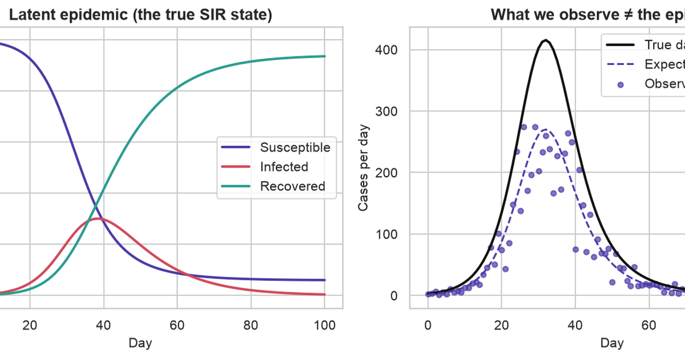

**Training:** minimize prediction error (e.g. MSE) for dynamical parameters.

**Calibration:** fit the full generative model (dynamics + observation + noise) by maximum likelihood; output predictive distributions.

This post compares both on a synthetic SIR outbreak with known truth. Dependencies: `numpy`, `scipy`, `pandas`, `matplotlib`, `seaborn`.

::: {.callout-note}
## Claims

- Parameter estimation ("training") is *not* enough for reliable epidemic forecasting.
- **Calibration** of a mechanistic model is a different task, not a fancier fit.
- Modelling **uncertainty** matters as much as fitting the mean trajectory.
- **Temporal** validation is the only honest validation for a forecast, and k-fold cross-validation quietly cheats.
- Training and calibration **complement** each other rather than compete.
:::

Setup: seeded RNG and fixed colours for truth, observations, trained, and calibrated series.

```{python}
#| label: setup
import numpy as np
import pandas as pd
import matplotlib.pyplot as plt
import seaborn as sns
from scipy.integrate import solve_ivp
from scipy.optimize import minimize
from scipy.stats import nbinom, norm

sns.set_theme(style="whitegrid", context="notebook")
plt.rcParams.update({
    "figure.dpi": 140,
    "savefig.dpi": 140,
    "font.size": 11,
    "axes.titlesize": 13,
    "axes.titleweight": "bold",
    "axes.labelsize": 11,
    "legend.frameon": True,
    "figure.autolayout": True,
})

# A single random generator so every stochastic step is reproducible.
RNG = np.random.default_rng(7)

# Consistent colours across every figure.
C_TRUTH = "#111111"      # latent (unobservable) epidemic
C_OBS = "#4A3AA7"        # observed surveillance data
C_TRAIN = "#D1495B"      # trained (MSE) model
C_CALIB = "#2A9D8F"      # calibrated (MLE) model
```

## Good fit versus forecast

Curve fits can match observed counts while mis-estimating $R_0$, peak timing, and final size. Early growth leaves $(\beta,\gamma)$ poorly identified.

- **Training** means finding point estimates of the dynamical parameters that minimize a prediction error (here, mean squared error). It answers "*what curve fits?*"
- **Calibration** means fitting the *full generative model* — the dynamics *and* the observation process *and* its noise — by maximum likelihood, so predictions arrive as **distributions** with quantifiable uncertainty. It answers "*what process, with what plausible variation, could have produced this?*"

::: {.callout-note}
## Training versus calibration (summary)

- **Calibration:** commit to SIR dynamics; estimate $\beta$, $\gamma$, $I_0$, $\rho$, $k$; output distributions.
- **Training:** minimize prediction error (MSE); often omits observation model and uncertainty.
:::

Definitions below are instantiated on one simulated outbreak.

## SIR model

**Compartmental SIR model:** populations $S$, $I$, $R$ with flows S→I at rate $\beta SI/N$ and I→R at rate $\gamma I$.

```{python}
#| label: fig-compartments
#| fig-cap: "Flow of individuals through the SIR compartments. Infection moves people S→I at a rate driven by contact between susceptibles and infecteds; recovery moves them I→R at a constant per-capita rate."
#| fig-align: center
from matplotlib.patches import FancyBboxPatch

fig, ax = plt.subplots(figsize=(9, 2.8))
ax.set_xlim(0, 9); ax.set_ylim(0, 3); ax.set_aspect("equal"); ax.axis("off")

compartments = [(1.5, C_OBS, "S", "Susceptible"),
                (4.5, C_TRAIN, "I", "Infected"),
                (7.5, C_CALIB, "R", "Recovered")]
w, h = 1.7, 1.3
for cx, color, letter, name in compartments:
    ax.add_patch(FancyBboxPatch((cx - w / 2, 1.5 - h / 2), w, h,
                                boxstyle="round,pad=0.02,rounding_size=0.22",
                                facecolor=color, edgecolor="none"))
    ax.text(cx, 1.5, letter, color="white", fontsize=30, fontweight="bold", ha="center", va="center")
    ax.text(cx, 0.45, name, color="#333333", fontsize=12, ha="center", va="center")

arrow_kw = dict(arrowprops=dict(arrowstyle="-|>", lw=2.2, color="#333333"))
ax.annotate("", xy=(3.55, 1.5), xytext=(2.45, 1.5), **arrow_kw)
ax.annotate("", xy=(6.55, 1.5), xytext=(5.45, 1.5), **arrow_kw)
ax.text(3.0, 2.15, r"$\beta\,S I / N$", ha="center", fontsize=14)
ax.text(6.0, 2.15, r"$\gamma\,I$", ha="center", fontsize=14)
ax.text(3.0, 1.72, "infection", ha="center", fontsize=9, color="#666666")
ax.text(6.0, 1.72, "recovery", ha="center", fontsize=9, color="#666666")
plt.show()
```

Flow equations:

$$
\frac{dS}{dt} = -\beta \frac{S I}{N}, \qquad
\frac{dI}{dt} = \beta \frac{S I}{N} - \gamma I, \qquad
\frac{dR}{dt} = \gamma I .
$$

**Interpreting each symbol:**

| Symbol | Meaning | Why it matters |
|---|---|---|
| $S, I, R$ | Count in each compartment | The state of the epidemic at time $t$ |
| $N = S+I+R$ | Total population (constant) | Sets the scale; $I/N$ is the infectious fraction |
| $\beta$ | Transmission rate (per day) | How fast the disease spreads on contact |
| $\gamma$ | Recovery rate (per day) | $1/\gamma$ is the average infectious period |
| $R_0 = \beta/\gamma$ | Basic reproduction number | Expected secondary cases from one case in a fully susceptible population |

$R_0=\beta/\gamma$. Peak at $S/N=1/R_0$. Wrong $R_0$ mis-forecasts future dynamics even when past counts fit.

## Synthetic data

**Synthetic SIR:** $N=10{,}000$, $\beta=0.30$, $\gamma=0.10$ ($R_0=3.0$), $I_0=10$, 100 days.

**Observation layer:** reporting rate $\rho=0.65$; counts $\sim\text{NB}(\mu=\rho\cdot\text{incidence}, k=10)$.

Simulated because real surveillance lacks ground-truth $\beta,\gamma,\rho$. Stands in for early-outbreak bed planning where $R_0$ errors change capacity decisions.

```{python}
#| label: constants
N = 10_000.0          # population size
N_DAYS = 100          # length of the simulation (days)
t = np.arange(0, N_DAYS + 1)

# The true data-generating parameters (unknown to our estimators later).
TRUE = dict(
    beta=0.30,   # transmission rate  -> R0 = 3.0
    gamma=0.10,  # recovery rate      -> 10-day infectious period
    I0=10.0,     # initially infected
    rho=0.65,    # reporting rate: only 65% of infections get counted
    k=10.0,      # negative-binomial dispersion of the reporting noise
)


def sir_rhs(_t: float, y: np.ndarray, beta: float, gamma: float) -> list[float]:
    """Right-hand side of the SIR ODE system."""
    S, I, R = y
    new_infections = beta * S * I / N
    return [-new_infections, new_infections - gamma * I, gamma * I]


def solve_sir(beta: float, gamma: float, I0: float) -> np.ndarray:
    """Integrate the SIR system on the daily grid; returns array of shape (3, T)."""
    sol = solve_ivp(
        sir_rhs, [0, N_DAYS], [N - I0, I0, 0.0],
        args=(beta, gamma), t_eval=t, rtol=1e-8, atol=1e-8,
    )
    return sol.y


def daily_incidence(beta: float, gamma: float, I0: float) -> np.ndarray:
    """New infections per day = the S->I flow, which is what surveillance tries to count."""
    S, I, _R = solve_sir(beta, gamma, I0)
    return beta * S * I / N
```

Observed quantity: daily reported cases, not latent $(S,I,R)$. Incidence is the S→I flow.

1. **Under-reporting.** Only a fraction $\rho = 0.65$ of new infections are ever recorded. People without symptoms never present, tests are scarce, and results arrive late or not at all.
2. **Over-dispersed noise.** Real case counts bounce around more than pure chance would explain — weekend effects, batches of results dumped on one day, clusters in a single workplace. Statisticians call that extra bounce **over-dispersion**, measured against the Poisson distribution, the standard model for counts of independent rare events. The **Negative Binomial** distribution adds a dial for it: for a mean $\mu$ and dispersion parameter $k$, its variance is $\mu + \mu^2/k$, which is always larger than the Poisson variance $\mu$, and gets closer to it as $k$ grows.

```{python}
#| label: generate-data
latent_incidence = daily_incidence(TRUE["beta"], TRUE["gamma"], TRUE["I0"])


def nb_sample(mean: np.ndarray, k: float, rng: np.random.Generator) -> np.ndarray:
    """Draw Negative-Binomial counts with given mean and dispersion k (NumPy's n=k, p param)."""
    mean = np.asarray(mean, dtype=float)
    p = k / (k + mean)          # so that E[counts] = k*(1-p)/p = mean
    return rng.negative_binomial(k, p)


observed = nb_sample(TRUE["rho"] * latent_incidence, TRUE["k"], RNG).astype(float)

S_true, I_true, R_true = solve_sir(TRUE["beta"], TRUE["gamma"], TRUE["I0"])
```

```{python}
#| label: fig-latent-vs-observed
#| fig-cap: "Left: the latent SIR epidemic in each compartment. Right: the true daily incidence (black) versus what surveillance actually records — under-reported, noisy case counts (purple). We only ever get to fit the purple dots."
#| fig-align: center
fig, (axL, axR) = plt.subplots(1, 2, figsize=(11, 4.2))

axL.plot(t, S_true, label="Susceptible", color=C_OBS, lw=2)
axL.plot(t, I_true, label="Infected", color=C_TRAIN, lw=2)
axL.plot(t, R_true, label="Recovered", color=C_CALIB, lw=2)
axL.set_title("Latent epidemic (the true SIR state)")
axL.set_xlabel("Day"); axL.set_ylabel("Individuals")
axL.legend()

axR.plot(t, latent_incidence, color=C_TRUTH, lw=2, label="True daily incidence")
axR.plot(t, TRUE["rho"] * latent_incidence, color=C_OBS, lw=1.5, ls="--",
         label=f"Expected reported (×{TRUE['rho']})")
axR.scatter(t, observed, s=18, color=C_OBS, alpha=0.7, label="Observed cases (noisy)")
axR.set_title("What we observe ≠ the epidemic")
axR.set_xlabel("Day"); axR.set_ylabel("Cases per day")
axR.legend()
plt.show()
```

Fitting counts without an observation model confounds reporting and severity.

## Temporal validation

In ordinary supervised learning we shuffle the rows and split at random, or run k-fold cross-validation — carve the data into k parts, hold each out in turn, average the scores. For a **forecasting** problem driven by an ODE, both are quietly invalid.

- **Random splits leak the future into the past.** If day 60 is in your training set and day 40 in your test set, you've used post-peak information to "predict" the growth phase. The whole point of a forecast is that the future is unavailable; a random split pretends otherwise.
- **K-fold cross-validation assumes exchangeable samples.** Epidemic days are anything but — each day is the deterministic consequence of the days before it. Folding across time destroys the causal ordering that the model is supposed to respect.

The only honest protocol is a **chronological split**: train on the earliest data, validate on a later contiguous block, test on the latest, and never let a stage see a day that had not happened yet when the forecast was made.

```{python}
#| label: splits
train_idx = np.arange(0, 36)    # days 0-35   : early growth, what you'd have "now"
val_idx = np.arange(36, 66)     # days 36-65  : spans the turnover / peak
test_idx = np.arange(66, 101)   # days 66-100 : the genuine out-of-sample future
```

```{python}
#| label: fig-splits
#| fig-cap: "Chronological train / validation / test split. Each stage only ever sees data to its left; the test block is never touched until the final evaluation."
#| fig-align: center
fig, ax = plt.subplots(figsize=(10, 4))
ax.scatter(t, observed, s=16, color=C_OBS, alpha=0.7, zorder=3)
spans = [(0, 35, "#8ecae6", "Train (0–35)"),
         (35, 65, "#ffd166", "Validation (36–65)"),
         (65, 100, "#ef9a9a", "Test (66–100)")]
for x0, x1, color, label in spans:
    ax.axvspan(x0, x1, color=color, alpha=0.30, label=label)
for boundary in (35, 65):
    ax.axvline(boundary, color="#444444", ls="--", lw=1)
ax.set_title("Temporal validation: information available at each stage")
ax.set_xlabel("Day"); ax.set_ylabel("Observed cases per day")
ax.legend(loc="upper right")
plt.show()
```

Train: days 0–35; validation: 36–65 (peak region); test: 66–100 (future).

## MSE training

Minimize MSE on training window for $(\beta,\gamma)$ with $\rho=1$ implicit. Optimizer: Nelder–Mead on $(\log\beta,\log\gamma)$.

```{python}
#| label: train-model
def mse_loss(log_theta: np.ndarray) -> float:
    beta, gamma = np.exp(log_theta)
    model = daily_incidence(beta, gamma, TRUE["I0"])   # assumes rho = 1
    return float(np.mean((model[train_idx] - observed[train_idx]) ** 2))


train_res = minimize(
    mse_loss, np.log([0.4, 0.2]), method="Nelder-Mead",
    options=dict(xatol=1e-6, fatol=1e-6, maxiter=2000),
)
beta_hat, gamma_hat = np.exp(train_res.x)
trained_R0 = beta_hat / gamma_hat
trained_curve = daily_incidence(beta_hat, gamma_hat, TRUE["I0"])

# Give the point-forecast a minimal (Gaussian, homoscedastic) noise model so we can
# later score it probabilistically. Its spread is the training residual scale.
sigma_hat = float(np.sqrt(np.mean((observed[train_idx] - trained_curve[train_idx]) ** 2)))

# Final attack rate = fraction of the population ever infected = (N - S_end) / N.
# This is what the model believes about the *latent* epidemic, not the reported cases.
true_attack = float((N - solve_sir(TRUE["beta"], TRUE["gamma"], TRUE["I0"])[0][-1]) / N * 100)
trained_attack = float((N - solve_sir(beta_hat, gamma_hat, TRUE["I0"])[0][-1]) / N * 100)

print(f"trained beta = {beta_hat:.3f}   gamma = {gamma_hat:.3f}   R0 = {trained_R0:.2f}")
print(f"true    beta = {TRUE['beta']:.3f}   gamma = {TRUE['gamma']:.3f}   R0 = {TRUE['beta']/TRUE['gamma']:.2f}")
print(f"implied final attack rate:  trained {trained_attack:.0f}%   vs true {true_attack:.0f}%")
```

```{python}
#| label: fig-trained
#| fig-cap: "Left: the trained model fits the reported case counts almost perfectly — nothing in this panel looks wrong. Right: the *same* fit implies a latent epidemic that infected only a fraction of the population it truly did. The failure is invisible in the data you can see and dramatic in the mechanism you can't."
#| fig-align: center
S_hat, _I_hat, _R_hat = solve_sir(beta_hat, gamma_hat, TRUE["I0"])
cum_true = (N - S_true) / N * 100          # % ever infected, truth
cum_trained = (N - S_hat) / N * 100        # % ever infected, as the trained model believes

fig, (axL, axR) = plt.subplots(1, 2, figsize=(11.5, 4.4))

axL.scatter(t, observed, s=16, color=C_OBS, alpha=0.55, label="Observed cases", zorder=3)
axL.plot(t, trained_curve, color=C_TRAIN, lw=2.4, label="Trained model (MSE)")
axL.axvspan(0, 35, color="#8ecae6", alpha=0.22)
axL.axvline(35, color="#666666", ls="--", lw=1)
axL.text(17, axL.get_ylim()[1] * 0.86, "training window", ha="center", color="#2a6f8e", fontsize=10)
axL.set_title("What you see: a great fit to reported cases")
axL.set_xlabel("Day"); axL.set_ylabel("Reported cases per day")
axL.legend(loc="upper right")

axR.plot(t, cum_true, color=C_TRUTH, lw=2.4, label="True infections")
axR.plot(t, cum_trained, color=C_TRAIN, lw=2.4, label="Trained model believes")
axR.fill_between(t, cum_trained, cum_true, color=C_TRAIN, alpha=0.10)
axR.annotate(f"{true_attack:.0f}% infected", xy=(100, true_attack), xytext=(60, true_attack - 15),
             color=C_TRUTH, fontsize=11, fontweight="bold",
             arrowprops=dict(arrowstyle="->", color=C_TRUTH))
axR.annotate(f"only {trained_attack:.0f}%", xy=(100, trained_attack), xytext=(60, trained_attack + 9),
             color=C_TRAIN, fontsize=11, fontweight="bold",
             arrowprops=dict(arrowstyle="->", color=C_TRAIN))
axR.set_title(rf"What you don't: a wrong epidemic ($R_0$ = {trained_R0:.2f} vs 3.0)")
axR.set_xlabel("Day"); axR.set_ylabel("Cumulative % ever infected")
axR.set_ylim(0, 100); axR.legend(loc="center right")
plt.show()
```

MSE fit matches counts but underestimates $R_0$ and final attack rate when $\rho<1$. Confounds $\rho$ and severity. Delivers a point forecast only.

## Maximum-likelihood calibration

Calibration maximizes Negative Binomial likelihood over $(\beta,\gamma,I_0,\rho,k)$.

- the **observation model** — the reporting rate $\rho$ that connects true incidence to counted cases,
- the **initial condition** $I_0$, treated as unknown rather than assumed,
- the **dispersion** $k$ of the noise, which sets how wide our predictive intervals should be,
- and, jointly, the **dynamics** $\beta, \gamma$ — now estimated *through* a correct observation model rather than against a misspecified one.

The likelihood is the Negative Binomial from the simulation, now used in the other direction. Given a set of parameters, the model predicts a mean number of reported cases on day $t$, $\mu_t = \rho \cdot \text{incidence}_t$, and treats each observation as a draw $y_t \sim \text{NB}(\mu_t, k)$. Multiply those probabilities across days, take logs, and minimizing the negative of that sum finds the parameters under which the observed counts are least surprising.

One choice of window matters. We fit on train **and** validation rather than train alone, because the validation block is where the peak lives. A curve that is still climbing looks much the same whether the disease is milder or the reporting is worse. A curve that has turned over does not: the day it turns is set by the dynamics, at $S/N = 1/R_0$, while $\rho$ only scales the whole curve up or down. Including the bend is what lets the fit tell the two apart.

```{python}
#| label: calibrate
FIT_idx = np.arange(0, 66)   # train + validation


def neg_log_lik(log_theta: np.ndarray) -> float:
    beta, gamma, I0, rho, k = np.exp(log_theta)
    mean = rho * daily_incidence(beta, gamma, I0) + 1e-6
    p = k / (k + mean[FIT_idx])
    ll = nbinom.logpmf(observed[FIT_idx], k, p)
    if not np.all(np.isfinite(ll)):
        return 1e12
    return float(-np.sum(ll))


x0 = np.log([0.35, 0.12, 8.0, 0.5, 8.0])
calib_res = minimize(
    neg_log_lik, x0, method="Nelder-Mead",
    options=dict(xatol=1e-7, fatol=1e-7, maxiter=8000),
)
cb, cg, cI0, crho, ck = np.exp(calib_res.x)
calib_R0 = cb / cg

summary = pd.DataFrame({
    "parameter": ["beta", "gamma", "R0", "I0", "reporting rho", "dispersion k"],
    "true": [TRUE["beta"], TRUE["gamma"], TRUE["beta"]/TRUE["gamma"], TRUE["I0"], TRUE["rho"], TRUE["k"]],
    "trained (MSE)": [beta_hat, gamma_hat, trained_R0, TRUE["I0"], np.nan, np.nan],
    "calibrated (MLE)": [cb, cg, calib_R0, cI0, crho, ck],
}).round(3)
summary
```

Modelling how the data were made puts $R_0$ back roughly where it belongs: `{python} f"{calib_R0:.2f}"` against a true $3.00$, off by about seven percent where MSE training was off by half. The reporting rate comes back at `{python} f"{crho:.2f}"` against a true $0.65$ and the dispersion at `{python} f"{ck:.1f}"` against a true $10$ — neither of which the trained model could even represent, which is what the `NaN`s in its column mean. **You cannot calibrate what you refuse to model.**

## MSE loss and count noise

The objective did most of that work, so it is worth seeing why. Compare the two losses for a mean prediction $\mu_t$ and observation $y_t$:

$$
\underbrace{\mathcal{L}_{\text{MSE}} = \frac{1}{T}\sum_t (y_t - \mu_t)^2}_{\text{implicit constant-variance Gaussian}}
\qquad\text{vs.}\qquad
\underbrace{\mathcal{L}_{\text{NLL}} = -\sum_t \log \text{NB}(y_t \mid \mu_t, k)}_{\text{explicit over-dispersed count model}} .
$$

Choosing squared error is not choosing "no noise model". Up to a constant, MSE *is* the negative log-likelihood of a Gaussian whose variance is the same on every day. For epidemic counts that is a bad assumption in a specific way: near the peak the counts run to hundreds and wobble by tens, while in the tail they are single digits and wobble by ones. Assuming one variance throughout means the peak dominates the fit, and a miss of five cases on day 3 counts for exactly as much as a miss of five cases on day 40 — even though the first is a gross error and the second is a rounding difference.

The Negative Binomial log-likelihood scales its expected error with the mean instead, which is the structure counts actually have. Statisticians call unequal variance across observations **heteroscedasticity**; counts are about as heteroscedastic as data gets. **Use MSE when you only need a mean and the noise is roughly constant. Use a likelihood when the noise structure carries information and you need honest intervals.**

## Laplace uncertainty

Maximum likelihood still returns a single point in parameter space, which is not yet the predictive distribution promised earlier. The uncertainty is there, though, in the *shape* of the likelihood around that point: if moving a parameter barely changes how well the data are explained, that parameter is poorly determined, and a sharp drop-off means the opposite. The matrix of second derivatives at the optimum — the Hessian — measures exactly that curvature.

The **Laplace approximation** takes the shortcut this suggests: treat the spread of plausible parameters as a Gaussian centred on the best fit, with covariance equal to the inverse Hessian. From there the rest is sampling. Draw parameter sets from that Gaussian, run each through the ODE, and draw Negative Binomial counts from each resulting curve, so that *parameter* uncertainty and *observation* noise end up folded into one predictive distribution.

```{python}
#| label: uncertainty
def numeric_hessian(f, x: np.ndarray, eps: float = 1e-4) -> np.ndarray:
    """Central finite-difference Hessian of scalar f at x."""
    n = len(x)
    H = np.zeros((n, n))
    for i in range(n):
        for j in range(n):
            xpp, xpm, xmp, xmm = (x.copy() for _ in range(4))
            xpp[i] += eps; xpp[j] += eps
            xpm[i] += eps; xpm[j] -= eps
            xmp[i] -= eps; xmp[j] += eps
            xmm[i] -= eps; xmm[j] -= eps
            H[i, j] = (f(xpp) - f(xpm) - f(xmp) + f(xmm)) / (4 * eps * eps)
    return 0.5 * (H + H.T)   # symmetrize away round-off


H = numeric_hessian(neg_log_lik, calib_res.x)
cov = np.linalg.inv(H)                       # Laplace covariance in log-parameter space

# Draw many parameter sets (parameter uncertainty), and for each draw several
# Negative-Binomial count replicates (observation noise). More draws => a smoother band.
N_SAMPLES, N_REPS = 1500, 12
param_samples = RNG.multivariate_normal(calib_res.x, cov, size=N_SAMPLES)

pred_draws = np.empty((N_SAMPLES * N_REPS, len(t)))
for m, s in enumerate(param_samples):
    beta, gamma, I0, rho, k = np.exp(s)
    mean = rho * daily_incidence(beta, gamma, I0)
    p = k / (k + mean + 1e-6)
    pred_draws[m * N_REPS:(m + 1) * N_REPS] = nbinom.rvs(k, p, size=(N_REPS, len(t)), random_state=RNG)

calib_median = np.median(pred_draws, axis=0)
calib_lo = np.percentile(pred_draws, 2.5, axis=0)
calib_hi = np.percentile(pred_draws, 97.5, axis=0)
calib_mean_curve = crho * daily_incidence(cb, cg, cI0)   # expected reported cases
```

## Probabilistic scoring

Two models now exist, one of which we know is wrong about the epidemic. The interesting question is whether an ordinary scoreboard would catch that.

Both get scored on all three splits with three metrics. **RMSE** (root mean squared error) and **MAE** (mean absolute error) measure point accuracy — how far the predicted daily case count sits from the observed one, on average. **Negative log-likelihood** measures probabilistic accuracy: does the model put probability mass where the data actually landed? Each model is scored under its *own* predictive distribution, Gaussian for the trained point-forecast and Negative Binomial for the calibrated one, so the comparison is between the forecasts each would really have issued.

```{python}
#| label: metrics
def rmse(y, mu): return float(np.sqrt(np.mean((y - mu) ** 2)))
def mae(y, mu): return float(np.mean(np.abs(y - mu)))
def gaussian_nll(y, mu, sigma): return float(-np.mean(norm.logpdf(y, loc=mu, scale=sigma)))
def nb_nll(y, mu, k):
    p = k / (k + mu + 1e-9)
    return float(-np.mean(nbinom.logpmf(y, k, p)))

splits = {"Train": train_idx, "Validation": val_idx, "Test": test_idx}
rows = []
for name, idx in splits.items():
    y = observed[idx]
    rows.append({
        "split": name, "model": "Trained (MSE)",
        "RMSE": rmse(y, trained_curve[idx]),
        "MAE": mae(y, trained_curve[idx]),
        "NLL": gaussian_nll(y, trained_curve[idx], sigma_hat),
    })
    rows.append({
        "split": name, "model": "Calibrated (MLE)",
        "RMSE": rmse(y, calib_mean_curve[idx]),
        "MAE": mae(y, calib_mean_curve[idx]),
        "NLL": nb_nll(y, calib_mean_curve[idx], ck),
    })
metrics = pd.DataFrame(rows).set_index(["split", "model"]).round(3)
metrics
```

Read the columns separately, because they disagree. On RMSE and MAE the two models are practically tied on every split — the trained model is within a case or two per day of the calibrated one, and on the test block both are under three cases of error. An accuracy-only scoreboard would call this a draw and sign off, while one of the two contestants believes the outbreak infected `{python} f"{trained_attack:.0f}"`% of the city instead of `{python} f"{true_attack:.0f}"`%.

The NLL column separates them, and by far the most on the test block — the genuinely out-of-sample days, the ones a forecast is for. That is the metric asking not "how close is your line?" but "how surprised are you by what happened?", and only the calibrated model has a spread to be surprised with. Which raises the obvious follow-up: is that spread the right width, or merely present?

```{python}
#| label: coverage
cov_rows = []
for name, idx in splits.items():
    inside = (observed[idx] >= calib_lo[idx]) & (observed[idx] <= calib_hi[idx])
    cov_rows.append({"split": name, "nominal": 0.95, "empirical coverage": float(np.mean(inside))})
coverage_tbl = pd.DataFrame(cov_rows).round(3)
coverage_tbl
```

Coverage is the plainest check there is: a 95% interval should contain about 95% of the points, no more and no less. This one contains 97% of the training days and every single validation and test day, so if it errs it errs on the wide side — a band drawn to cover 95% that ends up covering all of them is conservative rather than overconfident, which is the safer of the two ways to be wrong when someone is planning hospital capacity from it. The trained model has no interval to check at all. Its confident line is either right or wrong, with no gradation in between.

```{python}
#| label: fig-final
#| fig-cap: "The full comparison. Observed data (dots), the latent truth (black), the trained point-forecast (red), and the calibrated model with its 95% predictive band (green). The calibrated band widens where the model is genuinely less certain and contains the data across the out-of-sample horizon."
#| fig-align: center
fig, ax = plt.subplots(figsize=(11, 5))
for x0, x1, color in [(0, 35, "#8ecae6"), (35, 65, "#ffd166"), (65, 100, "#ef9a9a")]:
    ax.axvspan(x0, x1, color=color, alpha=0.12)
ax.fill_between(t, calib_lo, calib_hi, color=C_CALIB, alpha=0.20, label="Calibrated 95% interval")
ax.plot(t, calib_mean_curve, color=C_CALIB, lw=2.4, label="Calibrated model (MLE)")
ax.plot(t, trained_curve, color=C_TRAIN, lw=2.0, label="Trained model (MSE)")
ax.plot(t, TRUE["rho"] * latent_incidence, color=C_TRUTH, lw=1.6, ls="--", label="Truth (expected reported)")
ax.scatter(t, observed, s=15, color=C_OBS, alpha=0.55, label="Observed cases", zorder=3)
ymax = ax.get_ylim()[1]
for boundary in (35, 65):
    ax.axvline(boundary, color="#888888", ls=":", lw=1)
for x, label in [(17.5, "train"), (50, "validation"), (83, "test")]:
    ax.text(x, ymax * 0.03, label, ha="center", color="#555555", fontsize=10)
ax.set_title("Trained point forecast vs. calibrated predictive distribution")
ax.set_xlabel("Day"); ax.set_ylabel("Cases per day")
ax.legend(loc="upper right", framealpha=0.95)
plt.show()
```

Calibrated model yields predictive bands; trained model yields one trajectory.

## Training versus calibration

Everything so far has been one epidemic and one contrast, so it is worth pulling the differences out of the example and into a form you can carry to the next problem. The two columns below are not two settings of the same dial. They differ in what is estimated, what is optimized, what comes out, and what the answer is even claiming to be.

| Aspect | Training | Calibration |
|---|---|---|
| **Goal** | Reproduce observed data | Recover the generating process *and* quantify uncertainty |
| **Parameters** | Dynamical rates only ($\beta, \gamma$) | Full generative model ($\beta, \gamma, I_0$, reporting $\rho$, dispersion $k$) |
| **Loss** | MSE (implicit constant-variance Gaussian) | Negative log-likelihood (explicit count model) |
| **Data used** | Training window only | Train + validation (peak curvature identifies the observation model) |
| **Output** | A single point forecast | A predictive **distribution** with intervals |
| **Interpretation** | "What curve fits the past?" | "What process, with what plausible variation, produced this?" |

None of that makes training the villain. The two are **complementary, not competing**: training gives you a fast, cheap point estimate and a sanity check that the dynamics can fit the data at all, which is worth having before you spend an afternoon on likelihoods. Calibration is what makes the forecast *usable* — it corrects the observation model, recovers interpretable quantities like $R_0$, and attaches uncertainty you can act on.

## Estimation targets

Strip away the epidemiology and the contrast is not about epidemics at all. It is a statistical difference about what the estimate is *for*.

**Training** chooses parameters to make good predictions. It fits a conditional distribution of outcomes given inputs by minimizing an expected loss,

$$
\hat{\theta} = \arg\min_{\theta}\; \mathbb{E}_{(x,y)}\!\left[\mathcal{L}\big(y,\, f_\theta(x)\big)\right],
\qquad \text{modelling } P(y \mid x;\theta),
$$

where $\theta$ can be enormous — a neural surrogate carries millions of weights — and success is measured by **generalization**: accuracy on inputs you have not seen. In its purest form the model's functional form is itself learned from the data.

**Calibration** holds the model form fixed — here, the SIR equations — and infers the handful of parameters that make the simulated epidemic match reality,

$$
\theta^{*} = \arg\min_{\theta}\; D\big(y_{\text{obs}},\, y_{\text{model}}(\theta)\big),
$$

where $D$ is a discrepancy — least squares, or a negative log-likelihood — and $\theta$ is **low-dimensional and physically meaningful**: $\beta$, $\gamma$, a reporting rate, an initial count. Success is measured by **inference** — did you recover parameters that are true and interpretable, ideally with honest uncertainty? Because the mechanism already exists, epidemiologists say *calibration*, not *training*: you are solving an inverse problem for parameters, not learning a functional form.

That framing explains a choice made quietly at the top of this post: both the "trained" and the "calibrated" model were pinned to the same SIR skeleton. With the structure fixed and the parameter set small on both sides, the generalization-versus-inference and high-versus-low-dimensional contrasts fall away, and what is left is isolated and visible — a prediction-error objective against a likelihood, a point estimate against a full distribution, and whether the observation process is part of what you estimate at all.

Fixing the structure buys one more thing the flexible model cannot offer, and it only shows up when you move to a second outbreak.

## Parameter transfer

Mechanistic parameters carry meaning across outbreaks. Scenario: calibrate full epidemic in Mexico; forecast Colombia from day 22 only.

::: {.callout-note}
## Transfer scenario data

Mexico and Colombia series are simulated with shared $\gamma$, different $\beta$. Country labels illustrate cross-outbreak transfer only.
:::

Which parameters travel is not a matter of taste. It follows from what each one is a fact about.

- **Recovery rate $\gamma$** — one over the infectious period — is set by the pathogen's biology, and biology does not care which city it is in. To a first approximation this is the same disease, so $\gamma$ carries over. This is the parameter we transfer.
- **Transmission $\beta$** — contacts times per-contact risk — depends on density, mobility, and how people are behaving. Bogotá is not Mexico City, so $\beta$ has to be re-estimated locally.
- **Reporting rate $\rho$ and the noise scale** are properties of a health system rather than a disease: different country, re-estimate. Borrowing the dispersion is defensible, since it describes how lumpy reporting is in general, and that is what we do below.

```{python}
#| label: xfer-mexico
def sigmoid(x: float) -> float:
    return 1.0 / (1.0 + np.exp(-x))

def logit(p: float) -> float:
    return np.log(p / (1.0 - p))

def simulate_incidence(beta: float, gamma: float, I0: float,
                       N_pop: float, t_grid: np.ndarray) -> np.ndarray:
    """Daily new infections (the S->I flow) for a population of size N_pop."""
    def rhs(_t, y):
        S, I, R = y
        new = beta * S * I / N_pop
        return [-new, new - gamma * I, gamma * I]
    S, I, R = solve_ivp(rhs, [t_grid[0], t_grid[-1]], [N_pop - I0, I0, 0.0],
                        t_eval=t_grid, rtol=1e-7, atol=1e-7).y
    return beta * S * I / N_pop

def nb_counts(mean: np.ndarray, k: float, rng: np.random.Generator) -> np.ndarray:
    mean = np.asarray(mean, dtype=float)
    return rng.negative_binomial(k, k / (k + mean)).astype(float)

rng_x = np.random.default_rng(11)
GAMMA_BIO = 0.10   # recovery rate = disease biology, shared across both countries

# --- Mexico, last year: a full epidemic we can calibrate cleanly ---
N_MX = 20_000.0
days_mx = np.arange(0, 141)
mx_true = dict(beta=0.28, gamma=GAMMA_BIO, I0=20.0, rho=0.60, k=20.0)
mx_cases = nb_counts(mx_true["rho"] * simulate_incidence(mx_true["beta"], mx_true["gamma"],
                                                         mx_true["I0"], N_MX, days_mx),
                     mx_true["k"], rng_x)

def mx_neg_log_lik(z: np.ndarray) -> float:
    beta, gamma, I0 = np.exp(z[:3]); rho = sigmoid(z[3]); k = np.exp(z[4])
    mean = rho * simulate_incidence(beta, gamma, I0, N_MX, days_mx) + 1e-6
    ll = nbinom.logpmf(mx_cases, k, k / (k + mean))
    return 1e12 if not np.all(np.isfinite(ll)) else float(-ll.sum())

mx_fit = minimize(mx_neg_log_lik, [np.log(0.3), np.log(0.1), np.log(20), 0.0, np.log(15)],
                  method="Nelder-Mead", options=dict(xatol=1e-8, fatol=1e-8, maxiter=12000))
mx_beta, mx_gamma, mx_I0 = np.exp(mx_fit.x[:3]); mx_rho = sigmoid(mx_fit.x[3]); mx_k = np.exp(mx_fit.x[4])
mx_R0 = mx_beta / mx_gamma

# The transferred prior on gamma: the Mexican Laplace uncertainty, *inflated* to allow
# for the fact that Colombia is a different country (biology transfers, but not perfectly).
def _gamma_nll(g):
    z = mx_fit.x.copy(); z[1] = np.log(g); return mx_neg_log_lik(z)
_eps = 1e-3
gamma_laplace_sd = 1.0 / np.sqrt((_gamma_nll(mx_gamma + _eps) - 2 * _gamma_nll(mx_gamma)
                                  + _gamma_nll(mx_gamma - _eps)) / _eps ** 2)
gamma_prior_mu = mx_gamma
gamma_prior_sd = max(6 * gamma_laplace_sd, 0.012)

print(f"Mexico calibrated:  R0 = {mx_R0:.2f},  gamma = {mx_gamma:.3f}  "
      f"(infectious period ~{1/mx_gamma:.0f} days)")
print(f"transferred prior on gamma:  N({gamma_prior_mu:.3f}, {gamma_prior_sd:.3f})  "
      f"[Mexican Laplace sd was {gamma_laplace_sd:.4f}]")
```

Calibrating last year's Mexican epidemic recovers $R_0 \approx$ `{python} f"{mx_R0:.2f}"` and a recovery rate $\gamma \approx$ `{python} f"{mx_gamma:.3f}"` — an infectious period of about `{python} f"{1/mx_gamma:.0f}"` days. Having the *entire* curve, peak and tail included, pins that $\gamma$ down very tightly indeed: the Laplace standard deviation is under two thousandths.

Taken at face value that tightness is a trap, because Colombia is not Mexico and the pathogen is only related, not identical. So the code deliberately loosens it before carrying it over — six times the Mexican spread, or a floor of 0.012, whichever is wider, and here the floor is what binds. The loosened distribution is what becomes the **prior**: a statement of what we believe about $\gamma$ before seeing a single Colombian case, uncertainty included.

```{python}
#| label: xfer-colombia
# --- Colombia, this year: we only get to see the first stretch ---
N_CO = 15_000.0
days_co = np.arange(0, 151)
co_true = dict(beta=0.34, gamma=GAMMA_BIO, I0=8.0, rho=0.50, k=8.0)
co_R0 = co_true["beta"] / co_true["gamma"]
co_latent = simulate_incidence(co_true["beta"], co_true["gamma"], co_true["I0"], N_CO, days_co)
co_cases_full = nb_counts(co_true["rho"] * co_latent, co_true["k"], rng_x)

T_NOW = 22
seen, future = days_co <= T_NOW, days_co > T_NOW
t_seen, y_seen = days_co[seen], co_cases_full[seen]
k_obs = int(round(mx_k))   # borrow Mexico's surveillance dispersion

# Strategy 1: transplant Mexico's calibrated parameters onto Colombia's population.
naive_forecast = mx_rho * simulate_incidence(mx_beta, mx_gamma, co_true["I0"], N_CO, days_co)
co_peak_day = int(days_co[np.argmax(co_latent)])
print(f"Colombia true R0 = {co_R0:.1f}, peak on day {co_peak_day}; today is day {T_NOW}")
```

```{python}
#| label: fig-xfer-setup
#| fig-cap: "Left: last year's Mexican epidemic, observed to completion and cleanly calibrated. Right: this year in Colombia, we stand on day 22 — only the growth phase is visible (blue), while the true peak (day 30) and everything after (grey) are still in the future."
#| fig-align: center
C_MX = "#E8A03D"
mx_fit_curve = mx_rho * simulate_incidence(mx_beta, mx_gamma, mx_I0, N_MX, days_mx)

fig, (axL, axR) = plt.subplots(1, 2, figsize=(11.5, 4.2))
axL.scatter(days_mx, mx_cases, s=12, color=C_MX, alpha=0.5, label="Mexico cases (last year)")
axL.plot(days_mx, mx_fit_curve, color="#9c6b16", lw=2, label="Mexico calibrated fit")
axL.set_title(rf"Last year — Mexico (calibrated, $R_0$={mx_R0:.2f})")
axL.set_xlabel("Day"); axL.set_ylabel("Reported cases/day"); axL.legend()

axR.plot(days_co, co_true["rho"] * co_latent, color=C_TRUTH, ls="--", lw=1.6, label="Colombia truth (hidden)")
axR.scatter(t_seen, y_seen, s=20, color=C_OBS, alpha=0.75, label=f"Observed so far (day ≤ {T_NOW})")
axR.scatter(days_co[future], co_cases_full[future], s=10, color="#bbbbbb", alpha=0.5, label="Future (not yet seen)")
axR.axvline(T_NOW, color="#444444", ls=":", lw=1)
axR.axvline(co_peak_day, color=C_TRAIN, ls=":", lw=1)
axR.text(co_peak_day + 2, axR.get_ylim()[1] * 0.85, "true peak", color=C_TRAIN, fontsize=9)
axR.set_title(rf"This year — Colombia, mid-growth (true $R_0$={co_R0:.1f})")
axR.set_xlabel("Day"); axR.set_ylabel("Reported cases/day"); axR.legend(loc="upper right", fontsize=8)
plt.show()
```

On day `{python} T_NOW` the Colombian data is all growth — an exponential-looking climb that, as the [SIR section](#an-epidemic-is-three-buckets-and-two-rates) warned, barely distinguishes $\beta$ from $\gamma$ on its own. A fast disease that people recover from quickly and a slower one they carry for longer produce nearly the same climb. The true epidemic (dashed) will peak on day `{python} co_peak_day`, but nothing in the observed dots forces that conclusion. There are three ways to forecast from here, and they use last year's knowledge in three different amounts:

1. **Transplant** Mexico's parameters wholesale — fast, and wrong, because Colombia transmits faster.
2. **Fit Colombia alone** with vague priors — honest, but mid-growth the likelihood is a long $\beta$–$\gamma$ ridge, so the forecast is barely constrained.
3. **Bayesian calibration** — keep a flexible local $\beta$, but pin $\gamma$ with the Mexican prior, which supplies exactly the information the growth phase lacks.

## Bayesian transfer forecast

Training gave a point estimate; the maximum-likelihood calibration earlier added a likelihood and a Laplace-approximated band. Neither has anywhere to *put* the Mexican result. That is the practical case for going fully Bayesian — writing down a prior distribution over the parameters, multiplying it by the likelihood, and sampling from the product instead of approximating it — and it buys three things that matter precisely in a spot like Colombia-on-day-22.

- **Priors are how outside knowledge enters.** There is no other principled slot in the machinery to say "the infectious period is about ten days, because we measured it in Mexico last year." A prior is exactly that sentence written as a distribution, uncertainty included. Transfer across outbreaks *is* a prior.
- **Priors regularize the unidentifiable.** Mid-growth, the likelihood alone is a flat ridge in $(\beta, \gamma)$ — the data cannot separate transmission from recovery. A point estimator just picks a spot on that ridge; a Laplace approximation draws a tidy Gaussian blob that misrepresents a long, curved, open-ended one. Multiplying the ridge by the prior returns something both identified and honest.
- **You get the real posterior, not a Gaussian cartoon.** Sampling captures the *actual* shape — skewed, correlated, bounded — and pushes all of it through the ODE into the forecast, so the predictive band inherits the true parameter correlations instead of assuming them away.

The cost is real: thousands of ODE solves, plus the chore of checking that the sampler actually settled. When parameters are well-identified and roughly Gaussian, the cheap Laplace calibration is a fine stand-in and the extra compute buys little. When they are correlated, constrained, or informed by outside knowledge — all three, here — the Bayesian treatment is the one that stays honest.

Sampling a posterior sounds heavier than it is. The idea: wander around parameter space taking small random steps, and at each step, if the proposed point explains the data and fits the prior better than where you are, move there; if it explains them worse, move there anyway but only with a probability equal to how much worse. Do that long enough and the places you visit, in proportion to how often you visit them, *are* the posterior. That rule is **Metropolis–Hastings**, and the code below is a hand-written version of it: propose a small random move in $(\beta, \gamma, \rho, I_0)$, solve the SIR equations, compare log-posteriors, accept or reject.

```{python}
#| label: xfer-mcmc
def log_likelihood(beta: float, gamma: float, rho: float, I0: float) -> float:
    mean = rho * simulate_incidence(beta, gamma, I0, N_CO, t_seen) + 1e-6
    ll = nbinom.logpmf(y_seen, k_obs, k_obs / (k_obs + mean))
    return -1e12 if not np.all(np.isfinite(ll)) else float(ll.sum())

def make_log_posterior(gamma_mu: float, gamma_sd: float):
    def log_posterior(theta: np.ndarray) -> float:
        beta, gamma, rho, I0 = theta
        if beta <= 0 or gamma <= 0 or I0 <= 0 or not 0 < rho < 1:
            return -np.inf
        log_prior = (norm.logpdf(np.log(beta), np.log(0.3), 0.6)   # weak on transmission
                     + norm.logpdf(gamma, gamma_mu, gamma_sd)       # <- transferred from Mexico
                     + norm.logpdf(logit(rho), logit(0.5), 1.2)     # weak on reporting
                     + norm.logpdf(np.log(I0), np.log(10), 1.0))    # weak on seeding
        return log_prior + log_likelihood(beta, gamma, rho, I0)
    return log_posterior

def metropolis(log_posterior, n_steps: int, proposal_sd: np.ndarray,
               start, rng: np.random.Generator):
    theta = np.array(start, dtype=float)
    lp = log_posterior(theta)
    chain = np.empty((n_steps, 4))
    n_accept = 0
    for i in range(n_steps):
        proposal = theta + rng.normal(0.0, proposal_sd)
        lp_prop = log_posterior(proposal)
        if np.log(rng.random()) < lp_prop - lp:      # Metropolis acceptance
            theta, lp = proposal, lp_prop
            n_accept += 1
        chain[i] = theta
    return chain, n_accept / n_steps

PROPOSAL_SD = np.array([0.018, 0.006, 0.03, 1.2])
BURN = 5000
start = [0.34, mx_gamma, 0.5, 10.0]

# Strategy 3: informative Mexican prior on gamma. Strategy 2: a deliberately vague prior.
chain_prior, acc_prior = metropolis(make_log_posterior(gamma_prior_mu, gamma_prior_sd),
                                    16000, PROPOSAL_SD, start, rng_x)
chain_vague, acc_vague = metropolis(make_log_posterior(0.10, 0.08),
                                    16000, PROPOSAL_SD, start, rng_x)
post_prior = chain_prior[BURN::5]
post_vague = chain_vague[BURN::5]
prior_R0 = float(post_prior[:, 0].mean() / post_prior[:, 1].mean())

print(f"acceptance rate:  informative {acc_prior:.2f},  vague {acc_vague:.2f}")
print(f"Colombia R0 recovered with the Mexican prior: {prior_R0:.2f}   (true {co_R0:.1f})")
```

Two of the settings there are housekeeping worth naming. The chain starts wherever we put it, which is not yet a sample from the posterior, so the first 5,000 steps are discarded as **burn-in** — the stretch spent walking in from an arbitrary starting point. And consecutive steps are correlated by construction, so we keep every fifth one. The acceptance rates of `{python} f"{acc_prior:.2f}"` and `{python} f"{acc_vague:.2f}"` say the proposal step size is sensible: much lower and the chain barely moves, much higher and it never explores.

With the Mexican prior in place, $R_0$ for Colombia comes back at `{python} f"{prior_R0:.2f}"` against a true `{python} f"{co_R0:.1f}"` — from a curve that has not yet peaked. The next figure shows where that came from, and it was not the Colombian data alone.

```{python}
#| label: fig-xfer-posterior
#| fig-cap: "Left: the joint posterior over transmission and recovery. Colombia's growth-only data leaves a long β–γ ridge (grey); the Mexican prior on γ collapses it onto the truth (star). Right: the recovery rate itself — the transferred prior (gold) anchors the posterior near the true γ = 0.10, while the vague fit wanders across implausible infectious periods."
#| fig-align: center
fig, (axL, axR) = plt.subplots(1, 2, figsize=(11.5, 4.4))

axL.scatter(post_vague[:, 0], post_vague[:, 1], s=6, alpha=0.25, color="#bbbbbb", label="Colombia-only (vague prior)")
axL.scatter(post_prior[:, 0], post_prior[:, 1], s=6, alpha=0.35, color=C_CALIB, label="Mexican prior on γ")
axL.scatter([co_true["beta"]], [co_true["gamma"]], marker="*", s=260, color=C_TRAIN,
            edgecolor="k", zorder=5, label="truth")
axL.set_xlabel(r"$\beta$ (transmission)"); axL.set_ylabel(r"$\gamma$ (recovery)")
axL.set_title("Joint posterior: the prior breaks the β–γ ridge"); axL.legend(fontsize=8)

gs = np.linspace(0.03, 0.20, 300)
axR.hist(post_vague[:, 1], bins=40, density=True, alpha=0.4, color="#bbbbbb", label="posterior (vague)")
axR.hist(post_prior[:, 1], bins=40, density=True, alpha=0.5, color=C_CALIB, label="posterior (Mexican prior)")
axR.plot(gs, norm.pdf(gs, gamma_prior_mu, gamma_prior_sd), color="#9c6b16", lw=2, label="Mexican prior")
axR.axvline(co_true["gamma"], color=C_TRAIN, lw=2, ls="--", label="truth γ = 0.10")
axR.set_xlabel(r"$\gamma$"); axR.set_ylabel("density")
axR.set_title("Recovery rate γ: transferred, then updated"); axR.legend(fontsize=8)
plt.show()
```

The left panel is the whole story in one picture. Fit Colombia alone (grey) and the posterior smears out along a diagonal ridge in $(\beta, \gamma)$ — every point on that ridge explains the observed climb about equally well, which is what "the data cannot separate transmission from recovery" looks like when you draw it. Add the Mexican prior on $\gamma$ (teal) and the cloud collapses to a blob sitting on the truth (star). The right panel shows $\gamma$ on its own: the transferred prior anchors the posterior near the true $0.10$, while the vague version wanders over infectious periods from roughly five days to thirty — a range spanning diseases that behave nothing like each other.

A tighter posterior is only worth having if it turns into a better forecast. To find out, push each of the three strategies forward past day 22 to the end of the epidemic and score them against the days nobody had seen when the call was made. For the Bayesian runs that means drawing parameter sets from the posterior, running each through the equations, adding reporting noise, and reading off the median and the 2.5th and 97.5th percentiles across draws.

```{python}
#| label: xfer-forecast
def posterior_predictive(posterior: np.ndarray, n_draws: int = 400):
    idx = rng_x.choice(len(posterior), min(n_draws, len(posterior)), replace=False)
    draws = np.empty((len(idx), len(days_co)))
    for j, (beta, gamma, rho, I0) in enumerate(posterior[idx]):
        mean = rho * simulate_incidence(beta, gamma, I0, N_CO, days_co)
        draws[j] = nbinom.rvs(k_obs, k_obs / (k_obs + mean + 1e-6), random_state=rng_x)
    return np.percentile(draws, [2.5, 50, 97.5], axis=0)

lo_prior, med_prior, hi_prior = posterior_predictive(post_prior)
lo_vague, med_vague, hi_vague = posterior_predictive(post_vague)

def rmse(a, b): return float(np.sqrt(np.mean((a - b) ** 2)))
naive_rmse = rmse(naive_forecast[future], co_cases_full[future])
vague_rmse = rmse(med_vague[future], co_cases_full[future])
prior_rmse = rmse(med_prior[future], co_cases_full[future])
prior_cov = float(np.mean((co_cases_full[future] >= lo_prior[future]) &
                          (co_cases_full[future] <= hi_prior[future])))

pd.DataFrame({
    "strategy": ["Naive transfer (Mexico params)", "Colombia-only (vague prior)", "Bayesian + Mexican prior"],
    "prior knowledge used": ["all of it, blindly", "none", "just γ (biology)"],
    "future RMSE": [naive_rmse, vague_rmse, prior_rmse],
}).round(1)
```

```{python}
#| label: fig-xfer-forecast
#| fig-cap: "Forecasting Colombia from day 22. The naive transplant (orange) peaks late and low; the Colombia-only median (grey) undershoots; the Bayesian forecast with the Mexican prior (teal) tracks the true peak and decline, and its 95% band brackets the data we had not yet seen."
#| fig-align: center
fig, ax = plt.subplots(figsize=(11, 5))
ax.axvspan(0, T_NOW, color="#8ecae6", alpha=0.12)
ax.fill_between(days_co, lo_prior, hi_prior, color=C_CALIB, alpha=0.22, label="Bayesian 95% (Mexican prior)")
ax.plot(days_co, med_prior, color=C_CALIB, lw=2.4, label="Bayesian median")
ax.plot(days_co, naive_forecast, color=C_MX, lw=2.2, label="Naive transfer (Mexico params)")
ax.plot(days_co, med_vague, color="#9a9a9a", lw=1.8, label="Colombia-only median")
ax.plot(days_co, co_true["rho"] * co_latent, color=C_TRUTH, lw=1.6, ls="--", label="Colombia truth")
ax.scatter(t_seen, y_seen, s=18, color=C_OBS, alpha=0.75, zorder=4, label=f"Observed (≤ day {T_NOW})")
ax.scatter(days_co[future], co_cases_full[future], s=9, color="#bbbbbb", alpha=0.5, zorder=3)
ax.axvline(T_NOW, color="#444444", ls=":", lw=1)
ax.text(T_NOW / 2, ax.get_ylim()[1] * 0.04, "observed", ha="center", color="#555555", fontsize=9)
ax.set_title("Forecasting Colombia mid-epidemic, from day 22")
ax.set_xlabel("Day"); ax.set_ylabel("Reported cases/day"); ax.legend(loc="upper right", fontsize=9)
plt.show()
```

The payoff is the forecast, and the three strategies fail in different directions. The naive transplant peaks days late and far too low, because Colombia simply spreads faster than Mexico did and transplanting $\beta$ imported the wrong city. The Colombia-only fit gets the timing closer but undershoots the peak, because growth-only data left it free to choose almost any $\gamma$ and it chose badly. Only the third — flexible $\beta$, borrowed $\gamma$ — tracks the true trajectory through the unseen peak and the decline after it.

The numbers match the picture: about `{python} f"{prior_rmse:.0f}"` cases/day of error over the *future* against `{python} f"{naive_rmse:.0f}"` for the transplant, with a 95% band containing roughly `{python} f"{prior_cov:.0%}"` of the days nobody had seen when the call was made. That band is wide, and it should be. On day 22 the honest uncertainty about a peak eight days out is genuinely large; the band's job is to show that rather than hide it.

None of that is trustworthy until the sampler is. The standard first look is a trace plot: the value of each parameter against step number, which should look like a fuzzy horizontal band once the chain has settled and like a drifting line if it has not.

```{python}
#| label: fig-xfer-trace
#| fig-cap: "Metropolis chains for the Mexican-prior run (thinned). β and γ mix well and are stationary after the burn-in cutoff (dotted); ρ and I₀ wander more slowly — mid-epidemic, reporting and seeding are only weakly identified, and the chain says so honestly."
#| fig-align: center
fig, axes = plt.subplots(2, 2, figsize=(11, 5))
names = [r"$\beta$", r"$\gamma$", r"$\rho$", r"$I_0$"]
for i, ax in enumerate(axes.ravel()):
    ax.plot(chain_prior[::5, i], lw=0.6, color=C_CALIB)
    ax.axvline(BURN // 5, color="#444444", ls=":", lw=1)
    ax.set_title(names[i], fontsize=11)
fig.suptitle("Metropolis chains (dotted = burn-in cutoff)", fontweight="bold")
plt.show()
```

$\beta$ and $\gamma$ pass: they settle quickly and then hover. $\rho$ and $I_0$ drift visibly, and that is not a bug to fix but the answer to a question — mid-growth data constrains transmission and recovery far better than it constrains reporting or the size of the initial seed. A sampler that wanders on exactly the parameters the data cannot pin down is telling the truth about them.

That is the practitioner's lesson in miniature. Transfer across outbreaks is *not* "reuse the fitted object". It is deciding which parameters are **facts about the disease**, and therefore transfer as priors, and which are **facts about the place**, and therefore have to be re-estimated — then letting Bayesian calibration combine the two with the right amount of confidence in each.

## Method ladder

All three have now run on the same SIR skeleton, which makes them easy to line up. Each keeps what the one before it had and adds a layer of honesty about what it does not know — at a matching cost in compute and care.

| Aspect | Training | Calibration | Bayesian |
|---|---|---|---|
| **Goal** | Fit the observed curve | Fit the generative process + quantify uncertainty | Infer the full posterior and propagate it |
| **Estimates** | $\beta, \gamma$ (a point) | $\beta, \gamma, I_0, \rho, k$ (a point, by MLE) | A joint *distribution* over all of them |
| **Objective** | Mean squared error | Negative log-likelihood | Posterior $\propto$ likelihood $\times$ prior |
| **Prior knowledge** | none | none (flat) | encoded explicitly (e.g. transferred $\gamma$) |
| **Uncertainty** | none | Gaussian (Laplace) approximation | full posterior, any shape (MCMC) |
| **Output** | one curve | curve + approximate band | calibrated predictive distribution |
| **Unidentifiable params** | picks an arbitrary point | reports a misleading blob | regularized by the prior |
| **Cost** | lowest | low | highest (sampling + convergence checks) |
| **Reach for it when** | a quick check, with clean and plentiful data | you need honest intervals and the params are identifiable | data is partial or correlated, or you have outside knowledge to inject |

## Extended calibration methods

Everything above used deterministic equations, simple likelihoods, and posteriors we approximated by hand — first with Laplace, then with a Metropolis sampler written out in full. Production forecasting reaches for heavier tools than these, and it is worth knowing what they are and, more importantly, what they are versions of.

- **Better posterior samplers.** Our random-walk Metropolis wanders; Hamiltonian Monte Carlo, the engine inside Stan and PyMC, uses the gradient of the log-posterior to take long informed steps instead. Worth the switch when the posterior is skewed or has several separate peaks, when parameters are strongly correlated, or when there is real prior knowledge to encode.
- **Particle filters** (sequential Monte Carlo). When data arrive in a stream and you need to update the epidemic's current state *and* its parameters day by day, a particle filter carries a cloud of candidate hypotheses forward one day at a time and reweights them against each new observation. This is the natural machinery for nowcasting.
- **Ensemble Kalman filters.** A scalable middle ground once the compartmental model has many age groups or regions and the parameter count climbs, trading exact inference for Gaussian approximations that stay tractable at that size.
- **Neural ODEs and physics-informed neural networks.** For when the mechanism is only partly known: let a neural network learn the part of the dynamics your equations miss, or keep the network free but penalise it for violating the equations you do trust. Mechanistic structure where you have it, flexibility where you don't.
- **Ensemble forecasting.** Collaborative forecasting hubs combine many teams' models into a single predictive distribution, on the observation that no one model is reliably best across the growth, peak and decline phases of the same epidemic.

The through-line is that every item on that list is a richer way to do **calibration** — a better representation of uncertainty and of how the data came to exist — and not one of them is a fancier way to fit a curve.

## Summary

Six things this post actually demonstrated, rather than asserted, with the numbers that back each one.

::: {.callout-tip}
## Lessons

1. **A good fit is not a good forecast.** The trained model matched the observed counts across the whole horizon and still recovered $R_0 \approx 1.6$ against a true $3.0$ — a completely different epidemic, and a final size of 62% of the city instead of 94%.
2. **Calibration is a different task, not a better optimizer.** It fits the observation process and the noise as well as the dynamics, and returns distributions instead of points. Same data, same equations, different target.
3. **Uncertainty is a deliverable.** A forecast without an interval cannot be planned around. The calibrated 95% band covered every held-out day — conservative rather than overconfident, which is the direction you want to err in.
4. **Validate along the arrow of time.** Random splits and k-fold cross-validation leak the future into the past when the data is a trajectory, and the resulting score is not a forecast score.
5. **Model how the data were made.** Under-reporting and over-dispersion are not nuisances to smooth over. Ignoring them is precisely what corrupted the trained model's $R_0$.
6. **Meaningful parameters travel.** A Mexican prior on the recovery rate turned an unidentifiable Colombian growth curve into a usable forecast, because we transferred the *biology* ($\gamma$) and re-estimated the *place* ($\beta$ and reporting).
:::

Most of those failures show up in practice as one of a small set of habits.

**Common mistakes to avoid**

- Fitting case counts as if they were true infections (ignoring the reporting rate $\rho$).
- Assuming constant-variance noise (MSE) when counts are strongly heteroscedastic.
- Reporting a single trajectory with no uncertainty band.
- Estimating parameters only during the exponential-growth phase, where $\beta$ and $\gamma$ are barely separable and $R_0$ is nearly unidentifiable.
- Using shuffled or k-fold splits and mistaking leaked information for skill.
- Transplanting a whole fitted model to a new place or season instead of re-estimating the parameters that are local to it.

And each has a direct replacement.

**Practical recommendations**

- Always write down an explicit observation model. Make $\rho$ and the noise parameters things you estimate, not assumptions you bury.
- Prefer a likelihood over squared error whenever you need intervals, or whenever the noise scales with the signal.
- Score forecasts probabilistically — log-likelihood, empirical coverage, or a proper scoring rule such as CRPS, which grades a whole predictive distribution against the single value that occurred — and not by RMSE alone.
- When adapting a model across regions or seasons, split the parameters into *transferable* (biology) and *local* (place and behaviour). Carry the first as priors, re-fit the second.
- Treat a point estimate as a starting point and calibration as the finish line.

Include observation and noise models; validate temporally; report predictive distributions.

## Extensions

- SEIR and other compartment extensions.
- Stan/PyMC for full Bayesian inference.
- Hierarchical pooling across regions.
- Stochastic epidemic simulators for small $N$.
