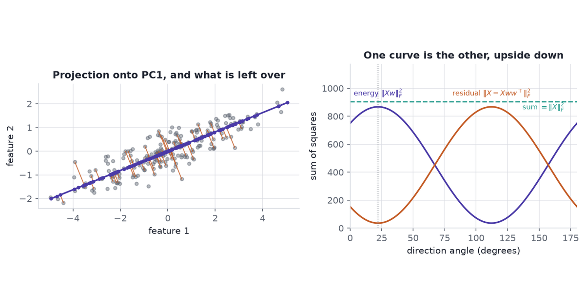

{fig-alt="A centred point cloud projected onto a line, beside complementary curves of projected energy and reconstruction error."}

PCA's maximum-variance and minimum-error definitions choose the same subspace; the projection geometry explains why, and the algebra connects both to truncated SVD.

When we replace a measurement table with fewer coordinates, we want to know what those coordinates preserve. The six formulations answer that question for a fixed matrix; centring and scaling determine which matrix we have asked them to summarize.

[Eigenvectors and eigenvalues](../eigendecomposition/) and [SVD geometry](../svd-rotate-stretch-rotate/) provide the linear-algebra background.

```{python}
#| label: setup
#| echo: false
from pathlib import Path

import matplotlib.pyplot as plt
import numpy as np
import pandas as pd

INK = "#1F2430"
ACCENT = "#4A3AA7"
TEAL = "#2A9D8F"
CORAL = "#C45C26"
GOLD = "#E8A33D"
MUTED = "#5F6672"
RULE = "#D8DBE2"

plt.rcParams.update(
    {
        "figure.facecolor": "white",
        "axes.facecolor": "white",
        "axes.edgecolor": RULE,
        "axes.linewidth": 0.8,
        "axes.labelcolor": INK,
        "text.color": INK,
        "xtick.color": MUTED,
        "ytick.color": MUTED,
        "font.size": 10,
        "axes.titlesize": 11,
        "axes.titleweight": "bold",
        "axes.grid": True,
        "grid.color": RULE,
        "grid.alpha": 0.7,
        "axes.spines.top": False,
        "axes.spines.right": False,
    }
)

np.set_printoptions(precision=4, suppress=True)
DATA = Path("data")
rng = np.random.default_rng(7)
```

## Projection geometry

We can compare a line that keeps the most spread with a line that leaves the shortest perpendicular residuals. Both choose the direction called the first principal component, or PC1.

The synthetic cloud used here: 200 draws of a scalar latent $t \sim N(0,1)$, mapped to $(2.2t,\ 0.9t)$ and perturbed by independent $N(0, 0.45^2)$ noise in both coordinates, then column-centred. It stands in for any measurement pair where one underlying quantity drives both readings and the instrument adds isotropic noise — two sensors on one process, two assays of one sample. Two dimensions let us draw the residuals. The example checks an algebraic identity; it does not validate a sensor model on real measurements.

```{python}
#| label: fig-equivalence
#| fig-cap: "Left: the centred cloud with PC1 and, for a sample of observations, the perpendicular residual joining each point to its projection. Right: projected energy and residual sum of squares against direction angle, with their constant sum."
#| fig-alt: "Two panels. The left shows a 2D elliptical point cloud with a line through its long axis and short perpendicular segments from points to that line. The right shows two mirrored curves against angle, one peaking where the other bottoms out, and a flat line at their sum."
#| fig-width: 9.2
#| fig-height: 3.5
n = 200
latent = rng.normal(size=n)
X = np.column_stack([2.2 * latent, 0.9 * latent]) + rng.normal(scale=0.45, size=(n, 2))
X = X - X.mean(axis=0)

U, S, Vt = np.linalg.svd(X, full_matrices=False)
pc1 = Vt[0]

thetas = np.linspace(0.0, np.pi, 3601)
dirs = np.vstack([np.cos(thetas), np.sin(thetas)])
proj = X @ dirs
energy = (proj**2).sum(axis=0)
resid = ((X[:, None, :] - proj[:, :, None] * dirs.T[None, :, :]) ** 2).sum(axis=(0, 2))
total = float((X**2).sum())

fig, (ax_l, ax_r) = plt.subplots(
    1, 2, figsize=(9.2, 3.5), gridspec_kw={"width_ratios": [1.15, 1.0]}
)

scores = X @ pc1
feet = np.outer(scores, pc1)
ax_l.scatter(X[:, 0], X[:, 1], s=14, color=MUTED, alpha=0.45, zorder=2)
for i in range(0, n, 3):
    ax_l.plot(
        [X[i, 0], feet[i, 0]], [X[i, 1], feet[i, 1]],
        color=CORAL, lw=1.0, alpha=0.8, zorder=3,
    )
ax_l.scatter(feet[:, 0], feet[:, 1], s=9, color=ACCENT, zorder=4)
span = np.array([scores.min(), scores.max()])
ax_l.plot(span * pc1[0], span * pc1[1], color=ACCENT, lw=1.8, zorder=5)
ax_l.set_aspect("equal")
ax_l.set_xlabel("feature 1")
ax_l.set_ylabel("feature 2")
ax_l.set_title("Projection onto PC1, and what is left over")

deg = np.degrees(thetas)
ax_r.plot(deg, energy, color=ACCENT, lw=1.8)
ax_r.plot(deg, resid, color=CORAL, lw=1.8)
ax_r.plot(deg, energy + resid, color=TEAL, lw=1.4, ls="--")
ax_r.axvline(deg[energy.argmax()], color=MUTED, lw=0.9, ls=":")
ax_r.set_xlabel("direction angle (degrees)")
ax_r.set_ylabel("sum of squares")
ax_r.set_xlim(0, 180)
ax_r.set_ylim(0, total * 1.30)

# Label the curves on the curves: a legend box has nowhere to sit here.
ax_r.text(deg[energy.argmax()], total * 1.05, r"energy $\|Xw\|_F^2$",
          color=ACCENT, fontsize=8, ha="center")
ax_r.text(deg[resid.argmax()], total * 1.05, r"residual $\|X-Xww^\top\|_F^2$",
          color=CORAL, fontsize=8, ha="center")
ax_r.text(170, total * 0.92, r"sum $=\|X\|_F^2$",
          color=TEAL, fontsize=8, ha="right", va="bottom")
ax_r.set_title("One curve is the other, upside down")

fig.tight_layout(pad=1.1)
plt.show()

print(f"energy peaks at {deg[energy.argmax()]:.2f} deg")
print(f"residual bottoms at {deg[resid.argmin()]:.2f} deg")
print(f"sum varies by {np.ptp(energy + resid):.2e} across the sweep")
print(f"||X||_F^2 = {total:.4f}")
```

The two curves peak and bottom out at the same angle, 22.15 degrees, and their sum is flat to $2.84\times10^{-12}$ — floating-point noise on a total of 903.0973. That flat line is the identity of @sec-projector. Maximising the purple curve and minimising the orange one are the same search, because the dashed line does not move.

## Notation

All six views use one centred matrix and one orthonormal basis, with $n > 1$ and $1 \le k \le \min(n,d)$.

- $X \in \mathbb{R}^{n \times d}$ — the data. Each of the $n$ rows is an observation, each of the $d$ columns a feature.
- $X$ is **centred**: every column has mean zero. PCA without this step answers a different question, and @sec-assumptions says which one.
- $W \in \mathbb{R}^{d \times k}$ — the basis we are looking for, with $W^\top W = I_k$. Its $k$ columns are orthonormal directions in feature space.
- $Z = XW \in \mathbb{R}^{n \times k}$ — the **projection**, or scores. Row $i$ holds the $k$ coordinates of observation $i$ in the new basis.
- $\hat X = XWW^\top \in \mathbb{R}^{n \times d}$ — the **reconstruction**. Back in the original $d$ features, but of rank at most $k$.
- $P = WW^\top \in \mathbb{R}^{d \times d}$ — the orthogonal projector onto the span of $W$'s columns. $P^2 = P$ and $P^\top = P$.

Scores and reconstructions have different dimensions. $Z$ is $n \times k$ and lives in the small space. $\hat X$ is $n \times d$ and lives back in the big one, on a $k$-dimensional flat inside it.

## The six views

Three objectives, a matrix approximation, and two solution methods describe the principal subspace:

1. **Maximum variance.** Find the directions along which the projected observations spread out the most.
2. **Maximum projected energy.** Find $W$ maximising $\|XW\|_F^2$, the total squared magnitude of the projected representation.
3. **Minimum reconstruction error.** Find the $k$-dimensional subspace minimising $\|X - XWW^\top\|_F^2$, the squared perpendicular distance from the data to the subspace.
4. **Best rank-$k$ approximation.** Find the rank-$k$ matrix closest to $X$ in Frobenius norm.
5. **Covariance eigendecomposition.** Take the leading eigenvectors of the sample covariance matrix.
6. **Truncated SVD.** Take the leading right singular vectors of $X$.

They are not six independent problems. Views 1, 2, and 3 are one optimization problem written in three notations. Views 5 and 6 are two *routes to the solution* of that problem, not separate objectives. View 4 is the same optimum read as a statement about matrices rather than about subspaces. @sec-equivalence does the work of showing that.

Here **energy** means a sum of squares: $\|X\|_F^2 = \sum_{ij} X_{ij}^2$. For centred data it is $(n-1)$ times the total sample variance.

The arrows distinguish algebraic identities from the optimization results needed to choose a solution.

```{mermaid}
%%| label: fig-map
%%| fig-cap: "The six views and their mathematical connections. Views 1 to 3 are one objective in three notations; views 5 and 6 are routes to its solution; view 4 is the same optimum read as a statement about matrices."
flowchart TD
  R["<b>Minimum<br/>reconstruction error</b><br/>min ‖X − XWWᵀ‖²_F"]
  E["<b>Maximum<br/>projected energy</b><br/>max ‖XW‖²_F"]
  V["<b>Maximum<br/>variance</b><br/>max tr(WᵀSW)"]
  G["<b>Covariance<br/>eigenvectors</b><br/>S = VΛVᵀ"]
  D["<b>Truncated<br/>SVD</b><br/>X = UΣVᵀ"]
  L["<b>Best rank-k<br/>approximation</b><br/>X̂ = U_kΣ_kV_kᵀ"]
  R -->|"‖X‖²_F − ‖XW‖²_F<br/>projector identity"| E
  E -->|"‖XW‖²_F = (n−1) tr(WᵀSW)<br/>cyclic trace"| V
  V -->|"stationarity + Ky Fan<br/>W = V_k"| G
  G -->|"XᵀX = VΣ²Vᵀ<br/>λ = σ²/(n−1)"| D
  D -->|"Eckart–Young–Mirsky"| L
```

## Equivalence {#sec-equivalence}

The proof first relates the objectives for any admissible basis, then finds their optimizers. We fix centring, feature scaling, and a complete matrix throughout.

### Covariance and normalization

The sample covariance of centred $X$ is

$$
S = \frac{X^\top X}{n-1} \in \mathbb{R}^{d \times d},
$$

The denominator $n-1$ accounts for estimating the column means. Switching to the maximum-likelihood convention $X^\top X/n$ multiplies every eigenvalue by $(n-1)/n$; it changes neither eigenvectors nor explained-variance ratios.

$S$ is symmetric positive semi-definite, so it has an orthonormal eigenbasis with non-negative eigenvalues:

$$
S = V\Lambda V^\top, \qquad \Lambda = \operatorname{diag}(\lambda_1 \ge \dots \ge \lambda_d \ge 0).
$$

The principal directions are the leading columns of $V$, and $\lambda_j$ is the variance of the data along direction $v_j$ — set $W = v_j$ in the trace objective and read it off. Because $\operatorname{tr}(S) = \sum_j \lambda_j$ is the total variance across all $d$ features, $\lambda_j / \sum_i \lambda_i$ is the fraction of variance explained by component $j$.

### From reconstruction to energy {#sec-projector}

$P = WW^\top$ is an orthogonal projector: $P^\top = P$, and $P^2 = WW^\top WW^\top = W(W^\top W)W^\top = WW^\top = P$ because $W^\top W = I_k$. Expand the reconstruction error:

$$
\|X - XP\|_F^2
= \operatorname{tr}\!\left[(X - XP)^\top (X - XP)\right]
= \operatorname{tr}(X^\top X) - 2\operatorname{tr}(X^\top X P) + \operatorname{tr}(P X^\top X P).
$$

The last term collapses. Using the cyclic property of the trace and $P^2 = P$,

$$
\operatorname{tr}(PX^\top XP) = \operatorname{tr}(X^\top X P P) = \operatorname{tr}(X^\top X P),
$$

so two of the three terms cancel into one:

$$
\|X - XWW^\top\|_F^2 = \operatorname{tr}(X^\top X) - \operatorname{tr}(X^\top X WW^\top) = \|X\|_F^2 - \|XW\|_F^2 .
$$

The last equality is the same cyclic move: $\operatorname{tr}(X^\top X WW^\top) = \operatorname{tr}(W^\top X^\top X W) = \|XW\|_F^2$.

This is the Pythagorean split. Every observation's squared length divides into the part the subspace keeps and the part it loses, with no cross term. And $\|X\|_F^2$ does not contain $W$:

$$
\min_{W^\top W = I} \|X - XWW^\top\|_F^2
\iff
\max_{W^\top W = I} \|XW\|_F^2 .
$$

Fitting the data as closely as possible and capturing as much energy as possible are the same instruction, because the two quantities sum to a constant.

### From energy to variance

One line, already used in @sec-projector:

$$
\|XW\|_F^2 = \operatorname{tr}\!\left[(XW)^\top(XW)\right] = \operatorname{tr}(W^\top X^\top X W) = (n-1)\operatorname{tr}(W^\top S W).
$$

$W^\top X^\top X W$ is the $k \times k$ covariance of the scores, up to the factor $n-1$. Its trace is the total projected variance. So maximum energy is maximum projected variance, and the $(n-1)$ never affects the maximiser.

### Stationary directions {#sec-lagrange}

Nothing so far mentioned eigenvectors. They arrive as the solution of a constrained maximisation, and the constraint is what puts them there.

Maximising $w^\top A w$ with $A = X^\top X$ has no answer on its own: scale $w$ up and the objective grows without bound. The constraint $w^\top w = 1$ is what makes the problem well posed, and a constrained stationary point is found by **Lagrange multipliers** — add the constraint to the objective with an unknown coefficient, then look for a point where the combined function is flat in every direction:

$$
\mathcal{L}(w, \lambda) = w^\top A w - \lambda\,(w^\top w - 1).
$$

Differentiating in $w$ and setting the gradient to zero gives

$$
\nabla_w \mathcal{L} = 2Aw - 2\lambda w = 0
\qquad \Longleftrightarrow \qquad
Aw = \lambda w .
$$

The eigenvector equation is the first-order condition. It was not assumed, and no eigendecomposition was invoked to get it: **every stationary point of projected variance on the unit sphere is an eigenvector of $X^\top X$**, and nothing else is.

The multiplier is not bookkeeping either. At a stationary point,

$$
w^\top A w = w^\top (\lambda w) = \lambda\,w^\top w = \lambda ,
$$

so $\lambda$ *is* the value of the objective there — the projected energy, and $\lambda/(n-1)$ the projected variance. With distinct eigenvalues there are $d$ stationary directions, each with two unit-vector signs. Repeated eigenvalues admit every unit vector in the corresponding eigenspace; comparing their objective values selects the largest eigenvalue. That is Rayleigh–Ritz, derived rather than quoted.

For $k$ components the constraint $W^\top W = I_k$ is $k(k+1)/2$ scalar equations, so the multiplier is a symmetric $k \times k$ matrix $\Lambda$:

$$
\mathcal{L}(W, \Lambda) = \operatorname{tr}(W^\top A W) - \operatorname{tr}\!\left[\Lambda (W^\top W - I_k)\right],
\qquad
\nabla_W \mathcal{L} = 2AW - 2W\Lambda = 0 .
$$

So $AW = W\Lambda$. A stationary $W$ need not hold eigenvectors — but $\Lambda$ is symmetric, so $\Lambda = RDR^\top$ for an orthogonal $R$, and $\widetilde W = WR$ satisfies $A\widetilde W = \widetilde W D$. Its columns *are* eigenvectors, and it spans the same subspace as $W$.

For the subspace optimization, the stationarity condition pins the **subspace**, and leaves the basis inside it free up to the orthogonal $R$ that diagonalises the multiplier.

### The maximizing subspace {#sec-kyfan}

Stationarity gives $k$ eigenvectors; it does not say which $k$. For that, take $A$ symmetric with eigenvalues $\lambda_1 \ge \dots \ge \lambda_d$ and ask what maximises $\operatorname{tr}(W^\top A W)$ over $W^\top W = I_k$.

Write $A = V\Lambda V^\top$ and set $M = V^\top W$, which satisfies $M^\top M = I_k$. Then

$$
\operatorname{tr}(W^\top A W) = \operatorname{tr}(M^\top \Lambda M) = \sum_{j=1}^{d} \lambda_j \, c_j,
\qquad c_j = \sum_{l=1}^{k} M_{jl}^2 .
$$

The weights $c_j$ are constrained: each $c_j \in [0, 1]$ because $M$ has orthonormal columns, and $\sum_j c_j = \|M\|_F^2 = k$. Maximising a weighted sum of the $\lambda_j$ under "budget $k$, at most $1$ each" puts all of the budget on the $k$ largest eigenvalues. The maximum is $\lambda_1 + \dots + \lambda_k$, attained when $W$ spans the leading $k$ eigenvectors. That is the Ky Fan theorem, and at $k = 1$ it is Rayleigh–Ritz.

Applied to $A = X^\top X$: the maximiser is $W = V_k$, the leading eigenvectors of $X^\top X$, which are the leading eigenvectors of $S$.

### SVD and rank approximation {#sec-lowrank}

For the thin SVD $X = U\Sigma V^\top$, let $r=\min(n,d)$, so $U$ is $n\times r$, $V$ is $d\times r$, and $\Sigma$ holds the $r$ singular values. Zero singular values are included when $X$ has smaller rank.

$$
X^\top X = V\Sigma^2V^\top,
\qquad \lambda_j(S)=\frac{\sigma_j^2}{n-1}.
$$

The right singular vectors provide the covariance eigenvectors represented by the thin decomposition. When $d>n$, a full covariance eigenbasis also contains $d-n$ additional null-space directions.

At the optimum, the scores and reconstruction are

$$
Z=XV_k=U_k\Sigma_k,\qquad
\hat X=XV_kV_k^\top=U_k\Sigma_kV_k^\top.
$$

The **Eckart–Young–Mirsky theorem** says this reconstruction also minimizes $\|X-B\|_F^2$ over all matrices $B$ of rank at most $k$. Its error is $\sum_{j>k}\sigma_j^2$; the theorem joins the subspace problem to the broader matrix-approximation problem.

Direct SVD avoids forming $X^\top X$, which squares the ratio of largest to smallest nonzero singular value. It also avoids storing a $d\times d$ covariance matrix when the data are wide; [the SVD companion](../svd-rotate-stretch-rotate/) develops the numerical argument.

### The chain {#sec-chain}

For every $W$ satisfying $W^\top W=I_k$,

$$
\boxed{\|X-XWW^\top\|_F^2
=\|X\|_F^2-\|XW\|_F^2
=\|X\|_F^2-(n-1)\operatorname{tr}(W^\top S W).}
$$

These are identities between objective values. Rayleigh–Ritz and Ky Fan identify a maximizing subspace, and Eckart–Young–Mirsky identifies a best rank-$k$ reconstruction.

- $W=V_k$ is an optimizer; so is $V_kR$ for any orthogonal $k\times k$ matrix $R$.
- Conventional PCA chooses ordered eigenvectors, giving uncorrelated scores with covariance $\operatorname{diag}(\lambda_1,\ldots,\lambda_k)$.
- An arbitrary rotation within the retained subspace preserves its projector and reconstruction, but generally makes the score covariance nondiagonal. It is an optimal subspace basis without necessarily being a set of principal axes.

### Equivalence, uniqueness, and stability {#sec-assumptions}

These are separate guarantees:

| Question | Condition and consequence |
|---|---|
| Do the objectives agree? | A complete, fixed matrix, orthogonal projection, and squared Frobenius error give the projector identity. Column centring supplies the variance interpretation. |
| Is the optimal subspace unique? | A strict boundary gap $\lambda_k>\lambda_{k+1}$ fixes the leading $k$-dimensional subspace. A positive tie across the boundary permits multiple optimal subspaces and reconstructions; the objective equivalence still holds. |
| Are individual axes unique? | Distinct eigenvalues fix eigenvector directions up to sign. Ties permit rotations inside the tied eigenspace. |
| Is the estimated subspace stable? | A small boundary gap relative to sampling or measurement perturbations can make it unstable, even when the sample optimizer is unique. Resampling evaluates sensitivity to a specified sampling process. |

If $k$ reaches the data rank, reconstruction is $X$ itself. Adding directions from the null space can make the chosen basis or subspace nonunique while the reconstruction stays fixed.

## Numerical check

We can check covariance eigenvalues, the projector identity, and the best-rank reconstruction on the synthetic cloud without hiding the algebra behind a PCA API.

```{python}
#| label: demo
#| code-fold: false
eigenvalues = np.linalg.eigvalsh(X.T @ X / (n - 1))[::-1]
k = 1
W = Vt[:k].T
scores = X @ W
reconstruction = scores @ W.T
error = np.sum((X - reconstruction) ** 2)
kept = np.sum(scores**2)

assert np.allclose(eigenvalues, S**2 / (n - 1))
assert np.isclose(error + kept, np.sum(X**2))
assert np.isclose(error, np.sum(S[k:] ** 2))
assert np.allclose(reconstruction, (U[:, :k] * S[:k]) @ Vt[:k])
print(f"kept {kept:.4f}; error {error:.4f}; total {kept + error:.4f}")
```

Rank 1 keeps 867.4169 and leaves 35.6804, adding to 903.0973. These are the peak and trough in the projection figure; rank 2 reconstructs this two-dimensional cloud completely.

The extended checks compare directions up to sign and verify that the eigenvector equation is stationary even at a variance minimum.


```{python}
#| label: demo-lagrange
A = X.T @ X
w1 = Vt[0]
lam1 = float(w1 @ A @ w1)                   # the objective at the stationary point

print(f"||grad L|| = ||2Aw - 2*lambda*w|| = {np.linalg.norm(2 * A @ w1 - 2 * lam1 * w1):.3e}")
print(f"multiplier lambda        = {lam1:.6f}")
print(f"projected energy ||Xw||^2 = {np.sum((X @ w1) ** 2):.6f}")
print(f"lambda / (n-1)           = {lam1 / (n - 1):.6f}  vs eigenvalue {eigenvalues[0]:.6f}")

# The multiplier IS the objective, and the gradient vanishes at the eigenvector.
assert np.allclose(A @ w1, lam1 * w1)
assert np.isclose(lam1, np.sum((X @ w1) ** 2))
assert np.isclose(lam1 / (n - 1), eigenvalues[0])

# Every eigenvector is stationary, not just the leading one -- including the
# worst direction, which is the minimum rather than the maximum.
for j in (0, 1):
    wj = Vt[j]
    assert np.allclose(A @ wj, float(wj @ A @ wj) * wj)
print("both eigenvectors satisfy Aw = lambda w; only the larger lambda is the maximum")
```

```{python}
#| label: demo-sklearn
from sklearn.decomposition import PCA

sk = PCA(n_components=2).fit(X)
print("sklearn components (rows)  ", sk.components_)
print("sklearn explained variance ", sk.explained_variance_)
print("our eigenvalues            ", eigenvalues)
assert np.allclose(sk.explained_variance_, eigenvalues)
assert np.isclose(abs(sk.components_[0] @ Vt[0]), 1.0)
```

## Centring and scaling {#sec-scaling}

The six formulations agree on the matrix they receive. Preprocessing determines what distances and variances that matrix represents.

- **Column centring** subtracts feature means. In the original coordinates, the fitted affine subspace passes through the mean; add the mean back to reconstruct observations.
- **Covariance PCA** retains the chosen measurement scales. Changing a length from centimetres to metres divides its variance by $10^4$ and can change the answer.
- **Correlation PCA** divides each nonconstant centred feature by its sample standard deviation. It gives features equal variance, including features that contain mostly noise.
- **Other transforms** encode other measurement choices. A log compresses large positive values; IQR scaling uses the middle half of the observations to set a feature's scale. Neither guarantees outlier resistance for PCA itself.

Scaling also changes the coordinates of a loading vector. For $Y=XD^{-1}$, a score $Yv$ equals $X(D^{-1}v)$, so $v$ alone is not a coefficient vector in the original units. A nonlinear log transform has no global linear conversion back to raw coordinates.

To compare two preprocessing routes on the same observations, we will compare their score vectors using absolute correlation. This is a descriptive agreement measure, invariant to the arbitrary PC sign, not a test of which route is better.

## MovieLens genre ratings {#sec-movielens}

### Data and task

- **Source.** GroupLens collected MovieLens 100K through its recommendation site in 1997–1998 for recommender research: 100,000 volunteered ratings from 943 users on 1,682 films. Users chose which films to rate.
- **Matrix.** We average ratings in the 12 genres with widest user coverage and retain users with at least three films in every retained genre. The result is a complete $313\times12$ matrix of means on the $1$–$5$ scale; it represents relatively active, broad-viewing users.
- **Question.** Does the leading component describe differences between genres or users' overall rating levels? Confusing the two could produce a misleading user profile; recommendation accuracy is not measured here.
- **Why aggregate?** The original user-by-film grid is 93.7% unobserved. Genre aggregation supplies a complete matrix for demonstrating classical PCA, while changing the unit of analysis from films to genres.
- **Measurement uncertainty.** A cell averages between 3 and 410 ratings. The companion counts file preserves that distinction, and films with several genre tags contribute to several cells.

```{python}
#| label: movielens-load
genres = pd.read_csv(DATA / "movielens_genres.csv", index_col=0)
counts = pd.read_csv(DATA / "movielens_counts.csv", index_col=0)
assert genres.index.equals(counts.index)
assert genres.columns.equals(counts.columns)
G = genres.to_numpy()
C = counts.to_numpy()
assert np.isfinite(G).all()
print(f"{G.shape[0]} users, {G.shape[1]} genres")
print(f"ratings per cell: {C.min()} to {C.max()}")
```

### Covariance PCA

All columns share a rating scale, so we retain that scale for this demonstration. Both SVD and eigendecomposition are inexpensive for twelve columns.


```{python}
#| label: movielens-pca
Gc = G - G.mean(axis=0)                       # centre the columns
Ug, Sg, Vtg = np.linalg.svd(Gc, full_matrices=False)
lam_g = Sg**2 / (Gc.shape[0] - 1)
eig_g, vec_g = np.linalg.eigh(Gc.T @ Gc / (Gc.shape[0] - 1))

print(f"cov route top eigenvalue {eig_g[-1]:.10f}")
print(f"svd route sigma^2/(n-1)  {lam_g[0]:.10f}")
print(f"|cos| between the two PC1s: {abs(vec_g[:, -1] @ Vtg[0]):.12f}")
print("explained variance ratio:", (lam_g / lam_g.sum())[:4].round(4))
print("cumulative              :", np.cumsum(lam_g / lam_g.sum())[:4].round(4))

for k in (1, 2, 3, 4):
    W = Vtg[:k].T
    rel = np.sum((Gc - Gc @ W @ W.T) ** 2) / np.sum(Gc**2)
    kept = np.sum((Gc @ W) ** 2) / np.sum(Gc**2)
    print(f"  rank {k}: relative reconstruction error {rel:.4f}, energy kept {kept:.4f}")

assert np.isclose(eig_g[-1], lam_g[0])
assert np.isclose(abs(vec_g[:, -1] @ Vtg[0]), 1.0)
```

PC1 accounts for 65.66% of the variance. We inspect its loadings before interpreting that fraction as a taste dimension.

```{python}
#| label: movielens-pc1
order = np.argsort(-np.abs(Vtg[0]))
print("PC1 loadings, largest magnitude first:")
for j in order:
    print(f"   {genres.columns[j]:12s} {Vtg[0][j]:+.3f}")

pc1_scores = Gc @ Vtg[0]
user_mean = G.mean(axis=1)
r = float(np.corrcoef(pc1_scores, user_mean)[0, 1])
print(f"\ncorr(PC1 score, that user's mean rating over all 12 genres) = {r:.4f}")
assert abs(r) > 0.99
```

The loadings have one sign and nearly equal magnitudes, between 0.267 and 0.316. The absolute correlation between PC1 scores and users' unweighted mean genre rating is 0.9999: this component measures overall rating level, which we call rating generosity here.

That description does not identify a psychological trait. Film selection and genre overlap also affect the observed averages.

### Removing users' overall levels {#sec-dropfirst}

If the task is to represent relative genre preferences, we can subtract each user's mean genre rating before column centring. This specifies a nuisance direction in advance; simply dropping PC1 would only remove that direction when PCA happened to rank it first.


```{python}
#| label: movielens-drop-vs-debias
def principal_angles(A, B):
    """Angles in degrees between the column spaces of two matrices."""
    Qa, _ = np.linalg.qr(A)
    Qb, _ = np.linalg.qr(B)
    s = np.linalg.svd(Qa.T @ Qb, compute_uv=False)
    return np.degrees(np.arccos(np.clip(s, -1.0, 1.0)))


R = G - G.mean(axis=1, keepdims=True)         # remove each user's own level
Rc = R - R.mean(axis=0)                       # then centre the columns
Ur, Sr, Vtr = np.linalg.svd(Rc, full_matrices=False)
lam_r = Sr**2 / (Rc.shape[0] - 1)

print(f"rank: {np.linalg.matrix_rank(Rc)} after debiasing, "
      f"{np.linalg.matrix_rank(Gc)} before")
print("angles between PC2-PC3 of the raw fit and PC1-PC2 of the debiased fit:",
      principal_angles(Vtg[1:3].T, Vtr[:2].T).round(2), "deg")
share = float((Rc @ Vtg[0]).var(ddof=1) / Rc.var(axis=0, ddof=1).sum())
print(f"share of debiased variance lying along the raw PC1: {share:.4%}")

assert principal_angles(Vtg[1:3].T, Vtr[:2].T).max() < 5.0
```

On this table the two-dimensional spans differ by principal angles of $0.20^\circ$ and $1.33^\circ$, so removing the mean and dropping raw PC1 produce similar retained spans. They are not identical operations in general.

Row centring reduces the rank from 12 to 11 because all rows become orthogonal to the all-ones vector. The first five variance shares then become 23.5%, 18.8%, 15.8%, 12.9%, and 9.9%: less concentrated than the original spectrum, but not tied eigenvalues.

```{python}
#| label: fig-movielens
#| fig-cap: "Left: raw PC1 scores track users' mean genre ratings. Right: variance shares before and after removing users' means; each curve is normalized by its own total variance."
#| fig-alt: "A nearly straight scatter of mean genre rating against PC1 score, beside two component spectra. Raw PC1 explains about 66 percent; after row centring PC1 explains about 24 percent."
#| fig-width: 8.6
#| fig-height: 3.5
fig, (ax_a, ax_b) = plt.subplots(1, 2, figsize=(8.6, 3.5))
ax_a.scatter(user_mean, pc1_scores, s=14, color=TEAL, alpha=0.65)
ax_a.set(xlabel="user's mean genre rating", ylabel="raw PC1 score",
         title=f"Overall rating level (|r| = {abs(r):.4f})")
for values, name, colour in ((lam_g, "column-centred", ACCENT),
                             (lam_r, "row- then column-centred", CORAL)):
    ax_b.plot(np.arange(1, 13), values / values.sum(), "o-", ms=4,
              color=colour, label=name)
ax_b.set(xlabel="component", ylabel="share of variance", title="Changing the question")
ax_b.set_xticks([1, 3, 6, 9, 12])
ax_b.legend(frameon=False, fontsize=8)
fig.tight_layout(pad=1.1)
plt.show()
```

### Interpretation limits

- **Counts are not an independent-error model.** The approximation $\operatorname{Var}(\bar r_{ij})=s^2/n_{ij}$ needs sampling assumptions. Genre overlap induces covariance between cell means, so a diagonal noise covariance would omit part of the uncertainty.
- **This spectrum does not choose a recommender's dimension.** A stable subspace can still predict poorly. Choosing $k$ for recommendations requires held-out ratings and a pipeline that fits preprocessing on training data.
- **No noise fraction or deployment threshold is inferred here.** Quantifying them would require a rating-level model or resampling scheme that preserves the overlaps, followed by task-specific validation.

## Neutrophil metabolomics {#sec-metabolome}

### Data and task

- **Source.** Li et al. (2023), Metabolomics Workbench study ST002477, CC BY 4.0: LC-MS peak areas for 285 metabolites in neutrophils from 75 people, labelled Control (19), Mild (30), or Severe (26) COVID-19. The researchers isolated neutrophils to study their metabolic state during disease.
- **Matrix.** We use the complete $75\times285$ matrix, with samples as rows. Peak areas measure relative ion intensities, not metabolic fluxes.
- **Question.** How does preprocessing change the leading component, and are its scores associated with the disease groups? PCA describes variation without using those labels to fit the directions.
- **Consequence of error.** Mistaking technical variation for a biological association could misdirect follow-up experiments. The supplied metadata contains only sample IDs and disease groups; it cannot establish whether batch or run order is confounded with disease.


```{python}
#| label: metabolome-load
abund = pd.read_csv(DATA / "abundances.tsv", sep="\t", index_col=0)
meta = pd.read_csv(DATA / "samples.tsv", sep="\t")
assert list(abund.columns) == list(meta["sample_id"])

Xm_raw = abund.to_numpy(dtype=np.float64).T
labels = meta["group"].to_numpy()

# Code severity once, here, and refuse anything the coding does not cover: a
# fourth group or a stray case variant would otherwise be silently scored as
# Severe and shift every correlation computed from it.
GROUPS = ("Control", "Mild", "Severe")
assert set(labels) == set(GROUPS), sorted(set(labels))
severity = np.select([labels == "Control", labels == "Mild"], [0.0, 1.0], 2.0)

t = np.log1p(Xm_raw)
median = np.median(t, axis=0)
iqr = np.subtract(*np.percentile(t, [75, 25], axis=0))
iqr = np.where(iqr == 0.0, 1.0, iqr)
Zm = (t - median) / iqr
Xm = Zm - Zm.mean(axis=0)

n_m, d_m = Xm.shape
print(f"matrix: {n_m} samples x {d_m} metabolites")
print("groups:", {g: int((labels == g).sum()) for g in GROUPS})
```

### Comparing preprocessing routes {#sec-metabolome-scaling}

We compare raw covariance PCA, correlation PCA, and PCA after $\log(1+x)$ plus IQR scaling. The log/IQR route matches [Neutrophil Metabolomes as a Matrix](../neutrophil-metabolome-axis/); it compresses large peak areas and reduces the influence of extreme observations on the scale estimate.

The added 1 assumes the numerical units in this file: changing those units changes $\log(1+x)$. The transform is a stated analysis choice, not a universal correction for skew or outliers.

```{python}
#| label: metabolome-scaling
raw_var = Xm_raw.var(axis=0, ddof=1)
names_m = abund.index.to_numpy()

def fit(M):
    A = M - M.mean(axis=0)
    _, singular, Vt_ = np.linalg.svd(A, full_matrices=False)
    return A, Vt_, singular**2 / np.sum(singular**2)

A_cov, Vt_cov_m, r_cov = fit(Xm_raw)
A_cor, Vt_cor_m, r_cor = fit(Xm_raw / Xm_raw.std(axis=0, ddof=1))
A_log, Vt_log_m, r_log = fit(Zm)
routes = {"raw": (A_cov, Vt_cov_m, r_cov),
          "standardized": (A_cor, Vt_cor_m, r_cor),
          "log/IQR": (A_log, Vt_log_m, r_log)}
route_scores = {name: A @ Vt_[0] for name, (A, Vt_, _) in routes.items()}
print(f"largest/smallest raw feature variance: {raw_var.max() / raw_var.min():.2e}")
biggest = int(np.argmax(raw_var))
print(f"largest-variance metabolite: {names_m[biggest]}")
print(f"its share of raw squared PC1 loading: {Vt_cov_m[0, biggest]**2:.1%}")
for name, (_, _, ratios) in routes.items():
    agreement = abs(np.corrcoef(route_scores[name], route_scores["log/IQR"])[0, 1])
    association = abs(np.corrcoef(route_scores[name], severity)[0, 1])
    print(f"{name:12s}: PC1 {ratios[0]:.1%}; |corr with log/IQR scores| "
          f"{agreement:.4f}; |corr with severity| {association:.4f}")
```

Raw feature variances span a factor of $9.49\times10^9$. Raw PC1 explains 49.5% of the variance and assigns 51.9% of its squared loading to choline alone, the highest-variance column.

The standardized and log/IQR score vectors have absolute correlation 0.9811; the raw and log/IQR scores have absolute correlation 0.6159. These compare how the routes arrange the same 75 samples, without mixing loading vectors expressed in different coordinates.

Absolute correlations with severity are 0.4561 (raw), 0.5472 (standardized), and 0.5363 (log/IQR). These are descriptive associations with an ordinal label coded 0/1/2, which assumes equal spacing between categories; they do not rank the preprocessing choices.

The correlations share observations and the severity variable. A standard error for one correlation cannot establish whether their difference is meaningful; that requires joint uncertainty, such as a paired resampling analysis that refits preprocessing and PCA.


```{python}
#| label: fig-scaling
#| fig-cap: "Left: per-metabolite variance as measured, sorted, over ten orders of magnitude. Right: squared loadings of PC1, sorted, under covariance PCA on the file as measured and under the log/IQR transform."
#| fig-alt: "Two panels. The left is a steeply falling curve of variance against metabolite rank on a log scale spanning ten decades. The right shows two sorted squared-loading curves: the covariance one starts above 0.5 and collapses, the log/IQR one starts near 0.01 and decays gently."
#| fig-width: 8.6
#| fig-height: 3.4
fig, (ax_v, ax_l) = plt.subplots(1, 2, figsize=(8.6, 3.4))

ax_v.semilogy(np.sort(raw_var)[::-1], color=ACCENT, lw=1.6)
ax_v.set_xlabel("metabolite, sorted by variance")
ax_v.set_ylabel("variance as measured (log scale)")
ax_v.set_title("Ten orders of magnitude")

ax_l.semilogy(np.sort(Vt_cov_m[0] ** 2)[::-1], color=CORAL, lw=1.6,
              label="covariance, as measured")
ax_l.semilogy(np.sort(Vt_log_m[0] ** 2)[::-1], color=TEAL, lw=1.6,
              label="log1p + IQR")
ax_l.axhline(1 / d_m, color=MUTED, lw=1.0, ls="--")
ax_l.text(d_m, 1 / d_m * 1.4, "equal weight on every metabolite",
          color=MUTED, fontsize=7.5, ha="right")
ax_l.set_xlabel("metabolite, sorted by loading")
ax_l.set_ylabel("squared PC1 loading (log scale)")
ax_l.legend(frameon=False, fontsize=7.5, loc="lower left")
ax_l.set_title("PC1 weight concentration")

fig.tight_layout(pad=1.1)
plt.show()
```

The squared loadings describe weight concentration within each route's coordinates. They are not raw-unit effect sizes or evidence that log/IQR has recovered a biological direction.

### Wide matrices

With $n=75$ and $d=285$, centring caps the rank at $n-1=74$. At least 211 covariance eigenvalues must be zero; that arithmetic does not imply that 211 biological processes are absent.


```{python}
#| label: metabolome-pca
Um, Sm, Vtm = np.linalg.svd(Xm, full_matrices=False)
lam_m = Sm**2 / (n_m - 1)

print(f"rank(X) = {np.linalg.matrix_rank(Xm)}, min(n, d) = {min(n_m, d_m)}, n - 1 = {n_m - 1}")
print(f"non-negligible singular values: {int((Sm > 1e-9 * Sm[0]).sum())} of {len(Sm)}")

cov = Xm.T @ Xm / (n_m - 1)
eig_m, vec_m = np.linalg.eigh(cov)
print(f"covariance matrix is {cov.shape[0]} x {cov.shape[1]}")
print(f"cov route top eigenvalue {eig_m[-1]:.10f}")
print(f"svd route sigma^2/(n-1)  {lam_m[0]:.10f}")
print(f"|cos| between the two PC1s: {abs(vec_m[:, -1] @ Vtm[0]):.12f}")
print("explained variance ratio:", (lam_m / lam_m.sum())[:4].round(4))

assert np.linalg.matrix_rank(Xm) == n_m - 1
assert np.isclose(eig_m[-1], lam_m[0])
assert np.isclose(abs(vec_m[:, -1] @ Vtm[0]), 1.0)
```

The covariance and SVD routes agree on the leading direction and eigenvalue. Both are feasible at this size; direct SVD avoids the larger covariance matrix and the loss of numerical accuracy from forming it.


```{python}
#| label: metabolome-scores
scores_m = Xm @ Vtm[:2].T
corr_sev = float(np.corrcoef(scores_m[:, 0], severity)[0, 1])

print(f"PC1 {lam_m[0] / lam_m.sum():.1%} of variance, "
      f"PC2 {lam_m[1] / lam_m.sum():.1%}, "
      f"first two together {np.cumsum(lam_m / lam_m.sum())[1]:.1%}")
for g in GROUPS:
    s = scores_m[labels == g, 0]
    print(f"  {g:8s} PC1 mean {s.mean():+6.2f}  sd {s.std():5.2f}")
print(f"corr(PC1 score, severity coded 0/1/2) = {corr_sev:.4f}")

for k in (1, 2, 5, 10, 74):
    W = Vtm[:k].T
    rel = np.sum((Xm - Xm @ W @ W.T) ** 2) / np.sum(Xm**2)
    print(f"  rank {k:3d}: relative reconstruction error {rel:.4f}")
```

PC1 explains 20.7% and PC2 11.4%, for 32.1% together. The group means differ along PC1, but the observations overlap; the sign of the scores is arbitrary.


```{python}
#| label: fig-metabolome
#| fig-cap: "Left: all 285 covariance eigenvalues, cut off at 74 by the sample count. Eigenvalues past 74 are zero and are drawn at a floor so the log axis can hold them. Right: the 75 samples on PC1 and PC2, coloured by COVID label."
#| fig-alt: "Two panels. The left is a log-scale plot of eigenvalue against index for 285 components, decaying smoothly then dropping off a cliff at index 74 to a flat floor. The right is a scatter of 75 points on two principal components, coloured in three groups that overlap substantially."
#| fig-width: 8.6
#| fig-height: 3.6
fig, (ax_s, ax_p) = plt.subplots(1, 2, figsize=(8.6, 3.6))

# All d eigenvalues of the covariance, not the n kept by the thin SVD, so the
# 211 that are zero for want of samples are on the page.
spectrum = eig_m[::-1]
floor = spectrum[: n_m - 1].min() * 1e-2
ax_s.semilogy(np.arange(1, d_m + 1), np.maximum(spectrum, floor),
              color=ACCENT, lw=1.5)
ax_s.axvline(n_m - 1, color=CORAL, lw=1.0, ls="--")
ax_s.annotate(f"rank {n_m - 1} = n − 1", xy=(n_m + 8, spectrum[0] * 0.15),
              color=CORAL, fontsize=8)
ax_s.set_ylim(floor * 0.5, spectrum[0] * 3)
ax_s.set_xlabel("component index")
ax_s.set_ylabel("eigenvalue (log scale)")
ax_s.set_title(f"{d_m} features, {n_m - 1} directions")

COLOURS = {"Control": TEAL, "Mild": GOLD, "Severe": CORAL}
for g in GROUPS:
    sel = labels == g
    ax_p.scatter(scores_m[sel, 0], scores_m[sel, 1], s=26,
                 color=COLOURS[g], alpha=0.85, label=g)
ax_p.set_xlabel(f"PC1 ({lam_m[0] / lam_m.sum():.1%})")
ax_p.set_ylabel(f"PC2 ({lam_m[1] / lam_m.sum():.1%})")
ax_p.legend(frameon=True, framealpha=0.9, edgecolor=RULE, fontsize=8,
            loc="lower left", scatterpoints=1)
ax_p.set_title("Scores, coloured after the fact")

fig.tight_layout(pad=1.1)
plt.show()
```

### Interpretation limits

- **Association is observable; its source is unresolved.** PC1 is associated with the coded severity label. If processing batch also follows severity, that association could be technical, biological, or both. [Leek et al. (2010)](https://www.nature.com/articles/nrg2825) show how this confounding can mislead high-throughput analyses.
- **This is not a passed QC gate.** Batch and run-order metadata, technical controls, and the experimental design are needed to assess technical effects before differential-abundance analysis. Neither label separation nor its absence supplies that assessment by itself.
- **Overlap limits prediction claims.** The plot does not validate an individual severity score. It also does not prove that PC1 lacks disease-related information; prediction would need independent evaluation.
- **Compression has a measurable cost.** Rank 10 leaves 35.71% of the transformed matrix's squared magnitude unreconstructed. Whether that loss is acceptable depends on the intended task, not on the rank bound alone.

## Constraints

- **Missing entries.** With an observation mask, the observed data's squared magnitude is fixed, but residuals are no longer orthogonal under the masked loss. The unweighted projector split therefore does not transfer to observed-entry fitting. Filling the holes makes classical PCA computable, while making the answer depend on the filling rule.
- **Loss choice.** The trace and variance identities rely on squared Frobenius error. Truncated SVD also minimizes rank-constrained error in any unitarily invariant norm, including the spectral norm, by Eckart–Young–Mirsky. Entrywise $\ell_1$ and Huber losses generally require different solutions.
- **Stability.** A boundary eigenvalue gap concerns uniqueness; its size relative to perturbations concerns estimation stability. Neither a flat-looking scree plot nor an average noise level is a universal cutoff for $k$.
- **Interpretation.** Large variance can reflect measurement scale, overall response level, technical effects, or biology. Explained variance measures reconstruction of the chosen matrix; it does not measure predictive usefulness or causality.

## Related questions

[Probabilistic PCA](../probabilistic-pca/) adds a Gaussian model and a posterior distribution for latent coordinates. Its fitted principal subspace agrees with classical PCA under the stated model, while its posterior reconstruction generally shrinks toward the mean.

Tensor PCA is a topic for a separate post.

Centre. Scale. Fix. Geometry. Fit. Subspaces. Check. Stability. Validate. Interpretation.

## References

- Eckart, C., and Young, G. (1936). [The approximation of one matrix by another of lower rank](https://doi.org/10.1007/BF02288367). *Psychometrika* 1(3), 211–218.
- Golub, G. H., and Van Loan, C. F. (2013). *Matrix Computations*, 4th edition. Johns Hopkins University Press.
- Hotelling, H. (1933). [Analysis of a complex of statistical variables into principal components](https://doi.org/10.1037/h0071325). *Journal of Educational Psychology* 24(6), 417–441.
- Leek, J. T., et al. (2010). [Tackling the widespread and critical impact of batch effects in high-throughput data](https://www.nature.com/articles/nrg2825). *Nature Reviews Genetics* 11, 733–739.
- Li, Y., et al. (2023). Neutrophil metabolomics in COVID-19. Metabolomics Workbench study [ST002477](https://www.metabolomicsworkbench.org/data/DRCCMetadata.php?Mode=Study&StudyID=ST002477), CC BY 4.0.
- Mirsky, L. (1960). [Symmetric gauge functions and unitarily invariant norms](https://doi.org/10.1093/qmath/11.1.50). *The Quarterly Journal of Mathematics* 11(1), 50–59.
- Pearson, K. (1901). [On lines and planes of closest fit to systems of points in space](https://doi.org/10.1080/14786440109462720). *Philosophical Magazine* 2(11), 559–572.
- [MovieLens 100K](https://grouplens.org/datasets/movielens/100k/) — GroupLens, University of Minnesota.
- [The Directions a Matrix Refuses to Turn](../eigendecomposition/) — eigenvectors and eigenvalues.
- [The Matrix That Rotates, Stretches, and Rotates Again](../svd-rotate-stretch-rotate/) — SVD geometry and numerical accuracy.
- [Neutrophil Metabolomes as a Matrix](../neutrophil-metabolome-axis/) — clustering the 75 × 285 file.
- [Probabilistic PCA](../probabilistic-pca/) — a Gaussian latent-variable model, its fit, and posterior reconstruction.
