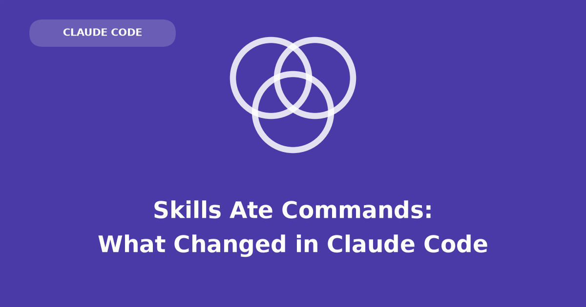

Most people who use Claude Code — Anthropic's coding agent, driven from a terminal — end up with a `.claude/commands/` directory. Inside it sit markdown files you wrote yourself: a canned prompt for opening a pull request, one for the release checklist you keep half-remembering, one for the way *this* repo wants a commit message. Each file name becomes a slash command, so `deploy.md` gives you `/deploy`, and typing it pastes the file's contents into the conversation. It is the cheapest automation in the tool: one file, one name, no configuration.

The ground has shifted under those files. [Custom commands have been merged into skills](https://code.claude.com/docs/en/skills), a format that keeps the same idea — a prompt you wrote, stored in the repo, summoned by name — and gives it a directory instead of a single file, plus a block of settings at the top saying who is allowed to summon it. A file at `.claude/commands/deploy.md` and a skill at `.claude/skills/deploy/SKILL.md` both produce `/deploy` and behave identically when you type it.

Nothing breaks. Existing command files keep working, and the [commands reference](https://code.claude.com/docs/en/commands) now simply points at skills as the way to add your own. What changed is everything you get *on top* of the `/name` interface: somewhere to put supporting files, frontmatter controlling who may invoke the skill, and — the change that matters most — Claude loading your prompt on its own when the conversation calls for it, without you typing anything.

That last one is where the two formats stop being the same thing wearing different filenames.

## A skill has two doors; a command had one

A slash command had exactly one entry point: you typed it. A skill has two, and the second is what the old format could not do at all.

**Directly**, slash-command style. Type `/skill-name` plus any arguments. Arguments land in the skill body via `$ARGUMENTS` (the whole argument string), `$ARGUMENTS[N]` or its shorthand `$N` for positional access (0-based, so `$0` is the first argument), or named placeholders declared in the frontmatter `arguments` field — `arguments: [file, format]` makes `$file` and `$format` expand to the first and second arguments.

**Implicitly**, by asking in plain language. Claude Code keeps every skill's `description` loaded in context. When your request matches one, Claude invokes the skill itself — no slash, no command name, you may not even know the skill exists. This is the piece commands never had, and it's [driven entirely by the `description` field](https://code.claude.com/docs/en/skills#control-who-invokes-a-skill).

Same skill, both doors:

::: {layout-ncol=2}
```text
# Direct: you point at it
/contrast-audit styles/main.css
```

```text
# Implicit: you describe the need
Is the button text readable
against that new background color?
```
:::

The left invocation substitutes `styles/main.css` into the skill body and runs it. The right one works because the skill's description says it audits CSS color contrast — Claude matches your phrasing against that description and invokes the skill on its own, with the arguments inferred from what you were talking about.

A second door only helps if there is a room worth entering, though, and the room is bigger than a command's was.

## A skill is a directory, and that is the whole point

A command was one markdown file, so everything it knew had to fit in that file and be read every time. A skill is a directory with `SKILL.md` as its required entrypoint, and the other files in that directory are the reason the format exists at all.

```text
my-skill/
├── SKILL.md         # required: YAML frontmatter + markdown instructions
├── reference.md     # optional: detailed docs, loaded only when needed
├── examples.md      # optional: sample outputs showing expected format
├── template.md      # optional: fill-in-the-blank templates
└── scripts/
    └── helper.py    # optional: executable — run, never loaded into context
```

`SKILL.md` itself has two parts doing two different jobs:

1. **YAML frontmatter** — metadata Claude uses to decide *when* to use the skill. Only the description is loaded into context up front.
2. **Markdown body** — the actual instructions. When the skill is invoked, the rendered body is [inserted into the conversation as a message](https://code.claude.com/docs/en/skills#skill-content-lifecycle) and stays there for the rest of the session. There is no magic: a skill *is* a prompt, injected on demand.

The split matters because of what it costs to know something. Everything Claude has in front of it competes for room in a finite context window, so a single-file command pays full price for every word it contains, every time it runs. `reference.md` and its siblings cost nothing until Claude decides it needs them, and scripts are executed rather than read, so their contents never enter the window at all. The body can also fetch live data before Claude sees any of it: a line like `` !`git diff HEAD` `` runs at invocation time and splices its output into the rendered prompt ([dynamic context injection](https://code.claude.com/docs/en/skills#inject-dynamic-context)).

Where the directory lives decides who gets the skill. There are four homes — enterprise (managed settings), personal (`~/.claude/skills/`), project (`.claude/skills/`), and plugins — and in each case the directory name becomes the command name.

## The frontmatter is where you decide who may invoke it

The settings block at the top of `SKILL.md` is small but it is where the interesting decisions live, because most of the fields are about *permission* and *timing* rather than behavior: who may fire this skill, with which tools, on which files, and whether it runs in your conversation or off to one side.

All fields are optional. `description` is the only *recommended* one, because it's what drives automatic invocation: Claude matches your phrasing against it, so write it as "what this does **+** when to use it," keywords a user would actually say. (The combined `description` + `when_to_use` text is truncated at 1,536 characters in the skill listing, so front-load the key use case.)

| Field | What it does |
|---|---------|
| `name` | Display name in skill listings. Defaults to the directory name (which is what names the `/command` for personal and project skills). |
| `description` | What the skill does and when to use it. Drives Claude's decision to auto-invoke. Falls back to the body's first paragraph if omitted. |
| `when_to_use` | Extra trigger context (phrasings, example requests). Appended to `description` in the listing. |
| `argument-hint` | Autocomplete hint for expected arguments, e.g. `[css-file]`. |
| `arguments` | Names for positional arguments, enabling `$name` substitution in the body. |
| `disable-model-invocation` | `true` = only you can invoke it. Use for side-effectful workflows (`/deploy`, `/commit`) where Claude shouldn't decide the timing. Also removes the description from context. |
| `user-invocable` | `false` = hidden from the `/` menu; only Claude can invoke it. For background knowledge that isn't a meaningful user action. |
| `allowed-tools` | Tools Claude may use *without a permission prompt* during the turn that invokes the skill. The grant clears on your next message. |
| `disallowed-tools` | Tools removed from Claude's pool while the skill is active. |
| `model` | Model override while the skill runs (rest of the current turn). |
| `effort` | Effort-level override (`low` … `max`) while the skill is active. |
| `context` | `fork` = run the skill in an isolated subagent instead of inline. See next section. |
| `agent` | Which subagent type executes a `context: fork` skill (default `general-purpose`). |
| `background` | With `context: fork`: `false` waits for the result in the invoking turn instead of running in the background (default `true`). |
| `hooks` | Hooks scoped to this skill's lifecycle. |
| `paths` | Glob patterns; the skill only auto-activates when Claude is working with matching files. |
| `shell` | `bash` (default) or `powershell` for `` !`command` `` dynamic-context lines. |

## A cookbook explains why the pieces are split up this way

That is a lot of fields for what is, after all, a prompt in a folder. The arrangement makes more sense if you stop thinking of it as configuration and think of it as a cookbook — a thing designed around the fact that a cook cannot hold every recipe in their head at once, which is exactly the constraint a context window imposes.

- The **name and description** are the recipe card in the index: what dish this makes, and when you'd want it. The cook (Claude) skims the index constantly; it's the only part always in memory.
- The **`SKILL.md` body** is the method — the actual numbered steps, read only when the dish is being made.
- The **supporting files** are the pre-made ingredients and specialty tools in the drawer: the stock in the freezer (`reference.md`), the plating photo (`examples.md`), the pasta machine (`scripts/`). They sit unused — costing nothing — until the recipe calls for them. This is what keeps the cookbook itself thin.
- **Invoking directly** (`/skill-name`) is pointing at the card and saying "make this one." **Natural-language invocation** is telling the cook what you're in the mood for and letting them pick the right recipe.

Old-style commands were recipe cards with the entire method crammed onto the card, and a cook who never opened the box unless you handed them a specific card. Skills give the cook an index and a drawer.

The analogy has one limit worth naming before it misleads you: the cook is still the same cook. A recipe does not hire a second chef, and by default neither does a skill.

## A skill is instructions; a subagent is a second worker

Those two get conflated constantly, and the confusion is expensive, because it leads people to expect isolation they are not getting.

**A skill (by default) is not an actor.** Invoking it loads its instructions *inline* into the current conversation — reference material or a procedure handed to the same Claude that's already talking to you. It shares your context, sees your history, and its content persists in the session after it runs.

**A [subagent](https://code.claude.com/docs/en/sub-agents) is a separate actor.** It has its own system prompt, its own tool access and permissions, and its own isolated context window. It doesn't see your conversation history; it receives a task, works alone, and returns a summary.

The bridge between them is `context: fork`. Add it to a skill's frontmatter and the skill body becomes the *prompt driving a subagent* rather than an insert into your conversation — the `agent` field picks which subagent type executes it, and by default it [runs in the background](https://code.claude.com/docs/en/skills#run-skills-in-a-subagent) while you keep working. That's opt-in, and it only makes sense for skills that contain an actual task ("audit X, report Y") — forking a pile of style guidelines gives the subagent no instructions to act on.

The same machinery composes in the reverse direction too: a custom subagent can declare a [`skills` field](https://code.claude.com/docs/en/sub-agents#preload-skills-into-subagents), which injects the *full content* of the listed skills into the subagent's context at startup as reference material.

Three combinations, then, differing in whose system prompt is in charge, where the task text comes from, and whether the work happens in your context or somewhere else:

| Approach | System prompt | Task comes from | Context |
|---|---|---|---|
| Skill (default) | your session's | SKILL.md body, inline | shared with your conversation, persists |
| Skill with `context: fork` | from the `agent` type | SKILL.md body | isolated subagent |
| Subagent with `skills:` | the subagent's own body | Claude's delegation message | isolated, skills preloaded as reference |

Rule of thumb: knowledge and procedures → skill. Work whose intermediate output you don't want flooding your context → subagent. A task you author but want executed off to the side → skill with `context: fork`.

## Building one: a contrast auditor that keeps its work out of context

Enough taxonomy — the argument for the directory format only lands when you watch a skill spend almost none of the context window on work that would otherwise fill it.

Here is a skill a front-end developer would actually keep. Text is readable only when it is bright enough against what is behind it, and the accessibility standard everyone is measured against, the [Web Content Accessibility Guidelines](https://www.w3.org/TR/WCAG21/#contrast-minimum) or WCAG, makes that precise: compute how much light each color reflects, take the ratio of the lighter to the darker, and demand at least 4.5 to 1 for ordinary body text. That threshold is the AA level; a stricter 7 to 1 is AAA. Fail it and some fraction of your users — anyone with low vision, anyone outdoors in sunlight — simply cannot read the words. It is also the kind of failure nobody notices in review, because the person reviewing has good eyes and a good monitor.

The skill scans a CSS file for foreground and background color pairs, computes the ratio for each, and produces a chart plus an HTML report. Everything below actually executes when this post is rendered — the chart and the report are real output, not screenshots pasted in.

The skill directory is two files:

```text
contrast-audit/
├── SKILL.md
└── scripts/
    └── audit.py
```

And the full `SKILL.md` — note how `${CLAUDE_SKILL_DIR}` appears in both the body and `allowed-tools`, so the exact command the body tells Claude to run is [pre-approved without a permission prompt](https://code.claude.com/docs/en/skills#pre-approve-tools-for-a-skill), wherever the skill is installed:

````yaml
---
name: contrast-audit
description: Audit a CSS file for WCAG color-contrast failures. Use when the
  user asks to check contrast, color accessibility, or whether text is
  readable against its background.
argument-hint: "[css-file]"
allowed-tools: Bash(python3 ${CLAUDE_SKILL_DIR}/scripts/audit.py *)
---

Audit the CSS file the user named (if none given, find `*.css` in the
project and ask which one):

```bash
python3 ${CLAUDE_SKILL_DIR}/scripts/audit.py $ARGUMENTS
```

The script prints one line per color pair, writes `contrast-chart.png` and
`contrast-report.html` next to the CSS file, and exits non-zero if any pair
fails AA.

After it runs:
1. Summarize the failures, worst ratio first.
2. For each failure, propose a darkened/lightened replacement hex that
   clears 4.5:1 while staying close to the original hue.
3. Point the user at `contrast-report.html` for the visual version.
````

Notice how little the body says. It names a command to run and three things to do afterwards, and that is the entire prompt — because the description says *what it does and when to use it*, "is this text readable against the background?" reaches it without the slash, and `/contrast-audit styles/main.css` reaches it deliberately.

### The script does the arithmetic so the model never has to

Everything the body delegated lives in `scripts/audit.py`, which is plain Python with no exotic dependencies: a regex to pull color pairs out of CSS rules, the WCAG relative-luminance formula, matplotlib for the chart, and string-built HTML for the report. The luminance formula is the fiddly part — each channel is scaled, gamma-corrected, and weighted (green counts for far more than blue, because the eye is more sensitive to it), and the ratio adds 0.05 to both terms so that pure black against pure black does not divide by zero.

None of that arithmetic belongs in a language model, and none of it enters the context window. Claude runs the script and reads its printed summary.

```{python}
#| code-fold: true
#| code-summary: "scripts/audit.py — the full script (click to expand)"
"""contrast-audit: WCAG contrast checker for CSS color pairs."""
import re
import sys
from dataclasses import dataclass
from pathlib import Path

import matplotlib.pyplot as plt

HEX = r"#[0-9a-fA-F]{6}\b|#[0-9a-fA-F]{3}\b"
AA, AAA = 4.5, 7.0

# Status colors for the chart: good / warning / critical.
GRADE_COLOR = {"AAA": "#0ca30c", "AA": "#fab219", "FAIL": "#d03b3b"}
GRADE_LABEL = {"AAA": "AAA ✓", "AA": "AA only", "FAIL": "FAIL ✗"}


@dataclass
class Pair:
    selector: str
    fg: str
    bg: str
    ratio: float
    grade: str


def expand_hex(h: str) -> str:
    h = h.lstrip("#").lower()
    if len(h) == 3:
        h = "".join(c * 2 for c in h)
    return f"#{h}"


def relative_luminance(hex_color: str) -> float:
    """WCAG 2.1 relative luminance of an sRGB color."""
    h = expand_hex(hex_color).lstrip("#")
    channels = [int(h[i : i + 2], 16) / 255 for i in (0, 2, 4)]
    lin = [c / 12.92 if c <= 0.04045 else ((c + 0.055) / 1.055) ** 2.4 for c in channels]
    return 0.2126 * lin[0] + 0.7152 * lin[1] + 0.0722 * lin[2]


def contrast_ratio(fg: str, bg: str) -> float:
    lighter, darker = sorted((relative_luminance(fg), relative_luminance(bg)), reverse=True)
    return (lighter + 0.05) / (darker + 0.05)


def grade(ratio: float) -> str:
    return "AAA" if ratio >= AAA else "AA" if ratio >= AA else "FAIL"


def parse_pairs(css: str) -> list[Pair]:
    """Find rules declaring both a text color and a background color (hex only)."""
    pairs = []
    for m in re.finditer(r"([^{}]+)\{([^}]*)\}", css):
        selector, body = m.group(1).strip(), m.group(2)
        fg = re.search(rf"(?<![-\w])color\s*:\s*({HEX})", body)
        bg = re.search(rf"background(?:-color)?\s*:\s*({HEX})", body)
        if fg and bg:
            f, b = expand_hex(fg.group(1)), expand_hex(bg.group(1))
            r = contrast_ratio(f, b)
            pairs.append(Pair(selector, f, b, r, grade(r)))
    return pairs


def contrast_chart(pairs: list[Pair], path: str | None = None):
    """Horizontal bars of contrast ratio, color-coded by grade, thresholds marked."""
    pairs = sorted(pairs, key=lambda p: p.ratio)
    fig, ax = plt.subplots(figsize=(8, 0.55 * len(pairs) + 1.2), dpi=150)
    fig.patch.set_facecolor("white")
    ys = range(len(pairs))
    ax.barh(ys, [p.ratio for p in pairs], height=0.55,
            color=[GRADE_COLOR[p.grade] for p in pairs], zorder=3)
    ax.set_ylim(-0.55, len(pairs) + 0.75)
    for thr, name in ((AA, "AA 4.5:1"), (AAA, "AAA 7:1")):
        ax.axvline(thr, color="#9aa0a6", lw=1, ls="--", zorder=2)
        ax.text(thr, len(pairs) + 0.05, f" {name}", color="#6b7280",
                fontsize=8, va="bottom")
    for y, p in zip(ys, pairs):
        ax.text(p.ratio + 0.15, y, f"{p.ratio:.2f}:1 · {GRADE_LABEL[p.grade]}",
                va="center", fontsize=8.5, color="#374151")
    ax.set_yticks(list(ys), [p.selector for p in pairs], fontsize=9)
    ax.set_xlim(0, max(p.ratio for p in pairs) + 4)
    ax.set_xlabel("contrast ratio", fontsize=9, color="#6b7280")
    ax.tick_params(colors="#6b7280", length=0)
    for spine in ax.spines.values():
        spine.set_visible(False)
    ax.grid(axis="x", color="#e5e7eb", lw=0.6, zorder=0)
    ax.set_title("WCAG contrast ratios by selector", fontsize=11,
                 color="#111827", loc="left")
    fig.tight_layout()
    if path:
        fig.savefig(path, bbox_inches="tight")
    return fig


def render_report(pairs: list[Pair]) -> str:
    """Self-contained HTML fragment: swatch preview per pair with pass/fail badges."""
    badge = lambda ok, label: (
        f'<span style="font:600 11px system-ui;padding:2px 8px;border-radius:10px;'
        f'color:#fff;background:{"#0ca30c" if ok else "#d03b3b"}">'
        f'{"✓" if ok else "✗"} {label}</span>'
    )
    rows = ""
    for p in sorted(pairs, key=lambda p: p.ratio):
        rows += f'''
        <div style="display:flex;align-items:center;gap:14px;padding:10px 12px;
                    border:1px solid #e5e7eb;border-radius:8px;margin:6px 0;
                    background:#fff">
          <div style="width:72px;height:44px;border-radius:6px;flex:none;
                      display:flex;align-items:center;justify-content:center;
                      font:700 18px system-ui;color:{p.fg};background:{p.bg};
                      border:1px solid #d1d5db">Aa</div>
          <div style="flex:1;font:13px ui-monospace,monospace;color:#111827">
            {p.selector}<br>
            <span style="color:#6b7280">{p.fg} on {p.bg}</span>
          </div>
          <div style="font:600 14px system-ui;color:#111827;width:64px">
            {p.ratio:.2f}:1</div>
          {badge(p.ratio >= AA, "AA")} {badge(p.ratio >= AAA, "AAA")}
        </div>'''
    return f'<div style="max-width:640px;font-family:system-ui">{rows}</div>'


def main(argv: list[str]) -> int:
    css_path = Path(argv[0]) if argv else Path("styles.css")
    pairs = parse_pairs(css_path.read_text())
    for p in sorted(pairs, key=lambda p: p.ratio):
        print(f"{p.selector:<14} {p.fg} on {p.bg}  {p.ratio:5.2f}:1  {p.grade}")
    contrast_chart(pairs, str(css_path.with_name("contrast-chart.png")))
    report = "<!DOCTYPE html><meta charset='utf-8'><title>Contrast audit</title>" \
             f"<body style='background:#f9fafb;padding:24px'>{render_report(pairs)}</body>"
    css_path.with_name("contrast-report.html").write_text(report)
    return 1 if any(p.grade == "FAIL" for p in pairs) else 0


if __name__ == "__main__" and "ipykernel" not in sys.modules:
    sys.exit(main(sys.argv[1:]))
```

### Running it on eight color pairs that a real project would have

The script needs a stylesheet to chew on, and the one below is written by hand for this post rather than lifted from a repo — eight rules covering a deliberate mix of comfortably passing, marginal, and outright broken pairs. Real project CSS would work identically, but it would also be mostly uninteresting: a genuine stylesheet is a few hundred lines in which two or three pairs matter, and the point here is the two or three. The hexes are not made up, though: `#0d6efd` is Bootstrap's link blue, and `#ffc107` is the yellow behind a thousand warning badges. The failures below are ones that shipped.

```{python}
#| code-fold: false
from pathlib import Path

Path("sample.css").write_text("""\
.body-text { color: #212529; background-color: #ffffff; }
.hero      { color: #ffffff; background-color: #4a3aa7; }
.alert     { color: #721c24; background-color: #f8d7da; }
.footer    { color: #adb5bd; background: #212529; }
.btn       { color: #ffffff; background-color: #6c757d; }
.link      { color: #0d6efd; background-color: #ffffff; }
.muted     { color: #999999; background-color: #ffffff; }
.badge     { color: #ffffff; background-color: #ffc107; }
""")

pairs = parse_pairs(Path("sample.css").read_text())
for p in sorted(pairs, key=lambda p: p.ratio):
    print(f"{p.selector:<12} {p.fg} on {p.bg}  {p.ratio:5.2f}:1  {p.grade}")
```

The printed lines are what Claude would read. The chart is for you: one bar per selector, sorted worst-first, with the two thresholds drawn in so a failure is a position rather than a number to look up.

```{python}
#| code-fold: false
#| fig-alt: "Horizontal bar chart of WCAG contrast ratios per CSS selector, color-coded green for AAA, amber for AA-only, red for fail, with dashed threshold lines at 4.5:1 and 7:1"
fig = contrast_chart(pairs, "contrast-chart.png")
```

Two results are worth stopping on. White on `#ffc107` — the classic warning badge — manages a dismal 1.63:1, which is close to invisible and yet is everywhere on the web. And `#0d6efd` on white clears the 4.5 threshold by 0.0008, landing at 4.5008:1. That is not luck. Someone tuned that hex until it sat *exactly* on the line, which is a decision you can only make if you were measuring, and a decision that leaves no margin at all for the next person who nudges the background a shade.

Neither observation is something a model would reliably produce by looking at hex codes, and both fall out of the script for free. What the model adds is the layer above: which failures matter, and what to change them to. The skill also leaves an HTML report next to the CSS file, embedded live here rather than screenshotted:

```{python}
#| code-fold: false
from IPython.display import HTML

report_fragment = render_report(pairs)
Path("contrast-report.html").write_text(
    "<!DOCTYPE html><meta charset='utf-8'><title>Contrast audit</title>"
    f"<body style='background:#f9fafb;padding:24px'>{report_fragment}</body>"
)
HTML(report_fragment)
```

That is the whole pattern. `SKILL.md` carries a thin instruction — run this script, then interpret — the script does the deterministic work, and Claude handles orchestration and the follow-up reasoning: proposing replacement hexes, explaining which failures matter. The heavy lifting never touches the context window, which is precisely the thing a single markdown file could not arrange.

Which raises the obvious question about the single markdown files you already have.

## Migration got cheap enough that "later" stopped being the right answer

My first answer to that was this, and I no longer believe it:

~~No — not for the sake of it. Everything in `.claude/commands/` keeps working, same names, [same frontmatter support](https://code.claude.com/docs/en/skills#where-skills-live). If a command and a skill share a name, the skill wins, so you can migrate one at a time whenever you touch one.~~

It is struck through because my friend [Scott Mountenay](https://www.linkedin.com/in/scott-mountenay-58706147/) read it and pushed back:

> As far as the blog and the question should you change all your commands to skills, and you say "no rush, they'll keep working for now"… my instinct is more like "hell yeah, have Claude do it for you!" In the past there was more of a cost like "it's not a high priority thing to do right now", but now it's like "go do this for me Claude, migrate my commands to skills and create a [PR]", done in 5 minutes, why not?

He's right, and the reason he's right is that my original answer was priced in an older currency. "Migrate when you next touch it" is what you say when migrating means *you* sit down, read each command file, make a directory, move the body, write a description, and check nothing broke — an afternoon of clerical work against a benefit you can defer. That was the honest trade for as long as the clerical work was yours to do. It isn't the trade now: the migration is a mechanical, well-specified, entirely-in-context transformation, which is exactly the shape of work you hand to an agent. The cost isn't "an afternoon," it's one prompt and a PR review.

So: migrate them, in bulk, today. A prompt roughly like this is the whole job.

```text
Migrate every file in .claude/commands/ to .claude/skills/<name>/SKILL.md.
Keep each command's body verbatim. Add a description in the frontmatter
saying what it does and when to use it, phrased the way I'd ask for it.
Set disable-model-invocation: true on anything side-effectful (deploy,
commit, release). Delete the old command files and open a PR.
```

Read the PR, though — don't merge it blind. The one judgement call in there is which commands should stay user-only: a skill without `disable-model-invocation` is now something Claude can fire on its own, and a `/deploy` that used to run only when you typed it is a different object once its description is sitting in context. That's the review, and it's minutes, not an afternoon.

And write anything *new* as a skill. The moment a prompt wants a helper script, a reference doc, an `allowed-tools` grant, or — most usefully — the ability to fire when someone merely describes the problem, the single-file command format has nothing left to offer.

Which is the real shift, and it is not a file-format one. A command was something you remembered to type; the burden of knowing it existed was yours. A skill is something the cook can pick off the index, run from a drawer you never open, and hand back a result without ever having loaded the recipe into working memory. The `/name` still works exactly as it did — but it is now the least interesting way in.

## References

- [Extend Claude with skills](https://code.claude.com/docs/en/skills) — Claude Code docs: skill anatomy, frontmatter reference, invocation control, `context: fork`.
- [Commands reference](https://code.claude.com/docs/en/commands) — built-in commands and bundled skills.
- [Create custom subagents](https://code.claude.com/docs/en/sub-agents) — subagent definition, built-in agent types, preloading skills with the `skills` field.
- [Agent Skills](https://agentskills.io) — the open standard Claude Code skills follow.
