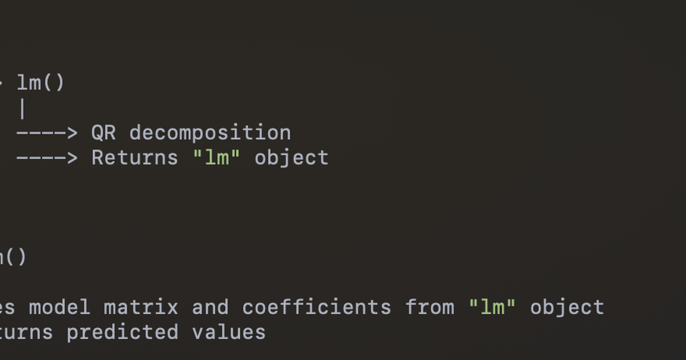
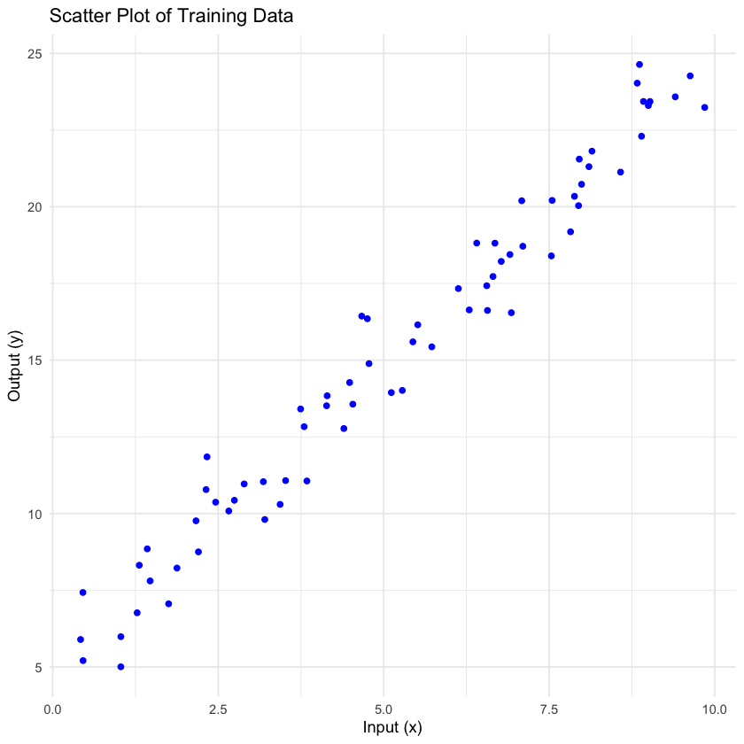
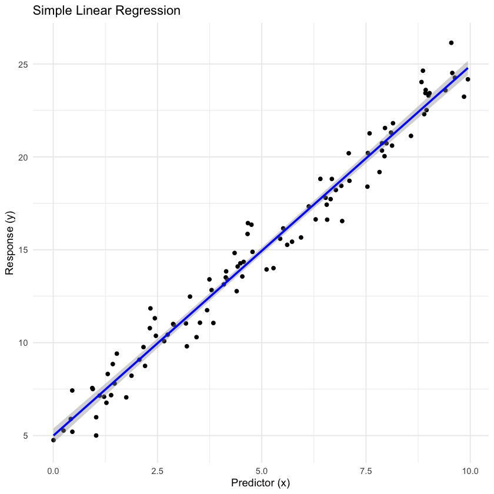

Anyone who has moved between R and Python has felt the difference before they could
name it. In R, `lm(y ~ x, data = d)` hands back a fitted model; the call that creates
the object is the call that trains it. In scikit-learn, `LinearRegression()` hands
back an object that has never seen data, and nothing happens until `.fit(X, y)`. The
results are the same, as the worked example below shows to two decimal places. What
differs is *when* fitting happens and what mechanism makes that timing possible, and
that mechanism is the subject here: S3 generic functions on the R side, a class with
two methods on the Python side. The post ends by building each style in the other
language, which is the quickest way to see that the choice is a convention rather
than a constraint. The scikit-learn convention has since spread well beyond
scikit-learn, to Keras and much of the PyTorch ecosystem; R's is the older one, and
its formula interface is the reason it survives.

## S3 dispatch is what lets a constructor also be a trainer

R's most used object system, S3, has no classes in the usual sense. An object is a
list with a `class` attribute, and a *generic function* such as `print` looks at that
attribute and dispatches to `print.<class>` if one exists, or to a default. Three
lines define a class and one more gives it a print method:

```r
create_human <- function(name, age) {
  human <- list(name = name, age = age)
  class(human) <- "human"
  return(human)
}

print.human <- function(x, ...) {
  cat("Human Attributes \n")
  cat("Name: ", x$name, "\n")
  cat("Age: ", x$age, "\n")
}

john <- create_human("John Doe", 30)
print(john)
```

```
Human Attributes
Name:  John Doe
Age:  30
```

Model functions work the same way. `lm`, `glm`, `rpart` and `randomForest` each build
the model matrix from a formula, solve for the parameters, and return a list tagged
with a class, so that `print`, `summary` and `predict` dispatch to the right method
afterwards. Stripped of the numerical care (the QR decomposition is real, the edge
cases and Fortran calls are omitted), `lm` is a function that fits on the way out:

```r
lm <- function(formula, data, ...) {
  mf <- model.frame(formula = formula, data = data)   # rows and columns the formula names
  X <- model.matrix(attr(mf, "terms"), mf)             # design matrix, intercept included
  y <- model.response(mf)
  fit <- qr.solve(qr(X), y)                            # least squares
  result <- list(coefficients = fit, residuals = y - X %*% fit,
                 fitted.values = X %*% fit, qr = qr(X),
                 terms = terms(formula), call = match.call())
  class(result) <- "lm"
  result
}
```

There is no unfitted `lm` object because the function that makes one does the
fitting. Prediction is then `predict(model, newdata)`, which dispatches to
`predict.lm` and reads the coefficients out of the object. Two arrows, and no `fit`
step anywhere a user can see:

```
lm(y ~ x, data)          -> model.frame -> model.matrix -> QR solve -> object of class "lm"
predict(model, newdata)  -> predict.lm  -> coefficients from the object -> predictions
```

## The same regression, the same score, from both sides

The data is synthetic on purpose, so that nothing about cleaning, scaling, encoding or
outliers gets in the way of the API comparison: a hundred points on a line of slope 2
and intercept 5 with unit Gaussian noise, split 70/15/15 into train, dev and test
with a fixed seed.

```r
generate_linear_data <- function(n = 100, seed = 123, slope = 2, intercept = 5, noise_sd = 1) {
  set.seed(seed)
  x <- runif(n, min = 0, max = 10)
  y <- intercept + slope * x + rnorm(n, mean = 0, sd = noise_sd)
  data.frame(x = x, y = y)
}

split_data <- function(data, train_ratio = 0.7, dev_ratio = 0.15, test_ratio = 0.15, seed = 123) {
  if (train_ratio + dev_ratio + test_ratio != 1) stop("ratios must sum to 1")
  set.seed(seed)
  n <- nrow(data)
  train_indices <- sample(seq_len(n), size = floor(train_ratio * n))
  remaining <- setdiff(seq_len(n), train_indices)
  dev_indices <- sample(remaining, size = floor(dev_ratio * n))
  test_indices <- setdiff(remaining, dev_indices)
  list(train = data[train_indices, ], dev = data[dev_indices, ], test = data[test_indices, ])
}

df <- split_data(generate_linear_data())
head(df$train)
```

```
   x         y
31 9.6302423 24.266249
79 3.5179791 11.074102
51 0.4583117  5.206217
14 5.7263340 15.434093
67 8.1006435 21.306963
42 4.1454634 13.839324
```



In R the fit is the constructor call, and `summary` dispatches on the result:

```r
lm_model <- lm(y ~ x, data = df$train)
summary(lm_model)
```

```
Call:
lm(formula = y ~ x, data = df$train)

Residuals:
     Min       1Q   Median       3Q      Max
-2.13378 -0.74871 -0.05242  0.59871  2.34082

Coefficients:
            Estimate Std. Error t value Pr(>|t|)
(Intercept)  4.85761    0.26186   18.55   <2e-16 ***
x            1.99524    0.04485   44.49   <2e-16 ***

Residual standard error: 1.018 on 68 degrees of freedom
Multiple R-squared:  0.9668,	Adjusted R-squared:  0.9663
F-statistic:  1979 on 1 and 68 DF,  p-value: < 2.2e-16
```

The slope and intercept land within a standard error of the 2 and 5 the data were
made from. Scored on the dev set with mean absolute percentage error:

```r
dev_predictions <- predict(lm_model, newdata = df$dev)
mape <- mean(abs((df$dev$y - dev_predictions) / df$dev$y)) * 100
print(paste0("MAPE on dev set: ", round(mape, 2), "%"))
```

```
[1] "MAPE on dev set: 4.49%"
```



Now the same split, written to CSV from R and read into pandas, through
scikit-learn. Three steps where R had one: construct, fit, predict.

```python
import pandas as pd
from sklearn.linear_model import LinearRegression
from sklearn.metrics import mean_absolute_percentage_error

df_train = pd.read_csv("train_data.csv")
df_dev = pd.read_csv("dev_data.csv")

model = LinearRegression()                              # nothing fitted yet
model.fit(df_train[["x"]], df_train["y"])               # now it is
dev_predictions = model.predict(df_dev[["x"]])

mape = mean_absolute_percentage_error(df_dev["y"], dev_predictions) * 100
print(f"MAPE on dev set: {mape:.2f}%")
```

```
MAPE on dev set: 4.49%
```

Identical to the R figure, as it must be: both solve the same least-squares problem
on the same seventy rows. The 4.49% is a property of the data and the model, not of
either library, which is the point of running it twice.

## Either convention can be built in the other language

Because the difference is convention, each side can wear the other's clothes. A
Python class that takes a formula, parses it, and fits on `__call__` gives
scikit-learn an R-shaped front door:

```python
class RStyleModel:
    def __init__(self, model_class, **kwargs):
        self.model_class = model_class
        self.kwargs = kwargs
        self.fitted_model = None

    def __call__(self, formula, data):
        y, X = self._parse_formula(formula, data)
        self.fitted_model = self.model_class(**self.kwargs)
        self.fitted_model.fit(X, y)
        return self

    def predict(self, X):
        if self.fitted_model is None:
            raise ValueError("Model has not been fitted yet.")
        return self.fitted_model.predict(X)

    def _parse_formula(self, formula, data):
        response, predictors = formula.split("~")
        y = data[response.strip()]
        if predictors.strip() == ".":
            X = data.drop(response.strip(), axis=1)
        else:
            X = data[[p.strip() for p in predictors.split("+")]]
        return y, X


lm = RStyleModel(LinearRegression)
lm("y ~ x", df_train)                                   # fits here, as R would
linear_predictions = lm.predict(df_dev[["x"]])
mape = mean_absolute_percentage_error(df_dev["y"], linear_predictions) * 100
print(f"MAPE on dev set: {mape:.2f}%")
```

```
MAPE on dev set: 4.49%
```

The other direction, an R object with an explicit `fit`, can be written in any of
R's object systems. In S3 it is a constructor that returns an empty object and a
`fit` generic that fills it:

```r
LinearRegression <- function() {
  structure(list(coefficients = NULL, intercept = NULL), class = "LinearRegression")
}

fit.LinearRegression <- function(model, X, y) {
  X <- cbind(1, X)
  beta <- solve(t(X) %*% X) %*% t(X) %*% y
  model$intercept <- beta[1]
  model$coefficients <- beta[-1]
  model
}

predict.LinearRegression <- function(model, X) {
  cbind(1, X) %*% c(model$intercept, model$coefficients)
}

model <- LinearRegression()
model <- fit(model, df$train["x"], df$train["y"])
```

In R6, which has mutable objects and methods that live on them, it reads almost as
the Python does:

```r
library(R6)

LinearRegression <- R6Class("LinearRegression",
  public = list(
    coefficients = NULL, intercept = NULL,
    fit = function(X, y) {
      X <- cbind(1, X)
      beta <- solve(t(X) %*% X) %*% t(X) %*% y
      self$intercept <- beta[1]
      self$coefficients <- beta[-1]
      invisible(self)
    },
    predict = function(X) cbind(1, X) %*% c(self$intercept, self$coefficients)
  )
)

model <- LinearRegression$new()
model$fit(df$train["x"], df$train["y"])
```

S4 and Reference Classes can do the same with more ceremony. The S3 version is the
one to notice: it shows that R never lacked the ability to separate construction from
fitting. `lm` fits on construction because its authors chose to, in 1990s S, for the
interactive statistician who wants the summary in one line.

## Where it stops holding

The imitation is shallow in one direction. R's formula interface is not a string with
a tilde in it; `y ~ x + z:w` encodes interactions, factors expand to dummy columns,
and `model.matrix` does the work that the `_parse_formula` above waves at. The
Python side has that machinery in `patsy` and `statsmodels`, which is where an R user
who wants formulas should look rather than at a wrapper. In the other direction, R
has already adopted the explicit style where it matters: `tidymodels` separates a
model specification from its fit exactly as scikit-learn does, for the same reason,
that a pipeline needs an unfitted model object to hold a place in it.

Which to prefer is a question about the session. One-line fit-and-summarise suits
exploration at a console; construct-then-fit suits a program, where the unfitted
object can be configured, cloned, cross-validated and put in a pipeline before any
data arrives. Neither is more correct, and the score does not care.

Python. Fits. Objects. R. Fits. Formulas. Either. Interface. Can. Be. Imitated.

## References

- Chambers, J. M. and Hastie, T. J. (1992). *Statistical Models in S*. Wadsworth.
  The origin of the formula interface and the fit-on-construction convention.
- Wickham, H. (2019). *Advanced R*, 2nd ed., chapters 13 (S3) and 14 (R6).
- Buitinck, L. et al. (2013). API design for machine learning software: experiences
  from the scikit-learn project. arXiv:1309.0238. The estimator interface, and why
  `fit` is separate.
- [scikit-learn: developing estimators](https://scikit-learn.org/stable/developers/develop.html).
- [tidymodels: parsnip](https://parsnip.tidymodels.org/), R's explicit
  specify-then-fit interface.
