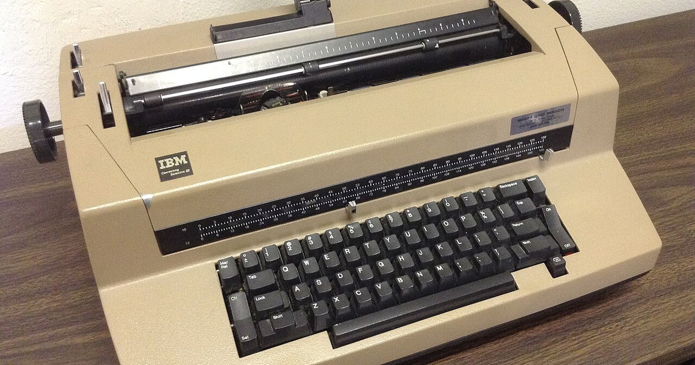

Every prompt you have ever typed is a sequence of tokens, and every token is an index into a lookup table of vectors. The model never sees your words; it sees the vectors those words select. That table has 50,257 rows for GPT-2, and writing a prompt means picking a path through them.

Which raises the question this post is about: why restrict yourself to rows of the table? The vectors live in a continuous 768-dimensional space, and the ones the vocabulary happens to occupy are a vanishingly small, arbitrary subset of it. A **soft prompt** is what you get when you drop the restriction — a sequence of vectors optimised directly by gradient descent, free to land anywhere.

The claim is that this is a genuine expansion rather than a reparameterisation, and it is demonstrable. Below, a soft prompt is initialised from the words *"Classify the review sentiment:"* — so it starts exactly on the vocabulary — and after sixty training steps it has moved somewhere that no sequence of tokens can express.

## Hard prompts are a discrete search

A hard prompt is text. Its virtues are that you can read it, version it, paste it into a bug report, and move it between models without retraining. Its limitation is that improving it means *search* over a discrete space, guided by intuition, because there is no gradient from "the output was wrong" back to "use the word *carefully* instead of *thoroughly*".

```{python}
import warnings

warnings.filterwarnings("ignore")

import torch
from transformers import AutoTokenizer, AutoModelForCausalLM

MODEL = "openai-community/gpt2"
tokenizer = AutoTokenizer.from_pretrained(MODEL)
tokenizer.pad_token = tokenizer.eos_token
model = AutoModelForCausalLM.from_pretrained(MODEL)

HARD_PROMPT = "Classify the review sentiment:"
ids = tokenizer(HARD_PROMPT, return_tensors="pt")["input_ids"]
embeddings = model.get_input_embeddings()(ids)[0]

print(f"prompt      : {HARD_PROMPT!r}")
print(f"tokens      : {tokenizer.convert_ids_to_tokens(ids[0])}")
print(f"becomes     : a {tuple(embeddings.shape)} tensor")
print(f"vocabulary  : {model.get_input_embeddings().weight.shape[0]:,} rows of width "
      f"{model.get_input_embeddings().weight.shape[1]}")
```

Six tokens become six vectors of width 768. Everything the prompt does, it does through those vectors — and a hard prompt can only ever select from the 50,257 that the tokenizer knows about.

## A soft prompt starts on the vocabulary

`peft` implements soft prompts as a small tensor prepended to the input embeddings, with the entire model frozen. Crucially it can be *initialised from text*, which is what makes the comparison exact — we begin at the hard prompt and see where gradients take us.

```{python}
from peft import PromptTuningConfig, PromptTuningInit, TaskType, get_peft_model

config = PromptTuningConfig(
    task_type=TaskType.CAUSAL_LM,
    num_virtual_tokens=8,
    prompt_tuning_init=PromptTuningInit.TEXT,
    prompt_tuning_init_text=HARD_PROMPT,
    tokenizer_name_or_path=MODEL,
)
peft_model = get_peft_model(model, config)
peft_model.print_trainable_parameters()
```

8 virtual tokens × 768 dimensions = 6,144 trainable parameters, 0.005% of GPT-2. Everything else is frozen — this is the same family of technique as LoRA, discussed in the [companion post on `peft`](../peft/index.qmd), but intervening on the input rather than on the weights.

To see where the soft prompt *is*, decode it: for each of its 8 vectors, find the vocabulary row it most resembles.

```{python}
vocabulary = model.get_input_embeddings().weight.detach()


def nearest_tokens(prompt_vectors):
    """Closest vocabulary token to each prompt vector, by cosine similarity."""
    similarity = (
        torch.nn.functional.normalize(prompt_vectors, dim=-1)
        @ torch.nn.functional.normalize(vocabulary, dim=-1).T
    )
    best = similarity.max(-1)
    return [tokenizer.decode([i]) for i in best.indices], best.values


before = peft_model.get_prompt_embedding_to_save("default").detach().clone()
tokens_before, similarity_before = nearest_tokens(before)

print(f"nearest tokens   : {tokens_before}")
print(f"mean similarity  : {similarity_before.mean():.3f}")
```

Similarity 1.000, and the tokens spell out the original phrase. That is the point of initialising from text: at step zero the soft prompt *is* the hard prompt, exactly, so anything that happens next is attributable to training rather than to a different starting point.

## Training moves it off the vocabulary

Now optimise it on a tiny sentiment task — eight examples, all of the model frozen except those 6,144 numbers.

```{python}
POSITIVE = ["great film", " loved it", " wonderful acting", " a masterpiece"]
NEGATIVE = ["terrible film", " hated it", " awful acting", " a disaster"]

examples = [f"Review: {text} Sentiment: positive" for text in POSITIVE] + [
    f"Review: {text} Sentiment: negative" for text in NEGATIVE
]
batch = tokenizer(examples, return_tensors="pt", padding=True)
targets = batch["input_ids"].clone()
targets[batch["attention_mask"] == 0] = -100

optimizer = torch.optim.AdamW(
    [p for p in peft_model.parameters() if p.requires_grad], lr=0.05
)

peft_model.train()
for step in range(60):
    output = peft_model(**batch, labels=targets)
    output.loss.backward()
    optimizer.step()
    optimizer.zero_grad()
    if step % 20 == 0:
        print(f"step {step:2d}  loss {output.loss.item():.4f}")
print(f"step 59  loss {output.loss.item():.4f}")
```

The loss falls substantially, and it fell by moving only the prompt. Now decode the prompt again:

```{python}
after = peft_model.get_prompt_embedding_to_save("default").detach().clone()
tokens_after, similarity_after = nearest_tokens(after)

print(f"nearest tokens  : {tokens_after}")
print(f"mean similarity : {similarity_after.mean():.3f}   (was {similarity_before.mean():.3f})")
print(f"distance moved  : {(after - before).norm():.1f}")
```

This is the result the post exists for. The mean similarity to the nearest real token has collapsed from **1.000 to roughly 0.33**, and the decoded tokens are no longer language — unrelated nouns and a fragment of mojibake, where the phrase used to be. The positions that barely moved still decode to their original tokens, which makes the contrast within the same prompt: some of it stayed near the vocabulary and some of it left.

The soft prompt has left the vocabulary. There is no longer any sentence you could type that would produce these vectors, which means whatever it learned is not expressible as a hard prompt at all. The continuous space genuinely contains instructions the discrete space does not.

### Caveat: eight examples and no held-out set

The loss above is training loss on eight hand-written strings, and this training loss does not measure classification accuracy. It very likely overfits: 6,144 parameters against eight short examples is ample capacity to memorise them.

The drift result does not depend on that — the prompt provably left the vocabulary manifold regardless of whether it learned anything useful — but do not read the falling loss as evidence of a working classifier. Prompt tuning is known to need reasonably large base models before it becomes competitive with fine-tuning, and GPT-2 small is under that bar.

## Which to reach for

The two are not competitors so much as different regimes, and the distinguishing question is whether you have labelled data and gradient access.

| | Hard prompt | Soft prompt |
|---|---|---|
| Lives in | 50,257 discrete tokens | continuous ℝ⁷⁶⁸ per position |
| Improved by | human search, trial and error | gradient descent |
| Needs | nothing | training data, backprop access |
| Portable across models | yes | no — tied to one embedding space |
| Human-readable | yes | no, as demonstrated above |
| Works via API | yes | only if the provider exposes tuning |

Hard prompts are the default for good reasons: zero setup, they survive a model swap, and you can debug them by reading them. Soft prompts earn their place when you have a fixed task with labelled examples, you cannot or will not fine-tune the whole model, and you need more than words can express.

## What the drift shows

The claim was that soft prompts are a real expansion of what a prompt can be, not a reparameterisation of text. The evidence is a single number moving: cosine similarity to the nearest real token, 1.000 at initialisation and about 0.33 after sixty steps. The prompt began as a sentence and ended somewhere unspeakable.

The cost of that expressiveness is the vocabulary: transfer, review, and a string you can type. A soft prompt is tied to the exact embedding matrix it was trained against, so it does not transfer to another model or survive a tokenizer change. It cannot be reviewed, diffed, or explained to a colleague. And it cannot be typed into a chat box — it is a tensor, and it has to be loaded as one.

That is the trade in one sentence: you gain the space between the words, and you lose the words.
