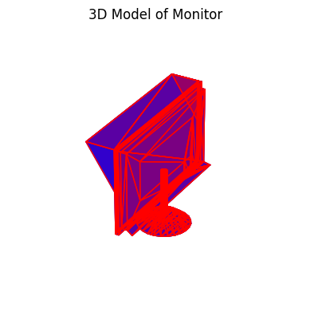
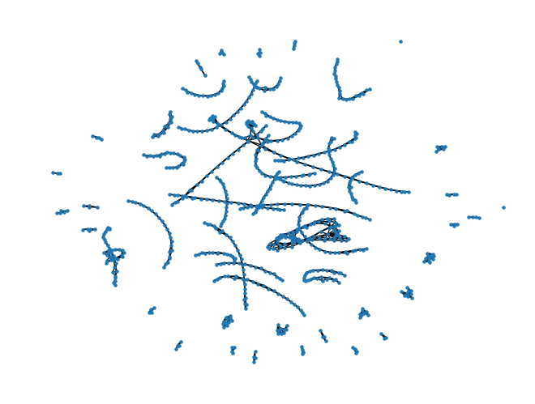
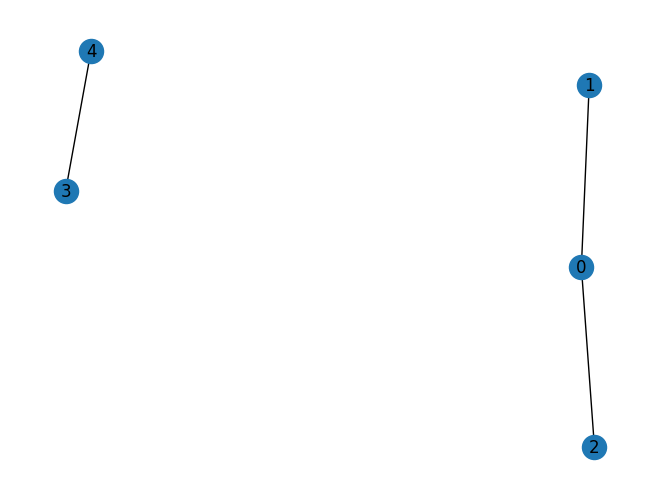

 on [Unsplash](https://unsplash.com/photos/a-very-tall-building-with-a-lot-of-windows-uFzY1WCJWMA).](./cover.png)

A graph with 798 nodes has an adjacency matrix with 636,804 entries, and for the
mesh graph below 2,952 of them are ones. Storing the other 633,852 zeros costs five
megabytes as 64-bit integers, and multiplying the matrix by itself spends almost all
of its time multiplying zeros by zeros. Sparse formats exist to skip both, and PyTorch
has had them for years. This post builds the two common formats by hand on a toy
graph, then measures what they buy on the real one, and the measuring is where the
lesson is: the first thing anyone reaches for to check the memory saving reports no
saving at all, and the speed comparison that looks the most impressive compares two
different libraries. The numbers were run in April 2024 and are kept as they were;
what changed in the rewrite is what they are said to mean.

## A mesh is a graph, and its adjacency matrix is half a percent ones

The example is one object from ModelNet10, a benchmark of 4,899 CAD models in ten
categories: a monitor, stored as an OFF file of vertices and triangular faces. Read
the file, draw the faces, and it is recognisably a screen on a stand:

```python
import matplotlib.pyplot as plt
import numpy as np
from mpl_toolkits.mplot3d.art3d import Poly3DCollection


def read_off(file):
    if "OFF" != file.readline().strip():
        raise ValueError("Not a valid OFF header")
    n_verts, n_faces, _ = tuple(map(int, file.readline().strip().split(" ")))
    verts = [[float(s) for s in file.readline().strip().split(" ")] for _ in range(n_verts)]
    faces = [[int(s) for s in file.readline().strip().split(" ")[1:]] for _ in range(n_faces)]
    return verts, faces


with open("./data/monitor_0001.off") as f:
    verts, faces = read_off(f)

fig = plt.figure()
ax = fig.add_subplot(111, projection="3d")
polys = [np.array(verts)[face] for face in faces]
collection = Poly3DCollection(polys, linewidths=1, alpha=1)
collection.set_facecolor((0, 0, 1, 0.5))
collection.set_edgecolor((0, 0, 1, 0.5))
ax.add_collection3d(collection)
ax.add_collection3d(Poly3DCollection(polys, facecolors="r", linewidths=1, edgecolors="r", alpha=0.20))
ax.axis("off")
scale = np.array(verts).flatten()
ax.auto_scale_xyz(scale, scale, scale)
ax.set_title("3D Model of Monitor")
plt.show()
```



Each vertex is a node and each side of each face is an edge, which `networkx` turns
into a graph in a few lines:

```python
import networkx as nx


def off_to_graph(verts, faces):
    G = nx.Graph()
    for i in range(len(verts)):
        G.add_node(i)
    for face in faces:
        for i in range(len(face)):
            G.add_edge(face[i], face[(i + 1) % len(face)])
    return G


G = off_to_graph(verts, faces)
print(G)
```

```
Graph with 798 nodes and 1476 edges
```



Drawn by a spring layout instead of its coordinates, the monitor dissolves into
chains and small clusters of nodes, which is the point: with 1,476 edges among 798
nodes, most nodes touch only two or three others, and the picture is mostly empty
space because the matrix is. The adjacency matrix `A` has a one
at `A[i, j]` when nodes `i` and `j` share an edge, so each undirected edge is two
ones, and the density is those ones over the whole square:

```python
A = nx.to_numpy_array(G)
A.shape, A.sum() / 2 == len(G.edges())
np.count_nonzero(A) / (A.shape[0] * A.shape[1])
```

```
((798, 798), True)
0.004635649273559839
```

Under half a percent. Real graphs are usually sparser still: a social network or a
citation graph with a million nodes has a density measured in millionths, and its
dense adjacency matrix would not fit on any machine.

## COO lists the coordinates; CSR compresses the row index into pointers

The formats are easier to see on a graph small enough to print. Five nodes, three
edges, in two components:

```python
G = nx.Graph()
G.add_edge(0, 1)
G.add_edge(0, 2)
G.add_edge(3, 4)
nx.draw(G, with_labels=True)
plt.show()
```



```python
import torch

A_torch = torch.from_numpy(nx.to_numpy_array(G)).bool()
A_torch
```

```
tensor([[False,  True,  True, False, False],
        [ True, False, False, False, False],
        [ True, False, False, False, False],
        [False, False, False, False,  True],
        [False, False, False,  True, False]])
```

**COO**, for coordinate, is the format anyone would invent first: three arrays of the
same length, the row index, the column index and the value of each nonzero. PyTorch
converts with one call, and the result reads as a list of the six ones:

```python
A_coo = A_torch.to_sparse()
A_coo
```

```
tensor(indices=tensor([[0, 0, 1, 2, 3, 4],
                       [1, 2, 0, 0, 4, 3]]),
       values=tensor([True, True, True, True, True, True]),
       size=(5, 5), nnz=6, layout=torch.sparse_coo)
```

Written out as an edge table it is exactly the graph's edge list, once in each
direction:

| row | col | value |
|---|---|---|
| 0 | 1 | True |
| 0 | 2 | True |
| 1 | 0 | True |
| 2 | 0 | True |
| 3 | 4 | True |
| 4 | 3 | True |

The conversion is a `nonzero` and a constructor, and the way back is a zero tensor
and an indexed put:

```python
def to_sparse(tensor):
    indices = torch.nonzero(tensor).t()
    values = tensor[indices[0], indices[1]]
    return torch.sparse_coo_tensor(indices, values, tensor.size())


def to_dense(sparse_tensor):
    s = sparse_tensor.coalesce()
    dense = torch.zeros(s.size(), dtype=s.values().dtype)
    dense.index_put_(tuple(s.indices()), s.values(), accumulate=False)
    return dense


to_dense(to_sparse(A_torch)).equal(A_torch)   # True
```

**CSR**, compressed sparse row, keeps the column indices and values of COO and
replaces the row array with something shorter. Sort the nonzeros by row, and the row
array becomes runs of repeated numbers: `0, 0, 1, 2, 3, 4` above. Instead of storing
the runs, store where each row's run *starts*. That is the row pointer, `crow`, of
length rows + 1, and row `i`'s nonzeros are `values[crow[i]:crow[i+1]]` with columns
`col[crow[i]:crow[i+1]]`:

```python
A_torch.to_sparse_csr()
```

```
tensor(crow_indices=tensor([0, 2, 3, 4, 5, 6]),
       col_indices=tensor([1, 2, 0, 0, 4, 3]),
       values=tensor([True, True, True, True, True, True]), size=(5, 5), nnz=6,
       layout=torch.sparse_csr)
```

Read `crow` as a cumulative count: row 0 has two nonzeros (0 to 2), row 1 has one
(2 to 3), and so on to the last entry, which is the total. The homebrew version is a
`bincount` and a `cumsum`, and the inverse loops over rows slicing the runs back
out:

```python
def to_csr(tensor):
    rows, cols = torch.nonzero(tensor, as_tuple=True)
    values = tensor[rows, cols]
    crow = torch.zeros(tensor.size(0) + 1, dtype=torch.long)
    crow[1:] = torch.bincount(rows, minlength=tensor.size(0))
    return values, cols, torch.cumsum(crow, dim=0)


def from_csr(values, cols, crow, num_cols):
    num_rows = crow.size(0) - 1
    dense = torch.zeros((num_rows, num_cols), dtype=values.dtype)
    for i in range(num_rows):
        start, end = crow[i].item(), crow[i + 1].item()
        dense[i, cols[start:end]] = values[start:end]
    return dense


to_csr(A_torch)
```

```
(tensor([True, True, True, True, True, True]),
 tensor([1, 2, 0, 0, 4, 3]),
 tensor([0, 2, 3, 4, 5, 6]))
```

Two details of the homebrew `to_csr` differ from the version in the original
notebook. The `bincount` needs `minlength`, or a trailing all-zero row shortens the
pointer array; and `from_csr` takes the column count as an argument, because
inferring it from the largest column index present drops any trailing all-zero
column. Both are the kind of bug a five-node example never triggers.

CSR is the format the fast kernels want, because a row's neighbours are one
contiguous slice, which is what a row-by-row matrix product reads. **CSC** is the
same idea by columns. The two-way conversions are what the format menu looks like in
practice: build in COO, because appending a nonzero is appending to three lists, then
convert to CSR to compute.

## The saving has to be counted from what the format stores

Back on the monitor graph, the obvious check is to ask each tensor for its size:

```python
with open("./data/monitor_0001.off") as f:  # G was the toy graph; rebuild the monitor
    verts, faces = read_off(f)
G = off_to_graph(verts, faces)
A = nx.adjacency_matrix(G)                 # scipy CSR, 798 x 798, 2952 stored
A_dense = torch.from_numpy(A.toarray())    # int64


def tensor_memory_usage_str(tensor):
    bytes = tensor.element_size() * tensor.nelement()
    return f"Memory usage: {bytes} bytes ({bytes / 1024} KB)"


tensor_memory_usage_str(A_dense)
tensor_memory_usage_str(A_dense.to_sparse())
tensor_memory_usage_str(A_dense.to_sparse_csr())
```

```
'Memory usage: 5094432 bytes (4975.03125 KB)'
'Memory usage: 5094432 bytes (4975.03125 KB)'
'Memory usage: 5094432 bytes (4975.03125 KB)'
```

The same number three times, and the original notebook took that at face value and
concluded there was no memory saving in this case. There is; the measurement is
wrong. `nelement()` is the number of elements in the tensor's *logical* shape, all
636,804 of them, whatever the layout, so the product with `element_size()` is the
dense cost by definition. What a sparse tensor holds is its index and value arrays,
and their sizes follow from the format:

| Layout | What is stored | Bytes | Against dense |
|---|---|---|---|
| dense, int64 | 798 × 798 values | 5,094,432 | 1× |
| COO | 2 × 2,952 int64 indices + 2,952 int64 values | 70,848 | 72× smaller |
| CSR | 799 int64 pointers + 2,952 int64 columns + 2,952 int64 values | 53,624 | 95× smaller |

Those are arithmetic from `nnz = 2952`, not measurements, and PyTorch reports the
same figures if each constituent array is asked separately
(`A_coo.indices()`, `A_coo.values()`, and so on). The rule they illustrate is
general: a sparse format costs about `nnz` times the size of an index plus a value,
so it wins once the density drops below roughly one entry in three for COO, and the
win grows linearly as the density falls. At half a percent it is two orders of
magnitude.

Speed is the same lesson with a different trap. The notebook timed a matrix square
ten times each way:

```python
import timeit


def multiply_dense():
    return A_dense @ A_dense


def multiply_sparse():
    return A @ A


time_dense = timeit.timeit(multiply_dense, number=10)
time_sparse = timeit.timeit(multiply_sparse, number=10)
print(time_dense, time_sparse, f"Speedup: {time_dense / time_sparse}x")
```

```
2.746476124972105 0.0038774579879827797 Speedup: 708.3187318815902x
```

Seven hundred-fold, and real, but read what was compared. `A_dense` is a PyTorch
tensor of 64-bit *integers*, and integer matmul in PyTorch has no BLAS behind it, so
the dense side is a slow path; `A` is the scipy CSR matrix from `networkx`, not a
PyTorch sparse tensor at all, because in April 2024 CSR matmul was not implemented on
Apple Silicon, and the notebook never timed PyTorch's COO path. So the number is "scipy
CSR versus a naive dense integer product", which is a fair statement of what
skipping the zeros buys and an unfair statement about PyTorch's sparse kernels
either way. The like-for-like version is `torch.sparse.mm` against a float dense
matmul on the same device, and on a graph this sparse it is still a large factor,
though a smaller one, because the dense side then gets a tuned BLAS.

## Where it stops holding

Sparsity pays in proportion to how empty the tensor is, and the crossover is
earlier than intuition suggests: a sparse product is memory-bound and irregular,
where a dense one is the most optimised routine in computing, so a matrix a quarter
full is usually faster dense. The result of a product can also be far denser than
its inputs; the square of an adjacency matrix has a nonzero for every path of length
two, and a few more products of a connected graph fill in completely. And the
support is uneven. As of 2024 PyTorch's sparse tensors covered a subset of
operations, not all of them with autograd, with COO the most complete and the
compressed layouts behind it, and with what worked depending on the device. The
formats are settled mathematics; the library support was, and is, a moving target.

Zeros. Cost. Memory. Sparse. Skips. Them. Count. Storage. Compare. Like. With. Like.

## References

- [PyTorch sparse tensors](https://pytorch.org/docs/stable/sparse.html), the layout
  reference and the supported-operations table.
- Saad, Y. (2003). *Iterative Methods for Sparse Linear Systems*, 2nd ed. SIAM,
  chapter 3, on the storage formats.
- Wu, Z. et al. (2015). 3D ShapeNets: a deep representation for volumetric shapes.
  *CVPR 2015*. The ModelNet dataset; the monitor file is from the
  [ModelNet10 mirror on Zenodo](https://zenodo.org/records/5940164).
- [scipy.sparse](https://docs.scipy.org/doc/scipy/reference/sparse.html), whose CSR
  matmul is the fast side of the timing above.
