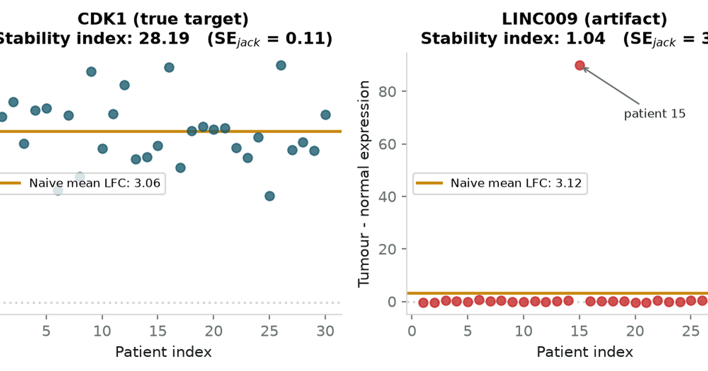

{fig-alt="Cover card reading The Statistical Jackknife, over a solid purple background."}

```{python}
#| echo: false
#| output: false
import json
from pathlib import Path

import numpy as np
import pandas as pd
import matplotlib.pyplot as plt

# House styling colors matching blog tokens
PRIMARY = "#1D5C6E"
SECONDARY = "#C98A12"
ACCENT = "#7A3B6B"
MUTED = "#67706E"
INK = "#171C1B"
RULE = "#D2D6D1"
DANGER = "#C62828"
SUCCESS = "#2E7D32"

plt.rcParams.update({
    "font.family": "sans-serif",
    "font.size": 10,
    "axes.edgecolor": RULE,
    "axes.linewidth": 0.8,
    "axes.spines.top": False,
    "axes.spines.right": False,
    "axes.titlesize": 11,
    "axes.titleweight": "bold",
    "axes.labelcolor": INK,
    "xtick.color": MUTED,
    "ytick.color": MUTED,
    "figure.titlesize": 12,
    "figure.titleweight": "bold",
})
```

## Jackknife resampling

The **jackknife** leaves out one observation at a time ($n$ passes, deterministic).

Two uses:

- **Bias correction** (Quenouille, 1949): cancels leading $O(1/n)$ bias in smooth estimators.
- **Influence diagnostics** (Tukey): pseudovalues $J_i$ identify which observations move the estimate.

Alternative: Efron's bootstrap (stochastic, more general for non-smooth statistics).

::: {.callout-note appearance="default"}
## Name

Tukey (1958) named the method after a pocket **jackknife** — a general-purpose tool, not a parametric scalpel.
:::

## Ratio bias in small samples

**Estimator:** revenue per visit = $\bar{Y}/\bar{X}$ (ratio of sample means).

**Problem:** individually unbiased means produce a biased ratio; error is $O(1/n)$, largest at small $n$.

**Synthetic data:**

- Visits ~ Gamma(mean 10); revenue ~ Gamma(mean 25), independent.
- True revenue-per-visit = 2.50.
- Gamma: positive, right-skewed stand-in for spend and engagement counts.

**Downstream use:** cohort payback metrics; positive bias flatters unprofitable channels.

50,000 synthetic cohorts at each $n$; compare plug-in ratio vs jackknife-corrected ratio.

```{python}
# Synthetic cohorts: visits ~ Gamma(mean 10), revenue ~ Gamma(mean 25), drawn independently,
# so revenue-per-visit is exactly 2.50 and any departure from it is bias, not noise.
np.random.seed(42)

true_mu_x, true_mu_y = 10.0, 25.0
true_ratio = true_mu_y / true_mu_x  # exactly 2.50

sample_sizes = [5, 10, 20, 40, 80, 160]
n_sims = 50_000

plugin_biases = []
jackknife_biases = []

for n in sample_sizes:
    x = np.random.gamma(shape=5.0, scale=2.0, size=(n_sims, n))   # visits,  mean 10
    y = np.random.gamma(shape=5.0, scale=5.0, size=(n_sims, n))   # revenue, mean 25

    # Plug-in estimate: ratio of the two sample means
    plugin_est = np.mean(y, axis=1) / np.mean(x, axis=1)
    plugin_biases.append(np.mean(plugin_est) - true_ratio)

    # Leave-one-out: recompute the ratio n times, each time dropping one customer
    sum_x = np.sum(x, axis=1, keepdims=True)
    sum_y = np.sum(y, axis=1, keepdims=True)
    r_i = ((sum_y - y) / (n - 1)) / ((sum_x - x) / (n - 1))
    r_bar = np.mean(r_i, axis=1)

    # Quenouille's recombination
    jack_est = n * plugin_est - (n - 1) * r_bar
    jackknife_biases.append(np.mean(jack_est) - true_ratio)

fig, ax = plt.subplots(figsize=(7.5, 3.8))
ax.plot(sample_sizes, plugin_biases, "o-", color=PRIMARY, lw=2,
        label="Plug-in ratio $\\bar{Y}/\\bar{X}$")
ax.plot(sample_sizes, jackknife_biases, "s--", color=SECONDARY, lw=2,
        label="Jackknife-corrected ratio")
ax.axhline(0, color=RULE, ls=":", lw=1.2)
ax.set_xlabel("Customers per cohort ($n$)")
ax.set_ylabel("Average error in revenue-per-visit")
ax.set_title("The plug-in ratio runs high on small cohorts; the jackknife does not")
ax.legend(frameon=True, facecolor="white", edgecolor=RULE)
plt.tight_layout()
plt.show()

for n, pb, jb in zip(sample_sizes, plugin_biases, jackknife_biases):
    print(f"n = {n:3d}   plug-in error {pb:+.4f}   jackknife error {jb:+.4f}")
```

At $n = 5$: plug-in error ≈ +0.10 (4% overstatement). Jackknife error within 0.007 at all sizes.

## Quenouille bias correction

Leave-one-out estimates $\hat{\theta}_{(i)}$ on samples of size $n-1$ share the same $O(1/n)$ bias at slightly higher strength.

Jackknife estimator:

$$\hat{\theta}_{\text{jack}} = n\hat{\theta}_n - (n-1)\bar{\theta}_{(\cdot)}$$

Extrapolates from sample sizes $n$ and $n-1$ to remove the $1/n$ term; remainder is $O(1/n^2)$.

::: {.callout-note collapse="true"}
## The two-line cancellation, for the curious

For almost any smooth non-linear statistic, the expectation admits an asymptotic expansion in powers of $1/n$:

$$\mathbb{E}[\hat{\theta}_n] = \theta + \frac{a}{n} + \frac{b}{n^2} + O\!\left(\frac{1}{n^3}\right)$$

Each leave-one-out estimate is computed on a sample of size $n-1$, so it obeys the same expansion evaluated one lower, and so does their average:

$$\mathbb{E}[\bar{\theta}_{(\cdot)}] = \theta + \frac{a}{n-1} + \frac{b}{(n-1)^2} + O\!\left(\frac{1}{n^3}\right)$$

Multiply the first by $n$, the second by $n-1$, and subtract. The $\theta$ terms leave one copy behind, and the $a$ terms — now $a$ and $a$ exactly — annihilate:

$$\mathbb{E}[\hat{\theta}_{\text{jack}}] = \theta + \left(\frac{b}{n} - \frac{b}{n-1}\right) + O\!\left(\frac{1}{n^2}\right) = \theta - \frac{b}{n(n-1)} + O\!\left(\frac{1}{n^2}\right)$$

The constant $a$ never had to be known. That is the whole point: the correction is arithmetic on estimates you already computed, not an analysis of the particular statistic in front of you.
:::

## Tukey pseudovalues

Per-observation **pseudovalue**:

$$J_i = n \hat{\theta}_n - (n-1)\hat{\theta}_{(i)}$$

Jackknife estimate: $\hat{\theta}_{\text{jack}} = \frac{1}{n}\sum_i J_i$.

$J_i - \hat{\theta}_{\text{jack}}$ measures observation $i$'s influence.

**Variance:**

$$v_{\text{jack}} = \frac{1}{n(n-1)}\sum_{i=1}^n \left(J_i - \hat{\theta}_{\text{jack}}\right)^2$$

Standard error: $\text{SE}_{\text{jack}} = \sqrt{v_{\text{jack}}}$. Confidence interval: $\hat{\theta}_{\text{jack}} \pm t_{n-1,\,\alpha/2}\cdot\text{SE}_{\text{jack}}$.

Requires smoothness of the statistic (see influence-function expansion in callout below).

::: {.callout-note collapse="true"}
## Why the fingerprints are independent: the influence function

Von Mises' statistical calculus expands any smooth functional $T$ of the empirical distribution $F_n$ around the population distribution $F$:

$$T(F_n) - T(F) = \frac{1}{n}\sum_{i=1}^n L(X_i; F) + R_n$$

where $L(x; F)$ is the **influence function** — the derivative of the functional when you nudge an infinitesimal point mass onto $x$. It measures the effect of a single observation on the estimate, in the limit.

Deleting $X_i$ removes exactly that point's term from the sum:

$$\hat{\theta}_n - \hat{\theta}_{(i)} \approx \frac{1}{n-1}\left(L(X_i; F) - \bar{L}\right)$$

Substituting into $J_i = \hat{\theta}_n + (n-1)(\hat{\theta}_n - \hat{\theta}_{(i)})$ collapses the factors of $n-1$:

$$J_i \approx \hat{\theta}_n + L(X_i; F) \qquad \Longrightarrow \qquad J_i - \hat{\theta}_{\text{jack}} \approx L(X_i; F)$$

The pseudovalues are the influence function evaluated at each observation, offset by a constant. The $X_i$ are i.i.d., so the $L(X_i; F)$ are i.i.d., and the sample variance of an i.i.d. mean is the familiar $\frac{1}{n}\text{Var}(L(X))$ — which is the variance formula above. The approximation is exactly where the smoothness assumption enters, and it is exactly what fails for the median later on.
:::

Interactive lab: drag points; end points dominate slope influence; large-residual mid-range points may matter less.

::: {.widget-container}
::: {.widget-header}
<span class="widget-title">Interactive Lab 1: Pseudovalues & Empirical Influence</span>
<span class="widget-badge">Local Compute</span>
:::
<div id="widget-pseudovalues"></div>
:::

## Referral fraud detection

**Metric:** promo-to-spend ratio = total credits / total revenue for a referral cohort.

**Synthetic cluster** (confidential ground truth unavailable):

- 8 legitimate users (1–5 referrals each, normal spend).
- 1 hub (7 synthetic spokes, $5 spend).
- 7 spokes ($0 spend).
- Each account charged: own signup credit + $20 per referee recruited.

**Question:** which account most improves cohort economics if removed?

**Downstream impact:** false bans vs missed syndicates.

```{python}
# Simulated referral cluster: 8 genuine customers, 1 coordinating hub, 7 synthetic spokes.
# Each account is charged its own signup credit plus one credit per referee it recruited.
np.random.seed(101)
BONUS = 20

legit_referrals = [3, 2, 4, 1, 2, 5, 1, 3]
accounts = [
    {"name": f"Legit User {i+1}", "referrals": r,
     "spend": int(np.random.randint(100, 300)), "is_hub": False}
    for i, r in enumerate(legit_referrals)
]
accounts.append({"name": "Syndicate Ringleader", "referrals": 7, "spend": 5, "is_hub": True})
for j in range(7):
    accounts.append({"name": f"Synthetic Bot {j+1}", "referrals": 0, "spend": 0, "is_hub": False})

df_fraud = pd.DataFrame(accounts)
df_fraud["promo"] = BONUS * (1 + df_fraud["referrals"])
n_users = len(df_fraud)

cluster_r = df_fraud["promo"].sum() / df_fraud["spend"].sum()

# Leave-one-out: recompute the cohort ratio with each account removed in turn
df_fraud["sub_r"] = [
    df_fraud.drop(index=i)["promo"].sum() / df_fraud.drop(index=i)["spend"].sum()
    for i in range(n_users)
]
df_fraud["influence"] = cluster_r - df_fraud["sub_r"]
df_fraud["pseudovalue"] = n_users * cluster_r - (n_users - 1) * df_fraud["sub_r"]

top_culprits = df_fraud.sort_values(by="influence", ascending=False).head(5)

fig, ax = plt.subplots(figsize=(8, 3.8))
colors = [DANGER if is_hub else PRIMARY for is_hub in top_culprits["is_hub"]]
bars = ax.barh(top_culprits["name"], top_culprits["influence"], color=colors, height=0.6)
ax.set_xlabel("Improvement in cohort promo-to-spend ratio if this account were removed")
ax.set_title("Top accounts distorting cohort unit economics")
ax.invert_yaxis()
for bar, val in zip(bars, top_culprits["influence"]):
    ax.text(val + 0.002, bar.get_y() + bar.get_height()/2, f"+{val:.3f}",
            va="center", fontsize=9, color=INK)
plt.tight_layout()
plt.show()

print(f"Cohort promo-to-spend ratio: {cluster_r:.3f}")
print(f"Ringleader leverage:  {df_fraud.loc[df_fraud.is_hub, 'influence'].item():.4f}")
print(f"Each spoke's leverage: {df_fraud.loc[df_fraud.name.str.startswith('Synthetic'), 'influence'].iloc[0]:.4f}")
```

Cohort ratio: 0.618. Removing hub improves ratio by 0.111; removing one spoke by 0.014.

Interactive lab: hub lead collapses as spoke count → 0.

::: {.widget-container}
::: {.widget-header}
<span class="widget-title">Interactive Lab 2: The Referral Syndicate Unmasker</span>
<span class="widget-badge">Simulation</span>
:::
<div id="widget-syndicate"></div>
:::

## Censored survival regression

**Target:** restricted mean survival time (RMST) — area under Kaplan–Meier curve to horizon $t^*$.

**Problem:** RMST is cohort-level; censored subjects lack usable per-person durations for regression.

**Andersen and Perme (2010):** jackknife pseudovalues provide per-subject response variables; regress with OLS.

**Synthetic cohort** ($N = 400$):

- Channels: organic vs paid search.
- Discount 0–40%; true lifetime Exponential with mean depending on channel and discount.
- Random censoring window 60–365 days.
- Known generating parameters for validation.

**Downstream use:** acquisition budget allocation.

```{python}
# Simulated subscription cohort, N=400, heavily right-censored.
# True lifetime: Exponential(mean = 250 + 80*organic - 150*discount), observed through a
# uniform 60-365 day window. Because the generating process is known, the regression can be
# checked against the truth it is trying to recover.
np.random.seed(55)
n_cohort = 400

channels = np.random.binomial(1, 0.5, size=n_cohort)      # 0 = Organic, 1 = Paid Search
discounts = np.random.uniform(0, 0.4, size=n_cohort)

scale = 250 + 80 * (1 - channels) - 150 * discounts
true_survival = np.random.exponential(scale=scale)
censor_time = np.random.uniform(60, 365, size=n_cohort)

observed_time = np.minimum(true_survival, censor_time)
event_observed = (true_survival <= censor_time).astype(int)


def calc_rmst(times, events, t_star=365):
    """Area under the Kaplan-Meier curve out to t_star."""
    order = np.argsort(times)
    t_sorted, e_sorted = times[order], events[order]

    n_k = len(times)
    s_t, rmst, prev_t = 1.0, 0.0, 0.0

    k = 0
    while k < n_k and t_sorted[k] < t_star:
        cur_t = t_sorted[k]

        # Everyone leaving at this exact time shares one risk set, so count the
        # events across the whole tied group before shrinking the curve once.
        j, deaths = k, 0
        while j < n_k and t_sorted[j] == cur_t:
            deaths += e_sorted[j]
            j += 1

        rmst += s_t * (cur_t - prev_t)   # area of the step we are leaving
        prev_t = cur_t
        if deaths:
            s_t *= (1.0 - deaths / (n_k - k))
        k = j

    return rmst + s_t * (t_star - prev_t)


cohort_rmst = calc_rmst(observed_time, event_observed)

# One pseudovalue per customer: the cohort figure, re-levered by deleting that customer
pseudo_rmst = np.array([
    n_cohort * cohort_rmst
    - (n_cohort - 1) * calc_rmst(np.delete(observed_time, i), np.delete(event_observed, i))
    for i in range(n_cohort)
])

# Ordinary least squares on the pseudovalues, with robust (sandwich) standard errors
X_mat = np.column_stack([np.ones(n_cohort), channels, discounts])
beta_hat = np.linalg.lstsq(X_mat, pseudo_rmst, rcond=None)[0]
resid = pseudo_rmst - X_mat @ beta_hat
XtX_inv = np.linalg.inv(X_mat.T @ X_mat)
cov_hat = XtX_inv @ (X_mat.T @ (X_mat * resid[:, None] ** 2)) @ XtX_inv
se_hat = np.sqrt(np.diag(cov_hat))

# The truth: each customer's exact restricted mean, best-fit by the same design matrix
true_rmst_i = scale * (1 - np.exp(-365 / scale))
beta_true = np.linalg.lstsq(X_mat, true_rmst_i, rcond=None)[0]

print(f"Cohort 365-day restricted mean: {cohort_rmst:.1f} active days\n")
labels = ["Organic baseline (days)", "Paid Search effect (days)", "Full-discount effect (days)"]
for name, b, s, t in zip(labels, beta_hat, se_hat, beta_true):
    lo, hi = b - 1.96 * s, b + 1.96 * s
    covered = "yes" if lo <= t <= hi else "NO"
    print(f"{name:<28} {b:8.1f} +/- {s:5.1f}   95% CI [{lo:7.1f}, {hi:7.1f}]"
          f"   true {t:7.1f}   covered: {covered}")
```

All coefficient 95% CIs cover simulation truth. Discount slope SE ≈ 64 — effect not yet identifiable at $N = 400$.

::: {.callout-note appearance="default"}
## Constraints

RMST horizon $t^*$ must lie within observed follow-up. Beyond largest censoring time, the flat KM tail extrapolates.
:::

## Biomarker stability screening

**Setting:** oncology RNA-seq, $N = 30$ patients, ~20k genes, log fold-change (LFC) ranking.

**Problem:** one outlier patient can dominate a gene's mean LFC.

**Stability index:** $|\hat{\theta}_{\text{jack}}| / \text{SE}_{\text{jack}}$ (jackknife $t$-like ratio).

**Synthetic screen** (PHI unavailable):

- CDK1: true target, LFC ≈ 3.2 consistently.
- LINC009: artifact — flat in 29 patients, spike in patient 15 (LFC = 90).

**Downstream impact:** reagent orders and years of lab work on false targets.

```{python}
# Simulated RNA-seq oncology screen, N=30 patients, tumour vs normal log-fold change.
# CDK1: a genuine target, consistent across all patients.
# LINC009: an artifact, flat in 29 patients with one enormous reading in patient 15.
np.random.seed(77)
n_patients = 30

cdk1_diff = np.random.normal(loc=3.2, scale=0.6, size=n_patients)

linc_diff = np.random.normal(loc=0.2, scale=0.4, size=n_patients)
linc_diff[14] = 90.0  # single-patient sample-prep artifact

genes = {"CDK1 (true target)": cdk1_diff, "LINC009 (artifact)": linc_diff}

fig, axes = plt.subplots(1, 2, figsize=(8, 3.6))

for ax, (gname, diffs) in zip(axes, genes.items()):
    mean_val = np.mean(diffs)

    # Leave-one-patient-out
    sub_means = np.array([np.mean(np.delete(diffs, i)) for i in range(n_patients)])
    theta_dot = sub_means.mean()
    jack_val = n_patients * mean_val - (n_patients - 1) * theta_dot
    se_j = np.sqrt(((n_patients - 1) / n_patients) * np.sum((sub_means - theta_dot) ** 2))
    stability = abs(jack_val) / se_j

    is_target = "CDK1" in gname
    ax.scatter(range(1, n_patients + 1), diffs,
               color=PRIMARY if is_target else DANGER, alpha=0.8, zorder=3)
    ax.axhline(mean_val, color=SECONDARY, lw=2, label=f"Naive mean LFC: {mean_val:.2f}")
    ax.axhline(0, color=RULE, ls=":")
    ax.set_title(f"{gname}\nStability index: {stability:.2f}   (SE$_{{jack}}$ = {se_j:.2f})")
    ax.set_xlabel("Patient index")
    ax.set_ylabel("Tumour - normal expression")
    ax.legend(loc="center left", fontsize=8)

    if not is_target:
        ax.annotate("patient 15", xy=(15, linc_diff[14]), xytext=(19, 70),
                    fontsize=8, color=INK,
                    arrowprops=dict(arrowstyle="->", color=MUTED, lw=1))

plt.tight_layout()
plt.show()
```

Naive LFC: LINC009 3.12 > CDK1 3.06. Stability index: CDK1 28.2 vs LINC009 1.04 — ranking inverts.

Interactive lab: planted artifacts rank high on LFC, low on stability.

::: {.widget-container}
::: {.widget-header}
<span class="widget-title">Interactive Lab 3: Biomarker Stability Stress-Tester</span>
<span class="widget-badge">Oncology Target Screen</span>
:::
<div id="widget-biomarkers"></div>
:::

## Median failure

Jackknife requires **smooth** statistics: deleting one point causes a small estimate change.

The **sample median** is non-smooth — deletion shifts the median by adjacent order-statistic spacing, regardless of how extreme the deleted point was.

Consequence: jackknife variance for the median is **inconsistent** (converges to a random multiple of truth, not the true variance).

Interactive lab: compare mean vs median leave-one-out values.

::: {.widget-container}
::: {.widget-header}
<span class="widget-title">Interactive Lab 4: Smooth vs. Non-Smooth Stress Test</span>
<span class="widget-badge">Diagnostic</span>
:::
<div id="widget-smooth-jagged"></div>
:::

### Delete-d jackknife

Wu (1986); Shao and Wu (1989): delete $d$ observations at a time ($d \approx \sqrt{n}$, $d/n \to 0$) to restore consistency for medians and quantiles. Cost: subset sampling rather than deterministic $n$ passes.

## Jackknife vs bootstrap

| | Jackknife | Bootstrap |
| :--- | :--- | :--- |
| Cost | $n$ deterministic passes | $B \ge 1000$ stochastic draws |
| Smooth statistics | Removes $O(1/n)$ bias | Accurate; adds Monte Carlo noise |
| Non-smooth (median, quantiles) | Fails; use delete-$d$ | Works unmodified |
| Per-observation diagnostics | Pseudovalues free | Requires weight regression |
| Setup | No seed or tuning | Choose $B$, fix seed |

## When to use

- Small-$n$ ratio or rate estimators: jackknife bias correction.
- Influence identification: pseudovalues rank leverage observations.
- Censored curve functionals: Andersen–Perme pseudovalue regression.
- Non-smooth statistics: delete-$d$ jackknife or bootstrap instead.

## References

- Quenouille, M. H. (1949). Approximate tests of correlation in time-series. *Journal of the Royal Statistical Society B* 11(1), 68–84.
- Tukey, J. W. (1958). Bias and confidence in not-quite large samples. *Annals of Mathematical Statistics* 29, 614.
- Andersen, P. K., and Perme, M. P. (2010). Pseudo-observations in survival analysis. *Statistical Methods in Medical Research* 19(1), 71–99.
- Wu, C. F. J. (1986). Jackknife, bootstrap and other resampling methods in regression analysis. *Annals of Statistics* 14(4), 1261–1295.
- Shao, J., and Wu, C. F. J. (1989). A general theory for jackknife variance estimation. *Annals of Statistics* 17(3), 1176–1197.
- Efron, B. (1979). Bootstrap methods: another look at the jackknife. *Annals of Statistics* 7(1), 1–26.

```{python}
#| echo: false
#| output: asis
# Load pre-computed widget data payloads and inject script tags.
#
# NOTE: Quarto keys frozen output on an md5 of index.qmd alone, so editing widgets.js
# or widget-data/*.json does NOT invalidate _freeze/ and a project render will keep
# serving the old bundle. After changing either, re-render this post explicitly
# (or delete _freeze/posts/statistical-jackknife/) before committing.
widget_dir = Path("widget-data")
payload = {
    "toy": json.loads((widget_dir / "toy.json").read_text()),
    "syndicate": json.loads((widget_dir / "syndicate.json").read_text()),
    "biomarkers": json.loads((widget_dir / "biomarkers.json").read_text())
}

js_code = Path("widgets.js").read_text()

print('```{=html}')
print('<script id="jackknife-data" type="application/json">'
      + json.dumps(payload, separators=(",", ":")).replace("</", "<\\/")
      + '</script>')
print('<script>' + js_code + '</script>')
print('```')
```
