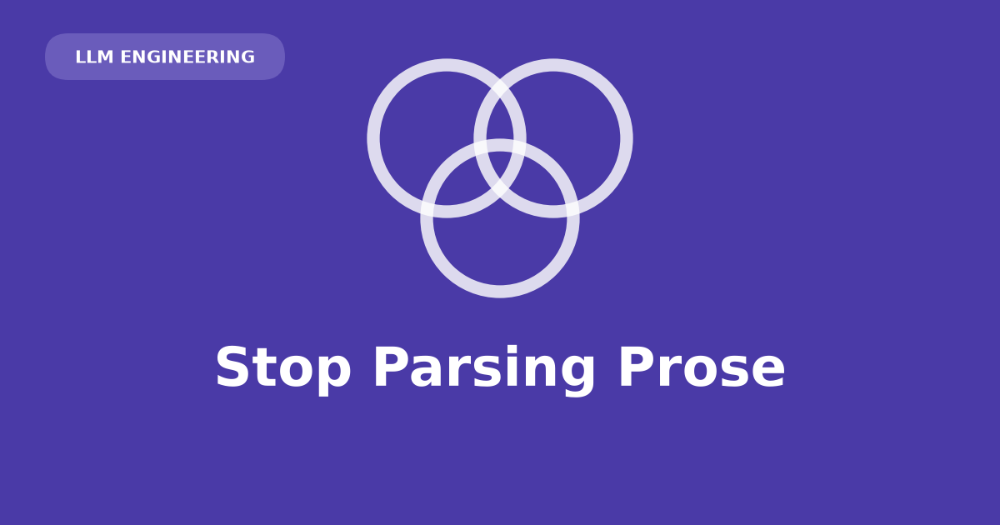

## It's 2am and the parser just choked on a sentence

The pager goes off because a `JSONDecodeError` is three stack frames deep in your ingestion job. You pull up the raw response and there it is: `Sure, here's the JSON you requested:` sitting right before the opening brace, cheerful as anything. Your code expected the first character to be `{`. It got `S`. Everything downstream — the queue consumer, the dashboard, the on-call rotation you're now part of — falls over because a language model decided to be polite.

This is not a one-off. It's the default failure mode of asking an LLM for structured data the same way you'd ask a person: nicely, in English, and hoping they take the hint.

## Prose is a great interface for humans and a terrible one for code

A model trained to be a helpful conversationalist will act like one, even when you don't want conversation — you want a payload. Ask for JSON and you get JSON *most* of the time, wrapped in whatever the model felt like adding *some* of the time: a preamble, a closing pleasantry, markdown fences, a stray comment inside what's supposed to be strict JSON. None of it is malformed by the standard of human reading. All of it is malformed by `json.loads()`.

The boundary between "text" and "data" is fuzzy by construction, and parsers don't tolerate fuzzy boundaries. So you write regex to strip preambles, retry loops for responses that don't parse, and prompts padded with pleading like "respond with ONLY the JSON, no other text." That's not an integration. That's a bet.

## The old way: box the model in from both ends

Before the API could enforce a shape, you forced one. Two tricks, usually together:

1. **Prefill the assistant turn.** Seed the model's own turn with a lone `{` so it has no choice but to continue from inside the object. No room left for a preamble — the preamble slot is already spent.
2. **Add a stop sequence.** Halt generation the moment a closing `}` appears, so the model can't tack on "let me know if you need anything else."

```{python}
#| eval: false
# The old way — do not use this on current models.
response = client.messages.create(
    model="claude-sonnet-5",
    max_tokens=1024,
    stop_sequences=["}"],
    messages=[
        {"role": "user", "content": ticket},
        {"role": "assistant", "content": "{"},   # prefill
    ],
)

raw = "{" + response.content[0].text + "}"       # reattach what you clipped
data = json.loads(raw)                           # ...and hope
```

Look at the last two lines. You're manually gluing back the brace you injected and the brace you truncated, then hoping. Nested objects break the stop sequence outright, because the *first* `}` isn't the last one. And the whole approach is now moot: **assistant-turn prefill returns a 400 on current Claude models** — Sonnet 5, Opus 5, and the 4.6-and-later family all reject it. If this pattern is still in your codebase, it isn't legacy-but-working. It's a time bomb.

## The new way: make the shape a contract

Pass a JSON Schema through `output_config.format` and the API *guarantees* the response conforms to it — not "usually," not "if the prompt is worded carefully," but enforced at the endpoint. No brace surgery, no stop sequences, no retry loop.

Here's a messy support ticket about a data export failing at 90%, going in as free text and coming out as a typed object.

```{python}
#| eval: false
import json
import anthropic

client = anthropic.Anthropic()

ticket = """
Our nightly export has failed at 90% completion three nights running.
We report to the board Friday and this data feeds that report directly.
Please help ASAP, this is blocking a hard deadline.
"""

schema = {
    "type": "object",
    "properties": {
        "category": {"type": "string", "enum": ["bug", "feature_request", "question", "billing"]},
        "urgency": {"type": "string", "enum": ["low", "medium", "high", "critical"]},
        "sentiment": {"type": "string", "enum": ["neutral", "satisfied", "frustrated", "angry"]},
        "summary": {"type": "string"},
        "suggested_team": {"type": "string", "enum": ["engineering", "support", "billing", "sales"]},
    },
    "required": ["category", "urgency", "sentiment", "summary", "suggested_team"],
    "additionalProperties": False,
}

response = client.messages.create(
    model="claude-sonnet-5",
    max_tokens=1024,
    messages=[{"role": "user", "content": ticket}],
    output_config={"format": {"type": "json_schema", "schema": schema}},
)

text = next(b.text for b in response.content if b.type == "text")
data = json.loads(text)
```

I didn't call the API for this post — no key hit, no request made — so the block below is hand-written to show the *shape* a conforming response takes, not a captured transcript. That's the whole point: with a schema attached, this is what you're guaranteed to get back, not what you're hoping for.

```json
{
  "category": "bug",
  "urgency": "critical",
  "sentiment": "frustrated",
  "summary": "Nightly export has failed at 90% completion for three consecutive nights, blocking a Friday board report.",
  "suggested_team": "engineering"
}
```

No brace-hunting. No pleasantries to strip. Just an object matching the schema, every time.

## The ticket was never the point

Swap the ticket for a log line, a resume, a tool call your agent needs to act on — anything where the model's output has to become a variable in your code, not a paragraph a human reads. Define the shape once, let the API enforce it, delete the parsing code you used to need.

Two honest caveats. A schema guarantees *shape*, not *correctness* — you'll never get malformed JSON, but you can still get a confidently wrong `category`, so spot-check classifications on edge cases before trusting the pipeline unattended. And the guarantee has escape hatches worth handling: if the model refuses on safety grounds, or you hit `max_tokens` mid-object, `stop_reason` will say so and the output won't conform. Check it before you parse.

## References

- [Anthropic: Structured Outputs](https://platform.claude.com/docs/en/build-with-claude/structured-outputs)
- [Anthropic: Messages API reference](https://platform.claude.com/docs/en/api/messages)
