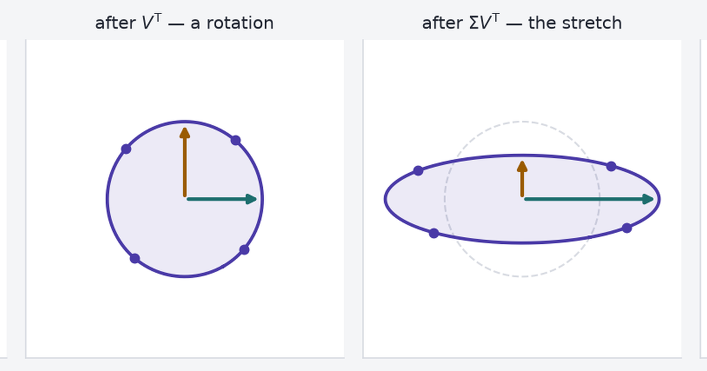

{fig-alt="Cover card reading The Matrix That Rotates, Stretches, and Rotates Again."}

A real matrix maps the unit sphere to an ellipsoid: rotate ($V^\mathsf{T}$), axis-aligned stretch ($\Sigma$), rotate ($U$).

$$A = U\Sigma V^\mathsf{T}$$

- $U, V$: orthogonal (rotations/reflections).
- $\sigma_i$: singular values (stretch factors), $\sigma_1\ge\cdots\ge 0$.

This post uses that geometry for condition numbers, rank-$k$ approximation, and several application matrices.

```{python}
#| label: setup
import json
import sys
from pathlib import Path

import matplotlib.pyplot as plt
import numpy as np

sys.path.insert(0, "src")

import data as filip          # NIST StRD Filip loader
import imagery as im          # the photograph and its SVD

PURPLE, TEAL, AMBER = "#4A3AA7", "#1D6E6E", "#9A5B00"
INK, MUTED, RULE = "#1F2430", "#5F6672", "#D8DBE2"
PAPER = "#F4F5F7"

plt.rcParams.update({
    "figure.facecolor": PAPER, "axes.facecolor": "white",
    "axes.edgecolor": RULE, "axes.labelcolor": INK, "text.color": INK,
    "xtick.color": MUTED, "ytick.color": MUTED, "font.size": 10,
    "axes.grid": True, "grid.color": RULE, "grid.alpha": 0.7,
    "axes.spines.top": False, "axes.spines.right": False,
})

# The figures and the widgets read the same committed payload, so a number
# quoted in the prose cannot drift from the number on the slider.
WIDGET = json.loads(Path("widget-data/image.json").read_text())
MOVIES = json.loads(Path("widget-data/movielens.json").read_text())
```

## Rotate, stretch, rotate

Unit vectors in $\mathbb{R}^2$ trace a circle; their images under $A$ trace an ellipse (possibly degenerate).

```{python}
#| label: fig-three-panel
#| fig-cap: "One matrix, four moments. A shear takes the unit circle to an ellipse in three steps: a rotation that moves nothing but the labelled directions, a stretch along the axes, and a second rotation into the final pose. The dashed circle marks where things started."
A2 = np.array([[1.0, 1.2], [0.0, 1.0]])
U2, s2, Vt2 = np.linalg.svd(A2)

theta = np.linspace(0, 2 * np.pi, 361)
circle = np.stack([np.cos(theta), np.sin(theta)])
marks = np.stack([np.cos(np.arange(4) / 4 * 2 * np.pi + 0.35),
                  np.sin(np.arange(4) / 4 * 2 * np.pi + 0.35)])

stages = [
    (np.eye(2), "unit circle"),
    (Vt2, r"after $V^\mathsf{T}$ — a rotation"),
    (np.diag(s2) @ Vt2, r"after $\Sigma V^\mathsf{T}$ — the stretch"),
    (A2, r"after $A = U\Sigma V^\mathsf{T}$"),
]

fig, axes = plt.subplots(1, 4, figsize=(10.5, 3.0))
for ax, (T, title) in zip(axes, stages):
    shape = T @ circle
    ax.plot(*np.stack([np.cos(theta), np.sin(theta)]), ls="--", lw=1,
            color=RULE, zorder=1)
    ax.fill(*shape, color=PURPLE, alpha=0.10, zorder=2)
    ax.plot(*shape, color=PURPLE, lw=1.8, zorder=3)
    ax.scatter(*(T @ marks), s=22, color=PURPLE, zorder=4)
    for i, colour in enumerate((TEAL, AMBER)):
        image = T @ Vt2[i]
        ax.annotate("", xy=image, xytext=(0, 0),
                    arrowprops=dict(arrowstyle="-|>", color=colour, lw=2))
    ax.set_title(title, fontsize=9.5)
    ax.set_xlim(-2.05, 2.05); ax.set_ylim(-2.05, 2.05)
    ax.set_aspect("equal"); ax.set_xticks([]); ax.set_yticks([])
    ax.grid(False)
fig.tight_layout()
plt.show()

print(f"singular values: sigma1 = {s2[0]:.4f}, sigma2 = {s2[1]:.4f}")
```

Stages: $V^\mathsf{T}$ (rotate), $\Sigma V^\mathsf{T}$ (stretch), $U\Sigma V^\mathsf{T}=A$ (rotate).

$$A = U\Sigma V^\mathsf{T}.$$

$U$ and $V$ are **orthogonal** — their columns are perpendicular unit vectors, so
they rotate and reflect without changing any length. The diagonal entries
$\sigma_1 \ge \sigma_2 \ge \dots \ge 0$ of $\Sigma$ are the **singular values**,
and they are the entire stretching budget of the matrix.

A different matrix should change the ellipse and the two numbers, and nothing
else about the story. The widget below computes a real SVD of whatever you type,
in the browser, by exactly the argument the next section makes.

::: {.widget-container}
::: {.widget-header}
<span class="widget-title">Widget 1 — your matrix, your ellipse</span>
<span class="widget-badge">runs in your browser</span>
:::
<div id="widget-ellipse"></div>
<div class="widget-note">Try the <em>near-singular</em> preset: the ellipse
collapses towards a line, σ₂ drops near zero, and the condition number blows up.
That is the same failure the Filip dataset shows later, in eleven dimensions
instead of two.</div>
:::

Static figure matches the widget default matrix.

## Existence via $A^\mathsf{T}A$

Eigenvectors $v_i$ of $A^\mathsf{T}A$ give right singular vectors; $\|Av_i\|=\sqrt{\lambda_i}=\sigma_i$.

Now ask what happens to those particular directions under $A$ itself. Take the
inner product of two of their images:

$$\langle Av_i, Av_j \rangle = v_i^\mathsf{T} A^\mathsf{T} A v_j
  = \lambda_j\, v_i^\mathsf{T} v_j = \lambda_j\, \delta_{ij}.$$

For $i \ne j$ that is zero. The images $Av_i$ are perpendicular to each other,
automatically, with no further conditions on $A$. And setting $i = j$ gives
$\|Av_i\|^2 = \lambda_i$, so the length of each image is $\sqrt{\lambda_i}$ —
which is the singular value $\sigma_i$. Divide each nonzero image by its length
to get the orthonormal $u_i$, and $Av_i = \sigma_i u_i$ is the decomposition,
column by column.

The load-bearing part is the first line: *these* directions stay perpendicular,
and a generic perpendicular pair does not. That is checkable in three lines.

```{python}
#| label: orthogonality-check
rng = np.random.default_rng(20260819)
A3 = rng.standard_normal((3, 3))

# The eigenvectors of A^T A, ordered by eigenvalue.
lam, V3 = np.linalg.eigh(A3.T @ A3)
order = np.argsort(lam)[::-1]
lam, V3 = lam[order], V3[:, order]

# An arbitrary orthonormal pair, built by rotating that basis inside its own
# plane -- still perpendicular, still unit length, just not the special pair.
c, s = np.cos(0.6), np.sin(0.6)
w1, w2 = c * V3[:, 0] + s * V3[:, 1], -s * V3[:, 0] + c * V3[:, 1]

print(f"before A:  v1 . v2 = {V3[:, 0] @ V3[:, 1]: .3e}    w1 . w2 = {w1 @ w2: .3e}")
print(f"after  A: Av1 . Av2 = {(A3 @ V3[:, 0]) @ (A3 @ V3[:, 1]): .3e}   Aw1 . Aw2 = {(A3 @ w1) @ (A3 @ w2): .3e}")
print(f"sqrt(lambda_i) = {np.sqrt(lam)}")
print(f"numpy's sigma  = {np.linalg.svd(A3, compute_uv=False)}")
```

Both pairs start perpendicular to machine precision. After the matrix acts, one
still is and the other is not, by about thirteen orders of magnitude. The
eigenvectors of $A^\mathsf{T}A$ are not merely *a* convenient basis — they are the
only one whose perpendicularity survives — and $\sqrt{\lambda_i}$ reproduces what
`np.linalg.svd` returns.

```{python}
#| label: fig-orthogonality
#| fig-cap: "Left: two perpendicular pairs on the unit circle — the singular directions v₁, v₂ and an arbitrary pair w₁, w₂ rotated 34° from them. Right: their images. The singular pair lands on the ellipse axes and stays at 90°; the arbitrary pair closes to an acute angle."
lam2, V2e = np.linalg.eigh(A2.T @ A2)
V2e = V2e[:, np.argsort(lam2)[::-1]]
c, s = np.cos(0.6), np.sin(0.6)
W2e = np.stack([c * V2e[:, 0] + s * V2e[:, 1], -s * V2e[:, 0] + c * V2e[:, 1]], axis=1)

def angle(m):
    a, b = m[:, 0], m[:, 1]
    return np.degrees(np.arccos(np.clip(a @ b / (np.linalg.norm(a) * np.linalg.norm(b)), -1, 1)))

fig, axes = plt.subplots(1, 2, figsize=(8.5, 4.0))
for ax, (M, shape, title) in zip(axes, [
    (np.eye(2), circle, f"before: both pairs at 90°"),
    (A2, A2 @ circle, "after: only one pair still is"),
]):
    ax.plot(*shape, color=PURPLE, lw=1.6)
    for pair, colours, style, names in [
        (V2e, (TEAL, TEAL), "-", (r"$v_1$", r"$v_2$")),
        (W2e, (AMBER, AMBER), "--", (r"$w_1$", r"$w_2$")),
    ]:
        for i in range(2):
            tip = M @ pair[:, i]
            ax.annotate("", xy=tip, xytext=(0, 0),
                        arrowprops=dict(arrowstyle="-|>", color=colours[i], lw=2, ls=style))
            ax.annotate(names[i], xy=tip * 1.12, color=colours[i], fontsize=11, ha="center")
    ax.set_title(f"{title}\n" +
                 rf"$\angle(v_1,v_2)={angle(M @ V2e):.1f}°$   " +
                 rf"$\angle(w_1,w_2)={angle(M @ W2e):.1f}°$", fontsize=9.5)
    ax.set_xlim(-2.3, 2.3); ax.set_ylim(-2.3, 2.3)
    ax.set_aspect("equal"); ax.set_xticks([]); ax.set_yticks([]); ax.grid(False)
fig.tight_layout()
plt.show()
```

Ninety degrees in, ninety degrees out for the singular pair; the other pair
closes to an acute angle. So the decomposition always exists, and $\Sigma$ is
never a free choice — it is fixed by the matrix. The natural next question is
what those numbers are worth.

## Singular values and condition number

Each $\sigma_i$ is a length: how far the matrix stretches one particular
direction. The largest, $\sigma_1$, is the most any unit vector can be stretched,
which is the definition of the matrix's operator norm. The smallest is the least.
If the smallest is zero, some direction is crushed to nothing and the matrix is
rank-deficient — information went in and cannot come out.

The ratio of the two, $\kappa(A) = \sigma_1 / \sigma_n$, is the **condition
number**, and it is the number that decides whether solving $Ax = b$ on a
computer will give you an answer worth having. The rule of thumb is blunt:
solving a system in double precision starts with about 16 correct digits and
loses roughly $\log_{10}\kappa$ of them. At $\kappa = 10^{15}$ there is nothing
left.

**Filip (NIST StRD):** 82 points, degree-10 polynomial design matrix. Certified coefficients test solver accuracy. Wrong fits imply wrong lab calibrations.

```{python}
#| label: fig-filip-spectrum
#| fig-cap: "Singular values of Filip's degree-10 design matrix, log scale. Fifteen orders of magnitude separate the first from the last, and the ratio is the condition number."
x_f, y_f, beta_cert = filip.load_filip()
A_f = filip.filip_design(x_f)
s_f = np.linalg.svd(A_f, compute_uv=False)
kappa_f = s_f[0] / s_f[-1]

def sci(value, digits=2):
    """Render a number as LaTeX \\times 10^n -- mathtext turns "1.77e+15" into
    "1.77e + 15", which reads as arithmetic rather than a magnitude."""
    exponent = int(np.floor(np.log10(abs(value))))
    return rf"{value / 10 ** exponent:.{digits}f} \times 10^{{{exponent}}}"

fig, ax = plt.subplots(figsize=(7.2, 4.0))
ax.semilogy(np.arange(1, len(s_f) + 1), s_f, "o-", color=PURPLE, lw=1.8, ms=6)
ax.set_xlabel("index $i$"); ax.set_ylabel(r"$\sigma_i$")
ax.set_xticks(np.arange(1, len(s_f) + 1))
ax.annotate(rf"$\sigma_1 = {sci(s_f[0])}$", xy=(1, s_f[0]), xytext=(2.2, s_f[0] * 0.5),
            color=TEAL, fontsize=10)
ax.annotate(rf"$\sigma_{{11}} = {sci(s_f[-1])}$", xy=(11, s_f[-1]), xytext=(5.6, s_f[-1] * 3.0),
            color=AMBER, fontsize=10)
ax.set_title(rf"$\kappa(A) = \sigma_1/\sigma_{{11}} = {sci(kappa_f)}$", fontsize=11)
fig.tight_layout()
plt.show()
```

$\kappa \approx 1.8 \times 10^{15}$, against the $4.5 \times 10^{15}$ of
resolution double precision carries in total. Before any solver runs, the
spectrum says this fit sits at the edge of what the arithmetic can represent. So
run three solvers and score them on the residual sum of squares, which NIST also
certifies.

```{python}
#| label: filip-solve
rss = lambda b: float(np.sum((A_f @ b - y_f) ** 2))
rss_cert = rss(beta_cert)

solvers = {
    "normal equations, (AᵀA)⁻¹Aᵀy": np.linalg.solve(A_f.T @ A_f, A_f.T @ y_f),
    "QR least squares, np.linalg.lstsq": np.linalg.lstsq(A_f, y_f, rcond=None)[0],
    "pseudoinverse, np.linalg.pinv": np.linalg.pinv(A_f) @ y_f,
}

print(f"{'method':36s} {'RSS':>13s}  {'vs certified':>12s}")
print(f"{'NIST certified coefficients':36s} {rss_cert:13.6e}  {'—':>12s}")
for name, beta in solvers.items():
    print(f"{name:36s} {rss(beta):13.6e}  {rss(beta) / rss_cert:11.2f}×")

# Same data, same model, different basis: centre and scale x before building
# the powers, and the condition number falls by eleven orders of magnitude.
x_s = (x_f - x_f.mean()) / x_f.std()
A_s = np.vander(x_s, 11, increasing=True)
beta_s = np.linalg.pinv(A_s) @ y_f
print(f"\nrescaled design: kappa = {np.linalg.cond(A_s):.3e}")
print(f"rescaled pseudoinverse RSS = {float(np.sum((A_s @ beta_s - y_f) ** 2)):.6e}")
```

Every solver on the raw design matrix fits the data about a third worse than the
certified answer does, and no warning is raised by any of them. Then the last two
lines change one thing — centre and scale $x$ before raising it to powers — and
$\kappa$ drops from $10^{15}$ to about $10^4$, at which point the residual matches
NIST's certified value to every digit printed.

The ill-conditioning was never in the data. It was in the basis chosen to
describe it, where $x^{10}$ ranges over twelve orders of magnitude while $x^0$
sits at 1. The singular values are what let you see that before trusting a
number: a diagnostic, not just a description.

## Rank-$k$ truncation

Same decomposition, opposite use. On Filip the small singular values were a
warning; on a photograph they are an opportunity, because writing
$A = U\Sigma V^\mathsf{T}$ out term by term turns a matrix into a sum:

$$A = \sum_{i=1}^{r} \sigma_i\, u_i v_i^\mathsf{T},$$

a stack of rank-one layers, each one an outer product weighted by its singular
value. Keep the first $k$ layers and drop the rest and you have the rank-$k$
truncation. It is not merely *a* good approximation: it is the best one any
rank-$k$ matrix can be, in least-squares error — the Eckart–Young theorem, which
[the companion post on matrix factorisations](../matrix-factorizations/) derives
as an optimisation problem.

**Image:** `skimage.data.astronaut()` (512×512 grayscale, public-domain NASA photo). Rank-$k$ truncation approximates the matrix; storage is $k(m+n+1)$ vs $mn$ bytes.

```{python}
#| label: fig-rank-grid
#| fig-cap: "The same photograph at four truncation ranks, against the original. Rank 5 is a handful of bands; by rank 50 the face is unmistakable; rank 100 is close enough that the differences are in texture."
photo = im.load_image()
U_p, s_p, Vt_p = im.svd(photo)

ranks_shown = [5, 20, 50, 100]
fig, axes = plt.subplots(1, 5, figsize=(11.5, 2.6))
axes[0].imshow(photo, cmap="gray", vmin=0, vmax=255)
axes[0].set_title("original\n262,144 bytes", fontsize=9)
for ax, k in zip(axes[1:], ranks_shown):
    ax.imshow(im.reconstruct(U_p, s_p, Vt_p, k), cmap="gray", vmin=0, vmax=255)
    stored = im.stored_bytes(*photo.shape, k, im.BYTES_INT16)
    ax.set_title(f"rank {k}\n{stored:,} bytes  ·  {WIDGET['psnr'][k - 1]:.1f} dB", fontsize=9)
for ax in axes:
    ax.set_xticks([]); ax.set_yticks([]); ax.grid(False)
fig.tight_layout()
plt.show()
```

Rank 5 keeps `{python} f"{WIDGET['energy'][4] * 100:.1f}"`% of the matrix's
squared Frobenius norm and still looks like nothing in particular — a warning
about energy as a proxy for quality. By rank 50 the photograph is plainly itself.
What each rank costs has a definite answer: a rank-$k$ truncation means storing
$U_k$ ($512k$ numbers), $V_k$ (another $512k$) and $k$ singular values, so
$k(m + n + 1)$ numbers against $mn$ bytes for the raw pixels.

```{python}
#| label: fig-quality-price
#| fig-cap: "Left: reconstruction quality against rank, with the elbow of the singular value spectrum marked. Right: what the factors cost, as a fraction of the raw pixel array, under two storage choices. The float32 line crosses the raw-pixel baseline inside this range, so past that point the factorisation saves nothing."
k_axis = np.arange(1, WIDGET["maxRank"] + 1)
psnr = np.array(WIDGET["psnr"])
elbow = WIDGET["elbow"]
marginal = im.marginal_rank(psnr)

# The rank at which float32 factors stop saving anything at all. Derived, so it
# cannot go stale if the image or MAX_RANK changes.
crossover = int(np.flatnonzero(np.array(WIDGET["fracF32"]) >= 1.0)[0] + 1)

fig, (ax1, ax2) = plt.subplots(1, 2, figsize=(10.5, 4.2))

ax1.plot(k_axis, psnr, color=PURPLE, lw=2)
ax1.axvline(elbow, color=TEAL, ls="--", lw=1.4)
# The curve rises left to right, so the free space is above it on the right and
# below it on the right. Anchor both labels to the range rather than to psnr[0],
# which is the minimum.
lo, hi = psnr[0], psnr[-1]
ax1.annotate(f"spectrum elbow, k = {elbow}", xy=(elbow, psnr[elbow - 1]),
             xytext=(elbow + 6, hi - 0.8), color=TEAL, fontsize=9, va="top",
             arrowprops=dict(arrowstyle="->", color=TEAL))
ax1.axvline(marginal, color=AMBER, ls=":", lw=1.4)
ax1.annotate(f"< 0.2 dB per extra rank\nfrom k = {marginal}", xy=(marginal, psnr[marginal - 1]),
             xytext=(marginal + 20, lo + 4.0), color=AMBER, fontsize=9, va="top",
             arrowprops=dict(arrowstyle="->", color=AMBER))
ax1.set_ylim(lo - 1.5, hi + 1.5)
ax1.set_xlabel("rank $k$"); ax1.set_ylabel("PSNR (dB)")
ax1.set_title("quality bought", fontsize=11)

ax2.plot(k_axis, np.array(WIDGET["fracF32"]) * 100, color=AMBER, lw=2, label="stored as float32")
ax2.plot(k_axis, np.array(WIDGET["fracI16"]) * 100, color=TEAL, lw=2, label="stored as int16")
ax2.axhline(100, color=INK, ls="--", lw=1.2)
ax2.annotate("raw pixel array", xy=(4, 103), color=INK, fontsize=9)
ax2.axhline(WIDGET["pngBytes"] / WIDGET["rawBytes"] * 100, color=MUTED, ls=":", lw=1.4)
ax2.annotate("lossless PNG of the same image", xy=(4, WIDGET["pngBytes"] / WIDGET["rawBytes"] * 100 + 3),
             color=MUTED, fontsize=9)
ax2.set_xlabel("rank $k$"); ax2.set_ylabel("storage, % of raw pixels")
ax2.set_title("price paid", fontsize=11)
ax2.legend(frameon=False, fontsize=9, loc="upper left")

fig.tight_layout()
plt.show()

for k in ranks_shown:
    print(f"k={k:4d}  PSNR {psnr[k - 1]:5.2f} dB   energy {WIDGET['energy'][k - 1] * 100:6.3f}%"
          f"   int16 {WIDGET['fracI16'][k - 1] * 100:6.1f}% of raw"
          f"   float32 {WIDGET['fracF32'][k - 1] * 100:6.1f}%")
```

The left panel shows where the returns stop: the spectrum bends at
$k = `{python} str(elbow)`$ — the point furthest below a line drawn across the
first 100 ranks, so it moves if you widen the window — and from
$k = `{python} str(marginal)`$ onward each extra rank buys under a fifth of a
decibel. The right panel is the part people skip. Stored naively as float32 the
factors reach the size of the raw image at rank `{python} str(crossover)`, and by
rank 100 they take `{python} f"{WIDGET['fracF32'][99] * 100:.0f}"`% of what you were trying to
compress. Quantised to int16 — which the widget below does, at a quality cost too
small to see — rank 50 costs `{python} f"{WIDGET['fracI16'][49] * 100:.0f}"`% of
raw for `{python} f"{psnr[49]:.1f}"` dB.

::: {.widget-container}
::: {.widget-header}
<span class="widget-title">Widget 2 — the rank dial</span>
<span class="widget-badge">100 triplets, 452 KB</span>
:::
<div id="widget-rank"></div>
<div class="widget-note">The page ships the leading 100 singular triplets, not
100 images. Every rank you land on is rebuilt in the browser from those factors,
which is the same trick that makes truncation useful in the first place: the
generator is far smaller than what it generates.</div>
:::

## Truncated SVD versus JPEG

Truncated SVD is the best rank-$k$ approximation of a matrix. It is not the best
*image compressor*, and the gap is not close.

```{python}
#| label: jpeg-comparison
import io
from PIL import Image

pil = Image.fromarray(np.round(photo).astype("uint8"))
buf = io.BytesIO()
pil.save(buf, format="JPEG", quality=5)
jpeg_bytes = len(buf.getvalue())
jpeg_back = np.asarray(Image.open(io.BytesIO(buf.getvalue()))).astype(float)

k_ref = 20
svd_bytes = im.stored_bytes(*photo.shape, k_ref, im.BYTES_INT16)
print(f"SVD rank {k_ref}: {svd_bytes:,} bytes, {psnr[k_ref - 1]:.2f} dB")
print(f"JPEG quality 5: {jpeg_bytes:,} bytes, {im.psnr(photo, jpeg_back):.2f} dB")
```

JPEG at its worst setting uses about a sixth of the bytes and still scores higher.
It knows it is compressing an image: it works on local 8 × 8 blocks, discards
high spatial frequencies the eye barely registers, and entropy-codes the rest.
The SVD knows only that it has a matrix, and spends its budget on structure
spanning the whole picture. Reach for truncation when the low-rank structure is
itself what you care about, not when you want a smaller file.

### The same dial, on ratings

Where low-rank structure *is* the point, the same truncation becomes a model.
**MovieLens 100k** is 100,000 ratings on a 1–5 scale from real users of the
MovieLens site, collected by the GroupLens group at the University of Minnesota,
who ran the service partly to gather exactly this data for recommender research.
As a matrix it is 943 users by 1,682 films and only about 6% filled — nearly
every entry is a rating nobody gave. Predicting those wrong costs little each
time and a lot in aggregate: a recommendation ignored, a film that never
surfaces.

Truncation belongs here for a reason unrelated to storage. Taste is not
1,682-dimensional. If a few dozen latent factors explain most of what separates
viewers, the ratings matrix is *nearly* low rank, and keeping the leading $k$
layers keeps the signal while dropping one person's mood on one evening. Where
that boundary sits is empirical, so hold out 10% of the ratings and score
reconstructions against them.

```{python}
#| label: fig-movielens
#| fig-cap: "Held-out RMSE against truncation rank on MovieLens 100k, after removing per-user and per-film offsets. Too few ranks and the model has not learned taste; too many and it is memorising noise in the training ratings."
ranks_ml = np.array(MOVIES["ranks"])
rmse_ml = np.array(MOVIES["rmse"])

fig, ax = plt.subplots(figsize=(7.2, 4.0))
ax.semilogx(ranks_ml, rmse_ml, "o-", color=PURPLE, lw=1.8, ms=5)
ax.axhline(MOVIES["baseline_rmse"], color=MUTED, ls="--", lw=1.3)
ax.annotate("baseline: user + film offsets only", xy=(1.15, MOVIES["baseline_rmse"] + 0.0012),
            color=MUTED, fontsize=9)
ax.scatter([MOVIES["best_rank"]], [MOVIES["best_rmse"]], s=90, facecolor="none",
           edgecolor=TEAL, lw=2, zorder=5)
ax.annotate(f"best: k = {MOVIES['best_rank']}, RMSE {MOVIES['best_rmse']:.4f}",
            xy=(MOVIES["best_rank"], MOVIES["best_rmse"]),
            xytext=(210, MOVIES["best_rmse"] - 0.0011), ha="right",
            color=TEAL, fontsize=9.5, arrowprops=dict(arrowstyle="->", color=TEAL))
ax.set_xlabel("truncation rank $k$"); ax.set_ylabel("held-out RMSE (stars)")
ax.set_xticks([1, 3, 10, 30, 100, 200]); ax.set_xticklabels([1, 3, 10, 30, 100, 200])
fig.tight_layout()
plt.show()

print(f"{MOVIES['n_train']:,} train / {MOVIES['n_test']:,} test ratings, "
      f"{MOVIES['density'] * 100:.1f}% of the matrix observed")
```

The curve is a U, and that is the point. The photograph's PSNR rose forever,
because there the target was the matrix itself. Here the target is ratings the
model has never seen, so past $k = `{python} str(MOVIES['best_rank'])`$ the extra
layers fit the training ratings better and the held-out ratings worse. Rank has
stopped being a compression setting and become a capacity knob.

### The same dial, on ill-posed systems

Filip's tiny singular values return here. Solving $Ax = b$ through the SVD means
computing $x = \sum_i (u_i^\mathsf{T}b / \sigma_i) v_i$, and dividing by a
$\sigma_i$ of $4 \times 10^{-6}$ amplifies whatever noise sits in that direction
by a quarter of a million. Dropping the terms whose $\sigma_i$ falls below a
threshold is what `np.linalg.pinv` does by default — the same operation as
dropping image layers, aimed at stability instead of storage. It trades a little
bias for an answer that does not move when the data twitches, which is why it has
a name of its own in the inverse problems literature: truncated SVD
regularisation.

## Avoid $A^\mathsf{T}A$

The derivation above reads like a recipe: form $A^\mathsf{T}A$, diagonalise it,
take square roots. Nobody does this, and Filip shows why in one line of output.

Squaring a matrix squares its condition number. If $A$ has singular values
$\sigma_i$ then $A^\mathsf{T}A$ has eigenvalues $\sigma_i^2$, so
$\kappa(A^\mathsf{T}A) = \kappa(A)^2$: a matrix merely awkward at $\kappa = 10^8$
becomes unsolvable at $10^{16}$. The damage lands where it is least visible, on
the small singular values — precisely where rank and regularisation decisions get
made.

```{python}
#| label: ata-precision
sigma_svd = np.linalg.svd(A_f, compute_uv=False)
sigma_ata = np.sqrt(np.clip(np.linalg.eigvalsh(A_f.T @ A_f), 0, None))[::-1]

print(f"kappa(A)      = {np.linalg.cond(A_f):.3e}")
print(f"kappa(AᵀA)    = {np.linalg.cond(A_f.T @ A_f):.3e}\n")
print(f"{'i':>3s} {'np.linalg.svd':>16s} {'via eigh(AᵀA)':>16s} {'relative error':>15s}")
for i in (0, 4, 7, 8, 9, 10):
    rel = abs(sigma_ata[i] - sigma_svd[i]) / sigma_svd[i]
    print(f"{i + 1:3d} {sigma_svd[i]:16.6e} {sigma_ata[i]:16.6e} {rel:15.2e}")
```

The largest singular value survives to full precision. The smallest does not
survive at all: routed through $A^\mathsf{T}A$ it comes back as exactly zero, so
the matrix looks rank-deficient when it is not, while $\sigma_{10}$ is too large
by a factor of several hundred. Any rank decision taken from that column would be
wrong. Working on $A$ directly, `np.linalg.svd` puts $\sigma_{11}$ at
`{python} f"{sigma_svd[-1]:.3e}"` — small, but real.

LAPACK never forms $A^\mathsf{T}A$. It squeezes $A$ into bidiagonal form using
Householder reflections — orthogonal, so they leave every length and therefore
every singular value untouched — and only then diagonalises, iteratively, on the
bidiagonal matrix.

```{mermaid}
%%| label: fig-algorithm
%%| fig-cap: "How a dense SVD is actually computed. Every arrow on the top row is an orthogonal transformation, so the singular values are identical at each stage; the condition number is never squared."
flowchart LR
  A["<b>A</b><br/>m × n, dense"] -->|"Householder reflections<br/>left and right"| B["<b>B</b><br/>bidiagonal<br/>same singular values"]
  B -->|"implicit QR sweeps<br/>(Golub–Kahan)"| S["<b>Σ</b><br/>diagonal"]
  B -.->|"reflections<br/>accumulated"| UV["<b>U</b>, <b>V</b><br/>orthogonal factors"]
  S --> R["A = UΣVᵀ"]
  UV --> R
```

Which algorithm you want depends on how much of the decomposition you need.

| method | cost | when to use it |
|---|---|---|
| full SVD — `np.linalg.svd`, LAPACK `gesdd` | $O(mn \min(m, n))$ | you need every singular value, or the full $U$ and $V$, and the matrix fits in memory |
| eigendecomposition of $A^\mathsf{T}A$ | $O(mn^2 + n^3)$, at $\kappa^2$ | effectively never — the cost saving is small and the accuracy loss is the one shown above |
| Lanczos — `scipy.sparse.linalg.svds` | $O(k \cdot \mathrm{nnz}(A))$ per restart | $k \ll n$ and the matrix is sparse, or reachable only as a matrix–vector product |
| randomized SVD — `sklearn.utils.extmath.randomized_svd` | $O(mnk)$ | $k \ll n$, dense and large, and a small probabilistic error on the trailing singular values is acceptable |

The bottom two rows are why a recommender on a hundred million ratings is
tractable at all: nobody needs all 512 layers of the photograph, and nobody needs
all 943 of MovieLens.

## Three SVD questions

Three matrices have appeared so far — a photograph, a NIST design matrix, a
table of ratings — and each asked something different of the same spectrum.
Which leading layers are worth keeping. Which trailing directions will wreck a
solver. How many layers the data can actually support. The catalogue of SVD
applications is long, and almost none of it is a fourth question. It is these
three, aimed at a matrix built from something other than pixels.

What changes between applications is what the rows and columns mean.

| the matrix | rows × columns | what the spectrum gets read for |
|---|---|---|
| a grayscale photograph | pixels × pixels | how many layers before the eye stops noticing |
| a stack of face images | images × pixels | a face as a few dozen coordinates — "eigenfaces" |
| term–document counts | vocabulary × documents | topics, and words pulled together that never co-occur |
| a neural network's weight matrix | outputs × inputs | parameters and inference time, traded against accuracy |
| centred measurements | samples × variables | the directions of most variance — PCA |
| a least-squares design matrix | observations × predictors | which coefficients the data cannot pin down |
| a rectangular or singular system | — | a pseudoinverse where no inverse exists |
| ratings | users × items | how many latent factors taste supports |
| a system's impulse response | lags × lags, as a Hankel matrix | model order — which dynamic modes to keep |

Two of those rows are worth spelling out, because in both cases the SVD is doing
work under a name that hides it.

### PCA is an SVD of the centred data, and the precision argument is why

Suppose you have a cloud of measurements — a few hundred samples, each with a few
dozen numbers attached — and you want the directions along which the cloud is
most spread out, because those are the directions carrying whatever the samples
disagree about. That is principal component analysis, and the textbook recipe is
to build the covariance matrix and diagonalise it: stack the samples as the rows
of $X$, subtract each column's mean, and the sample covariance is
$X^\mathsf{T}X/(n-1)$.

But $X^\mathsf{T}X$ is the matrix the whole decomposition was derived from. Its
eigenvectors are exactly the right singular vectors $v_i$ of $X$, and its
eigenvalues are exactly the $\sigma_i^2$. So the principal components *are* the
$v_i$, the variance along the $i$-th is $\sigma_i^2/(n-1)$, and the entire
analysis is available from an SVD of the centred data with the covariance matrix
never formed.

In exact arithmetic the two routes agree, so this looks like a matter of taste.
The last section is what separates them: that was the same computation with
different letters, and routed through the squared matrix the smallest singular
value came back as exactly zero. As a PCA result that reads "this direction
carries no variance at all" about a direction that carries some. Note which
components take the damage. The ones that survive squaring are the ones you were
going to keep anyway; the ones it destroys are the ones you were still deciding
about.

Which does not make squaring forbidden — it makes it priced. `sklearn`'s `PCA`
factors the centred matrix directly in most cases, but when the data is tall and
skinny, at most a thousand variables and at least ten times as many samples, it
forms the covariance matrix anyway, because a small square matrix is far faster
to diagonalise than a tall one is to factor. That is speed bought with precision,
on the bet that a thousand-column design is not Filip. The bet is usually right.
What the spectrum gives you is the exchange rate: $\kappa(A)^2$.

### Truncating a term–document matrix invents topics nobody labelled

Words carry meaning through the company they keep, and a corpus records that
company. Build a matrix with one row per vocabulary word and one column per
document, each entry counting how often the word appears in it, usually weighted
so that common words do not dominate. It comes out enormous and nearly empty —
the same shape of problem as MovieLens, for the same reason: most words are
absent from most documents.

Truncate it to a few hundred layers and something useful happens that nobody put
in. Two words that never once appear in the same document can still
end up with similar rows, if each keeps company with the same third set of words.
The truncation has no choice: with only $k$ layers to spend it cannot afford a
separate direction for every word, so words that behave alike get folded onto
shared directions. Those directions are the topics, and nobody labelled them.
This is **latent semantic analysis**, from the late 1980s, and the rank knob
behaves exactly as it did on ratings — too few layers and the topics are mush,
too many and you are modelling one author's word choice. The modern word
embedding is the descendant: a different objective and a neural fitting
procedure, still a low-rank factorisation of who-appears-near-whom.

Each of these keeps the leading layers because those are the interesting ones.
None of them claims that what got discarded is *nothing*. There is one family
where that stronger claim is close to literally true, and it is the one you can
hear.

## Hankel denoising

Sound arrives as one long vector, not a matrix — a few thousand samples per
second and no second axis in sight. To use any of this you have to make a matrix
out of it, and the standard construction is to slide a window along the signal
and stack the windows as columns. Each column is the previous one shifted by a
sample, so the matrix is constant along its anti-diagonals: a **Hankel matrix**,
or in the time-series literature a *trajectory matrix*. It is the same object
the impulse-response row of the table above refers to, which is why model
reduction in control theory and denoising a recording are the same operation.

Building it looks wasteful — the thousand samples below become a matrix of a
hundred and sixty thousand entries — but the redundancy is the point, because it forces the signal
to declare its rank. A pure sinusoid obeys a two-term linear recurrence: any
sample is a fixed combination of the two before it. So every window of it lies in
a two-dimensional space, whatever the window length, and its trajectory matrix
has rank exactly 2. A voiced sound is a stack of harmonics on one fundamental, so
$p$ harmonics give rank $2p$ — a couple of dozen at most, in a matrix with
hundreds of rows. White noise obeys no recurrence at all, so it spreads itself
thinly across every direction there is.

That is the sharpest version of "keep the leading layers" in this post. On the
photograph the cutoff was an elbow you had to eyeball; here the number of layers
to keep is a count of harmonics, and the layers below it are noise by
construction rather than by assumption.

The signal below is synthetic, and it has to be: subspace denoising can only be
scored against a clean reference, and no recording of a real voice comes with
one. It is five harmonics of a 120 Hz fundamental with amplitudes falling as
$1/k$, sampled at 8 kHz — a stand-in for a sustained vowel from a low-pitched
speaker over a narrowband telephone line, where glottal pulses supply the
harmonic stack and the vocal tract shapes how loud each one is. White Gaussian
noise is added at 0 dB, meaning there is exactly as much noise energy as signal.
What a decision here would affect is ordinary enough: this is the front of a
hearing aid, a call centre's line, or the audio a transcriber has to work from,
and getting it wrong means either hiss the listener has to fight through or a
voice with its edges smoothed off.

```{python}
#| label: voice-spectrum
import voice as vx

t_v, clean = vx.vowel()
noisy = vx.corrupt(clean, snr_db=0.0)

sv_clean = np.linalg.svd(vx.trajectory(clean), compute_uv=False)
sv_noisy = np.linalg.svd(vx.trajectory(noisy), compute_uv=False)

print(f"signal: {clean.size} samples, {vx.FRAME}-sample windows "
      f"-> {vx.FRAME} x {clean.size - vx.FRAME + 1} trajectory matrix")
print(f"numerical rank of the clean trajectory matrix: "
      f"{int((sv_clean > sv_clean[0] * 1e-10).sum())}  (= 2 x {vx.N_HARM} harmonics)\n")
print(f"{'i':>3s} {'clean':>10s} {'noisy':>10s}")
for i in (0, 1, 8, 9, 10, 11, 20, 50):
    print(f"{i + 1:3d} {sv_clean[i]:10.2f} {sv_noisy[i]:10.2f}")
```

The clean matrix has numerical rank exactly 10, and its singular values arrive in
near-equal pairs — one pair per harmonic, which is the rank-2 argument showing up
in the arithmetic. Everything from $\sigma_{11}$ down is zero to machine
precision. Add the noise and those zeros lift to about
`{python} f"{sv_noisy[10]:.0f}"`, a floor that then decays slowly across the
remaining 190 directions as the noise runs out of room. The strong harmonics
barely notice — $\sigma_1$ moves by
`{python} f"{abs(sv_noisy[0] / sv_clean[0] - 1) * 100:.0f}"`% — while the weakest
pair is close enough to the floor to be inflated by it, from
`{python} f"{sv_clean[8]:.0f}"` up to `{python} f"{sv_noisy[8]:.0f}"`. That
inflation is the honest reading of 0 dB: the two subspaces are sorted into the
same matrix with a step between them, but at this noise level the step is a step,
not a chasm.

Keeping the top ten layers and folding the truncated matrix back into a signal —
averaging along the anti-diagonals, since a truncated Hankel matrix is no longer
quite Hankel — should therefore recover the vowel and leave the noise behind.

```{python}
#| label: fig-voice
#| fig-cap: "Left: singular values of the trajectory matrix, clean and noisy. The clean spectrum falls to zero after rank 10; the noisy one steps down at the same index onto a floor the noise puts there. Middle: recovered signal-to-noise ratio against truncation rank, peaking at exactly the rank the harmonics predict. Right: 25 ms of waveform, noisy against clean and against the rank-10 reconstruction."
ranks_v = np.arange(1, 61)
snr_curve = np.array([vx.snr_db(clean, vx.denoise(noisy, k)) for k in ranks_v])
best_k = int(ranks_v[snr_curve.argmax()])
denoised = vx.denoise(noisy, best_k)

fig, (ax1, ax2, ax3) = plt.subplots(1, 3, figsize=(11.5, 3.4))

ax1.plot(np.arange(1, 41), sv_noisy[:40], "o-", ms=3.5, color=PURPLE, lw=1.6,
         label="noisy")
ax1.plot(np.arange(1, 41), sv_clean[:40], "o--", ms=3.5, color=TEAL, lw=1.4,
         label="clean")
ax1.axvline(2 * vx.N_HARM, color=AMBER, ls=":", lw=1.4)
ax1.annotate(f"rank {2 * vx.N_HARM}\n= 2 x {vx.N_HARM} harmonics",
             xy=(2 * vx.N_HARM + 1.8, sv_clean[0] * 0.72), color=AMBER, fontsize=9)
ax1.axvspan(0.5, 2 * vx.N_HARM + 0.5, color=TEAL, alpha=0.08, lw=0)
ax1.axvspan(2 * vx.N_HARM + 0.5, 40.5, color=MUTED, alpha=0.07, lw=0)
ax1.text(5.5, sv_clean[0] * 1.03, "signal", color=TEAL, fontsize=9, ha="center")
ax1.text(25.5, sv_clean[0] * 1.03, f"noise, {vx.FRAME - 2 * vx.N_HARM} directions",
         color=MUTED, fontsize=9, ha="center")
ax1.set_xlim(0.5, 40.5); ax1.set_ylim(-8, sv_clean[0] * 1.14)
ax1.set_xlabel("index $i$"); ax1.set_ylabel(r"$\sigma_i$")
ax1.set_title("two subspaces, one matrix", fontsize=11)
ax1.legend(frameon=False, fontsize=9, loc="center right")

ax2.plot(ranks_v, snr_curve, color=PURPLE, lw=2)
ax2.axhline(vx.snr_db(clean, noisy), color=MUTED, ls="--", lw=1.3)
ax2.annotate("the noisy input, 0 dB", xy=(20, 0.6), color=MUTED, fontsize=9)
ax2.scatter([best_k], [snr_curve.max()], s=90, facecolor="none", edgecolor=TEAL,
            lw=2, zorder=5)
ax2.annotate(f"k = {best_k}, {snr_curve.max():.1f} dB", xy=(best_k, snr_curve.max()),
             xytext=(best_k + 16, snr_curve.max() + 0.4), color=TEAL, fontsize=9.5,
             arrowprops=dict(arrowstyle="->", color=TEAL))
ax2.set_xlabel("truncation rank $k$"); ax2.set_ylabel("output SNR (dB)")
ax2.set_title("quality recovered", fontsize=11)

win = slice(300, 500)
ax3.plot(t_v[win] * 1000, noisy[win], color=MUTED, lw=0.9, alpha=0.4, label="noisy")
ax3.plot(t_v[win] * 1000, clean[win], color=TEAL, ls="--", lw=1.6, label="clean")
ax3.plot(t_v[win] * 1000, denoised[win], color=PURPLE, lw=1.6, label=f"rank {best_k}")
ax3.set_xlabel("time (ms)"); ax3.set_ylabel("amplitude")
ax3.set_title("the waveform back", fontsize=11)
ax3.legend(frameon=False, fontsize=9, loc="upper right", ncol=3,
           columnspacing=1.0, handlelength=1.4)

fig.tight_layout()
plt.show()

print(f"input {vx.snr_db(clean, noisy):5.2f} dB  ->  rank {best_k}: "
      f"{snr_curve.max():5.2f} dB   (rank 5: {snr_curve[4]:.2f}, rank 40: {snr_curve[39]:.2f})")
```

The middle panel is the one to look at. The best rank is
`{python} str(best_k)`, which is $2p$ for the $p =$ `{python} str(vx.N_HARM)`
harmonics that went in — nothing in the code was told the answer, and the
spectrum found it. It turns 0 dB into
`{python} f"{snr_curve.max():.1f}"` dB, a factor of
`{python} f"{10 ** (snr_curve.max() / 10):.0f}"` in noise power, and the right
panel shows what that means: the purple trace sits on the dashed clean one while
the grey noise it came from wanders. Keep too few layers and harmonics go
missing; keep too many and you are reconstructing noise along with the voice, and
by rank 40 most of the gain is gone.

## Synthetic vowel limits

The cliff in the left panel is that sharp because the synthetic vowel is exactly
periodic and exactly stationary for the whole 125 ms. Real speech is neither. The
fundamental drifts as the speaker's pitch moves, the vocal tract reshapes
continuously, and fricatives like /s/ and /f/ are not harmonic at all — they are
noise, produced deliberately, and a rank cutoff cannot tell them from the noise
you want gone. In practice the cliff softens into a slope and you are back to
choosing a threshold, which is why real systems run this on frames of 20–30 ms at
a time, or abandon the Hankel matrix for a spectrogram and truncate that instead.
The mechanism survives; the free lunch does not.

### The rest of a speech stack uses the same three questions

Denoising is the clearest case but not the only one, and the others are the
familiar questions with audio-shaped matrices plugged in.

Speaker recognition builds a matrix of acoustic features — mel-frequency cepstral
coefficients, a compact summary of a frame's spectral shape — stacked over time,
and reduces it to the few directions that separate one voice from another rather
than one phoneme from another. The i-vector systems that ran speaker verification
before neural embeddings took over pushed this furthest: a speaker became
coordinates in a deliberately low-rank subspace of a much larger statistic,
fitted by factor analysis rather than a bare SVD, but low-rank for exactly the
reason MovieLens was. Older recognition pipelines did the same to their inputs,
projecting stacked MFCCs down before handing them to a Gaussian mixture model,
partly for speed and partly because the discarded directions were mostly
redundant.

With more than one microphone the question becomes how many sources are in the
room. Stack the channels and the rank of the resulting matrix counts the
independent sources, up to the number of microphones — which is how a separation
pipeline decides its model order before independent component analysis goes
looking for the sources themselves, with the SVD usually doing the whitening step
on the way. Voice activity detectors have been built on the same count run over
short windows: a frame with someone talking in it is close to low rank, a frame
of room tone is not. Dereverberation splits the same way, with the direct path
concentrated in the leading directions and the reflections spread through the
trailing ones.

## Classical vs neural pipelines

For denoising, separation, recognition and verification, end-to-end neural models
now beat these classical pipelines by margins that are not close, and have for
about a decade. What is left for the subspace methods is real but narrower:
lightweight baselines, deployments where a training set does not exist, and
situations where you need to explain what the system did rather than only that it
worked.

The exception runs the other way, and it is growing. The neural models that
displaced these methods are themselves stacks of large weight matrices, and those
matrices are often close to low rank — so the same truncation gets applied to the
*model* instead of the audio, replacing an $m \times n$ layer with two thin
factors to shrink a speech model onto a phone. Low-rank adapters, the standard
way to fine-tune a large model cheaply, are the same observation used for
training instead of compression. Eckart–Young does not care whether the matrix
holds pixels, ratings, a vowel or a weight.

## Photograph summary

Rank `{python} str(elbow)`: `{python} f"{WIDGET['energy'][elbow - 1] * 100:.1f}"`% Frobenius energy, `{python} f"{psnr[elbow - 1]:.1f}"` dB, `{python} f"{WIDGET['fracI16'][elbow - 1] * 100:.1f}"`% of raw bytes (int16 storage). Rank 50: `{python} f"{psnr[49]:.1f}"` dB at `{python} f"{WIDGET['fracI16'][49] * 100:.0f}"`% of raw.

Lossless PNG: `{python} f"{WIDGET['pngBytes'] / WIDGET['rawBytes'] * 100:.0f}"`% of raw. JPEG outperforms truncated SVD on bytes/quality for this image.

## References

- **Photograph** — `skimage.data.astronaut()` ([scikit-image](https://scikit-image.org/)); NASA public-domain image of Eileen Collins, 512×512 grayscale.
- **Filip** — [NIST StRD](https://www.itl.nist.gov/div898/strd/lls/data/Filip.shtml); A. Filippelli; certified coefficients in multiple precision.
- **Synthetic vowel** — `src/voice.py`; five harmonics at 120 Hz, 8 kHz, 0 dB SNR (see [Synthetic vowel limits](#synthetic-vowel-limits)).
- **MovieLens 100k** — [GroupLens Research](https://grouplens.org/datasets/movielens/100k/); Harper and Konstan, *ACM TiiS* 5(4), 2015. Derived RMSE curve in `widget-data/movielens.json` (raw data not redistributed).

```{python}
#| label: widget-injection
#| echo: false
#| output: asis
# Inline the widget payload and the widget code into the page. Doing it here,
# rather than through a `resources:` fetch, is what lets the widgets work from a
# file:// copy of the page with no server at all.
#
# NOTE: Quarto keys frozen output on an md5 of index.qmd alone, so editing
# widgets.js or widget-data/*.json does NOT invalidate _freeze/ and a project
# render will keep serving the old bundle. After changing either, re-render this
# post explicitly (or delete _freeze/posts/svd-rotate-stretch-rotate/) before
# committing.
payload = {
    "image": json.loads(Path("widget-data/image.json").read_text()),
    "movielens": json.loads(Path("widget-data/movielens.json").read_text()),
}
js_code = Path("widgets.js").read_text()

# Both the data and the code get the same guard. A literal `</` anywhere in
# either -- `h()` accepts an `html:` key, so it only takes one innerHTML string
# -- would close the inline <script> early and kill both widgets with no build
# error. `<\/` is valid inside a JS string literal and inside a regex.
print("```{=html}")
print('<script id="svd-data" type="application/json">'
      + json.dumps(payload, separators=(",", ":")).replace("</", "<\\/")
      + "</script>")
print("<script>" + js_code.replace("</", "<\\/") + "</script>")
print("```")
```
