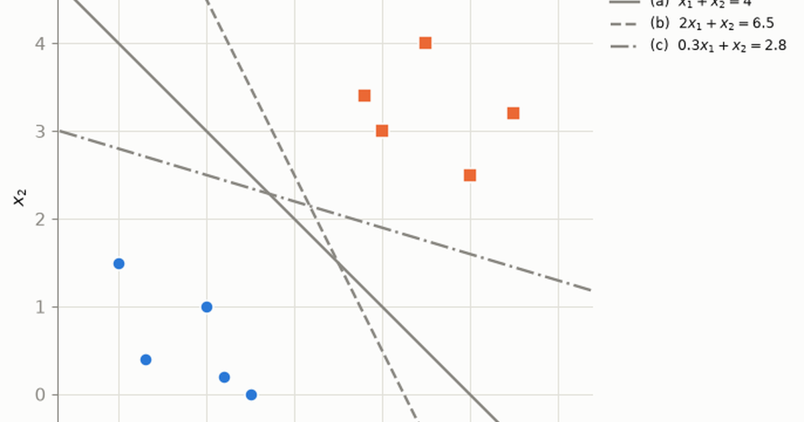

Sketch two clouds of points on paper, one class each, and draw a line that keeps them apart. Then draw a second line that also gets every point right. You will manage it easily, and a third, and a fourth. But notice what your hand does unprompted: it steers down the middle of the empty space rather than shaving past the nearest point, even though both lines score exactly the same on the data in front of you.

A support vector machine is that instinct written down as arithmetic. It is usually introduced as a bag of formulas instead — a hyperplane, a margin, a mysterious constant $C$, and a dual problem that appears out of nowhere — and all four of them fall out of a single sentence:

> **An SVM chooses a separating hyperplane by solving a convex optimization problem that maximizes geometric separation from the training data, while soft margins extend that idea to imperfectly separable data.**

Every claim below is made literal on two tiny two-dimensional datasets, small enough that you can check the geometry by eye. The weights, intercepts, margins, support vectors and slack values are not quoted from a textbook: each one is computed by a convex solver on the exact data plotted, driven by [CVXPY](https://www.cvxpy.org/) — a Python library that lets you write a convex problem down in something close to its mathematical form and hands it to a solver. The notebook asserts that the solved values match the ones derived by hand before it will render at all. `scikit-learn`, the standard Python machine-learning toolkit, appears only at the end as an independent cross-check.

```{python}
#| code-summary: "Setup: imports, house palette, plotting helpers, and the toy dataset"
import numpy as np
import cvxpy as cp
import matplotlib.pyplot as plt
from matplotlib.lines import Line2D
from IPython.display import Markdown

# palette (house style)
BLUE, ORANGE, INK = "#2a78d6", "#eb6834", "#0b0b0b"
MUTED, GRID, SURFACE = "#898781", "#e1e0d9", "#fcfcfb"

plt.rcParams.update({
    "figure.facecolor": SURFACE, "axes.facecolor": SURFACE,
    "savefig.facecolor": SURFACE,
    "axes.edgecolor": MUTED, "axes.labelcolor": INK,
    "xtick.color": MUTED, "ytick.color": MUTED, "text.color": INK,
    "axes.grid": True, "grid.color": GRID, "grid.linewidth": 0.8,
    "axes.spines.top": False, "axes.spines.right": False,
    "font.size": 11, "axes.titlesize": 12,
})

RNG_SEED = 42          # fixed seed for every random draw in this post
TOL = 1e-6             # numerical tolerance used for all constraint checks


def md_table(headers, rows):
    """Render a small Markdown table without extra dependencies."""
    head = "| " + " | ".join(headers) + " |"
    sep = "|" + "|".join(["---"] * len(headers)) + "|"
    body = ["| " + " | ".join(str(c) for c in r) + " |" for r in rows]
    return Markdown("\n".join([head, sep, *body]))


def scatter_classes(ax, X, y, s=70, sv_mask=None):
    """Class -1 as blue circles, class +1 as orange squares (shape backs up color)."""
    neg, pos = y < 0, y > 0
    ax.scatter(*X[neg].T, s=s, c=BLUE, marker="o", zorder=3,
               edgecolor=SURFACE, linewidth=1.2, label="class $-1$")
    ax.scatter(*X[pos].T, s=s, c=ORANGE, marker="s", zorder=3,
               edgecolor=SURFACE, linewidth=1.2, label="class $+1$")
    if sv_mask is not None and sv_mask.any():
        ax.scatter(*X[sv_mask].T, s=s * 3.4, facecolor="none",
                   edgecolor=INK, linewidth=1.6, zorder=4,
                   label="support vector")


def draw_hyperplane(ax, w, b, level=0.0, x1lim=(-1, 6), **kw):
    """Draw the line w@x + b = level over the given x1 range."""
    w = np.asarray(w, dtype=float)
    x1 = np.array(x1lim, dtype=float)
    if abs(w[1]) > 1e-12:
        ax.plot(x1, (level - b - w[0] * x1) / w[1], **kw)
    else:  # vertical line x1 = (level - b) / w1
        ax.axvline((level - b) / w[0], **kw)


def draw_svm(ax, w, b, x1lim=(-1, 6)):
    """Decision boundary plus the two margin lines w@x + b = ±1."""
    draw_hyperplane(ax, w, b, 0.0, x1lim, color=INK, lw=2.0,
                    label=r"boundary $w^\top x + b = 0$")
    for lv in (-1.0, 1.0):
        draw_hyperplane(ax, w, b, lv, x1lim, color=MUTED, lw=1.4, ls="--",
                        label=r"margin $w^\top x + b = \pm 1$" if lv > 0 else None)


# ---- Dataset A: linearly separable, chosen for clean numbers -----------------
X_A = np.array([
    [1.0, 1.0], [0.0, 1.5], [1.5, 0.0], [0.3, 0.4], [1.2, 0.2],   # class -1
    [3.0, 3.0], [2.8, 3.4], [3.5, 4.0], [4.0, 2.5], [4.5, 3.2],   # class +1
])
y_A = np.array([-1, -1, -1, -1, -1, +1, +1, +1, +1, +1])
n_A = len(y_A)
```

## Separating the data does not pick a classifier

**Dataset A** is the paper sketch, typed in. Ten points in the plane, five per class, labels $y_i \in \{-1, +1\}$, coordinates I chose by hand rather than measured from anything: the two classes sit in opposite corners with a visible corridor between them. It stands in for any two-class problem with two measurements per case — two blood markers, two sensor readings — where the classes happen not to overlap.

Making the data up is the point. With ten round numbers I know the answer before the solver runs: the two closest points across the corridor are $(1,1)$ and $(3,3)$, so the best line has to be their perpendicular bisector. That turns every solver output below into a check rather than a claim, which no real dataset could offer, because on real data nobody knows the right answer to check against.

The simplest way to split a plane is to draw a straight line and call one side positive and the other negative. Written as a function of a point $x$, that rule is

$$
f(x) = w^\top x + b,
$$

where $w \in \mathbb{R}^2$ points perpendicular to the line and $b \in \mathbb{R}$ slides it back and forth. We predict class $+1$ when $f(x) > 0$ and class $-1$ when $f(x) < 0$, and the line itself — the set $\{x : w^\top x + b = 0\}$ where the rule is undecided — is the **decision boundary**. A rule of this shape is a **linear classifier**; everything in this post is about choosing its two parameters well.

A hyperplane **separates** the training data when every point lands on its own class's side, which is captured in one inequality per point:

$$
y_i \left( w^\top x_i + b \right) > 0, \qquad i = 1, \ldots, n.
$$

Multiplying by the label is a compact trick: for a $+1$ point it requires $f(x_i) > 0$, and for a $-1$ point it flips the inequality to require $f(x_i) < 0$. One formula, both cases.

And here is the trouble the paper sketch already hinted at: satisfying every one of those inequalities does not pick a line. Three hand-chosen candidates make it concrete. Each is checked numerically — the smallest $y_i f(x_i)$ over the ten points comes out strictly positive, so every point is on its own side — and then plotted. All three get 100% of the training data right. Which one should we prefer?

```{python}
#| label: fig-many-separators
#| fig-cap: "Three different lines, each verified to classify all ten training points correctly. Training accuracy alone cannot choose between them — line (c) skims dangerously close to the orange class, yet separates the data just as 'perfectly' as the others."
#| code-summary: "Verify and plot three separating lines"
candidates = {
    "(a)  $x_1 + x_2 = 4$":            (np.array([1.0, 1.0]),  -4.0),
    "(b)  $2x_1 + x_2 = 6.5$":         (np.array([2.0, 1.0]),  -6.5),
    "(c)  $0.3x_1 + x_2 = 2.8$":       (np.array([0.3, 1.0]),  -2.8),
}
for name, (w_c, b_c) in candidates.items():
    worst = np.min(y_A * (X_A @ w_c + b_c))
    assert worst > 0, f"candidate {name} does not separate the data"

fig, ax = plt.subplots(figsize=(7.5, 5.6))
scatter_classes(ax, X_A, y_A)
for (name, (w_c, b_c)), ls in zip(candidates.items(), ["-", "--", "-."]):
    draw_hyperplane(ax, w_c, b_c, 0.0, (-1, 6), color=MUTED, lw=1.8, ls=ls,
                    label=name)
ax.set_xlim(-0.7, 5.4); ax.set_ylim(-0.7, 5.2); ax.set_aspect("equal")
ax.set_xlabel("$x_1$"); ax.set_ylabel("$x_2$")
ax.legend(frameon=False, loc="upper left", bbox_to_anchor=(1.01, 1.0),
          fontsize=9)
ax.set_title("Many hyperplanes separate the same data")
plt.tight_layout()
plt.show()
```

All three lines are *feasible*, but they are not equally trustworthy. Line (c) tilts until it almost grazes the orange point at $(4, 2.5)$, close enough that nudging that one observation would flip its predicted label. What your hand was doing on paper was avoiding exactly that: preferring the line with the most **clearance**, the widest empty corridor between it and the nearest data, whichever class the nearest data belongs to. The rest of the post makes that preference exact enough to optimize.

## Clearance is a number, so it can be maximized

Preferring the roomiest line is only a preference until clearance has a definition and a formula. Two steps get there: measure how far a line sits from the data, then remove an ambiguity in how lines are written down that would otherwise make the measurement useless to a solver.

### The margin is the distance to the closest point

Clearance has to become arithmetic before anything can maximize it, and the arithmetic is the perpendicular distance from a point $x_i$ to the line $\{x : w^\top x + b = 0\}$. Since $w$ is normal to the line, projecting onto the unit normal $w / \lVert w \rVert$ gives

$$
\operatorname{dist}(x_i) \;=\; \frac{\left| w^\top x_i + b \right|}{\lVert w \rVert}.
$$

The numerator $|f(x_i)|$ on its own tells you how emphatically the rule votes, not how far away the point is: double $w$ and $b$ and it doubles, while the line has not moved. That raw score is the **functional margin**. Dividing by $\lVert w \rVert$ cancels the scaling and leaves a real distance in the plane, the **geometric margin**.

A line's clearance is set by whichever point crowds it most, so define the **margin of a separating hyperplane** as its distance to the *closest* training point:

$$
\gamma(w, b) \;=\; \min_i \frac{y_i \left( w^\top x_i + b \right)}{\lVert w \rVert}.
$$

Now we can score the three candidate lines from @fig-many-separators instead of merely checking feasibility:

```{python}
#| code-summary: "Geometric margin of each candidate line"
rows = []
for name, (w_c, b_c) in candidates.items():
    d = y_A * (X_A @ w_c + b_c) / np.linalg.norm(w_c)
    rows.append([name, f"{d.min():.3f}",
                 f"({X_A[d.argmin()][0]:g}, {X_A[d.argmin()][1]:g})"])
md_table(["candidate line", "geometric margin $\\gamma$ (distance)",
          "closest training point"], rows)
```

Line (a) keeps every point at least $\sqrt{2} \approx 1.414$ units away; line (c) manages barely $0.86$, and the point doing the crowding is the orange one at $(4, 2.5)$. "Maximize the margin" now has a precise meaning: among all separating $(w, b)$, find the one with the largest $\gamma$. Writing that down as something a solver will accept takes one more step.

### Fixing the scale turns a ratio into a constraint

Scoring lines by $\gamma$ is easy; searching over all lines for the largest $\gamma$ is not, and the obstacle is in the notation rather than the geometry. The pairs $(w, b)$ and $(cw, cb)$ describe **the same line** for any $c > 0$ — every functional margin gets multiplied by $c$, but the geometric margin $\gamma$ is unchanged because the $\lVert w \rVert$ in the denominator absorbs it. So the parametrization is redundant, and "maximize $\gamma$" as written is an awkward, non-smooth objective over a redundant space.

The classical fix is to spend the redundancy: **rescale $(w, b)$ so that the closest points have functional margin exactly 1.** That is, impose the canonical constraints

$$
y_i \left( w^\top x_i + b \right) \ge 1, \qquad i = 1, \ldots, n,
$$

with equality holding for the nearest point(s). Under this convention the nearest points sit at geometric distance

$$
\frac{y_i \left( w^\top x_i + b \right)}{\lVert w \rVert} = \frac{1}{\lVert w \rVert}
$$

from the boundary. Two distinct quantities follow, and it pays to keep them straight:

- the **one-sided geometric margin** — boundary to the nearest point on either side: $1 / \lVert w \rVert$;
- the **full margin width** — the whole empty band from the margin line $w^\top x + b = -1$ across to $w^\top x + b = +1$: $2 / \lVert w \rVert$.

When people say "the margin" they usually mean the band width $2/\lVert w \rVert$, but plots of "the margin lines" show the two one-sided boundaries. Both appear in the figures below. With the scale nailed down, the objective simplifies into something a solver recognizes.

## Maximizing the margin is minimizing a length

Under canonical scaling, maximizing the margin $1 / \lVert w \rVert$ is the same as minimizing $\lVert w \rVert$, and minimizing $\lVert w \rVert$ is the same as minimizing the smooth, differentiable quantity $\tfrac12 \lVert w \rVert^2$ (the $\tfrac12$ just tidies derivatives). That gives the **hard-margin SVM primal**:

$$
\begin{aligned}
\min_{w, b} \quad & \tfrac{1}{2} \lVert w \rVert^2 \\
\text{subject to} \quad & y_i \left( w^\top x_i + b \right) \ge 1, \qquad i = 1, \ldots, n.
\end{aligned}
$$

In words: *among all hyperplanes that classify every training point correctly with functional margin at least 1, pick the one whose normal vector is shortest — equivalently, whose geometric margin $1/\lVert w \rVert$ is widest.* The constraints do the separating; the objective does the margin-maximizing.

### The solver recovers the line you can read off the plot

Dataset A was invented so the answer is knowable in advance, and this is where that pays off. The closest pair of points across the class gap is $(1,1)$ and $(3,3)$, so the widest corridor must be centred on their perpendicular bisector $x_1 + x_2 = 4$ — candidate (a) from earlier — giving $w^\star = (0.5,\, 0.5)$, $b^\star = -2$, and margin width $2/\lVert w^\star \rVert = 2\sqrt{2}$.

Handed to CVXPY, the problem above is a quadratic program: a quadratic objective over linear constraints, the easiest interesting shape in convex optimization. The solve below **asserts** that the solver reproduces those hand-derived numbers, so the post cannot render with figures that contradict its own prose.

```{python}
#| code-summary: "Hard-margin QP in CVXPY, with assertions against the analytic solution"
w = cp.Variable(2)
b = cp.Variable()
margin_cons = [cp.multiply(y_A, X_A @ w + b) >= 1]
hard = cp.Problem(cp.Minimize(0.5 * cp.sum_squares(w)), margin_cons)
hard.solve(solver=cp.CLARABEL)

w_hard, b_hard = w.value, b.value
alpha_hard = margin_cons[0].dual_value        # Lagrange multipliers (used later)
func_margins = y_A * (X_A @ w_hard + b_hard)
sv_mask_hard = np.isclose(func_margins, 1.0, atol=1e-4)
width_hard = 2 / np.linalg.norm(w_hard)

assert hard.status == "optimal"
assert np.allclose(w_hard, [0.5, 0.5], atol=1e-5), w_hard
assert abs(b_hard - (-2.0)) < 1e-5, b_hard
assert func_margins.min() >= 1 - TOL           # all constraints satisfied
assert sv_mask_hard.sum() == 2                 # exactly (1,1) and (3,3)

print(f"solver status   : {hard.status}")
print(f"w* = ({w_hard[0]:.6f}, {w_hard[1]:.6f}),  b* = {b_hard:.6f}")
print(f"decision boundary: {w_hard[0]:.3f}·x1 + {w_hard[1]:.3f}·x2 "
      f"+ {b_hard:.3f} = 0   (i.e. x1 + x2 = 4)")
print(f"one-sided margin : 1/||w|| = {1/np.linalg.norm(w_hard):.6f}  (= √2)")
print(f"full margin width: 2/||w|| = {width_hard:.6f}  (= 2√2)")
print(f"support vectors  : {[tuple(p) for p in X_A[sv_mask_hard]]}")
print(f"min_i y_i(w·x_i+b) = {func_margins.min():.8f}  (≥ 1 − {TOL:g} ✓)")
```

The solver recovers the hand-derived solution to six decimal places. Going point by point makes the geometry concrete. Under canonical scaling, a point with $y_i f(x_i) = 1$ is touching the edge of the corridor — it is one of the points holding the band open, and points that do this are called **support vectors**. Anything above 1 sits strictly outside the band, contributing nothing:

```{python}
#| code-summary: "Per-point constraint check"
rows = []
for i in range(n_A):
    rows.append([
        f"({X_A[i,0]:g}, {X_A[i,1]:g})", f"{y_A[i]:+d}",
        f"{func_margins[i]:.4f}",
        f"{func_margins[i]/np.linalg.norm(w_hard):.4f}",
        "**support vector**" if sv_mask_hard[i] else "interior",
    ])
md_table(["$x_i$", "$y_i$", "$y_i(w^\\top x_i + b)$",
          "distance to boundary", "role"], rows)
```

Only two points touch $y_i f(x_i) = 1$; the other eight constraints have room to spare, or are *inactive*. Delete any of those eight and re-solve and the answer would not move at all. Everything the fit remembers about ten points is stored in two of them.

```{python}
#| label: fig-hard-solution
#| fig-cap: "The maximum-margin solution for Dataset A: boundary $x_1+x_2=4$ (solid), margin lines $w^\\top x + b = \\pm 1$ (dashed), support vectors ringed in black. Each support vector sits exactly $1/\\lVert w\\rVert = \\sqrt{2}$ from the boundary; the full band is $2\\sqrt{2} \\approx 2.83$ wide."
#| code-summary: "Plot the hard-margin solution"
fig, ax = plt.subplots(figsize=(7.5, 5.8))
scatter_classes(ax, X_A, y_A, sv_mask=sv_mask_hard)
draw_svm(ax, w_hard, b_hard)

# perpendicular distance arrows from each support vector to the boundary
u = w_hard / np.linalg.norm(w_hard)          # unit normal
for sv, sign in zip(X_A[sv_mask_hard], (-1, +1)):
    foot = sv - (w_hard @ sv + b_hard) / np.linalg.norm(w_hard) * u
    ax.annotate("", xy=foot, xytext=sv,
                arrowprops=dict(arrowstyle="<->", color=INK, lw=1.2))
ax.annotate(r"$\frac{1}{\Vert w\Vert}=\sqrt{2}$ each side",
            xy=(2.0, 2.0), xytext=(2.7, 0.6), fontsize=10,
            arrowprops=dict(arrowstyle="->", color=MUTED))
ax.set_xlim(-0.7, 5.4); ax.set_ylim(-0.7, 5.2); ax.set_aspect("equal")
ax.set_xlabel("$x_1$"); ax.set_ylabel("$x_2$")
ax.legend(frameon=False, loc="upper left", bbox_to_anchor=(1.01, 1.0),
          fontsize=9)
ax.set_title(r"Hard-margin SVM: full band width $2/\Vert w\Vert = 2\sqrt{2}$")
plt.tight_layout()
plt.show()
```

## Each data point becomes a half-space, and that is what makes this easy

The solver found the right line in milliseconds and certified it. Neither of those is luck; both come from the shape of the problem, and the word for that shape is convex.

Two plain pictures carry it. A *set* is convex when the straight segment between any two of its members stays entirely inside it — a disc is, a crescent is not. A *function* is convex when its graph bows upward, so a chord drawn between two points on it never dips below the graph — a bowl, not a mountain range with valleys between peaks. Minimizing a bowl-shaped function over a disc-shaped set is convex optimization, and the hard-margin problem is exactly that: a **convex quadratic program**. Each ingredient is worth naming.

- **The objective is convex.** $\tfrac12\lVert w \rVert^2 = \tfrac12(w_1^2 + w_2^2)$ is a paraboloid, a bowl with a single lowest point. Its matrix of second derivatives is the identity, which curves upward in every direction, so the bowl has no flat floor — it is *strictly* convex **in $w$**. (Note $b$ does not appear in the objective at all; as a function of the joint variable $(w, b)$ the objective is convex but not strictly convex. This detail matters for uniqueness, below.)
- **Each constraint is a half-space *in parameter space*.** Stop thinking of $(x_i, y_i)$ as a point to be classified and think of it as a rule about the unknowns. For fixed data, $\{(w, b) : y_i(w^\top x_i + b) \ge 1\}$ is one linear inequality in $(w, b)$, which carves $\mathbb{R}^3$ into a "yes" side and a "no" side — a half-space. This perspective flip is what makes SVMs tractable: each *data point* becomes a *linear constraint* on the parameters.
- **The feasible region is convex.** Overlap any number of half-spaces and what survives is a flat-sided solid, a polyhedron, and a solid like that always contains the segment between any two of its points.

To *draw* that feasible set takes one small maneuver: the full region lives in $(w_1, w_2, b)$-space, and slicing it at the optimal $b^\star$ is useless — at the optimum the two support-vector constraints are tight, so that slice degenerates to a line segment with no area to shade. Instead we **eliminate $b$**: a given $w$ admits *some* feasible intercept exactly when $\max_{i \in +} (1 - w^\top x_i) \le \min_{j \in -} (-1 - w^\top x_j)$, i.e. when

$$
w^\top (x_i - x_j) \ge 2 \qquad \text{for every cross-class pair } (i \in +,\ j \in -),
$$

which is again an intersection of half-planes — now purely in $(w_1, w_2)$, so we can plot it, along with the circular level sets of $\tfrac12\lVert w\rVert^2$ and the optimum where the smallest circle touches the region.

```{python}
#| label: fig-parameter-space
#| fig-cap: "The QP in parameter space with the intercept eliminated: each cross-class pair of training points imposes the half-plane $w^\\top(x_i - x_j) \\ge 2$ on $(w_1, w_2)$; their intersection is the shaded feasible region. The objective's circular level sets shrink toward the origin, and $w^\\star = (0.5, 0.5)$ is the point of the feasible region closest to the origin — its active edge is generated by the support-vector pair $(3,3)$ and $(1,1)$."
#| code-summary: "Feasible region in (w1, w2) after eliminating b"
g = np.linspace(-0.15, 1.25, 500)
W1, W2 = np.meshgrid(g, g)
feasible = np.ones_like(W1, dtype=bool)
for xp in X_A[y_A > 0]:
    for xn in X_A[y_A < 0]:
        d = xp - xn
        feasible &= (W1 * d[0] + W2 * d[1]) >= 2

fig, ax = plt.subplots(figsize=(6.8, 6.2))
ax.contourf(W1, W2, feasible.astype(float), levels=[0.5, 1.5],
            colors=["#2a78d633"])
ax.contour(W1, W2, feasible.astype(float), levels=[0.5],
           colors=[BLUE], linewidths=1.4)
R = np.sqrt(W1**2 + W2**2)
cs = ax.contour(W1, W2, 0.5 * R**2, levels=[0.0625, 0.125, 0.25, 0.5, 0.9],
                colors=[MUTED], linewidths=0.9, linestyles=":")
ax.clabel(cs, fmt=lambda v: rf"$\frac{{1}}{{2}}\|w\|^2$={v:g}", fontsize=7)
ax.scatter([w_hard[0]], [w_hard[1]], s=90, c=INK, zorder=5)
ax.annotate(r"$w^\star = (0.5,\ 0.5)$", xy=w_hard, xytext=(0.60, 0.34),
            fontsize=11, arrowprops=dict(arrowstyle="->", color=INK))
ax.annotate("feasible: some $b$ satisfies\nevery margin constraint",
            xy=(0.82, 0.95), fontsize=9, color=INK, ha="center")
ax.set_xlabel("$w_1$"); ax.set_ylabel("$w_2$"); ax.set_aspect("equal")
ax.set_title("Smallest norm ball touching the feasible region")
plt.tight_layout()
plt.show()
```

### Convexity buys a global answer and a certificate

That picture — the shrinking circle settling against the corner of a flat-sided region — is why the fit is dependable. Three guarantees follow from it, and together they explain why nobody trains an SVM with random restarts the way they would a neural network.

- **Every local optimum is a global optimum.** A convex landscape has no false bottoms: if no feasible descent direction exists at a point, no better feasible point exists anywhere.
- **Solvers can *target* the global optimum**, not just a stationary point, and can certify optimality via duality — a lower bound that meets the value found, leaving no room for anything better. CLARABEL, the solver used above, works toward the answer from strictly inside the feasible region (an *interior-point* method) and reports `optimal`: a certificate, not a hope.
- **There are no distinct "bad local minima"** to escape, so no restarts, annealing, or initialization tricks are needed.

### Convexity does not buy feasibility or a single answer

Those guarantees are narrower than they sound, and it is worth being blunt about the gaps, because all three bite somewhere in this post.

- **Feasibility.** If no hyperplane separates the data, the constraint set is *empty* and the hard-margin problem has no solution at all. (We will hit this in @sec-soft — the solver honestly reports `infeasible`.)
- **Uniqueness of the optimizer.** Convexity guarantees the set of optima is convex, not that it is a single point. Extra conditions are needed.
- **Numerical immunity.** Finite-precision solvers return answers to a tolerance (note the `1e-6` and `1e-4` tolerances used throughout this post); badly conditioned or nearly degenerate problems can stress them.

The second gap deserves precision rather than a shrug, because the two parameters are in genuinely different situations: the objective is strictly convex in $w$, *but $b$ never appears in it at all*.

- **$w^\star$ is always unique** (when the problem is feasible): if two optima had different $w$'s, their midpoint would be feasible (convexity) with strictly smaller $\tfrac12\lVert w\rVert^2$ (strict convexity) — contradiction.
- **$b^\star$ requires an argument.** Given $w^\star$, the constraints pin $b$ into an interval $[\,b_{\text{lo}},\, b_{\text{hi}}\,]$ where $b_{\text{lo}}$ comes from the $+1$ class and $b_{\text{hi}}$ from the $-1$ class. For a separable two-class problem this interval collapses to a point: if it had positive length, an interior $b$ would leave *every* constraint slack, and $(w, b)$ could be scaled down to a feasible point with smaller norm — contradicting optimality of $w^\star$. So the standard two-class hard-margin solution $(w^\star, b^\star)$ — and hence **the geometric boundary — is unique**.
- **Degenerate formulations can break this**, as the next section shows with actual solves: $b$ (and even the existence of a boundary) can fail to be pinned down.

## Uniqueness holds here, and it is easy to break {#sec-unique}

That argument was made on paper, and paper arguments about degeneracy are exactly the ones worth testing against a solver. So take the two-class case first, where uniqueness should hold, then a formulation where it visibly fails.

### Two unrelated algorithms land on the same line

An argument on paper is worth less than a solve, so put the uniqueness claim to work twice over. First compute the interval of intercepts compatible with $w^\star$ and watch it collapse to a point. Then re-solve the same problem with two algorithms that share almost no machinery: CLARABEL, which approaches from inside the feasible region, and OSQP, which takes cheap repeated steps toward it from wherever it starts. Genuine uniqueness means they cannot disagree.

```{python}
#| code-summary: "b-interval collapse + independent solvers agree"
b_lo = np.max(1 - X_A[y_A > 0] @ w_hard)      # +1 class: b ≥ 1 − w·x
b_hi = np.min(-1 - X_A[y_A < 0] @ w_hard)     # −1 class: b ≤ −1 − w·x
print(f"b interval given w*: [{b_lo:.6f}, {b_hi:.6f}]  →  width "
      f"{b_hi - b_lo:.2e} (collapses to the point b* = −2)")

hard.solve(solver=cp.OSQP)
print(f"OSQP     : w = ({w.value[0]:.6f}, {w.value[1]:.6f}), b = {b.value:.6f}")
print(f"CLARABEL : w = ({w_hard[0]:.6f}, {w_hard[1]:.6f}), b = {b_hard:.6f}")
assert np.allclose(w.value, w_hard, atol=1e-3) and abs(b.value - b_hard) < 1e-3
hard.solve(solver=cp.CLARABEL)   # restore the reference solution
```

Two very different algorithms land on the same $(w^\star, b^\star)$ — as they must, since the optimum is a single point. Take one class away, though, and that agreement evaporates.

### Show it one class and the intercept floats free

Feed the same problem only the five $+1$ points and it stays a perfectly valid convex program, with nothing to warn you. But the constraints $w^\top x_i + b \ge 1$ can be satisfied with $w = 0,\ b \ge 1$, which achieves the *unbeatable* objective value $0$. The optimal set is the entire ray $\{(0, b) : b \ge 1\}$:

- $w^\star = 0$ **is** unique (strict convexity in $w$ still applies),
- $b^\star$ is **wildly non-unique** — any $b \ge 1$ is optimal,
- and with $w^\star = 0$ there is **no decision boundary at all**: the "hyperplane" $0^\top x + b = 0$ is not a hyperplane.

```{python}
#| code-summary: "One-class degenerate solve with two solvers"
w1c, b1c = cp.Variable(2), cp.Variable()
one_class = cp.Problem(cp.Minimize(0.5 * cp.sum_squares(w1c)),
                       [X_A[y_A > 0] @ w1c + b1c >= 1])
for solver in (cp.CLARABEL, cp.SCS):
    one_class.solve(solver=solver)
    print(f"{solver:<9}: status={one_class.status},  ||w|| = "
          f"{np.linalg.norm(w1c.value):.2e},  b = {b1c.value:.4f}")
    assert np.linalg.norm(w1c.value) < 1e-3   # w* = 0 in both cases
```

Both solvers agree that $w^\star = 0$, but each returns whatever intercept its algorithm happened to stop at — both answers are equally "optimal" because the constraints never pin $b$ down. This is non-uniqueness of a *degenerate formulation*, honestly labeled: it is **not** evidence that ordinary two-class hard-margin SVMs have multiple solutions (they do not, as shown above). A cleaner and more practically relevant failure of uniqueness — an *interval* of equally optimal intercepts for a genuine two-class problem — appears once soft margins enter, in @sec-flat.

*A caution about symmetry:* it is tempting to think a symmetric dataset must admit multiple maximum-margin hyperplanes. Usually the opposite is true — by uniqueness, the one optimal hyperplane must itself be invariant under any symmetry of the data (swap the classes of Dataset A's support vectors across the corridor and the boundary $x_1 + x_2 = 4$ maps to itself). Symmetry constrains the unique solution; it does not multiply it.

## Duality explains why eight of the ten points do not matter {#sec-dual}

Uniqueness says the line is pinned down; it does not say what pins it. The per-point table hinted at the answer — two points touching, eight with room to spare — and duality turns that hint into arithmetic.

The idea is to put a price on each constraint. Instead of forbidding a point from crossing its margin, charge it whenever it does, and let the charge rise until nobody crosses. Every constraint gets its own price $\alpha_i \ge 0$, and a constraint nobody is pushing against settles at a price of zero, exactly like a resource in surplus. Folding those prices into the objective gives one function of everything at once, the **Lagrangian**

$$
\mathcal{L}(w, b, \alpha)
= \tfrac12 \lVert w \rVert^2
- \sum_{i} \alpha_i \left[ y_i \left( w^\top x_i + b \right) - 1 \right].
$$

At the optimum, nudging $w$ or $b$ can no longer improve this combined function, so its derivatives in those directions vanish. Setting them to zero gives the **stationarity conditions**

$$
\frac{\partial \mathcal{L}}{\partial w} = 0
\;\;\Rightarrow\;\;
w = \sum_i \alpha_i y_i x_i,
\qquad\qquad
\frac{\partial \mathcal{L}}{\partial b} = 0
\;\;\Rightarrow\;\;
\sum_i \alpha_i y_i = 0.
$$

Two consequences, both checkable on our solved problem:

1. **The optimal $w$ is a weighted combination of data points.** A constraint that is not binding cannot be worth paying for, and a price that is positive must be buying something — for each point, one of the two is zero. (That pairing has a name, *complementary slackness*: $\alpha_i \cdot [\text{slack of constraint } i] = 0$.) So every point strictly outside the margin gets $\alpha_i = 0$, and only points *on* the margin carry weight. That is why they *support* the hyperplane.
2. **The weights balance across classes** ($\sum_i \alpha_i y_i = 0$): the positive-class pull equals the negative-class pull, which is why the boundary settles in equilibrium between the classes.

CVXPY hands back the optimal prices as the constraint's `dual_value`, so both consequences can be checked rather than believed. Dataset A predicts them by hand too: with the weights balanced across the two classes, $\alpha \cdot \big[(3,3)-(1,1)\big] = w^\star$ gives $\alpha = 0.25$ on each support vector and $0$ everywhere else.

```{python}
#| code-summary: "Dual variables: support vectors carry all the weight"
rows = [[f"({X_A[i,0]:g}, {X_A[i,1]:g})", f"{y_A[i]:+d}",
         f"{alpha_hard[i]:.6f}",
         f"{alpha_hard[i] * (func_margins[i] - 1):.1e}"]
        for i in range(n_A)]
display(md_table(["$x_i$", "$y_i$", "$\\alpha_i$",
                  "$\\alpha_i\\,[y_i f(x_i) - 1]$ (compl. slack)"], rows))

w_from_alpha = (alpha_hard * y_A) @ X_A
dual_val = alpha_hard.sum() - 0.5 * np.linalg.norm(w_from_alpha) ** 2
print(f"stationarity  ||w* − Σαᵢyᵢxᵢ||  = "
      f"{np.linalg.norm(w_hard - w_from_alpha):.2e}")
print(f"balance        Σαᵢyᵢ           = {(alpha_hard * y_A).sum():+.2e}")
print(f"strong duality: dual objective  = {dual_val:.6f} "
      f"vs primal ½||w*||² = {0.5*np.linalg.norm(w_hard)**2:.6f}")
assert np.allclose(alpha_hard[sv_mask_hard], 0.25, atol=1e-4)
assert np.all(alpha_hard[~sv_mask_hard] < 1e-6)
```

Eight of ten points have $\alpha_i = 0$: as far as the optimization is concerned, they might as well not exist. Substituting the stationarity conditions back into $\mathcal{L}$ yields the **dual problem**

$$
\max_{\alpha \ge 0,\ \sum_i \alpha_i y_i = 0}
\;\; \sum_i \alpha_i - \tfrac12 \sum_{i,j} \alpha_i \alpha_j y_i y_j \, x_i^\top x_j,
$$

Its value, the $0.25$ printed above, matches the primal optimum exactly. The two problems close on the same number with no gap between them, which is what *strong duality* means and is not guaranteed in general — convexity is what earns it here. Notice too that the data enters the dual **only through dot products $x_i^\top x_j$**. That single observation is the doorway to kernel methods: swap the dot product for a kernel function and everything above survives unchanged. Linear geometry is enough for this post, so the door stays ajar.

Everything so far has assumed a corridor exists. Real data rarely offers one.

## When no line can separate, points buy their way across {#sec-soft}

**Dataset B** is the awkward case, and like Dataset A it is invented rather than collected. Two clusters of twenty points each are drawn from Gaussian distributions centred at $(1.4, 1.6)$ and $(3.3, 3.1)$ with a standard deviation of $0.75$, close enough together that their tails overlap, from a fixed random seed so the figures never move. Then one point labelled $-1$ is planted at $(4.3, 3.7)$, deep inside the $+1$ cluster.

It stands in for the ordinary situation Dataset A skipped: two classes whose measurements genuinely overlap, plus one record that is either mislabelled at the source or a real case that behaves nothing like its peers. Simulating beats borrowing a real dataset here for the same reason as before — I know the outlier is planted and I know no straight line can ever place it correctly, so when the fit fails on it I can be sure that is the data's fault and not the solver's. Where this shape of problem is real, that one point is usually the expensive one: the misread patient, the fraudulent transaction that looks ordinary. Everything in the rest of this section is about how much you should bend a boundary to chase it.

Before any of that, an honest check that the machinery built so far genuinely breaks here. The constraint set is empty, and the solver says so rather than returning something plausible:

```{python}
#| code-summary: "Dataset B + hard margin is infeasible on it"
rng = np.random.default_rng(RNG_SEED)
X_neg = rng.normal(loc=[1.4, 1.6], scale=0.75, size=(20, 2))
X_pos = rng.normal(loc=[3.3, 3.1], scale=0.75, size=(20, 2))
outlier = np.array([[4.3, 3.7]])                       # labeled −1, sits among +1
X_B = np.vstack([X_neg, outlier, X_pos])
y_B = np.array([-1] * 21 + [+1] * 20)
n_B = len(y_B)

wi, bi = cp.Variable(2), cp.Variable()
infeas = cp.Problem(cp.Minimize(0.5 * cp.sum_squares(wi)),
                    [cp.multiply(y_B, X_B @ wi + bi) >= 1])
infeas.solve(solver=cp.CLARABEL)
print(f"hard margin on Dataset B: status = {infeas.status}")
assert infeas.status == "infeasible"
```

### Charging for violations keeps the problem convex

An infeasible problem has no answer to soften, so something in the statement has to give, and the constraints are the only candidate. The fix is to stop treating "stay outside the margin" as an absolute rule and start treating it as one you can break for a fee. Give each point a personal allowance $\xi_i \ge 0$ by which it may fall short of the margin, and charge $C$ per unit of allowance used, added straight to the thing being minimized. A point that behaves buys nothing; a point that misbehaves makes the objective worse in proportion to how badly. These allowances are the **slack variables**, and they turn the hard-margin problem into the soft-margin one:

$$
\begin{aligned}
\min_{w, b, \xi} \quad & \tfrac12 \lVert w \rVert^2 + C \sum_i \xi_i \\
\text{subject to} \quad & y_i \left( w^\top x_i + b \right) \ge 1 - \xi_i, \\
& \xi_i \ge 0, \qquad i = 1, \ldots, n.
\end{aligned}
$$

Nothing about the earlier argument breaks: the objective gains a linear term, the constraints stay linear, so this is still a convex quadratic program with the same global-optimum guarantee. Better still, the allowances are self-reporting. No point buys more than it needs, so at the optimum $\xi_i = \max\!\big(0,\, 1 - y_i f(x_i)\big)$, and reading off one number tells you where that point ended up:

- $\xi_i = 0$: correctly classified, on or outside the margin — the constraint needed no help;
- $0 < \xi_i \le 1$: correctly classified but **inside** the margin band;
- $\xi_i > 1$: **misclassified** ($y_i f(x_i) < 0$; at $\xi_i = 1$ the point sits exactly on the boundary).

$C$ is therefore an exchange rate between two things the fit wants and cannot both have: a wide corridor, and few points inside it. Nothing in the mathematics chooses it, so solve the same data at a low, a middling and a high price and watch what each one buys.

```{python}
#| code-summary: "Solve the soft-margin QP for three values of C"
def solve_soft(X, y, C, solver=cp.CLARABEL):
    n = len(y)
    w_, b_, xi_ = cp.Variable(2), cp.Variable(), cp.Variable(n)
    cons = [cp.multiply(y, X @ w_ + b_) >= 1 - xi_, xi_ >= 0]
    prob = cp.Problem(cp.Minimize(0.5 * cp.sum_squares(w_) + C * cp.sum(xi_)),
                      cons)
    prob.solve(solver=solver)
    assert prob.status == "optimal", (C, prob.status)
    return dict(C=C, w=w_.value, b=b_.value, xi=np.maximum(xi_.value, 0),
                alpha=cons[0].dual_value, obj=prob.value)

C_values = [0.05, 1.0, 100.0]
fits = [solve_soft(X_B, y_B, C) for C in C_values]

rows = []
for f in fits:
    fm = y_B * (X_B @ f["w"] + f["b"])
    n_violate = int((f["xi"] > TOL).sum())          # ξ > tol: inside margin or worse
    n_miscls = int((fm < 0).sum())                  # y·f(x) < 0 (equivalently ξ > 1)
    n_sv = int((f["alpha"] > 1e-5 * f["C"]).sum())  # α > tol: touching or violating
    rows.append([f"{f['C']:g}",
                 f"({f['w'][0]:.3f}, {f['w'][1]:.3f})", f"{f['b']:.3f}",
                 f"{2/np.linalg.norm(f['w']):.3f}",
                 f"{f['xi'].sum():.3f}", n_violate, n_miscls, n_sv])
md_table(["$C$", "$w$", "$b$", "margin width $2/\\lVert w\\rVert$",
          "$\\sum_i \\xi_i$", "margin violations ($\\xi_i > 10^{-6}$)",
          "misclassified ($y_if_i<0$)", "SV-like points ($\\alpha_i>0$)"], rows)
```

Read the table down the $C$ column and the exchange rate is doing exactly what it charges for: the band narrows from $2.79$ to $0.91$ while total slack falls from $13.09$ to $8.68$. Violations got expensive, so the fit bought fewer of them by shrinking the corridor. What it never buys is the outlier, which stays misclassified at every price — no straight line can rescue a $-1$ point sitting inside the $+1$ cluster, so past a certain $C$ the extra money goes on reshaping the boundary around a lost cause.

One honest caveat on terminology before the plots. In the soft-margin problem "support vector" is defined by the price a point carries, not by whether it lies exactly on the margin: points with $0 < \alpha_i < C$ sit on the margin with $\xi_i = 0$, while points at the ceiling price $\alpha_i = C$ are *bound* support vectors that have paid to cross it ($\xi_i > 0$). The count above takes any $\alpha_i > 0$, within solver tolerance.

Splitting the middle fit by category shows how few points are in play at all:

```{python}
#| code-summary: "Per-point slack summary for the medium C = 1 fit"
f1 = fits[1]
fm1 = y_B * (X_B @ f1["w"] + f1["b"])
kinds = np.select(
    [fm1 < 0, f1["xi"] > TOL, f1["alpha"] > 1e-5],
    ["misclassified", "inside margin", "on margin"], "outside margin")
rows = [[k, int((kinds == k).sum()),
         f"{f1['xi'][kinds == k].sum():.3f}"]
        for k in ["outside margin", "on margin", "inside margin", "misclassified"]]
md_table(["point status at $C=1$", "count", "total slack $\\sum \\xi_i$"], rows)
```

### Raising the price narrows the corridor without saving the outlier

Counts in a table only go so far; the trade-off is a geometric one, and it is easier to believe when you can see the same twenty-one blue and twenty orange points under three different prices side by side. The axes are identical across the three panels, so the boundary and the width of the band can be compared directly by eye.

```{python}
#| label: fig-c-sweep
#| fig-cap: "The same non-separable data under three violation prices. Small $C$ buys a wide corridor and tolerates several points inside it; large $C$ narrows the band to reduce slack. Ringed points have $\\alpha_i > 0$ (support-vector-like); black × marks misclassified points — the planted outlier at (4.3, 3.7) is lost at every $C$. Axes are identical across panels."
#| code-summary: "Side-by-side decision boundaries for the three C values"
fig, axes = plt.subplots(1, 3, figsize=(12.6, 4.6), sharey=True)
for ax, f in zip(axes, fits):
    fm = y_B * (X_B @ f["w"] + f["b"])
    sv_like = f["alpha"] > 1e-5 * f["C"]
    miscls = fm < 0
    scatter_classes(ax, X_B, y_B, s=42, sv_mask=sv_like)
    ax.scatter(*X_B[miscls].T, s=120, marker="x", c=INK, lw=1.8, zorder=5,
               label="misclassified")
    draw_svm(ax, f["w"], f["b"], x1lim=(-2, 7))
    ax.set_xlim(-0.6, 5.6); ax.set_ylim(-0.6, 5.4); ax.set_aspect("equal")
    ax.set_xlabel("$x_1$")
    ax.set_title(rf"$C = {f['C']:g}$  —  width $= "
                 rf"{2/np.linalg.norm(f['w']):.2f}$")
axes[0].set_ylabel("$x_2$")
handles, labels = axes[0].get_legend_handles_labels()
fig.legend(handles, labels, frameon=False, loc="upper center",
           bbox_to_anchor=(0.5, 1.0), ncols=6, fontsize=9)
plt.tight_layout(rect=[0, 0, 1, 0.92])
plt.show()
```

Read the panels left to right:

- **Small $C = 0.05$:** violations are cheap, so the optimizer keeps $\lVert w \rVert$ small and the corridor wide, letting a handful of borderline points (and the outlier) sit inside or across it. Many points participate in the solution ($\alpha_i > 0$).
- **Medium $C = 1$:** a balance — moderate margin, moderate slack.
- **Large $C = 100$:** every unit of slack is expensive, so the boundary tightens against the training points and the margin band narrows sharply. The fit chases individual observations harder — including reshaping itself around an outlier it still cannot classify.

Neither extreme is better in general, and the panels are not a ranking. A large $C$ tracks the training data more closely and inherits its noise; a small $C$ protects the corridor and may flatten structure that was real. Which one generalizes is a question about data you have not seen, so it is settled empirically — usually by cross-validation, deliberately out of scope for a geometric tour.

Softening the constraints also gives something back that the hard-margin problem had: it takes away the guarantee that the answer is a single line.

### Soft margins bring non-uniqueness back {#sec-flat}

@sec-unique promised a genuine two-class example where the *intercept* is non-unique, and the soft-margin problem supplies one. The reason is that the penalty can stop depending on $b$ altogether. Take the smallest interesting dataset: $x_- = (-1, 0)$ labelled $-1$, $x_+ = (+1, 0)$ labelled $+1$, and a low price $C = 0.25$. Substituting the optimal slack from earlier turns the objective into

$$
\tfrac12 w_1^2 + C\big[\max(0, 1 - w_1 - b) + \max(0, 1 - w_1 + b)\big],
$$

where each $\max(0, \cdot)$ charges a point only once it is inside the margin and nothing at all when it is safely outside. A price below $\tfrac12$ is too cheap to push either point clear, so both charges are live. And when both are live, $b$ appears once with each sign and cancels exactly, leaving $\tfrac12 w_1^2 + 2C(1 - w_1)$ — an expression the intercept has vanished from.

What is left is minimized at $w_1 = 2C = 0.5$. So $w^\star = (0.5, 0)$ is pinned, but **every $b \in [-0.5, +0.5]$ scores the same objective value of $0.375$**. Since the boundary sits at $x_1 = -2b$, it can be placed anywhere between the two data points, endpoints included, and the optimizer has no preference at all:

```{python}
#| label: fig-flat-b
#| fig-cap: "A valid two-class case with a non-unique intercept. Left: the optimal objective as a function of $b$ (each dot is a full CVXPY solve with $b$ frozen) is exactly flat on $[-0.5, 0.5]$; two solvers pick different points on the flat floor. Right: the corresponding band of equally optimal decision boundaries — the normal vector is pinned, the position is not."
#| code-summary: "Flat-b demonstration: solver disagreement + objective scan"
X_flat = np.array([[-1.0, 0.0], [1.0, 0.0]])
y_flat = np.array([-1, +1])
C_flat = 0.25

sol_a = solve_soft(X_flat, y_flat, C_flat, solver=cp.CLARABEL)
sol_b = solve_soft(X_flat, y_flat, C_flat, solver=cp.OSQP)
print(f"CLARABEL: w = ({sol_a['w'][0]:.4f}, {sol_a['w'][1]:.4f}), "
      f"b = {sol_a['b']:+.4f}, objective = {sol_a['obj']:.6f}")
print(f"OSQP    : w = ({sol_b['w'][0]:.4f}, {sol_b['w'][1]:.4f}), "
      f"b = {sol_b['b']:+.4f}, objective = {sol_b['obj']:.6f}")
assert abs(sol_a["obj"] - sol_b["obj"]) < 1e-5      # same optimal value...
assert np.allclose(sol_a["w"], sol_b["w"], atol=1e-3)  # ...same w*

# scan: freeze b, minimize over (w, ξ) — the floor of this curve is the optimal set
b_grid = np.linspace(-1.2, 1.2, 97)
obj_b = []
for b_fix in b_grid:
    w_, xi_ = cp.Variable(2), cp.Variable(2)
    p = cp.Problem(
        cp.Minimize(0.5 * cp.sum_squares(w_) + C_flat * cp.sum(xi_)),
        [cp.multiply(y_flat, X_flat @ w_ + b_fix) >= 1 - xi_, xi_ >= 0])
    p.solve(solver=cp.CLARABEL)
    obj_b.append(p.value)
obj_b = np.array(obj_b)
flat = np.abs(b_grid) <= 0.5
assert obj_b[flat].max() - obj_b[flat].min() < 1e-6   # exactly flat inside
assert obj_b[np.abs(b_grid) > 0.55].min() > obj_b[flat].max() + 1e-4

fig, (axL, axR) = plt.subplots(1, 2, figsize=(11.5, 4.3))
axL.plot(b_grid, obj_b, color=BLUE, lw=2)
axL.axvspan(-0.5, 0.5, color="#2a78d61f", label=r"optimal set of $b$")
for sol, name, c in [(sol_a, "CLARABEL", INK), (sol_b, "OSQP", ORANGE)]:
    axL.scatter([sol["b"]], [sol["obj"]], s=70, c=c, zorder=5, label=name)
axL.set_xlabel("intercept $b$ (frozen per solve)")
axL.set_ylabel("optimal objective value")
axL.legend(frameon=False, fontsize=9)
axL.set_title(rf"Flat floor: every $b\in[-0.5,0.5]$ is optimal ($C={C_flat}$)")

scatter_classes(axR, X_flat, y_flat, s=120)
for b_show in np.linspace(-0.5, 0.5, 9):
    axR.axvline(-2 * b_show, color=MUTED, lw=1.0, alpha=0.55)
axR.axvline(0, color=INK, lw=1.6, label="equally optimal boundaries")
axR.set_xlim(-2.2, 2.2); axR.set_ylim(-1.4, 1.4)
axR.set_xlabel("$x_1$"); axR.set_ylabel("$x_2$")
axR.legend(frameon=False, fontsize=9, loc="upper left")
axR.set_title("All of these lines minimize the soft-margin objective")
plt.tight_layout()
plt.show()
```

Be precise about *which* quantity came loose. The normal vector $w^\star$ is still unique, because strict convexity in $w$ never lets go. The optimal objective value is unique too, as it always is for a convex problem. What spreads out is the intercept, and with it the position of the boundary. Convexity promised that the set of optima would be convex — here a line segment in $(w, b)$-space — and never promised it would be one point.

None of that is a solver bug. The flat floor is a known property of soft-margin SVMs at small $C$, analyzed by Burges and Crisp in *Uniqueness of the SVM Solution* (NeurIPS 1999), and two solvers stopping at two different places on the same floor is what it looks like from the outside.

## Two independent code paths land on the same hyperplane

Every number above came from a solver, which means every number above is worth auditing rather than trusting. The audit is mechanical: for the hard-margin fit, every functional margin must be at least $1$; for the soft-margin fits, the relaxed version $y_i f(x_i) + \xi_i \ge 1$ must hold with non-negative slack doing the work the plots attribute to it.

```{python}
#| code-summary: "Constraint audits for all solved problems"
print(f"tolerance used in all checks: {TOL:g}\n")
print("hard margin (Dataset A):")
print(f"  min_i  y_i(w·x_i + b)          = {func_margins.min():.10f}  ≥ 1 − tol ✓")

print("\nsoft margin (Dataset B):")
for f in fits:
    resid = y_B * (X_B @ f["w"] + f["b"]) + f["xi"]
    print(f"  C = {f['C']:>6g}:  min_i [y_i(w·x_i+b) + ξ_i] = "
          f"{resid.min():.10f}  ≥ 1 − tol ✓,   min ξ_i = {f['xi'].min():.1e} ≥ 0 ✓")
    assert resid.min() >= 1 - 1e-5 and f["xi"].min() >= -TOL
```

The slack values connect directly back to @fig-c-sweep: points printed as violations are precisely the ringed-or-crossed points drawn inside or across each panel's margin band, and each panel's ${\sum_i \xi_i}$ shrinks as $C$ grows while its band narrows.

A stronger check is a second opinion from code that shares nothing with this one. `scikit-learn`'s `SVC` solves the *dual* problem with sequential minimal optimization, an algorithm built specifically for SVMs that updates two prices $\alpha_i$ at a time, rather than the general-purpose primal solve used throughout this post. Different formulation, different algorithm, different library — and it should still land on the same hyperplanes:

```{python}
#| code-summary: "Cross-check against scikit-learn (optional, not the primary solve)"
from sklearn.svm import SVC

svc_hard = SVC(kernel="linear", C=1e8, tol=1e-8).fit(X_A, y_A)  # huge C ≈ hard margin
print("hard   : sklearn w =", np.round(svc_hard.coef_[0], 6),
      " b =", np.round(svc_hard.intercept_[0], 6))
assert np.allclose(svc_hard.coef_[0], w_hard, atol=1e-4)
assert abs(svc_hard.intercept_[0] - b_hard) < 1e-4

for f in fits:
    svc = SVC(kernel="linear", C=f["C"], tol=1e-8).fit(X_B, y_B)
    dw = np.linalg.norm(svc.coef_[0] - f["w"])
    db = abs(svc.intercept_[0] - f["b"])
    print(f"C={f['C']:>6g}: sklearn w = {np.round(svc.coef_[0], 4)}, "
          f"b = {svc.intercept_[0]:+.4f}   (‖Δw‖ = {dw:.1e}, |Δb| = {db:.1e})")
    assert dw < 1e-3 and db < 1e-3
```

Same $w$, same $b$, to solver tolerance, on every problem — two unrelated code paths agreeing on the unique optimum that convexity promised.

Agreement on the numbers is not the same as understanding what the fit did, though, and that takes holding four views of one object at once:

- **geometry in input space** — a boundary, a band, and points that touch it;
- **feasibility and objective in parameter space** — each data point is a half-space constraint on $(w, b)$, and the optimum is where the shrinking norm ball last touches the feasible set (@fig-parameter-space);
- **support vectors / active constraints** — the sparse subset of data with $\alpha_i > 0$ that actually holds the solution in place;
- **the regularization trade-off** — $C$ pricing margin width against violations, with neither extreme universally right.

## Five traps the four views disarm

Each of those views also kills a plausible-sounding claim that survives when you hold only one of them:

1. **"Any separating line is equally good."** All separators achieve 100% training accuracy, but they differ enormously in clearance (@fig-many-separators: $\gamma = 1.414$ vs $0.86$). The max-margin criterion is precisely a principled tiebreaker among them.
2. **"Convex means the answer must be unique."** Convexity eliminates bad *local* minima; it says nothing about a unique minimizer. We exhibited a genuine two-class problem whose optimal intercepts form an interval (@fig-flat-b). Uniqueness needs extra conditions — strict convexity in *all* variables, or the two-class separable structure of @sec-unique.
3. **"The margin is the distance from the boundary to a support vector."** That is the *one-sided* geometric margin $1/\lVert w \rVert$. The margin band — the full empty street the SVM maximizes — is twice that, $2/\lVert w \rVert$ (both are drawn in @fig-hard-solution).
4. **"Larger $C$ always gives a better classifier."** Larger $C$ only penalizes *training* violations more heavily. On Dataset B it progressively contorts the fit around an outlier that no linear boundary can classify, narrowing the margin band substantially (see the widths printed in each panel of @fig-c-sweep) without ever fixing the outlier. Training-set obedience is not generalization.
5. **"The solver found a solution, so one always exists."** Hard-margin feasibility is an assumption about the data, not a gift of convexity — on our overlapping dataset the solver correctly returned `infeasible`, and slack variables had to be invented before any answer existed at all.

## The instinct, written down

The line your hand drew down the middle of the paper was doing one thing: keeping as far as possible from the closest point on either side. Every piece of machinery in this post is that preference made precise enough to compute — clearance measured as $1/\lVert w\rVert$, the scale pinned so the measurement means something, the widest corridor found by shrinking a norm ball onto a polyhedron, and the answer certified rather than hoped for.

What the arithmetic adds is the part the instinct has no answer for. It tells you which two points out of ten the line is actually resting on. It tells you what to do when the clouds overlap and no line exists at all, and what it costs to bend one around a case that cannot be saved. And it is honest about where it stops: on Dataset B the outlier stayed wrong at every price, and at a low enough price the boundary's position stopped being determined at all. A wide street is a good default, not a guarantee — the guarantee is only that this is the widest one.
