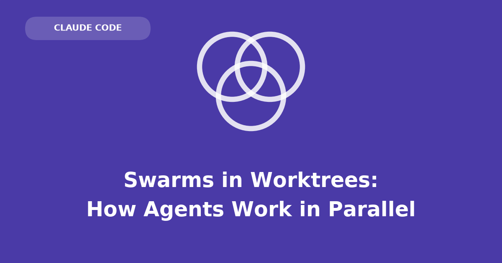

Parallel coding agents sharing one checkout overwrite each other's edits. **Git worktrees** give agents separate working directories over shared history, eliminating file-level collisions.

## Shared-checkout failure mode

Two agents editing the same files produce a chimera diff: partial refactors, broken imports, merged incompatible changes. No error is raised; the last write wins silently.

Cause: read-think-write is not atomic, and agents have no shared awareness of concurrent editors.

```{=html}
<div class="wt wt-a">
<svg viewBox="0 0 440 195" role="img" aria-label="Three agents writing into one shared working directory, where their changes collide and overwrite each other.">
  <line class="wt-lane" x1="55" y1="35"  x2="225" y2="105"/>
  <line class="wt-lane" x1="55" y1="95"  x2="225" y2="105"/>
  <line class="wt-lane" x1="55" y1="155" x2="225" y2="105"/>
  <rect class="wt-box shared" x="150" y="50" width="150" height="110" rx="8"/>
  <text class="wt-lbl" x="225" y="76"  text-anchor="middle">working directory</text>
  <text class="wt-hit" x="225" y="140" text-anchor="middle">write overwritten</text>
  <line class="wt-lane" x1="300" y1="105" x2="372" y2="105"/>
  <line x1="380" y1="20" x2="380" y2="170" stroke="#6b7280" stroke-width="1.5"/>
  <circle cx="380" cy="95" r="6" fill="#6b7280"/>
  <text class="wt-tag" x="380" y="188" text-anchor="middle">main</text>
  <text class="wt-tag" x="55" y="16"  text-anchor="middle">agent 1</text>
  <text class="wt-tag" x="55" y="76"  text-anchor="middle">agent 2</text>
  <text class="wt-tag" x="55" y="136" text-anchor="middle">agent 3</text>
  <g class="d1"><circle cx="55" cy="35"  r="8" fill="#b87a33"/></g>
  <g class="d2"><circle cx="55" cy="95"  r="8" fill="#3f8d80"/></g>
  <g class="d3"><circle cx="55" cy="155" r="8" fill="#c94f59"/></g>
</svg>
<div class="wt-cap">One directory, three writers. The last write wins and the others vanish.</div>
</div>
```

## Worktrees

A git repository has an object database (`.git`) and a working directory (editable files). Default layout: one working directory per repository.

`git worktree add` attaches **multiple working directories** to one object database:

- Each directory can have a different branch checked out.
- Commits from any worktree land in the shared object store.
- Not a clone — no duplicated history, no remote sync between copies.
- Editing a file in one worktree does not affect the same path in another.

## Claude Code isolation

Claude Code sets up worktree isolation automatically. Manual option:

```bash
claude --worktree   # or: claude -w
```

Isolation levels:

- **`--worktree` flag** — creates a fresh worktree; leaves your checkout and branch untouched.
- **Agent view** — one worktree per dispatched session automatically.
- **Subagents with `isolation: "worktree"`** — helper agent gets its own directory; removed if unchanged.
- **`/batch`** — splits one task into subagents, isolated in their own worktrees, each opening a PR:

```
/batch add structured logging to every handler in src/api
```

Fan-out requires enumerable units of work in the prompt:

```
Try three different fixes for the flaky test in tests/pool_test.go — one per
worktree, each on its own branch. Tell me which one holds. Don't
merge anything yet.
```

```
In parallel, each in its own worktree: add rate limiting to /upload, backfill
the types in lib/analytics, and upgrade the test runner to vitest 3. Open a
separate PR for each.
```

```
Port the four adapters in src/adapters to the new client interface. One
subagent per adapter, isolated, and stop each one as soon as its adapter's
tests pass.
```

Requirements for useful fan-out: separable units, explicit parallel request, stopping condition per unit. Vague prompts ("clean up the codebase") do not decompose.

## Parallel hypothesis testing

Example: intermittent test failure with three theories (race, fixture teardown, timeout).

- Dispatch three subagents, one theory each, each in its own worktree on its own branch.
- All edit the same files concurrently without collision.
- Compare three branches and diffs; merge the winner; discard other worktrees.

```{=html}
<div class="wt wt-b">
<svg viewBox="0 0 440 195" role="img" aria-label="Three agents each working in an isolated worktree on its own branch, in parallel without collisions, after which one branch merges into main and the others are discarded.">
  <g class="lose">
    <line class="wt-lane" x1="55" y1="35" x2="175" y2="35"/>
    <rect class="wt-box" x="150" y="13" width="150" height="44" rx="8"/>
    <text class="wt-lbl" x="245" y="39" text-anchor="middle">fix/pool-race</text>
  </g>
  <line class="wt-lane" x1="55" y1="95" x2="175" y2="95"/>
  <rect class="wt-box" x="150" y="73" width="150" height="44" rx="8"/>
  <text class="wt-lbl" x="245" y="99" text-anchor="middle">fix/fixture-teardown</text>
  <g class="lose">
    <line class="wt-lane" x1="55" y1="155" x2="175" y2="155"/>
    <rect class="wt-box" x="150" y="133" width="150" height="44" rx="8"/>
    <text class="wt-lbl" x="245" y="159" text-anchor="middle">fix/timeout</text>
  </g>
  <line x1="380" y1="13" x2="380" y2="177" stroke="#6b7280" stroke-width="1.5"/>
  <circle cx="380" cy="95" r="6" fill="#6b7280"/>
  <circle class="land" cx="380" cy="95" r="8" fill="none" stroke="#3f8d80" stroke-width="2"/>
  <text class="wt-tag" x="380" y="192" text-anchor="middle">main</text>
  <g class="lose"><g class="d1"><circle cx="55" cy="35" r="8" fill="#b87a33"/></g></g>
  <g class="d2"><circle cx="55" cy="95" r="8" fill="#3f8d80"/></g>
  <g class="lose"><g class="d3"><circle cx="55" cy="155" r="8" fill="#c94f59"/></g></g>
  <g class="merge"><circle cx="300" cy="95" r="7" fill="#3f8d80"/></g>
</svg>
<div class="wt-cap">Three lanes, three branches, no contention — then one merges and the rest are dropped.</div>
</div>
```

## When to isolate

Use worktree isolation when:

- Agents will touch overlapping files
- Several independent tasks run concurrently
- A large change decomposes cleanly
- Competing approaches should be compared in parallel

Skip when:

- Single agent (nothing to collide with)
- Small, quick edits (setup cost exceeds work)
- Heavy per-directory dependency installs (`node_modules`, virtualenv per worktree)

## Limits

Worktrees isolate files inside the git tree only. Shared state outside remains a collision surface:

- One development database across agents (migration conflicts)
- Stateful MCP (Model Context Protocol) server sessions shared between agents
- Checklist files outside worktrees
- Shared Redis or other external state

Cost is unchanged: three agents on one bug is three times the tokens. Scoping — narrow tasks with clear stop conditions — controls spend; isolation controls safety.

Agents. Collide. Silently. Worktrees. Separate. Files. Not. Databases. Scope. Narrowly.
