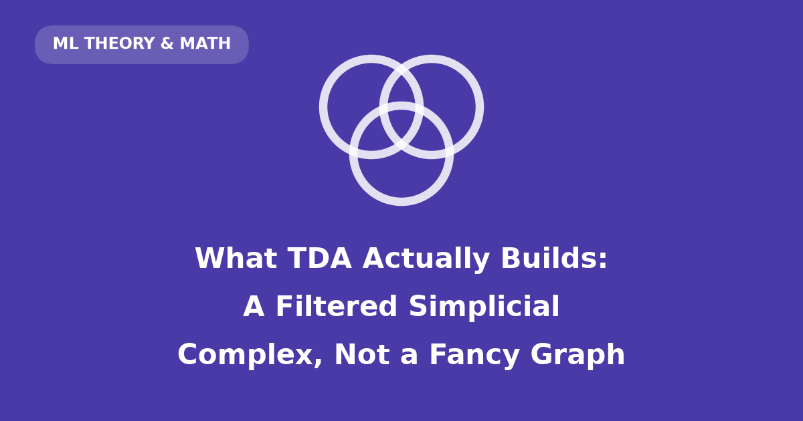

If you come to topological data analysis (TDA) from a graphs background, there is one sentence worth internalizing before anything else:

> **TDA builds a filtered simplicial complex — a structured, hypergraph-like object — over a fixed set of original data points.**

Every word in that sentence is doing work, and most of the confusion I've seen about TDA comes from quietly replacing one of those words with a more familiar graph-theoretic one. "It's a graph where edges appear as you raise a threshold" is *almost* right — and the *almost* is exactly where loops, voids, and persistence live.

This post builds the correct mental model from first principles, using one tiny 2D point cloud — eight points named A through H — that we will follow from raw coordinates all the way to a persistence diagram. Every number, matrix, and figure below is computed live from that same point cloud.

::: {.callout-note collapse="true"}
## Reproducibility: environment setup

This post runs in its own virtualenv, registered as a Jupyter kernel per this blog's convention:

```bash
python3 -m venv .venv-tda-filtered
.venv-tda-filtered/bin/pip install numpy scipy matplotlib networkx ripser persim ipykernel
.venv-tda-filtered/bin/python -m ipykernel install --user --name tda-filtered-blog
```

Quarto discovers Jupyter kernels through the Python it runs, so if it reports `Jupyter kernel 'tda-filtered-blog' not found`, point it at the post's venv:

```bash
QUARTO_PYTHON=.venv-tda-filtered/bin/python quarto render posts/tda-filtered-simplicial-complexes/index.qmd
```

Key versions at render time are printed in the setup cell below. The random seed is fixed, so every figure and number reproduces exactly.
:::

```{python}
#| code-summary: "Setup: imports, style constants, and the drawing helper used throughout"
import itertools

import matplotlib.pyplot as plt
import networkx as nx
import numpy as np
import ripser
import scipy
from IPython.display import Markdown
from matplotlib.colors import LinearSegmentedColormap
from scipy.spatial.distance import pdist, squareform

print(
    f"numpy {np.__version__} · scipy {scipy.__version__} · "
    f"networkx {nx.__version__} · ripser {ripser.__version__}"
)

# --- shared color roles (validated palette) ---------------------------------
INK = "#0b0b0b"      # vertices, primary text
MUTED = "#898781"    # axis labels, ticks
GRIDC = "#e1e0d9"    # hairline grid
BLUE = "#2a78d6"     # edges (1-simplices), H0 series
ORANGE = "#eb6834"   # H1 series
VIOLET = "#4a3aa7"   # filled triangles (2-simplices), H2 series
SEQ_RAMP = LinearSegmentedColormap.from_list(
    "blue_seq", ["#cde2fb", "#86b6ef", "#3987e5", "#1c5cab", "#0d366b"]
)

plt.rcParams.update(
    {
        "font.family": "sans-serif",
        "axes.edgecolor": MUTED,
        "axes.labelcolor": MUTED,
        "xtick.color": MUTED,
        "ytick.color": MUTED,
        "axes.titlecolor": INK,
        "figure.dpi": 120,
    }
)


def style_axes(ax, keep_ticks=False):
    """Recessive chrome: no spines, optional ticks."""
    for side in ("top", "right", "left", "bottom"):
        ax.spines[side].set_visible(False)
    if not keep_ticks:
        ax.set_xticks([])
        ax.set_yticks([])


def draw_complex(ax, eps, show_triangles=True, node_size=210, font_size=8.5):
    """Draw the Vietoris-Rips complex at scale eps over the fixed points.

    Filled violet patches are 2-simplices (3-cliques of the threshold
    graph), blue segments are 1-simplices, ink dots are the fixed vertices.
    """
    n = len(points)
    dm = squareform(pdist(points))
    n_tri = 0
    if show_triangles:
        for i, j, k in itertools.combinations(range(n), 3):
            if max(dm[i, j], dm[i, k], dm[j, k]) <= eps:
                n_tri += 1
                ax.add_patch(
                    plt.Polygon(
                        points[[i, j, k]],
                        closed=True,
                        facecolor=VIOLET,
                        alpha=0.20,
                        edgecolor="none",
                        zorder=1,
                    )
                )
    n_edges = 0
    for i, j in itertools.combinations(range(n), 2):
        if dm[i, j] <= eps:
            n_edges += 1
            ax.plot(
                points[[i, j], 0], points[[i, j], 1], color=BLUE, lw=2, zorder=2
            )
    ax.scatter(points[:, 0], points[:, 1], s=node_size, color=INK, zorder=3)
    for lbl, (x, y) in zip(labels, points):
        ax.text(
            x, y, lbl, color="white", fontsize=font_size, fontweight="bold",
            ha="center", va="center", zorder=4,
        )
    ax.set_aspect("equal")
    ax.set_xlim(-1.45, 3.35)
    ax.set_ylim(-1.45, 1.95)
    style_axes(ax)
    return n_edges, n_tri
```

## 1. One toy point cloud

We need a point cloud small enough to inspect by hand but rich enough to show all the phenomena we care about: **disconnected pieces at small scales, a loop at intermediate scales, and triangles that eventually fill that loop in.**

Six points jittered around a circle give us the loop; a tight pair off to the side gives us a component that stays separate for a long time. The seed is fixed, so these are *the* coordinates for the rest of the post.

```{python}
#| label: fig-cloud
#| fig-cap: "The running example: eight 2D points. A–F sit roughly on a circle; G and H form a tight pair off to the upper right. Nothing topological has happened yet — this is just a set of coordinates."
rng = np.random.default_rng(42)

angles = np.linspace(0, 2 * np.pi, 6, endpoint=False)
circle_points = np.column_stack([np.cos(angles), np.sin(angles)])
circle_points += rng.normal(scale=0.08, size=circle_points.shape)

pair = np.array([[2.6, 1.10], [2.9, 1.45]])

points = np.vstack([circle_points, pair])
labels = list("ABCDEFGH")

fig, ax = plt.subplots(figsize=(7, 4))
draw_complex(ax, eps=0.0, show_triangles=False)
ax.set_title("The toy point cloud", fontsize=12, fontweight="bold")
plt.show()
```

Keep the letters in mind: **A–F** are the would-be loop, **G–H** are the satellite pair. Every later figure uses these same positions.

## 2. The distance matrix: pairwise facts, not shape

The only raw ingredient TDA consumes from this point cloud is the **pairwise distance matrix** $D$, where entry $D_{ij}$ is the Euclidean distance $\lVert x_i - x_j \rVert$ between point $i$ and point $j$. Reading one entry: $D_{GH} \approx 0.46$ means G and H are 0.46 apart — the closest pair in the data.

```{python}
#| label: fig-distmat
#| fig-cap: "The 8×8 Euclidean distance matrix, annotated to two decimals. Darker blue = farther apart. The matrix is symmetric with a zero diagonal. It records pairwise distances only — which pairs are close — and says nothing *by itself* about components, loops, or voids."
D = squareform(pdist(points))

fig, ax = plt.subplots(figsize=(6.4, 5.4))
im = ax.imshow(D, cmap=SEQ_RAMP)
ax.set_xticks(range(8), labels)
ax.set_yticks(range(8), labels)
ax.tick_params(length=0)
for side in ("top", "right", "left", "bottom"):
    ax.spines[side].set_visible(False)
mid = D.max() / 2
for i in range(8):
    for j in range(8):
        ax.text(
            j, i, f"{D[i, j]:.2f}",
            ha="center", va="center", fontsize=7.5,
            color="white" if D[i, j] > mid else INK,
        )
cbar = fig.colorbar(im, ax=ax, shrink=0.85)
cbar.set_label("Euclidean distance", color=MUTED)
cbar.outline.set_visible(False)
ax.set_title("Pairwise distance matrix", fontsize=12, fontweight="bold")
plt.show()
```

A caution worth stating explicitly: this matrix is **not a topological summary**. It is the *input* from which topological structure will be built. In particular, no amount of staring at raw matrix entries — or taking matrix powers, as one might with a graph adjacency matrix — directly reveals loops or voids. Powers of an *adjacency* matrix count walks in a graph; the distance matrix isn't even an adjacency matrix, and "shape" will only emerge once we make explicit choices about scale, which we do next.

## 3. Thresholding produces a nested sequence of graphs

Here is the first genuinely structural move. Pick a scale $\varepsilon \geq 0$ and define a graph $G_\varepsilon$:

- **the vertex set is fixed**: it is always exactly our eight points A–H, at every scale;
- **the edge set grows**: connect $x_i$ and $x_j$ whenever $D_{ij} \leq \varepsilon$.

Because the vertex set never changes and edges only accumulate as $\varepsilon$ grows, these graphs are **nested**:

$$
G_{\varepsilon_1} \subseteq G_{\varepsilon_2} \subseteq G_{\varepsilon_3} \subseteq \cdots
\qquad \text{whenever } \varepsilon_1 \leq \varepsilon_2 \leq \varepsilon_3 \leq \cdots
$$

Each graph contains all the edges of every earlier one, plus possibly more. Nothing is ever removed. Watch the toy cloud pass through four scales:

```{python}
#| label: fig-threshold
#| fig-cap: "Threshold graphs at four scales, drawn over the identical fixed coordinates. ε = 0.6: only the closest pair (G–H, distance 0.46) is joined — seven components. ε = 0.9: A–F and C–D have joined in — five components. ε = 1.25: the six circle points close into a ring, leaving two components. ε = 1.9: many long edges have appeared; the pair still hangs on as its own component until ε ≈ 1.97. Every panel's edge set contains the previous panel's."
threshold_eps = [0.6, 0.9, 1.25, 1.9]

fig, axes = plt.subplots(1, 4, figsize=(13, 3.4))
for ax, eps in zip(axes, threshold_eps):
    n_edges, _ = draw_complex(ax, eps, show_triangles=False, node_size=130, font_size=7)
    G = nx.Graph()
    G.add_nodes_from(labels)
    G.add_edges_from(
        (labels[i], labels[j])
        for i, j in itertools.combinations(range(8), 2)
        if D[i, j] <= eps
    )
    n_comp = nx.number_connected_components(G)
    edge_word = "edge" if n_edges == 1 else "edges"
    ax.set_title(
        f"$\\varepsilon$ = {eps}\n{n_edges} {edge_word} · {n_comp} components",
        fontsize=10,
    )
fig.suptitle(
    "One fixed vertex set, a growing edge set", fontsize=12, fontweight="bold", y=1.06
)
plt.show()
```

Two things to notice. First, **the points never move and are never added or removed** — only our willingness to call a pair "close" changes. Second, connectivity questions ("how many components?") are already answerable at this stage with ordinary graph theory. If components were all we cared about, we could stop here (this is essentially what single-linkage clustering does). But we want loops and voids too, and for those, graphs are about to run out of vocabulary.

## 4. Why a graph alone is insufficient

Here is the tempting shortcut: *"Fine, so it's a graph per scale. If I need more structure, I'll decorate it — edge weights, edge colors, labels. A sufficiently annotated graph should carry all the information."*

This intuition is wrong in a precise and instructive way. Consider points C, D, E, which by $\varepsilon = 1.75$ are all pairwise within range ($D_{CD} \approx 0.86$, $D_{DE} \approx 1.03$, $D_{CE} \approx 1.70$):

```{python}
#| label: fig-triangle
#| fig-cap: "Left: the triangle *boundary* — three edges C–D, D–E, C–E, each a relationship between exactly two points. This is a 1-dimensional cycle: you can walk around it, and it encloses a hole. Right: the *filled* 2-simplex {C, D, E} — a single three-way relationship, drawn as a violet membrane. The filled triangle is a different object, not a styling of the edges: its presence declares that the cycle around it bounds nothing, killing the hole."
sub = [labels.index(c) for c in "CDE"]
tri = points[sub]

fig, axes = plt.subplots(1, 2, figsize=(9, 3.8))
for ax, filled in zip(axes, [False, True]):
    if filled:
        ax.add_patch(
            plt.Polygon(tri, closed=True, facecolor=VIOLET, alpha=0.25,
                        edgecolor="none", zorder=1)
        )
    for i, j in itertools.combinations(range(3), 2):
        ax.plot(tri[[i, j], 0], tri[[i, j], 1], color=BLUE, lw=2.2, zorder=2)
    ax.scatter(tri[:, 0], tri[:, 1], s=260, color=INK, zorder=3)
    for lbl, (x, y) in zip("CDE", tri):
        ax.text(x, y, lbl, color="white", fontsize=10, fontweight="bold",
                ha="center", va="center", zorder=4)
    ax.set_aspect("equal")
    ax.set_xlim(-1.35, 0.05)
    ax.set_ylim(-1.25, 1.15)
    style_axes(ax)
axes[0].set_title("Boundary only: three 1-simplices\n(a cycle with a hole)", fontsize=10)
axes[1].set_title("Filled 2-simplex {C, D, E}\n(one 3-way object; hole destroyed)", fontsize=10)
plt.show()
```

The core issue is arity. **An edge, no matter how you weight, color, or label it, is a relationship between exactly two endpoints.** A filled triangle is a *single* relationship among *three* points at once. It is not "three edges plus a style"; it is a genuinely different kind of object, the same way a 3-way interaction term in a regression is not a decorated pair of 2-way terms.

The distinction matters because of what each object does topologically:

- The **triangular cycle** C–D–E–C (three edges) is a candidate 1-dimensional loop: a closed path that may enclose a hole.
- The **filled 2-simplex** $\{C, D, E\}$ *fills* that cycle: it certifies that the loop bounds a membrane and therefore does not count as a hole.

Ordinary graph structure can express connectivity and can even enumerate cycles. What it cannot express is **whether a cycle is filled** — and "is this loop filled or is it a real hole?" is exactly the question TDA is designed to answer. To ask it, we need a structure whose vocabulary includes higher-dimensional pieces natively.

## 5. Simplicial complexes: hypergraph-like, plus one crucial law

The intuitive picture first. We want a structure that records relationships of every arity over our fixed points:

- a relationship involving **one** point — the point itself being present;
- a relationship involving **two** points — an edge;
- a relationship involving **three** points — a filled triangle;
- a relationship involving **four** points — a filled tetrahedron; and so on.

If you know hypergraphs, this smells like one: a set system over a vertex set, with "hyperedges" of any size. That intuition is a fine on-ramp. Now the exact vocabulary:

- A **simplex** is a finite set of vertices, interpreted geometrically by its size: a 1-element set is a **0-simplex** (vertex), a 2-element set a **1-simplex** (edge), a 3-element set a **2-simplex** (filled triangle), a 4-element set a **3-simplex** (solid tetrahedron), and in general a $(k{+}1)$-element set is a $k$-simplex. The subsets of a simplex are its **faces**: the faces of $\{C, D, E\}$ are its three edges, its three vertices (and itself).

- An **abstract simplicial complex** is a collection of simplices that is **closed under taking faces**: if a simplex is in the complex, every face of it must be in the complex too.

That closure property is the law that separates a simplicial complex from a generic hypergraph, and it is worth spelling out concretely. If the filled triangle $\{C, D, E\}$ is present, then the edges $\{C,D\}, \{D,E\}, \{C,E\}$ **must** be present, and so must the vertices $\{C\}, \{D\}, \{E\}$. A hypergraph is under no such obligation — it may happily contain a 3-way hyperedge $\{C, D, E\}$ without containing $\{C, D\}$. So "hypergraph-like" is honest intuition, but a simplicial complex is *not* merely a hypergraph: the closure property is the extra structure, and it is precisely what makes it meaningful to talk about a triangle *filling* the cycle formed by its own edges. Boundaries are guaranteed to exist inside the complex; filled things always have their skeletons present.

With this vocabulary, the earlier figure reads cleanly: the left panel is the complex $\{\{C\},\{D\},\{E\},\{C,D\},\{D,E\},\{C,E\}\}$; the right panel is that same complex **plus the single extra simplex** $\{C,D,E\}$. One added set — that's the entire difference between "hole" and "no hole".

## 6. The Vietoris–Rips complex: cliques become simplices

We now have the target structure (simplicial complex) and a scale-indexed family of graphs. The bridge between them, and the construction this post uses throughout, is the **Vietoris–Rips complex** $\mathrm{VR}_\varepsilon$:

> Start from the threshold graph $G_\varepsilon$. Add a simplex for **every clique** in that graph. Equivalently: a set of points forms a simplex whenever **every pair** in the set is within distance $\varepsilon$.

$$
\{x_{i_0}, \ldots, x_{i_k}\} \in \mathrm{VR}_\varepsilon
\iff
D_{i_p i_q} \leq \varepsilon \ \text{ for every pair } p, q .
$$

Closure under faces is automatic: every subset of a clique is a clique. Here is the toy cloud's Rips complex at four scales:

```{python}
#| label: fig-rips
#| fig-cap: "Vietoris–Rips complexes at four scales. Ink dots are 0-simplices (always all eight), blue segments 1-simplices, violet patches filled 2-simplices; where patches overlap the violet deepens. ε = 0.9: a few edges, no triangles. ε = 1.25: the ring closes — a genuine 1-dimensional loop, with no triangles yet to dispute it. ε = 1.75: four triangles have filled in and the loop has shrunk to the still-unfilled middle. ε = 1.9: enough triangles overlap that the central cycle is entirely filled — the loop is dead."
rips_eps = [0.9, 1.25, 1.75, 1.9]

fig, axes = plt.subplots(2, 2, figsize=(11, 7))
for ax, eps in zip(axes.flat, rips_eps):
    n_edges, n_tri = draw_complex(ax, eps, node_size=150, font_size=7.5)
    ax.set_title(
        f"$\\varepsilon$ = {eps} · {n_edges} edges · {n_tri} filled triangles",
        fontsize=10,
    )
fig.suptitle(
    "Vietoris–Rips complexes: every clique becomes a simplex",
    fontsize=12, fontweight="bold",
)
fig.tight_layout()
plt.show()
```

One subtlety the drawings can't show: simplices above dimension 2 exist in this construction but can't be rendered as flat pictures. A count by dimension makes them visible:

```{python}
#| code-summary: "Count simplices by dimension at each scale (cliques of the threshold graph)"
def simplex_counts(eps, max_size=4):
    counts = {}
    for size in range(1, max_size + 1):
        counts[size - 1] = sum(
            1
            for combo in itertools.combinations(range(8), size)
            if all(D[i, j] <= eps for i, j in itertools.combinations(combo, 2))
        )
    return counts

rows = ["| $\\varepsilon$ | 0-simplices | 1-simplices | 2-simplices | 3-simplices |",
        "|---|---|---|---|---|"]
for eps in [0.9, 1.25, 1.75, 1.9, 2.0]:
    c = simplex_counts(eps)
    rows.append(f"| {eps} | {c[0]} | {c[1]} | {c[2]} | {c[3]} |")
Markdown("\n".join(rows))
```

At $\varepsilon = 2.0$ a 3-simplex appears: C, D, E, F have become pairwise close (the longest pair, C–F, sits at $\approx 1.99$), so the *solid tetrahedron* $\{C,D,E,F\}$ enters the complex — a four-way relationship we can only tabulate, not draw in the plane. Note something conceptually pleasing here: our points live in 2D, but the Rips complex is an **abstract** simplicial complex built from the distance matrix alone. It doesn't know or care about the plane, and it is free to contain 3-simplices — and, as we'll see shortly, even a 2-dimensional void.

Worth a brief aside: Vietoris–Rips is not the only way to turn a point cloud into complexes. The **Čech complex** includes a simplex when the points' $\varepsilon/2$-balls share a *common* intersection point, which is a strictly stronger requirement than pairwise proximity and has nicer theoretical guarantees, at higher computational cost. Everything below applies to either; we use Rips because it's what fast libraries compute.

## 7. From filtration to persistence: two different things

Because $\mathrm{VR}_\varepsilon$ is built from cliques of a graph whose edges only accumulate, the Rips complexes are nested exactly as the graphs were:

$$
\mathrm{VR}_{\varepsilon_1} \subseteq \mathrm{VR}_{\varepsilon_2} \subseteq \cdots
$$

This nested, scale-indexed family is called a **filtration**. Each simplex has a well-defined arrival time: it enters at the scale equal to its longest pairwise distance (its *diameter*).

Now, a distinction that is easy to blur and important to keep sharp:

- **The filtration is bookkeeping.** Knowing *which simplices are present at each scale* is a purely combinatorial fact — we just computed it in the table above.
- **Persistence is a computation on top of it.** Knowing *which components, loops, and voids exist* at each scale — and when each is born and dies — requires algebraic topology, specifically **homology**, applied across the whole filtration.

Why isn't the bookkeeping enough? Because "is there a loop?" is not a local question about individual simplices. Homology answers it by a quotient: in each dimension $k$ it considers the **$k$-cycles** (closed $k$-dimensional configurations, like our edge-cycle around the ring) *modulo* the **boundaries** (cycles that are filled in by $(k{+}1)$-simplices, like the edge-cycle C–D–E once $\{C,D,E\}$ is present). A hole is a cycle that is not a boundary. The count of independent such holes in dimension $k$ is the **Betti number** $\beta_k$: $\beta_0$ counts connected components, $\beta_1$ independent loops, $\beta_2$ independent enclosed voids.

Mechanically, this is linear algebra: one builds **boundary maps** $\partial_k$ sending each $k$-simplex to the alternating sum of its faces, and Betti numbers fall out of the ranks of these maps ($\beta_k = \dim\ker\partial_k - \operatorname{rank}\partial_{k+1}$). **Persistent** homology runs this computation not at one scale but coherently across the entire filtration, tracking each individual hole from the scale where it is **born** to the scale where it **dies** (gets filled in or merges into something older). We won't derive the matrix reduction algorithm here — the point is that persistence pairs up birth and death *scales*, which is strictly more information than Betti numbers at any single scale you could have picked in advance.

## 8. Computing persistence on the toy cloud

Time to hand our eight points to a real library. `ripser` computes Rips persistence directly from the point cloud (internally, from the same distance matrix we built by hand).

Conventions, stated explicitly so the numbers below are unambiguous: `ripser` includes a simplex as soon as its diameter is $\leq \varepsilon$ — the same weak inequality we used for the threshold graphs — and its filtration values are in the *same units as our distances*, so a birth of 1.23 means "born at $\varepsilon = 1.23$", directly comparable to every $\varepsilon$ in the figures above. In $H_0$, one component never dies (the whole dataset is connected for large $\varepsilon$), so one bar extends to infinity.

```{python}
#| code-summary: "Compute persistent homology with ripser (dimensions 0, 1, 2)"
res = ripser.ripser(points, maxdim=2)
dgms = res["dgms"]
for k, dgm in enumerate(dgms):
    print(f"H{k} intervals (birth, death):")
    for b, d in dgm:
        print(f"  ({b:.3f}, {'∞' if np.isinf(d) else f'{d:.3f}'})")
```

### The persistence diagram

Each hole becomes a single point $(b, d)$: born at scale $b$, dead at scale $d$. Points far above the diagonal persisted across a wide range of scales; points hugging the diagonal barely existed.

```{python}
#| label: fig-diagram
#| fig-cap: "Persistence diagram for the toy cloud. Both axes are the scale parameter ε — there is no time axis. Blue circles (H₀): component mergers, including the long-lived bar for the G–H pair dying at ε ≈ 1.97, and one immortal component plotted on the dashed ∞ line. The orange square (H₁) is the ring A–F: born 1.23, dead 1.83 — far off the diagonal, hence a real feature. The violet triangle (H₂) is a fleeting abstract void, born 1.88 and filled at 1.99 by the tetrahedron {C,D,E,F} — close to the diagonal, hence more curiosity than signal."
finite_max = max(d for dgm in dgms for _, d in dgm if np.isfinite(d))
lim = finite_max * 1.12
inf_y = lim * 1.06

fig, ax = plt.subplots(figsize=(6.2, 6.2))
ax.set_facecolor("none")
ax.plot([0, lim], [0, lim], color=GRIDC, lw=1.2, zorder=1)
ax.axhline(inf_y, color=MUTED, lw=1, ls=(0, (4, 4)), zorder=1)
ax.text(0.12, inf_y, "∞ ", ha="right", va="center", color=MUTED, fontsize=11)

series = [("$H_0$ components", BLUE, "o"),
          ("$H_1$ loops", ORANGE, "s"),
          ("$H_2$ voids", VIOLET, "^")]
for dgm, (name, color, marker) in zip(dgms, series):
    births = dgm[:, 0]
    deaths = np.where(np.isinf(dgm[:, 1]), inf_y, dgm[:, 1])
    ax.scatter(births, deaths, s=70, color=color, marker=marker, label=name,
               zorder=3, edgecolors="white", linewidths=1.2)

ax.annotate("the ring A–F\n(1.23, 1.83)", xy=(1.23, 1.83), xytext=(0.35, 1.62),
            fontsize=9, color=INK,
            arrowprops=dict(arrowstyle="-", color=MUTED, lw=1))
ax.annotate("G–H pair joins\nthe rest (1.97)", xy=(0.0, 1.97), xytext=(0.42, 2.06),
            fontsize=9, color=INK,
            arrowprops=dict(arrowstyle="-", color=MUTED, lw=1))
ax.set_xlim(-0.08, lim)
ax.set_ylim(-0.08, inf_y * 1.05)
ax.set_xlabel("birth scale $\\varepsilon$")
ax.set_ylabel("death scale $\\varepsilon$")
ax.set_aspect("equal")
for side in ("top", "right"):
    ax.spines[side].set_visible(False)
ax.grid(color=GRIDC, lw=0.6)
ax.set_axisbelow(True)
ax.legend(frameon=False, loc="lower right", labelcolor=INK)
ax.set_title("Persistence diagram", fontsize=12, fontweight="bold")
plt.show()
```

### The same information as a barcode

A **barcode** redraws each diagram point $(b, d)$ as a horizontal bar $[b, d]$ over the $\varepsilon$-axis. Long bars = persistent features.

```{python}
#| label: fig-barcode
#| fig-cap: "Persistence barcode — the same intervals as the diagram, drawn as bars over the ε-axis. Reading H₀ top-down: the shortest bar ends at 0.46 (G and H merge), the next at 0.85 twice (A–F and C–D join the circle group), then 1.03, 1.08, 1.12 as the circle assembles, one long bar to 1.97 (the pair holding out), and one bar running off to infinity (the final single component). The lone H₁ bar spans [1.23, 1.83] — the ring. The sliver H₂ bar spans [1.88, 1.99]."
fig, ax = plt.subplots(figsize=(8.5, 4.6))
y = 0
yticks, ylabels = [], []
group_gap = 1.6
for dgm, (name, color, _) in zip(dgms, series):
    order = np.argsort(dgm[:, 0] + np.where(np.isinf(dgm[:, 1]), 1e9, dgm[:, 1]))
    group_top = y
    for b, d in dgm[order][::-1]:
        if np.isinf(d):
            ax.plot([b, lim * 1.02], [y, y], color=color, lw=3.5,
                    solid_capstyle="round")
            ax.annotate("", xy=(lim * 1.08, y), xytext=(lim * 1.02, y),
                        arrowprops=dict(arrowstyle="->", color=color, lw=1.6))
        else:
            ax.plot([b, d], [y, y], color=color, lw=3.5, solid_capstyle="round")
        y += 1
    yticks.append((group_top + y - 1) / 2)
    ylabels.append(name)
    y += group_gap
ax.set_yticks(yticks, ylabels, fontsize=11, color=INK)
ax.tick_params(axis="y", length=0)
ax.set_xlim(-0.05, lim * 1.12)
ax.set_xlabel("scale $\\varepsilon$")
for side in ("top", "right", "left"):
    ax.spines[side].set_visible(False)
ax.grid(axis="x", color=GRIDC, lw=0.6)
ax.set_axisbelow(True)
ax.set_title("Persistence barcode", fontsize=12, fontweight="bold")
plt.show()
```

### Reading actual features out of these figures

- **The ring is the story.** The single $H_1$ interval $[1.23, 1.83]$ says: at $\varepsilon = 1.23$ the edge B–C closes the circle A–B–C–D–E–F into a cycle no triangle yet fills; at $\varepsilon = 1.83$ the edge B–D creates the last triangles needed to fill its interior. Its persistence, $1.83 - 1.23 = 0.60$, is large relative to the diagram's scale: a robust loop, not noise.
- **$H_0$ tells the merge history.** Seven finite bars record seven mergers, and their death scales are exactly the edge lengths that performed each merge — compare them with the sorted distance matrix entries: 0.46 (G–H), 0.85, 0.85, 1.03, 1.08, 1.12 (the circle assembling), and finally 1.97 when edge A–G bridges the pair to everything else. The gap between 1.12 and 1.97 is the barcode's way of saying "for a wide range of scales, this data is *two* clusters."
- **The $H_2$ sliver is a bonus lesson.** Between $\varepsilon = 1.88$ and $1.99$ the complex contains a closed 2-dimensional surface of triangles enclosing an empty interior — an abstract void, despite the points living flat in 2D — which the tetrahedron $\{C,D,E,F\}$ promptly fills. Short bar, near the diagonal: real, computed, and correctly ignored as noise.

### Betti numbers at chosen scales

Fixing a scale and asking "how many holes of each kind *right now*?" gives the Betti numbers $\beta_k(\varepsilon)$ — computable from the intervals by counting bars alive at $\varepsilon$, i.e. with $b \leq \varepsilon < d$ (consistent with the $\leq$ inclusion convention). As a cross-check, $\beta_0$ from the intervals matches an independent `networkx` component count of the threshold graph at every scale:

```{python}
#| code-summary: "Betti numbers at selected scales, from the intervals, cross-checked against networkx"
def betti(eps, dgm):
    return int(np.sum((dgm[:, 0] <= eps) & (eps < dgm[:, 1])))

rows = ["| $\\varepsilon$ | $\\beta_0$ (components) | $\\beta_1$ (loops) | $\\beta_2$ (voids) | graph components (networkx) |",
        "|---|---|---|---|---|"]
for eps in [0.6, 0.9, 1.25, 1.75, 1.9, 2.0]:
    G = nx.Graph()
    G.add_nodes_from(range(8))
    G.add_edges_from(
        (i, j) for i, j in itertools.combinations(range(8), 2) if D[i, j] <= eps
    )
    nx_comp = nx.number_connected_components(G)
    b0, b1, b2 = (betti(eps, dgm) for dgm in dgms)
    assert b0 == nx_comp, "β₀ must equal the number of graph components"
    rows.append(f"| {eps} | {b0} | {b1} | {b2} | {nx_comp} |")
Markdown("\n".join(rows))
```

Read one row against the earlier pictures: at $\varepsilon = 1.25$ the complex has $\beta_0 = 2$ (ring group + pair) and $\beta_1 = 1$ (the ring) — exactly what the second Rips panel showed. And notice what no single row can show: that the loop at 1.25 and the loop at 1.75 are *the same* loop. That identification across scales is precisely what persistence adds over any one-scale snapshot.

## 9. Glossary, grounded in the running example

- **Point cloud** — a finite set of points with coordinates (or just pairwise distances). Ours: A–H in the plane.
- **Distance matrix** — the symmetric matrix of pairwise distances; entry $D_{GH} \approx 0.46$. Input to everything, itself topology-free.
- **Simplex** — a finite vertex set read as a geometric piece: $\{G\}$ a vertex, $\{G,H\}$ an edge, $\{C,D,E\}$ a filled triangle, $\{C,D,E,F\}$ a solid tetrahedron.
- **Simplicial complex** — a collection of simplices closed under taking faces.
- **Closure property** — if $\{C,D,E\}$ is in the complex, so are $\{C,D\}, \{D,E\}, \{C,E\}, \{C\}, \{D\}, \{E\}$. The law a generic hypergraph doesn't have to obey.
- **Vietoris–Rips complex** — the complex at scale $\varepsilon$ whose simplices are exactly the sets of points that are *pairwise* within $\varepsilon$; equivalently, the cliques of the threshold graph.
- **Filtration** — the nested family $\mathrm{VR}_{\varepsilon_1} \subseteq \mathrm{VR}_{\varepsilon_2} \subseteq \cdots$; each simplex enters at its diameter and never leaves.
- **Betti numbers** — hole counts of a single complex: $\beta_0$ connected components, $\beta_1$ independent loops, $\beta_2$ independent enclosed voids. At $\varepsilon = 1.25$ our complex has $(\beta_0, \beta_1, \beta_2) = (2, 1, 0)$.
- **Persistence diagram** — each hole plotted once as (birth scale, death scale); our ring is the point $(1.23, 1.83)$.
- **Persistence barcode** — the same intervals drawn as bars over the $\varepsilon$-axis; long bars persist.
- **Persistence landscape** — a transformation of the diagram into a sequence of real-valued functions (equivalently, vectors after sampling), giving a representation that can be averaged and fed to statistical or machine-learning pipelines — things you cannot straightforwardly do with raw diagrams. A pointer, not a topic, here.
- **Bottleneck distance** — a metric between two persistence diagrams: over all ways of matching the points of one diagram to the points of the other (allowing any point to instead match to its nearest spot on the diagonal, treating it as a feature that never existed), the smallest achievable *largest* single matching distance.
- **Wasserstein distance** — same matching setup, but summing (a power of) *all* matching distances rather than taking the maximum, so many small discrepancies count, not just the worst one.

## 10. Common misconceptions

Tempting, and wrong — with one-sentence corrections:

- **"TDA is just a multigraph with colored or weighted edges."** Edges have exactly two endpoints, so no edge decoration can express the filled triangle $\{C,D,E\}$ — a single three-way simplex — nor whether a cycle is filled, which is the very question homology answers.
- **"Powers of the raw distance matrix directly reveal topological shape."** Powers of an adjacency matrix count walks, the distance matrix isn't one, and shape only emerges from the *filtration* — the nested family of simplicial complexes indexed by the scale threshold, plus a homology computation over it.
- **"A persistence diagram has a time axis."** Both axes are values of the scale parameter $\varepsilon$: each point is (birth *scale*, death *scale*), and nothing in the construction is chronological.
- **"A long cycle in the threshold graph means TDA will report a loop."** A cycle only counts if it isn't filled by higher simplices — β₁ of the *complex* at $\varepsilon = 1.9$ is 0 even though the threshold *graph* at 1.9 is full of cycles.

---

If you want to go further: [Topological Data Analysis: Finding Clusters, Loops, and Voids Across Scales](../topological-data-analysis-clustering/index.qmd) works a homology computation by hand and uses persistence as an ML feature extractor, and [TDA vs SVM](../tda-vs-svm-expanding-the-space/index.qmd) contrasts this machinery with kernel methods. The mental model to carry out the door is the one we started with: a fixed set of points, a growing tower of simplicial complexes over them, and births and deaths of holes read off along the way.
