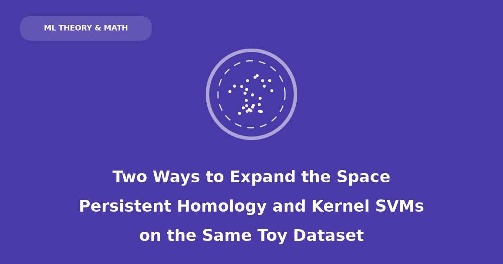

## Introduction

Here is a single dataset: a cluster of points scattered inside a disk, surrounded by a ring of points at a larger radius. No straight line separates the two groups — any line you draw has ring points and disk points sitting on both sides of it, because the ring wraps all the way around.

Two very different-looking tools handle this without trouble. **Persistent homology** looks at the point cloud with no labels at all and reports "there is one big hole here." A **kernel support vector machine** looks at the same points with their labels and draws a curve that separates them perfectly. Neither tool works by fitting a curved line directly in the plane. Both work by first lifting the data into a bigger space where the problem becomes easy, then reading off the answer there.

That's the parallel this post is built around, worked through on one toy dataset from first principles: no survey of TDA methods, no survey of kernels — just the same 240 points, looked at two ways.

## The Toy Dataset: A Disk and a Ring

```{python}
import numpy as np
import matplotlib.pyplot as plt

rng = np.random.default_rng(7)


def make_disk_and_ring(n_inside=100, n_ring=140, r_inside=0.35, r_ring=1.0, ring_noise=0.06, seed=7):
    rng = np.random.default_rng(seed)
    theta_in = rng.uniform(0, 2 * np.pi, n_inside)
    r_in = r_inside * np.sqrt(rng.uniform(0, 1, n_inside))
    inside = np.column_stack([r_in * np.cos(theta_in), r_in * np.sin(theta_in)])

    theta_out = rng.uniform(0, 2 * np.pi, n_ring)
    r_out = r_ring + rng.normal(0, ring_noise, n_ring)
    ring = np.column_stack([r_out * np.cos(theta_out), r_out * np.sin(theta_out)])

    X = np.vstack([inside, ring])
    y = np.concatenate([np.zeros(n_inside), np.ones(n_ring)]).astype(int)
    return X, y


X, y = make_disk_and_ring()

fig, ax = plt.subplots(figsize=(5, 5))
ax.scatter(*X[y == 0].T, s=18, color="tab:blue", label="inside (class 0)")
ax.scatter(*X[y == 1].T, s=18, color="tab:red", label="ring (class 1)")
ax.set_aspect("equal")
ax.set_title("The toy dataset: 100 points inside, 140 on a noisy ring")
ax.legend(loc="upper right", fontsize=8)
plt.show()
```

100 points fall uniformly inside a disk of radius 0.35 (class 0); 140 points sit on a circle of radius 1.0 with a bit of radial noise (class 1). Together they form one point cloud, $X \subset \mathbb{R}^2$, with 240 points and two labels.

This is deliberately the same shape of problem as `sklearn.datasets.make_circles`, but framed as one filled blob inside one hollow ring rather than two thin rings, which will make the "one obvious hole" story in the next section as clean as possible. Everything from here on uses this exact `X` and `y` — no new dataset gets introduced.

## Lens 1: Persistent Homology Sees a Hole

Forget the labels `y` for this whole section. Persistent homology never looks at them — it only ever sees the 240 unlabeled points and their pairwise distances.

### Building the filtration by hand

Fix a radius $\varepsilon \geq 0$ and draw an edge between every pair of points closer than $\varepsilon$. As $\varepsilon$ grows from $0$ to $\infty$, edges only ever get added, never removed — this nested sequence of graphs (formally, of *simplicial complexes*, the **Vietoris-Rips filtration**) is "the space, expanded": the same 240 points, now connected up at every possible scale simultaneously, rather than at one scale someone had to choose in advance.

```{python}
from itertools import combinations


def plot_edges(points, eps, ax, colors=None):
    n = len(points)
    dists = np.linalg.norm(points[:, None] - points[None, :], axis=-1)
    for i, j in combinations(range(n), 2):
        if dists[i, j] <= eps:
            ax.plot(*zip(points[i], points[j]), color="tab:purple", lw=0.5, alpha=0.5, zorder=1)
    c = colors if colors is not None else "black"
    ax.scatter(points[:, 0], points[:, 1], s=6, zorder=2, c=c, cmap="coolwarm")
    ax.set_title(f"$\\varepsilon$ = {eps}")
    ax.set_xlim(-1.4, 1.4)
    ax.set_ylim(-1.4, 1.4)
    ax.set_aspect("equal")
    ax.set_xticks([])
    ax.set_yticks([])


fig, axes = plt.subplots(1, 4, figsize=(14, 4))
for ax, eps in zip(axes, [0.05, 0.15, 0.4, 0.8]):
    plot_edges(X, eps, ax, colors=y)
plt.tight_layout()
plt.show()
```

Reading left to right, using the connected-components count $\beta_0$ and independent-loop count $\beta_1$ computed directly from the edge/triangle counts at each radius:

- $\varepsilon = 0.05$: almost nothing connects yet — 120 separate components, no loops. Too fine a scale to see any structure.
- $\varepsilon = 0.15$: local neighborhoods have linked up (12 components), but there are 5 small, short-lived loops — artifacts of exactly which nearby points happened to connect first, not real structure.
- $\varepsilon = 0.4$: the ring has consolidated into one single loop that closes all the way around ($\beta_1 = 1$), while the disk has become one solid, hole-free blob. Ring and disk are still two separate components ($\beta_0 = 2$) — not yet close enough to touch.
- $\varepsilon = 0.8$: ring and disk have merged into one component, the gap between them has filled in with edges and triangles, and the loop is gone ($\beta_1 = 0$). The whole thing is now one contractible blob.

The loop that appears at $\varepsilon = 0.4$ and is gone by $\varepsilon = 0.8$ is the empty annular gap between the disk and the ring — the "hole" in this dataset. The five loops visible at $\varepsilon = 0.15$ are not that hole; they're sampling noise that closes up again almost immediately. Persistence is exactly the tool for telling these two kinds of loop apart: track the full birth-to-death lifetime of every loop, across every $\varepsilon$, and keep the ones that last.

### The persistence diagram

```{python}
from ripser import ripser
from persim import plot_diagrams

dgms = ripser(X, maxdim=1)["dgms"]
h1 = dgms[1]
lifetimes = h1[:, 1] - h1[:, 0]
top = h1[np.argmax(lifetimes)]

fig, ax = plt.subplots(figsize=(5, 5))
plot_diagrams(dgms, ax=ax, show=False)
ax.annotate(
    "the hole\n(disk/ring gap)",
    xy=(top[0], top[1]), xytext=(top[0] - 0.15, top[1] + 0.55),
    arrowprops=dict(arrowstyle="->", color="black"), fontsize=9,
)
ax.set_title("Persistence diagram (H0 = components, H1 = loops)")
plt.show()

print(f"longest-lived H1 feature: born {top[0]:.3f}, dies {top[1]:.3f}, lifetime {lifetimes.max():.3f}")
print(f"next-longest H1 lifetime: {np.sort(lifetimes)[-2]:.3f}")
```

One $H_1$ point sits far above the diagonal; every other point — all the transient micro-loops from the $\varepsilon = 0.15$ panel — sits close to it. The longest-lived loop survives across a range of radii roughly four times longer than the runner-up. That gap in lifetimes *is* the signal: persistent homology never had to be told "look for one hole in the middle." It swept every scale, recorded how long every loop lived, and the one real hole simply outlasted all the fake ones.

Notice what this computation never used: the class labels `y`. Persistent homology describes the shape of the point cloud on its own terms, independent of any downstream task.

## Lens 2: The Kernel SVM Sees a Boundary

Now bring the labels back. This section throws away the persistence machinery entirely and asks a completely different question of the exact same `X`: given `y`, what decision rule separates the two classes?

### A straight line can't do it

```{python}
from sklearn.svm import LinearSVC

linear = LinearSVC(max_iter=10000)
linear.fit(X, y)
print(f"linear SVM training accuracy: {linear.score(X, y):.2f}")
```

A linear classifier gets barely better than a coin flip. That's not a tuning problem — it's structural. The ring surrounds the disk symmetrically, so *any* hyperplane (line, in 2D) that has some disk points on one side will have some ring points mixed in on that same side. There is no straight cut through $\mathbb{R}^2$ that works, no matter how the line's slope and offset are chosen.

### Expanding the space by hand: one extra coordinate

The classic fix, and the seed of the entire kernel trick: don't change the classifier, change the space it looks at. Map every point $x = (x_1, x_2)$ to

$$
\phi(x) = \left(x_1,\ x_2,\ x_1^2 + x_2^2\right) \in \mathbb{R}^3.
$$

The third coordinate is just squared distance from the origin — cheap to compute, and it's exactly the quantity that tells disk points ($x_1^2+x_2^2$ small) apart from ring points ($x_1^2+x_2^2 \approx 1$).

```{python}
from mpl_toolkits.mplot3d import Axes3D  # noqa: F401
from sklearn.svm import LinearSVC

Z = np.column_stack([X[:, 0], X[:, 1], X[:, 0] ** 2 + X[:, 1] ** 2])

lifted = LinearSVC(max_iter=10000)
lifted.fit(Z, y)
print(f"linear SVM on phi(x), training accuracy: {lifted.score(Z, y):.2f}")
print(f"separating-plane coefficients (x1, x2, x1^2+x2^2): {lifted.coef_.round(3)}")

fig = plt.figure(figsize=(6, 5))
ax = fig.add_subplot(projection="3d")
ax.scatter(*Z[y == 0].T, s=12, color="tab:blue", label="inside")
ax.scatter(*Z[y == 1].T, s=12, color="tab:red", label="ring")
ax.set_xlabel("$x_1$")
ax.set_ylabel("$x_2$")
ax.set_zlabel("$x_1^2+x_2^2$")
ax.set_title(r"$\phi(x) = (x_1, x_2, x_1^2+x_2^2)$: now linearly separable")
ax.legend()
plt.show()
```

In $\mathbb{R}^3$ the two classes lift onto two flat, clearly separated layers, and a plane splits them with 100% training accuracy. The fitted plane's coefficients confirm exactly what was expected: the weight on $x_1^2+x_2^2$ dwarfs the weights on $x_1$ and $x_2$, so the plane is really just a threshold on squared radius — "closer than $r$ from the origin" versus "farther than $r$." A curved boundary in the original 2D space became a flat one after adding a single well-chosen coordinate.

### The actual kernel trick: never build $\phi(x)$ explicitly

$\phi(x) = (x_1, x_2, x_1^2+x_2^2)$ was a feature map picked by hand for this dataset. The kernel trick generalizes this: instead of choosing and computing a feature map, choose a **kernel** $k(x, x') = \langle \phi(x), \phi(x') \rangle$ — a similarity function that *behaves as if* some (possibly much higher- or infinite-dimensional) feature map $\phi$ were applied first, without ever computing $\phi(x)$ for any single point. The RBF kernel,

$$
k(x, x') = \exp\!\left(-\gamma \lVert x - x' \rVert^2\right),
$$

corresponds to an infinite-dimensional $\phi$. Fitting an SVM only ever needs $k(x_i, x_j)$ for pairs of training points, so the infinite dimensionality is never a problem — it's never materialized.

```{python}
from sklearn.svm import SVC

rbf = SVC(kernel="rbf", C=1.0, gamma=2.0)
rbf.fit(X, y)
print(f"RBF-kernel SVM training accuracy: {rbf.score(X, y):.2f}")
print(f"support vectors used: {rbf.n_support_} (of {len(X)} points)")

xx, yy = np.meshgrid(np.linspace(-1.5, 1.5, 300), np.linspace(-1.5, 1.5, 300))
zz = rbf.decision_function(np.c_[xx.ravel(), yy.ravel()]).reshape(xx.shape)

fig, ax = plt.subplots(figsize=(5, 5))
ax.contourf(xx, yy, zz, levels=20, cmap="coolwarm", alpha=0.55)
ax.contour(xx, yy, zz, levels=[0], colors="black", linewidths=2)
ax.contour(xx, yy, zz, levels=[-1, 1], colors="black", linewidths=0.8, linestyles="--")
ax.scatter(*X[y == 0].T, s=16, color="tab:blue", edgecolor="k", linewidth=0.3)
ax.scatter(*X[y == 1].T, s=16, color="tab:red", edgecolor="k", linewidth=0.3)
ax.scatter(*X[rbf.support_].T, s=60, facecolors="none", edgecolors="black", linewidth=0.8, label="support vectors")
ax.set_aspect("equal")
ax.set_title("RBF-kernel SVM decision boundary")
ax.legend(loc="upper right", fontsize=8)
plt.show()
```

The RBF SVM was only ever given the raw 2D coordinates — no squared-radius feature was handed to it — and it still finds a boundary that traces almost exactly the circle the hand-built $\phi(x) = (x_1, x_2, x_1^2+x_2^2)$ predicted. The kernel implicitly reproduced the useful part of that feature map, purely from pairwise similarities.

## What Each Method Actually Sees

| | Persistent homology | Kernel SVM |
|---|---|---|
| Uses the labels `y`? | No — entirely unsupervised | Yes — the boundary is fit to separate the two classes |
| Object of study | The whole point cloud's shape | One decision surface |
| Scale | Every $\varepsilon$ at once, kept in the diagram | One fixed, implicit scale (set by $\gamma$) |
| "Expanded space" | A growing sequence of simplicial complexes $R_\varepsilon(X)$ | A single (implicit) feature space $\phi(X)$ |
| Output | A multiset of (birth, death) pairs | A function $f(x) = \text{sign}(\sum_i \alpha_i y_i\, k(x, x_i) + b)$ |
| What "the hole" becomes | An $H_1$ generator, born $\approx 0.29$, dies $\approx 0.65$ | Never named — just the region where $f(x)$ changes sign |
| Guarantee | The diagram is provably stable to small perturbations of the points | The boundary provably maximizes margin on the training labels |

They agree in this example because the labels were constructed to straddle the topological feature: "inside" versus "outside" the hole. The SVM's boundary and the persistent loop end up living in almost the same place in the plane — both roughly trace the circle $x_1^2+x_2^2 = r^2$ for some $r$ between 0.35 and 1.0.

But that agreement is a property of *this* dataset, not a general fact about the two methods. Persistent homology would report the exact same persistence diagram — same hole, same lifetime — no matter how the 240 points were labeled, or even if they were never labeled at all. It describes the data, full stop. The SVM, by contrast, is entirely at the mercy of the labels: relabel the points randomly, and the RBF SVM will happily carve out some other boundary at high training accuracy (memorizing noise via support vectors) with no relationship to the disk/ring geometry — while the persistence diagram computed on the unlabeled points wouldn't change by a single coordinate, because it never looked at labels in the first place.

That's the deeper divergence. Persistent homology asks "what shapes are actually in this data, at every scale?" — a question about the data alone. The SVM asks "what one rule separates these two groups?" — a question about the data *and* a task. TDA would still describe the hole even if there were no classification problem to solve; the SVM has nothing to say if there are no labels to fit.

## The Same Move: Expanding the Space

Strip away the different vocabularies and both methods are doing one thing: taking data that is tangled in its original coordinates and lifting it into a richer space where the tangle resolves into something simple — connectivity, in one case; a straight boundary, in the other.

**TDA's expansion** is parameterized by a single scalar, $\varepsilon$:

$$
X \;\longmapsto\; R_\varepsilon(X), \qquad \varepsilon: 0 \to \infty.
$$

Growing $\varepsilon$ literally adds structure to the space itself — first edges, then triangles, then higher simplices — turning a discrete, structureless point cloud into an actual topological object with holes and components that can be counted. Every value of $\varepsilon$ is kept; the persistence diagram is a record of the entire sweep.

**The SVM's expansion** is parameterized by a choice of kernel (and its hyperparameters, like $\gamma$):

$$
x \;\longmapsto\; \phi(x) \in \mathcal{H}, \qquad k(x, x') = \langle \phi(x), \phi(x') \rangle.
$$

Lifting into $\mathcal{H}$ adds coordinates to each individual point — the hand-built $x_1^2+x_2^2$ being the simplest possible example — turning a curved decision problem into a linear one. Only one value of the kernel's hyperparameters is kept; cross-validation picks the single expansion that generalizes best, and everything else is discarded.

Same instinct — *the data isn't the problem, the coordinates are; go find better coordinates* — pointed at two different goals. TDA expands the space to describe structure and keeps the whole multi-scale answer, because the shape at every scale is the thing being studied. The SVM expands the space to draw one boundary and keeps only that boundary, because separating two classes is the only thing being asked of it. A persistence diagram that changed depending on the task would be a bug; an SVM boundary that tried to represent every scale at once would just be underfit or overfit depending on which scale won.

## Key Takeaways

- The same disk-and-ring dataset is not linearly separable in $\mathbb{R}^2$, for a topological reason (a ring encircles a disk) that a straight line can never respect.
- Persistent homology, run on the unlabeled points, finds this via a Vietoris-Rips filtration: one $H_1$ generator has a lifetime roughly 4x longer than any other loop in the diagram — that's the hole.
- A kernel SVM, run on the labeled points, finds a decision boundary that traces almost the same circle, but does so by implicitly lifting each point into a richer feature space where a *linear* boundary suffices — never using the word "hole" or "loop" anywhere in the computation.
- Both methods "expand the space" — TDA via a filtration parameter $\varepsilon$ swept over its whole range, kernels via an implicit feature map $\phi$ fixed at a single, chosen setting.
- They diverge in what they keep: TDA keeps the full multi-scale record because structure is the answer; the SVM keeps a single boundary because classification is the answer.

### Questions for Reflection

1. If the labels on this dataset were randomized, the SVM would still find *some* boundary at high training accuracy. What would that reveal about the difference between "a boundary exists" and "a boundary means something"?
2. The polynomial-kernel feature map $\phi(x) = (x_1, x_2, x_1^2+x_2^2)$ was chosen by hand because we already knew the data was radially structured. What would happen with a kernel mismatched to the data's actual shape — say, a linear kernel on data shaped like two interlocking spirals?
3. Persistence diagrams are stable under perturbation of the input points; SVM decision boundaries can move a lot if a single support vector is added or removed. Is that difference a fundamental one between unsupervised structure-finding and supervised boundary-fitting, or an artifact of these two specific methods?
