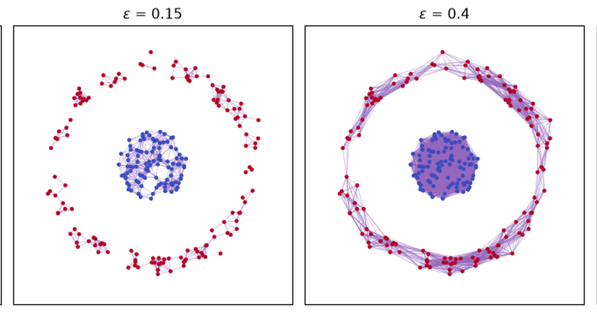

A disk inside a ring is not linearly separable in $\mathbb{R}^2$. **Persistent homology** (unsupervised) reports the annular hole. A **kernel SVM** (supervised) finds a curved decision boundary. Neither fits a curve in the plane; both lift data into a richer space.

## Toy dataset

**Data provenance** (synthetic):

- 100 points uniform inside disk radius 0.35 (class 0).
- 140 points on circle radius 1.0 + Gaussian noise $\sigma = 0.06$ (class 1).
- 240 points total; empty annulus between radii 0.35 and 1.0 = one hole by construction.
- Stands in for one class surrounding another (e.g. normal regime ringed by fault conditions).
- Same shape as `make_circles` but one filled blob inside one ring (avoids two-loop bookkeeping).

```{python}
import numpy as np
import matplotlib.pyplot as plt


def make_disk_and_ring(n_inside=100, n_ring=140, r_inside=0.35, r_ring=1.0, ring_noise=0.06, seed=7):
    rng = np.random.default_rng(seed)
    theta_in = rng.uniform(0, 2 * np.pi, n_inside)
    r_in = r_inside * np.sqrt(rng.uniform(0, 1, n_inside))
    inside = np.column_stack([r_in * np.cos(theta_in), r_in * np.sin(theta_in)])

    theta_out = rng.uniform(0, 2 * np.pi, n_ring)
    r_out = r_ring + rng.normal(0, ring_noise, n_ring)
    ring = np.column_stack([r_out * np.cos(theta_out), r_out * np.sin(theta_out)])

    X = np.vstack([inside, ring])
    y = np.concatenate([np.zeros(n_inside), np.ones(n_ring)]).astype(int)
    return X, y


X, y = make_disk_and_ring()

fig, ax = plt.subplots(figsize=(5, 5))
ax.scatter(*X[y == 0].T, s=18, color="tab:blue", label="inside (class 0)")
ax.scatter(*X[y == 1].T, s=18, color="tab:red", label="ring (class 1)")
ax.set_aspect("equal")
ax.set_title("The toy dataset: 100 points inside, 140 on a noisy ring")
ax.legend(loc="upper right", fontsize=8)
plt.show()
```

All later sections use this fixed `X`, `y`.

## Persistent homology

Labels are not used. Input: 240 points and pairwise distances.

### Vietoris-Rips filtration

Join pairs within radius $\varepsilon$; increase $\varepsilon$ from 0. Nested **simplicial complexes** $R_\varepsilon(X)$: edges, filled triangles, higher simplices. Distinguishes hollow loops from filled regions.

```{python}
from itertools import combinations


def plot_edges(points, eps, ax, colors=None):
    n = len(points)
    dists = np.linalg.norm(points[:, None] - points[None, :], axis=-1)
    for i, j in combinations(range(n), 2):
        if dists[i, j] <= eps:
            ax.plot(*zip(points[i], points[j]), color="tab:purple", lw=0.5, alpha=0.5, zorder=1)
    c = colors if colors is not None else "black"
    ax.scatter(points[:, 0], points[:, 1], s=6, zorder=2, c=c, cmap="coolwarm")
    ax.set_title(f"$\\varepsilon$ = {eps}")
    ax.set_xlim(-1.4, 1.4)
    ax.set_ylim(-1.4, 1.4)
    ax.set_aspect("equal")
    ax.set_xticks([])
    ax.set_yticks([])


fig, axes = plt.subplots(1, 4, figsize=(14, 4))
for ax, eps in zip(axes, [0.05, 0.15, 0.4, 0.8]):
    plot_edges(X, eps, ax, colors=y)
plt.tight_layout()
plt.show()
```

Betti numbers at four scales (from `ripser`, evaluated at these $\varepsilon$):

- $\varepsilon = 0.05$: $\beta_0 = 120$, $\beta_1 = 0$ — too fine.
- $\varepsilon = 0.15$: $\beta_0 = 12$, $\beta_1 = 5$ — transient micro-loops (noise).
- $\varepsilon = 0.4$: $\beta_0 = 2$, $\beta_1 = 1$ — ring loop + separate disk blob.
- $\varepsilon = 0.8$: $\beta_0 = 1$, $\beta_1 = 0$ — annulus filled; one component.

Single-scale snapshots mis-count loops; lifetime separates signal from noise.

### Persistence diagram

Each loop → (birth, death). Vertical distance from diagonal = lifetime.

```{python}
from ripser import ripser
from persim import plot_diagrams

dgms = ripser(X, maxdim=1)["dgms"]
h1 = dgms[1]
lifetimes = h1[:, 1] - h1[:, 0]
top = h1[np.argmax(lifetimes)]

fig, ax = plt.subplots(figsize=(5, 5))
plot_diagrams(dgms, ax=ax, show=False)
ax.annotate(
    "the hole\n(disk/ring gap)",
    xy=(top[0], top[1]), xytext=(top[0] - 0.15, top[1] + 0.55),
    arrowprops=dict(arrowstyle="->", color="black"), fontsize=9,
)
ax.set_title("Persistence diagram (H0 = components, H1 = loops)")
plt.show()

print(f"longest-lived H1 feature: born {top[0]:.3f}, dies {top[1]:.3f}, lifetime {lifetimes.max():.3f}")
print(f"next-longest H1 lifetime: {np.sort(lifetimes)[-2]:.3f}")
```

Longest $H_1$ lifetime ≈ 0.354 vs next-longest ≈ 0.089 (~4×). Labels never entered the computation.

## Kernel SVM

Same 240 points with labels. Task: find a class separator.

### Linear SVM failure

```{python}
from sklearn.svm import LinearSVC

linear = LinearSVC(max_iter=10000)
linear.fit(X, y)
print(f"linear SVM training accuracy: {linear.score(X, y):.2f}")
```

Training accuracy 0.58 ≈ majority-class rate (140/240 ring points). Structural: ring wraps disk; no line separates classes.

### Explicit feature lift

Map $x = (x_1, x_2) \mapsto \phi(x) = (x_1, x_2, x_1^2 + x_2^2)$. Third coordinate = squared radius; separates inner disk from outer ring.

```{python}
from mpl_toolkits.mplot3d import Axes3D  # noqa: F401
from sklearn.svm import LinearSVC

Z = np.column_stack([X[:, 0], X[:, 1], X[:, 0] ** 2 + X[:, 1] ** 2])

lifted = LinearSVC(max_iter=10000)
lifted.fit(Z, y)
print(f"linear SVM on phi(x), training accuracy: {lifted.score(Z, y):.2f}")
print(f"separating-plane coefficients (x1, x2, x1^2+x2^2): {lifted.coef_.round(3)}")

fig = plt.figure(figsize=(6, 5))
ax = fig.add_subplot(projection="3d")
ax.scatter(*Z[y == 0].T, s=12, color="tab:blue", label="inside")
ax.scatter(*Z[y == 1].T, s=12, color="tab:red", label="ring")
ax.set_xlabel("$x_1$")
ax.set_ylabel("$x_2$")
ax.set_zlabel("$x_1^2+x_2^2$")
ax.set_title(r"$\phi(x) = (x_1, x_2, x_1^2+x_2^2)$: now linearly separable")
ax.legend()
plt.show()
```

Accuracy 1.00. Dominant coefficient on $x_1^2+x_2^2$ (2.53 vs ~0.02 on $x_1, x_2$). Requires prior knowledge of radial structure.

### RBF kernel

**Kernel** $k(x, x') = \langle \phi(x), \phi(x') \rangle$ without materializing $\phi$. RBF:

$$
k(x, x') = \exp\!\left(-\gamma \lVert x - x' \rVert^2\right).
$$

Corresponds to infinite-dimensional $\phi$; SVM uses only pairwise $k(x_i, x_j)$.

```{python}
from sklearn.svm import SVC

rbf = SVC(kernel="rbf", C=1.0, gamma=2.0)
rbf.fit(X, y)
print(f"RBF-kernel SVM training accuracy: {rbf.score(X, y):.2f}")
print(f"support vectors used: {rbf.n_support_} (of {len(X)} points)")

xx, yy = np.meshgrid(np.linspace(-1.5, 1.5, 300), np.linspace(-1.5, 1.5, 300))
zz = rbf.decision_function(np.c_[xx.ravel(), yy.ravel()]).reshape(xx.shape)

fig, ax = plt.subplots(figsize=(5, 5))
ax.contourf(xx, yy, zz, levels=20, cmap="coolwarm", alpha=0.55)
ax.contour(xx, yy, zz, levels=[0], colors="black", linewidths=2)
ax.contour(xx, yy, zz, levels=[-1, 1], colors="black", linewidths=0.8, linestyles="--")
ax.scatter(*X[y == 0].T, s=16, color="tab:blue", edgecolor="k", linewidth=0.3)
ax.scatter(*X[y == 1].T, s=16, color="tab:red", edgecolor="k", linewidth=0.3)
ax.scatter(*X[rbf.support_].T, s=60, facecolors="none", edgecolors="black", linewidth=0.8, label="support vectors")
ax.set_aspect("equal")
ax.set_title("RBF-kernel SVM decision boundary")
ax.legend(loc="upper right", fontsize=8)
plt.show()
```

RBF boundary ≈ circular (matches hand-built $\phi$); 17 support vectors; no radial feature supplied.

## Method comparison

| | Persistent homology | Kernel SVM |
|---|---|---|
| Uses labels `y`? | No | Yes |
| Object of study | Whole point cloud shape | One decision surface |
| Scale | Every $\varepsilon$ in diagram | One implicit scale ($\gamma$) |
| Expanded space | Filtration $R_\varepsilon(X)$ | Implicit $\phi(X)$ |
| Output | (birth, death) pairs | $f(x) = \text{sign}(\sum_i \alpha_i y_i k(x,x_i)+b)$ |
| Hole in output | $H_1$ interval | Sign change of $f$ (unnamed) |
| Stability | Stable to small point perturbations | Boundary sensitive to support vectors |

Agreement on this dataset: class 0 inside hole, class 1 on rim → boundary and loop both ≈ circle $x_1^2+x_2^2 = r^2$, $r \in (0.35, 1.0)$.

Shuffle labels: SVM still fits training data; persistence diagram unchanged.

Persistent homology: unsupervised structure at all scales. SVM: supervised separation; undefined without labels.

## Coordinate expansion

Both methods enrich coordinates instead of fighting curvature in the input space.

**TDA**:

$$
X \;\longmapsto\; R_\varepsilon(X), \qquad \varepsilon: 0 \to \infty.
$$

Adds simplices (edges, triangles, …) across all scales; persistence diagram records the full sweep.

**Kernel SVM**:

$$
x \;\longmapsto\; \phi(x) \in \mathcal{H}, \qquad k(x, x') = \langle \phi(x), \phi(x') \rangle.
$$

Adds coordinates per point; cross-validation picks one kernel setting; only the boundary is kept.

TDA keeps multi-scale structure because shape is the answer. SVM keeps one boundary because classification is the answer.
