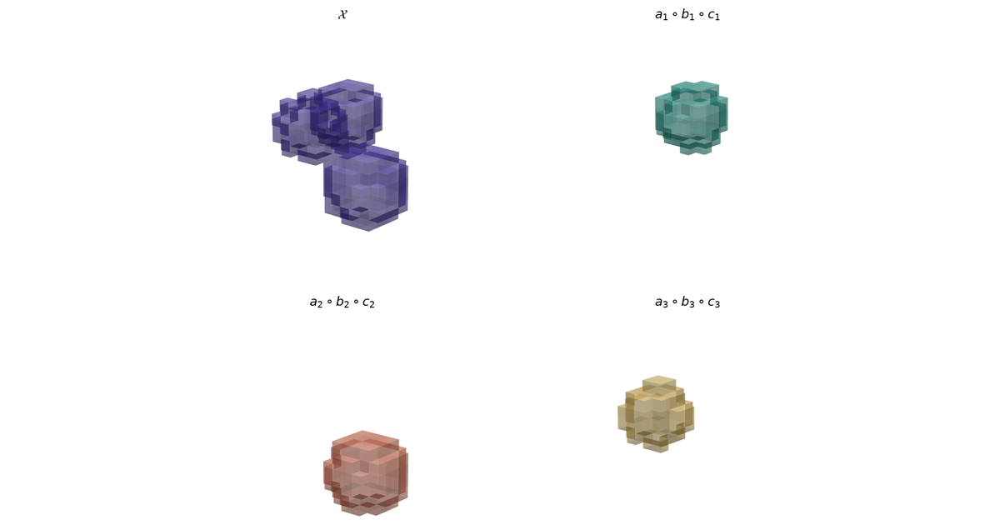

A tensor $\mathcal{X}\in\mathbb{R}^{I_1\times\cdots\times I_N}$ is an $N$-way array. The $N=2$ case is a matrix: rows and columns only.

A matrix factorization or inverse needs a matrix. The standard reduction is a **mode-$n$ unfolding** $\mathcal{X}_{(n)}\in\mathbb{R}^{I_n\times\prod_{k\neq n}I_k}$, whose columns are the mode-$n$ fibers. SVD of that unfolding is the Eckart–Young optimum for the unfolding, not for $\mathcal{X}$. The left singular vectors of $\mathcal{X}_{(1)}$ mix modes $2$ through $N$; there is no reason those vectors should be Kruskal factors, Tucker factors, or t-product singular tubes.

Kruskal uniqueness, multilinear rank, and the t-product algebra are properties of the multiway layout. They do not survive flattening. The constructions below keep the modes separate; [Matrix Factorizations as Optimization Problems](../matrix-factorizations/) is the $N=2$ case of the same questions.

## Synthetic tensor

This post uses a synthetic $12\times 12\times 12$ array.

Provenance:

- Generated as a rank-3 CP model $\sum_{r=1}^{3} a_r\circ b_r\circ c_r$ plus i.i.d. Gaussian noise, seed fixed.
- Each generating vector is a localized Gaussian bump, not measured data. The three outer products sit in different corners of the cube, so a factorization that recovers the components is visible as three blobs.
- The array stands in for a 3-way table (subject $\times$ feature $\times$ condition) whose modes should stay separate. A real table of that shape is high-dimensional and not drawable as voxels.
- The objective is to recover the known CP/Tucker structure and to invert four different products on this object, or on a square unfolding of it.
- A flattened SVD attributes variance to a mixed mode; an overspecified CP rank invents a fourth blob. Either error mis-assigns which condition drives which feature.
- Tensor methods fit because Kruskal uniqueness and mode-wise compression are properties of this layout, not of any matrix obtained from it.

```{python}
import matplotlib.pyplot as plt
import numpy as np
import tensorly as tl
from matplotlib.colors import to_rgb
from tensorly.cp_tensor import cp_to_tensor
from tensorly.decomposition import parafac, tensor_train, tucker
from tensorly.tucker_tensor import tucker_to_tensor

tl.set_backend("numpy")
np.set_printoptions(precision=3, suppress=True)
rng = np.random.default_rng(7)

ACCENT = "#4A3AA7"
TEAL = "#2A9D8F"
CORAL = "#E07A5F"
GOLD = "#E9C46A"

n = 12
t = np.linspace(-1.0, 1.0, n)
centres = [(-0.55, -0.45, 0.4), (0.15, 0.55, -0.35), (0.6, -0.2, 0.55)]
widths = [0.28, 0.32, 0.26]


def bump(center, width):
    return np.exp(-0.5 * ((t - center) / width) ** 2)


terms = []
for (ca, cb, cc), w in zip(centres, widths):
    a, b, cvec = bump(ca, w), bump(cb, w), bump(cc, w)
    terms.append(a[:, None, None] * b[None, :, None] * cvec[None, None, :])

X_clean = sum(terms)
X = X_clean + 0.08 * X_clean.std() * rng.normal(size=X_clean.shape)


def draw_voxels(ax, T, color, thresh_frac=0.18, box=12):
    mag = np.abs(T)
    peak = mag.max() + 1e-12
    filled = mag > thresh_frac * peak
    rgb = to_rgb(color)
    fc = np.zeros(T.shape + (4,))
    fc[..., 0], fc[..., 1], fc[..., 2] = rgb
    fc[..., 3] = np.where(filled, 0.25 + 0.7 * mag / peak, 0.0)
    ax.voxels(filled, facecolors=fc, edgecolor="none")
    ax.set_xlim(0, box)
    ax.set_ylim(0, box)
    ax.set_zlim(0, box)
    ax.set_box_aspect((1, 1, 1), zoom=0.88)
    ax.set_axis_off()
    ax.view_init(elev=18, azim=40)


def letterbox_cover(fig, path="cover.png", size=(1200, 630), pad=0.2):
    """Fit the figure into 1200×630 by trimming whitespace, then letterboxing."""
    import io

    from PIL import Image

    buf = io.BytesIO()
    fig.savefig(
        buf,
        dpi=160,
        bbox_inches="tight",
        pad_inches=pad,
        facecolor="white",
        format="png",
    )
    buf.seek(0)
    raw = Image.open(buf).convert("RGB")
    arr = np.asarray(raw)
    ink = (arr < 250).any(axis=2)
    rows = np.where(ink.any(axis=1))[0]
    cols = np.where(ink.any(axis=0))[0]
    if len(rows) and len(cols):
        margin = 18
        top = max(0, int(rows[0]) - margin)
        bottom = min(raw.height, int(rows[-1]) + 1 + margin)
        left = max(0, int(cols[0]) - margin)
        right = min(raw.width, int(cols[-1]) + 1 + margin)
        raw = raw.crop((left, top, right, bottom))
    width, height = size
    scale = min(width / raw.width, height / raw.height)
    new_w = max(1, round(raw.width * scale))
    new_h = max(1, round(raw.height * scale))
    raw = raw.resize((new_w, new_h), Image.Resampling.LANCZOS)
    canvas = Image.new("RGB", (width, height), (255, 255, 255))
    canvas.paste(raw, ((width - new_w) // 2, (height - new_h) // 2))
    canvas.save(path)
```

## CP decomposition

An entrywise rank-1 third-order tensor is an outer product $(a\circ b\circ c)_{ijk}=a_i b_j c_k$. CANDECOMP/PARAFAC (Hitchcock 1927; Harshman 1970; Carroll and Chang 1970) writes $\mathcal{X}$ as a sum of those:

$$
\mathcal{X}\approx[\![\lambda;A,B,C]\!]=\sum_{r=1}^{R}\lambda_r\,a_r\circ b_r\circ c_r.
$$

$A,B,C$ have $R$ columns. $\lambda\in\mathbb{R}^{R}$ absorbs a scale so that the columns of $A,B,C$ can be normalized.

- **Rank** $R$ is the smallest number of rank-1 terms. It is not the rank of any unfolding, and it can exceed $\min(I,J,K)$.
- **Storage** is $R(I+J+K)$ against $IJK$. For this $12\times 12\times 12$ array a rank-3 model stores $108$ numbers instead of $1728$.
- **Indeterminacy.** Permuting the $R$ terms does not change the sum. Rescaling $a_r\leftarrow\alpha a_r$, $b_r\leftarrow\beta b_r$ with $\alpha\beta\gamma=1$ does not either. Uniqueness is always modulo that group.
- **Kruskal uniqueness.** Let $k_A$ be the largest $k$ such that every $k$ columns of $A$ are linearly independent. If $k_A+k_B+k_C\ge 2R+2$, the factors are unique up to that group. No unfolding SVD has an analogous statement.
- **Fitting.** Alternating least squares: fix $B$ and $C$, solve a linear least-squares problem for $A$, cycle. TensorLy (Kossaifi et al. 2019) does that; Kolda and Bader (2009) survey the algebra.

If two generating vectors are collinear, or if $R$ is chosen larger than the true rank, Kruskal's condition fails and ALS can split one blob across two components.

```{python}
#| label: fig-cp
#| fig-cap: "Rank-3 CP fit on a $12\\times 12\\times 12$ cube. Purple is the noisy tensor; teal, coral, and gold are the three rank-1 outer products, each occupying a different corner."
#| fig-width: 12
#| fig-height: 6.3

cp_weights, cp_factors = parafac(X, rank=3, n_iter_max=200, init="svd")
X_cp = cp_to_tensor((cp_weights, cp_factors))
cp_rel = np.linalg.norm(X - X_cp) / np.linalg.norm(X)

rank1 = []
for r in range(3):
    a, b, cvec = (cp_factors[m][:, r] * (cp_weights[r] ** (1 / 3)) for m in range(3))
    rank1.append(a[:, None, None] * b[None, :, None] * cvec[None, None, :])

fig, axes = plt.subplots(
    1, 4, figsize=(12, 6.3), subplot_kw={"projection": "3d"}
)
panels = [(X, ACCENT, r"$\mathcal{X}$")] + list(
    zip(rank1, [TEAL, CORAL, GOLD], [rf"$a_{r}\circ b_{r}\circ c_{r}$" for r in (1, 2, 3)])
)
for ax, (vol, color, title) in zip(axes, panels):
    draw_voxels(ax, vol, color)
    ax.set_title(title, pad=8, fontsize=11)
fig.subplots_adjust(left=0.01, right=0.99, top=0.90, bottom=0.02, wspace=0.02)

# Cover: 2×2 of the same panels, letterboxed to 1200×630 so nothing is cropped.
fig_c, axes_c = plt.subplots(2, 2, figsize=(9.5, 8.2), subplot_kw={"projection": "3d"})
for ax, (vol, color, title) in zip(axes_c.ravel(), panels):
    draw_voxels(ax, vol, color)
    ax.set_title(title, pad=6, fontsize=12)
fig_c.subplots_adjust(left=0.02, right=0.98, top=0.92, bottom=0.02, wspace=0.02, hspace=0.08)
letterbox_cover(fig_c)
plt.close(fig_c)
print(f"CP relative Frobenius error: {cp_rel:.4f}")
```

The printed residual is $\|\mathcal{X}-\hat{\mathcal{X}}\|_F/\|\mathcal{X}\|_F$ for the rank-3 fit. Noise was added at $0.08$ times the clean-tensor scale, so a residual near $0.06$ is the noise floor, not a missed component. The three blobs sit in the generating corners, up to the permutation ALS is allowed.

## Tucker decomposition

Mode-$n$ multiplication by a matrix $U$ contracts one mode:

$$
(\mathcal{X}\times_n U)_{i_1\ldots j\ldots i_N}=\sum_{i_n} U_{j i_n}\,\mathcal{X}_{i_1\ldots i_n\ldots i_N}.
$$

Tucker (1966) inserts a core tensor in the middle of three such products:

$$
\mathcal{X}\approx\mathcal{G}\times_1 U\times_2 V\times_3 W.
$$

- $\mathcal{G}\in\mathbb{R}^{R_1\times R_2\times R_3}$ is $\mathcal{X}$ expressed in the factor bases $U,V,W$. A large entry $\mathcal{G}_{r_1 r_2 r_3}$ means column $r_1$ of $U$, column $r_2$ of $V$, and column $r_3$ of $W$ interact.
- **Multilinear rank** $(R_1,R_2,R_3)$ is the triple of unfolding ranks. The three numbers need not be equal.
- CP is the special case in which $\mathcal{G}$ is superdiagonal: $\mathcal{G}_{r_1 r_2 r_3}=0$ unless $r_1=r_2=r_3$. Off-superdiagonal mass is structure a CP model of the same order cannot represent.
- Storage is $R_1 R_2 R_3 + I R_1 + J R_2 + K R_3$. Factors are unique only up to invertible mixing: $U\leftarrow U M$ can be absorbed into $\mathcal{G}$. That is weaker uniqueness than Kruskal's.

```{python}
#| label: fig-tucker
#| fig-cap: "Tucker compression of the same cube. The core $\\mathcal{G}$ is $4\\times 4\\times 3$, shown in the same $12\\times 12\\times 12$ frame. Heatmaps are the factor matrices $U,V,W$."
#| fig-width: 12
#| fig-height: 6.3

tucker_rank = [4, 4, 3]
core, tucker_factors = tucker(X, rank=tucker_rank, n_iter_max=200, init="svd")
X_tucker = tucker_to_tensor((core, tucker_factors))
tucker_rel = np.linalg.norm(X - X_tucker) / np.linalg.norm(X)

G_pad = np.zeros_like(X)
r1, r2, r3 = core.shape
G_pad[:r1, :r2, :r3] = core

fig = plt.figure(figsize=(12, 6.3))
gs = fig.add_gridspec(3, 6, hspace=0.42, wspace=0.28, left=0.02, right=0.96, top=0.90, bottom=0.08)
ax_x = fig.add_subplot(gs[:, :2], projection="3d")
ax_g = fig.add_subplot(gs[:, 2:4], projection="3d")
draw_voxels(ax_x, X, ACCENT)
ax_x.set_title(r"$\mathcal{X}$", pad=8)
draw_voxels(ax_g, G_pad, TEAL)
ax_g.set_title(r"core $\mathcal{G}$ (padded)", pad=8)
for i, (factor, name) in enumerate(zip(tucker_factors, [r"$U$", r"$V$", r"$W$"])):
    ax = fig.add_subplot(gs[i, 4:])
    im = ax.imshow(factor, aspect="auto", cmap="magma")
    ax.set_ylabel(name, rotation=0, labelpad=14, va="center")
    ax.set_xticks([])
    ax.set_yticks([])
    fig.colorbar(im, ax=ax, fraction=0.046, pad=0.04)
print(f"Tucker relative Frobenius error: {tucker_rel:.4f}")
print(f"core shape: {core.shape}; |G| / |X| entries: {core.size / X.size:.3f}")
```

The printed residual is essentially the CP residual: the data *are* rank-3 CP, so a $(4,4,3)$ core has spare degrees of freedom that fit noise. The padded plot places that small core in the corner of the original box. The heatmaps are $12\times 4$, $12\times 4$, and $12\times 3$; each column is one factor vector along a mode.

## HOSVD and HOOI

Higher-order SVD (De Lathauwer, De Moor, Vandewalle 2000) builds a Tucker factorization from three independent matrix SVDs:

1. Unfold $\mathcal{X}$ along mode $n$ and compute $\mathcal{X}_{(n)}=U^{(n)}S^{(n)}(V^{(n)})^\top$.
2. Keep the leading $R_n$ left singular vectors as the factor $U^{(n)}$. Those columns are orthonormal, unlike generic Tucker factors.
3. Form the core by projecting onto those bases: $\mathcal{G}=\mathcal{X}\times_1 (U^{(1)})^\top\times_2 (U^{(2)})^\top\times_3 (U^{(3)})^\top$.

This is a truncated SVD of each unfolding. It is **not** Eckart–Young for the tensor: the three truncations are not jointly optimal, so a different choice of subspaces can give a smaller $\|\mathcal{X}-\mathcal{G}\times_1 U\times_2 V\times_3 W\|_F$ at the same $(R_1,R_2,R_3)$.

Higher-order orthogonal iteration (HOOI) closes part of that gap. For each mode in turn it unfolds the tensor after contracting the other modes with their current factors, then replaces that factor by the leading left singular vectors of the unfolding. The cycle is ALS on the Tucker objective with an orthogonality constraint.

TensorLy's `tucker(..., init="svd")` is HOSVD followed by HOOI. The call in the previous section already ran that pipeline. Truncated HOSVD alone is cheaper and often good enough as a starting point; it is not the Tucker minimizer.

## Tensor train

CP and Tucker treat every mode symmetrically. For $N\gg 3$ the core $\mathcal{G}$ of a Tucker model still has $\prod_n R_n$ entries. Tensor train (Oseledets 2011) replaces the single core by a **chain**:

$$
\mathcal{X}(i_1,\ldots,i_N)=G_1(i_1)\,G_2(i_2)\cdots G_N(i_N),
$$

with $G_n(i_n)\in\mathbb{R}^{r_{n-1}\times r_n}$ and $r_0=r_N=1$. Each $G_n$ is a 3-way array of size $r_{n-1}\times I_n\times r_n$, contracted with its neighbours along the rank bonds.

- **TT-ranks** $(r_n)$ are ranks of a chain of unfoldings that split the first $n$ modes from the rest, not a single Kruskal rank.
- **TT-SVD** computes them sequentially: unfold the first mode, truncated SVD, reshape the remainder, repeat. Each truncation is Eckart–Young for that unfolding.
- **Gauge.** $G_n(i)\leftarrow G_n(i)M$ and $G_{n+1}(j)\leftarrow M^{-1}G_{n+1}(j)$ leave the product unchanged. Cores are not unique.
- **Storage** is $O(N I r^2)$ at uniform rank $r$, linear in order $N$. That is the point for $N\gg 3$. On this order-3 cube TT is just another low-rank format; the cores below have shapes $(1,12,4)$, $(4,12,4)$, $(4,12,1)$.

```{python}
tt = tensor_train(X, rank=4)
X_tt = tt.to_tensor()
tt_rel = np.linalg.norm(X - X_tt) / np.linalg.norm(X)
print(f"TT relative Frobenius error: {tt_rel:.4f}")
print("TT core shapes:", [c.shape for c in tt.factors])
```

The residual matches CP and Tucker at this rank. The format difference would show up on an order-6 or order-8 array, where a Tucker core is infeasible and a TT chain is not.

## t-SVD

CP, Tucker, and TT are *approximations*. The t-product of Kilmer and Martin (2011) is an *algebra* on $\mathbb{R}^{n_1\times n_2\times n_3}$ in which a decomposition analogous to matrix SVD is exact.

The t-product $\mathcal{A}*\mathcal{B}$ is:

1. FFT along tubes (mode 3).
2. Ordinary matrix multiply of each pair of frontal slices.
3. Inverse FFT.

The identity tensor $\mathcal{I}$ has the matrix identity as its first frontal slice and zeros elsewhere. Orthogonal tensors satisfy $\mathcal{U}^\top * \mathcal{U}=\mathcal{I}$, where ${}^\top$ transposes each frontal slice and reverses the later ones. Under that product every third-order tensor has a t-SVD

$$
\mathcal{A}=\mathcal{U}*\mathcal{S}*\mathcal{V}^\top
$$

with orthogonal $\mathcal{U},\mathcal{V}$ and $f$-diagonal $\mathcal{S}$ (each tube $\mathcal{S}_{ii:}$ holds the singular values of the Fourier slices). **Tubal rank** is the number of nonzero singular tubes.

TensorLy has no first-class t-SVD. The residual below is numpy, computed slicewise in the Fourier domain, which is the definition.

```{python}
A = rng.normal(size=(8, 8, 5))
A_hat = np.fft.fft(A, axis=-1)
recon_hat = np.empty_like(A_hat)
for i in range(A.shape[-1]):
    U, s, Vt = np.linalg.svd(A_hat[:, :, i], full_matrices=False)
    recon_hat[:, :, i] = (U * s) @ Vt
A_recon = np.fft.ifft(recon_hat, axis=-1).real
print(f"t-SVD reconstruction residual: {np.linalg.norm(A - A_recon):.2e}")
```

The residual is rounding error because the t-SVD is an exact factorization, not a truncation. Truncating singular tubes is the analogue of truncated SVD; that step is optional and is not run here.

## Factorization comparison

| Factorization | Rank notion | Uniqueness | Storage | Associated inverse |
|---|---|---|---|---|
| CP | Kruskal $R$ | Kruskal condition, up to perm/scale | $R\sum_n I_n$ | none canonical |
| Tucker | multilinear $(R_n)$ | factors up to invertible mix | $\|\mathcal{G}\|+\sum_n I_n R_n$ | mode-$n$ pinv of factors |
| HOSVD | truncated multilinear | orthogonal factors; not ALS-optimal | same as Tucker | $(U^{(n)})^\top$ is the mode-$n$ inverse |
| TT | TT-ranks $(r_n)$ | gauge freedom on cores | $O(N I r^2)$ | TT-inverse when cores are square |
| t-SVD | tubal rank | unique under $*$ (as matrix SVD) | dense unless truncated | t-inverse of Fourier slices |

Pick the factorization for the rank notion you need, then pick the inverse for the product that factorization lives in. The two choices are independent: a CP model does not come with a t-inverse.

## Tensor inverses

A matrix inverse is the inverse of matrix multiplication. A tensor has no such default product, so it has no default inverse. Each product below induces its own inverse. They are not interchangeable, and none is "the" tensor inverse.

### Mode-$n$ pseudoinverse

Unfold mode $n$, take the matrix Moore–Penrose inverse, fold. If $\mathcal{Y}=\mathcal{X}\times_n A$, the unfolding identity is $Y_{(n)}=A\,X_{(n)}$, so

$$
A=Y_{(n)}X_{(n)}^{\dagger}
$$

whenever $X_{(n)}$ has full row rank. This is ordinary linear regression along one mode, with the other modes stacked as samples.

It inverts a mode-$n$ product. It does not invert a tensor as an operator on tensors. Use it to recover a mixing matrix, a change of basis, or a compression map $U^{(n)}$ from a Tucker/HOSVD factor.

### t-inverse

Invert every Fourier frontal slice, then invert the FFT. If every slice is invertible,

$$
\mathcal{A}*\mathcal{A}^{-1}=\mathcal{I}.
$$

Singular slices yield a t-pseudoinverse by replacing `inv` with `pinv` on those slices; tubal rank then plays the role of matrix rank. This is the inverse that belongs with t-SVD. Third-order arrays whose third mode is time or a frequency grid (video, some fMRI layouts) are the usual setting.

### Einstein product inverse

The Einstein product of two even-order tensors contracts $N$ matching indices. A tensor $\mathcal{A}\in\mathbb{R}^{I_1\times\cdots\times I_N\times I_1\times\cdots\times I_N}$ is isomorphic to a matrix of size $\bigl(\prod_k I_k\bigr)^2$: reshape, invert, reshape (Brazell, Li, Navasca, Tamon 2013). Existence is exactly invertibility of that unfolding.

The product is the one that appears in discretizations of linear maps on tensor product spaces. A $3\times 3\times 3\times 3$ tensor is a linear map $\mathbb{R}^{3\times 3}\to\mathbb{R}^{3\times 3}$; its Einstein inverse is the inverse map, not a mode-$n$ pinv and not a t-inverse.

### Multilinear Moore–Penrose inverse

When the Einstein unfolding is rectangular or rank-deficient, replace `inv` by `pinv`. The result is the unique tensor satisfying the four Penrose identities for the Einstein product:

$$
\begin{aligned}
\mathcal{A}\circledast\mathcal{A}^{\dagger}\circledast\mathcal{A}&=\mathcal{A},\\
\mathcal{A}^{\dagger}\circledast\mathcal{A}\circledast\mathcal{A}^{\dagger}&=\mathcal{A}^{\dagger},\\
(\mathcal{A}\circledast\mathcal{A}^{\dagger})^{\ast}&=\mathcal{A}\circledast\mathcal{A}^{\dagger},\\
(\mathcal{A}^{\dagger}\circledast\mathcal{A})^{\ast}&=\mathcal{A}^{\dagger}\circledast\mathcal{A}.
\end{aligned}
$$

At order $2$ this is the matrix Moore–Penrose inverse. The last cell checks the first identity on a $3\times 3\times 2\times 3$ tensor.

```{python}
A_true = rng.normal(size=(8, n))
Y = tl.tenalg.mode_dot(X, A_true, 0)
A_hat = tl.unfold(Y, 0) @ np.linalg.pinv(tl.unfold(X, 0))
mode_rel = np.linalg.norm(A_hat - A_true) / np.linalg.norm(A_true)

B = rng.normal(size=(6, 6, 4))
B += np.eye(6)[:, :, None]
B_hat = np.fft.fft(B, axis=-1)
inv_hat = np.empty_like(B_hat)
for i in range(B.shape[-1]):
    inv_hat[:, :, i] = np.linalg.inv(B_hat[:, :, i])
B_inv = np.fft.ifft(inv_hat, axis=-1).real
I_t = np.zeros_like(B)
I_t[np.arange(6), np.arange(6), 0] = 1.0
prod_hat = np.empty_like(B_hat)
Binv_hat = np.fft.fft(B_inv, axis=-1)
for i in range(B.shape[-1]):
    prod_hat[:, :, i] = B_hat[:, :, i] @ Binv_hat[:, :, i]
B_prod = np.fft.ifft(prod_hat, axis=-1).real
tinv_rel = np.linalg.norm(B_prod - I_t)

M = rng.normal(size=(9, 9))
M += 4.0 * np.eye(9)
T4 = M.reshape(3, 3, 3, 3)
T4_inv = np.linalg.inv(M).reshape(3, 3, 3, 3)
einstein_id = np.tensordot(T4, T4_inv, axes=([2, 3], [0, 1]))
einstein_rel = np.linalg.norm(einstein_id - np.eye(9).reshape(3, 3, 3, 3))

M_fat = rng.normal(size=(9, 6))
T_rect = M_fat.reshape(3, 3, 2, 3)
T_mp = np.linalg.pinv(M_fat).reshape(2, 3, 3, 3)
mp_id = np.tensordot(T_rect, T_mp, axes=([2, 3], [0, 1]))
penrose = np.tensordot(mp_id, T_rect, axes=([2, 3], [0, 1]))
mp_rel = np.linalg.norm(penrose - T_rect)

print(f"mode-0 pinv relative error: {mode_rel:.2e}")
print(f"t-inverse residual ||A*A^{{-1}} - I||: {tinv_rel:.2e}")
print(f"Einstein inverse residual: {einstein_rel:.2e}")
print(f"multilinear M-P Penrose residual: {mp_rel:.2e}")
```

The four residuals are at rounding error (mode-$n$, Einstein, M-P) or at the Fourier inversion tolerance (t-inverse). Each number certifies a different product. Matching the residual to the wrong product is a type error, not a numerical one.

Tensors. Outrun. Matrices. Factorizations. Compress. Inverses. Require. Products. Choose. First.

## References

- Hitchcock (1927) — the polyadic form that became CP.
- Harshman (1970); Carroll and Chang (1970) — PARAFAC / CANDECOMP.
- Tucker (1966) — three-mode factor analysis.
- De Lathauwer, De Moor, Vandewalle (2000) — HOSVD.
- Kolda and Bader (2009), *SIAM Review* — tensor decompositions and applications.
- Oseledets (2011) — tensor train.
- Kilmer and Martin (2011) — t-product and t-SVD.
- Brazell, Li, Navasca, Tamon (2013) — Einstein product inverse.
- Kossaifi et al. (2019), *JMLR* — [TensorLy](https://tensorly.org/).
- [Matrix Factorizations as Optimization Problems](../matrix-factorizations/) — the $N=2$ case.
