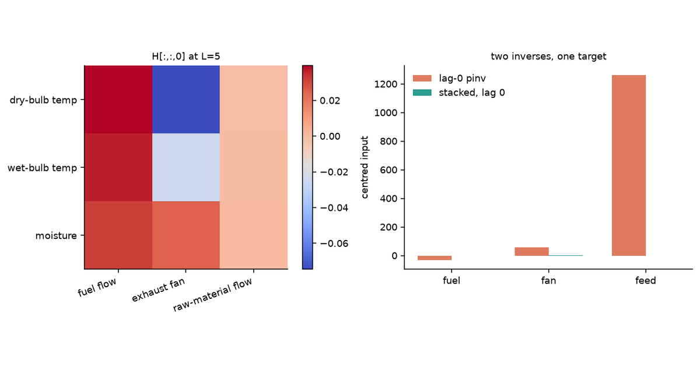
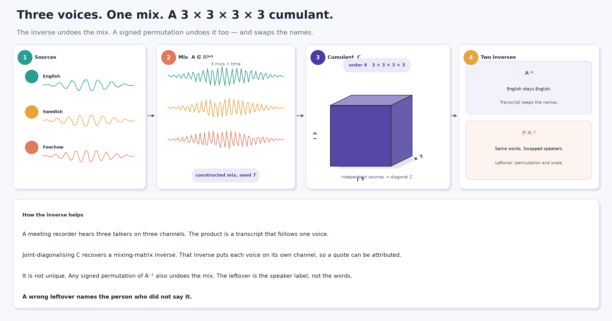
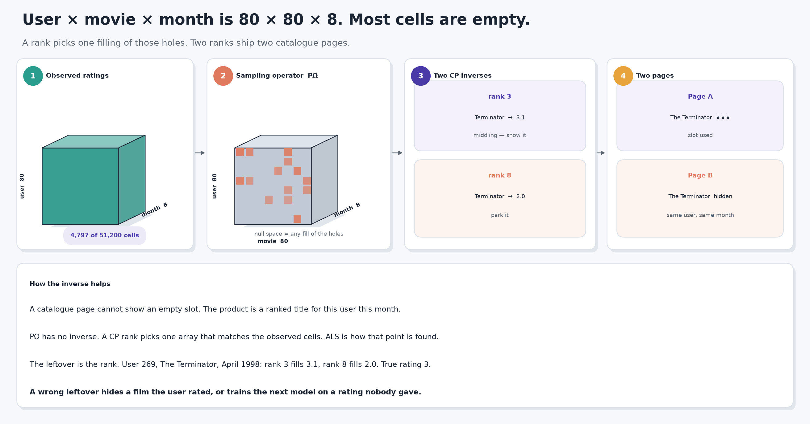
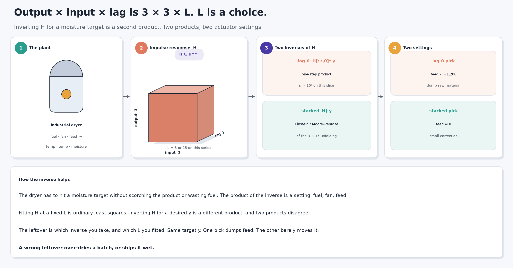

You already undo a mixed recording, fill a blank rating, and pick plant settings from a desired output. For a square, full-rank matrix those three jobs share one inverse. A tensor does not. You pick a product, then extra structure, and a leftover still remains — permutation and scale, a rank, a lag.

A meeting transcript, a recommendation, and a dryer batch each hang on which leftover you keep.

[Tensor Factorizations and Tensor Inverses](../tensor-factorizations/) has the algebra. [Uses of Tensor Factorizations](../uses-of-tensor-factorizations/) has the compression case. [Tensor Inverses in Practice](../tensor-inverses-in-practice/) works four other problems and lists the products. This post takes three more — unmixing speech, filling missing ratings, identifying a dryer — and shows that even after you pick a product, the inverse is not unique.

## Words used here

Mode, flatten, rank, null space, inverse, and pseudoinverse are defined in [Tensor Inverses in Practice](../tensor-inverses-in-practice/). Four more words appear below.

- **Cumulant.** A moment of the data with the Gaussian part subtracted. The fourth-order cumulant of a vector is a $n\times n\times n\times n$ tensor. Independent non-Gaussian sources make that tensor diagonal.
- **Joint diagonalization.** One orthogonal change of basis that makes several matrices as diagonal as they can be at once. JADE does this to the slices of the cumulant.
- **Sampling operator.** The map that keeps the observed cells of an array and throws the rest away. Its null space is every array that is zero on those cells.
- **Impulse-response tensor.** For a linear plant, $H_{ijk}$ is how output $i$ responds to input $j$ at lag $k$.

```{python}
#| label: setup
#| echo: false
import sys
from pathlib import Path

import matplotlib.pyplot as plt
import numpy as np

sys.path.insert(0, "src")
import complete as K
import cumulant as C
import make_posters as P
import mimo as M

P.write_all(Path("media"))

plt.rcParams.update(
    {
        "figure.dpi": 140,
        "savefig.dpi": 140,
        "font.size": 9,
        "axes.titlesize": 9,
        "axes.spines.top": False,
        "axes.spines.right": False,
    }
)
INK, PURPLE, TEAL, CORAL, GOLD = "#1F2430", "#4A3AA7", "#2A9D8F", "#E07A5F", "#E8A33D"
DATA = Path("data")
```

## Why the inverse is not unique

A matrix inverse undoes matrix multiplication. There is one matrix product, so there is one inverse when the matrix is square and full rank.

A tensor has several products. Each product has its own inverse. That is the algebra in the earlier posts. This post is about the leftover that stays after you pick one.

- **Independence.** The mixing matrix is recoverable only up to permutation and scale, and only if the sources are independent with at most one Gaussian. Two signed permutations of $A^{-1}$ both undo the mix. They are different matrices.
- **Missing entries.** The sampling operator has a huge null space. Infinitely many arrays match the observed ratings. Rank and the ALS start pick one filling. Two ranks fill the same hole with two numbers.
- **MIMO identification.** Input-output data underdetermines a full parameter tensor. A lag length picks one impulse-response tensor. Inverting that tensor for a control input is a second, different inverse. Two products, two settings.

In real work you solve, you do not invert. That line is already in [Tensor Inverses in Practice](../tensor-inverses-in-practice/). This post builds the inverse anyway, so you can see the leftover.

## Data

Three sources. Two are downloaded. The speech mix is constructed from real recordings, so the recovery can be scored.

### Three voices, one mix

- **What it is.** Four seconds each of three Wikimedia recordings of Aesop's *The North Wind and the Sun*: [British English, Received Pronunciation](https://commons.wikimedia.org/wiki/File:Recording_of_speaker_of_British_English_(Received_Pronunciation).ogg) (P. Roach / International Phonetic Association, CC BY-SA 3.0), [Swedish](https://commons.wikimedia.org/wiki/File:Sv-The_North_Wind_and_the_Sun.ogg), and [Foochow](https://commons.wikimedia.org/wiki/File:Cdo_northwind_sun_04.ogg) (GnuDoyng, public domain). Resampled to 8 kHz mono.
- **Who recorded them and why.** Phonetic archives keep this fable so accents can be compared. The recordings were not made for unmixing.
- **What this post asks of them.** Mix the three tracks with a known $3\times 3$ matrix (seed 7) and try to get the voices back. The mix is constructed. The waveforms are not.
- **The business problem.** A meeting recorder, a hearing aid, or a call centre hears several talkers on one microphone. The product is a transcript, a boosted voice, or a compliance log that follows one speaker.
- **What solving buys.** Each voice comes back on its own channel. A transcript can attribute a sentence. A hearing aid can raise one talker and lower the others.
- **What a wrong inverse costs.** Words land on the wrong speaker. A quote in minutes, a medical note, or a legal record names the person who did not say it.
- **Why a tensor inverse.** The fourth-order cumulant of the mix is a $3\times 3\times 3\times 3$ tensor. Independent non-Gaussian sources make it diagonal. Inverting that structure is how you recover the mixing matrix. The inverse is unique only up to permutation and scale.

The three sources, then the three mixed channels.

**English (RP)**

<audio controls src="media/source-0.wav"></audio>

**Swedish**

<audio controls src="media/source-1.wav"></audio>

**Foochow**

<audio controls src="media/source-2.wav"></audio>

**Mixed channel 1**

<audio controls src="media/mix-0.wav"></audio>

**Mixed channel 2**

<audio controls src="media/mix-1.wav"></audio>

**Mixed channel 3**

<audio controls src="media/mix-2.wav"></audio>

```{python}
#| label: speech-load
sp = np.load(DATA / "speech.npz", allow_pickle=True)
sources, mixed, A = sp["sources"], sp["mixed"], sp["mix_matrix"].astype(float)
rate = int(sp["rate"])
print(f"{sources.shape[1] / rate:.1f} s at {rate} Hz, mix condition number {np.linalg.cond(A):.2f}")
print("labels:")
for lab in sp["labels"]:
    print(f"  {lab}")
```

```{python}
#| label: fig-speech
#| fig-cap: "Three source waveforms (teal) and the three mixed channels (coral). The mix is a known 3 × 3 applied at every sample."
#| fig-width: 10
#| fig-height: 5.2
t = np.arange(sources.shape[1]) / rate
fig, axes = plt.subplots(3, 2, figsize=(10, 5.2), sharex=True)
for i in range(3):
    axes[i, 0].plot(t, sources[i], color=TEAL, lw=0.6)
    axes[i, 1].plot(t, mixed[i], color=CORAL, lw=0.6)
    axes[i, 0].set_ylabel(f"src {i+1}")
    axes[i, 1].set_ylabel(f"mic {i+1}")
axes[0, 0].set_title("Sources")
axes[0, 1].set_title("Mix")
axes[-1, 0].set_xlabel("time (s)")
axes[-1, 1].set_xlabel("time (s)")
fig.tight_layout()
plt.show()
```

### MovieLens 100K

- **Provenance.** The [MovieLens 100K](https://grouplens.org/datasets/movielens/100k/) ratings dump from GroupLens Research at the University of Minnesota (Harper and Konstan 2015). 100,000 ratings, 943 users, 1,682 movies, 19 September 1997 to 22 April 1998.
- **Collector and motive.** Students in a recommender-systems class, plus visitors to the MovieLens site, rated films so the lab could study collaborative filtering. These are ratings, not watches.
- **What this post uses.** The 80 most-active users and the 80 most-rated movies, binned by calendar month. A cell is the mean rating of that user for that movie in that month, or missing. `src/fetch_data.py` writes `data/movielens.npz`. A render never downloads the zip. The crop is $80\times 80\times 8$ with 4,797 observed cells — about 9% of the array.
- **The business problem.** A catalogue page cannot show an empty slot. The product is a ranked list: which title to put in front of this user this month.
- **What solving buys.** A held-out rating is filled, so a title the user would like is not buried. Inventory and attention go to that title.
- **What a wrong inverse costs.** Rank 3 and rank 8 fill the same hole with different numbers. One number says "show *The Terminator*". The other says "do not". A bad fill wastes a slot and trains the next model on a rating nobody gave.
- **Why a tensor method.** User, movie, and month are three modes. Flattening to user $\times$ movie throws the month away. A rating in October is not a rating in April.

```{python}
#| label: ml-load
ml = np.load(DATA / "movielens.npz", allow_pickle=True)
ratings = ml["ratings"]
obs = np.isfinite(ratings)
print(
    f"crop {ratings.shape}, {int(obs.sum())} observed cells "
    f"({100 * obs.mean():.1f}%), months {list(ml['months'])}"
)
print("first titles:", ", ".join(str(t) for t in ml["titles"][:5]))
```

```{python}
#| label: fig-ratings
#| fig-cap: "Mean rating by user and movie in 1997-11. White is missing. Most of the month is empty; that emptiness is the sampling operator."
#| fig-width: 7
#| fig-height: 5.4
nov = list(ml["months"]).index("1997-11")
panel = ratings[:, :, nov]
fig, ax = plt.subplots(figsize=(7, 5.4))
im = ax.imshow(panel, cmap="magma", vmin=1, vmax=5, aspect="auto")
ax.set_xlabel("movie (most-rated first)")
ax.set_ylabel("user (most-active first)")
ax.set_title("1997-11")
fig.colorbar(im, ax=ax, fraction=0.046, label="mean rating")
fig.tight_layout()
plt.show()
```

### An industrial dryer

- **Provenance.** DaISy dataset [96-016](https://ftp.esat.kuleuven.be/pub/SISTA/data/process_industry/dryer2.txt), "Data from an industrial dryer (supplied by Cambridge Control Ltd)", contributed by Jan Maciejowski. 867 samples at 10 s. Three inputs: fuel flow, hot-gas exhaust fan speed, raw-material flow. Three outputs: dry-bulb temperature, wet-bulb temperature, moisture of the raw material.
- **Collector and motive.** Cambridge Control recorded a working dryer so multivariable identification methods could be compared on one plant (Maciejowski 1996; Chou and Maciejowski 1997). De Moor hosts the file in [DaISy](https://homes.esat.kuleuven.be/~smc/daisy/).
- **What this post uses.** The six series, centred. `data/dryer.npz` is committed. A render never hits the KU Leuven host.
- **The business problem.** The dryer has to hit a moisture target without scorching the product or wasting fuel. The product of the inverse is a set of actuator settings: fuel, fan, feed.
- **What solving buys.** You can ask "what input window gives this moisture and these temperatures?" and get a number you can put on the plant.
- **What a wrong inverse costs.** One inverse of the fitted tensor asks for a small change in feed. Another, on the same target, asks for a thousand-unit dump. A wrong pick over-dries a batch, or ships it wet.
- **Why a tensor inverse.** The plant map is output $\times$ input $\times$ lag. That is three physical modes. Flattening them into one matrix hides which inverse you took.

```{python}
#| label: dryer-load
dr = np.load(DATA / "dryer.npz", allow_pickle=True)
U_raw, Y_raw = dr["U"].astype(float), dr["Y"].astype(float)
U = U_raw - U_raw.mean(axis=0)
Y = Y_raw - Y_raw.mean(axis=0)
dt = float(dr["dt"])
print(dr["cite"])
print(f"{len(U)} samples at {dt:.0f} s, inputs {list(dr['inputs'])}, outputs {list(dr['outputs'])}")
```

```{python}
#| label: fig-dryer
#| fig-cap: "Centred dryer inputs (teal) and outputs (coral). Fuel, fan, and feed on the left; dry-bulb, wet-bulb, and moisture on the right."
#| fig-width: 10
#| fig-height: 5.2
tt = np.arange(len(U)) * dt / 60.0
fig, axes = plt.subplots(3, 2, figsize=(10, 5.2), sharex=True)
for i in range(3):
    axes[i, 0].plot(tt, U[:, i], color=TEAL, lw=0.7)
    axes[i, 1].plot(tt, Y[:, i], color=CORAL, lw=0.7)
    axes[i, 0].set_ylabel(str(dr["inputs"][i]))
    axes[i, 1].set_ylabel(str(dr["outputs"][i]))
axes[-1, 0].set_xlabel("minutes")
axes[-1, 1].set_xlabel("minutes")
fig.tight_layout()
plt.show()
```

## Independence

**Who does this.** A speech engineer pulling one talker out of a meeting recording.

::: {.column-page}
{#fig-poster-speech fig-alt="Poster in four numbered stages plus a footer. One: English, Swedish, and Foochow source waveforms. Two: a constructed 3 by 3 mix, three microphone channels. Three: an isometric cube labelled order 4, 3 by 3 by 3 by 3, the cumulant C. Four: two cards, A inverse keeps English as English, signed-permutation inverse swaps speakers. Footer: the inverse puts each voice on its own channel so a transcript can attribute a quote; a leftover permutation names the wrong speaker."}
:::

The fourth-order cumulant of a centred, whitened recording $Z$ is

$$
C_{ijkl}=\mathbb{E}[z_i z_j z_k z_l]-\delta_{ij}\delta_{kl}-\delta_{ik}\delta_{jl}-\delta_{il}\delta_{jk}.
$$

Independent non-Gaussian sources make $C$ diagonal. A mixing matrix $A$ rotates those axes. Recovering $A^{-1}$ is a joint diagonalization of the slices of $C$. Any signed permutation of $A^{-1}$ diagonalizes $C$ as well. That leftover is the inverse that is not unique.

The mix here is constructed, so $A^{-1}$ is known. Two inverses, then a third that only inverts the covariance.

```{python}
#| label: ica-inverses
Ainv = np.linalg.inv(A)
perm = np.array([1, 2, 0])
signs = np.array([1.0, -1.0, 1.0])
Ainv_perm = C.signed_perm(Ainv, perm, signs)
rec_true = Ainv @ mixed
rec_perm = Ainv_perm @ mixed
rec_pca = C.pca_sources(mixed)
rec_ica, _ = C.fastica(mixed)

def report(name, rec):
    sir = C.sir_db(rec, sources)
    print(f"{name:<18} SIR dB  {sir[0]:5.1f} {sir[1]:5.1f} {sir[2]:5.1f}   mean {sir.mean():4.1f}")

report("A inverse", rec_true)
report("signed perm", rec_perm)
report("PCA / whiten", rec_pca)
report("FastICA", rec_ica)

Cz = C.fourth_cumulant(C.whiten(mixed)[0])
Cs = C.fourth_cumulant(C.whiten(sources)[0])
print(f"cumulant {Cz.shape}")
print(f"off-diagonal energy  sources {C.offdiag_energy(Cs):.3f}   mix {C.offdiag_energy(Cz):.3f}")
print("A inverse and the signed permutation are different matrices: "
      f"||W1 - W2|| / ||W1|| = {np.linalg.norm(Ainv - Ainv_perm) / np.linalg.norm(Ainv):.2f}")
```

$A^{-1}$ and $P A^{-1}$ both recover the three voices. Mean SIR is high because the mix is known. They are not the same matrix: relative Frobenius difference $1.47$. The leftover is a permutation and two sign flips. A transcript that uses the second inverse swaps speakers and flips a polarity. The words are the same. The names are not.

PCA inverts the covariance, not the cumulant. Whitening is a second-order inverse. The leftover rotation stays. FastICA picks one rotation from the fourth-order structure. On four seconds of real speech it is a finite-sample pick, not the true $A^{-1}$.

```{python}
#| label: fig-ica
#| fig-cap: "Source 1 against two recoveries. Teal is the English track. Gold is A inverse. Coral is the signed permutation, which has moved this voice to another channel and flipped its sign."
#| fig-width: 10
#| fig-height: 3.6
t = np.arange(sources.shape[1]) / rate
# After the signed permutation, English (row 0) lives on recovered row 2 with a plus sign.
fig, axes = plt.subplots(3, 1, figsize=(10, 3.6), sharex=True)
axes[0].plot(t, sources[0], color=TEAL, lw=0.7)
axes[0].set_ylabel("source 1")
axes[1].plot(t, rec_true[0], color=GOLD, lw=0.7)
axes[1].set_ylabel("A inverse")
axes[2].plot(t, rec_perm[2], color=CORAL, lw=0.7)
axes[2].set_ylabel("signed perm")
axes[-1].set_xlabel("time (s)")
fig.tight_layout()
plt.show()
```

The coral trace is the English voice, recovered by the second inverse, on a different channel and with the opposite sign. Both inverses solved the mix. Only one of them keeps the speaker labels.

## Completion

**Who does this.** A recommender filling a catalogue cell so a page is not empty.

::: {.column-page}
{#fig-poster-ratings fig-alt="Poster in four numbered stages plus a footer. One: isometric cube user 80 by movie 80 by month 8, 4,797 of 51,200 cells observed. Two: the same cube as a sampling operator, holes in the null space. Three: two CP inverses, rank 3 says Terminator 3.1 show it, rank 8 says 2.0 park it. Four: two catalogue pages, one uses the slot, one hides the film. Footer: a rank picks one filling of the holes; a wrong leftover hides a film the user rated."}
:::

The sampling operator $\mathcal{P}_\Omega$ keeps the observed cells and throws the rest away. Its null space is every $80\times 80\times 8$ array that is zero on $\Omega$. No inverse of $\mathcal{P}_\Omega$ exists. A rank-$R$ CP model picks one point in that affine space. ALS is how the point is found. The rank is a choice. The start is a choice. Both change the filling.

Hold out 20% of the observed cells (seed 7). Complete from the rest at rank 3 and at rank 8. Flatten to user $\times$ movie, fill with a rank-3 SVD, and repeat that matrix across months.

```{python}
#| label: complete-fit
train = K.holdout(obs, frac=0.2, seed=7)
held = obs & ~train
X = np.where(obs, ratings, 0.0)
fill3 = K.cp_complete(X, train, rank=3, seed=7)
fill8 = K.cp_complete(X, train, rank=8, seed=7)
flat = K.flatten_svd_complete(X, train, rank=3)
print(f"train {int(train.sum())} cells, held out {int(held.sum())}")
print(f"RMSE rank 3   {K.rmse(fill3, ratings, held):.3f}")
print(f"RMSE rank 8   {K.rmse(fill8, ratings, held):.3f}")
print(f"RMSE flatten  {K.rmse(flat, ratings, held):.3f}")
print(f"mean |rank3 - rank8| on held cells {np.mean(np.abs(fill3[held] - fill8[held])):.3f}")
```

On this crop the flattened SVD is slightly better on RMSE. That is not a win for flattening as a method. It is a warning that RMSE on a 9% observed tensor is a weak score. The two CP ranks still disagree on the held cells by about 0.2 stars on average. The hole that disagrees most is the one a catalogue page would have to act on.

```{python}
#| label: complete-hole
diff = np.abs(fill3 - fill8)
diff[~held] = 0.0
i, j, k = np.unravel_index(int(np.argmax(diff)), diff.shape)
print(
    f"user {int(ml['users'][i])}, {ml['titles'][j]}, {ml['months'][k]}: "
    f"true {ratings[i, j, k]:.1f}, rank 3 {fill3[i, j, k]:.2f}, "
    f"rank 8 {fill8[i, j, k]:.2f}, flatten {flat[i, j, k]:.2f}"
)
```

User 269, *The Terminator* (1984), April 1998. The true rating is 3. Rank 3 fills 3.1 — a middling title, showable. Rank 8 fills 2.0 — park it. The flatten, which has no month, fills one number for every month of that user-movie pair. A ranking that uses rank 8 hides a film the user rated 3. A ranking that uses rank 3 shows it. Both ranks solved the same incomplete tensor. They shipped two different pages.

```{python}
#| label: fig-complete
#| fig-cap: "Held-out cells for one month. Left: rank-3 fill. Right: rank-8 fill minus rank-3 fill. The right panel is the leftover. It is not noise: it is the part of the inverse that the rank chose."
#| fig-width: 10
#| fig-height: 4.6
month = k
show = np.where(held[:, :, month], fill3[:, :, month], np.nan)
delta = np.where(held[:, :, month], fill8[:, :, month] - fill3[:, :, month], np.nan)
fig, axes = plt.subplots(1, 2, figsize=(10, 4.6))
im0 = axes[0].imshow(show, cmap="magma", vmin=1, vmax=5, aspect="auto")
im1 = axes[1].imshow(delta, cmap="coolwarm", vmin=-1.5, vmax=1.5, aspect="auto")
axes[0].set_title(f"rank 3 fill, {ml['months'][month]}")
axes[1].set_title("rank 8 minus rank 3")
for ax in axes:
    ax.set_xlabel("movie")
    ax.set_ylabel("user")
fig.colorbar(im0, ax=axes[0], fraction=0.046, label="rating")
fig.colorbar(im1, ax=axes[1], fraction=0.046, label="stars")
fig.tight_layout()
plt.show()
```

## Identification

**Who does this.** A control engineer setting fuel, fan, and feed on a dryer so moisture hits a target.

::: {.column-page}
{#fig-poster-dryer fig-alt="Poster in four numbered stages plus a footer. One: drawn dryer, fuel fan feed in, two temperatures and moisture out. Two: isometric cube H, output 3 by input 3 by lag L, L is 5 or 15. Three: two inverses, lag-0 slice pseudoinverse versus stacked Einstein Moore-Penrose. Four: two settings, feed about plus 1,200 versus feed about 0. Footer: inverting H for a desired y is a second product; a wrong leftover over-dries a batch or ships it wet."}
:::

A linear MIMO plant is

$$
y(t)=\sum_{k=0}^{L-1} H_{:,:,k}\,u(t-k).
$$

$H$ is output $\times$ input $\times$ lag. Fitting $H$ is least squares on a lagged design. That solve is unique for a fixed $L$ when the design has full rank. $L$ is not unique. Inverting $H$ for a control input is a different product, and two products disagree.

Fit $L=5$ and $L=15$ on the centred dryer. Then invert the $L=5$ tensor two ways, on a target taken from the model so the arithmetic is consistent.

```{python}
#| label: mimo-fit
H5 = M.fit_fir(U, Y, n_lags=5)
H15 = M.fit_fir(U, Y, n_lags=15)
Yhat = M.predict(H5, U)
t_star = 200
y_star = Yhat[t_star]
u0 = M.invert_lag0(H5, y_star)
u_st = M.invert_stacked(H5, y_star)
u0_15 = M.invert_lag0(H15, y_star)
print(f"fit RMSE   L=5 {M.fit_rmse(H5, U, Y):.3f}   L=15 {M.fit_rmse(H15, U, Y):.3f}")
print(f"cond(H[:,:,0])  L=5 {np.linalg.cond(H5[:, :, 0]):.0f}   L=15 {np.linalg.cond(H15[:, :, 0]):.0f}")
print(f"target y (centred) {np.array2string(y_star, precision=3)}")
print(f"lag-0 inverse, L=5   {np.array2string(u0, precision=2)}")
print(f"stacked inverse, L=5 {np.array2string(u_st[:3], precision=2)}  (lag 0 of the window)")
print(f"lag-0 inverse, L=15  {np.array2string(u0_15, precision=2)}")
print(f"||u0(L=5) - stacked lag0|| {np.linalg.norm(u0 - u_st[:3]):.1f}")
print(f"||u0(L=5) - u0(L=15)||     {np.linalg.norm(u0 - u0_15):.1f}")
print(f"lag-0 reconstructs y  {np.array2string(H5[:, :, 0] @ u0, precision=3)}")
print(f"stacked reconstructs  {np.array2string(M.apply_window(H5, u_st), precision=3)}")
```

$L=15$ fits the training series a little better than $L=5$. Both are plausible plants. Their lag-0 inverses, asked for the same $y$, disagree by thousands of raw-material units.

The $L=5$ lag-0 slice has condition number about $10^3$. Its inverse reconstructs $y$ and asks for a huge feed. The stacked inverse of the same $H$ asks for a small window. One inverse is a one-step product, $H_{:,:,0}^\dagger y$. The other is the Einstein / Moore–Penrose inverse of the unfolding $H\in\mathbb{R}^{3\times(3\cdot 5)}$. Both are legitimate inverses of $H$. They are different control moves.

A dryer that takes the lag-0 number dumps feed. A dryer that takes the stacked number makes a small correction. The moisture target was the same.

```{python}
#| label: fig-mimo
#| fig-cap: "Lag-0 slice of H at L=5, and the two control inputs it produces for one target. The stacked window is drawn at lag 0 only, so the two bars are the same three actuators."
#| fig-width: 10
#| fig-height: 3.8
fig, axes = plt.subplots(1, 2, figsize=(10, 3.8))
im = axes[0].imshow(H5[:, :, 0], cmap="coolwarm")
axes[0].set_xticks(range(3), list(dr["inputs"]), rotation=20, ha="right")
axes[0].set_yticks(range(3), list(dr["outputs"]))
axes[0].set_title("H[:,:,0] at L=5")
fig.colorbar(im, ax=axes[0], fraction=0.046)
labs = ["fuel", "fan", "feed"]
x = np.arange(3)
w = 0.35
axes[1].bar(x - w / 2, u0, width=w, color=CORAL, label="lag-0 pinv")
axes[1].bar(x + w / 2, u_st[:3], width=w, color=TEAL, label="stacked, lag 0")
axes[1].set_xticks(x, labs)
axes[1].set_ylabel("centred input")
axes[1].legend(frameon=False)
axes[1].set_title("two inverses, one target")
fig.tight_layout()
plt.show()
```

The coral bars are the one-step inverse. The teal bars are the stacked inverse, lag 0. The feed bars do not fit on the same scale by accident. That gap is the leftover.

## Side by side

Every number below was computed by a cell above.

| Problem | Extra structure | What is unique | What is not | What flattening costs |
|---|---|---|---|---|
| Speech mix | independence, at most one Gaussian | the sources, up to permutation and scale | which signed permutation you keep; FastICA's finite-sample rotation | PCA inverts the covariance and leaves the cumulant's rotation |
| MovieLens | CP rank $R$ | nothing about the holes | the filling. Rank 3 vs rank 8: *Terminator*, April 1998, 3.1 vs 2.0 | user $\times$ movie throws month away; RMSE can look fine |
| Dryer | FIR length $L$, then a product | $H$ at a fixed $L$ when the design is full rank | $L$ itself; the control inverse of $H$ (lag-0 vs stacked) | a $3\times 15$ matrix does not say which product you inverted |

Two of the three rows say that flattening is a different inverse, not a cheaper one. The ratings row says flattening can win a weak score and still hide a month.

## Constraints

- **Speech.** Four seconds at 8 kHz is a short record for a fourth-order statistic. FastICA's leftover is a finite-sample leftover. The signed-permutation leftover is algebraic and does not go away with more data.
- **Ratings.** 9% observed. ALS has local minima. A second start at the same rank would move the filling again. RMSE on 959 held cells does not rank a catalogue.
- **Dryer.** 867 samples. $L=15$ already spends 45 parameters per output. A longer FIR will fit and will invert to a different $u$. The series is one plant on one week. It is not a licence to retune a dryer from this page.

Inverses. Are. Not. Unique. Structure. Picks. One. Downstream. Feels. The. Choice.

## References

- Cardoso, J.-F., and Souloumiac, A. (1993). Blind beamforming for non-Gaussian signals. *IEE Proceedings F* 140(6), 362–370.
- Chou, C. T., and Maciejowski, J. M. (1997). [System identification using balanced parametrizations](https://doi.org/10.1109/9.599969). *IEEE Transactions on Automatic Control* 42(7), 956–974.
- De Moor, B. L. R. (ed.). [DaISy: Database for the Identification of Systems](https://homes.esat.kuleuven.be/~smc/daisy/). ESAT/STADIUS, KU Leuven. Dataset 96-016, industrial dryer.
- Harper, F. M., and Konstan, J. A. (2015). [The MovieLens datasets: history and context](https://doi.org/10.1145/2827872). *ACM Transactions on Interactive Intelligent Systems* 5(4), 19.
- Hyvärinen, A., and Oja, E. (2000). Independent component analysis: algorithms and applications. *Neural Networks* 13(4–5), 411–430.
- Kolda, T. G., and Bader, B. W. (2009). Tensor decompositions and applications. *SIAM Review* 51(3), 455–500.
- Maciejowski, J. M. (1996). Parameter estimation of multivariable systems using balanced realizations. In Bittanti, S. (ed.), *Identification, Adaptation, and Learning*. Springer.
- [MovieLens 100K](https://grouplens.org/datasets/movielens/100k/) — GroupLens Research.
- [Recording of speaker of British English (Received Pronunciation)](https://commons.wikimedia.org/wiki/File:Recording_of_speaker_of_British_English_(Received_Pronunciation).ogg) — P. Roach / International Phonetic Association, CC BY-SA 3.0.
- [Sv-The North Wind and the Sun](https://commons.wikimedia.org/wiki/File:Sv-The_North_Wind_and_the_Sun.ogg) — Wikimedia Commons.
- [Cdo northwind sun 04](https://commons.wikimedia.org/wiki/File:Cdo_northwind_sun_04.ogg) — GnuDoyng, public domain.
- [Tensor Factorizations and Tensor Inverses](../tensor-factorizations/) — CP, Tucker, TT, t-SVD, and the four inverses.
- [Uses of Tensor Factorizations](../uses-of-tensor-factorizations/) — the compression case.
- [Tensor Inverses in Practice](../tensor-inverses-in-practice/) — compliance, Pavia, a scan, and Chicago counts.
