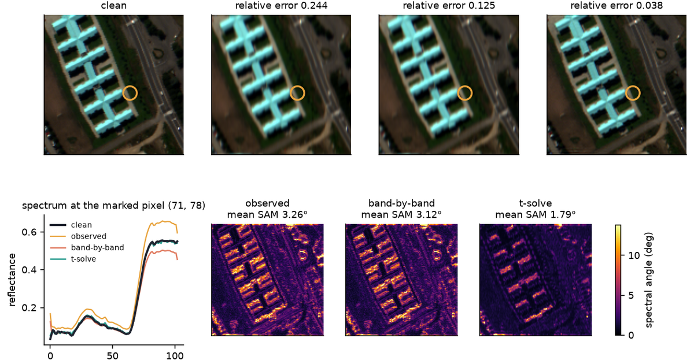

Four real problems where the operator is a tensor, with the inverse taken in the product the problem actually lives in, and the cost of flattening measured rather than asserted.

The algebra is in [Tensor Factorizations and Tensor Inverses](../tensor-factorizations/); the compression case is in [Uses of Tensor Factorizations](../uses-of-tensor-factorizations/). That first post shows that a tensor has no default product, so it has no default inverse. This one answers the question it leaves open: given a problem, which product are you in, and what does unfolding to a matrix cost you?

A reference table of the inverses comes first, then the four domains, then the numbers side by side.

```{python}
#| label: setup
#| echo: false
import json
import sys
import time
from pathlib import Path

import matplotlib.pyplot as plt
import numpy as np

sys.path.insert(0, "src")

import domains as D
import tinv as T

plt.rcParams.update(
    {
        "figure.dpi": 140,
        "savefig.dpi": 140,
        "font.size": 9,
        "axes.titlesize": 9,
        "axes.spines.top": False,
        "axes.spines.right": False,
    }
)
INK, PURPLE, TEAL, CORAL, GOLD = "#1F2430", "#4A3AA7", "#2A9D8F", "#E07A5F", "#E8A33D"
```

## The kinds of tensor inverse

A matrix inverse undoes matrix multiplication. A tensor has no default product, so each product below induces its own inverse. They are not interchangeable, and none of them is *the* tensor inverse.

| Inverse | Product it inverts | Order and shape it needs | Reach for it when | What it costs |
|---|---|---|---|---|
| **Mode-$n$ pseudoinverse** | mode-$n$ product $\times_n$ | any order | you want a factor, mixing matrix, or change of basis back out along **one** mode: $A = Y_{(n)}X_{(n)}^{\dagger}$ | it inverts a mode map, **not** the tensor as an operator — the most common misreading |
| **t-inverse / t-pseudoinverse** | t-product $*$ | third order, with a meaningful third mode | the third mode is time, wavelength, or a frequency grid: video, hyperspectral cubes, some fMRI layouts | an FFT along mode 3, then $n_3$ matrix inverses; it fails per slice, so one bad slice poisons the result |
| **Einstein-product inverse** | Einstein product $\circledast$ | even order, square: $I_1{\times}\cdots{\times}I_N{\times}I_1{\times}\cdots{\times}I_N$ | the tensor genuinely *is* a linear map between tensor spaces: stiffness and compliance, discretised PDE operators | it is isomorphic to a $(\prod_k I_k)^2$ matrix, and it exists exactly when that unfolding is invertible |
| **Multilinear Moore–Penrose** | Einstein product | even order, rectangular or rank-deficient | same setting, but the operator is not square or not full rank | the unique solution of the four Penrose conditions; at order 2 it is the matrix pseudoinverse |
| **Tucker- or TT-format inverse** | mode products, TT contraction | any order, low multilinear or TT rank | the dense operator will not fit in memory and you need the inverse kept in the same low-rank format | approximate: the rank of the inverse is usually higher than the rank of the operator |
| **CP-based approximate inverse** | — | any order | a cheap preconditioner is enough and you never need the exact object | no existence or uniqueness guarantee; it is an approximation, not an inverse |
| **Kronecker-separable precision** | — | any order | you are modelling a covariance over a multiway array (tensor-normal, matrix-normal) | **not an algebraic tensor inverse at all** — it is an assumption that the inverse factorises across modes. It is in this table because it gets mistaken for one |

### Two rules that come with the table

**In production you solve, you do not invert.** The same rule as the matrix case. Tensor Krylov methods — t-product GMRES, tensor conjugate gradient — get $\mathcal{X}$ out of $\mathcal{A} * \mathcal{X} = \mathcal{B}$ without ever forming $\mathcal{A}^{-1}$ (El Guide et al. 2021). This post forms the inverse anyway, because it is showing what the object is. That is a teaching choice, not a recommendation.

**Matching a residual to the wrong product is a type error, not a numerical one.** A small $\lVert \mathcal{A} \times_n \mathcal{X} - \mathcal{B}\rVert$ says nothing about $\mathcal{A} * \mathcal{X} = \mathcal{B}$. The two products contract different indices, so they are different equations with the same letters. No amount of extra precision converts one into the other.

## Data

Four problems, three sources: two downloaded, one a set of published material constants, one simulated because the real thing is behind a data-use agreement.

### An off-axis carbon/epoxy ply

- **What it is.** Five elastic constants for a unidirectional T300/5208 carbon-fibre/epoxy ply at room temperature: $E_1 = 181$ GPa along the fibres, $E_2 = 10.3$ GPa across them, $G_{12} = 7.17$ GPa, $\nu_{12} = 0.28$, $\nu_{23} = 0.35$. These are representative tabulated values for that material system, stated here in full so the arithmetic below is checkable. Nothing in the argument turns on the third significant figure.
- **Who measures them and why.** Materials labs run tension, compression and shear coupons on cured laminates so that structural engineers can predict how a part deforms before anyone builds it. The whole point of the measurement is to feed a stiffness model.
- **What this post asks of them.** Build the fourth-order stiffness tensor, rotate the ply $30°$ off the fibre axis, and invert it to get compliance — so that a known stress gives back the strain it caused.
- **What being wrong costs.** Compliance is what turns a load into a deflection. An error here is an aircraft panel or a pressure vessel sized against the wrong strain, which is a structural failure, not a bad plot.
- **Why a tensor inverse.** A $3\times3\times3\times3$ stiffness tensor genuinely *is* a linear map from symmetric $3\times3$ matrices to symmetric $3\times3$ matrices. That is the Einstein-product setting exactly, and it is also the case where a flattening turns out to be fine — which makes it the honest place to start.

### Pavia University

- **Provenance.** A hyperspectral image of the University of Pavia campus in northern Italy, $610\times340$ pixels over 103 spectral bands at 1.3 m ground resolution. Acquired by the ROSIS sensor during an airborne campaign and released for research by Prof. Paolo Gamba of the Telecommunications and Remote Sensing Laboratory at the University of Pavia. It is distributed in the Hyperspectral Remote Sensing Scenes collection assembled by Graña, Veganzones and Ayerdi at UPV/EHU.
- **Collector and motive.** A flight campaign, not a survey or a scrape. The scene was flown and released to give hyperspectral classification methods a common benchmark, which is why it turns up in hundreds of remote-sensing papers.
- **What this post uses.** A $128\times128\times103$ crop, written to `data/paviaU_crop.npz` by `src/fetch_data.py` and committed. The canonical host refuses programmatic requests, so the script pulls the full scene from an ungated mirror, crops it, and throws the rest away.
- **What this post asks of it.** Blur the cube with an operator that smears space *and* mixes neighbouring bands, then try to get it back two ways.
- **What being wrong costs.** Hyperspectral analysis identifies materials from the shape of a pixel's spectrum. A restoration that sharpens the picture while leaving the bands mixed returns a confident, wrong material label — a mineral survey, a crop-disease map, or a pollution estimate built on a spectrum that belongs to nothing.
- **Why a tensor inverse.** The degradation couples bands, so the operator is not block-diagonal across the third mode. The t-product is built for exactly that: a third mode with a meaningful ordering, and slices that mix.

### A synthetic four-dimensional scan

- **It is synthetic, and here is the generating process.** A $16\times16\times16\times120$ array. Four regressors — an intercept, two boxcar task blocks at different periods, and a linear drift — each with its own Gaussian blob in space. The array is the design times those coefficient maps plus i.i.d. Gaussian noise at $\sigma = 0.4$, seed 7.
- **What it stands in for, and why it is simulated.** A task-fMRI session of the kind in ADNI or the CMU StarPlus set. Those need an application and a data-use agreement, so they cannot be fetched at render time. The stronger reason is that the point of the section is to recover a *known* mixing map and score the recovery. No real scan comes with ground truth.
- **What being wrong costs.** A task map that puts activity in the wrong voxels is a published claim about which part of the brain does something.
- **Why a mode-$n$ pseudoinverse.** Time is one mode of four and the design lives only on that mode. Regressing along it, with the three spatial modes stacked as samples, is a $120\times4$ solve. The alternative is written out below.

### Chicago incident counts

- **Provenance.** The City of Chicago open data portal, "Crimes — 2001 to Present" (Socrata resource `ijzp-q8t2`), a public extract of the police department's records-management system.
- **Collector and motive.** Reported incidents, entered by the Chicago Police Department and published under the city's open-data programme. These are *reports*, not offences: reporting rates vary by area and by offence type, and the portal says so.
- **What this post uses.** All of 2023 for community areas 1–24 and the eight most common offence types, binned to $52 \times 24 \times 8$ — week by area by type, 44,388 incidents. Written to `data/chicago_counts.npz` and committed, so a render never hits the API.
- **What this post asks of it.** Estimate the covariance of a weekly array, which is what a forecast needs before it can put an interval on anything.
- **What being wrong costs.** Covariance estimates drive patrol allocation and resource forecasting. A model that is confident in the wrong places sends people to the wrong places.
- **Why a structured inverse.** Flattened, one week is a 192-dimensional vector and there are 52 weeks. The dense covariance is singular by construction. A precision that factorises across modes is estimable from the same data — and, as the last section notes, that is a modelling assumption rather than an algebraic inverse.

## Compliance: the Einstein product

**Who does this.** A mechanical engineer setting up a finite-element run on an anisotropic laminate.

```{mermaid}
%%| label: fig-mech
%%| fig-cap: "Stress in, strain out. The operator is a fourth-order stiffness tensor and the inversion happens under the Einstein product."
flowchart LR
  S["<b>σ</b><br/>stress, 3 × 3"] --> C["<b>ℂ</b><br/>stiffness<br/>3 × 3 × 3 × 3"]
  C -->|"invert under ⊛"| SS["<b>𝕊 = ℂ<sup>+</sup></b><br/>compliance"]
  SS --> E["<b>ε = 𝕊 ⊛ σ</b><br/>strain, 3 × 3"]
```

Hooke's law in its tensor form is $\sigma_{ij} = \mathbb{C}_{ijkl}\varepsilon_{kl}$. Contracting the last two indices of $\mathbb{C}$ against a $3\times3$ matrix is the Einstein product, so $\mathbb{C}$ is an operator on $3\times3$ matrices and compliance is its inverse.

Build the ply, rotate it $30°$ off the fibre axis, and look at the operator as a $9\times9$ matrix.

```{python}
#| label: stiffness
C4 = D.off_axis_stiffness(30.0)
flat = C4.reshape(9, 9)
sv = np.linalg.svd(flat, compute_uv=False)

print(f"stiffness tensor  {C4.shape}, as an operator {flat.shape}")
print("singular values / largest:")
print(np.array2string(sv / sv.max(), precision=6, suppress_small=False))
print(f"rank {np.linalg.matrix_rank(flat)} of 9")
```

Three singular values are zero to machine precision. The stiffness tensor is a $9\times9$ operator of rank 6, so **the Einstein-product inverse does not exist**.

```{python}
#| label: inverse-fails
try:
    T.einstein_inv(C4, 2)
except np.linalg.LinAlgError as err:
    print(f"einstein_inv: {err}")
```

This is not a defect in the material. The minor symmetries $\mathbb{C}_{ijkl} = \mathbb{C}_{jikl} = \mathbb{C}_{ijlk}$ mean the operator ignores the antisymmetric part of its input and returns nothing antisymmetric. Antisymmetric $3\times3$ matrices form a three-dimensional space, and that space is the null space. Rotating a rigid body does not strain it.

So the object that exists is the **multilinear Moore–Penrose inverse** — row 4 of the table, not row 3. It inverts the map on the six-dimensional symmetric subspace and sends the null space to zero.

```{python}
#| label: compliance
S4 = T.einstein_pinv(C4, 2)
sigma = D.applied_stress()
eps = T.einstein(S4, sigma, 2)
back = T.einstein(C4, eps, 2)

print("applied stress (MPa)")
print(np.array2string(sigma / 1e6, precision=1, suppress_small=True))
print("\nrecovered strain (x 1e-3)")
print(np.array2string(eps * 1e3, precision=4, suppress_small=True))
print(f"\nstrain is symmetric: {np.allclose(eps, eps.T)}")
print(f"round trip C(eps) vs sigma, relative error: {np.linalg.norm(back - sigma) / np.linalg.norm(sigma):.2e}")
```

The strain comes back symmetric and the round trip closes to machine precision. Note the shear–extension coupling: a $30°$ ply under mostly normal stress picks up a negative shear strain, which is why laminates are stacked in balanced pairs.

### Why Voigt notation is a flattening that works

Voigt notation stacks the six independent components of a symmetric $3\times3$ tensor into a length-6 vector, turning $\mathbb{C}$ into a $6\times6$ matrix. That is a flattening, it is standard engineering practice, and here it is exactly right.

The reason is the rank count above. The three dimensions Voigt throws away are precisely the null space of the operator. Flattening onto the symmetric subspace loses nothing, because there was nothing there.

```{python}
#| label: voigt
C6 = D.tensor_to_voigt_stiffness(C4)
S6 = np.linalg.inv(C6)
S4_from_voigt = D.compliance_to_tensor(S6, reuter=True)

print(f"Voigt stiffness 6x6: rank {np.linalg.matrix_rank(C6)}, condition number {np.linalg.cond(C6):.1f}")
print(f"max |S4_from_voigt - S4|: {np.abs(S4_from_voigt - S4).max():.2e}")
```

Well conditioned, full rank, and it reproduces the multilinear pseudoinverse to the last bit. This is the counterweight to everything below: unfolding is not the enemy. Unfolding *along the wrong structure* is.

### The mistake Voigt still lets you make

Voigt compliance carries **engineering** shear strains, $\gamma_{12} = 2\varepsilon_{12}$, while the tensor carries $\varepsilon_{12}$. Mapping the inverted $6\times6$ back to a fourth-order tensor therefore needs Reuter's factors: divide by 2 for each shear index. Skip them and the shear terms are off by 2 or 4.

```{python}
#| label: reuter
bad = D.compliance_to_tensor(S6, reuter=False)
eps_bad = T.einstein(bad, sigma, 2)
err_bad = np.linalg.norm(T.einstein(C4, eps_bad, 2) - sigma) / np.linalg.norm(sigma)

print("strain without Reuter factors (x 1e-3)")
print(np.array2string(eps_bad * 1e3, precision=4, suppress_small=True))
print(f"\nshear  ratio to correct: {eps_bad[0, 1] / eps[0, 1]:+.2f}")
print(f"normal ratio to correct: {eps_bad[0, 0] / eps[0, 0]:+.2f}")
print(f"round-trip relative error: {err_bad:.2f}")
```

Off-axis, the damage is not confined to shear. The rotation puts non-zero shear–extension terms into the compliance, so mis-scaling them feeds back through the whole solve: the normal strains change sign and the round trip is out by more than 300%.

On the fibre axis those coupling terms vanish and the same mistake is a clean factor of 4 on shear alone.

```{python}
#| label: reuter-on-axis
C4_0 = D.off_axis_stiffness(0.0)
eps_0 = T.einstein(T.einstein_pinv(C4_0, 2), sigma, 2)
S6_0 = np.linalg.inv(D.tensor_to_voigt_stiffness(C4_0))
bad_0 = T.einstein(D.compliance_to_tensor(S6_0, reuter=False), sigma, 2)

print(f"on-axis shear  ratio: {bad_0[0, 1] / eps_0[0, 1]:.3f}")
print(f"on-axis normal ratio: {bad_0[0, 0] / eps_0[0, 0]:.3f}")
```

The pseudoinverse route cannot make this mistake, because it never leaves the tensor. That is the trade the flattening buys: a smaller, better-conditioned object, at the price of a bookkeeping convention you have to get right by hand.

## Hyperspectral restoration: the t-product

**Who does this.** A remote-sensing analyst deblurring a data cube before classifying it.

```{mermaid}
%%| label: fig-hsi-flow
%%| fig-cap: "One t-product solve versus 103 independent 2D deconvolutions. The flattening drops every frontal slice but the first, which is where the band coupling lives."
flowchart LR
  X["<b>𝒳</b><br/>clean cube<br/>128 × 128 × 103"] --> A["<b>𝒜</b><br/>blur operator<br/>smear + band leak"]
  A --> B["<b>ℬ = 𝒜 * 𝒳</b><br/>observed"]
  B --> F["band-by-band<br/>invert slice 0 only"]
  B --> TP["t-solve<br/>all 103 Fourier slices"]
  F --> R1["spatially sharp,<br/>spectrally still mixed"]
  TP --> R2["<b>𝒳̂</b>"]
```

The degradation has two parts. Optics smear each band across space, and the sensor leaks signal between neighbouring wavelengths. Under the t-product both live in one operator $\mathcal{A}$: frontal slice 0 is the spatial smear, slices $\pm 1$ carry the leak.

```{python}
#| label: hsi-setup
cube, meta = D.pavia_crop()
n, bands = cube.shape[0], cube.shape[2]
A = D.blur_operator(n, bands, width=1.4, leak=0.12)

rng = np.random.default_rng(T.SEED)
observed = T.tprod(A, cube)
observed = observed + rng.normal(0, 1e-3 * observed.std(), observed.shape)

print(f"crop {cube.shape} from the {tuple(meta['full_shape'])} scene at origin {meta['origin']}")
print(f"operator {A.shape}: spatial smear in slice 0, {0.12:.0%} band leak in slices 1 and -1")
print(f"operator as a tensor:            {A.nbytes / 1e6:6.1f} MB")
print(f"same operator unfolded (block circulant): {(n * bands) ** 2 * 8 / 1e9:6.1f} GB")
```

Deconvolution is ill-posed, so both routes get the same Tikhonov regulariser and each is given its own best $\lambda$. That is generous to the flattening and leaves the band coupling as the only difference between them.

```{python}
#| label: hsi-solve
def relative(x):
    return np.linalg.norm(x - cube) / np.linalg.norm(cube)


lambdas = np.logspace(-6, 1, 15)
results = {}
for name, solver in (
    ("band-by-band", T.band_by_band_solve),
    ("t-solve", T.treg_solve),
):
    err, lam = min((relative(solver(A, observed, l)), l) for l in lambdas)
    start = time.perf_counter()
    recovered = solver(A, observed, lam)
    results[name] = {
        "cube": recovered,
        "lam": lam,
        "rel": err,
        "sam": float(D.spectral_angle(cube, recovered).mean()),
        "secs": time.perf_counter() - start,
    }

header = f"{'':<13} {'lambda':>8} {'rel error':>10} {'mean SAM':>9} {'seconds':>8}"
print(header)
print("-" * len(header))
print(f"{'observed':<13} {'':>8} {relative(observed):10.4f} "
      f"{D.spectral_angle(cube, observed).mean():8.2f}° {'':>8}")
for name, r in results.items():
    print(f"{name:<13} {r['lam']:8.0e} {r['rel']:10.4f} {r['sam']:8.2f}° {r['secs']:8.2f}")
```

Band-by-band deconvolution halves the relative error and then stops. Its best $\lambda$ runs to the smooth end of the grid, which is what a method does when it cannot fix what is actually wrong: the residual it is left with is the band mixing it threw away.

The t-solve gets roughly three times closer, and the spectral angle — the quantity that decides what material a pixel is — comes down by 40%.

```{python}
#| label: fig-hsi-restore
#| fig-cap: "Pavia University, a 128×128 crop. Top: an RGB composite from bands 46, 27 and 10. Bottom left: the spectrum of one marked pixel. Bottom right: per-pixel spectral angle against the clean cube, on a shared scale. Band-by-band deconvolution sharpens the picture and leaves the spectral-angle map almost as hot as the blurred input; the t-solve cools it."
#| fig-width: 11
#| fig-height: 6.4
def rgb(c):
    im = np.stack([c[:, :, 46], c[:, :, 27], c[:, :, 10]], axis=-1)
    lo, hi = np.percentile(im, [1, 99])
    return np.clip((im - lo) / (hi - lo), 0, 1)


recovered = {k: results[k]["cube"] for k in results}
sam = {
    name: D.spectral_angle(cube, data).reshape(n, n)
    for name, data in [("observed", observed), *recovered.items()]
}

# Mark a pixel where the two methods actually disagree, rather than an
# arbitrary one: the 97th percentile of the band-by-band minus t-solve gap,
# taken away from the border so the marker is not clipped.
gap = sam["band-by-band"] - sam["t-solve"]
interior = np.zeros_like(gap, dtype=bool)
interior[8:-8, 8:-8] = True
ranked = np.argsort(np.where(interior, gap, -np.inf).ravel())
px, py = np.unravel_index(ranked[int(0.97 * interior.sum())], (n, n))

fig, axes = plt.subplots(2, 4, figsize=(11, 6.0), height_ratios=[1.35, 1])
fig.subplots_adjust(hspace=0.28)
for ax, (name, data) in zip(
    axes[0], [("clean", cube), ("observed", observed), *recovered.items()]
):
    ax.imshow(rgb(data))
    title = name if name == "clean" else f"{name}\nrelative error {relative(data):.3f}"
    ax.set_title(title)
    ax.plot(py, px, "o", mfc="none", mec=GOLD, mew=1.8, ms=13)
    ax.set_xticks([])
    ax.set_yticks([])

spec = axes[1][0]
spec.plot(cube[px, py, :], color=INK, lw=2.0, label="clean", zorder=3)
spec.plot(observed[px, py, :], color=GOLD, lw=1.2, label="observed")
spec.plot(recovered["band-by-band"][px, py, :], color=CORAL, lw=1.3, label="band-by-band")
spec.plot(recovered["t-solve"][px, py, :], color=TEAL, lw=1.3, label="t-solve")
spec.set_title(f"spectrum at the marked pixel ({px}, {py})")
spec.set_xlabel("band")
spec.set_ylabel("reflectance")
spec.legend(frameon=False, fontsize=7)

vmax = float(np.percentile(sam["observed"], 99))
for ax, name in zip(axes[1][1:], ["observed", "band-by-band", "t-solve"]):
    im = ax.imshow(sam[name], cmap="inferno", vmin=0, vmax=vmax)
    ax.set_title(f"{name}\nmean SAM {sam[name].mean():.2f}°")
    ax.set_xticks([])
    ax.set_yticks([])
fig.colorbar(im, ax=axes[1][1:], shrink=0.85, label="spectral angle (deg)")
plt.show()
```

The spectra are the point. The band-by-band curve keeps the shape of the clean one but sits offset from it, above the truth over some band ranges and below over others, because every band still carries 12% of each neighbour. The t-solve curve lies on the truth.

The spectral-angle maps say the same thing across the whole scene. Band-by-band leaves a map that is barely cooler than the blurred input — the hot pixels are the roofs and edges, where neighbouring bands differ most and the leak therefore does most damage. The t-solve map cools everywhere.

Note the memory line above too: the same operator is 13.5 MB as a tensor and 1.4 GB as the block-circulant matrix its unfolding would produce. The t-product does not merely give a better answer here — it is the only one of the two that fits in memory at full scene size.

## The t-inverse, stage by stage

The t-inverse is four steps, and all four are pictures. The widget below walks through them on a toy $8\times8\times6$ tensor, built from the same seed as everything else in this post.

::: {.widget-container}
::: {.widget-header}
<span class="widget-title">The t-inverse in four stages</span>
<span class="widget-badge">runs in the browser</span>
:::
<div id="ti-widget"></div>
<div class="widget-note">Stage 2 is the one to sit with: after the FFT along mode 3 the six slices decouple, so one tensor inverse becomes six independent matrix inverses. Then push <b>Conditioning</b> to the right. Slice 2 and its conjugate partner slice 4 go singular together, the largest entry of the inverse climbs past 1e11, and the solve error runs to 2.6e6 — one bad slice poisons the whole tensor. Now switch the solver to <b>pinv</b>. The pseudoinverse drops that direction: the identity check stops passing, because A·A<sup>+</sup> is a projector rather than the identity, but the solve error falls back to 0.09. That is the trade, and the two readings disagree on purpose.</div>
:::

The numbers in that note come from the same function the widget's data was exported from, so they can be checked here:

```{python}
#| label: tinv-stages
for level in (0.0, 0.5, 1.0):
    row = []
    for solver in ("inv", "pinv"):
        s = T.widget_state(level, solver)
        row.append((solver, s["residual"], s["max_abs"], s["solve_error"]))
    kappa = T.widget_state(level, "inv")["conds"][2]
    print(f"conditioning {level:.1f}   kappa(slice 2) = {kappa:.2e}")
    for solver, res, mx, solve in row:
        print(f"    {solver:>4}  identity residual {res:8.2e}   max|X| {mx:8.2e}   solve error {solve:8.2e}")
```

Two things worth naming. The identity residual and the solve error disagree once the pseudoinverse starts truncating, and the solve error is the one a practitioner should read. And slices 2 and 4 are a conjugate pair, so a real tensor cannot have one of them ill-conditioned on its own.

## Task maps: the mode-$n$ pseudoinverse

**Who does this.** A computational neuroscientist mapping a four-dimensional scan onto a task design.

```{mermaid}
%%| label: fig-scan-flow
%%| fig-cap: "Regression along one mode. Time is mode 4; the three spatial modes are stacked as columns, so the solve is the size of the design, not the size of the scan."
flowchart LR
  Y["<b>𝒴</b><br/>scan<br/>16 × 16 × 16 × 120"] --> U["unfold on mode 4<br/>120 × 4096"]
  X["<b>X</b><br/>design<br/>120 × 4"] --> P["<b>X<sup>†</sup></b><br/>mode-n pseudoinverse"]
  U --> M["<b>B = X<sup>†</sup> 𝒴<sub>(4)</sub></b>"]
  P --> M
  M --> R["coefficient maps<br/>4 × 4096"]
```

This is the row of the table most often misread. The mode-$n$ pseudoinverse inverts the *design matrix on one mode*. It does not invert the scan as an operator, and no tensor is being inverted at all.

```{python}
#| label: scan
scan, design, beta_true = D.synthetic_scan()
start = time.perf_counter()
beta_hat = T.mode_pinv_solve(scan, design, 3)
mode_secs = time.perf_counter() - start
truth = beta_true.reshape(design.shape[1], -1)

print(f"scan {scan.shape}, design {design.shape}, solve took {mode_secs * 1e3:.1f} ms")
names = ["intercept", "task A", "task B", "drift"]
for p, name in enumerate(names[1:], start=1):
    corr = np.corrcoef(beta_hat[p], truth[p])[0, 1]
    print(f"  {name:<10} correlation with truth {corr:.3f}")
print(f"  overall relative error {np.linalg.norm(beta_hat - truth) / np.linalg.norm(truth):.3f}")
```

The two task maps come back at correlation 0.96 and 0.90 with the truth. The drift is weaker, which is expected: a smooth ramp is the regressor most confounded with noise at this length.

Now the parameter count. The mode-$n$ route solves a $120\times4$ system once and reuses it across all 4,096 voxels.

```{python}
#| label: scan-counts
voxels, frames, params = 16**3, design.shape[0], design.shape[1]
vec_rows, vec_cols = voxels * frames, voxels * params

print(f"mode-n:  solve is {frames} x {params}, estimates {params * voxels:,} coefficients")
print(f"vectorised GLM design matrix: {vec_rows:,} x {vec_cols:,}")
print(f"  = {vec_rows * vec_cols:.2e} entries = {vec_rows * vec_cols * 8 / 1e9:.1f} GB")
```

Same estimates, 64 GB of design matrix. The vectorised form is a block-diagonal matrix with the same $120\times4$ block repeated 4,096 times, and the mode-$n$ pseudoinverse is what you get when you notice that and stop writing the blocks down.

```{python}
#| label: fig-scan
#| fig-cap: "Recovered coefficient maps against the truth, one axial slice through each blob. The two task maps are recovered cleanly; the drift map, whose regressor is a smooth ramp, is not."
#| fig-width: 10
#| fig-height: 4.4
maps = beta_hat.reshape(beta_true.shape)
fig, axes = plt.subplots(2, 3, figsize=(10, 4.4))
slices = [(1, 8), (2, 7), (3, 8)]
for col, (p, z) in enumerate(slices):
    vmax = float(np.abs(beta_true[p]).max())
    axes[0, col].imshow(beta_true[p][:, :, z], cmap="magma", vmin=0, vmax=vmax)
    axes[1, col].imshow(maps[p][:, :, z], cmap="magma", vmin=0, vmax=vmax)
    corr = np.corrcoef(beta_hat[p], truth[p])[0, 1]
    axes[0, col].set_title(f"{names[p]} — truth")
    axes[1, col].set_title(f"recovered, r = {corr:.2f}")
for ax in axes.ravel():
    ax.set_xticks([])
    ax.set_yticks([])
fig.tight_layout()
plt.show()
```

## Urban demand: a separable precision

**Who does this.** An urban data scientist putting an interval on a forecast over a week $\times$ area $\times$ offence-type array.

```{mermaid}
%%| label: fig-demand-flow
%%| fig-cap: "One dense covariance over the flattened array, or one covariance per mode. The second is estimable from 40 weeks; the first is not."
flowchart LR
  Y["<b>𝒴</b><br/>52 × 24 × 8<br/>weekly counts"] --> F["flatten to 192-vectors"]
  Y --> S["keep the modes"]
  F --> DC["dense Σ<br/>192 × 192<br/>rank 39 of 192"]
  S --> K["Σ<sub>area</sub> ⊗ Σ<sub>type</sub><br/>flip-flop MLE"]
  DC --> R1["singular — needs a ridge"]
  K --> R2["336 free parameters"]
```

This section is the one row of the table that is not an algebraic tensor inverse. Assuming the covariance factorises as $\Sigma_{\text{area}} \otimes \Sigma_{\text{type}}$ is a modelling choice about the world, not a property of the array. It earns its place here because it is routinely described as "the tensor inverse" of a covariance, and it is not — and because, on this data, it turns out not to pay.

```{python}
#| label: demand-setup
counts, cmeta = D.chicago_counts()
Y = np.sqrt(counts.astype(float))  # variance-stabilise Poisson-like counts
train, test = Y[:40], Y[40:]
centre = train.mean(axis=0)
Ztr, Zte = train - centre, test - centre
dim = Ztr[0].size

print(f"{cmeta['n_incidents']:,} incidents, {cmeta['year']}, community areas 1-{max(cmeta['areas'])}")
print(f"array {counts.shape} -> {len(train)} training weeks, {len(test)} held out")
print(f"one week flattened is a {dim}-vector; the dense sample covariance has rank "
      f"{np.linalg.matrix_rank(Ztr.reshape(len(Ztr), -1).T @ Ztr.reshape(len(Ztr), -1))} of {dim}")
```

Forty observations of a 192-dimensional vector cannot produce a full-rank covariance. That is not a small-sample nuisance, it is arithmetic.

The separable model fits one covariance per mode by Dutilleul's flip-flop algorithm: whiten every other mode, take the sample covariance of the mode being updated, repeat.

```{python}
#| label: demand-fit
covs = D.flip_flop(Ztr, iters=60)
logdet = D.separable_logdet(covs)
quad = D.separable_quadform(Zte, covs)
sep_ll = float(np.mean(-0.5 * (dim * np.log(2 * np.pi) + logdet + quad)))
sep_params = sum(c.shape[0] * (c.shape[0] + 1) // 2 for c in covs)

Xtr, Xte = Ztr.reshape(len(Ztr), -1), Zte.reshape(len(Zte), -1)
S = Xtr.T @ Xtr / len(Xtr)
best_ll, best_ridge = -np.inf, None
for r in np.logspace(-4, 2, 25):
    Sr = S + r * np.trace(S) / dim * np.eye(dim)
    _, ld = np.linalg.slogdet(Sr)
    q = np.einsum("nd,de,ne->n", Xte, np.linalg.inv(Sr), Xte)
    ll = float(np.mean(-0.5 * (dim * np.log(2 * np.pi) + ld + q)))
    if ll > best_ll:
        best_ll, best_ridge = ll, r

# Where does the gain come from? Keep the mode variances, drop the mode
# correlations; then drop the variances too.
def sep_loglik(cs):
    q = D.separable_quadform(Zte, cs)
    return float(np.mean(-0.5 * (dim * np.log(2 * np.pi) + D.separable_logdet(cs) + q)))


diag_ll = sep_loglik([np.diag(np.diag(c)) for c in covs])
iso = [np.eye(d) for d in Ztr.shape[1:]]
iso[0] = np.eye(Ztr.shape[1]) * (Ztr**2).mean()
iso_ll = sep_loglik(iso)

print(f"{'model':<32} {'held-out log-lik':>17} {'free params':>12}")
print("-" * 63)
print(f"{'separable, area x type':<32} {sep_ll:17.1f} {sep_params:12,}")
print(f"{'separable, variances only':<32} {diag_ll:17.1f} "
      f"{sum(c.shape[0] for c in covs):12,}")
print(f"{'one variance for everything':<32} {iso_ll:17.1f} {1:12,}")
print(f"{'dense 192x192 + best ridge':<32} {best_ll:17.1f} {dim * (dim + 1) // 2:12,}")
print(f"\nthe dense model's ridge ({best_ridge:.2g}) was chosen on the held-out weeks themselves")
```

The separable model beats the ridged dense one with 55 times fewer parameters, and the dense model was allowed to pick its ridge on the test set, which no honest pipeline would permit. But look at the margin: about nine nats a week.

Then look at the third row. **One variance for the whole array scores as well as the separable model.** The mode structure this section exists to demonstrate is, on this data, not worth having. The fitted off-diagonal correlations top out near 0.3 between community areas and near 0.1 between offence types, and once the weekly per-cell means are removed there is very little left for a covariance to explain.

That result is sensitive to a modelling choice worth stating. The residuals above are centred on a per-area, per-type weekly mean. Centre instead on a single grand mean, leaving the area and type effects in the covariance, and the fitted correlations rise past 0.85 and the mode structure looks impressive — but then the ridged dense estimator wins outright, because what the covariance is now describing is mostly a mean effect and the Kronecker assumption is the wrong shape for it. Neither centring makes this array a good advertisement for separable covariance.

So the honest verdict for this row of the table is narrower than the usual pitch. The statistical case is weak here. The case that survives is feasibility, and it survives decisively at full size.

```{python}
#| label: demand-counts
full = counts.size
print(f"full array flattened: {full:,}-vector")
print(f"  dense covariance:   {full * (full + 1) // 2:,} free parameters, {full * full * 8 / 1e9:.1f} GB")
print(f"  separable, 3 modes: "
      f"{sum(d * (d + 1) // 2 for d in counts.shape):,} free parameters, "
      f"{sum(d * d for d in counts.shape) * 8 / 1e3:.1f} kB")
print(f"  and you have exactly 1 observation of that {full:,}-vector")
```

```{python}
#| label: fig-demand
#| fig-cap: "What the separable model actually found, and it is not much. Left two panels: the fitted mode correlations with the diagonal masked, on a ±0.3 scale. Right two: the per-mode scales, all within about 20% of each other. This is the picture of a structure that is real but too weak to pay for itself — which is why one global variance scores as well."
#| fig-width: 12.5
#| fig-height: 3.9
def to_corr(cov):
    d = np.sqrt(np.diag(cov))
    R = cov / np.outer(d, d)
    np.fill_diagonal(R, np.nan)
    return R


labels = [t.title().replace(" ", "\n") for t in cmeta["types"]]
fig, axes = plt.subplots(1, 4, figsize=(12.5, 3.9), width_ratios=[1.15, 1, 1.05, 0.8])
cmap = plt.get_cmap("RdBu_r").copy()
cmap.set_bad("#E9EBEF")

im = axes[0].imshow(to_corr(covs[0]), cmap=cmap, vmin=-0.3, vmax=0.3)
axes[0].set_title("community area correlation")
axes[0].set_xticks(range(0, 24, 4), range(1, 25, 4))
axes[0].set_yticks(range(0, 24, 4), range(1, 25, 4))

axes[1].imshow(to_corr(covs[1]), cmap=cmap, vmin=-0.3, vmax=0.3)
axes[1].set_title("offence-type correlation")
axes[1].set_xticks(range(8), labels, fontsize=6, rotation=90)
axes[1].set_yticks(range(8), labels, fontsize=6)
cbar = fig.colorbar(im, ax=axes[:2], shrink=0.82, pad=0.16,
                    label="correlation (diagonal masked)")
cbar.ax.yaxis.set_label_position("left")

sd_area = np.sqrt(np.diag(covs[0]))
sd_type = np.sqrt(np.diag(covs[1]))
axes[2].bar(np.arange(1, 25), sd_area / sd_area.mean(), color=PURPLE, width=0.75)
axes[2].set_title("scale per community area")
axes[2].set_xlabel("community area")
axes[2].set_ylabel("std dev / mean")
axes[2].axhline(1.0, color=INK, lw=0.8, ls="--")
axes[3].bar(np.arange(8), sd_type / sd_type.mean(), color=TEAL, width=0.7)
axes[3].set_title("scale per offence type")
axes[3].set_xticks(range(8), labels, fontsize=6, rotation=90)
axes[3].axhline(1.0, color=INK, lw=0.8, ls="--")
plt.show()
```

## Why not just flatten

Every number below was computed above, not asserted.

| Domain | Product | Inverse used | Operator, native | Operator, unfolded | What flattening costs |
|---|---|---|---|---|---|
| Compliance | Einstein $\circledast$ | multilinear Moore–Penrose | 81 entries | $9\times9$, rank 6 | **Nothing** — Voigt drops exactly the null space. But mapping back needs Reuter's factors, and skipping them is a 316% error off-axis |
| Hyperspectral | t-product $*$ | regularised t-solve | 13.5 MB | 1.4 GB block-circulant | relative error 0.125 against 0.038; spectral angle 3.12° against 1.79° |
| Task maps | mode-$n$ $\times_n$ | mode-$n$ pseudoinverse | $120\times4$ solve | $491{,}520 \times 16{,}384$ design, 64 GB | nothing statistically — the flattening is the same estimator written out 4,096 times |
| Urban demand | — (separable model) | mode-wise precisions | 336 parameters | 18,528 parameters, rank 39 of 192 | at this size, **almost nothing**: 9 nats of held-out log-likelihood, and one global variance matches it. At the full three-mode array, 0.8 GB and 49.8M parameters from one observation |

Two of these four rows say flattening is fine, and a third says it is fine at this size and impossible at full size. Only one is a clean win for the tensor. That is the honest shape of the argument: the question is never "tensor or matrix", it is whether the unfolding you have in mind respects the structure the operator actually has.

- **Compliance.** The unfolding is lossless because the discarded directions are the null space. The risk is bookkeeping, not information.
- **Task maps.** The vectorised GLM gives identical estimates. It is a waste of memory, not a mistake.
- **Hyperspectral.** The flattening drops the cross-band slices of the operator, so it is solving a different problem. The error it cannot get below is the coupling it discarded.
- **Urban demand.** The flattening asks for more parameters than the data can support, and at three modes it asks for 0.8 GB of them from a single observation. But on this array the structure buys feasibility and almost no accuracy — a reminder that a structural assumption has to be checked against the data, not assumed because the array has three modes.

## Open problems

This is not settled textbook material the way matrix inverses are.

- **The taxonomy is not closed.** The classical generalized-inverse zoo has been extended to tensors under the Einstein product over roughly the last decade — the Moore–Penrose inverse (Sun et al. 2016), the Drazin inverse (Behera et al. 2020), core and core-EP inverses (Sahoo et al. 2020) — and papers defining further variants keep appearing. There is no agreed canonical set the way $A^{-1}$ and $A^{\dagger}$ are canonical for matrices.
- **The numerical analysis lags the algebra.** Existence and uniqueness results are much further along than conditioning, backward stability, and complexity bounds for the matching algorithms. For several of these there is no established condition number to quote.
- **Tooling is thin.** [TensorLy](https://tensorly.org/) covers decompositions well. The inverses are mostly something you write yourself from the definition, which is what `src/tinv.py` in this post is.
- **Do not overstate it.** The Einstein-product inverse for elasticity is decades-old settled engineering practice under a different name. What is open is the general theory and its numerics, not every application above.

## Next steps

- **t-product solvers.** t-GMRES and tensor Golub–Kahan (El Guide et al. 2021) get $\mathcal{X}$ without forming $\mathcal{A}^{-1}$. On a full $610\times340\times103$ scene that is the difference between running and not.
- **Tucker- and TT-format inverses.** Worth benchmarking when the operator itself will not fit. The rank of the inverse is generally higher than the rank of the operator, so the useful question is how much higher, on your problem.
- **CP-based approximate inverses.** A preconditioner, not an inverse. Cheap, with no guarantee.
- **Where TensorLy stops.** It gives you CP, Tucker, TT and t-SVD. For the inverses above, the definitions are short and `numpy` is enough — the four in `src/tinv.py` are a dozen lines each.

Problems. Pick. Products. Inverses. Follow. Unfolding. Sometimes. Fine. Check. First.

## References

- Brazell, M., Li, N., Navasca, C., and Tamon, C. (2013). Solving multilinear systems via tensor inversion. *SIAM Journal on Matrix Analysis and Applications* 34(2), 542–570.
- Behera, R., Nandi, A. K., and Sahoo, J. K. (2020). [Further results on the Drazin inverse of even-order tensors](https://doi.org/10.1002/nla.2317). *Numerical Linear Algebra with Applications* 27(5), e2317.
- Dutilleul, P. (1999). [The MLE algorithm for the matrix normal distribution](https://doi.org/10.1080/00949659908811970). *Journal of Statistical Computation and Simulation* 64(2), 105–123.
- El Guide, M., El Ichi, A., Jbilou, K., and Sadaka, R. (2021). [On tensor GMRES and Golub–Kahan methods via the t-product for color image processing](https://doi.org/10.13001/ela.2021.5471). *The Electronic Journal of Linear Algebra* 37, 524–543.
- Hoff, P. D. (2011). [Separable covariance arrays via the Tucker product, with applications to multivariate relational data](https://doi.org/10.1214/11-BA606). *Bayesian Analysis* 6(2), 179–196.
- Kilmer, M. E., and Martin, C. D. (2011). Factorization strategies for third-order tensors. *Linear Algebra and its Applications* 435(3), 641–658.
- Kolda, T. G., and Bader, B. W. (2009). Tensor decompositions and applications. *SIAM Review* 51(3), 455–500.
- Kossaifi, J., Panagakis, Y., Anandkumar, A., and Pantic, M. (2019). [TensorLy: tensor learning in Python](https://tensorly.org/). *JMLR* 20(26), 1–6.
- Sahoo, J. K., Behera, R., Stanimirović, P. S., Katsikis, V. N., and Ma, H. (2020). [Core and core-EP inverses of tensors](https://doi.org/10.1007/s40314-019-0983-5). *Computational and Applied Mathematics* 39, 9.
- Sun, L., Zheng, B., Bu, C., and Wei, Y. (2016). [Moore–Penrose inverse of tensors via Einstein product](https://doi.org/10.1080/03081087.2015.1083933). *Linear and Multilinear Algebra* 64(4), 686–698.
- [Hyperspectral Remote Sensing Scenes](https://www.ehu.eus/ccwintco/index.php/Hyperspectral_Remote_Sensing_Scenes) — Pavia University, ROSIS sensor; scenes provided by P. Gamba (University of Pavia), collection assembled by M. Graña, M. A. Veganzones and B. Ayerdi (UPV/EHU). Fetched here from an [ungated mirror](https://huggingface.co/datasets/danaroth/pavia).
- [Crimes — 2001 to Present](https://data.cityofchicago.org/Public-Safety/Crimes-2001-to-Present/ijzp-q8t2) — City of Chicago open data portal.
- [Tensor Factorizations and Tensor Inverses](../tensor-factorizations/) — CP, Tucker, TT, t-SVD, and the four inverses on a synthetic cube.
- [Uses of Tensor Factorizations](../uses-of-tensor-factorizations/) — the compression case.

```{python}
#| label: widget-injection
#| echo: false
#| output: asis
# Quarto keys frozen output on an md5 of index.qmd alone, so editing
# widgets.js or widget-data/tinv.json does NOT invalidate _freeze/ and a
# project render will keep serving the old bundle. Re-render this post
# explicitly after changing either.
#
# Both strings get the `</` guard: a literal `</` anywhere in the data or the
# code would close the inline <script> early and kill the widget with no build
# error. `<\/` is valid inside a JS string literal and inside a regex.
payload = json.loads(Path("widget-data/tinv.json").read_text())
js_code = Path("widgets.js").read_text()
print("```{=html}")
print(
    '<script id="ti-data" type="application/json">'
    + json.dumps(payload, separators=(",", ":")).replace("</", "<\\/")
    + "</script>"
)
print("<script>" + js_code.replace("</", "<\\/") + "</script>")
print("```")
```
