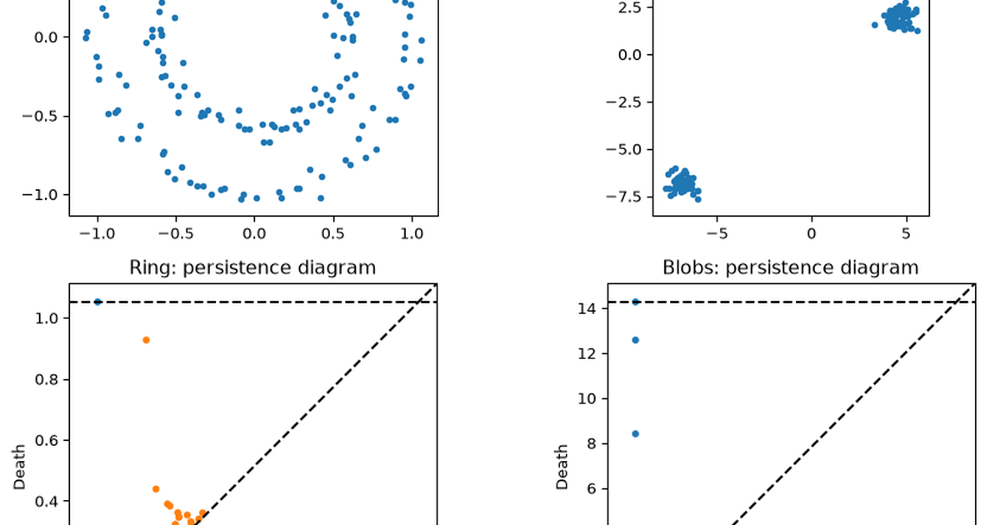

> Thanks to [Andrei](https://matmor.unam.mx/es/node/350) — a friend — and some of his math colleagues, whose discussion with me in Bogotá got me thinking about clustering vs. topology in the first place.

The first thing anyone does with a scatter plot is squint at it and count the groups. If you have ever run the same clustering code twice with a different setting and got two answers that were both defensible, you have met the problem this post is about: the number of groups you find is not a property of the data, it is a property of how far apart you decided "far apart" was.

There is a way to stop deciding. Instead of picking one distance and reporting the groups you see at that distance, look at every distance at once and keep track of which features stay around as the distance grows. Structure that survives a wide range of settings is structure the data has; structure that appears and vanishes within a hair's breadth is sampling noise. That reframing also turns out to reveal shapes — rings, cavities — that no grouping of points could ever have reported.

## Every clustering algorithm makes you guess a scale first

Most clustering algorithms force you to commit to a single scale before you've even looked at the data. K-means needs `k`, the number of groups. DBSCAN needs `eps`, the radius within which two points count as neighbours. Hierarchical clustering builds a tree of nested merges — a dendrogram — and needs a height at which to cut it. Pick the wrong scale and a real multi-cluster structure collapses into one blob, or one meaningful group gets shredded into noise.

The alternative sketched above has a name: **topological data analysis (TDA)** — "topology" being the branch of mathematics that studies the properties of a shape that survive stretching and bending, such as how many pieces it has and how many holes. TDA sidesteps the scale question by not picking a scale at all. Instead of asking "what does the data look like at distance threshold $\varepsilon$?", it asks "what does the data look like at *every* $\varepsilon$ simultaneously, and which shapes survive across a wide range of them?" The shapes that survive — persist — are treated as signal. The shapes that flicker in and out of existence are treated as noise.

That is a promise, not a mechanism. The mechanism starts with a way of turning a bag of points into a shape.

## A shape you can build from nothing but pairwise distances

A point cloud has no shape of its own; it is a finite set of coordinates with nothing between them. To talk about holes and pieces you first have to fill the gaps in, and the way to do that is to declare that points close enough together should be treated as joined. Two nearby points get an edge. Three mutually nearby points get the whole triangle, filled in, not just its rim. Four get a solid tetrahedron. Keep going and you have built a shape out of nothing but a table of pairwise distances.

Those filled-in pieces are called **simplices**, and a set of them glued along shared faces is a **simplicial complex** — a graph that is allowed to have filled-in faces, not only vertices and edges:

- a **0-simplex** is a point,
- a **1-simplex** is an edge (2 points),
- a **2-simplex** is a filled triangle (3 points),
- a **3-simplex** is a filled tetrahedron (4 points), and so on.

Given a point cloud $X = \{x_1, \dots, x_n\}$ and a radius $\varepsilon \geq 0$, the **Vietoris-Rips complex** $R_\varepsilon(X)$ is the simplicial complex built by a single rule:

$$
\{x_{i_0}, \dots, x_{i_k}\} \in R_\varepsilon(X) \iff \|x_{i_p} - x_{i_q}\| \leq \varepsilon \text{ for every pair } p, q.
$$

In words: include a simplex whenever *every pair* of its vertices is within $\varepsilon$ of each other. This is convenient because it's determined entirely by the pairwise distance matrix — you never have to reason about higher-dimensional geometry directly, just check pairwise distances.

As $\varepsilon$ grows from $0$ to $\infty$, more pairs satisfy the distance bound, so $R_\varepsilon(X)$ only ever gains simplices: $R_0(X) \subseteq R_{\varepsilon_1}(X) \subseteq R_{\varepsilon_2}(X) \subseteq \dots$. This nested, growing sequence of complexes is the **filtration** — the single object that encodes the shape of the data at every scale at once.

## Four points are enough to watch a loop be born and die

A filtration is easier to believe once you have watched a small one run. Four points at the corners of a unit square are the smallest example that shows all three things this post cares about: separate pieces merging into one, a loop opening up, and that same loop closing again.

The reason four corners suffice is that a square has exactly two distances in it. Neighbouring corners are 1 apart; opposite corners are $\sqrt{2} \approx 1.414$ apart. So as $\varepsilon$ grows there are only two moments where anything can happen, and both are visible by eye. The panels below draw the complex at four values of $\varepsilon$ chosen to straddle them.

```{python}
import numpy as np
import matplotlib.pyplot as plt
from itertools import combinations

square = np.array([[0.0, 0.0], [1.0, 0.0], [1.0, 1.0], [0.0, 1.0]])
side, diagonal = 1.0, np.sqrt(2)


def plot_rips(points, eps, ax):
    n = len(points)
    dists = np.linalg.norm(points[:, None] - points[None, :], axis=-1)
    for i, j, k in combinations(range(n), 3):
        if dists[i, j] <= eps and dists[j, k] <= eps and dists[i, k] <= eps:
            ax.add_patch(plt.Polygon(points[[i, j, k]], alpha=0.3, color="tab:blue", zorder=1))
    for i, j in combinations(range(n), 2):
        if dists[i, j] <= eps:
            ax.plot(*zip(points[i], points[j]), color="tab:blue", zorder=2)
    ax.scatter(points[:, 0], points[:, 1], s=80, zorder=3, color="black")
    ax.set_title(f"$\\varepsilon$ = {eps:.3f}")
    ax.set_xlim(-0.4, 1.4)
    ax.set_ylim(-0.4, 1.4)
    ax.set_aspect("equal")
    ax.set_xticks([])
    ax.set_yticks([])


fig, axes = plt.subplots(1, 4, figsize=(13, 3.5))
for ax, eps in zip(axes, [0.5, side, 1.2, diagonal]):
    plot_rips(square, eps, ax)
plt.tight_layout()
plt.show()
```

Reading left to right: at $\varepsilon = 0.5$ nothing is close enough to connect — 4 separate points. At $\varepsilon = 1$ (the side length) the 4 boundary edges appear and the points become one connected ring — but the diagonals ($\sqrt{2} \approx 1.414$) are still too far apart to connect, so the square stays **hollow**: a genuine loop has opened up. At $\varepsilon = 1.2$ nothing has changed yet — the loop persists. Only at $\varepsilon = \sqrt{2}$ do the diagonals connect, triangles fill in, and the loop closes.

### Counting holes is linear algebra you can do by hand

Reading loops off a picture works for four points and stops working immediately after. What is needed is a way to count holes arithmetically, and it turns out to be ordinary linear algebra on the list of simplices.

The idea is to compare two things. A closed path around the square is a loop that goes nowhere and comes back — it has no endpoints, no boundary. A path across a filled triangle is *also* boundary-free, but it is uninteresting, because it is merely the rim of a patch that is already filled in. A genuine hole is a boundary-free thing that is *not* the rim of anything. Count those and you have counted holes.

Making that precise takes four definitions. A $k$-chain is a formal sum of $k$-simplices. The **boundary map** $\partial_k$ sends a $k$-simplex to the alternating sum of its $(k-1)$-dimensional faces — the rim operation, written as a matrix. A **cycle** is a chain with zero boundary ($\ker \partial_k$), the "goes nowhere" chains. A **boundary** is a chain that is itself the rim of something one dimension up ($\operatorname{im} \partial_{k+1}$), the uninteresting ones. The $k$-th **Betti number** is the count of the first that are not the second:

$$
\beta_k = \dim \ker \partial_k - \dim \operatorname{im} \partial_{k+1}.
$$

Every quantity on the right is the rank or nullity of a matrix, so `numpy.linalg.matrix_rank` is essentially the whole implementation. No library, no black box.

```{python}
def rips_simplices(points, eps, max_dim):
    n = len(points)
    dists = np.linalg.norm(points[:, None] - points[None, :], axis=-1)
    simplices = {0: [(i,) for i in range(n)]}
    for dim in range(1, max_dim + 1):
        simplices[dim] = [
            combo
            for combo in combinations(range(n), dim + 1)
            if all(dists[i, j] <= eps for i, j in combinations(combo, 2))
        ]
    return simplices


def boundary_matrix(simplices_k, simplices_km1):
    index = {s: i for i, s in enumerate(simplices_km1)}
    d = np.zeros((len(simplices_km1), len(simplices_k)))
    for col, simplex in enumerate(simplices_k):
        for i in range(len(simplex)):
            face = simplex[:i] + simplex[i + 1 :]  # drop vertex i -> a face
            d[index[face], col] = (-1) ** i
    return d


def betti_numbers(points, eps, max_dim=2):
    simplices = rips_simplices(points, eps, max_dim)
    ranks = {0: 0}
    for dim in range(1, max_dim + 1):
        if simplices[dim] and simplices[dim - 1]:
            ranks[dim] = np.linalg.matrix_rank(boundary_matrix(simplices[dim], simplices[dim - 1]))
        else:
            ranks[dim] = 0
    betti = {}
    for dim in range(max_dim):
        cycles = len(simplices[dim]) - ranks[dim]      # dim ker(d_dim)
        boundaries = ranks.get(dim + 1, 0)              # dim im(d_{dim+1})
        betti[dim] = cycles - boundaries
    return betti


for eps in [0.5, side, 1.2, diagonal]:
    print(f"eps = {eps:.3f}:  betti_0 = {betti_numbers(square, eps)[0]},  betti_1 = {betti_numbers(square, eps)[1]}")
```

That matches the pictures exactly: $\beta_0$ drops from 4 to 1 once the ring connects at $\varepsilon = 1$; $\beta_1$ turns on at the same moment (a loop is born) and switches back off at $\varepsilon = \sqrt{2}$ (the loop dies, filled in by the two triangles).

Hand-rolled code agreeing with a hand-drawn picture proves only that both were drawn by the same person, so the same square goes through `ripser`, the standard fast implementation of Rips persistence. It reports each feature not as a Betti count per threshold but as a (birth, death) pair — the two $\varepsilon$ values between which that feature existed.

```{python}
from ripser import ripser

dgms = ripser(square, maxdim=1)["dgms"]
print("H0 (birth, death):\n", dgms[0])
print("H1 (birth, death):\n", dgms[1])
```

There is a single $H_1$ row, `[1.0, 1.41421354]`: born at $\varepsilon = 1$, dead at $\varepsilon = \sqrt{2}$, exactly as read off the plot. (The last digits differ from $\sqrt{2} = 1.41421356\ldots$ because `ripser` works in 32-bit floats. That is rounding, not disagreement.) The three finite $H_0$ rows die at $\varepsilon = 1$ and the fourth never dies — one component always survives, so its death is recorded as $\infty$.

## Clustering is the zero-dimensional case of one general machine

Both of those numbers came out of the same formula, which is a stronger statement than it looks. Look again at how $\beta_0$ was computed above: $\dim \ker \partial_1$ counts vertices, $\operatorname{im}\partial_1$'s rank tells you how many independent edges it took to connect them, and the difference is the number of connected components. That is *exactly* what single-linkage clustering computes: threshold a distance graph at $\varepsilon$ and count connected components. $H_0$ isn't analogous to clustering — it **is** clustering, expressed in the language of boundary maps.

Now notice that $\beta_1$ is computed by the *identical* operation, just one dimension up: instead of 0-chains (points) modulo boundaries of 1-chains (edges), it's 1-chains (loops) modulo boundaries of 2-chains (filled patches). Two loops get treated as "the same" if their difference bounds a filled-in disk — which is precisely the loop version of "two points get treated as the same cluster if they're connected by a path."

So the general pattern is:

$$
\beta_k = \underbrace{\text{(all $k$-dimensional cycles)}}_{\text{the ``things''}} \Big/ \underbrace{\text{(the ones that bound a $(k{+}1)$-dimensional patch)}}_{\text{``trivial'' cycles}}
$$

- $k=0$: points modulo paths $\to$ **clusters**.
- $k=1$: loops modulo filled disks $\to$ **independent holes/handles**.
- $k=2$: enclosed shells modulo filled solids $\to$ **voids**.

Clustering is the $k=0$ special case of one general machine. Persistent homology runs that same machine at every dimension $k$ *and* every scale $\varepsilon$ at once, which is the sense in which TDA is clustering expanded across both dimension and scale simultaneously — not a metaphor, but the same boundary/quotient computation applied more generally.

## On noisy data, a ring reads as one long-lived loop

The square was noiseless, symmetric and hand-picked, which is the sort of example a method can pass while still being useless. The next test adds noise and two hundred points.

The data is synthetic, deliberately. `make_circles` from scikit-learn draws points evenly around two concentric circles and jitters each one with Gaussian noise; `make_blobs` draws from three Gaussian clouds with well-separated centres. Nothing here was measured off anything. Synthetic is the right choice at this point in the argument precisely because the answer is known in advance: one of these has a hole in it and the other does not, so if the diagram says otherwise, the method is wrong rather than the data being ambiguous. The real situations they stand in for are common enough — a ring is the shape a periodic process traces out in state space, and separated blobs are what a mixture of a few distinct populations looks like — but on real data there would be no ground truth to check the answer against.

Both go through `ripser`/`persim` rather than the from-scratch code above, which does not survive contact with 200 points.

```{python}
from sklearn.datasets import make_circles, make_blobs
from persim import plot_diagrams

rng = np.random.default_rng(42)

ring, _ = make_circles(n_samples=200, noise=0.05, factor=0.6, random_state=42)
blobs, _ = make_blobs(n_samples=200, centers=3, cluster_std=0.4, random_state=42)

fig, axes = plt.subplots(2, 2, figsize=(10, 8))

for ax, data, title in zip(axes[0], [ring, blobs], ["Noisy ring", "Three blobs"]):
    ax.scatter(data[:, 0], data[:, 1], s=10)
    ax.set_title(title)
    ax.set_aspect("equal")

for ax, data, title in zip(
    axes[1], [ring, blobs], ["Ring: persistence diagram", "Blobs: persistence diagram"]
):
    dgms = ripser(data, maxdim=1)["dgms"]
    plot_diagrams(dgms, ax=ax, show=False)
    ax.set_title(title)

plt.tight_layout()
plt.show()
```

The bottom row is a **persistence diagram**, and it repays a moment's reading. Each feature is one dot, plotted at (birth, death) — the two $\varepsilon$ values between which it existed. Everything necessarily sits above the diagonal, since nothing dies before it is born, and *distance from the diagonal is lifetime*. Dots hugging the diagonal appeared and vanished almost instantly and are noise. Dots far above it are the structure.

For the ring, one $H_1$ (orange) point sits far above the diagonal — the loop around the ring, persisting from roughly the point-spacing scale up to the ring's diameter. K-means or DBSCAN would either carve this ring into arbitrary chunks or lump it into one blob; neither captures "it's a ring." For the three blobs, $H_1$ hugs the diagonal (no real loops), while $H_0$ shows three long-lived components before they merge into one — "three clusters," read straight off the diagram without ever choosing $k$.

### The equivalence with single-linkage is exact, not approximate

The claim that $H_0$ *is* clustering was argued algebraically above. It is also checkable in two lines, and worth checking, because "is the same computation" is the kind of claim that usually turns out to be "is similar in spirit." Single-linkage clustering merges the two nearest groups repeatedly and records the distance at which each merge happened. Those merge heights should be, one for one, the death times of the $H_0$ features on the same data.

```{python}
from scipy.cluster.hierarchy import linkage

dgm0 = ripser(blobs, maxdim=0)["dgms"][0]
death_times = np.sort(dgm0[np.isfinite(dgm0[:, 1]), 1])

Z = linkage(blobs, method="single")
merge_heights = np.sort(Z[:, 2])

print("H0 death times match single-linkage merge heights:", np.allclose(death_times, merge_heights))
```

`True` — not approximately, and not up to a tolerance anyone had to widen. The same numbers, arrived at from two directions.

## TDA answers a different question, not the same one better

That equivalence is easy to over-read in the other direction. If $H_0$ persistence reproduces single-linkage exactly, why not conclude that topological data analysis is hierarchical clustering with a heavier vocabulary? Because the equivalence holds only at $k=0$, and because the two approaches ask you for different things and hand back different things. The table lays those differences side by side.

| Aspect | Traditional clustering (k-means, DBSCAN, GMM) | Topological data analysis |
|---|---|---|
| Scale | One fixed scale, set by a hyperparameter (`k`, `eps`, `n_components`) | All scales at once, encoded in a filtration |
| Output | A single partition of points | A persistence diagram: every topological feature, born and dying across all scales |
| Shape assumptions | Often assumes convex/globular clusters (k-means) or one global density (DBSCAN) | None — captures components, loops, voids, and higher-dimensional structure |
| Noise vs. signal | No built-in separation; depends entirely on hyperparameter choice | Persistence *is* the noise filter: short lifetime = noise, long lifetime = structure |
| Sensitivity | Different `k`/`eps` can give qualitatively different answers | Deterministic given a distance and filtration; the diagram is stable under small perturbations of the data |
| Cost | $O(n)$–$O(n^2)$ depending on algorithm | $O(n^3)$ or worse for full Rips persistence; needs subsampling/landmarks at scale |

The practical upshot: clustering answers "what is the grouping?" for a scale you had to guess in advance. TDA answers "at which scales, and how confidently, does structure exist?" — and it can describe loops and voids that no partition of points into disjoint clusters could ever represent.

## A persistence diagram becomes a feature vector once you flatten it

Everything so far treated the diagram as the answer. It can also be an input. If two things differ in shape, and shape is hard to hand-engineer a feature for, then a summary of the diagram is a feature that captures the difference without anyone having to specify what the difference is.

There is one obstacle. A diagram is a multiset of points — a variable number of them, in no particular order — and almost every model wants a fixed-length vector. So the diagram gets *vectorized*, and there are three families of ways to do it: crude, image-like, and functional.

- **Summary statistics**: max lifetime, total lifetime (sum of all persistences), count of features above a persistence threshold, persistence entropy.
- **Persistence images**: rasterize the diagram (after rotating birth/death into birth/lifetime coordinates) into a fixed-size grid, weighted by persistence — now it's an image you can feed to a CNN or any tabular model.
- **Persistence landscapes**: a functional summary that lives in a vector space, so you can average diagrams, compute distances, and use them in kernel methods.

This is genuinely used in practice, anywhere shape is informative but awkward to hand-engineer: characterising material microstructures, distinguishing molecular conformations, and classifying time series by way of Takens' delay embedding — plotting a signal against delayed copies of itself, which turns a one-dimensional series into a point cloud whose shape encodes the dynamics that generated it.

### Three numbers are enough to tell a ring from a blob

The crudest family is enough to make the point. The data is synthetic again and for the same reason: 60 point clouds drawn from a standard two-dimensional Gaussian and 60 drawn from a unit circle with the radius jittered, 100 points each, labelled by which generator produced them. The label is known by construction, so the only question is whether the topology carries it.

Each cloud is reduced to exactly three numbers from its $H_1$ diagram — longest loop lifetime, total loop lifetime, and how many loops lived longer than 0.1 — and a random forest is asked to recover the label from those three alone.

```{python}
from sklearn.ensemble import RandomForestClassifier
from sklearn.model_selection import train_test_split


def sample_blob(n, rng):
    return rng.normal(size=(n, 2))


def sample_ring(n, rng, radius=1.0, noise=0.05):
    theta = rng.uniform(0, 2 * np.pi, n)
    r = radius + rng.normal(0, noise, n)
    return np.column_stack([r * np.cos(theta), r * np.sin(theta)])


def persistence_features(point_cloud):
    """Vectorize a point cloud's H1 persistence diagram into 3 summary numbers."""
    h1 = ripser(point_cloud, maxdim=1)["dgms"][1]
    if len(h1) == 0:
        return np.zeros(3)
    lifetimes = h1[:, 1] - h1[:, 0]
    return np.array([lifetimes.max(), lifetimes.sum(), (lifetimes > 0.1).sum()])


rng = np.random.default_rng(0)
X, y = [], []
for _ in range(60):
    X.append(persistence_features(sample_blob(100, rng)))
    y.append(0)  # "blob" shape class
    X.append(persistence_features(sample_ring(100, rng)))
    y.append(1)  # "ring" shape class

X, y = np.array(X), np.array(y)
X_train, X_test, y_train, y_test = train_test_split(X, y, test_size=0.3, random_state=0)

clf = RandomForestClassifier(n_estimators=100, random_state=0)
clf.fit(X_train, y_train)
print(f"Test accuracy: {clf.score(X_test, y_test):.2f}")
```

It gets every held-out cloud right. Three numbers derived from persistent homology — max loop lifetime, total loop lifetime, count of significant loops — separate "blob-shaped" from "ring-shaped" with no pixel grid and no distance-to-centroid feature engineering. The topology itself is the feature.

A perfect score on 36 test clouds from two obviously different generators is a demonstration and not a result, so do not read it as an accuracy claim about anything. What it demonstrates is that the pipeline connects: a diagram went in one end and a usable feature vector came out the other.

## What TDA costs you in practice

Everything above is the case for the method. Here is the bill. None of these items is fatal, and together they are what decides whether persistence survives contact with a dataset you did not choose.

- **Cost.** Computing full Rips persistence is roughly $O(n^3)$ in the worst case. For anything beyond a few thousand points, subsample, use landmark/witness complexes, or cap the maximum simplex dimension you compute.
- **Distance choice still matters.** TDA removes the *scale* hyperparameter, not the *metric* one — Euclidean vs. cosine vs. a learned distance still changes which shapes you find.
- **It complements clustering, not replaces it.** A common pattern: use $H_0$ persistence to get a principled, noise-aware read on how many clusters exist and how confident to be in each merge, then run k-means or DBSCAN with that scale as an informed choice rather than a guess.
- **Related but distinct: Mapper.** The Mapper algorithm (cover the data, cluster within each cover element, connect overlapping clusters into a graph) produces a different kind of multi-scale summary — a compressed graph rather than a persistence diagram — and is worth a separate post.
- **Libraries.** `ripser`/`persim` (used above) are lightweight and fast for Rips persistence in low dimensions; `GUDHI` and `giotto-tda` cover a broader set of complexes, vectorizations, and scikit-learn-compatible transformers.

## The scale you were guessing at was never a property of the data

This started with two defensible answers out of the same clustering code and a different setting. That ambiguity is now locatable. The setting was a distance, and the data never had an opinion about which distance was right. A filtration declines to pick one, and persistence — how long a feature survives as the distance grows — is what replaces the choice with evidence.

What makes that more than a rhetorical move is that clustering turns out to be a special case of it rather than a rival to it. $\beta_0$ persistence is single-linkage clustering exactly, checked above against `scipy` and agreeing to the last digit, and $\beta_1$ and $\beta_2$ run the identical cycles-modulo-boundaries computation one dimension up. Nothing was added to get loops and voids; the same machine was pointed at $k=1$ and $k=2$. That is the precise sense in which this is clustering expanded across dimension and scale — the same linear algebra, which is why the whole of homology fit inside a `matrix_rank` call earlier on.

The payoff is narrower and more useful than the framing tends to suggest. You get a principled read on how many groups exist and how much to trust each merge. You get shapes — rings, cavities — that no partition of points into disjoint clusters could ever express. And you get a feature extractor for whatever comes next. What you do not get is a free lunch: the metric is still yours to choose, the cost is cubic, and a persistence threshold picked carelessly is a hyperparameter creeping back in through the door you just shut.

### Questions for Reflection

1. If $\beta_0$ persistence recovers single-linkage clustering, what would a "persistence-aware" version of k-means or DBSCAN look like?
2. For a dataset where you *do* know the right number of clusters in advance, does TDA still add value — or is it strictly a discovery tool?
3. How would you choose a persistence threshold to separate "signal" from "noise" without just reintroducing a hidden hyperparameter?
