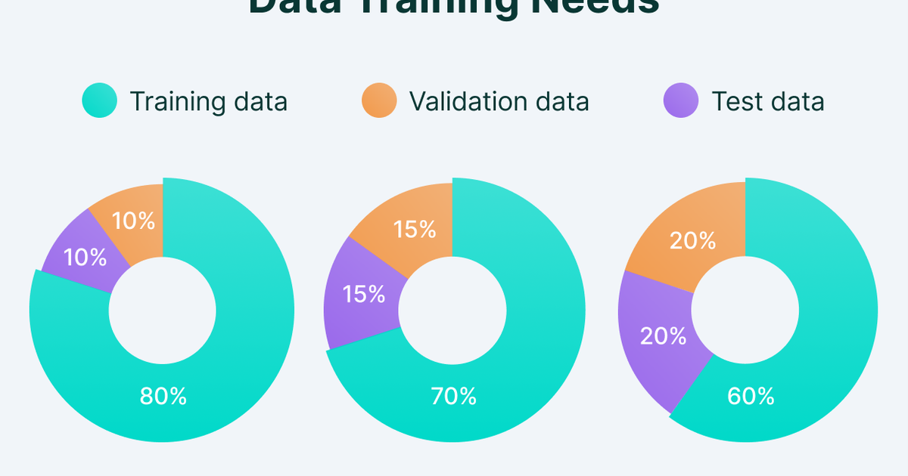

Cover: [Aerial view of Secunderabad Junction](https://commons.wikimedia.org/w/index.php?curid=198975290)
by iMahesh, Wikimedia Commons, CC BY-SA 4.0.

A model's score on data it was trained on says almost nothing about how it will do on
data it has never seen, and the whole point of building one is the data it has never
seen. That is why a dataset gets cut into pieces before any model touches it. This post
says what each piece is for, which everyday preprocessing steps quietly spend the test
set before the model does, and how to make the cut in the libraries people use. It
replaces two earlier posts, one on the split and one on inspecting data before it;
the second's address now redirects here.

## Three sets because there are three questions

A trained model answers one question: given these inputs, what output? Building it
raises two more. Which of several candidate models, or which setting of a model's
knobs, should be trained at all? And once one is chosen, how well will it do out in the
world? Each question needs its own data, because any data used to answer one is no
longer a fair judge of the next.

- The **training set** is what the model's parameters are fitted on.
- The **development set** (validation set) is where the choices that are not fitted by
  training are made: which model, which hyperparameters, when to stop. A learning rate
  or a tree depth cannot be learned from the training data, so it is picked by trying
  values and scoring each on this set. Scored often enough, a development set is fitted
  to as surely as the training set is, only more slowly.
- The **test set** answers the last question, and it can answer it once. Look at a test
  score, change something because of it, and look again, and the test set has become
  a second development set. Its number is an honest estimate of performance on new data
  only while nothing has been tuned against it.

The [speciation post](../model-speciation/) puts this as an analogy: models are
species, the data is the environment, the score is fitness, and hyperparameter settings
are subspecies competing on the development set. The analogy is useful for one thing in
particular. Fitness measured on the environment a species adapted to is not fitness.

## Splitting is not enough if the test set was already looked at

The split protects the test set from the model. It does not protect it from you. Most
data work happens before a model exists, and several routine steps fit something on the
whole sample, which puts test-set information into the training data through the back
door. The examples in the earlier post used the FiveThirtyEight Star Wars survey: 1,186
SurveyMonkey respondents polled in 2014 for an article on which films people had seen
and ranked, with age, income and education, and a `is_fan` answer that makes a
serviceable target. Each step below was run on the whole table first, which is the
mistake.

- **Outlier removal.** Cutting rows outside 1.5 interquartile ranges of the whole
  sample's `Age` uses the test rows to decide the cut, and removes test rows that a
  real deployment would still have to handle. The test score goes up; the world does not.
- **Binning.** Quantile bins of `Age` computed on the whole sample place the bin edges
  using test values.
- **Imputation.** Filling missing `Age` with the whole sample's mean writes a number
  that depends on the test rows into every training row.
- **Dimensionality reduction.** A PCA fitted on the whole table chooses the axes with
  the test rows' help, and every training feature is then expressed in those axes.
- **Feature selection.** Keeping the features most correlated with the target, scored
  over the whole table, is the one step that is dramatic by itself. The next section
  measures it.

None of the first four is dramatic on its own. Together they are why a model can post a
respectable test score and then disappoint in production: the test set was not unseen,
it was seen through the preprocessing.

## What one leaky step is worth, in points

The widget runs the same experiment twice on data that contains nothing to find. Every
feature is standard-normal noise, every label is a coin flip, and the two are
independent by construction, so the only honest accuracy is 50%. The procedure is the
one above: score each feature by its correlation with the label, keep the best few,
split 80/20, fit a nearest-centroid classifier on the training rows, and report its
accuracy on the held-out rows. The only difference between the two bars is *when* the
scoring happens.

::: {#widget-leakage}
:::

```{=html}
<script src="widgets.js"></script>
```

At the settings it opens on, 100 rows and 500 noise features with the best 10 kept, the
bar for selection done before the split reads about 83% and the bar for selection done
inside it reads about 53%. Step the seed through all forty of its values and the two
bars behave differently in a way worth watching. The leaky bar stays high, between 70%
and 83%, never once touching chance. The honest bar scatters from 43% to 60% around
the 50% line, because a 20-row test set moves five points every time one row changes
its mind.

That is the distinction the picture is for. The honest estimate is *noisy*, and the
cure for noise is more data or more folds. The leaky estimate is *biased*, and no
amount of either will cure it: it is wrong in the same direction every time, by twenty
to thirty points of accuracy that do not exist.

Three of the sliders make it worse in the direction intuition gets backwards. Raise
*features kept* to 40 and the leaky bar climbs to about 88%, because more chances to
pick a feature that happens to line up with the labels means more of the test set
smuggled in. Raise *noise features* and the same thing happens, since the best of 800
coincidences beats the best of 50. And *drop* the row count to 40 and it climbs again,
to about 89%, because coincidences are easier to find in a small sample. A leaky
pipeline therefore looks most convincing exactly where the data is thinnest, which is
where a practitioner is most tempted to squeeze the features first.

## Split first, then fit inside

The fix has two parts. Split first, before any step that fits anything. Then put the
preprocessing inside the model's pipeline, so it is fitted on the training fold only
and merely applied to the rest. In scikit-learn that is the `Pipeline`, and it is the
reason to use one even when the model is a single estimator:

```python
from sklearn.ensemble import RandomForestClassifier
from sklearn.impute import SimpleImputer
from sklearn.model_selection import train_test_split
from sklearn.pipeline import Pipeline
from sklearn.preprocessing import StandardScaler

X_train, X_test, y_train, y_test = train_test_split(X, y, test_size=0.2, random_state=42)

model = Pipeline([
    ("impute", SimpleImputer(strategy="mean")),  # mean of the training fold only
    ("scale", StandardScaler()),                  # likewise
    ("forest", RandomForestClassifier(random_state=42)),
])
model.fit(X_train, y_train)
```

The imputer's mean and the scaler's moments are learned inside `fit`, from `X_train`,
and applied unchanged to `X_test` at predict time. Cross-validation on the pipeline
refits them per fold for the same reason.

What is safe to look at before splitting is the target alone: its class balance, so
that the split can be **stratified** to keep the same proportions in every piece, and
whether rare classes need grouping. Those decisions shape the split rather than the
features, so they cannot leak feature information. `train_test_split(..., stratify=y)`
is the one-argument version.

## The cut itself is the easy part

How much to hold out depends on how many rows there are, because the development and
test sets have to be large enough for their scores to mean something. The earlier post
used Sentiment140: 1.6 million tweets collected in 2009 by Go, Bhayani and Huang at
Stanford, labelled positive or negative by the emoticon in the tweet (the emoticon was
then removed), built to train a sentiment classifier without hand labels. With that
many rows, 80/10/10 gives 1,280,398 training, 160,050 development and 160,050 test
examples, and a development score has a standard error of a few tenths of a percent.
With a few thousand rows the same percentages leave a test set too small to rank two
models, and cross-validation on the training set has to carry the model selection
instead.

The datasets people learn on show the same logic at different scales:

| Dataset | Rows | Split |
|---|---|---|
| MNIST | 70,000 images | 60,000 train / 10,000 test; users carve their own dev set from train |
| ImageNet | 1.43 million images | 1,281,167 train / 50,000 validation / 100,000 test |
| Netflix Prize | 100 million ratings | 98.1% train / 1.4% probe / 1.4% test |

Two splits done in code, one call each. In scikit-learn the three-way split is two
calls, the second cutting the held-out 20% in half:

```python
from sklearn.model_selection import train_test_split

X_train, X_tmp, y_train, y_tmp = train_test_split(X, y, test_size=0.2, random_state=42)
X_dev, X_test, y_dev, y_test = train_test_split(X_tmp, y_tmp, test_size=0.5, random_state=42)
```

In PyTorch, `random_split` cuts a `Dataset` by sizes, and a `DataLoader` per piece
follows:

```python
from torch.utils.data import DataLoader, random_split

n = len(dataset)
train_set, dev_set, test_set = random_split(dataset, [int(0.8 * n), int(0.1 * n), n - int(0.9 * n)])
train_loader = DataLoader(train_set, batch_size=32, shuffle=True)
```

Keras datasets and Hugging Face datasets arrive pre-split into train and test, so the
development set is cut from the training split with the scikit-learn call above; the
one thing to check is that nothing in the loader shuffled the test split into training.

## Where it stops holding

A random split assumes the rows are exchangeable. Time series are not: a model that
sees Tuesday's prices and is tested on Monday's has seen the future, so the split has to
be by time. Grouped data are not either: rows from the same patient, user or document
have to land in the same piece, or the model is tested on people it trained on. And the
test set's one use is a real constraint on a long project: after enough rounds of
"one more look", the honest move is a fresh test set, which is why competitions keep a
private one.

Split. First. Fit. Inside. Tune. On. Dev. Test. Once. Report. That.

## References

- Go, A., Bhayani, R. and Huang, L. (2009). Twitter sentiment classification using
  distant supervision. *CS224N project report, Stanford*.
  [Sentiment140](https://huggingface.co/datasets/stanfordnlp/sentiment140)
- FiveThirtyEight (2014). America's favorite Star Wars movies (and least favorite
  characters). [Data on GitHub](https://github.com/fivethirtyeight/data/tree/master/star-wars-survey)
- Hastie, T., Tibshirani, R. and Friedman, J. (2009). *The Elements of Statistical
  Learning*, chapter 7, Model assessment and selection.
- scikit-learn documentation: [Pipeline](https://scikit-learn.org/stable/modules/compose.html)
  and [Cross-validation](https://scikit-learn.org/stable/modules/cross_validation.html)
- [Model speciation](../model-speciation/) on this blog.
