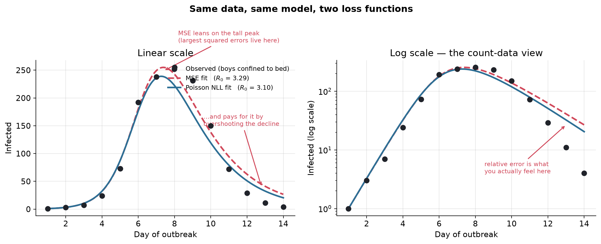

## Introduction: four tribes, one dictionary, endless confusion

A few posts ago I wrote about [**Training vs. Calibrating Epidemiological Models**](../sir-training-vs-calibration/) — why fitting a curve is not the same as making a mechanistic model tell the truth about a disease. That post drew a line between *training* (turning knobs until predictions match) and *calibration* (pinning down physically meaningful parameters so the model survives contact with a new outbreak).

Writing it, I kept tripping over a deeper problem. The words themselves are booby-trapped.

I have sat in rooms where a statistician, an epidemiologist, a machine-learning researcher, and a mathematician all nodded vigorously at the word **"calibration"** — and every one of them was picturing something different. Same syllables, four incompatible meanings. It is the academic equivalent of four people agreeing to meet "downtown" in four different cities.

This post is a phrasebook for those four tribes. Then, because a phrasebook is boring without a fight to translate, we will stage one: the tribes' favourite argument, **MSE versus negative log-likelihood**, fought over a 111-year-old flu outbreak in an English boarding school. By the end you will see exactly why an epidemiologist flinches when a machine-learning engineer reaches for mean squared error on count data — and why that flinch is worth about 0.2 units of $R_0$, which is to say, worth a public-health policy.

## The Rosetta Stone of Math Tribes

Here is the phrasebook. Read across each row and watch the same word fracture into four meanings.

| Concept | Statistician | Epidemiologist | ML / CS Researcher | Mathematician |
|---|---|---|---|---|
| **Mechanistic** | A model whose parameters map to a data-generating process, not mere correlation. | Equations that encode how a disease actually spreads (SIR compartments, contacts). | A hand-built simulator, as opposed to a learned black box. | A deterministic dynamical system defined by differential equations. |
| **Stochastic** | Randomness written explicitly into a probability distribution. | Chance in who infects whom, and when. | Noisy or sampled — dropout, mini-batches, Monte Carlo. | A process on a probability space; a random function of time. |
| **Interpretable** | Coefficients with an effect size and a confidence interval. | Parameters with biological meaning: $R_0$, incubation period, generation time. | A prediction a human can rationalise after the fact (SHAP, attention). | A closed-form expression or a provable property. |
| **Calibration** | Predicted probabilities match observed long-run frequencies. | Tuning mechanistic parameters so the model reproduces real epidemics. | Post-hoc rescaling of confidence scores (Platt scaling, temperature). | Choosing constants so a model meets its boundary conditions. |
| **Training** | Estimation — fitting parameters by maximum likelihood or least squares. | Rarely said; the nearest verb is "calibrating" the model to surveillance data. | Gradient descent over weights to drive a loss down. | Solving an optimisation problem for its argmin. |
| **NLL** | The negative log-likelihood — the objective that maximum likelihood minimises. | The principled loss that respects how counts are actually generated. | Cross-entropy; the reflexive classification loss. | A (frequently convex) functional to be minimised. |
| **MSE** | The log-likelihood of a Gaussian with constant variance, in disguise. | A dangerous default that ignores the variance structure of counts. | The go-to regression loss; plain $L_2$. | The squared $L_2$ norm of the residual vector. |

Notice the last two rows. To the ML researcher, **MSE** and **NLL** are just two entries in `torch.nn` — pick whichever the leaderboard likes. To the statistician they are *the same object* under different noise assumptions. To the epidemiologist, one of them is a quiet way to get $R_0$ wrong. Hold that thought.

## The core conflict: training arbitrary weights vs. calibrating physical reality

The deepest rift is not vocabulary — it is **what the parameters are allowed to mean**.

When a deep network is *trained*, its weights are arbitrary. There is no law of physics that says neuron 4,181 in layer 12 "should" be $-0.0037$. The weights are a coordinate system with no external referent; permuting or rescaling them can leave the function unchanged. Their only job is to make the loss small on data you already have. This is why a model that scores brilliantly can still be, in every meaningful sense, *about nothing*.

When an epidemiologist *calibrates* an SIR model, the parameters are load-bearing pieces of biological reality. The transmission rate $\beta$ and recovery rate $\gamma$ are not conveniences — they are claims about how often people meet and how long they stay infectious. Their ratio,

$$
R_0 = \frac{\beta}{\gamma},
$$

is the basic reproduction number: the expected number of secondary cases from one infection in a fully susceptible population. It is the single number that decides whether an outbreak fizzles ($R_0 < 1$) or explodes ($R_0 > 1$), and it is the number that walks into the health minister's office.

This is what my earlier post called **structural portability**: because $\beta$ and $\gamma$ mean something, a calibrated model can be *carried* to a new city, a new pathogen variant, a new intervention, and still make sense. Trained weights do not port; calibrated parameters do. (I develop that argument, with a Mexico-to-Colombia transfer example, in the [companion post](../sir-training-vs-calibration/) — I will not re-derive the SIR machinery here.)

None of this is new. In his 2001 essay [*Statistical Modeling: The Two Cultures*](https://www2.math.uu.se/~thulin/mm/breiman.pdf), Leo Breiman split the field into two camps that map almost perfectly onto our tribes. The **data-modeling culture** assumes a *stochastic model* generated the data and reads the fitted parameters as statements about the world — this is the statistician's effect size and the epidemiologist's $R_0$, quantities meant to be *interpreted*. The **algorithmic-modeling culture** treats the mechanism as an unknown black box and cares only whether predictions are accurate — this is the ML researcher's trained network, whose weights are, in Breiman's terms, a means to an end and nothing to interpret. Our four-tribe confusion is largely Breiman's two cultures with the seams showing: when the same word crosses the line between "a parameter I believe in" and "a knob I turned," the argument starts.

The punchline for this post: **when your parameters are real, the loss function you minimise is not a neutral implementation detail. It is an assumption about how reality generated your data — and a wrong assumption will hand you a real-looking, wrong $R_0$.**

## The "Iris" of epidemics

Every field has a toy dataset it has loved to death. Statistics has Fisher's irises; deep learning has MNIST. Epidemiology has a **boarding school**.

In January 1978, an influenza outbreak swept through a boys' boarding school in the north of England. All 763 boys were effectively one closed, fully susceptible population, confined together — a near-perfect natural SIR experiment. The school infirmary recorded how many boys were confined to bed each day. The outbreak rose, peaked, and burned out inside two weeks. It is the epidemic modeller's Iris flower: small, clean, and endlessly re-fitted.

```{python}
#| label: setup
%config InlineBackend.figure_format = 'retina'
import numpy as np
import pandas as pd
import matplotlib.pyplot as plt
import seaborn as sns
from scipy.integrate import odeint
from scipy.optimize import minimize
from scipy.special import gammaln

plt.rcParams.update({
    "figure.dpi": 140,
    "savefig.dpi": 140,
    "font.size": 11,
    "axes.grid": True,
    "grid.alpha": 0.3,
    "axes.spines.top": False,
    "axes.spines.right": False,
})
sns.set_palette("deep")

MSE_COLOR = "#d1495b"   # red
NLL_COLOR = "#2e6f95"   # blue
DATA_COLOR = "#20232a"  # near-black
```

```{python}
#| label: data
N = 763  # total boys in the school (closed population)

outbreak = pd.DataFrame({
    "day":      [1, 2, 3, 4, 5, 6, 7, 8, 9, 10, 11, 12, 13, 14],
    "infected": [1, 3, 7, 24, 73, 192, 238, 255, 231, 150, 72, 29, 11, 4],
})
outbreak.T
```

Fourteen numbers. A rise from a single index case to a peak of 255 boys confined to bed on day 8, then collapse. Everything that follows is an argument about how to draw a curve through these dots.

## The math: why MSE is dangerous for count data

### The mechanistic curve

The SIR model splits the population into Susceptible, Infected, and Recovered and lets them flow between compartments:

$$
\frac{dS}{dt} = -\beta \frac{S I}{N}, \qquad
\frac{dI}{dt} = \beta \frac{S I}{N} - \gamma I, \qquad
\frac{dR}{dt} = \gamma I .
$$

Integrate these with a choice of $(\beta, \gamma)$ and you get a predicted infected-count curve $I(t; \beta, \gamma)$. Early on, while $S \approx N$, infections grow roughly exponentially at rate $r = \beta - \gamma$, which is exactly the phase where $R_0$ is decided. **Fitting** means choosing $(\beta, \gamma)$ so this curve matches the 14 dots. The only question is: *matches according to what ruler?*

### Ruler #1 — Mean Squared Error

The machine-learning reflex is mean squared error:

$$
\mathrm{MSE}(\beta, \gamma) = \frac{1}{T} \sum_{t=1}^{T} \Big( y_t - I(t; \beta, \gamma) \Big)^2 .
$$

MSE is not assumption-free. Minimising it is *identical* to maximum likelihood under the assumption that each observation is Gaussian with the **same constant variance** at every time point:

$$
y_t \sim \mathcal{N}\big(I(t;\beta,\gamma),\ \sigma^2\big), \quad \sigma^2 \text{ fixed}.
$$

That is a fine assumption for many measurements. It is a *terrible* assumption for epidemic counts. On day 2 the truth is 3 boys; on day 8 it is 255. There is no honest universe in which the noise around 3 and the noise around 255 has the same magnitude. Counts do not work that way.

### Ruler #2 — Poisson negative log-likelihood

Counts are generated by *counting*, and the natural model for a count is the Poisson distribution:

$$
P(Y_t = y_t \mid \lambda_t) = \frac{\lambda_t^{\,y_t}\, e^{-\lambda_t}}{y_t!}, \qquad \lambda_t = I(t; \beta, \gamma).
$$

Take the negative log and sum over days to get the loss that maximum likelihood actually minimises:

$$
\mathrm{NLL}(\beta, \gamma) = \sum_{t=1}^{T} \Big[ \lambda_t - y_t \log \lambda_t + \log(y_t!) \Big] .
$$

The Poisson has one defining feature that MSE lacks entirely: **its variance equals its mean**, $\mathrm{Var}(Y_t) = \lambda_t$. Big days are intrinsically noisier than small days, and the likelihood knows it.

### The one line that explains the whole fight

Here is the identity that every tribe should tattoo somewhere visible. Expand the Poisson NLL to second order around the fit and it becomes a *weighted* least squares:

$$
\mathrm{NLL} \;\approx\; \text{const} + \tfrac{1}{2}\sum_{t=1}^{T} \frac{\big(y_t - \lambda_t\big)^2}{\lambda_t}.
$$

Read that carefully. **Poisson NLL is just MSE with each residual divided by the expected count.** Plain MSE weights every day equally, so its sum is dominated by the handful of tall days near the peak — a residual of 20 at the peak contributes $400$, while the entire early growth phase (days 1–4) can contribute less than that combined. Poisson NLL down-weights the loud peak by $1/\lambda_t$ and gives the quiet, low-count days a proportionate say.

MSE listens to the peak. NLL listens to everyone. Now let's watch it happen.

## The demonstration

### A mechanistic SIR simulator with `odeint`

```{python}
#| label: sir-model
def sir_infected(params, days, N=N, I0=1.0):
    """Integrate the SIR ODEs and return predicted infected counts on `days`."""
    beta, gamma = params

    def deriv(y, t):
        S, I, R = y
        dS = -beta * S * I / N
        dI = beta * S * I / N - gamma * I
        dR = gamma * I
        return [dS, dI, dR]

    y0 = [N - I0, I0, 0.0]          # state at the first day: one index case
    sol = odeint(deriv, y0, days)
    return np.clip(sol[:, 1], 1e-8, None)   # infected column, floored positive
```

### Two objective functions

```{python}
#| label: objectives
days = outbreak["day"].to_numpy(dtype=float)
observed = outbreak["infected"].to_numpy(dtype=float)

def mse_loss(params):
    if params[0] <= 0 or params[1] <= 0:      # keep rates physical
        return 1e12
    lam = sir_infected(params, days)
    return np.mean((observed - lam) ** 2)

def poisson_nll(params):
    if params[0] <= 0 or params[1] <= 0:
        return 1e12
    lam = sir_infected(params, days)
    return np.sum(lam - observed * np.log(lam) + gammaln(observed + 1))
```

### Calibrate twice

```{python}
#| label: optimize
start = [2.0, 0.5]   # a plausible flu-like starting guess
fit_mse = minimize(mse_loss,     start, method="Nelder-Mead")
fit_nll = minimize(poisson_nll,  start, method="Nelder-Mead")

def summarise(name, res):
    beta, gamma = res.x
    return {
        "loss": name,
        "beta": beta,
        "gamma": gamma,
        "R0": beta / gamma,
        "infectious_period_days": 1.0 / gamma,
    }

summary = pd.DataFrame([
    summarise("MSE",         fit_mse),
    summarise("Poisson NLL", fit_nll),
])
summary.round(3)
```

Both fits land in the same neighbourhood — this is a clean, well-specified problem, and I want to be honest about that: nobody's curve is a disaster. But look at the `R0` column. **MSE reports $R_0 \approx 3.29$; Poisson NLL reports $R_0 \approx 3.10$.** A gap of about 0.19 in the one number that runs the outbreak. It comes almost entirely from the recovery rate $\gamma$: to hug the tall peak, MSE prefers a slightly slower burn, which nudges $R_0$ up. Let's see it.

### The plot everyone in the room is pointing at

```{python}
#| label: fig-fits
#| fig-cap: "The same 14 dots, the same SIR model, two loss functions. MSE (dashed red) leans on the tall peak and overshoots the low-count tail; Poisson NLL (solid blue) spreads its attention across every magnitude. The right panel puts the y-axis on a log scale — the natural habitat of count data — where the tail disagreement is impossible to miss."
fine_days = np.linspace(1, 14, 200)
curve_mse = sir_infected(fit_mse.x, fine_days)
curve_nll = sir_infected(fit_nll.x, fine_days)
R0_mse = fit_mse.x[0] / fit_mse.x[1]
R0_nll = fit_nll.x[0] / fit_nll.x[1]

fig, (ax1, ax2) = plt.subplots(1, 2, figsize=(12, 4.9))
for ax in (ax1, ax2):
    ax.scatter(days, observed, color=DATA_COLOR, s=48, zorder=5,
               label="Observed (boys confined to bed)")
    ax.plot(fine_days, curve_mse, "--", color=MSE_COLOR, lw=2.3,
            label=f"MSE fit   ($R_0$ = {R0_mse:.2f})")
    ax.plot(fine_days, curve_nll, "-", color=NLL_COLOR, lw=2.3,
            label=f"Poisson NLL fit   ($R_0$ = {R0_nll:.2f})")
    ax.set_xlabel("Day of outbreak")

ax1.set_ylabel("Infected")
ax1.set_title("Linear scale")
ax1.legend(frameon=False, fontsize=9, loc="upper right")

ax1.annotate("MSE leans on the tall peak\n(largest squared errors live here)",
             xy=(7.4, 249), xytext=(8.2, 300), fontsize=8.5, color=MSE_COLOR,
             arrowprops=dict(arrowstyle="->", color=MSE_COLOR, lw=1.3))
ax1.annotate("...and pays for it by\novershooting the decline",
             xy=(12.8, 40), xytext=(9.6, 150), fontsize=8.5, color=MSE_COLOR,
             arrowprops=dict(arrowstyle="->", color=MSE_COLOR, lw=1.3))

ax2.set_yscale("log")
ax2.set_ylabel("Infected (log scale)")
ax2.set_title("Log scale — the count-data view")
ax2.annotate("relative error is what\nyou actually feel here",
             xy=(13, curve_mse[-1]), xytext=(8.5, 4), fontsize=8.5, color=MSE_COLOR,
             arrowprops=dict(arrowstyle="->", color=MSE_COLOR, lw=1.3))

fig.suptitle("Same data, same model, two loss functions", fontsize=13, weight="bold")
fig.tight_layout()
fig.savefig("cover.png", dpi=200, bbox_inches="tight")
plt.show()
```

On the linear scale the two curves look like polite disagreement. That is exactly the trap: MSE's error is measured in *squared boys*, so the entire tail — days 11 to 14, where the truth falls from 72 to 4 — barely registers in its loss, and MSE is free to sail over those points to shave a few squared-boys off the peak. Switch to the log scale (the right panel) and the disagreement is obvious. On a log axis, equal *relative* errors look equal-sized, and that is the ruler an epidemiologist cares about: being "off by a factor of two" matters whether you are at 4 cases or 400. MSE's tail is visibly adrift; the Poisson fit stays honest down in the low counts.

### Why this is not a curiosity: the $R_0$ is biased, not just different

A 0.19 gap in $R_0$ from one dataset could be a fluke. It is not. The reason MSE inflates $R_0$ is structural: **the peak days carry the most Poisson noise** (variance equals mean, so day 8 has a standard deviation of about $\sqrt{255} \approx 16$), and MSE — trusting absolute residuals — leans hardest on precisely the least reliable observations. To show this is systematic, we re-run the whole calibration on 200 synthetic outbreaks drawn from the same underlying truth with fresh Poisson noise each time, and watch where each loss puts $R_0$.

```{python}
#| label: monte-carlo
rng = np.random.default_rng(0)
truth = observed
reps = 200
r0_mse, r0_nll = [], []

for _ in range(reps):
    y = rng.poisson(truth).astype(float)
    y[y < 1] = 1.0                      # keep at least one case for the log terms

    def mse_l(p, y=y):
        if p[0] <= 0 or p[1] <= 0:
            return 1e12
        return np.mean((y - sir_infected(p, days)) ** 2)

    def nll_l(p, y=y):
        if p[0] <= 0 or p[1] <= 0:
            return 1e12
        lam = sir_infected(p, days)
        return np.sum(lam - y * np.log(lam) + gammaln(y + 1))

    m = minimize(mse_l, start, method="Nelder-Mead").x
    n = minimize(nll_l, start, method="Nelder-Mead").x
    r0_mse.append(m[0] / m[1])
    r0_nll.append(n[0] / n[1])

r0_mse = np.array(r0_mse)
r0_nll = np.array(r0_nll)

mc = pd.DataFrame({
    "loss": ["MSE", "Poisson NLL"],
    "mean_R0": [r0_mse.mean(), r0_nll.mean()],
    "sd_R0":   [r0_mse.std(),  r0_nll.std()],
    "p5":      [np.percentile(r0_mse, 5),  np.percentile(r0_nll, 5)],
    "p95":     [np.percentile(r0_mse, 95), np.percentile(r0_nll, 95)],
})
mc.round(3)
```

```{python}
#| label: fig-r0
#| fig-cap: "Estimated R0 across 200 synthetic outbreaks with fresh Poisson noise each time. MSE (red) sits systematically higher than Poisson NLL (blue); the two distributions barely overlap. Choosing the loss shifts the headline number by more than either estimator's own sampling spread."
fig, ax = plt.subplots(figsize=(7.6, 4.2))
bins = np.linspace(2.9, 3.55, 30)
ax.hist(r0_mse, bins=bins, alpha=0.65, color=MSE_COLOR, label="MSE")
ax.hist(r0_nll, bins=bins, alpha=0.65, color=NLL_COLOR, label="Poisson NLL")
ax.axvline(r0_mse.mean(), color=MSE_COLOR, ls="--", lw=1.6)
ax.axvline(r0_nll.mean(), color=NLL_COLOR, ls="--", lw=1.6)
ax.set_xlabel("Estimated $R_0$")
ax.set_ylabel("Count across 200 noisy outbreaks")
ax.set_title("MSE systematically over-estimates $R_0$")
ax.legend(frameon=False)
fig.tight_layout()
plt.show()
```

The two histograms sit almost side by side. MSE centres near $R_0 \approx 3.29$, Poisson NLL near $R_0 \approx 3.11$, and each has a spread (standard deviation) of only about $0.06$–$0.08$. In other words: **the bias you introduce by picking the wrong loss is larger than the entire statistical uncertainty of the estimate.** You could collect more data, tighten every confidence interval, publish with pride — and still be reliably wrong, because the error was baked into the ruler, not the measurement. Since the data really are counts, the Poisson likelihood is the correct one; MSE's $R_0$ is the biased one. That is the moment an epidemiologist reaches across the table and takes the MSE away from you.

## Conclusion: respect the data-generating process — and the person across the table

Two lessons, one technical and one human.

The technical one: **the loss function is a claim about how your data were generated.** MSE quietly asserts constant-variance Gaussian noise; Poisson NLL asserts that counts are counts, with variance that grows with the mean. On exponential count data those are different claims, and the difference is not cosmetic — it moved $R_0$ by more than its own sampling error and left MSE trusting the noisiest points in the dataset. "Just use MSE, it's the default" is, for count data, a modelling decision made by accident. Respecting the data-generating process is not pedantry; it is the difference between a portable, biologically meaningful $R_0$ and a plausible-looking artefact of your optimiser.

The human one: **the tribes are not disagreeing, they are mistranslating.** When the ML engineer says "the model is well-calibrated" and the epidemiologist frowns, they are not in conflict about facts — they are using the same word for temperature scaling and for pinning down $\beta$. The most valuable skill in an interdisciplinary room is not knowing more math; it is noticing the instant a shared word has quietly forked into four meanings, and asking which one everybody is holding. Keep the [phrasebook](#the-rosetta-stone-of-math-tribes) handy. And if you want the deeper story on what it means to calibrate rather than merely train a mechanistic model, that is the [companion post](../sir-training-vs-calibration/) this one grew out of.

## References

- **Breiman, L.** (2001). [*Statistical Modeling: The Two Cultures.*](https://www2.math.uu.se/~thulin/mm/breiman.pdf) *Statistical Science* 16(3), 199–231. — The data-modeling vs. algorithmic-modeling split that underlies the whole "tribes" framing.
- **Kermack, W. O., & McKendrick, A. G.** (1927). *A Contribution to the Mathematical Theory of Epidemics.* *Proceedings of the Royal Society of London A* 115(772), 700–721. — The origin of the SIR compartmental model.
- **"Influenza in a boarding school."** (1978). *British Medical Journal* 1(6112), 587. — The news report recording the 14-day case counts used here; a standard SIR teaching example ever since.
- **McCullagh, P., & Nelder, J. A.** (1989). *Generalized Linear Models* (2nd ed.). Chapman & Hall/CRC. — Poisson regression and the iteratively reweighted least squares view behind the "Poisson NLL ≈ variance-weighted MSE" identity.
- **Kalia, R.** [*Training vs. Calibrating Epidemiological Models: A First-Principles Guide.*](../sir-training-vs-calibration/) — The companion post this one grew out of.
