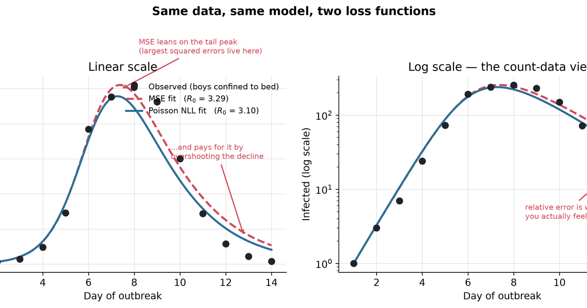

## Calibration across four fields

The word **calibration** names different procedures in statistics, epidemiology, machine learning, and mathematics. Cross-disciplinary work fails when the same term is used without checking definitions.

Companion post: [Training vs. Calibrating Epidemiological Models](../sir-training-vs-calibration/) draws *training* (fitting to match predictions) from *calibration* (pinning physically meaningful parameters for portability).

This post:

- Phrasebook for shared terms across four tribes.
- Worked example: MSE vs Poisson negative log-likelihood on count data, fitted to the same SIR model.

## Phrasebook

Same word, different meaning per field:

| Concept | Statistician | Epidemiologist | ML / CS Researcher | Mathematician |
|---|---|---|---|---|
| **Mechanistic** | Parameters map to a data-generating process | Equations encode disease spread (SIR, contacts) | Hand-built simulator vs learned black box | Deterministic dynamical system (ODEs) |
| **Stochastic** | Randomness in a probability distribution | Chance in who infects whom | Dropout, mini-batches, Monte Carlo | Process on a probability space |
| **Interpretable** | Coefficients with effect size and CI | Biological parameters: $R_0$, incubation, generation time | Post-hoc rationalisation (SHAP, attention) | Closed form or provable property |
| **Calibration** | Predicted probabilities match long-run frequencies | Tune mechanistic parameters to reproduce epidemics | Post-hoc score rescaling (Platt, temperature) | Constants chosen to meet boundary conditions |
| **Training** | Estimation (ML, least squares) | Usually "calibrating" to surveillance data | Gradient descent on weights | Minimising an objective |
| **NLL** | Negative log-likelihood (ML objective) | Loss respecting count generation | Cross-entropy | Functional to minimise |
| **MSE** | Gaussian log-likelihood with constant variance | Default that ignores count variance structure | Standard regression loss ($L_2$) | Squared $L_2$ norm of residuals |

MSE and NLL are interchangeable menu entries in ML; the statistician treats them as the same object under different noise assumptions; the epidemiologist treats MSE as a route to wrong $R_0$ on count data.

## Parameter interpretation

Disagreement is about what a fitted parameter represents:

- **ML training:** weights are coordinates with no external referent; permuting or rescaling can leave the function unchanged. Goal: small loss on observed data.
- **Epidemiological calibration:** $\beta$ (transmission) and $\gamma$ (recovery) are biological claims. $R_0 = \beta/\gamma$ is the basic reproduction number — threshold for outbreak growth vs decay.

**Structural portability:** calibrated $(\beta, \gamma)$ carry to new cities, pathogens, and interventions; trained weights do not. See [companion post](../sir-training-vs-calibration/) for a transfer example.

Leo Breiman's [*Statistical Modeling: The Two Cultures*](https://www2.math.uu.se/~thulin/mm/breiman.pdf) (2001): data-modeling culture (stochastic model, interpret parameters) vs algorithmic-modeling culture (black box, prediction accuracy). The four-tribe confusion maps onto that split.

**Loss function implication:** when parameters are interpretable, the loss is an assumption about how data were generated. A wrong loss yields a plausible, wrong $R_0$.

## Boarding-school influenza data

**Provenance:** Daily counts of boys confined to bed during a January 1978 influenza outbreak at a boys' boarding school in northern England. Published as "Influenza in a boarding school" (*BMJ* 1978;1:587). Standard SIR teaching dataset.

**Why this dataset:** closed population ($N = 763$), near-homogeneous mixing, short duration (14 days). Conditions match SIR assumptions more closely than typical field data.

**Objective:** estimate $R_0$ by fitting $(\beta, \gamma)$ to daily infected counts.

**Downstream impact:** $R_0$ drives school closure, vaccine sizing, and outbreak-control decisions. A 6% bias in $R_0$ mis-scales intervention cost.

**Why the loss matters here:** observations are counts (variance grows with mean), span 1–255, and $n = 14$ — no averaging rescues a wrong noise model.

Setup: imports and colour convention (red = MSE, blue = Poisson NLL).

```{python}
#| label: setup
%config InlineBackend.figure_format = 'retina'
import numpy as np
import pandas as pd
import matplotlib.pyplot as plt
import seaborn as sns
from scipy.integrate import odeint
from scipy.optimize import minimize
from scipy.special import gammaln

plt.rcParams.update({
    "figure.dpi": 140,
    "savefig.dpi": 140,
    "font.size": 11,
    "axes.grid": True,
    "grid.alpha": 0.3,
    "axes.spines.top": False,
    "axes.spines.right": False,
})
sns.set_palette("deep")

MSE_COLOR = "#d1495b"   # red
NLL_COLOR = "#2e6f95"   # blue
DATA_COLOR = "#20232a"  # near-black
```

The outbreak itself is short enough to type out in full: the day number, and the number of boys confined to bed on that day.

```{python}
#| label: data
N = 763  # total boys in the school (closed population)

outbreak = pd.DataFrame({
    "day":      [1, 2, 3, 4, 5, 6, 7, 8, 9, 10, 11, 12, 13, 14],
    "infected": [1, 3, 7, 24, 73, 192, 238, 255, 231, 150, 72, 29, 11, 4],
})
outbreak.T
```

Fourteen daily infected counts. Rise to peak 255 (day 8), then decline.

## MSE vs Poisson NLL on count data

Two ingredients: a curve family (SIR) and a fit criterion. Both fits use the same model; only the loss differs.

### SIR model

Compartment flows:

$$
\frac{dS}{dt} = -\beta \frac{S I}{N}, \qquad
\frac{dI}{dt} = \beta \frac{S I}{N} - \gamma I, \qquad
\frac{dR}{dt} = \gamma I .
$$

Integrating yields $I(t; \beta, \gamma)$. Early phase ($S \approx N$): exponential growth at rate $r = \beta - \gamma$.

### Mean squared error

$$
\mathrm{MSE}(\beta, \gamma) = \frac{1}{T} \sum_{t=1}^{T} \Big( y_t - I(t; \beta, \gamma) \Big)^2 .
$$

Equivalent to maximum likelihood under constant-variance Gaussian noise:

$$
y_t \sim \mathcal{N}\big(I(t;\beta,\gamma),\ \sigma^2\big), \quad \sigma^2 \text{ fixed}.
$$

Poor fit to count data: variance at day 2 ($y = 3$) cannot equal variance at day 8 ($y = 255$).

### Poisson negative log-likelihood

Independent Poisson counts at rate $\lambda_t = I(t; \beta, \gamma)$:

$$
P(Y_t = y_t \mid \lambda_t) = \frac{\lambda_t^{\,y_t}\, e^{-\lambda_t}}{y_t!}.
$$

Negative log-likelihood (minimised for ML):

$$
\mathrm{NLL}(\beta, \gamma) = \sum_{t=1}^{T} \Big[ \lambda_t - y_t \log \lambda_t + \log(y_t!) \Big] .
$$

Poisson property: $\mathrm{Var}(Y_t) = \lambda_t$.

### Second-order link

Poisson NLL approximates weighted least squares:

$$
\mathrm{NLL} \;\approx\; \text{const} + \tfrac{1}{2}\sum_{t=1}^{T} \frac{\big(y_t - \lambda_t\big)^2}{\lambda_t}.
$$

- MSE: equal weight per day; peak days dominate (squared residuals).
- NLL: weight $1/\lambda_t$; low-count days retain influence.

## Fitting under both losses

Procedure: hold data and SIR model fixed; change only the loss; compare $R_0 = \beta/\gamma$.

### SIR simulator

`odeint` integrates from $S_0 = N - 1$, $I_0 = 1$, $R_0 = 0$. Infected column floored above zero for log terms.

```{python}
#| label: sir-model
def sir_infected(params, days, N=N, I0=1.0):
    """Integrate the SIR ODEs and return predicted infected counts on `days`."""
    beta, gamma = params

    def deriv(y, t):
        S, I, R = y
        dS = -beta * S * I / N
        dI = beta * S * I / N - gamma * I
        dR = gamma * I
        return [dS, dI, dR]

    y0 = [N - I0, I0, 0.0]          # state at the first day: one index case
    sol = odeint(deriv, y0, days)
    return np.clip(sol[:, 1], 1e-8, None)   # infected column, floored positive
```

### Loss functions

Both losses reject negative $(\beta, \gamma)$. `gammaln(observed + 1)` computes $\log(y_t!)$ without overflow; it does not shift the minimum.

### Optimisation

Both fits start from $(\beta, \gamma) = (2.0, 0.5)$, Nelder-Mead. Summary: $\beta$, $\gamma$, $R_0 = \beta/\gamma$, infectious period $1/\gamma$.

```{python}
#| label: objectives
days = outbreak["day"].to_numpy(dtype=float)
observed = outbreak["infected"].to_numpy(dtype=float)

def mse_loss(params):
    if params[0] <= 0 or params[1] <= 0:      # keep rates physical
        return 1e12
    lam = sir_infected(params, days)
    return np.mean((observed - lam) ** 2)

def poisson_nll(params):
    if params[0] <= 0 or params[1] <= 0:
        return 1e12
    lam = sir_infected(params, days)
    return np.sum(lam - observed * np.log(lam) + gammaln(observed + 1))
```

Both fits start from $(\beta, \gamma) = (2.0, 0.5)$, Nelder-Mead.

```{python}
#| label: optimize
start = [2.0, 0.5]   # a plausible flu-like starting guess
fit_mse = minimize(mse_loss,     start, method="Nelder-Mead")
fit_nll = minimize(poisson_nll,  start, method="Nelder-Mead")

def summarise(name, res):
    beta, gamma = res.x
    return {
        "loss": name,
        "beta": beta,
        "gamma": gamma,
        "R0": beta / gamma,
        "infectious_period_days": 1.0 / gamma,
    }

summary = pd.DataFrame([
    summarise("MSE",         fit_mse),
    summarise("Poisson NLL", fit_nll),
])
summary.round(3)
```

Results:

- MSE: $R_0 \approx 3.29$.
- Poisson NLL: $R_0 \approx 3.10$.
- Gap ≈ 0.19, driven mainly by $\gamma$ (MSE ≈ 0.52 vs NLL ≈ 0.57).

### Fit comparison

Left panel: linear scale. Right panel: log scale (equal relative errors appear equal-sized).

```{python}
#| label: fig-fits
#| fig-cap: "The same 14 dots, the same SIR model, two loss functions. MSE (dashed red) leans on the tall peak and overshoots the low-count tail; Poisson NLL (solid blue) spreads its attention across every magnitude. The right panel puts the y-axis on a log scale — the natural habitat of count data — where the tail disagreement is impossible to miss."
fine_days = np.linspace(1, 14, 200)
curve_mse = sir_infected(fit_mse.x, fine_days)
curve_nll = sir_infected(fit_nll.x, fine_days)
R0_mse = fit_mse.x[0] / fit_mse.x[1]
R0_nll = fit_nll.x[0] / fit_nll.x[1]

fig, (ax1, ax2) = plt.subplots(1, 2, figsize=(12, 4.9))
for ax in (ax1, ax2):
    ax.scatter(days, observed, color=DATA_COLOR, s=48, zorder=5,
               label="Observed (boys confined to bed)")
    ax.plot(fine_days, curve_mse, "--", color=MSE_COLOR, lw=2.3,
            label=f"MSE fit   ($R_0$ = {R0_mse:.2f})")
    ax.plot(fine_days, curve_nll, "-", color=NLL_COLOR, lw=2.3,
            label=f"Poisson NLL fit   ($R_0$ = {R0_nll:.2f})")
    ax.set_xlabel("Day of outbreak")

ax1.set_ylabel("Infected")
ax1.set_title("Linear scale")
ax1.legend(frameon=False, fontsize=9, loc="upper right")

ax1.annotate("MSE leans on the tall peak\n(largest squared errors live here)",
             xy=(7.4, 249), xytext=(8.2, 300), fontsize=8.5, color=MSE_COLOR,
             arrowprops=dict(arrowstyle="->", color=MSE_COLOR, lw=1.3))
ax1.annotate("...and pays for it by\novershooting the decline",
             xy=(12.8, 40), xytext=(9.6, 150), fontsize=8.5, color=MSE_COLOR,
             arrowprops=dict(arrowstyle="->", color=MSE_COLOR, lw=1.3))

ax2.set_yscale("log")
ax2.set_ylabel("Infected (log scale)")
ax2.set_title("Log scale — the count-data view")
ax2.annotate("relative error is what\nyou actually feel here",
             xy=(13, curve_mse[-1]), xytext=(8.5, 4), fontsize=8.5, color=MSE_COLOR,
             arrowprops=dict(arrowstyle="->", color=MSE_COLOR, lw=1.3))

fig.suptitle("Same data, same model, two loss functions", fontsize=13, weight="bold")
fig.tight_layout()
fig.savefig("cover.png", dpi=200, bbox_inches="tight")
plt.show()
```

On linear scale the curves look similar. On log scale MSE overshoots the decline (days 11–14); Poisson NLL tracks low counts.

## Monte Carlo bias check

Single-dataset gap could be sampling noise. Simulation: treat observed counts as Poisson means; draw 200 replicates; fit each under both losses.

Generating process: $y_t \sim \mathrm{Poisson}(\lambda_t)$ with $\lambda_t$ equal to observed counts. Poisson variation matches count-data generation.

Expected bias: peak days carry highest Poisson variance ($\sqrt{255} \approx 16$ at day 8); MSE weights absolute residuals, overweighting noisy peak days. MSE $R_0$ should sit systematically high.

```{python}
#| label: monte-carlo
rng = np.random.default_rng(0)
truth = observed
reps = 200
r0_mse, r0_nll = [], []

for _ in range(reps):
    y = rng.poisson(truth).astype(float)
    y[y < 1] = 1.0                      # keep at least one case for the log terms

    def mse_l(p, y=y):
        if p[0] <= 0 or p[1] <= 0:
            return 1e12
        return np.mean((y - sir_infected(p, days)) ** 2)

    def nll_l(p, y=y):
        if p[0] <= 0 or p[1] <= 0:
            return 1e12
        lam = sir_infected(p, days)
        return np.sum(lam - y * np.log(lam) + gammaln(y + 1))

    m = minimize(mse_l, start, method="Nelder-Mead").x
    n = minimize(nll_l, start, method="Nelder-Mead").x
    r0_mse.append(m[0] / m[1])
    r0_nll.append(n[0] / n[1])

r0_mse = np.array(r0_mse)
r0_nll = np.array(r0_nll)

mc = pd.DataFrame({
    "loss": ["MSE", "Poisson NLL"],
    "mean_R0": [r0_mse.mean(), r0_nll.mean()],
    "sd_R0":   [r0_mse.std(),  r0_nll.std()],
    "p5":      [np.percentile(r0_mse, 5),  np.percentile(r0_nll, 5)],
    "p95":     [np.percentile(r0_mse, 95), np.percentile(r0_nll, 95)],
})
mc.round(3)
```

Histogram comparison across 200 replicates:

```{python}
#| label: fig-r0
#| fig-cap: "Estimated R0 across 200 synthetic outbreaks with fresh Poisson noise each time. MSE (red) sits systematically higher than Poisson NLL (blue); the two distributions barely overlap. Choosing the loss shifts the headline number by more than either estimator's own sampling spread."
fig, ax = plt.subplots(figsize=(7.6, 4.2))
bins = np.linspace(2.9, 3.55, 30)
ax.hist(r0_mse, bins=bins, alpha=0.65, color=MSE_COLOR, label="MSE")
ax.hist(r0_nll, bins=bins, alpha=0.65, color=NLL_COLOR, label="Poisson NLL")
ax.axvline(r0_mse.mean(), color=MSE_COLOR, ls="--", lw=1.6)
ax.axvline(r0_nll.mean(), color=NLL_COLOR, ls="--", lw=1.6)
ax.set_xlabel("Estimated $R_0$")
ax.set_ylabel("Count across 200 noisy outbreaks")
ax.set_title("MSE systematically over-estimates $R_0$")
ax.legend(frameon=False)
fig.tight_layout()
plt.show()
```

Findings:

- MSE mean $R_0 \approx 3.29$; Poisson NLL mean $\approx 3.11$.
- Each estimator's sampling spread ≈ 0.06–0.08.
- Loss-choice bias exceeds either estimator's statistical uncertainty.
- More data tightens CIs but does not remove loss-induced bias when the wrong noise model is used.

## Summary

- Loss function = claim about data generation. MSE: constant-variance Gaussian. Poisson NLL: count variance proportional to mean.
- On this count data the difference moves $R_0$ by more than sampling error.
- Cross-field vocabulary ("calibration", "training", "NLL") maps to different procedures; verify definitions before comparing fits.

## References

- Breiman, L. (2001). [*Statistical Modeling: The Two Cultures.*](https://www2.math.uu.se/~thulin/mm/breiman.pdf) *Statistical Science* 16(3), 199–231.
- Kermack, W. O., and McKendrick, A. G. (1927). *A Contribution to the Mathematical Theory of Epidemics.* *Proceedings of the Royal Society of London A* 115(772), 700–721.
- "Influenza in a boarding school." (1978). *British Medical Journal* 1(6112), 587.
- McCullagh, P., and Nelder, J. A. (1989). *Generalized Linear Models* (2nd ed.). Chapman & Hall/CRC.
- Kalia, R. [*Training vs. Calibrating Epidemiological Models*](../sir-training-vs-calibration/).
