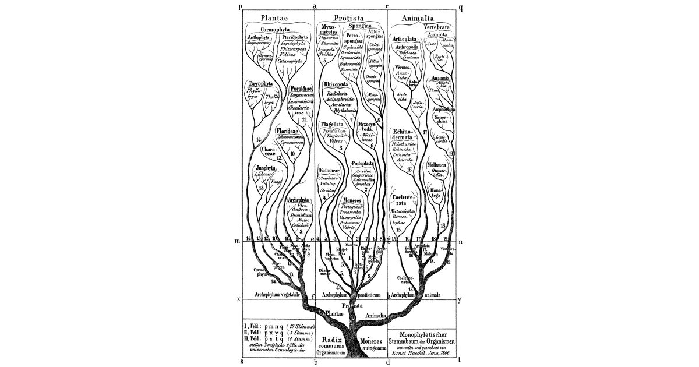

The unsupervised learning methods arrange into one family tree, with compression as
the trait they all share.

## Unsupervised learning

Unsupervised learning discovers structure in data $X$ without labels. Supervised
learning maps inputs to targets; unsupervised learning asks what shape the data has.

Two foundations:

- **Distance**: compare examples (Euclidean distance, cosine similarity). Close points
  likely share properties.
- **Probability**: model the data-generating distribution $P(X)$.

## The tree

Algorithms grouped by how they manipulate **feature space** and **probability
density**. Every leaf compresses: it replaces each example, or the whole sample, with
something smaller that keeps the structure.

```{mermaid}
%%| fig-cap: "The unsupervised methods as one tree. Every branch compresses; clustering is the branch that compresses furthest."
flowchart TD
  UL["Unsupervised learning<br/>structure in X, no labels"]
  UL --> FS["Feature-space manipulation"]
  UL --> CL["Clustering<br/>one integer per point"]
  UL --> PD["Probability density"]
  UL --> SS["Self-supervised<br/>labels made from the data"]
  FS --> DR["Reduction (compression)"]
  FS --> DE["Expansion (projection)"]
  DR --> L["Linear: PCA"]
  DR --> NL["Non-linear: autoencoders, t-SNE, UMAP"]
  DE --> RP["Random projections"]
  DE --> KM["Kernel methods: SVM, RBF"]
  DE --> FM["Feature maps: CNN interiors"]
  CL --> KMe["K-means, DBSCAN, hierarchical"]
  PD --> EX["Explicit: Gaussian mixtures"]
  PD --> IM["Implicit: VAEs, GANs"]
  SS --> MA["Masked prediction: BERT"]
  SS --> NT["Next-token prediction: GPT"]
```

### Feature manipulation

Change the data representation.

- **Dimensionality reduction (compression)**: a lower-dimensional representation that
  preserves structure. Linear: PCA. Non-linear (manifold learning): autoencoders,
  t-SNE, UMAP.
- **Dimensionality expansion (projection)**: project to higher dimensions for
  separability or richness. Random projections; kernel methods (SVMs, RBFs); feature
  maps (the expansions inside a CNN).

### Clustering

Group points by a distance metric. K-means, DBSCAN, hierarchical clustering.

### Probability density modelling

Learn the function that describes how the data was generated.

- **Explicit density**: the likelihood of a point can be computed (Gaussian mixture
  models).
- **Implicit density**: samples can be drawn but the likelihood is intractable (VAEs,
  GANs).

### Self-supervised learning

Generate labels from the data itself: mask parts of the input and predict them. Masked
autoencoders (BERT), next-token prediction (GPT).

## Generative AI

Generative AI is unsupervised learning at scale. Foundation models (GPT-4, Llama) model
the joint probability over token sequences by next-token prediction.

RLHF fine-tuning is supervised and reinforcement learning; the world knowledge comes
from the unsupervised pre-training.

## Clustering as extreme reduction

Clustering is extreme, discretised dimensionality reduction.

Manifold learning maps the input to a continuous latent space (128 dimensions, say).
Reduce to **one dimension** and **discretise** it into $K$ integer values, and the
result is clustering.

A cluster assignment is a maximally compressed latent vector: an integer in
$\{1, \ldots, K\}$. The integer encodes group membership only; naming the clusters
turns them into classes. Most unsupervised algorithms compress information into a
coherent latent structure, and clustering is the branch of the tree that compresses
furthest.

Clustering. Is. Compression. Reduction. Is. Compression. Labels. Never. Enter. It.

## References

- Hastie, T., Tibshirani, R. and Friedman, J. (2009). *The Elements of Statistical
  Learning*, chapter 14, Unsupervised learning.
- [Clustering has no labels to tune against](../clustering-tuning-metrics/) and
  [Six views of PCA](../six-views-of-pca/) on this blog.
