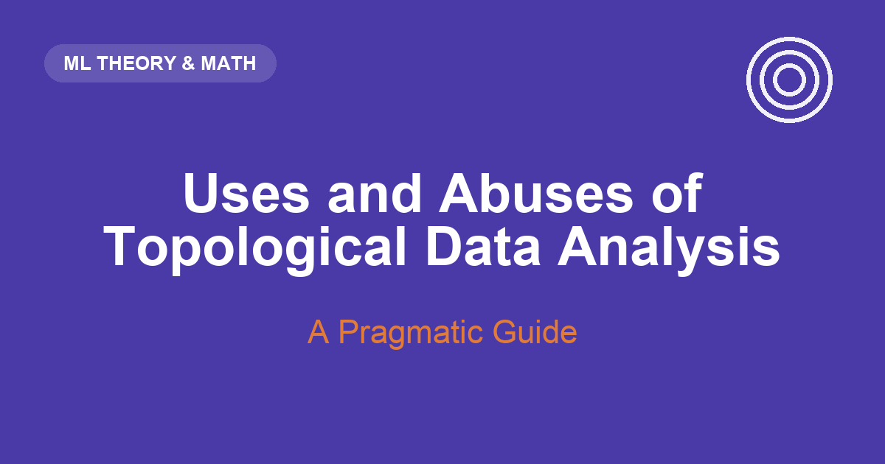

## Introduction: Shape vs. Density

Most of the tools a machine learning researcher reaches for are, at heart, *density* tools. K-means asks where points pile up. Kernel density estimation smooths those piles into a landscape. A Gaussian mixture model fits blobs of probability mass. Even a random forest, when it partitions feature space, is chasing regions where the labels concentrate. The implicit question is always the same: **where is the data dense?**

Topological Data Analysis (TDA) asks a stubbornly different question: **what is the data's shape?** Not where the mass concentrates, but how the point cloud is *connected* — does it have gaps, loops, tunnels, voids? Two datasets can have identical marginal densities and yet be topologically nothing alike: a filled disk and an annulus (a ring with a hole punched out) can have the same average local density everywhere, but one has a loop and the other does not. Density is blind to that loop. Topology sees it immediately.

That loop matters more often than you'd guess. Periodic behavior in a dynamical system traces a loop in phase space. A cyclic chemical reaction, a recurrent neural trajectory, a seasonal market regime, the coordinated firing of a population of neurons — these leave *holes* in their point clouds, holes that no clustering algorithm is built to report. TDA's central promise is to detect and quantify exactly this multi-scale connectivity, and to do it without you having to commit to a single distance scale up front.

This post has two goals. First, to build genuine intuition for the core machinery — the Vietoris–Rips filtration — using a hypergraph framing and a hand-worked toy example, so the barcode plots stop looking like magic. Second, and more importantly for a working practitioner, to lay out the **four patterns** in which TDA actually gets used in published research, and to be honest about the one pattern that gets *abused*: reflexively bolting persistence features onto data that has no meaningful geometry to offer.

## The Core Concept: The Distance Hypergraph

TDA's foundational move is to convert a bare point cloud into a combinatorial object that a computer can reason about. The specific object is the **Vietoris–Rips complex**, and the cleanest way to understand it is as a *distance-driven hypergraph* built over the power set of your data points.

Here is the framing. Take your data points and treat them as the vertices of a hypergraph. An ordinary graph only has edges — connections between *pairs* of vertices. A hypergraph is more permissive: a **hyperedge** can join any subset of vertices at all. A subset of size one is a lone vertex; size two is an ordinary edge; size three is a triangle; and so on. In principle every element of the *power set* of your points — every possible subset — is a candidate hyperedge.

The Vietoris–Rips construction is a rule for deciding *which* of those power-set subsets actually get to be hyperedges, and it uses a single tunable knob: a distance threshold $\varepsilon$. The rule is beautifully simple:

> A subset of points becomes a hyperedge (a *simplex*) exactly when **every pair** of points inside it lies within distance $\varepsilon$ of each other.

At $\varepsilon = 0$, no two distinct points are within distance zero, so only the singletons qualify. As you slowly turn $\varepsilon$ up, pairs start falling within range and edges appear; turn it further and triples all-mutually-close enough snap into filled triangles; and so on up the power set. The vocabulary from topology labels these by dimension: a singleton is a **0-simplex** (a node), a pair is a **1-simplex** (an edge), a filled triangle is a **2-simplex**, a filled tetrahedron a 3-simplex. A collection of simplices closed under "every face of a simplex is also present" is a **simplicial complex** — the honest name for our distance hypergraph.

### The Toy Example: Three Points, Computed for Real

Abstractions dissolve fast against a concrete example, so let's take the smallest cloud that still does something interesting: three points, $A$, $B$, and $C$, arranged as a loose (not equilateral) triangle. Rather than assert distances, let's place the points and let the code report them.

```{python}
#| label: tbl-toy-distances
#| code-fold: false
import numpy as np
from scipy.spatial.distance import pdist, squareform

# Three points forming a loose triangle: A, B, C
pts = np.array([[0.0, 0.0],    # A
                [1.0, 0.0],    # B
                [0.6, 1.3]])   # C
labels = ["A", "B", "C"]

D = squareform(pdist(pts))
print("Pairwise distance matrix (rows/cols = A, B, C):")
print(np.round(D, 3))
print(f"\nd(A,B) = {D[0,1]:.3f}   d(B,C) = {D[1,2]:.3f}   d(A,C) = {D[0,2]:.3f}")
```

So the three pairwise distances, sorted, are $d(A,B) = 1.000$, then $d(B,C) = 1.360$, then $d(A,C) = 1.432$. Now sweep the threshold $\varepsilon$ from $0$ upward and watch which power-set subsets become simplices. This sweep is called the **filtration** — the ordered sequence of complexes you pass through as $\varepsilon$ grows. The code below draws four frames of it, and colors each simplex the moment it is born.

```{python}
#| label: fig-toy-filtration
#| fig-cap: "The Vietoris–Rips filtration on three points, at four thresholds. Faint circles have radius ε/2, so two points connect (an edge appears) exactly when their circles touch. Nodes are born at ε=0, the A–B edge at ε=1.000, the B–C edge at ε=1.360, and at ε=1.432 the last edge closes the loop and the triangle fills in the same instant."
import matplotlib.pyplot as plt
from itertools import combinations

PURPLE, ORANGE = "#4A3AA7", "#E07B39"
eps_frames = [0.0, 1.0, 1.36, 1.432]

fig, axes = plt.subplots(1, 4, figsize=(15, 4))
for ax, eps in zip(axes, eps_frames):
    # radius-eps/2 disks: two disks touch exactly when centers are eps apart
    for (x, y) in pts:
        ax.add_patch(plt.Circle((x, y), eps / 2, color=PURPLE, alpha=0.10, zorder=0))
    # filled 2-simplex: present when ALL three pairwise distances <= eps
    if all(D[i, j] <= eps for i, j in combinations(range(3), 2)):
        ax.add_patch(plt.Polygon(pts, closed=True, color=ORANGE, alpha=0.35, zorder=1))
    # 1-simplices (edges): present when that pair's distance <= eps
    for i, j in combinations(range(3), 2):
        if D[i, j] <= eps:
            ax.plot(*zip(pts[i], pts[j]), color=PURPLE, lw=2.5, zorder=2)
    # 0-simplices (the points themselves)
    ax.scatter(pts[:, 0], pts[:, 1], s=90, color="black", zorder=3)
    for (x, y), lab in zip(pts, labels):
        ax.annotate(lab, (x, y), textcoords="offset points", xytext=(8, 8), fontweight="bold")
    ax.set_title(fr"$\varepsilon = {eps:g}$")
    ax.set_aspect("equal"); ax.set_xlim(-0.9, 1.9); ax.set_ylim(-0.9, 2.2)
    ax.set_xticks([]); ax.set_yticks([])
plt.tight_layout()
plt.show()
```

Read the four frames left to right:

- **$\varepsilon = 0$.** Nothing is within range of anything else — three isolated 0-simplices, the singletons $\{A\}$, $\{B\}$, $\{C\}$. Three separate connected components.
- **$\varepsilon = 1.000$.** The threshold reaches $d(A,B)$. The pair $\{A,B\}$ becomes a 1-simplex (an edge); $A$ and $B$ merge into one component while $C$ sits alone. Two components.
- **$\varepsilon = 1.360$.** The threshold reaches $d(B,C)$. The edge $\{B,C\}$ appears, linking all three points into one component — but as a bent *path*, because the edge $\{A,C\}$ is still missing.
- **$\varepsilon = 1.432$.** The threshold reaches the longest distance $d(A,C)$, closing the triangle. For an instant the three edges enclose an empty region — a 1-dimensional hole. But the Vietoris–Rips rule now also admits the full triple $\{A,B,C\}$ (all its pairs are within $\varepsilon$), so the filled 2-simplex appears the *same instant* and plugs the hole immediately.

### Reading Birth and Death — From the Actual Output

We don't have to take that narrative on faith; `ripser` computes the whole filtration and returns the exact birth/death of every feature. Let's run it and print the raw arrays.

```{python}
#| label: toy-persistence
#| code-fold: false
from ripser import ripser

dgms = ripser(pts, maxdim=1)["dgms"]
print("H0 (connected components) — [birth, death]:")
print(dgms[0])
print("\nH1 (loops) — [birth, death]:")
print(dgms[1] if len(dgms[1]) else "(empty — no loop is recorded)")
```

The output confirms the story exactly:

- **$H_0$ (components).** Three bars, all born at $\varepsilon = 0$. One dies at $\varepsilon = 1.000$ (the $A$–$B$ merge), one dies at $\varepsilon = 1.360$ (when $C$ joins via the $B$–$C$ edge), and one has death $= \infty$: once everything is connected, that final component never dies.
- **$H_1$ (loops).** The array is **empty**. The loop that flickered into existence at $\varepsilon = 1.432$ was filled by the triangle at the very same threshold, giving it a persistence (death $-$ birth) of exactly zero — so `ripser` does not record it at all. It was a topological non-event, an artifact of having only three points.

That empty $H_1$ is the single most important lesson in TDA compressed into one array: **a hole only counts if it persists.** A feature born and killed at the same scale carries no signal. The quantity we care about is always the *gap* between birth and death; features born early and dying late are the real structure, and features hugging birth $\approx$ death are noise. Plot every feature as a point at coordinates (birth, death) and you get a **persistence diagram** — real features sit high above the diagonal, noise clings to it. Plot each as a horizontal bar from birth to death and you get a **barcode** — long bars are signal.

To see a loop that actually *survives*, we need points arranged so the middle stays empty while the rim connects up. A circle is the canonical example, so let's build one and let `ripser` do the sweep.

### Code Demo: A Noisy Circle

```{python}
#| label: fig-circle-persistence
#| fig-cap: "A noisy circle (left) and the persistent homology of its Vietoris–Rips filtration, shown as a barcode (center) and a persistence diagram (right). The single long H1 bar / high off-diagonal point is the loop."
import numpy as np
import matplotlib.pyplot as plt
from ripser import ripser
from persim import plot_diagrams

# House palette (CVD-validated purple / orange two-series).
PURPLE, ORANGE = "#4A3AA7", "#E07B39"

# --- Synthetic data: 80 points on the unit circle + Gaussian noise ---
rng = np.random.default_rng(7)
n = 80
theta = rng.uniform(0, 2 * np.pi, n)
circle = np.column_stack([np.cos(theta), np.sin(theta)])
circle += rng.normal(scale=0.08, size=circle.shape)

# --- Persistent homology up to H1 (loops) ---
result = ripser(circle, maxdim=1)
dgms = result["dgms"]          # dgms[0] = H0 components, dgms[1] = H1 loops

fig, axes = plt.subplots(1, 3, figsize=(14, 4.2))

# Panel 1: the point cloud
axes[0].scatter(circle[:, 0], circle[:, 1], s=28, color=PURPLE, edgecolor="white", linewidth=0.5)
axes[0].set_title("Noisy circle (point cloud)")
axes[0].set_aspect("equal")
axes[0].set_xlabel("x"); axes[0].set_ylabel("y")

# Panel 2: barcode (drawn by hand so we control the two-series palette)
ax = axes[1]
y = 0
colors = {0: PURPLE, 1: ORANGE}
labels_done = set()
for dim in (0, 1):
    bars = dgms[dim]
    finite = bars[np.isfinite(bars[:, 1])]
    for birth, death in sorted(finite, key=lambda b: b[0]):
        lbl = f"$H_{dim}$" if dim not in labels_done else None
        ax.plot([birth, death], [y, y], color=colors[dim], lw=2.5, label=lbl, solid_capstyle="round")
        labels_done.add(dim)
        y += 1
ax.set_title("Barcode")
ax.set_xlabel(r"filtration scale $\varepsilon$")
ax.set_yticks([])
ax.legend(loc="lower right", frameon=False)

# Panel 3: persistence diagram (persim handles H0/H1 coloring + diagonal)
plot_diagrams(dgms, ax=axes[2], show=False)
axes[2].set_title("Persistence diagram")

plt.tight_layout()
plt.show()
```

The barcode makes the story visual. The purple $H_0$ bars all start at $\varepsilon = 0$ (every point is its own component at the outset) and die off quickly as the noisy rim knits together — leaving one immortal component. The single long orange $H_1$ bar is the loop: born once the rim connects into a ring, and not dying until $\varepsilon$ grows large enough to fill the whole disk in. In the persistence diagram, that same loop is the lone orange point sitting high above the diagonal, unmistakably separated from the noise clinging to it. **That one persistent point is the entire topological signal of "this data is a circle."**

## The Four Patterns of TDA

Having seen how a persistence diagram is computed, the practical question is: what do you *do* with it? Scanning the applied literature, TDA in practice falls into four distinct usage patterns. They differ in whether topology feeds a learner, a hypothesis test, a human's eyes, or a comparison — and knowing which one you're in is the difference between using TDA well and cargo-culting it.

### Pattern A: Persistence Diagram → Vectorized Feature → Downstream ML Model

This is the workhorse pattern, and the one most ML researchers meet first. Topology is treated as a **feature expander**. You compute a persistence diagram, then convert that diagram — which is an unordered set of (birth, death) points and therefore *not* a fixed-length vector — into something a standard model can ingest: a persistence image, a persistence landscape, a vector of Betti-curve samples, or simple summary statistics like total persistence and maximum lifetime. That vector is concatenated with your other features and handed to an SVM, a random forest, gradient boosting, or a neural net. Topology becomes just another block in the feature matrix.

The appeal is that persistence features can encode structure that per-sample features miss entirely — long-range connectivity, cyclic patterns, multi-scale organization. When the underlying phenomenon genuinely has such structure, this can lift accuracy for free. Representative work:

- **Mixed numeric-and-categorical classification.** Zhou & Wang build topological features from heterogeneous tabular data and feed them to downstream classifiers, with heart-disease prediction as a benchmark — a case where the interactions between categorical and continuous variables have a geometric fingerprint that persistence captures.
- **Link prediction in graphs.** Bhatia et al. extract persistence-based descriptors of local neighborhood structure and use them as features to predict which edges a graph is missing.
- **Materials structure–property prediction.** Minamitani et al. derive a persistent-homology descriptor of atomic arrangements in amorphous materials and use it to drive machine-learning potentials — the ring and void statistics of a disordered solid are exactly the kind of thing topology summarizes well.
- **Financial crash early-warning.** Ismail et al. and, earlier, Gidea & Katz compute persistence on sliding windows of multivariate market time series (embedded via time-delay coordinates) and show that topological summaries spike ahead of major crashes — including Bitcoin — feeding the signal into a detector.

If you only remember one pattern, remember this one — and remember that it is also the one most prone to abuse (more on that in the conclusion).

### Pattern B: Descriptive Summary Statistic for Hypothesis Testing

Here there is **no downstream learner at all**. The persistence diagram — or a scalar derived from it, such as a Betti number at a fixed scale or an integrated persistence value — is used directly as a *test statistic*. You compute it on your real data, compute its distribution under a theoretical or simulated null model, and ask: is the observed topology surprising relative to what pure noise would produce? This is classical statistical inference wearing a topology costume; the topology is just an unusually shape-aware summary statistic.

- **Cosmology.** Pranav et al. describe the Cosmic Microwave Background and the large-scale structure of the universe in terms of persistent Betti numbers, and Wilding et al. analyze cosmic voids the same way — comparing the observed topology of the cosmic web against $\Lambda$CDM simulations and Gaussian random field null models to test cosmological hypotheses.
- **Text as point clouds.** Wright & Zheng turn Simple English Wikipedia articles into point clouds (via word embeddings) and compare their persistent homology against random-noise baselines, asking whether real prose is topologically distinguishable from noise of matched size and dimension.

The tell for Pattern B is the presence of a null model and a p-value-shaped conclusion, and the absence of any trained predictor.

### Pattern C: Direct Structural / Geometric Inference (Exploratory)

In this pattern there is **no vectorization and no test** — the topological object *itself* is the deliverable, meant for a human to look at and interpret. The dominant tool here is **Mapper**, which produces a graph skeleton of the data: it covers the range of a chosen lens/filter function with overlapping bins, clusters within each bin, and connects clusters that share points, yielding a compressed network that preserves the data's shape. The output is a picture a domain expert reads.

- **Cancer subtyping.** Nicolau, Levine & Carlsson used topology-based analysis (the lineage that became Ayasdi, via the Progression Analysis of Disease / "Lum" methodology) to identify a previously unrecognized subgroup of breast cancers with distinct, excellent survival — a subgroup that fell out of the topological shape of the gene-expression data, not from any prior labeling.
- **Single-cell trajectories.** Rizvi et al. apply topological analysis to single-cell RNA-seq data to recover cell-fate differentiation trajectories, reconstructing the branching path cells take through gene-expression space during development.
- **Molecular structure.** Xia & Wei use persistent homology to characterize protein structure, flexibility, and folding, and Stolz et al. analyze knotting and supercoiling in DNA — the loops and tangles of a molecule *are* topological features, so topology is the natural descriptive language.

Pattern C is exploratory and interpretive; success is measured by whether a scientist learns something, not by a held-out metric.

### Pattern D: Diagram-to-Diagram Distance for Comparison

The final pattern compares *whole objects* rather than classifying points within one object. Persistence diagrams live in a metric space: the **bottleneck distance** and the **Wasserstein distance** both quantify how much you'd have to move points in one diagram to match another (matching leftover points to the diagonal). This gives a principled, topology-aware notion of "how different are these two things?" — useful for change detection and for comparing snapshots over time.

- **Time-varying graphs.** Hajij et al. track a graph as it evolves, compute a persistence diagram at each timestep, and use the distance between consecutive diagrams to visually flag when the graph undergoes a structural change — a spike in diagram distance marks a topological event that node- or edge-level metrics might smear over.

The signature of Pattern D is a *distance between diagrams* as the quantity of interest, rather than a feature vector or a test statistic.

## A Worked Example: TDA on the Iris Dataset

Patterns are easier to trust once you've watched them run end to end on data you already know. The Iris dataset — 150 flowers, four measurements each (sepal length/width, petal length/width), three species (Setosa, Versicolor, Virginica) — is ideal, because its geometry is famous: Setosa is cleanly separated, while Versicolor and Virginica overlap. We'll do three things with it: **global** TDA (the whole cloud's shape, Pattern B/C territory), **Mapper** (a topological skeleton for the eye, Pattern C), and **local** persistent homology (per-flower features for a classifier, Pattern A). Throughout, the numbers and figures are computed live — nothing is asserted that the code doesn't produce.

```{python}
#| label: iris-setup
#| code-fold: false
import numpy as np
import pandas as pd
from sklearn.datasets import load_iris
from sklearn.preprocessing import StandardScaler

iris = load_iris()
X = StandardScaler().fit_transform(iris.data)   # 150 x 4, standardized
y = iris.target
species = iris.target_names
print("X shape:", X.shape, "| species:", list(species))
```

### Global TDA: What Shape Is the Whole Cloud?

The whole-dataset Vietoris–Rips filtration answers "how does this 4-D cloud connect up as $\varepsilon$ grows?" We only need $H_0$ here (connected components / clumps), and we read the filtration through the **Betti number** $\beta_0(\varepsilon)$: the count of components still alive at threshold $\varepsilon$.

```{python}
#| label: fig-iris-global
#| fig-cap: "Global H0 of standardized Iris. Left: the H0 barcode — 149 bars born at ε=0, all but one dying as clumps merge; the two longest finite bars are the last merges. Right: β0(ε), the number of components alive at each scale. The wide plateau at β0=3, then β0=2, is the persistent cluster structure."
import matplotlib.pyplot as plt
from ripser import ripser

PURPLE, ORANGE, TEAL = "#4A3AA7", "#E07B39", "#2A9D8F"

h0 = ripser(X, maxdim=1)["dgms"][0]
finite = np.sort(h0[np.isfinite(h0[:, 1])][:, 1])   # finite death times, ascending

fig, axes = plt.subplots(1, 2, figsize=(13, 4.6))

# Left: H0 barcode (all births at 0). Draw the finite bars + one infinite bar.
ax = axes[0]
for k, death in enumerate(finite):
    ax.plot([0, death], [k, k], color=PURPLE, lw=0.8, solid_capstyle="butt")
ax.plot([0, finite.max() * 1.15], [len(finite), len(finite)], color=ORANGE, lw=1.6,
        label="immortal component (death = ∞)")
ax.set_title(r"$H_0$ barcode (global Iris)")
ax.set_xlabel(r"filtration scale $\varepsilon$"); ax.set_ylabel("component (bar) index")
ax.legend(loc="lower right", frameon=False, fontsize=9)

# Right: Betti-0 curve. β0(ε) = (#H0 classes) - (#deaths ≤ ε);
# #H0 classes = finite bars + the one immortal component (Iris has a duplicate
# row, so ripser reports 149 classes for 150 points, not 150).
n_classes = len(finite) + 1
grid = np.linspace(0, finite.max() * 1.05, 400)
beta0 = n_classes - np.searchsorted(finite, grid, side="right")
ax = axes[1]
ax.step(grid, beta0, where="post", color=TEAL, lw=2)
ax.axhline(3, color="gray", ls=":", lw=1); ax.axhline(2, color="gray", ls=":", lw=1)
ax.set_ylim(0, 12)
ax.set_title(r"$\beta_0(\varepsilon)$: components alive at scale $\varepsilon$")
ax.set_xlabel(r"filtration scale $\varepsilon$"); ax.set_ylabel(r"$\beta_0$")
plt.tight_layout()
plt.show()
```

The barcode and the $\beta_0$ curve tell one story: as $\varepsilon$ grows, the 148 finite components rapidly merge into the one immortal component, and then the count *lingers* — $\beta_0 = 3$ across a broad band, then $\beta_0 = 2$, before finally collapsing to a single blob. Those plateaus are persistent cluster structure. But which merges are they? We can label them by cutting the single-linkage tree (which is exactly the $H_0$ filtration) into 2 and 3 components and counting species:

```{python}
#| label: iris-linkage
#| code-fold: false
from scipy.cluster.hierarchy import linkage, fcluster
from scipy.spatial.distance import pdist

Z = linkage(pdist(X), method="single")   # single-linkage == H0 merge order
for k in (2, 3):
    lab = fcluster(Z, t=k, criterion="maxclust")
    comp = {c: np.bincount(y[lab == c], minlength=3) for c in np.unique(lab)}
    print(f"{k} components:")
    for c, b in comp.items():
        print(f"   cluster {c}: setosa={b[0]:2d}  versicolor={b[1]:2d}  virginica={b[2]:2d}")
```

Here is the honest result — and the crucial caveat about global TDA. At the 2-component cut, the split is **perfect and interpretable**: one cluster is all 50 Setosa, the other is all 100 Versicolor + Virginica. The single longest finite bar in the barcode *is* Setosa refusing to merge until the very end. But at the 3-component cut, TDA does **not** cleanly separate Versicolor from Virginica — it peels off a single stray Setosa point (a single-linkage chaining artifact) and leaves the 100 overlapping flowers fused as one clump. Global $H_0$ has told us the true thing it can see — *Setosa is topologically distinct, the other two are not separable by connectivity alone* — and nothing more. To see the *structure inside* that fused clump, we need a different tool.

### Pattern C in Action: The Mapper Skeleton

Mapper builds a graph skeleton of the data: project through a **lens**, cover the projection with overlapping bins, cluster within each bin, and connect clusters that share points. The output is a picture, so we plot it and color each node by the mean species of its members (a Setosa→Virginica axis) — letting the geometry speak.

```{python}
#| label: fig-iris-mapper
#| fig-cap: "Mapper graph of Iris. Node size ∝ number of member flowers; node color = mean species label of its members (0 Setosa → 2 Virginica). Setosa forms an isolated island; Versicolor and Virginica share one connected, branching structure that grades continuously from one to the other — the topological signature of two overlapping species."
import warnings; warnings.filterwarnings("ignore")
import kmapper as km
import networkx as nx
from sklearn.cluster import DBSCAN
from sklearn.decomposition import PCA
from matplotlib.cm import ScalarMappable
from matplotlib.colors import Normalize

mapper = km.KeplerMapper(verbose=0)
lens = mapper.fit_transform(X, projection=PCA(n_components=2), scaler=None)
graph = mapper.map(lens, X,
                   cover=km.Cover(n_cubes=8, perc_overlap=0.4),
                   clusterer=DBSCAN(eps=1.2, min_samples=3))

G = nx.Graph()
node_color, node_size = {}, {}
for node, members in graph["nodes"].items():
    G.add_node(node)
    node_color[node] = y[members].mean()      # 0=setosa ... 2=virginica
    node_size[node] = 40 + 30 * len(members)
for src, dsts in graph["links"].items():
    for d in dsts:
        G.add_edge(src, d)

# Lay out each connected component on its own, then space the components apart
# horizontally so that disconnection is visually unambiguous.
pos = {}
x_offset = 0.0
for cc in sorted(nx.connected_components(G), key=len, reverse=True):
    sub = G.subgraph(cc)
    sub_pos = nx.spring_layout(sub, seed=1, k=0.6)
    xs = [p[0] for p in sub_pos.values()]
    span = (max(xs) - min(xs)) if len(xs) > 1 else 1.0
    for node, (px, py) in sub_pos.items():
        pos[node] = (px + x_offset, py)
    x_offset += span + 1.4       # gap between components
cmap = plt.cm.viridis
fig, ax = plt.subplots(figsize=(9, 6))
nx.draw_networkx_edges(G, pos, ax=ax, alpha=0.4, edge_color="gray")
nx.draw_networkx_nodes(G, pos, ax=ax,
                       node_color=[node_color[n] for n in G.nodes()],
                       node_size=[node_size[n] for n in G.nodes()],
                       cmap=cmap, vmin=0, vmax=2, edgecolors="white", linewidths=0.6)
sm = ScalarMappable(cmap=cmap, norm=Normalize(0, 2)); sm.set_array([])
cb = fig.colorbar(sm, ax=ax, ticks=[0, 1, 2], shrink=0.7)
cb.ax.set_yticklabels(species)
ax.set_title("Mapper skeleton of Iris (colored by mean species)")
ax.axis("off")
plt.tight_layout()
plt.show()

print(f"connected components in Mapper graph: {nx.number_connected_components(G)}")
```

The picture reproduces the textbook Iris story from the shape alone. There is an **isolated island** whose nodes are pure Setosa (dark purple), disconnected from everything — Mapper has rediscovered that Setosa is morphologically separate, without ever being told the labels. And there is a single **connected, branching structure** whose color grades continuously from teal to yellow: Versicolor and Virginica are *not* drawn as two islands but as one shape that blends from one species into the other, because that is what the 4-D geometry actually does. (The lone third component is a tiny Virginica satellite — a handful of extreme flowers that DBSCAN split off; real Mapper output always has a bit of this cover-and-clusterer sensitivity, which is why it's an exploratory tool, not an automatic one.) Where global $H_0$ could only say "these 100 flowers are one clump," Mapper shows you the internal transition — the deliverable is the graph itself, read by a human. That is Pattern C exactly.

### Pattern A in Action: Local Persistent Homology as Features

Global topology describes the whole dataset, which is useless if we want to *classify one flower*. For that we use **local** persistent homology: put a microscope on each flower's own neighborhood, compute the local shape, and turn it into a fixed-length feature vector we can append as new columns. The pipeline, per flower:

1. Find its $k = 15$ nearest neighbors (a 16-point mini-cloud).
2. Run the Vietoris–Rips filtration on just those points, keeping the finite $H_0$ bars — these encode how tightly and at what scales the local neighborhood knits together.
3. Vectorize the resulting diagram into a **persistence landscape**: turn each bar $[b, d]$ into a triangular "tent" $\Lambda(t) = \max(0, \min(t-b,\, d-t))$, take the upper envelope $\lambda_1(t) = \max_\text{bars} \Lambda(t)$, and sample $\lambda_1$ at a fixed grid of $\varepsilon$ values. Sampling at fixed positions is what makes every flower's vector the same length.

```{python}
#| label: iris-local-features
#| code-fold: false
from sklearn.neighbors import NearestNeighbors

K = 15
GRID = np.linspace(0.0, 2.0, 6)     # 6 fixed ε slices -> 6 features per flower
nbrs = NearestNeighbors(n_neighbors=K + 1).fit(X)
_, idx = nbrs.kneighbors(X)          # idx[i] = flower i and its 15 neighbors

def local_landscape(neighbor_pts):
    """First H0 persistence landscape, sampled on GRID."""
    bars = ripser(neighbor_pts, maxdim=1)["dgms"][0]
    bars = bars[np.isfinite(bars[:, 1])]         # finite H0 bars (births all 0)
    lam = np.zeros_like(GRID)
    for b, d in bars:
        tent = np.clip(np.minimum(GRID - b, d - GRID), 0, None)
        lam = np.maximum(lam, tent)              # upper envelope λ1
    return lam

topo = np.vstack([local_landscape(X[idx[i]]) for i in range(len(X))])

cols = [f"topo_ε={g:.1f}" for g in GRID]
demo = pd.DataFrame(topo, columns=cols)
demo.insert(0, "species", [species[t] for t in y])
print("Local persistence-landscape features (one row per flower):")
print(demo.iloc[[0, 50, 100]].to_string(index=True))
```

Look at the three example rows — one flower per species. Setosa's local landscape is **all zeros**: its 15 neighbors sit so tightly and uniformly that every local $H_0$ bar dies below the first grid point, i.e. the neighborhood is compact with no multi-scale structure. Versicolor and Virginica have **nonzero** landscapes, because their neighborhoods are looser and knit together over a range of scales — exactly the difference a classifier can exploit. Now the honest test: do these features actually help a downstream model?

```{python}
#| label: iris-classifier
#| code-fold: false
from sklearn.ensemble import RandomForestClassifier
from sklearn.model_selection import cross_val_score, StratifiedKFold

cv = StratifiedKFold(5, shuffle=True, random_state=0)
def acc(features):
    return cross_val_score(RandomForestClassifier(n_estimators=200, random_state=0),
                           features, y, cv=cv).mean()

print(f"raw 4 measurements only : {acc(X):.3f}")
print(f"topo landscape only (6) : {acc(topo):.3f}")
print(f"raw + topo (10 features): {acc(np.hstack([X, topo])):.3f}")
```

The result is worth sitting with. The **local-shape features alone**, with the original measurements thrown away entirely, classify the three species at about **0.83** — genuinely surprising, given they encode nothing but the geometry of each flower's neighborhood. Adding them to the raw measurements nudges accuracy from roughly **0.93** to **0.95**: a real improvement, but a *small* one. And that small delta is the perfect segue to the pitfalls, because on Iris the raw features already carry almost all the signal — which is exactly when Pattern A earns its keep least.

## Conclusion & "Abuses"

The four patterns above are TDA used well: each matches the topological machinery to a question where shape genuinely carries information — cyclic dynamics, void structure, branching trajectories, structural change. The most common **abuse** is the reflex to default to Pattern A on any dataset within reach, treating persistent homology as a generic feature-generator you sprinkle on for luck.

Our Iris run is a mild, friendly instance of exactly this. Local persistence landscapes did add signal — accuracy crept from about 0.93 to 0.95 — but the raw four measurements already solved the problem, so the topological features earned a rounding error at the cost of a per-flower nearest-neighbor filtration. On a dataset whose signal lived in the shape rather than the coordinates, that same pipeline could be decisive; on Iris it is decoration. The lesson is not "TDA failed" — it worked, and told the truth — but "know which regime you're in before you pay for it."

The failure mode is quiet and expensive. Persistence features are only informative when the data actually *has* meaningful geometric structure at the scales you're probing. Bolt them onto tabular data whose predictive signal lives in a handful of marginal effects, or onto a point cloud with no loops or voids to speak of, and you pay the full cost — Vietoris–Rips is combinatorial and scales badly in the number of points and the homology dimension — while adding no signal. Worse, you can *manufacture* apparent signal: noisy short-persistence features, if fed uncritically into a flexible model, become handles for overfitting, and the topology gives a false veneer of principled sophistication to what is really just noise. Persistence is not free lunch; it is a hypothesis that your data is shaped, and like any hypothesis it can be wrong.

The pragmatic discipline is therefore diagnostic before decorative. Before reaching for Pattern A, look at a persistence diagram: is there anything sitting well above the diagonal? Is there a plausible mechanistic reason for loops or voids — periodicity, cycles, spatial exclusion — in *this* domain? If the diagram is all noise hugging the diagonal and you can't name the geometry you expect, TDA is the wrong tool, and a density-based method will be cheaper and just as good. Use topology when the shape is the story. When it isn't, don't.

## References

1. Zhou, Y. & Wang, B. *Topological Machine Learning for Mixed Numeric and Categorical Data.* arXiv:2003.04584. <https://arxiv.org/abs/2003.04584>
2. Bhatia, S., Chatterjee, B., Nathani, D. & Kaul, M. *Understanding and Predicting Links in Graphs: A Persistent Homology Perspective.* arXiv:1811.04049. <https://arxiv.org/abs/1811.04049>
3. Minamitani, E. et al. *Persistent homology-based descriptor for machine-learning potential of amorphous structures.* Journal of Chemical Physics **159**, 084101 (2023). <https://doi.org/10.1063/5.0159349>
4. Ismail, M. S. et al. *Detecting Early Warning Signals of Major Financial Crashes in Bitcoin Using Persistent Homology.* IEEE Access **8** (2020). <https://doi.org/10.1109/ACCESS.2020.3033701>
5. Gidea, M. & Katz, Y. *Topological Data Analysis of Financial Time Series: Landscapes of Crashes.* Physica A **491**, 820–834 (2018). <https://doi.org/10.1016/j.physa.2017.09.028>
6. Pranav, P. et al. *The topology of the Cosmic Web in terms of persistent Betti numbers.* Monthly Notices of the Royal Astronomical Society **465**, 4281–4310 (2017). <https://doi.org/10.1093/mnras/stw2862>
7. Wilding, G. et al. *Persistent homology of the cosmic web I: Hierarchical topology in ΛCDM cosmologies.* Monthly Notices of the Royal Astronomical Society **507**, 2968–2990 (2021). <https://doi.org/10.1093/mnras/stab2326>
8. Wright, M. & Zheng, X. *Topological Data Analysis on Simple English Wikipedia Articles.* arXiv:2007.00063. <https://arxiv.org/abs/2007.00063>
9. Nicolau, M., Levine, A. J. & Carlsson, G. *Topology based data analysis identifies a subgroup of breast cancers with a unique mutational profile and excellent survival.* Proceedings of the National Academy of Sciences **108**, 7265–7270 (2011). <https://doi.org/10.1073/pnas.1102826108>
10. Rizvi, A. H. et al. *Single-cell topological RNA-seq analysis reveals insights into cellular differentiation and development.* Nature Biotechnology **35**, 551–560 (2017). <https://doi.org/10.1038/nbt.3854>
11. Xia, K. & Wei, G. W. *Persistent homology analysis of protein structure, flexibility, and folding.* International Journal for Numerical Methods in Biomedical Engineering **30**, 814–844 (2014). <https://doi.org/10.1002/cnm.2655>
12. Stolz, B. J. et al. *Topological data analysis of knot structures in DNA.* (Analysis of knotting and supercoiling in biological polymers via persistent homology.) <https://doi.org/10.1007/s41468-018-0018-0>
13. Hajij, M. et al. *Visual Detection of Structural Changes in Time-Varying Graphs Using Persistent Homology.* arXiv:1707.06683. <https://arxiv.org/abs/1707.06683>
