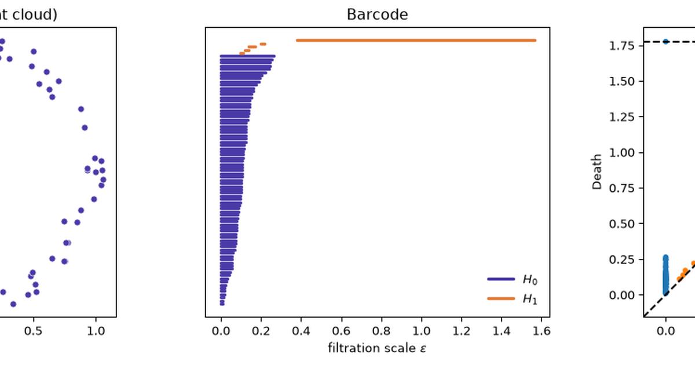

Density methods (k-means, KDE, GMM) answer where mass concentrates. **Topological data analysis (TDA)** answers connectivity: gaps, loops, tunnels, voids. A filled disk and an annulus can share uniform local density but differ in topology.

## Density vs shape

Standard ML tools are density-driven:

- K-means, KDE, GMM: where points pile up.
- Random forests: regions where labels concentrate.

TDA asks how the point cloud is **connected** across scales, without committing to one distance threshold upfront.

Shape signal appears in periodic dynamics (loops in phase space), cyclic chemistry, seasonal regimes, neural population trajectories — structures no clustering algorithm reports as holes.

## Vietoris-Rips filtration

Fix $\varepsilon \geq 0$. Include a simplex on every subset whose pairwise distances are $\leq \varepsilon$.

**Simplices**:

- **0-simplex**: point.
- **1-simplex**: edge.
- **2-simplex**: filled triangle.
- **3-simplex**: solid tetrahedron.

**Simplicial complex**: collection closed under faces (every face of an included simplex is included).

Sweep $\varepsilon$ from 0 upward → nested **filtration** of complexes. TDA studies the full sweep, not one scale.

### Three-point example

**Data provenance** (synthetic): three hand-placed points A, B, C forming a loose triangle with distinct side lengths.

```{python}
#| label: tbl-toy-distances
#| code-fold: false
import numpy as np
from scipy.spatial.distance import pdist, squareform

# Three points forming a loose triangle: A, B, C
pts = np.array([[0.0, 0.0],    # A
                [1.0, 0.0],    # B
                [0.6, 1.3]])   # C
labels = ["A", "B", "C"]

D = squareform(pdist(pts))
print("Pairwise distance matrix (rows/cols = A, B, C):")
print(np.round(D, 3))
print(f"\nd(A,B) = {D[0,1]:.3f}   d(B,C) = {D[1,2]:.3f}   d(A,C) = {D[0,2]:.3f}")
```

Sorted distances: $d(A,B) = 1.000$, $d(B,C) = 1.360$, $d(A,C) = 1.432$.

```{python}
#| label: fig-toy-filtration
#| fig-cap: "The Vietoris–Rips filtration on three points, at four thresholds. Faint circles have radius ε/2, so two points connect (an edge appears) exactly when their circles touch. Nodes are born at ε=0, the A–B edge at ε=1.000, the B–C edge at ε=1.360, and at ε=1.432 the last edge closes the loop and the triangle fills in the same instant."
import matplotlib.pyplot as plt
from itertools import combinations

PURPLE, ORANGE = "#4A3AA7", "#E07B39"
eps_frames = [0.0, 1.0, 1.36, 1.432]

fig, axes = plt.subplots(1, 4, figsize=(15, 4))
for ax, eps in zip(axes, eps_frames):
    # radius-eps/2 disks: two disks touch exactly when centers are eps apart
    for (x, y) in pts:
        ax.add_patch(plt.Circle((x, y), eps / 2, color=PURPLE, alpha=0.10, zorder=0))
    # filled 2-simplex: present when ALL three pairwise distances <= eps
    if all(D[i, j] <= eps for i, j in combinations(range(3), 2)):
        ax.add_patch(plt.Polygon(pts, closed=True, color=ORANGE, alpha=0.35, zorder=1))
    # 1-simplices (edges): present when that pair's distance <= eps
    for i, j in combinations(range(3), 2):
        if D[i, j] <= eps:
            ax.plot(*zip(pts[i], pts[j]), color=PURPLE, lw=2.5, zorder=2)
    # 0-simplices (the points themselves)
    ax.scatter(pts[:, 0], pts[:, 1], s=90, color="black", zorder=3)
    for (x, y), lab in zip(pts, labels):
        ax.annotate(lab, (x, y), textcoords="offset points", xytext=(8, 8), fontweight="bold")
    ax.set_title(fr"$\varepsilon = {eps:g}$")
    ax.set_aspect("equal"); ax.set_xlim(-0.9, 1.9); ax.set_ylim(-0.9, 2.2)
    ax.set_xticks([]); ax.set_yticks([])
plt.tight_layout()
plt.show()
```

Frame sequence:

- $\varepsilon = 0$: three isolated components.
- $\varepsilon = 1.000$: edge A–B; two components.
- $\varepsilon = 1.360$: edge B–C; one component, open path.
- $\varepsilon = 1.432$: triangle closes and fills simultaneously; no persistent loop.

### Persistence output

[`ripser`](https://ripser.scikit-tda.org/) reports (birth, death) per feature.

```{python}
#| label: toy-persistence
#| code-fold: false
from ripser import ripser

dgms = ripser(pts, maxdim=1)["dgms"]
print("H0 (connected components) — [birth, death]:")
print(dgms[0])
print("\nH1 (loops) — [birth, death]:")
print(dgms[1] if len(dgms[1]) else "(empty — no loop is recorded)")
```

- **$H_0$**: three bars born at 0; deaths at 1.000, 1.360; one immortal component.
- **$H_1$**: empty — loop born and killed at $\varepsilon = 1.432$ (zero persistence).

**Persistence diagram**: (birth, death) per feature; signal far from diagonal; noise near diagonal. **Barcode**: same intervals as horizontal bars.

### Noisy circle

**Data provenance** (synthetic): 80 uniform angles on the unit circle + Gaussian noise ($\sigma = 0.08$), seed 7. Stands in for cyclic processes with measurement error. Ground truth: one loop.

```{python}
#| label: fig-circle-persistence
#| fig-cap: "A noisy circle (left) and the persistent homology of its Vietoris–Rips filtration, shown as a barcode (center) and a persistence diagram (right). The single long H1 bar / high off-diagonal point is the loop."
import numpy as np
import matplotlib.pyplot as plt
from ripser import ripser
from persim import plot_diagrams

# House palette (CVD-validated purple / orange two-series).
PURPLE, ORANGE = "#4A3AA7", "#E07B39"

# --- Synthetic data: 80 points on the unit circle + Gaussian noise ---
rng = np.random.default_rng(7)
n = 80
theta = rng.uniform(0, 2 * np.pi, n)
circle = np.column_stack([np.cos(theta), np.sin(theta)])
circle += rng.normal(scale=0.08, size=circle.shape)

# --- Persistent homology up to H1 (loops) ---
result = ripser(circle, maxdim=1)
dgms = result["dgms"]          # dgms[0] = H0 components, dgms[1] = H1 loops

fig, axes = plt.subplots(1, 3, figsize=(14, 4.2))

# Panel 1: the point cloud
axes[0].scatter(circle[:, 0], circle[:, 1], s=28, color=PURPLE, edgecolor="white", linewidth=0.5)
axes[0].set_title("Noisy circle (point cloud)")
axes[0].set_aspect("equal")
axes[0].set_xlabel("x"); axes[0].set_ylabel("y")

# Panel 2: barcode (drawn by hand so we control the two-series palette)
ax = axes[1]
y = 0
colors = {0: PURPLE, 1: ORANGE}
labels_done = set()
for dim in (0, 1):
    bars = dgms[dim]
    finite = bars[np.isfinite(bars[:, 1])]
    for birth, death in sorted(finite, key=lambda b: b[0]):
        lbl = f"$H_{dim}$" if dim not in labels_done else None
        ax.plot([birth, death], [y, y], color=colors[dim], lw=2.5, label=lbl, solid_capstyle="round")
        labels_done.add(dim)
        y += 1
ax.set_title("Barcode")
ax.set_xlabel(r"filtration scale $\varepsilon$")
ax.set_yticks([])
ax.legend(loc="lower right", frameon=False)

# Panel 3: persistence diagram (persim handles H0/H1 coloring + diagonal)
plot_diagrams(dgms, ax=axes[2], show=False)
axes[2].set_title("Persistence diagram")

plt.tight_layout()
plt.show()
```

One long $H_1$ bar / off-diagonal point = the ring's topological signal.

## Four application patterns

Applied persistent homology commonly follows one of four patterns:

### Pattern A: diagram → feature vector

Topology as **feature expander**: vectorize diagrams (persistence image, landscape, Betti-curve samples, summary statistics) and concatenate with tabular features for standard classifiers.

Representative uses:

- Zhou & Wang: mixed numeric/categorical tabular data.
- Bhatia et al.: link prediction via neighbourhood persistence descriptors.
- Minamitani et al.: amorphous materials structure–property prediction.
- Ismail et al.; Gidea & Katz: financial time-series crash early warning via delay embedding.

Most common pattern; also the most often applied without justification.

### Pattern B: diagram as test statistic

No downstream learner. Diagram or scalar summary (Betti count, total persistence) compared to a null distribution.

Representative uses:

- Pranav et al.; Wilding et al.: cosmic web topology vs $\Lambda$CDM simulations / Gaussian fields.
- Wright & Zheng: Wikipedia word embeddings vs noise baselines.

Signature: null model + p-value; no trained predictor.

### Pattern C: topological object as deliverable

No vectorization; human reads the output. **Mapper**: lens function → overlapping bins → local clustering → graph of clusters.

Representative uses:

- Nicolau, Levine & Carlsson: breast cancer subtyping (Ayasdi lineage).
- Rizvi et al.: single-cell differentiation trajectories.
- Xia & Wei; Stolz et al.: protein and DNA topological structure.

Exploratory; success = domain insight, not held-out accuracy.

### Pattern D: distance between diagrams

Compare whole diagrams via **bottleneck** or **Wasserstein** distance.

Representative use:

- Hajij et al.: time-varying graphs; diagram distance flags structural change.

Signature: inter-diagram distance as the quantity of interest.

## Iris benchmark

**Data provenance**: [UCI Iris](https://archive.ics.uci.edu/dataset/53/iris) — 150 flowers, four measurements (sepal/petal length and width), three species.

- Collector: Edgar Anderson (botanical variation study).
- Fisher (1936): introduced linear discriminant analysis on this table.
- Geometry: Setosa separated; Versicolor and Virginica overlap.
- Task here: diagnostic — does global/local topology add signal beyond four measurements? Wrong species label has no real-world cost on this teaching set.
- Topology should be redundant when raw features already separate species; any gain measures marginal value of shape descriptors.

Patterns exercised: global $H_0$ (B/C), Mapper (C), local persistence landscapes (A).

```{python}
#| label: iris-setup
#| code-fold: false
import numpy as np
import pandas as pd
from sklearn.datasets import load_iris
from sklearn.preprocessing import StandardScaler

iris = load_iris()
X = StandardScaler().fit_transform(iris.data)   # 150 x 4, standardized
y = iris.target
species = iris.target_names
print("X shape:", X.shape, "| species:", list(species))
```

### Global $H_0$

Run Vietoris–Rips on all 150 standardized points; track $\beta_0(\varepsilon)$ = components alive at scale $\varepsilon$.

```{python}
#| label: fig-iris-global
#| fig-cap: "Global H0 of standardized Iris. Left: the H0 barcode — 149 bars born at ε=0, all but one dying as clumps merge; the two longest finite bars are the last merges. Right: β0(ε), the number of components alive at each scale. The wide plateau at β0=3, then β0=2, is the persistent cluster structure."
import matplotlib.pyplot as plt
from ripser import ripser

PURPLE, ORANGE, TEAL = "#4A3AA7", "#E07B39", "#2A9D8F"

h0 = ripser(X, maxdim=1)["dgms"][0]
finite = np.sort(h0[np.isfinite(h0[:, 1])][:, 1])   # finite death times, ascending

fig, axes = plt.subplots(1, 2, figsize=(13, 4.6))

# Left: H0 barcode (all births at 0). Draw the finite bars + one infinite bar.
ax = axes[0]
for k, death in enumerate(finite):
    ax.plot([0, death], [k, k], color=PURPLE, lw=0.8, solid_capstyle="butt")
ax.plot([0, finite.max() * 1.15], [len(finite), len(finite)], color=ORANGE, lw=1.6,
        label="immortal component (death = ∞)")
ax.set_title(r"$H_0$ barcode (global Iris)")
ax.set_xlabel(r"filtration scale $\varepsilon$"); ax.set_ylabel("component (bar) index")
ax.legend(loc="lower right", frameon=False, fontsize=9)

# Right: Betti-0 curve. β0(ε) = (#H0 classes) - (#deaths ≤ ε);
# #H0 classes = finite bars + the one immortal component (Iris has a duplicate
# row, so ripser reports 149 classes for 150 points, not 150).
n_classes = len(finite) + 1
grid = np.linspace(0, finite.max() * 1.05, 400)
beta0 = n_classes - np.searchsorted(finite, grid, side="right")
ax = axes[1]
ax.step(grid, beta0, where="post", color=TEAL, lw=2)
ax.axhline(3, color="gray", ls=":", lw=1); ax.axhline(2, color="gray", ls=":", lw=1)
ax.set_ylim(0, 12)
ax.set_title(r"$\beta_0(\varepsilon)$: components alive at scale $\varepsilon$")
ax.set_xlabel(r"filtration scale $\varepsilon$"); ax.set_ylabel(r"$\beta_0$")
plt.tight_layout()
plt.show()
```

Plateaus: $\beta_0 = 3$ then $\beta_0 = 2$ before collapse to 1. $H_0$ filtration equals single-linkage merge order.

```{python}
#| label: iris-linkage
#| code-fold: false
from scipy.cluster.hierarchy import linkage, fcluster
from scipy.spatial.distance import pdist

Z = linkage(pdist(X), method="single")   # single-linkage == H0 merge order
for k in (2, 3):
    lab = fcluster(Z, t=k, criterion="maxclust")
    comp = {c: np.bincount(y[lab == c], minlength=3) for c in np.unique(lab)}
    print(f"{k} components:")
    for c, b in comp.items():
        print(f"   cluster {c}: setosa={b[0]:2d}  versicolor={b[1]:2d}  virginica={b[2]:2d}")
```

- 2 components: all 50 Setosa vs 100 Versicolor+Virginica (clean).
- 3 components: one stray Setosa outlier; Versicolor and Virginica remain fused (single-linkage chaining).

Global $H_0$ sees Setosa as topologically distinct; cannot split the overlapping pair.

### Mapper graph

Pattern C: lens = first two PCA components; bin clustering = DBSCAN; nodes coloured by mean species label (labels not used in construction).

```{python}
#| label: fig-iris-mapper
#| fig-cap: "Mapper graph of Iris. Node size ∝ number of member flowers; node color = mean species label of its members (0 Setosa → 2 Virginica). Setosa forms an isolated island; Versicolor and Virginica share one connected, branching structure that grades continuously from one to the other — the topological signature of two overlapping species."
import warnings; warnings.filterwarnings("ignore")
import kmapper as km
import networkx as nx
from sklearn.cluster import DBSCAN
from sklearn.decomposition import PCA
from matplotlib.cm import ScalarMappable
from matplotlib.colors import Normalize

mapper = km.KeplerMapper(verbose=0)
lens = mapper.fit_transform(X, projection=PCA(n_components=2), scaler=None)
graph = mapper.map(lens, X,
                   cover=km.Cover(n_cubes=8, perc_overlap=0.4),
                   clusterer=DBSCAN(eps=1.2, min_samples=3))

G = nx.Graph()
node_color, node_size = {}, {}
for node, members in graph["nodes"].items():
    G.add_node(node)
    node_color[node] = y[members].mean()      # 0=setosa ... 2=virginica
    node_size[node] = 40 + 30 * len(members)
for src, dsts in graph["links"].items():
    for d in dsts:
        G.add_edge(src, d)

# Lay out each connected component on its own, then space the components apart
# horizontally so that disconnection is visually unambiguous.
pos = {}
x_offset = 0.0
for cc in sorted(nx.connected_components(G), key=len, reverse=True):
    sub = G.subgraph(cc)
    sub_pos = nx.spring_layout(sub, seed=1, k=0.6)
    xs = [p[0] for p in sub_pos.values()]
    span = (max(xs) - min(xs)) if len(xs) > 1 else 1.0
    for node, (px, py) in sub_pos.items():
        pos[node] = (px + x_offset, py)
    x_offset += span + 1.4       # gap between components
cmap = plt.cm.viridis
fig, ax = plt.subplots(figsize=(9, 6))
nx.draw_networkx_edges(G, pos, ax=ax, alpha=0.4, edge_color="gray")
nx.draw_networkx_nodes(G, pos, ax=ax,
                       node_color=[node_color[n] for n in G.nodes()],
                       node_size=[node_size[n] for n in G.nodes()],
                       cmap=cmap, vmin=0, vmax=2, edgecolors="white", linewidths=0.6)
sm = ScalarMappable(cmap=cmap, norm=Normalize(0, 2)); sm.set_array([])
cb = fig.colorbar(sm, ax=ax, ticks=[0, 1, 2], shrink=0.7)
cb.ax.set_yticklabels(species)
ax.set_title("Mapper skeleton of Iris (colored by mean species)")
ax.axis("off")
plt.tight_layout()
plt.show()

print(f"connected components in Mapper graph: {nx.number_connected_components(G)}")
```

Setosa: isolated island. Versicolor–Virginica: one connected graded branch. Small Virginica satellite depends on bin/overlap/DBSCAN settings — exploratory sensitivity, not a p-value.

### Local persistence features

Pattern A: per-flower $k=15$ nearest neighbours → local $H_0$ → first persistence landscape sampled at six fixed $\varepsilon$ values → six extra columns.

```{python}
#| label: iris-local-features
#| code-fold: false
from sklearn.neighbors import NearestNeighbors

K = 15
GRID = np.linspace(0.0, 2.0, 6)     # 6 fixed ε slices -> 6 features per flower
nbrs = NearestNeighbors(n_neighbors=K + 1).fit(X)
_, idx = nbrs.kneighbors(X)          # idx[i] = flower i and its 15 neighbors

def local_landscape(neighbor_pts):
    """First H0 persistence landscape, sampled on GRID."""
    bars = ripser(neighbor_pts, maxdim=1)["dgms"][0]
    bars = bars[np.isfinite(bars[:, 1])]         # finite H0 bars (births all 0)
    lam = np.zeros_like(GRID)
    for b, d in bars:
        tent = np.clip(np.minimum(GRID - b, d - GRID), 0, None)
        lam = np.maximum(lam, tent)              # upper envelope λ1
    return lam

topo = np.vstack([local_landscape(X[idx[i]]) for i in range(len(X))])

cols = [f"topo_ε={g:.1f}" for g in GRID]
demo = pd.DataFrame(topo, columns=cols)
demo.insert(0, "species", [species[t] for t in y])
print("Local persistence-landscape features (one row per flower):")
print(demo.iloc[[0, 50, 100]].to_string(index=True))
```

Setosa rows: all zeros (tight neighbourhood). Versicolor/Virginica: nonzero at $\varepsilon = 0.4$ only.

```{python}
#| label: iris-classifier
#| code-fold: false
from sklearn.ensemble import RandomForestClassifier
from sklearn.model_selection import cross_val_score, StratifiedKFold

cv = StratifiedKFold(5, shuffle=True, random_state=0)
def acc(features):
    return cross_val_score(RandomForestClassifier(n_estimators=200, random_state=0),
                           features, y, cv=cv).mean()

print(f"raw 4 measurements only : {acc(X):.3f}")
print(f"topo landscape only (6) : {acc(topo):.3f}")
print(f"raw + topo (10 features): {acc(np.hstack([X, topo])):.3f}")
```

Cross-validated accuracy: raw alone ≈ 0.93; topology alone ≈ 0.83; raw + topo ≈ 0.95. Marginal gain when coordinates already separate species.

## When not to use TDA

**Abuse**: Pattern A without evidence of shape signal — persistence as default feature generator.

Diagnostic before decorative:

- Plot the persistence diagram.
- Is anything far above the diagonal?
- Can you name the geometric mechanism (periodicity, exclusion zone, void) in this domain?

If the diagram is diagonal noise and no mechanism is plausible, density methods are cheaper and equally good.

Costs of misuse:

- Vietoris–Rips scales combinatorially in $n$ and homology dimension.
- Short-lived diagonal features can be overfit if vectorized carelessly.

TDA is justified when holes, cycles, or multi-scale connectivity carry domain signal (e.g. ring without central density). It runs at full cost on data with no such structure.

## References

- Zhou, Y. & Wang, B. *Topological Machine Learning for Mixed Numeric and Categorical Data.* arXiv:2003.04584. <https://arxiv.org/abs/2003.04584>
- Bhatia, S., Chatterjee, B., Nathani, D. & Kaul, M. *Understanding and Predicting Links in Graphs: A Persistent Homology Perspective.* arXiv:1811.04049. <https://arxiv.org/abs/1811.04049>
- Minamitani, E. et al. *Persistent homology-based descriptor for machine-learning potential of amorphous structures.* Journal of Chemical Physics **159**, 084101 (2023). <https://doi.org/10.1063/5.0159349>
- Ismail, M. S. et al. *Detecting Early Warning Signals of Major Financial Crashes in Bitcoin Using Persistent Homology.* IEEE Access **8** (2020). <https://doi.org/10.1109/ACCESS.2020.3033701>
- Gidea, M. & Katz, Y. *Topological Data Analysis of Financial Time Series: Landscapes of Crashes.* Physica A **491**, 820–834 (2018). <https://doi.org/10.1016/j.physa.2017.09.028>
- Pranav, P. et al. *The topology of the Cosmic Web in terms of persistent Betti numbers.* Monthly Notices of the Royal Astronomical Society **465**, 4281–4310 (2017). <https://doi.org/10.1093/mnras/stw2862>
- Wilding, G. et al. *Persistent homology of the cosmic web I: Hierarchical topology in ΛCDM cosmologies.* Monthly Notices of the Royal Astronomical Society **507**, 2968–2990 (2021). <https://doi.org/10.1093/mnras/stab2326>
- Wright, M. & Zheng, X. *Topological Data Analysis on Simple English Wikipedia Articles.* arXiv:2007.00063. <https://arxiv.org/abs/2007.00063>
- Nicolau, M., Levine, A. J. & Carlsson, G. *Topology based data analysis identifies a subgroup of breast cancers with a unique mutational profile and excellent survival.* Proceedings of the National Academy of Sciences **108**, 7265–7270 (2011). <https://doi.org/10.1073/pnas.1102826108>
- Rizvi, A. H. et al. *Single-cell topological RNA-seq analysis reveals insights into cellular differentiation and development.* Nature Biotechnology **35**, 551–560 (2017). <https://doi.org/10.1038/nbt.3854>
- Xia, K. & Wei, G. W. *Persistent homology analysis of protein structure, flexibility, and folding.* International Journal for Numerical Methods in Biomedical Engineering **30**, 814–844 (2014). <https://doi.org/10.1002/cnm.2655>
- Stolz, B. J. et al. *Topological data analysis of knot structures in DNA.* <https://doi.org/10.1007/s41468-018-0018-0>
- Hajij, M. et al. *Visual Detection of Structural Changes in Time-Varying Graphs Using Persistent Homology.* arXiv:1707.06683. <https://arxiv.org/abs/1707.06683>
- Anderson, E. *The irises of the Gaspe Peninsula.* Bulletin of the American Iris Society **59**, 2–5 (1935). [UCI Iris dataset](https://archive.ics.uci.edu/dataset/53/iris)
