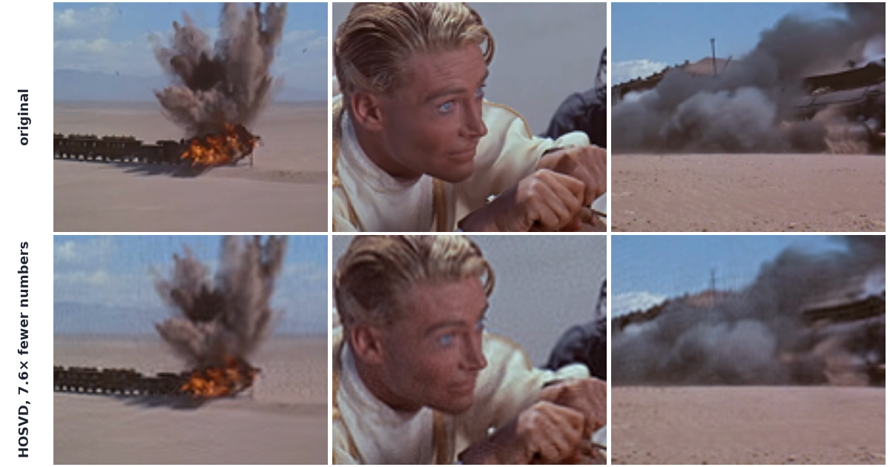
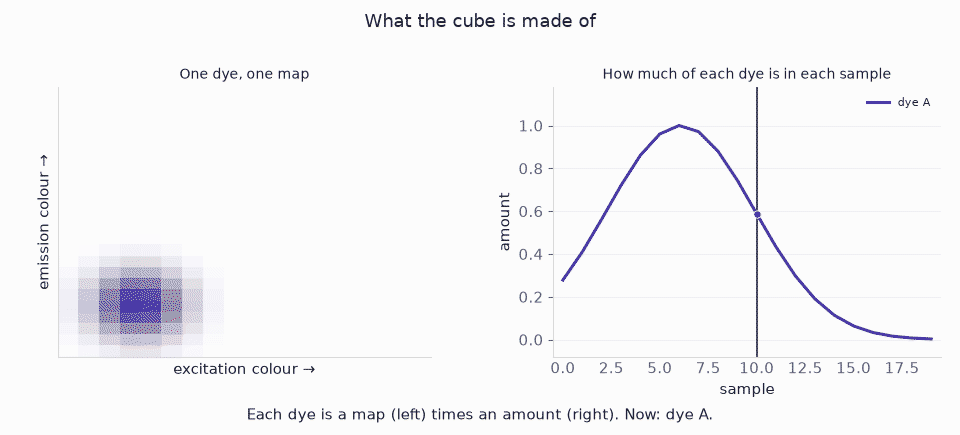

The main application of tensor factorizations is compression: images and video, or the parameter tensors inside a neural net — a VGG conv kernel, a transformer dense map.

The algebra is in [Tensor Factorizations and Tensor Inverses](../tensor-factorizations/). A post on tensor inverses is coming.

NumPy for CP, Tucker, and truncated HOSVD is first. Then the two compressions, then an unmixing cube: flattening loses the dyes.

## Tensor data

- **Film clip.** Five seconds of the 1962 *Lawrence of Arabia* theatrical trailer ([public domain, Wikimedia Commons](https://commons.wikimedia.org/wiki/File:Lawrence_Of_Arabia_(1962)_-_Trailer.webm)). Colour, picture and sound. Cut at 00:00:55 (train explosion, then the cut that follows). Files: `media/clip.mp4`, `still.png`, `frames.npy`, `clip.wav`.
- **Conv kernel.** Synthetic $3\times 3\times 64\times 64$ CP rank-16 weight plus noise, seed 7. Stands in for one VGG-16 `conv5` layer. The 512-channel counts are closed-form, not a downloaded VGG.
- **Dense map.** Synthetic $256\times 256$ TT-rank-4 matrix plus noise. Stands in for a $4096\times 4096$ transformer projection. The $4096$ counts use the same formula.
- **Mixing cube.** Synthetic $20\times 24\times 18$ table, three dyes plus noise: sample × emission colour × excitation colour. Seed 7. Stands in for a fluorescence excitation–emission stack.

Figures and the slider read `widget-data/curves.json`, written from the same seed.

<video controls width="480" src="media/clip.mp4"></video>

```{python}
#| echo: false
#| output: false
import io
import json
import shutil
import subprocess
import sys
import time
from pathlib import Path

import matplotlib.pyplot as plt
import numpy as np
import tensorly as tl
from matplotlib.patches import Polygon, Rectangle
from matplotlib.transforms import Affine2D
from PIL import Image
from scipy.io import wavfile
from scipy import signal
from tensorly.decomposition import parafac
from tensorly.cp_tensor import cp_to_tensor

sys.path.insert(0, "src")
import tensors as T

tl.set_backend("numpy")
CURVES = json.loads(Path("widget-data/curves.json").read_text())
CP, TT = CURVES["cp"], CURVES["tt"]

ACCENT = "#4A3AA7"
TEAL = "#2A9D8F"
CORAL = "#E07A5F"
GOLD = "#E9C46A"
GREY = "#999999"
INK = "#1F2430"

plt.rcParams.update({
    "axes.edgecolor": "0.85",
    "axes.labelcolor": INK,
    "text.color": INK,
    "xtick.color": "#5F6672",
    "ytick.color": "#5F6672",
    "font.size": 11,
    "axes.spines.top": False,
    "axes.spines.right": False,
})


def fmt_count(n):
    n = float(n)
    if n >= 1_000_000:
        return f"{n / 1_000_000:.2f} million"
    return f"{n:,.0f}"


def weight_hbars(ax, labels, values, colors, title):
    values = np.asarray(values, dtype=float)
    y = np.arange(len(labels))
    xmin = float(min(values) / 2.5)
    ax.barh(y, values - xmin, left=xmin, color=colors, height=0.55, zorder=3)
    ax.set_yticks(y)
    ax.set_yticklabels(labels)
    ax.invert_yaxis()
    ax.set_xlabel("Weights stored")
    ax.set_xscale("log")
    ax.set_xlim(xmin, max(values) * 3.2)
    ax.set_title(title)
    ax.xaxis.set_major_formatter(
        plt.FuncFormatter(lambda v, _: (
            f"{v / 1_000_000:.0f} million" if v >= 999_500
            else f"{v / 1_000:.0f}k" if v >= 1_000
            else f"{v:.0f}"
        ))
    )
    ax.xaxis.grid(True, color="#EEEFF2", zorder=0, which="both")
    ax.set_axisbelow(True)
    ax.tick_params(axis="y", length=0)
    for yi, v in zip(y, values):
        ax.text(v, yi, "  " + fmt_count(v), va="center", ha="left", fontsize=10, color=INK)


def rel_error_bars(ax, labels, errors, colors, title, noise=None):
    errors = np.asarray(errors, dtype=float)
    x = np.arange(len(labels))
    bars = ax.bar(x, errors, color=colors, width=0.62, zorder=3)
    ax.set_xticks(x)
    ax.set_xticklabels(labels)
    ax.set_ylabel("Relative error")
    ax.set_ylim(0, 1.08)
    ax.set_title(title)
    ax.yaxis.grid(True, color="#EEEFF2", zorder=0)
    ax.set_axisbelow(True)
    ax.tick_params(axis="x", length=0)
    if noise is not None:
        ax.axhline(
            noise, color=GREY, ls=":", lw=1.2, zorder=2,
            label=f"noise added ({noise:.2f})",
        )
        ax.legend(frameon=False, fontsize=9, loc="upper right")
    n_small = 0
    for bar, e in zip(bars, errors):
        if e >= 0.15:
            y = e + 0.035
        else:
            y = 0.16 + n_small * 0.11
            n_small += 1
        ax.text(
            bar.get_x() + bar.get_width() / 2,
            y,
            f"{e:.3f}",
            ha="center",
            va="bottom",
            fontsize=10,
            color=INK,
        )


def layer_impact(axes, labels, n_dense, n_kept, kept_colors):
    """Parameters, compression, and fraction kept for two named layers."""
    ax_p, ax_r, ax_k = axes
    n_dense = np.asarray(n_dense, dtype=float)
    n_kept = np.asarray(n_kept, dtype=float)
    ratios = n_dense / n_kept
    pct = 100.0 * n_kept / n_dense
    x = np.arange(len(labels))
    w = 0.36

    ax_p.bar(x - w / 2, n_dense, w, color=GREY, label="dense", zorder=3)
    for xi, k, col in zip(x, n_kept, kept_colors):
        ax_p.bar(xi + w / 2, k, w, color=col, zorder=3)
    ax_p.set_xticks(x)
    ax_p.set_xticklabels(labels, fontsize=9)
    ax_p.set_ylabel("Numbers stored")
    ax_p.set_yscale("log")
    ax_p.set_title("Parameters")
    ax_p.legend(
        handles=[
            Rectangle((0, 0), 1, 1, color=GREY, label="dense"),
            Rectangle((0, 0), 1, 1, color=kept_colors[0], label="after CP"),
            Rectangle((0, 0), 1, 1, color=kept_colors[1], label="after TT"),
        ],
        frameon=False,
        fontsize=9,
    )
    ax_p.yaxis.grid(True, color="#EEEFF2", zorder=0, which="both")
    ax_p.set_axisbelow(True)
    ax_p.tick_params(axis="x", length=0)
    ax_p.set_ylim(min(n_kept.min() / 2.5, n_dense.min() / 2.5), float(n_dense.max()) * 3.2)
    ax_p.yaxis.set_major_formatter(
        plt.FuncFormatter(lambda v, _: (
            f"{v / 1_000_000:.1f} million" if v >= 999_500
            else f"{v / 1_000:.0f}k" if v >= 1_000
            else f"{v:.0f}"
        ))
    )
    for xi, d, k in zip(x, n_dense, n_kept):
        ax_p.text(xi - w / 2, d, "  " + fmt_count(d), va="bottom", ha="center", fontsize=8, color=INK)
        ax_p.text(xi + w / 2, k, "  " + fmt_count(k), va="bottom", ha="center", fontsize=8, color=INK)

    ax_r.bar(x, ratios, color=kept_colors, width=0.55, zorder=3)
    ax_r.set_xticks(x)
    ax_r.set_xticklabels(labels, fontsize=9)
    ax_r.set_ylabel("Dense / kept")
    ax_r.set_title("Compression")
    ax_r.yaxis.grid(True, color="#EEEFF2", zorder=0)
    ax_r.set_axisbelow(True)
    ax_r.tick_params(axis="x", length=0)
    ax_r.set_ylim(0, float(ratios.max()) * 1.25)
    for xi, r in zip(x, ratios):
        ax_r.text(xi, r, f"  {r:.1f}×", ha="center", va="bottom", fontsize=10, color=INK)

    ax_k.bar(x, pct, color=kept_colors, width=0.55, zorder=3)
    ax_k.set_xticks(x)
    ax_k.set_xticklabels(labels, fontsize=9)
    ax_k.set_ylabel("Percent of dense")
    ax_k.set_title("Weights kept")
    ax_k.yaxis.grid(True, color="#EEEFF2", zorder=0)
    ax_k.set_axisbelow(True)
    ax_k.tick_params(axis="x", length=0)
    ax_k.set_ylim(0, max(4.0, float(pct.max()) * 1.45))
    for xi, p in zip(x, pct):
        ax_k.text(xi, p, f"  {p:.2f}%", ha="center", va="bottom", fontsize=10, color=INK)


def clip_tradeoff(axes, param_labels, n_dense, n_kept, err_labels, errors, kept_color):
    """Parameters, compression ratio, and relative error for a film clip."""
    ax_p, ax_r, ax_e = axes
    n_dense = np.asarray(n_dense, dtype=float)
    n_kept = np.asarray(n_kept, dtype=float)
    errors = np.asarray(errors, dtype=float)
    ratios = n_dense / n_kept

    x_p = np.arange(len(param_labels))
    w = 0.36
    ax_p.bar(x_p - w / 2, n_dense, w, color=GREY, label="dense", zorder=3)
    ax_p.bar(x_p + w / 2, n_kept, w, color=kept_color, label="HOSVD", zorder=3)
    ax_p.set_xticks(x_p)
    ax_p.set_xticklabels(param_labels)
    ax_p.set_ylabel("Numbers stored")
    ax_p.set_yscale("log")
    ax_p.set_title("Parameters")
    ax_p.legend(frameon=False, fontsize=9)
    ax_p.yaxis.grid(True, color="#EEEFF2", zorder=0, which="both")
    ax_p.set_axisbelow(True)
    ax_p.tick_params(axis="x", length=0)
    ymax = float(n_dense.max()) * 3.2
    ax_p.set_ylim(min(n_kept.min() / 2.5, n_dense.min() / 2.5), ymax)
    ax_p.yaxis.set_major_formatter(
        plt.FuncFormatter(lambda v, _: (
            f"{v / 1_000_000:.1f} million" if v >= 999_500
            else f"{v / 1_000:.0f}k" if v >= 1_000
            else f"{v:.0f}"
        ))
    )
    for xi, d, k in zip(x_p, n_dense, n_kept):
        ax_p.text(xi - w / 2, d, "  " + fmt_count(d), va="bottom", ha="center", fontsize=8, color=INK)
        ax_p.text(xi + w / 2, k, "  " + fmt_count(k), va="bottom", ha="center", fontsize=8, color=INK)

    x_r = np.arange(len(param_labels))
    ax_r.bar(x_r, ratios, color=TEAL, width=0.55, zorder=3)
    ax_r.set_xticks(x_r)
    ax_r.set_xticklabels(param_labels)
    ax_r.set_ylabel("Dense / kept")
    ax_r.set_title("Compression")
    ax_r.yaxis.grid(True, color="#EEEFF2", zorder=0)
    ax_r.set_axisbelow(True)
    ax_r.tick_params(axis="x", length=0)
    ax_r.set_ylim(0, max(1.15, float(ratios.max()) * 1.25))
    for xi, r in zip(x_r, ratios):
        ax_r.text(xi, r, f"  {r:.2f}×", ha="center", va="bottom", fontsize=10, color=INK)

    x_e = np.arange(len(err_labels))
    ax_e.bar(x_e, errors, color=CORAL, width=0.55, zorder=3)
    ax_e.set_xticks(x_e)
    ax_e.set_xticklabels(err_labels)
    ax_e.set_ylabel("Relative error")
    ax_e.set_title("Fit")
    ax_e.yaxis.grid(True, color="#EEEFF2", zorder=0)
    ax_e.set_axisbelow(True)
    ax_e.tick_params(axis="x", length=0)
    ax_e.set_ylim(0, max(0.12, float(errors.max()) * 1.45))
    for xi, e in zip(x_e, errors):
        ax_e.text(xi, e, f"  {e:.3f}", ha="center", va="bottom", fontsize=10, color=INK)


def iso_xy(x, y, z, origin, scale=1.0, depth=0.42):
    """Cabinet projection: x right, y up, z receding."""
    return np.array(
        [
            origin[0] + scale * (x + depth * z),
            origin[1] + scale * (y + 0.48 * depth * z),
        ]
    )


def imshow_quad(ax, image, bl, br, tr, tl, zorder=5):
    """Paint an image onto a parallelogram (bottom-left, bottom-right, top-right, top-left)."""
    image = np.clip(np.asarray(image), 0, 255).astype(np.uint8)
    bl, br, tr, tl = map(np.asarray, (bl, br, tr, tl))
    vx, vy = br - bl, tl - bl
    trans = Affine2D.from_values(
        vx[0], vx[1], vy[0], vy[1], bl[0], bl[1]
    ) + ax.transData
    im = ax.imshow(
        image,
        origin="upper",
        extent=(0, 1, 0, 1),
        transform=trans,
        interpolation="nearest",
        aspect="auto",
        zorder=zorder,
        clip_on=True,
    )
    im.set_clip_path(
        Polygon([bl, br, tr, tl], closed=True).get_path(),
        ax.transData,
    )
    ax.add_patch(
        Polygon(
            [bl, br, tr, tl],
            closed=True,
            fill=False,
            edgecolor=INK,
            lw=0.8,
            zorder=zorder + 1,
        )
    )
    return im


def dim_arrow(ax, p0, p1, text, color, outward=1.0, fontsize=9):
    p0, p1 = np.asarray(p0, dtype=float), np.asarray(p1, dtype=float)
    ax.annotate(
        "",
        xy=p1,
        xytext=p0,
        arrowprops=dict(
            arrowstyle="<->",
            color=color,
            lw=1.35,
            shrinkA=0,
            shrinkB=0,
        ),
        zorder=8,
    )
    mid = (p0 + p1) / 2
    v = p1 - p0
    n = np.array([-v[1], v[0]])
    n = n / (float(np.linalg.norm(n)) + 1e-9)
    loc = mid + outward * n * 0.16
    ax.text(
        loc[0],
        loc[1],
        text,
        color=color,
        ha="center",
        va="center",
        fontsize=fontsize,
        zorder=9,
    )


def draw_mode_cube(ax, origin, image, size, depth, scale, chan_colors):
    """Isometric H×W×C box with the frame on the front and R/G/B on the side."""
    w, h, dth = size
    p = lambda x, y, z: iso_xy(x, y, z, origin, scale=scale)
    bl, br, tr, tl = p(0, 0, 0), p(w, 0, 0), p(w, h, 0), p(0, h, 0)
    brz, trz, tlz = p(w, 0, dth), p(w, h, dth), p(0, h, dth)
    ax.add_patch(
        Polygon(
            [tl, tr, trz, tlz],
            closed=True,
            facecolor="#F2F3F7",
            edgecolor=INK,
            lw=0.7,
            zorder=2,
        )
    )
    n_c = len(chan_colors)
    for i, col in enumerate(chan_colors):
        z0, z1 = dth * i / n_c, dth * (i + 1) / n_c
        ax.add_patch(
            Polygon(
                [p(w, 0, z0), p(w, 0, z1), p(w, h, z1), p(w, h, z0)],
                closed=True,
                facecolor=col,
                edgecolor="white",
                lw=0.4,
                zorder=3,
            )
        )
    ax.add_patch(
        Polygon(
            [br, brz, trz, tr],
            closed=True,
            fill=False,
            edgecolor=INK,
            lw=0.7,
            zorder=4,
        )
    )
    imshow_quad(ax, image, bl, br, tr, tl, zorder=5)
    return {
        "bl": bl, "br": br, "tr": tr, "tl": tl,
        "brz": brz, "trz": trz, "tlz": tlz,
    }


def spec_db(z):
    mag = np.abs(z)
    return 20 * np.log10(mag + 1e-8 * mag.max())


def spec_to_rgb(z):
    """Spectrogram as an RGB image for painting onto a tensor cube."""
    mag = spec_db(z)
    mag = (mag - mag.min()) / (np.ptp(mag) + 1e-12)
    rgba = plt.colormaps["magma"](mag)
    return (rgba[..., :3] * 255).astype(np.uint8)


def bench(fn, n=25):
    fn()
    t0 = time.perf_counter()
    for _ in range(n):
        fn()
    return (time.perf_counter() - t0) / n


def audio_relative_errors(wav, wav_hat, Z, Z_hat, stft_t, stft_hat):
    """Relative errors on the STFT tensor, the complex STFT, and the waveform."""
    wav = np.asarray(wav, dtype=float)
    wav_hat = np.asarray(wav_hat, dtype=float)
    return {
        "stft_tensor": float(
            np.linalg.norm(stft_t - stft_hat) / np.linalg.norm(stft_t)
        ),
        "stft_complex": float(np.linalg.norm(Z - Z_hat) / np.linalg.norm(Z)),
        "waveform": float(np.linalg.norm(wav - wav_hat) / np.linalg.norm(wav)),
    }


def write_clip_mp4(path, frames, wav, sr, fps=12, size=(320, 240)):
    """Encode RGB (H, W, C, T) plus mono wav. Written at render; gitignored."""
    tmp = Path("_hosvd_frames")
    if tmp.exists():
        shutil.rmtree(tmp)
    tmp.mkdir()
    n_t = frames.shape[-1]
    for t in range(n_t):
        img = np.clip(frames[:, :, :, t], 0, 255).astype(np.uint8)
        Image.fromarray(img).resize(size, Image.Resampling.NEAREST).save(
            tmp / f"f{t:03d}.png"
        )
    wav_path = tmp / "a.wav"
    wavfile.write(
        wav_path, sr, np.clip(wav, -32767, 32767).astype(np.int16),
    )
    subprocess.run(
        [
            "ffmpeg", "-y", "-hide_banner", "-loglevel", "error",
            "-framerate", str(fps), "-i", str(tmp / "f%03d.png"),
            "-i", str(wav_path),
            "-c:v", "libx264", "-pix_fmt", "yuv420p",
            "-c:a", "aac", "-ac", "1", "-b:a", "64k", "-shortest",
            str(path),
        ],
        check=True,
    )
    shutil.rmtree(tmp)


```

## Factorizations

CP, Tucker, and truncated HOSVD in NumPy. The algebra is in [Tensor Factorizations and Tensor Inverses](../tensor-factorizations/). Later sections call these same functions.

### Toy cube

This section uses a synthetic $8\times 7\times 6$ array.

- Rank-2 CP: two outer products of Gaussian bumps, plus i.i.d. Gaussian noise at $0.08$ times the clean scale, seed 7.
- Stands in for a small 3-way table (sample × feature × condition). The size is so the factors fit on one screen.
- Objective: recover the two components. Report $\|X-\hat X\|_F/\|X\|_F$.
- A flattened SVD mixes the two bumps. An overspecified CP rank invents a third. Either error mis-assigns which condition drives which feature.
- Tensor methods fit because Kruskal uniqueness (CP) and per-mode truncation (HOSVD / Tucker) are properties of this layout, not of any matrix obtained from it.

```{python}
def bump_1d(n, center, width):
    grid = np.linspace(0.0, 1.0, n)
    return np.exp(-0.5 * ((grid - center) / width) ** 2)


rng_toy = np.random.default_rng(7)
shape = (8, 7, 6)
terms = []
for center in ((0.28, 0.22, 0.30), (0.72, 0.75, 0.70)):
    a = bump_1d(shape[0], center[0], 0.16)
    b = bump_1d(shape[1], center[1], 0.16)
    c = bump_1d(shape[2], center[2], 0.16)
    terms.append(a[:, None, None] * b[None, :, None] * c[None, None, :])
X_clean = sum(terms)
X = X_clean + 0.08 * float(X_clean.std()) * rng_toy.normal(size=X_clean.shape)
print("X.shape", X.shape, "entries", X.size)
```

### Unfolding

Mode-$n$ unfolding $X_{(n)}$ puts mode $n$ on the rows. SVD of that matrix is Eckart–Young for the unfolding, not for $X$. Mode-$n$ product $X\times_n M$ is $M$ times that unfolding, folded back.

```{python}
def unfold(X, n):
    return np.moveaxis(X, n, 0).reshape(X.shape[n], -1)


def fold(mat, n, shape):
    full = [shape[n]] + [s for i, s in enumerate(shape) if i != n]
    return np.moveaxis(mat.reshape(full), 0, n)


def mode_prod(X, M, n):
    shape = list(X.shape)
    shape[n] = M.shape[0]
    return fold(M @ unfold(X, n), n, tuple(shape))
```

### Truncated HOSVD

Higher-order SVD (De Lathauwer, De Moor, Vandewalle 2000): one truncated SVD per unfolding; the core is $X$ projected onto those bases. The three truncations are not jointly optimal for the Tucker loss.

```{python}
def truncated_hosvd(X, ranks):
    factors = []
    for n, r in enumerate(ranks):
        u, _, _ = np.linalg.svd(unfold(X, n), full_matrices=False)
        factors.append(u[:, :r])
    core = X
    for n, U in enumerate(factors):
        core = mode_prod(core, U.T, n)
    recon = core
    for n, U in enumerate(factors):
        recon = mode_prod(recon, U, n)
    return recon, core, factors


def hosvd_approx(tensor, ranks):
    recon, _, _ = truncated_hosvd(tensor, ranks)
    n_params = int(
        np.prod(ranks) + sum(s * r for s, r in zip(tensor.shape, ranks))
    )
    err = float(np.linalg.norm(tensor - recon) / np.linalg.norm(tensor))
    return recon, n_params, err


X_hosvd, G_hosvd, _ = truncated_hosvd(X, (2, 2, 2))
print("HOSVD core", G_hosvd.shape)
print(f"HOSVD relative error {T.rel_fro(X, X_hosvd):.4f}")
```

### Tucker

HOOI starts from that HOSVD and cycles modes: contract the others, replace the factor by the leading left singular vectors (Tucker 1966). TensorLy's `tucker(..., init="svd")` is this pipeline.

```{python}
def tucker_als(X, ranks, n_iter=15):
    _, _, factors = truncated_hosvd(X, ranks)
    for _ in range(n_iter):
        for n, r in enumerate(ranks):
            Y = X
            for m, U in enumerate(factors):
                if m != n:
                    Y = mode_prod(Y, U.T, m)
            u, _, _ = np.linalg.svd(unfold(Y, n), full_matrices=False)
            factors[n] = u[:, :r]
    core = X
    for n, U in enumerate(factors):
        core = mode_prod(core, U.T, n)
    recon = core
    for n, U in enumerate(factors):
        recon = mode_prod(recon, U, n)
    return recon, core, factors


X_tucker, G_tucker, _ = tucker_als(X, (2, 2, 2))
print("Tucker core", G_tucker.shape)
print(f"Tucker relative error {T.rel_fro(X, X_tucker):.4f}")
```

### CP

CANDECOMP/PARAFAC writes $X$ as a sum of rank-1 outer products. ALS: fix every factor but one, solve a Khatri–Rao least-squares problem, cycle (Harshman 1970; Kolda and Bader 2009). CP rank can exceed a mode size; extra columns are random if the unfolding SVD runs out of vectors.

```{python}
def khatri_rao_except(factors, skip):
    mats = [F for i, F in enumerate(factors) if i != skip]
    out = mats[0]
    for F in mats[1:]:
        out = np.einsum("ir,jr->ijr", out, F).reshape(-1, out.shape[1])
    return out


def cp_reconstruct(factors):
    subs = ",".join(f"{chr(105 + n)}r" for n in range(len(factors)))
    out = "".join(chr(105 + n) for n in range(len(factors)))
    return np.einsum(f"{subs}->{out}", *factors)


def cp_als(X, rank, n_iter=50, seed=7):
    rng = np.random.default_rng(seed)
    factors = []
    for n in range(X.ndim):
        u, _, _ = np.linalg.svd(unfold(X, n), full_matrices=False)
        U = rng.normal(size=(X.shape[n], rank))
        keep = min(rank, u.shape[1])
        U[:, :keep] = u[:, :keep]
        factors.append(U)
    for _ in range(n_iter):
        for n in range(X.ndim):
            gram = np.ones((rank, rank))
            for m, F in enumerate(factors):
                if m != n:
                    gram *= F.T @ F
            factors[n] = (
                unfold(X, n) @ khatri_rao_except(factors, n) @ np.linalg.pinv(gram)
            )
        for n in range(X.ndim - 1):
            scale = np.linalg.norm(factors[n], axis=0, keepdims=True) + 1e-12
            factors[n] /= scale
            factors[-1] *= scale
    return factors


cp_factors = cp_als(X, rank=2, n_iter=40)
X_cp = cp_reconstruct(cp_factors)
print("CP factor shapes", [F.shape for F in cp_factors])
print(f"CP relative error {T.rel_fro(X, X_cp):.4f}")
```

Noise was added at $0.08$ times the clean scale. A residual near $0.06$ is that noise, not a missed component. The three fits land on the same floor because the cube *is* rank-2 CP.

```{python}
#| label: fig-toy-factorizations
#| fig-cap: "One slice of the $8\\times 7\\times 6$ cube (third mode, index 3). Left to right: data, truncated HOSVD, Tucker (HOOI), CP-ALS. Rank $(2,2,2)$ / CP rank $2$."
#| fig-width: 10
#| fig-height: 2.8
#| code-fold: true

k = 3
panels = (
    (X[:, :, k], r"data $X$"),
    (X_hosvd[:, :, k], "HOSVD"),
    (X_tucker[:, :, k], "Tucker"),
    (X_cp[:, :, k], "CP"),
)
fig, axes = plt.subplots(1, 4, figsize=(10, 2.8))
vmax = max(np.abs(p[0]).max() for p in panels)
for ax, (sl, title) in zip(axes, panels):
    ax.imshow(sl, origin="lower", cmap="magma", vmin=0, vmax=vmax)
    ax.set_title(title)
    ax.set_xticks([])
    ax.set_yticks([])
fig.tight_layout()
```

## CP convolution

VGG-16 (Simonyan and Zisserman 2015) uses $3\times 3$ convolutions throughout. After the fourth pool the feature map is $14\times 14$. Each of `conv5_1`, `conv5_2`, `conv5_3` maps 512 channels to 512 channels.

**Before.** That kernel is a 4-way array $3\times 3\times 512\times 512$: one $3\times 3$ patch for every input–output pair. Storage $3\cdot 3\cdot 512\cdot 512=2{,}359{,}296$ weights. Every spatial site on the $14\times 14$ map pays that cost, so one forward pass is $9\cdot 512\cdot 512\cdot 14\cdot 14\approx 462$ million multiply-adds.

**What CP changes.** Canonical polyadic decomposition writes that 4-D stack as a short sum of separable pieces. In the network that becomes four skinny convolutions in a row (Lebedev et al. 2015):

- $1\times 1$ squeeze: 512 channels down to $R$.
- Depthwise $3\times 1$: smear vertically, one channel at a time.
- Depthwise $1\times 3$: smear horizontally.
- $1\times 1$ expand: $R$ channels back to 512.

Same $3\times 3$ receptive field as VGG. Far fewer weights. Too small an $R$ mixes input channels that should stay separate — that shows up as relative error, not as a storage bug. The usual workflow is compress a trained net, then fine-tune.

**After.** Rank $64$ stores $65{,}920$ weights — $35.8\times$ fewer. Multiply-adds drop by the same factor, because the spatial size of the map cancels. Formula: $R(2d+C_{\mathrm{in}}+C_{\mathrm{out}})$ against $d^{2}C_{\mathrm{in}}C_{\mathrm{out}}$.

$$
W_{ijkl}\approx\sum_{r=1}^{R}a_{ir}\,b_{jr}\,c_{kr}\,d_{lr}.
$$

Storage is exact. Fit quality is relative error $\|W-\hat W\|_F/\|W\|_F$: the leftover fraction of the kernel. A trained VGG layer is not exact CP, so some relative error remains even at rank $64$; that is why Lebedev et al. fine-tune.

The 512-channel drop is a closed-form count (no VGG is fitted). Toy relative error on a $3\times 3\times 64\times 64$ kernel (true rank 16, noise $0.08$): rank 4 is $0.62$; rank 16 is $0.077$ (the noise); rank 64 is $0.066$. Rank 16 on the toy stores $2{,}144$ weights instead of $36{,}864$ ($17.2\times$).

```{python}
W, _ = T.make_cp_kernel(np.random.default_rng(T.SEED))
W_hat = cp_reconstruct(cp_als(W, rank=16, n_iter=40))
n_cp = T.cp_conv_params(W.shape[0], W.shape[2], W.shape[3], 16)
print("kernel", W.shape)
print(
    f"CP rank 16: {n_cp:,} / {W.size:,} weights "
    f"({W.size / n_cp:.1f}x), "
    f"relative error {T.rel_fro(W, W_hat):.3f}"
)
```

## TT-matrix dense layers

A transformer block at model dimension $4096$ stores square maps of that width: the output projection of multi-head attention $W_O\in\mathbb{R}^{4096\times 4096}$ (Vaswani et al. 2017). Novikov et al. (2015) write a dense matrix of this kind as a tensor-train.

**Before.** Mapping 4096 numbers to 4096 numbers stores $4096^{2}=16{,}777{,}216$ weights. Multiplying a residual-stream vector by $W_O$ costs $O(N^{2})$.

**What a TT-matrix changes.** Factor $4096=8\times 8\times 8\times 8$. Fold the rectangle into a higher-order array and write it as a chain of small cores $G_k\in\mathbb{R}^{r_{k-1}\times 8\times 8\times r_k}$ (Novikov et al. 2015; Oseledets 2011). Multiplying a vector is a sweep along that chain, not one huge matmul. Storage at equal mode size $n$ and internal rank $r$ is $O(d n^{2} r^{2})$, not $O(N^{2})$.

**After.** Rank $16$ stores $34{,}816$ weights — $481.9\times$ fewer. Apply cost drops to $O(d r^{2} n N)$. Ordinary SVD of the unfolded rectangle cannot see that chain: a map that is low-rank *after folding* still looks high-rank as a matrix, so its relative error stays large.

The 4096-wide drop is closed-form (no transformer is fitted). @fig-param-impact is both layers at those ranks. Toy relative error on a $256\times 256$ map built at TT-rank 4 plus noise $0.08$: TT-rank 4 is $0.079$ on $640$ weights; SVD rank 4 is $0.932$ on $2{,}052$ weights; SVD rank 64 is $0.436$ on $32{,}832$ weights.

```{python}
ms = ns = [T.TT_MODE] * T.TT_ORDER
M, _ = T.make_tt_matrix(np.random.default_rng(T.SEED), ms, ns)
cores = T.tt_matrix_svd(M, ms, ns, max_rank=4)
M_tt = T.tt_matrix_to_dense(cores)
print("matrix", M.shape, "TT cores", [c.shape for c in cores])
print(f"TT-rank 4 relative error {T.rel_fro(M, M_tt):.3f}")
```

```{python}
#| label: fig-param-impact
#| fig-cap: "Closed-form storage at the ranks in the two sections. Left: weights, dense vs kept. Middle: compression (dense / kept). Right: fraction of the dense layer that remains. No network is fitted."
#| fig-width: 10
#| fig-height: 3.8

fig, axes = plt.subplots(1, 3, figsize=(10, 3.8))
layer_impact(
    axes,
    ["VGG-16 conv5", r"Transformer $W_O$"],
    [CP["headline"]["dense_params"], TT["headline"]["dense_params"]],
    [CP["headline"]["cp_params"], TT["headline"]["tt_params"]],
    [ACCENT, TEAL],
)
fig.tight_layout()
```

The slider below varies rank. Relative error there is the toys.

::: {.widget-container}
::: {.widget-header}
<span class="widget-title">Seven ranks — weights and relative error</span>
<span class="widget-badge">runs in the browser</span>
:::
<div id="tf-widget"></div>
<div class="widget-note">Seven ranks. Defaults are the ranks the toys were built at (CP 16, TT 4) — the gold band on the error plot. Weight bars are VGG-16 conv5 / transformer $W_O$ closed-form counts, not the toys.</div>
:::

## Complexity

The table answers two questions: how many numbers you store, and how much arithmetic one forward pass costs. $H,W$ are the spatial size of a feature map. $N=n^{d}$ is one side of a square TT-matrix with $d$ equal modes. Apply is the thing you run at inference — a convolution, or $Wx$.

| Method | Storage | Apply |
|---|---|---|
| Dense conv | $O(d^{2}C_{\mathrm{in}}C_{\mathrm{out}})$ | $O(d^{2}C_{\mathrm{in}}C_{\mathrm{out}}HW)$ |
| CP-conv rank $R$ | $O(R(2d+C_{\mathrm{in}}+C_{\mathrm{out}}))$ | $O(R(C_{\mathrm{in}}+2d+C_{\mathrm{out}})HW)$ |
| Dense $M\times N$ | $O(MN)$ | $O(MN)$ |
| SVD rank $k$ | $O(k(M+N))$ | $O(k(M+N))$ |
| TT-matrix rank $r$, $d$ modes of size $n$ | $O(d n^{2} r^{2})$ | $O(d r^{2} n N)$ |

The VGG-16 `conv5` counts and the $4096$ transformer map are the closed-form counts from the two sections above. The clock below is NumPy on the toy 64-channel kernel and a $16\times 16$ map — not a cuDNN GEMM. Factorized is still fewer multiply-adds; wall-clock can go the other way on a GPU once the chain of small contractions becomes memory-bound.

```{python}
#| label: conv-timing
rng = np.random.default_rng(T.SEED)
W, _ = T.make_cp_kernel(rng)
weights, factors = parafac(W, rank=16, n_iter_max=40, init="svd")
X = rng.normal(size=(16, 16, 64))
d = 3
A_f, B_f, C_f, D_f = factors


def dense_conv():
    out = np.zeros((14, 14, 64))
    for i in range(d):
        for j in range(d):
            out += X[i : i + 14, j : j + 14] @ W[i, j]
    return out


def cp_conv():
    z = X @ C_f
    y1 = np.zeros((14, 16, 16))
    for i in range(d):
        y1 += z[i : i + 14] * A_f[i]
    y2 = np.zeros((14, 14, 16))
    for j in range(d):
        y2 += y1[:, j : j + 14] * B_f[j]
    return y2 @ D_f.T


yd, yc = dense_conv(), cp_conv()
t_dense = bench(dense_conv)
t_cp = bench(cp_conv)
print(
    f"conv rel error {np.linalg.norm(yd - yc) / np.linalg.norm(yd):.4f}; "
    f"dense {t_dense * 1e3:.2f} ms; CP {t_cp * 1e3:.2f} ms; "
    f"speedup {t_dense / t_cp:.1f}x"
)
print(
    f"headline MACs 512-ch 14x14: dense {9 * 512 * 512 * 196:,} vs "
    f"CP {64 * (512 + 6 + 512) * 196:,} ({(9 * 512 * 512) / (64 * 1030):.1f}x)"
)
```

### A film clip

A pixel is three numbers: red, green, blue. Height and width stack those triples into an image. Colour is a third mode of the array; time is a fourth. The clip is those four modes in one tensor.

```{python}
#| echo: false
#| output: false
MEDIA = Path("media")
still = np.asarray(Image.open(MEDIA / "still.png").convert("RGB"), dtype=float)
frames = np.load(MEDIA / "frames.npy").astype(float)
```

```{python}
#| label: fig-tensor-containers
#| fig-cap: "Pixel triples stacked into tensor containers. Height and width make an image; colour is a third mode; time stacks frames into a 4-tensor."
#| fig-width: 12.2
#| fig-height: 4.15

CHAN = ["#C0392B", "#1E8449", "#2471A3"]
rh, rw = 12, 16
sat = still.astype(float).std(axis=2)
best, pos = -1.0, (0, 0)
for i in range(0, still.shape[0] - rh, 3):
    for j in range(0, still.shape[1] - rw, 4):
        score = float(sat[i : i + rh, j : j + rw].mean())
        if score > best:
            best, pos = score, (i, j)
r0, c0 = pos
pix = still[r0 : r0 + rh, c0 : c0 + rw]
crop_box = (c0, r0, rw, rh)  # x, y, w, h in image coords
H_img, W_img = still.shape[:2]
n_t = frames.shape[-1]
t_idx = (0, n_t // 2, n_t - 1)

fig = plt.figure(figsize=(12.2, 4.15))
gs = fig.add_gridspec(1, 4, width_ratios=[1.05, 1.12, 1.22, 1.55], wspace=0.22)

ax0 = fig.add_subplot(gs[0])
ax0.imshow(pix.astype(np.uint8), interpolation="nearest")
ny, nx = pix.shape[:2]
ax0.set_xticks(np.arange(-0.5, nx, 1), minor=True)
ax0.set_yticks(np.arange(-0.5, ny, 1), minor=True)
ax0.grid(which="minor", color="white", lw=0.55)
ax0.tick_params(which="both", bottom=False, left=False, labelbottom=False, labelleft=False)
ax0.set_title("pixels", fontsize=11, pad=8)
ax0.set_xlabel("each cell is (R, G, B)", fontsize=9, color="#5F6672")
for spine in ax0.spines.values():
    spine.set_color(INK)
    spine.set_linewidth(0.8)

ax1 = fig.add_subplot(gs[1])
ax1.imshow(still.astype(np.uint8))
ax1.add_patch(
    Rectangle(
        (crop_box[0] - 0.5, crop_box[1] - 0.5),
        crop_box[2],
        crop_box[3],
        fill=False,
        edgecolor=CORAL,
        lw=1.4,
    )
)
ax1.set_title("image", fontsize=11, pad=8)
ax1.tick_params(bottom=False, left=False, labelbottom=False, labelleft=False)
ax1.annotate(
    "",
    xy=(-0.04, 0.02),
    xytext=(-0.04, 0.98),
    xycoords="axes fraction",
    textcoords="axes fraction",
    arrowprops=dict(arrowstyle="<->", color=ACCENT, lw=1.4),
)
ax1.text(
    -0.10, 0.5, "height", rotation=90, va="center", ha="center",
    color=ACCENT, fontsize=9, transform=ax1.transAxes,
)
ax1.annotate(
    "",
    xy=(0.02, -0.04),
    xytext=(0.98, -0.04),
    xycoords="axes fraction",
    textcoords="axes fraction",
    arrowprops=dict(arrowstyle="<->", color=TEAL, lw=1.4),
)
ax1.text(
    0.5, -0.12, "width", ha="center", va="top",
    color=TEAL, fontsize=9, transform=ax1.transAxes,
)
ax1.text(
    0.5, -0.22, rf"$H \times W = {H_img}\times {W_img}$",
    ha="center", va="top", fontsize=9, color="#5F6672",
    transform=ax1.transAxes,
)
for spine in ax1.spines.values():
    spine.set_visible(False)

ax2 = fig.add_subplot(gs[2])
ax2.set_xlim(0.05, 2.55)
ax2.set_ylim(-0.35, 2.35)
ax2.set_aspect("equal")
ax2.axis("off")
ax2.set_title("3-tensor", fontsize=11, pad=8)
c2 = draw_mode_cube(
    ax2, origin=np.array([0.22, 0.28]), image=still,
    size=(1.55, 1.55, 0.42), depth=0.42, scale=1.0, chan_colors=CHAN,
)
dim_arrow(ax2, c2["bl"], c2["br"], "width", TEAL, outward=-1.0)
dim_arrow(ax2, c2["bl"], c2["tl"], "height", ACCENT, outward=1.0)
dim_arrow(ax2, c2["br"], c2["brz"], "color", CORAL, outward=-1.15, fontsize=8)
ax2.text(
    1.28, -0.28, r"$H \times W \times C$",
    ha="center", va="top", fontsize=9, color="#5F6672",
)
for i, lab in enumerate("RGB"):
    ax2.text(
        c2["brz"][0] + 0.10,
        c2["br"][1] + (c2["tr"][1] - c2["br"][1]) * (0.18 + 0.32 * i),
        lab,
        color=CHAN[i],
        fontsize=8,
        ha="left",
        va="center",
        fontweight="bold",
    )

ax3 = fig.add_subplot(gs[3])
ax3.set_xlim(0.0, 3.35)
ax3.set_ylim(-0.45, 2.58)
ax3.set_aspect("equal")
ax3.axis("off")
ax3.set_title("4-tensor", fontsize=11, pad=8)
origins = [np.array([0.12, 0.18]), np.array([0.78, 0.46]), np.array([1.44, 0.74])]
cubes = [None] * 3
for i in reversed(range(3)):
    cubes[i] = draw_mode_cube(
        ax3, origin=origins[i], image=frames[:, :, :, t_idx[i]],
        size=(1.05, 1.05, 0.28), depth=0.28, scale=1.0, chan_colors=CHAN,
    )
c0 = cubes[0]
dim_arrow(ax3, c0["bl"], c0["br"], "width", TEAL, outward=-1.05, fontsize=8)
dim_arrow(ax3, c0["bl"], c0["tl"], "height", ACCENT, outward=1.05, fontsize=8)
dim_arrow(ax3, c0["br"], c0["brz"], "color", CORAL, outward=-1.2, fontsize=8)
ax3.annotate(
    "",
    xy=cubes[-1]["trz"] + np.array([0.08, 0.12]),
    xytext=c0["tlz"] + np.array([-0.02, 0.12]),
    arrowprops=dict(arrowstyle="->", color=GOLD, lw=1.45),
)
ax3.text(
    1.95, 2.22, "time", color=GOLD, fontsize=9, ha="center", va="bottom",
)
for cube, t in zip(cubes, t_idx):
    ax3.text(
        0.5 * (cube["tl"][0] + cube["tr"][0]),
        cube["tlz"][1] + 0.10,
        f"t = {t}",
        fontsize=8,
        color="#5F6672",
        ha="center",
        va="bottom",
    )
ax3.text(
    1.65, -0.38, r"$H \times W \times C \times T$",
    ha="center", va="top", fontsize=9, color="#5F6672",
)
ax3.text(
    1.65, -0.58, rf"$120\times 160\times 3\times {n_t}$",
    ha="center", va="top", fontsize=8, color="#5F6672",
)

fig.subplots_adjust(left=0.04, right=0.99, top=0.86, bottom=0.16)
```

The source clip is in Tensor data: 5 s, picture and sound. Truncated HOSVD (one SVD per mode, no HOOI) compresses the still, the RGB video, and the soundtrack STFT. Ranks target relative error about $0.05$. Reconstructed picture and sound are muxed into `media/clip-hosvd.mp4`. It is the same `truncated_hosvd` as in Factorizations.

```{python}
IMG_RANKS = (20, 28, 3)
VID_RANKS = (60, 80, 3, 30)
AUD_RANKS = (88, 140, 2)
still_hat, still_core, _ = truncated_hosvd(still, IMG_RANKS)
print("still", still.shape, "→ core", still_core.shape)
print(f"still relative error {T.rel_fro(still, still_hat):.3f}")
```

```{python}
#| label: film-hosvd
#| echo: false
#| output: false

sr, wav = wavfile.read(MEDIA / "clip.wav")
wav = wav.astype(float)

IMG_RANKS = (20, 28, 3)
VID_RANKS = (60, 80, 3, 30)
AUD_RANKS = (88, 140, 2)

img_hat, img_params, img_err = hosvd_approx(still, IMG_RANKS)
vid_hat, vid_params, vid_err = hosvd_approx(frames, VID_RANKS)

stft_freq, stft_times, Z = signal.stft(wav, fs=sr, nperseg=256)
stft_t = np.stack([Z.real, Z.imag], axis=-1)
aud_hat, aud_params, _aud_tensor_err = hosvd_approx(stft_t, AUD_RANKS)
Z_hat = aud_hat[:, :, 0] + 1j * aud_hat[:, :, 1]
_, wav_hat = signal.istft(Z_hat, fs=sr, nperseg=256)
wav_hat = wav_hat[: wav.size]
aud_err = audio_relative_errors(wav, wav_hat, Z, Z_hat, stft_t, aud_hat)
wavfile.write(
    MEDIA / "clip-cp.wav",
    sr,
    np.clip(wav_hat, -32767, 32767).astype(np.int16),
)
write_clip_mp4(MEDIA / "clip-hosvd.mp4", vid_hat, wav_hat, sr)
```

### Video

Still $240\times 320\times 3$, ranks $(20,28,3)$. Clip $120\times 160\times 3\times 60$, ranks $(60,80,3,30)$. Time is its own mode, so motion is not smeared into space.

```{python}
#| label: fig-film-video-stats
#| fig-cap: "Still and video after HOSVD. Left: numbers stored, dense vs kept. Middle: compression (dense / kept). Right: relative error."
#| fig-width: 10
#| fig-height: 3.6

fig, axes = plt.subplots(1, 3, figsize=(10, 3.6))
clip_tradeoff(
    axes,
    ["Still", "Video"],
    [still.size, frames.size],
    [img_params, vid_params],
    ["Still", "Video"],
    [img_err, vid_err],
    ACCENT,
)
fig.tight_layout()
```

```{python}
#| echo: false
#| output: asis
print(
    f"- Still: ${img_params:,}$ / ${still.size:,}$ numbers "
    f"(${still.size / img_params:.1f}\\times$), relative error ${img_err:.3f}$.\n"
    f"- Video: ${vid_params:,}$ / ${frames.size:,}$ "
    f"(${frames.size / vid_params:.1f}\\times$), relative error ${vid_err:.3f}$.\n"
)
```

```{python}
#| label: fig-film-still
#| fig-cap: "One trailer frame. Left: original. Right: compressed (keep 20 height pieces, 28 width pieces, and all 3 colour channels)."
#| fig-width: 10
#| fig-height: 3.8

fig, axes = plt.subplots(1, 2, figsize=(10, 3.8))
for ax, arr, title in (
    (axes[0], still, "original"),
    (axes[1], np.clip(img_hat, 0, 255), "compressed"),
):
    ax.imshow(arr.astype(np.uint8))
    ax.set_title(title)
    ax.set_axis_off()
fig.tight_layout()
```

Original 5 s clip (picture and sound):

<video controls width="480" src="media/clip.mp4"></video>

```{python}
#| echo: false
#| output: asis
print(
    f"After HOSVD. Video relative error ${vid_err:.3f}$.\n"
)
```

<video controls width="480" src="media/clip-hosvd.mp4"></video>

```{python}
#| label: fig-film-video
#| fig-cap: "Three frames from the 5 s clip. Top: original. Bottom: compressed. Time is kept as its own axis, so motion is not smeared into space."
#| fig-width: 10
#| fig-height: 4.4

n_t = frames.shape[-1]
idx = (0, n_t // 2, n_t - 1)
fig, axes = plt.subplots(2, 3, figsize=(10, 4.4))
for j, t in enumerate(idx):
    axes[0, j].imshow(np.clip(frames[:, :, :, t], 0, 255).astype(np.uint8))
    axes[1, j].imshow(np.clip(vid_hat[:, :, :, t], 0, 255).astype(np.uint8))
    axes[0, j].set_title(f"original, frame {t}")
    axes[1, j].set_title(f"compressed, frame {t}")
    axes[0, j].set_axis_off()
    axes[1, j].set_axis_off()
fig.tight_layout()
```

```{python}
#| label: cover
#| echo: false
#| output: false

# Cover: the post's claim as pictures — the same frames as @fig-film-video,
# full bleed, with what the compression cost.
def _crop_to(img, aspect):
    h, w = img.shape[:2]
    want_w = int(round(h * aspect))
    if want_w <= w:
        x0 = (w - want_w) // 2
        return img[:, x0 : x0 + want_w]
    want_h = int(round(w / aspect))
    y0 = (h - want_h) // 2
    return img[y0 : y0 + want_h]


def write_film_cover(path="cover.png", size=(1200, 630), dpi=100):
    n_t = frames.shape[-1]
    # Explosion, the cut to the close-up, then the wreck: three different
    # kinds of picture, so the cost of compression is visible on each.
    picks = (0, n_t // 4, n_t // 2)
    fig_k = plt.figure(figsize=(size[0] / dpi, size[1] / dpi), dpi=dpi, facecolor="white")
    label_w, gut = 0.055, 0.005
    panel_w = (1.0 - label_w - gut * 4) / 3
    panel_h = (1.0 - gut * 3) / 2
    aspect = (panel_w * size[0]) / (panel_h * size[1])
    rows = (
        (frames, "original"),
        (vid_hat, f"HOSVD, {frames.size / vid_params:.1f}× fewer numbers"),
    )
    for r, (stack, label) in enumerate(rows):
        y0 = gut * (2 - r) + (1 - r) * panel_h
        for c, t in enumerate(picks):
            ax_k = fig_k.add_axes(
                [label_w + gut * (c + 1) + c * panel_w, y0, panel_w, panel_h]
            )
            img = np.clip(stack[:, :, :, t], 0, 255).astype(np.uint8)
            ax_k.imshow(_crop_to(img, aspect), interpolation="bilinear", aspect="auto")
            ax_k.set_xticks([])
            ax_k.set_yticks([])
            for spine in ax_k.spines.values():
                spine.set_visible(False)
        fig_k.text(
            label_w / 2,
            y0 + panel_h / 2,
            label,
            rotation=90,
            ha="center",
            va="center",
            fontsize=13,
            fontweight="bold",
            color=INK,
        )
    fig_k.savefig(path, dpi=dpi, facecolor="white")
    plt.close(fig_k)


write_film_cover()
```

### Audio

A microphone stores air pressure as one number per sample. That list is a 1-tensor: one mode, time. Factorizing it is a 1-D SVD — there is no second mode to separate.

The short-time Fourier transform (STFT) cuts the list into overlapping windows and writes each window as a spectrum. Stack the spectra along time. The array is frequency $\times$ time, a 2-tensor — the same layout as a greyscale image. Each bin is complex, so split real and imaginary into a third mode. Frequency $\times$ time $\times$ \{real, imag\} is a 3-tensor, the same layout as an RGB still.

This clip: 5 s mono at 8 kHz. Window $n=256$, hop $128$. Truncated HOSVD ranks $(88,140,2)$.

- **samples** — each cell is one pressure number.
- **1-tensor** — the waveform. Overlapping windows are the STFT cuts.
- **2-tensor** — those spectra stacked: frequency $\times$ time.
- **3-tensor** — add \{real, imag\}, the way colour is added to an image.

```{python}
#| label: fig-audio-containers
#| fig-cap: "Pressure samples stacked into tensor containers. The waveform is a 1-tensor. The STFT makes a 2-tensor (frequency × time). Real and imaginary parts are a third mode, as colour is for an image."
#| fig-width: 12.2
#| fig-height: 4.2

NPER = 256
HOP = NPER // 2
peak = int(np.argmax(np.abs(wav)))
n_show = 16
i_samp = max(0, peak - n_show // 2)
samps = wav[i_samp : i_samp + n_show]
view = int(0.28 * sr)
i0 = max(0, peak - view // 2)
i1 = min(wav.size, i0 + view)
win_starts = [
    s for s in range(0, wav.size - NPER + 1, HOP)
    if s + NPER > i0 and s < i1
][:5]
win_cols = [ACCENT, TEAL, CORAL, GOLD, "#5F6672"]
REIM = [CORAL, TEAL]
spec_img = spec_to_rgb(Z)

fig = plt.figure(figsize=(12.2, 4.2))
gs = fig.add_gridspec(1, 4, width_ratios=[1.02, 1.18, 1.22, 1.45], wspace=0.28)

ax0 = fig.add_subplot(gs[0])
vmax = float(np.max(np.abs(samps))) + 1e-9
ax0.imshow(
    samps[np.newaxis, :],
    cmap="coolwarm",
    vmin=-vmax,
    vmax=vmax,
    interpolation="nearest",
    aspect="auto",
)
ax0.set_xticks(np.arange(-0.5, n_show, 1), minor=True)
ax0.set_yticks([-0.5, 0.5], minor=True)
ax0.grid(which="minor", color="white", lw=0.7)
ax0.tick_params(which="both", bottom=False, left=False, labelbottom=False, labelleft=False)
ax0.set_title("samples", fontsize=11, pad=8)
ax0.set_xlabel("each cell is one number", fontsize=9, color="#5F6672")
for spine in ax0.spines.values():
    spine.set_color(INK)
    spine.set_linewidth(0.8)

ax1 = fig.add_subplot(gs[1])
tt = np.arange(i0, i1) / sr
ax1.plot(tt, wav[i0:i1], color=INK, lw=1.05, zorder=3)
for k, s in enumerate(win_starts):
    ax1.axvspan(
        s / sr, (s + NPER) / sr,
        color=win_cols[k % len(win_cols)], alpha=0.22, lw=0, zorder=0,
    )
ax1.axvline(i_samp / sr, color=CORAL, lw=1.0, ls=":", zorder=4)
ax1.axvline((i_samp + n_show) / sr, color=CORAL, lw=1.0, ls=":", zorder=4)
ax1.set_title("1-tensor", fontsize=11, pad=8)
ax1.tick_params(length=0)
ax1.set_yticks([])
ax1.annotate(
    "",
    xy=(0.02, -0.08),
    xytext=(0.98, -0.08),
    xycoords="axes fraction",
    textcoords="axes fraction",
    arrowprops=dict(arrowstyle="<->", color=TEAL, lw=1.4),
)
ax1.text(
    0.5, -0.18, "time", ha="center", va="top",
    color=TEAL, fontsize=9, transform=ax1.transAxes,
)
ax1.text(
    0.5, -0.30, rf"$N = {wav.size}$ samples",
    ha="center", va="top", fontsize=9, color="#5F6672",
    transform=ax1.transAxes,
)
for spine in ax1.spines.values():
    spine.set_visible(False)
ax1.set_xlim(tt[0], tt[-1])

ax2 = fig.add_subplot(gs[2])
ax2.pcolormesh(
    stft_times, stft_freq, spec_db(Z),
    cmap="magma", shading="auto",
)
ax2.set_title("2-tensor", fontsize=11, pad=8)
ax2.tick_params(length=0, labelsize=8)
ax2.set_xticks([])
ax2.set_yticks([])
ax2.annotate(
    "",
    xy=(-0.04, 0.02),
    xytext=(-0.04, 0.98),
    xycoords="axes fraction",
    textcoords="axes fraction",
    arrowprops=dict(arrowstyle="<->", color=ACCENT, lw=1.4),
)
ax2.text(
    -0.12, 0.5, "frequency", rotation=90, va="center", ha="center",
    color=ACCENT, fontsize=9, transform=ax2.transAxes,
)
ax2.annotate(
    "",
    xy=(0.02, -0.04),
    xytext=(0.98, -0.04),
    xycoords="axes fraction",
    textcoords="axes fraction",
    arrowprops=dict(arrowstyle="<->", color=TEAL, lw=1.4),
)
ax2.text(
    0.5, -0.14, "time", ha="center", va="top",
    color=TEAL, fontsize=9, transform=ax2.transAxes,
)
ax2.text(
    0.5, -0.26, rf"$F \times T = {Z.shape[0]}\times {Z.shape[1]}$",
    ha="center", va="top", fontsize=9, color="#5F6672",
    transform=ax2.transAxes,
)
for spine in ax2.spines.values():
    spine.set_visible(False)

ax3 = fig.add_subplot(gs[3])
ax3.set_xlim(0.05, 2.55)
ax3.set_ylim(-0.40, 2.38)
ax3.set_aspect("equal")
ax3.axis("off")
ax3.set_title("3-tensor", fontsize=11, pad=8)
c3 = draw_mode_cube(
    ax3, origin=np.array([0.22, 0.32]), image=spec_img,
    size=(1.55, 1.55, 0.38), depth=0.38, scale=1.0, chan_colors=REIM,
)
dim_arrow(ax3, c3["bl"], c3["br"], "time", TEAL, outward=-1.0)
dim_arrow(ax3, c3["bl"], c3["tl"], "frequency", ACCENT, outward=1.0)
dim_arrow(ax3, c3["br"], c3["brz"], "real / imag", CORAL, outward=-1.2, fontsize=8)
ax3.text(
    1.28, -0.32, r"$F \times T \times 2$",
    ha="center", va="top", fontsize=9, color="#5F6672",
)
for i, lab in enumerate(("Re", "Im")):
    ax3.text(
        c3["brz"][0] + 0.10,
        c3["br"][1] + (c3["tr"][1] - c3["br"][1]) * (0.28 + 0.44 * i),
        lab,
        color=REIM[i],
        fontsize=8,
        ha="left",
        va="center",
        fontweight="bold",
    )

fig.subplots_adjust(left=0.05, right=0.99, top=0.86, bottom=0.18)
```

```{python}
#| label: fig-film-audio-stats
#| fig-cap: "Soundtrack STFT after HOSVD. Left: numbers stored, dense vs kept. Middle: compression (dense / kept). Right: relative error on the STFT tensor, the complex STFT, and the waveform."
#| fig-width: 10
#| fig-height: 3.6

fig, axes = plt.subplots(1, 3, figsize=(10, 3.6))
clip_tradeoff(
    axes,
    ["STFT"],
    [stft_t.size],
    [aud_params],
    ["STFT tensor", "Complex", "Waveform"],
    [aud_err["stft_tensor"], aud_err["stft_complex"], aud_err["waveform"]],
    TEAL,
)
fig.tight_layout()
```

```{python}
#| echo: false
#| output: asis
print(
    f"- STFT: ${aud_params:,}$ / ${stft_t.size:,}$ numbers "
    f"(${stft_t.size / aud_params:.2f}\\times$).\n"
    f"- Relative error: STFT tensor ${aud_err['stft_tensor']:.3f}$, "
    f"complex ${aud_err['stft_complex']:.3f}$, "
    f"waveform ${aud_err['waveform']:.3f}$.\n"
)
```

```{python}
#| label: fig-film-audio
#| fig-cap: "Original vs compressed. Top: STFT magnitude. Bottom: waveform after inverting the compressed STFT."
#| fig-width: 10
#| fig-height: 5.0

t_wav = np.arange(wav.size) / sr
fig, axes = plt.subplots(2, 2, figsize=(10, 5.0), sharex="col", sharey="row")
for ax, z, title in (
    (axes[0, 0], Z, "original"),
    (axes[0, 1], Z_hat, "compressed"),
):
    im = ax.pcolormesh(
        stft_times, stft_freq, spec_db(z),
        cmap="magma", shading="auto",
    )
    ax.set_title(title)
    ax.set_ylabel("frequency (Hz)")
for ax, y in (
    (axes[1, 0], wav),
    (axes[1, 1], wav_hat),
):
    ax.plot(t_wav, y, color=INK, lw=0.55)
    ax.set_xlabel("time (s)")
    ax.set_ylabel("pressure")
    ax.set_xlim(0, t_wav[-1])
fig.colorbar(im, ax=axes[0], fraction=0.03, pad=0.02, label="loudness (dB)")
fig.tight_layout()
```

Original soundtrack:

<audio controls src="media/clip.wav"></audio>

```{python}
#| echo: false
#| output: asis
print(
    f"Compressed soundtrack. Relative error "
    f"${aud_err['waveform']:.3f}$ (waveform), "
    f"${aud_err['stft_tensor']:.3f}$ (STFT tensor).\n"
)
```

<audio controls src="media/clip-cp.wav"></audio>

## Unmixing

### Assay

You want how much of each dye is in each well. The dyes are already mixed; you cannot pipette them apart.

The instrument shines one excitation colour into one well and records how bright that well is at one emission colour. That number is **intensity**. Sweep both colours and one well becomes a map (emission colour × excitation colour). Twenty wells become a stack of twenty maps.

That stack is a 3-way tensor $\mathcal{X}\in\mathbb{R}^{20\times 24\times 18}$.

- **Sample** (20). Which well.
- **Emission colour** (24). Colour coming out.
- **Excitation colour** (18). Colour shone in.
- **Intensity.** The value in each cell, not a fourth axis.

Dye is not an axis of $\mathcal{X}$. Each dye is one rank-1 tensor: amount × emission spectrum × excitation spectrum. The observed cube is the sum of three of those, plus noise.

The maps do not give the amounts. The three fingerprints overlap, so a bright spot is a mix. Flatten the two colour axes into one long row and the cube becomes a $20\times 432$ matrix: SVD then returns mixed dyes. CP keeps the three axes and recovers the amounts.

This cube is synthetic (seed 7, noise $0.08$). It stands in for a fluorescence excitation–emission stack. No wet-lab data.

@fig-mixing-assay is the whole assay: settings in, one observation out, that tensor, and what the two splits return.

```{python}
#| echo: false
#| output: false
import make_mixing_gif as mg
import make_mixing_poster as mp

mp.write_png(Path("media/mixing-assay.png"))
mg.write_gif(Path("media/mixing.gif"))
```

::: {.column-page}
![You want dye amounts; you measure intensity. Top, left to right: someone makes up twenty wells of mixed dye; three settings go in — which well, which excitation colour, which emission colour; the instrument returns one observation. Sweeping the two colour settings gives one map per well, and stacking the wells gives $\mathcal{X}\in\mathbb{R}^{20\times 24\times 18}$, 8,640 readings. Middle: the three rank-1 dyes the cube is made of; their amounts overlap. Bottom: CP returns the dyes, flatten-then-SVD returns mixes. Drawn; the cube is synthetic, seed 7.](media/mixing-assay.png){#fig-mixing-assay fig-alt="Drawn assay poster in five numbered stages. One, the samples: a scientist in a lab coat and goggles pipettes three dyes into a twenty-well plate, one well ringed. Two, the settings: a console listing well 11 of 20, excitation colour 10 of 18, emission colour 13 of 24. Three, the instrument: lamp, prism and slit picking the excitation colour, the well, then emission read at ninety degrees through a second prism and slit. Four, the observation: a detector and a single intensity, 0.95. Five, the tensor: the swept map for that well, then twenty such maps stacked into a 20 by 24 by 18 cube. Middle band: the three rank-1 dyes, each an emission-by-excitation map with its two spectra, and their overlapping amounts. Bottom: branch A, CP returns the three dye maps and matching amounts; branch B, flattening then SVD returns mixed maps and amounts that go negative."}
:::

### Recoveries

@fig-mixing is CP versus flatten-then-SVD on that cube.

{#fig-mixing fig-alt="Animation: a drawn fluorimeter reads one intensity, then three dyes build a cube of emission-excitation maps, then CP recovers the dyes and flatten-then-SVD mixes them."}

```{python}
cube, true = T.make_mixing_cube(np.random.default_rng(T.SEED))
mix_factors = cp_als(cube, rank=3, n_iter=80)
X_cp_mix = cp_reconstruct(mix_factors)
_, cp_corr = T.align_factors(true[0], mix_factors[0])
u, _, _ = np.linalg.svd(cube.reshape(cube.shape[0], -1), full_matrices=False)
_, svd_corr = T.align_factors(true[0], u[:, :3])
print("cube", cube.shape)
print(
    f"CP relative error {T.rel_fro(cube, X_cp_mix):.3f}, "
    f"mean |corr| {float(np.mean(cp_corr)):.2f}"
)
print(f"flatten-SVD mean |corr| {float(np.mean(svd_corr)):.3f}")
```

- **What you measure** (the sweep). One map per sample. Bright spots move as the mix changes. The methods see only those maps.
- **CP.** Write the cube as three outer products, one per dye. Amount correlation $1.00$. Leftover error $0.071$ is the noise that was added. Kruskal's condition holds ($k_A+k_B+k_C\ge 2R+2$ at rank $3$), so this split is unique up to renaming and scaling the dyes.
- **Flatten, then SVD.** Stack each map into one long row. The cube becomes a $20\times 432$ matrix. SVD finds three directions among the samples; they are mixes of the dyes (correlation $0.536$). Amounts go negative. The maps are not the dyes.

An unfolding SVD can reconstruct the matrix well and still not return the sources.

## Constraints

- **GEMM vs contractions.** One large matrix multiply is replaced by a chain of small tensor contractions. On GPUs that chain is often memory-bound; theoretical MAC drop is not wall-clock. [cuTENSOR](https://developer.nvidia.com/cutensor) and [TensorLy-Torch](https://tensorly.org/torch/dev/) exist to close part of that gap (Kossaifi et al. 2019).
- **Lossy fit.** Truncation discards higher-order mass. Lebedev et al. compress then fine-tune; a raw CP or TT drop-in lowers accuracy.
- **Rank search.** Exact CP rank is NP-hard. ALS can split a component or stall. The synthetic residuals above flatten at the noise floor only because the generating rank is known.

Don't. Flatten. Modes. Carry. Meaning. Ranks. Trade. Memory. Factorizations. Almost. Always.

## References

- Håstad, J. (1990). Tensor rank is NP-complete. *Journal of Algorithms* 11(4), 644–654.
- Harshman, R. A. (1970). Foundations of the PARAFAC procedure. *UCLA Working Papers in Phonetics* 16, 1–84.
- Tucker, L. R. (1966). Some mathematical notes on three-mode factor analysis. *Psychometrika* 31(3), 279–311.
- De Lathauwer, L., De Moor, B., and Vandewalle, J. (2000). A multilinear singular value decomposition. *SIAM Journal on Matrix Analysis and Applications* 21(4), 1253–1278.
- Kolda, T. G., and Bader, B. W. (2009). Tensor decompositions and applications. *SIAM Review* 51(3), 455–500.
- Oseledets, I. V. (2011). Tensor-train decomposition. *SIAM Journal on Scientific Computing* 33(5), 2295–2317.
- Lebedev, V., Ganin, Y., Rakhuba, M., Oseledets, I., and Lempitsky, V. (2015). [Speeding-up convolutional neural networks using fine-tuned CP-decomposition](https://arxiv.org/abs/1412.6553). ICLR workshop.
- Simonyan, K., and Zisserman, A. (2015). [Very Deep Convolutional Networks for Large-Scale Image Recognition](https://arxiv.org/abs/1409.1556). ICLR.
- Novikov, A., Podoprikhin, D., Osokin, A., and Vetrov, D. (2015). Tensorizing neural networks. *NeurIPS*.
- Vaswani, A., Shazeer, N., Parmar, N., Uszkoreit, J., Jones, L., Gomez, A. N., Kaiser, Ł., and Polosukhin, I. (2017). Attention is all you need. *NeurIPS*.
- Kossaifi, J., Panagakis, Y., Anandkumar, A., and Pantic, M. (2019). [TensorLy: tensor learning in Python](https://tensorly.org/). *JMLR* 20(26), 1–6.
- [Lawrence of Arabia (1962) theatrical trailer](https://commons.wikimedia.org/wiki/File:Lawrence_Of_Arabia_(1962)_-_Trailer.webm) — public domain; 5 s clip in `media/`.
- [Tensor Factorizations and Tensor Inverses](../tensor-factorizations/) — CP, Tucker, TT, t-SVD, and the four inverses.
- [cuTENSOR](https://developer.nvidia.com/cutensor); [TensorLy-Torch](https://tensorly.org/torch/dev/).

```{python}
#| label: widget-injection
#| echo: false
#| output: asis
# Quarto keys frozen output on an md5 of index.qmd alone, so editing
# widgets.js or widget-data/curves.json does NOT invalidate _freeze/.
# Re-render this post after changing either.
payload = json.loads(Path("widget-data/curves.json").read_text())
js_code = Path("widgets.js").read_text()
print("```{=html}")
print(
    '<script id="tf-data" type="application/json">'
    + json.dumps(payload, separators=(",", ":")).replace("</", "<\\/")
    + "</script>"
)
print("<script>" + js_code.replace("</", "<\\/") + "</script>")
print("```")
```
