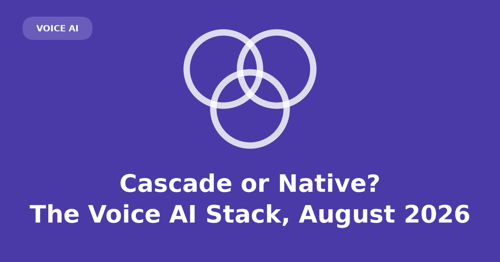
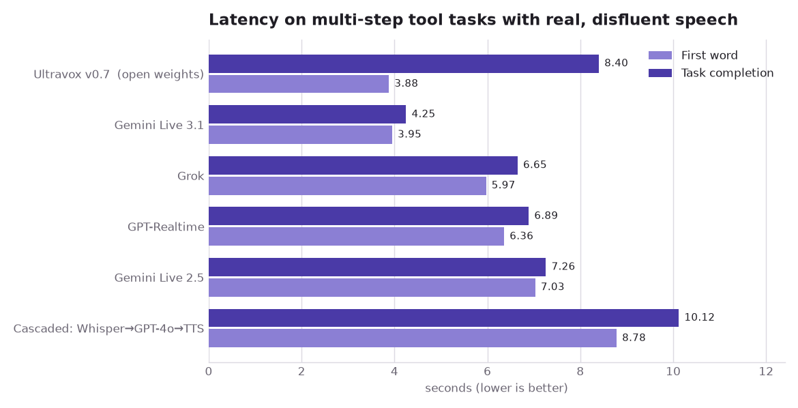
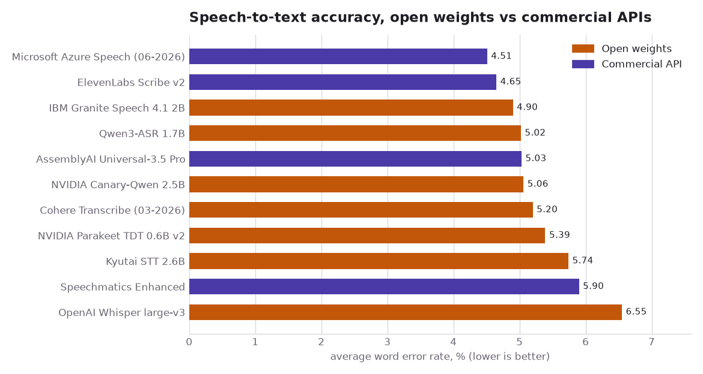
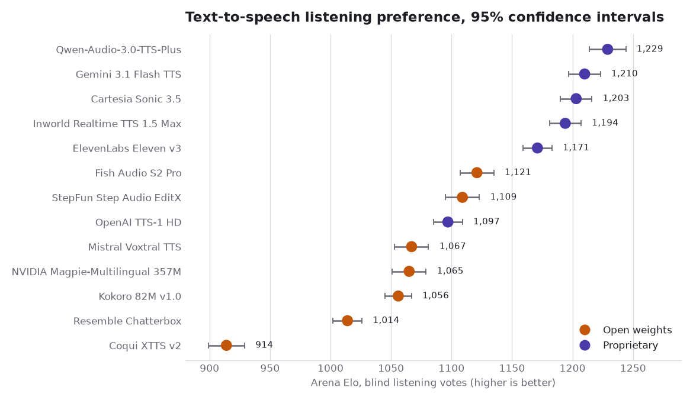
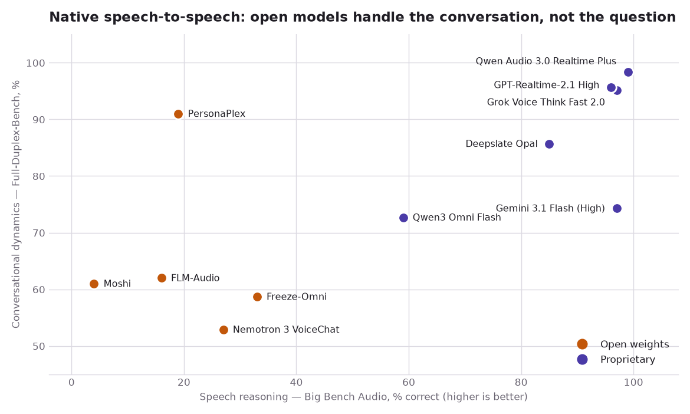

You have probably had this conversation. You call a company, a pleasant voice answers,
and you start explaining. Halfway through you change your mind — "send it to the Boston
office, actually, no, make that Cambridge" — and something goes subtly wrong. Either the
agent barrels on with Boston, or it stops dead and waits a beat too long, or it starts
talking over you while you are still correcting yourself.

That small failure is not a bug in one product. It is the visible edge of an
architectural choice, made months earlier, about *where the audio turns into meaning*.
There are two ways to build the thing you were talking to, and they fail in
recognisably different ways. One of them writes down what you said before deciding what
to do; the other never writes anything down at all.

That difference is usually framed as a latency race. It isn't, not any more. The
interesting question in 2026 is not which architecture is faster — that fight is
largely settled and the answer is not the one the framing implies. It is what you give
up when there is no longer a written-down transcript sitting in the middle of your
system, and what you get back.

Answering that takes four independently-run benchmarks, a clear-eyed look at what each of
them actually measures, and a fair amount of caution about numbers that vendors produce
about themselves. It ends somewhere I did not expect when I started: the property that
separates the two architectures is not speed, and the thing the cascade sells you is the
same thing that makes it fail.

## A cascade turns your voice into text, and then it is committed

The older architecture is a **cascade**, sometimes called a chained pipeline. It is
three models in a row:

- **STT** (speech-to-text, also called ASR, automatic speech recognition) turns the
  incoming audio into a string.
- An **LLM** (large language model) reads that string and decides what to say and which
  tools to call.
- **TTS** (text-to-speech) turns the reply back into audio.

A fourth component does the unglamorous work: **VAD** (voice activity detection), or a
smarter *endpointing* model, decides when you have stopped talking so the STT output can
be finalised and handed on.

The appeal is that every seam is inspectable. The transcript is a real string in your
logs. You can redact a credit-card number out of it, run a classifier over it before it
reaches the model, block a reply, swap the LLM without touching the voice, or hand the
whole exchange to a compliance reviewer six months later. In regulated telephony work
this is not a nice-to-have; it is frequently the reason the architecture was chosen.

But that transcript is also a **commitment**. The moment the endpointer fires, the
system has decided what you said, and the audio — with its hesitations, its
half-corrections, its tone — is gone. Everything downstream reasons about the string.
If the string is wrong, or premature, nothing later can recover the difference.

## A native model never writes anything down

The newer architecture is **native speech-to-speech** (S2S): a single model that takes
audio in and emits audio out, with no text string in the middle that you can grep.

Mechanically, a neural audio codec — a network trained to compress a waveform into a
short sequence of symbols and reconstruct it again — chops the incoming sound into
discrete *speech tokens*. The model predicts more of those tokens, and a decoder turns
them back into a waveform. Nothing in that chain has to wait for a sentence to end.

Because there is no endpointing step gating the handoff, the model can listen and speak
at the same time. Radio operators call that *full duplex*, as opposed to the
one-at-a-time discipline of a walkie-talkie, and it is what makes natural interruption
and backchannelling ("mm-hmm", "right") possible at all.

```{mermaid}
%%{init: {'theme':'base', 'themeVariables': {'primaryColor':'#ffffff','primaryBorderColor':'#4A3AA7','primaryTextColor':'#1a1a1a','lineColor':'#4A3AA7','edgeLabelBackground':'#ffffff'}}}%%
flowchart LR
  subgraph C["Cascaded pipeline"]
    direction LR
    A1["🎤 audio in"] --> V["VAD /<br/>endpointing"]
    V --> S["STT"]
    S -->|"transcript<br/>(inspectable, committed)"| L["LLM"]
    L -->|"reply text"| T["TTS"]
    T --> O1["🔊 audio out"]
  end

  subgraph N["Native speech-to-speech"]
    direction LR
    A2["🎤 audio in"] --> E["audio codec<br/>→ speech tokens"]
    E --> M["single S2S model<br/>(listens + speaks at once)"]
    M --> D["speech tokens<br/>→ waveform"]
    D --> O2["🔊 audio out"]
  end

  %% Invisible link, purely to pin the cascade above the native path so the
  %% diagram reads in the same order as the prose.
  C ~~~ N
```

### "Native" covers two quite different designs

Lumping every audio-in/audio-out model together hides the distinction that predicts most
of the benchmark results below.

**Speech-token models** are trained on audio tokens more or less throughout; text, if it
appears at all, is a side channel rather than the main road. Moshi is the canonical open
example, from Kyutai, a nonprofit research lab that publishes its weights. It pairs a 7B
text backbone with its own codec, Mimi, running at 12.5 frames per second — roughly one
speech token every eighty milliseconds — and reports a theoretical latency of 160 ms and
200 ms in practice.^[Défossez et al., *Moshi: a speech-text foundation model for real-time
dialogue*, [arXiv:2410.00037](https://arxiv.org/abs/2410.00037). Latency figures from the
abstract; codec details from §3.3.1. Self-reported by the model's authors.] NVIDIA's
PersonaPlex is built directly on the Moshi architecture and Moshiko weights, adding role
and voice conditioning.^[[nvidia/personaplex-7b-v1](https://huggingface.co/nvidia/personaplex-7b-v1)
model card (released 15 January 2026, NVIDIA Open Model License; code MIT) and Roy et al.,
*PersonaPlex: Voice and Role Control for Full Duplex Conversational Speech Models*,
[arXiv:2602.06053](https://arxiv.org/abs/2602.06053). I have deliberately not given a
submission date for the preprint: the listing I read reported 14 January 2026, which is
inconsistent with an identifier encoding February, and I could not resolve which is right.]
These are extremely good at conversational timing and, as we will see, extremely bad at
thinking.

**Text-LLM-with-speech-I/O models** keep an ordinary language model in the middle and
bolt audio onto both ends. NVIDIA's Nemotron 3 VoiceChat, released on 3 August 2026, is
explicit about it. A Fast Conformer encoder — a speech network that turns audio into
vectors without ever writing a transcript — feeds Nemotron Nano v2 9B, a general-purpose
text model. That model predicts *text* tokens, which drive a TTS decoder, alongside a
separate output channel that emits tool-call scripts.^[[nvidia/NVIDIA-NemotronLabs-VoiceChat-11B](https://huggingface.co/nvidia/NVIDIA-NemotronLabs-VoiceChat-11B),
11B parameters, released under the OpenMDW License v1.1. Architecture description from the
model card.] That is a native full-duplex model with a text bottleneck hidden inside it —
a detail worth remembering when we get to where this is all heading.

So the two architectures are not really a binary. They are a spectrum of *how early and
how irreversibly the audio is collapsed into text*. Which means the honest way to compare
them is to measure them, on the same audio, at the same time.

## What the numbers actually measure, and who made them

Measuring them fairly is harder than it sounds, because the six quantities people quote
answer six different questions and are routinely printed side by side as though they
answered one. Worse, a startling amount of what circulates in this field is a vendor
grading its own homework. So it is worth being precise about the metrics before any
chart, and about who produced the data behind them.

The vocabulary first:

- **TTFA** (time to first audio) — seconds from the user finishing to the first sound
  from the agent. Note that "first sound" is often a filler ("let me check that"), which
  is why it can diverge wildly from when useful information arrives.
- **Task completion latency** — seconds until the agent says the thing you were waiting
  for. Much more honest, much less often quoted.
- **RTFx** (inverse real-time factor) — how many seconds of audio a model processes per
  second of compute, so above 1 is faster than real time and higher is better. Its
  reciprocal, **RTF**, runs the other way: below 1 is faster than real time. Only RTFx is
  quoted in this post.
- **WER** (word error rate) — the fraction of words a transcriber gets wrong, as
  insertions, deletions and substitutions, over the reference transcript. Lower is
  better; it is a percentage but not a percentage *correct*.
- **Task adherence / turn-taking** — does the agent take its turn when it should, stay
  quiet during your pauses, and stop when you interrupt?
- **Elo / win-rate** — for TTS, listeners hear two clips of the same sentence and pick
  the better one; ratings are fit to those pairwise votes. It measures *preference*, not
  accuracy, and it moves week to week.

### Where the evaluation data comes from

Four sources do the work in this post, and each was built by someone with a motive worth
knowing.

The **Open ASR Leaderboard** is a project run on Hugging Face — the site where most open
models and datasets are published — with contributors from academia and industry. It
exists because ASR vendors had spent years quoting WER on internal splits nobody else
could reproduce. It runs every system through one harness on the same public
corpora — meeting recordings (AMI), earnings calls (Earnings22), read audiobooks
(LibriSpeech, which contributes two test sets, *clean* and *other*), financial
presentations (SPGISpeech), European parliament speech (VoxPopuli), and podcasts/YouTube
(GigaSpeech). The `Average WER` figures below are the macro-average over exactly those
seven test sets, after text normalisation — I verified that by reproducing the published
average from the per-dataset columns for three models. Speed is measured on standardised
hardware: a single NVIDIA H200 datacentre GPU, the same one for every model.^[Srivastav et al.,
*Open ASR Leaderboard*, [arXiv:2510.06961](https://arxiv.org/abs/2510.06961); harness and
hardware details from the [project README](https://github.com/huggingface/open_asr_leaderboard).
Results read from the live `hf-audio/open-asr-leaderboard-results` dataset on 9 August 2026.]
The corpora matter: AMI and Earnings22 are noisy, multi-speaker, accented real-world
audio, and they are where the averages are won and lost. LibriSpeech is clean read
speech and nearly saturated.

**Full-Duplex-Bench** is an academic benchmark from National Taiwan University for
turn-taking behaviour — pauses, backchannels, interruptions — built because no existing
evaluation captured what full-duplex models were actually claiming to be good at. Its
third version, with NVIDIA co-authors, is the one used below: 100 recordings from 12
speakers, native and non-native, captured on ordinary built-in microphones in rooms with
real background noise, annotated for five categories of disfluency, and paired with
multi-step tool-calling scenarios.^[Lin, Chen, Chen and Lee, *Full-Duplex-Bench-v3*,
[arXiv:2604.04847](https://arxiv.org/abs/2604.04847). Dataset construction from §3;
latency from Table 6.]

**Artificial Analysis** is a commercial benchmarking outfit that runs its own evaluations
across model providers. For speech it publishes a Speech-to-Speech Index combining three
equally-weighted parts: Big Bench Audio — 1,000 reasoning questions taken from Big Bench
Hard, a standard text benchmark of deliberately difficult puzzles, and read aloud into
audio — plus a subset of Full-Duplex-Bench, and 𝜏-Voice, a customer-service exercise in
which the model must finish a task against mock tools and a written policy document.^[[Artificial Analysis speech-to-speech
benchmarking methodology](https://artificialanalysis.ai/methodology/speech-to-speech-benchmarking);
[leaderboard](https://artificialanalysis.ai/speech-to-speech) read 9 August 2026.] It also
runs a **Speech Arena** for TTS, where listeners vote blind on pairs.

The objective in every case is the same one a buyer has: given a stack, how often will
the thing mishear, misjudge the turn, or fail the task. The downstream stakes are not
abstract — these systems are being pointed at pharmacy refill lines, insurance claims and
emergency call triage, where a substituted medication name or a misrouted transfer is a
real harm, and where a plausible-sounding wrong answer is worse than a refusal.

None of the four is perfect, and I flag self-reported numbers as such throughout. But all
four are run by someone other than the model's author, which already puts them ahead of
most figures in circulation.

## The cascade really is slower — by seconds, not milliseconds

With the metrics pinned down, start with the claim everyone makes about these two
architectures, because it turns out to be true in the most inconvenient way available.

Full-Duplex-Bench-v3 ran six configurations on identical audio from a single server
region, through one harness built on LiveKit, an open-source stack for moving live audio
between a caller and a model. Five of the six were end-to-end speech models: Ultravox,
whose weights Fixie publishes openly; Google's Gemini Live in two generations; xAI's Grok
voice mode; and OpenAI's GPT-Realtime. The sixth was a cascade assembled from
off-the-shelf parts — OpenAI's Whisper for transcription, its general-purpose GPT-4o for
the thinking, and its TTS for the voice.



| System | First word (s) | Task completion (s) |
|:---|---:|---:|
| Ultravox v0.7 *(open weights)* | 3.88 | 8.40 |
| Gemini Live 3.1 | 3.95 | 4.25 |
| Grok | 5.97 | 6.65 |
| GPT-Realtime | 6.36 | 6.89 |
| Gemini Live 2.5 | 7.03 | 7.26 |
| **Cascaded (Whisper→GPT-4o→TTS)** | **8.78** | **10.12** |

The cascade is last on both, and its task-completion time is about 2.4× the fastest
native model. The paper attributes this to the sequential chain: each stage must finish
before the next begins, whereas native models process concurrently.

Three things stop this from being the clean win it looks like.

That 2.4× flatters the winner. Gemini Live 3.1's mean is taken over the runs in which it
actually spoke, and it said nothing at all in 22% of scenarios, while the cascade
answered every single one. An average conditioned on responding is not measuring the same
population as one that never fails to respond.

Ultravox, the one open-weights system here, posts the *fastest first word* and nearly the
*slowest* completion. The reason is that it emits a filler sentence in 88% of scenarios
before it has called any tool. Speaking early is not the same as being fast, which is
exactly why TTFA deserves the suspicion the metrics list gave it.

Most importantly, these numbers are in seconds because they include multi-step tool
execution over real disfluent speech. They are not comparable to the 200 ms Moshi quotes,
which measures something else entirely.

## Caveat: almost none of these numbers measure the same thing

That last point generalises, and it is worth stating plainly, because the temptation to
put every latency figure on one axis is strong and the result is always wrong.

Moshi's 200 ms is a *theoretical-plus-practical framing latency* for the model's own
streaming loop. Artificial Analysis's TTFA is *seconds to the first audio token* on a
reasoning question over a network. Full-Duplex-Bench-v3's 4–10 s is *task completion
including tool calls* on real human speech. PersonaPlex's model card reports 0.170 s for
smooth turn-taking on Full-Duplex-Bench. These differ by nearly two orders of magnitude
and every one of them is honest about what it measured.

There is a further wrinkle worth flagging: PersonaPlex's own model card and its paper
report different Full-Duplex-Bench figures for the same model,^[The model card lists
smooth turn-taking success 0.908 and interruption success 0.950; the paper's Table 2
lists 0.992 and 1.000. I could not determine from the published material which
configuration each corresponds to.] which is a small reminder that even primary sources
disagree with themselves. Where I could not resolve a discrepancy I have said so rather
than picking the flattering number.

So: compare within a benchmark, never across. Every chart in this post is internally
consistent and none of them should be laid over another.

## Transcription has become excellent, and largely free

If the cascade is slower, what is it buying? Partly the transcript — and partly the fact
that the transcription step is very, very good, and that several of the best transcribers
cost nothing to license.

The Open ASR Leaderboard runs open-weights models and commercial APIs through the same
harness on the same corpora, which makes this one of the few genuinely like-for-like
open-versus-closed comparisons available. Remember what the number is: the share of words
a transcriber gets wrong across seven test sets, so 4.51 means about one word in
twenty-two came out wrong somewhere.



| Model | Avg WER % | Weights |
|:---|---:|:---|
| Microsoft Azure Speech (06-2026) | 4.51 | API |
| ElevenLabs Scribe v2 | 4.65 | API |
| IBM Granite Speech 4.1 2B | 4.90 | Open |
| Qwen3-ASR 1.7B | 5.02 | Open |
| AssemblyAI Universal-3.5 Pro | 5.03 | API |
| NVIDIA Canary-Qwen 2.5B | 5.06 | Open |
| Cohere Transcribe (03-2026) | 5.20 | Open |
| NVIDIA Parakeet TDT 0.6B v2 | 5.39 | Open |
| Kyutai STT 2.6B | 5.74 | Open |
| Speechmatics Enhanced | 5.90 | API |
| OpenAI Whisper large-v3 | 6.55 | Open |

The whole field sits inside roughly two WER points, and open weights are interleaved with
paid APIs throughout. A 2B open model beats two of the four commercial APIs listed. This
is a solved-enough problem that transcription accuracy is close to being a commodity —
and Whisper, still the default in most tutorials, is now comfortably last of this group.

One thing to be careful about: I could not confirm from the project documentation whether
the commercial API entries on the public splits are executed by the leaderboard
maintainers or submitted by vendors. The README describes maintainer-run evaluation for
private sets and a separate submission process for API models. The corpora and scoring
are identical either way, which is the important part, but "identical harness" is a
stronger claim than "identically supervised".

The other caution is that this is *English short-form* audio. Long-form and multilingual
tracks exist and rank differently, and a 5% average WER on curated corpora is not a 5% WER
on a noisy mobile call from a caller with a strong accent.

## Synthesis quality has commoditised, and the price spread proves it

The third stage of the cascade is the one where the gap has closed hardest.

Artificial Analysis's Speech Arena plays listeners two readings of the same sentence
without saying which model produced either, collects the votes, and fits an Elo rating to
them — the same chess-style scheme that turns a pile of pairwise results into a single
number per player. Because it publishes confidence intervals and sample counts, you can
also see which of the gaps between those numbers are real, which matters more than usual
here: several of them are not.



| Model | Elo | 95% CI | Weights | List price / 1M chars |
|:---|---:|:---|:---|---:|
| Qwen-Audio-3.0-TTS-Plus | 1,229 | ±15 | Proprietary | \$27.60 |
| Gemini 3.1 Flash TTS | 1,210 | ±13 | Proprietary | \$18.30 |
| Cartesia Sonic 3.5 | 1,203 | ±13 | Proprietary | \$49.00 |
| Inworld Realtime TTS 1.5 Max | 1,194 | ±13 | Proprietary | \$26.00 |
| ElevenLabs Eleven v3 | 1,171 | ±12 | Proprietary | \$100.00 |
| Fish Audio S2 Pro | 1,121 | ±14 | Open | \$15.00 |
| StepFun Step Audio EditX | 1,109 | ±14 | Open | — |
| OpenAI TTS-1 HD | 1,097 | ±12 | Proprietary | \$30.00 |
| Mistral Voxtral TTS | 1,067 | ±14 | Open | \$16.00 |
| NVIDIA Magpie-Multilingual 357M | 1,065 | ±14 | Open | — |
| Kokoro 82M v1.0 | 1,056 | ±11 | Open | \$0.65 † |
| Resemble Chatterbox | 1,014 | ±12 | Open | \$25.00 |
| Coqui XTTS v2 | 914 | ±15 | Open | \$40.40 † ‡ |

Open weights and a hosted price are not mutually exclusive, and the two kinds of number in
this column are worth telling apart. Fish Audio, Mistral and Resemble all publish weights
*and* sell their own API, so those rates are the authors'. NVIDIA and StepFun publish
weights with no first-party endpoint, hence the blank.

† These are third-party hosting rates, not a price the model's authors set — Kokoro's
\$0.65 is charged by Replicate, a service that runs other people's open models behind an
API. Self-hosting removes the per-character fee entirely and replaces it with a GPU bill,
so treat these as one way to rent the model rather than what it costs.

‡ Coqui, the company behind XTTS, shut down in early 2024. The weights and a community
fork remain; there is no vendor behind them.

Three things stand out.

The leader is Alibaba — its Qwen family sits at the top of this table and of the
speech-to-speech one below — rather than any of the Western TTS specialists that dominate
the conversation about voice quality.

ElevenLabs, the brand most people name first, sits fifth. Its Eleven v3 costs 3.8× the
model directly above it on quality, and 5.5× Gemini 3.1 Flash TTS. That said, Inworld's
interval runs [1181, 1207] and Eleven v3's [1159, 1183], so the two overlap and the
ordering between them is not something the votes have actually settled.

Kokoro, at 82 million parameters, can be rented for \$0.65 per million characters against
Eleven v3's \$100. That is a 150× price spread for 115 Elo points, and 115 points means
Eleven v3 wins roughly 66% of blind head-to-head comparisons against it. Two-thirds is a
real quality gap and worth paying something for. It is a strange thing to pay 150× for —
with the caveat that this puts a third-party hosting rate next to a vendor list price,
and that a self-hosted Kokoro has no per-character price at all.

The best open-weights model trails the best proprietary one by 108 Elo — real, but far
from decisive, and well inside the range where voice selection and prompt tuning matter
more than model choice. If you are differentiating your product on how pretty the voice
is, that moat is mostly gone.

That is the cascade, then: slower by seconds, excellent at hearing, and now buying its
voice in a commodity market. Which leaves the question of what native models are actually
better *at*, and where they are still visibly not ready.

## The reasoning gap is the real dividing line, and it is enormous

This is the comparison that reorganised how I think about the space, and it works because
it refuses to collapse a voice agent into one score.

Artificial Analysis scores native S2S models on two axes that turn out to be almost
independent of each other. **Speech reasoning**, from Big Bench Audio, asks whether the
model can still answer a hard question when the question arrives as sound. **Conversational
dynamics**, from Full-Duplex-Bench, asks whether it knows when to talk — whether it holds
its tongue through your pause and stops when you cut in. One is about thinking, the other
about timing, and a model can be superb at either while hopeless at the other.



| Model | Speech reasoning % | Conv. dynamics % | Weights |
|:---|---:|---:|:---|
| Qwen Audio 3.0 Realtime Plus | 99 | 98.4 | Proprietary |
| Grok Voice Think Fast 2.0 | 97 | 95.1 | Proprietary |
| Gemini 3.1 Flash (High) | 97 | 74.3 | Proprietary |
| GPT-Realtime-2.1 High | 96 | 95.7 | Proprietary |
| Deepslate Opal | 85 | 85.7 | Proprietary |
| Qwen3 Omni Flash | 59 | 72.7 | Proprietary |
| Freeze-Omni | 33 | 58.7 | Open |
| Nemotron 3 VoiceChat | 27 | 52.9 | Open |
| PersonaPlex | 19 | 91.0 | Open |
| FLM-Audio | 16 | 62.0 | Open |
| Moshi | 4 | 61.0 | Open |

Rows are sorted by speech reasoning, ties broken on conversational dynamics. Deepslate is
the one entry here I would not lean on: I could find little about the company beyond its
leaderboard rows, so treat that line as unverified.

The open models are not a little behind on reasoning. They are at 4–33% where the
proprietary frontier is at 96–99%. Moshi, the model that defined this architecture,
answers 4% of audio reasoning questions correctly — near enough to nothing that the
number is easier to read as a statement about what it was built for.

And yet PersonaPlex scores 91.0 on conversational dynamics. That is the highest of any
open model, comfortably ahead of Gemini 3.1 Flash at 74.3, and within eight points of the
best proprietary system on the board. It is *superb* at the rhythm of conversation and
nearly incapable of thinking.

That is not a contradiction. It is the speech-token architecture doing exactly what it
was built to do: optimising a model to predict the next audio frame, twelve and a half
times a second, produces exquisite timing and does very little for multi-step deduction.
Nothing in that training signal ever asks the model to hold a thought across a sentence.

Note also that no open-weights model has a full Speech-to-Speech Index score, because none
has results on 𝜏-Voice, the agentic tool-use component. Open native models are not yet
being evaluated on the thing most commercial deployments actually need.

### Caveat: the reasoning benchmark has a synthetic-audio problem

Big Bench Audio is Big Bench Hard rendered to speech using 23 voice configurations from
OpenAI, Azure and Amazon Polly.^[[ArtificialAnalysis/big_bench_audio](https://huggingface.co/datasets/ArtificialAnalysis/big_bench_audio)
dataset card.] That is clean synthetic speech, not the noisy human audio these systems
meet in production, and it measures text-shaped reasoning delivered through an audio pipe.
It is a fair test of "can the model still think when you talk to it", which is precisely
the question at issue — but a model could in principle be tuned for it without getting
better at anything a caller cares about.

## The cascade's transcript is also what makes it fail

If reasoning is what native models lack, the fair conclusion so far would be that a
cascade with a real language model in it should win on anything that requires thought.
Full-Duplex-Bench-v3 tested exactly that, and the result is the finding that changed my
framing of the whole post.

The cascaded baseline shares its language model with GPT-Realtime — both are GPT-4o class.
Yet the cascade completes 45.0% of tasks against GPT-Realtime's 60.0%. The gap is widest
in exactly one category: **self-corrections**, where the user changes their mind
mid-sentence. There the cascade succeeds 17.6% of the time against GPT-Realtime's 58.8% —
the lowest of all six systems against the highest.

The paper's explanation is precise: Whisper finalises the original transcription before
the correction arrives, so the downstream model never sees that the user changed their
mind. The transcript was committed too early, and there is no mechanism for rollback.

So the transcript is not simply a control surface you buy with latency. It is a *lossy,
early, irreversible commitment*, and the same property that lets you log it, redact it and
gate it is the property that destroys the information needed to handle a correction. The
cascade's great strength and its worst failure mode are the same design decision viewed
from two sides.

The cascade does get one thing uniquely right: a 100% turn-take rate, the only system to
manage it, because a sequential pipeline structurally guarantees a response to every
input. Gemini Live 3.1, by contrast, silently produced nothing in 22% of scenarios — and
in 86% of those silences it had correctly executed the tool calls and simply never spoke.
Reliability and speed are trading against each other, not aligned.

## The market splits into layer specialists and full-stack platforms

Knowing which architecture you want is only half a decision, because nobody sells "a
cascade" — you buy pieces, or you buy somebody else's assembly of them. The table below
is the landscape as of August 2026, with each company placed by the layers it actually
ships: transcription, the language model, synthesis, a full cascade, or a native
speech-to-speech model. Some sell one layer to everyone; a few sell the whole phone
agent. Every row was checked against the company's own site or model card.

| Company / project | Type | Layers | Notable models | Licence / pricing | Best known for |
|:---|:---|:---|:---|:---|:---|
| OpenAI | Closed API | STT, LLM, TTS, native S2S | gpt-realtime-2.1, gpt-4o-transcribe, Whisper | \$32 / \$64 per 1M audio in/out tokens; Whisper weights MIT | The default realtime API; strong tool use |
| Google | Closed API | Native S2S, TTS, STT | Gemini 3.1 Flash Live, Gemini 3.1 Flash TTS | \$3 / \$12 per 1M audio in/out tokens | Cheapest frontier native audio; fast |
| Microsoft / Azure | Closed API | STT, TTS | Azure Speech, Azure HD 2.5, MAI-Voice-1 | Per-hour enterprise pricing | Top of the ASR leaderboard; enterprise reach |
| Alibaba / Qwen | Mixed | Native S2S, STT, TTS | Qwen Audio 3.0 Realtime Plus, Qwen3-Omni, Qwen3-ASR | Qwen3-Omni Apache 2.0; 3.5 generation API-only | Current frontier on both S2S axes |
| xAI | Closed API | Native S2S, TTS | Grok Voice Think Fast 2.0 | Per-token | Fastest TTFA among frontier native models |
| Fixie | Open weights | Native S2S | Ultravox v0.7 | Open weights | Open tool-use S2S without a separate ASR stage |
| Mistral | Mixed | TTS, STT | Voxtral TTS, Voxtral Mini/Small | Open weights (Apache 2.0) | Open TTS and STT from a frontier lab |
| NVIDIA | Open weights | Native S2S, STT, TTS | Nemotron 3 VoiceChat 11B, PersonaPlex 7B, Canary, Parakeet, Magpie | OpenMDW 1.1 / NVIDIA Open Model License / CC-BY-4.0 | The open full-duplex frontier |
| Kyutai | Open weights (nonprofit) | Native S2S, STT, TTS | Moshi, Kyutai STT/TTS, Pocket TTS | Weights CC-BY-4.0; code MIT / Apache | Proved full-duplex was possible |
| ElevenLabs | Closed API | TTS, STT, agents | Eleven v3, Scribe v2 | TTS \$100 / 1M chars; Scribe v2 \$0.22/hr; Agents \$0.08/min | Voice quality brand; large voice library |
| Deepgram | Closed API | STT, TTS, agents | Nova-3, Flux, Aura-2 | STT from \$0.0048/min; Voice Agent \$0.075/min | Cheap, fast streaming STT for telephony |
| AssemblyAI | Closed API | STT, agents | Universal-3.5 Pro | \$0.21/hr async, \$0.45/hr realtime; agents \$4.50/hr | Developer-friendly STT with rich add-ons |
| Cartesia | Closed API | TTS, STT, agents | Sonic 3.5, Ink-2, Line | Plan-based (≈\$49/1M chars normalised); agents \$0.06/min | Very low-latency TTS |
| Rime | Closed API | TTS | Arcana v3, Coda, Mist V2 | \$50 / 1M chars | Telephony-tuned conversational voices |
| Fish Audio | Mixed | TTS | S2.1 Pro, S2 Pro, OpenAudio S1 | S2 Pro open weights; API \$15 / 1M chars | Best open-weights TTS on the arena |
| Resemble AI | Mixed | TTS | Chatterbox, Chatterbox HD / Turbo / Multilingual | Chatterbox MIT | Permissive open TTS with voice cloning |
| Inworld | Closed API | TTS | Realtime TTS 1.5 Max, TTS-2 | \$26 / 1M chars | Top-tier arena quality at mid price |
| Pipecat | Open source | Orchestration | — | BSD-2, maintained by Daily | Composable pipeline; bring your own stack |
| LiveKit | Open source + cloud | Transport + orchestration | LiveKit Agents | Open core, hosted cloud | WebRTC-native infra; SIP telephony |
| Vapi | Platform | Full stack | — | Per-minute | Fastest path to a working phone agent |
| Retell AI | Platform | Full stack | — | Per-minute | Contact-centre replacement, multi-channel |

This covers the vendors with a shipping product in the stack, not every lab whose model
appears in a chart above. Cohere, IBM, Speechmatics and Kyutai's STT show up in the
word-error table; StepFun, Smallest.ai and Coqui in the TTS table; VITA (Freeze-Omni),
Cofe AI (FLM-Audio) and the unverifiable Deepslate in the speech-to-speech chart — none
has a row here.

Prices are list rates from each vendor's public pricing page, read on 9 August 2026, and
they change often. Cartesia is the exception: it sells bundled plans rather than a
per-character rate, so the figure in the TTS table above is Artificial Analysis's
normalisation of those plans, not a number Cartesia publishes.

Money is still moving into this stack, which is worth knowing before betting a product on
any one row. Deepgram raised a \$130M Series C at a \$1.3B valuation, LiveKit a \$100M
Series C at \$1B in January 2026, Fish Audio \$52M in July, and Rime \$24M in July.^[Deepgram [press release](https://deepgram.com/learn/press-release-deepgram-raises-series-c);
LiveKit round reported by Bloomberg, 22 January 2026; Fish Audio via PR Newswire /
SiliconANGLE, 28 July 2026; Rime via TechCrunch, 15 July 2026.] I found no evidence of
consolidation or shutdown among the vendors in this table. The one casualty in the wider
post is Coqui, whose XTTS v2 still appears on the TTS leaderboard years after the company
behind it closed.

## What I would pick today

Everything above is measurement. This section is a judgement call on top of it, and the
judgement rests on one observation: within each layer of the cascade the quality
differences are now small enough that they are rarely what should decide the purchase.

**If you are building a cascade**, licensing terms and latency should drive the choice
more than accuracy:

- *STT, open:* **NVIDIA Parakeet TDT 0.6B v2** — 5.39 WER at an RTFx of 6,038,^[Same
  Open ASR Leaderboard results dataset as the word-error table, read 9 August 2026. RTFx
  there is measured on one H200; IBM Granite Speech 4.1 2B records 547 on the same
  hardware.] by far the best accuracy-per-unit-compute here, under a CC-BY-4.0 licence
  that lets you ship it commercially with attribution. Choose **IBM
  Granite Speech 4.1 2B** (4.90) if you want the accuracy and can pay roughly 11× the
  compute per second of audio.
- *STT, paid:* **Deepgram** for telephony, on price and streaming maturity rather than
  raw WER; **Azure Speech** if you want the lowest error rate on the board and are already
  in that ecosystem.
- *LLM:* whatever you already trust for tool calling. This is the one stage where voice
  imposes no special requirement beyond time-to-first-token.
- *TTS, open:* **Fish Audio S2 Pro** for quality, **Kokoro 82M** if you need it to run
  anywhere — it is within 65 Elo of S2 Pro at a fraction of the footprint.
- *TTS, paid:* **Cartesia Sonic 3.5** or **Gemini 3.1 Flash TTS**. Both sit in the top
  five and both rank *above* Eleven v3, at half and a fifth of its price respectively.

**If you are going native:**

- *Closed:* **GPT-Realtime** if tool use matters — it leads Full-Duplex-Bench-v3 on task
  *success*, finishing 60.0% of scenarios on the first attempt, and on self-correction
  handling, though not on latency, where it is fourth of six. Note that the benchmark's own footnote points at `gpt-realtime-1.5`,
  so that result is not evidence about the 2.1 generation; the 2.1 numbers in this post
  come from Artificial Analysis instead. **Qwen Audio 3.0 Realtime Plus** tops both
  Artificial Analysis axes at a fraction of the cost, with the caveat that this is a
  benchmark lead I have seen independently confirmed only by Artificial Analysis, and that
  data residency — which country the audio is legally allowed to be processed in — will
  decide it for many buyers before quality does. **Gemini 3.1 Flash Live** is the value
  option if you can tolerate its silence failures.
- *Open:* **Nemotron 3 VoiceChat 11B**. It is the only open full-duplex model with live
  tool calling, and its text-LLM-in-the-middle design is why it reasons better than every
  pure speech-token model on the board — 27 against PersonaPlex's 19, FLM-Audio's 16 and
  Moshi's 4. It is not the top open reasoner outright: Freeze-Omni scores 33, from the same
  architectural family, but without the tool calling. Reach for **PersonaPlex** instead
  only if conversational feel is the product and reasoning genuinely is not.

**Where open native still loses**: reasoning, by a factor that no amount of prompt work
closes; agentic tool use, where it is barely evaluated; and production maturity. **Where
it has caught up**: raw conversational timing, where PersonaPlex is genuinely competitive
with the frontier, and TTS quality, where the gap is now smaller than the gap between two
voices from the same vendor.

And the honest answer for most teams is neither purebred choice. If your calls are short
and scripted, native wins on feel. If they are long, regulated, or tool-heavy, the
cascade's inspectability and its guaranteed response are worth the seconds.

## Where this goes next — analysis, not measurement

A recommendation is only as good as its shelf life, and this field's is short. So it is
worth saying which way I think the ground moves. Everything below is opinion rather than
measurement, tagged by how much I would bet on it.

**Hybrids win, and they are already here** *(fairly likely)*. Nemotron 3 VoiceChat is a
full-duplex native model that predicts text tokens internally and routes tool calls
through a dedicated channel. That is the synthesis: a text representation you can read and
act on, produced without the endpointing commitment that makes cascades slow and brittle
on corrections. I expect the "cascade versus native" framing to look dated within a year,
replaced by arguments about *where in the model* the text channel sits and what you are
allowed to do with it.

**TTS differentiation moves to latency, cost and control** *(fairly likely)*. A 150× price
spread across a field where the bottom is still preferred a third of the time is not a
stable market. Quality is close to saturated at the top;
what is left to compete on is time-to-first-byte, price per minute, and controllability —
emotion, pacing, pronunciation of names and drug names.

**Consolidation among mid-tier voice API vendors** *(moderately likely)*. There are more
companies selling near-identical STT and TTS endpoints than the margins support, and the
frontier labs now ship all three layers themselves at prices the specialists struggle to
match. The survivors will be those who own a vertical or the telephony path, not those
with the prettiest voice.

**Telephony and enterprise integration is the durable moat** *(fairly likely)*. The
plumbing that connects a model to an actual phone number is unglamorous, slow to build,
and not commoditising at anything like the rate the models are: SIP trunking, the
protocol that carries calls between networks; routing them to the right queue; recording
them in a form a compliance team will accept; and writing the outcome back into whichever
customer-records system the business already runs on. This is
LiveKit's and Deepgram's structural advantage, and the reason platforms like Vapi and
Retell can sell against raw APIs.

**Open models close the reasoning gap** *(speculative, and the one I am least sure of)*.
The gap is currently enormous. But the mechanism is now understood — put a real language
model in the middle and the reasoning follows — and Nemotron 3 VoiceChat is a proof of
concept six days old. If the open frontier converges on that recipe rather than on pure
speech-token models, the gap could close much faster than the current numbers suggest. If
it does not, open native audio stays a research curiosity with excellent manners.

## The choice is about the transcript, not the clock

Go back to the call you were on at the start, the one where you said Boston and then said
Cambridge. If the agent barrelled on with Boston, you now know what happened: an
endpointer fired, a transcriber committed a string, and nothing downstream had any way of
learning that you had changed your mind. That is the cascade's signature failure, and
Full-Duplex-Bench-v3 puts it at 17.6% success against 58.8% for a native model running
the same class of language model underneath.

So the architecture question is not about speed. Native models are faster, by seconds, on
real tasks — that is settled, and it is a bigger margin than the discourse implies. It is
about a transcript: whether your system produces one, when, and whether it can take it
back.

A cascade gives you a string you can read, log, redact and gate, and pays for it with
seconds of latency and a catastrophic inability to handle someone changing their mind. A
native model gives you fluid, interruptible conversation and takes away the place you were
going to look when something went wrong. The frontier proprietary models have made that
trade tolerable by being excellent at both reasoning and timing. Open native models have
made it painful by being excellent at timing alone.

If you are choosing today: pick the cascade when the transcript is the product — when
somebody will audit it, when a regulator will ask, when the tool chain is long. Pick
native when the conversation is the product and the tasks are short. And watch the
hybrids, because the interesting architectures have stopped choosing.

Where this stops holding: everything above is English, mostly short-form, and mostly
benchmark audio. On a noisy mobile call in a language with less training data, the
rankings will differ and the error rates will be worse than any number here.

## A note on accuracy

Every figure in this post was read from a primary source — an arXiv paper, a model card, a
live leaderboard, or a vendor's own pricing page — on 9 August 2026, and the retrieval date
is given wherever it matters. I deliberately did not cite the secondary aggregator posts
that dominate search results for these terms; several of them report leaderboard positions
that the live data contradicts.

Some things I could not establish and have therefore left out or flagged inline: whether
commercial API entries on the Open ASR Leaderboard's public splits are maintainer-run or
vendor-submitted; which configuration PersonaPlex's differing model-card and paper numbers
correspond to; and reliable open-weights latency figures measured on the same harness as
the proprietary TTFA numbers, which do not appear to exist. Vendor-internal win-rate
claims — including several widely-quoted "beats ElevenLabs" figures — are omitted entirely
in favour of third-party arena results.

Leaderboards move weekly. Treat the rankings here as a snapshot, and check the live boards
before making a decision on them.

## References

**Papers and benchmarks**

- Défossez et al., [*Moshi: a speech-text foundation model for real-time dialogue*](https://arxiv.org/abs/2410.00037)
- Roy et al., [*PersonaPlex: Voice and Role Control for Full Duplex Conversational Speech Models*](https://arxiv.org/abs/2602.06053)
- Lin et al., [*Full-Duplex-Bench-v3: Benchmarking Tool Use for Full-Duplex Voice Agents Under Real-World Disfluency*](https://arxiv.org/abs/2604.04847)
- Lin et al., [*Full-Duplex-Bench* (v1)](https://arxiv.org/abs/2503.04721)
- Srivastav et al., [*Open ASR Leaderboard*](https://arxiv.org/abs/2510.06961) · [live leaderboard](https://huggingface.co/spaces/hf-audio/open_asr_leaderboard) · [harness](https://github.com/huggingface/open_asr_leaderboard)
- [Artificial Analysis speech-to-speech leaderboard](https://artificialanalysis.ai/speech-to-speech) · [methodology](https://artificialanalysis.ai/methodology/speech-to-speech-benchmarking) · [Speech Arena](https://artificialanalysis.ai/text-to-speech/leaderboard)
- [Big Bench Audio dataset](https://huggingface.co/datasets/ArtificialAnalysis/big_bench_audio)

**Models**

- [NVIDIA Nemotron 3 VoiceChat 11B](https://huggingface.co/nvidia/NVIDIA-NemotronLabs-VoiceChat-11B) · [PersonaPlex 7B](https://huggingface.co/nvidia/personaplex-7b-v1)
- [Kyutai Moshi](https://github.com/kyutai-labs/moshi) · [Kyutai model index](https://kyutai.org/)
- [Qwen3-Omni](https://huggingface.co/Qwen/Qwen3-Omni-30B-A3B-Instruct)
- [Resemble Chatterbox](https://github.com/resemble-ai/chatterbox)

**Pricing pages** (read 9 August 2026)

- [OpenAI](https://developers.openai.com/api/docs/pricing) · [Google Gemini](https://ai.google.dev/gemini-api/docs/pricing) · [ElevenLabs](https://elevenlabs.io/pricing/api) · [Deepgram](https://deepgram.com/pricing) · [AssemblyAI](https://www.assemblyai.com/pricing) · [Cartesia](https://cartesia.ai/pricing)

**Frameworks**

- [Pipecat](https://github.com/pipecat-ai/pipecat) · [LiveKit Agents](https://livekit.com/)
