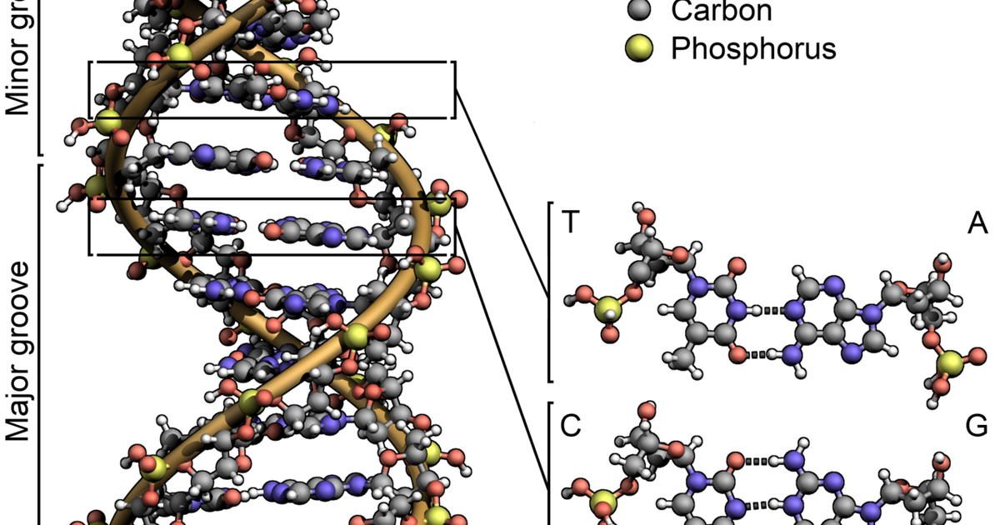

A biological signature is what four steps turn a wide, small-sample dataset into — and each step can quietly invalidate the result.

A **signature** is a short list of measured molecular features (genes, proteins, or metabolites) that distinguishes one condition from another.

It is feature selection on wide, small-$n$ data: tens of thousands of genes, tens of patients. A model given all features will fit noise.

## Procedure

1. **Measure wide.** Every feature on every sample.
2. **Find the groups.** Use known labels, or let clustering propose groups.
3. **Select.** Score features by group separation:
   - *$t$-test:* distance between group means relative to within-group scatter.
   - *Mutual information:* how much the feature tells you about group membership.
   - *Penalized models* (lasso, elastic net): drop features by charging a cost for each one used.
4. **Validate on held-out data.** Redo selection **inside** each cross-validation fold.

Selecting on all samples, then testing on a "held-out" subset, leaks the selection. [Ambroise and McLachlan (2002)](https://doi.org/10.1073/pnas.102102699) showed that this bias drives reported error toward zero; nested selection raises it again.

## Canonical example: Golub leukemia

ALL and AML are two acute leukemias that look similar under a microscope and take opposite chemotherapies. Diagnosis used to rest on four specialist lab tests.

[Golub et al. (1999)](https://doi.org/10.1126/science.286.5439.531) measured 6,817 genes in 38 acute-leukemia samples.

- Unsupervised clustering, given no disease labels, nearly recovered the split (one group 24 ALL + 1 AML; the other 10 AML + 3 ALL).
- A 50-gene predictor was then tested on 34 independent samples from other banks.

Fifty features out of 6,817 is a signature.

The same four steps apply to environmental DNA (a few marker sequences implying a species was present) and to exoplanet spectra (gases inconsistent with abiotic chemistry).

Signatures. Are. Feature. Selection. Wide. Data. Invites. Noise. Validate. Elsewhere.

## References

- Ambroise, C. & McLachlan, G. J. (2002). [Selection bias in gene extraction on the basis of microarray gene-expression data](https://doi.org/10.1073/pnas.102102699). *PNAS*.
- Golub, T. R. et al. (1999). [Molecular classification of cancer: class discovery and class prediction by gene expression monitoring](https://doi.org/10.1126/science.286.5439.531). *Science* 286(5439):531–537.
- Guyon, I. & Elisseeff, A. (2003). [An introduction to variable and feature selection](https://www.jmlr.org/papers/v3/guyon03a.html). *JMLR*.
- Meinshausen, N. & Bühlmann, P. (2010). [Stability selection](https://doi.org/10.1111/j.1467-9868.2010.00740.x). *JRSS-B*.
