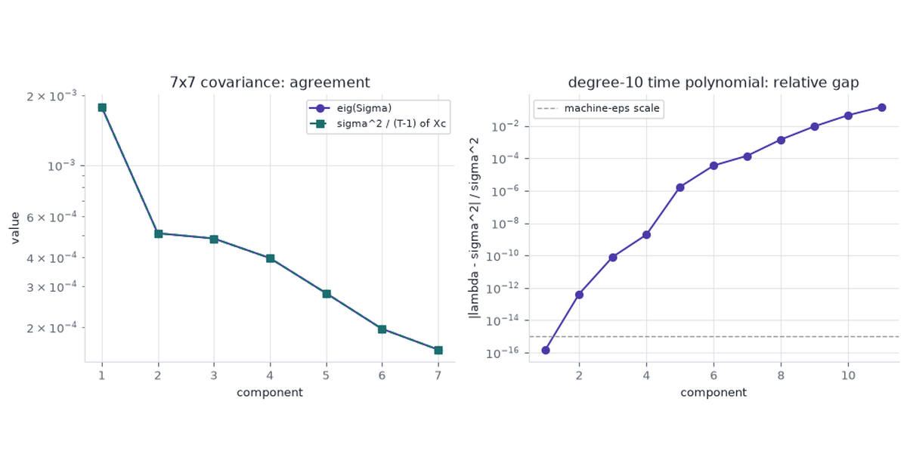

A matrix is like a complicated 3D object: what you see depends entirely on where you stand. Just as rewriting a polynomial can instantly reveal its roots, factoring a matrix isolates the exact properties you need to solve a specific problem. We don't choose between Cholesky, QR, or SVD because one is inherently superior to the others. We choose them because the jobs differ wildly. One day you need to solve least squares; the next, you need a rank-$k$ summary or a spectrum analysis. Each factorization is simply a different mathematical lens, perfectly ground to bring a specific application into focus.

```{python}
#| label: setup
#| echo: false
from pathlib import Path

import matplotlib.pyplot as plt
import numpy as np
import pandas as pd
from numpy.linalg import cond, eigh, inv, pinv, svd
from scipy.linalg import cho_factor, cholesky, lu_factor, lu_solve, qr, solve_triangular
from skimage import data
from skimage.color import rgb2gray
from sklearn.datasets import load_diabetes

ACCENT = "#4A3AA7"
TEAL = "#1D6E6E"
AMBER = "#9A5B00"
GREY = "#999999"
INK = "#1F2430"

plt.rcParams.update({
    "figure.facecolor": "white",
    "axes.facecolor": "white",
    "axes.edgecolor": "#D8DBE2",
    "axes.labelcolor": INK,
    "text.color": INK,
    "xtick.color": "#5F6672",
    "ytick.color": "#5F6672",
    "font.size": 10,
    "axes.grid": True,
    "grid.color": "#D8DBE2",
    "grid.alpha": 0.7,
    "axes.spines.top": False,
    "axes.spines.right": False,
})
rng = np.random.default_rng(7)
```

## Quadratic forms

The same parabola has four writings. Each writing makes one geometric fact cheap to read.

- **Standard** $y = ax^2 + bx + c$ — the $y$-intercept is $c$.
- **Vertex** $y = a(x-h)^2 + k$ — the min or max is $(h,k)$.
- **Factored** $y = a(x-r_1)(x-r_2)$ — the roots are $r_1,r_2$.
- **Matrix** $y = \begin{bmatrix}x & 1\end{bmatrix}\begin{bmatrix}a & b/2 \\ b/2 & c\end{bmatrix}\begin{bmatrix}x \\ 1\end{bmatrix}$ — the $2\times 2$ already holds $(a,b,c)$. Cholesky of that $2\times 2$ is completing the square.

The curve in the widget is synthetic: $a,b,c$ are slider values, not fitted data. It stands in for any 1-D quadratic whose job changes with the writing.

<div id="quad-widget"></div>

Toggle **Vertex** and the frame moves to the turning point. Toggle **Factored** and it frames the roots. Toggle **Matrix** and the view opens on the whole curve.

## Which factorization

The benefit is not the smallest leading term. Cholesky is the cheapest factor of an SPD covariance and is not defined on the photograph. We pick a factorization for the object it hands to the next step: a coefficient, a draw, a weight, a rank-$k$ image, a spectrum, or an inverse that exists.

| Factorization | Matrix it needs | Downstream job | What we take |
|---|---|---|---|
| QR | tall $X$, full column rank | OLS | $\hat\beta$ from $R\beta=Q^Ty$, without $X^TX$ |
| Cholesky | SPD $\Sigma$ | correlated draws; repeated SPD solves | $x=Lz$, or two triangular solves |
| LU | square, not SPD | general $Ax=b$ (KKT, any invertible $A$) | the solve |
| SVD | any shape, any rank | compression; $A^+$ | rank-$k$ summary, or the pseudoinverse |
| Eigen | square symmetric, modest $\kappa$ | spectrum / PCA of a covariance we trust | $Q$ and $\Lambda$ |
| NMF | $V\ge 0$ | parts or topics | $W,H\ge 0$ |

: Use case, not a ranking. {#tbl-usecase}

NMF is iterative, $O(t\,k\,mn)$. The Golub leukemia matrix is worked in [Matrix Factorizations as Optimization Problems](../matrix-factorizations/). For a Gram matrix $X^TX$, SVD of $X$ is the stable writing of the same spectrum. Flop-count models are Golub & Van Loan / Trefethen & Bau for dense $n\times n$, not wall-clock.

## QR

$$
A = QR, \qquad O(mn^2)\ \text{for tall } m\times n \text{ (square: } 4n^3/3\text{)}.
$$

Householder $Q$ is orthogonal. Back-substitution on $R\beta = Q^Ty$ solves

$$
\min_\beta \|y - X\beta\|_2^2
$$

without forming $X^TX$. [Matrix Factorizations as Optimization Problems](../matrix-factorizations/) treats the same factorization on the wheat markers, where $\kappa(X)$ is large. The design here is ordinary OLS and well conditioned.

### Diabetes

- **Source:** Efron, Hastie, Johnstone, Tibshirani (2004), *Least Angle Regression*; the copy shipped with `sklearn.datasets.load_diabetes`.
- **Measurements:** 442 patients × 10 baseline variables (age, sex, BMI, blood pressure, six serum assays), quantitative disease-progression response. sklearn standardises each column to mean 0 and squared length 1.
- **This post asks:** recover $\hat\beta$ two ways — normal equations vs QR — and report the coefficient gap.
- **A wrong $\hat\beta$:** a progression score that ranks patients in the wrong order.
- **Why QR:** the job is tall OLS. $\kappa(X)\approx 22$ here, so the two solves will agree. QR is the factorization that remains accurate on a later design whose $\kappa$ is large.

```{python}
#| label: diabetes-qr
diabetes = load_diabetes()
X = diabetes.data
y = diabetes.target
print(f"diabetes design: {X.shape[0]} patients x {X.shape[1]} variables")
print(f"cond(X)     = {cond(X):.3e}")
print(f"cond(X.T@X) = {cond(X.T @ X):.3e}")

beta_ne = np.linalg.solve(X.T @ X, X.T @ y)
Q, R = qr(X, mode="economic")
beta_qr = solve_triangular(R, Q.T @ y)
print(f"||beta_ne - beta_qr|| = {np.linalg.norm(beta_ne - beta_qr):.3e}")
print(f"RSS (both)            = {np.linalg.norm(y - X @ beta_qr):.4f}")
```

`cond(X) ≈ 22` and `cond(X.T@X) ≈ 470 ≈ 22^2`. The two $\hat\beta$ agree to $1.8\times 10^{-10}$. On this design the methods coincide. QR is the one we keep when a later $X$ has $\kappa(X)$ near $10^8$, as on the wheat markers.

## Cholesky

$$
A = LL^T, \qquad O(n^3/3),\quad A \text{ SPD}.
$$

If $z\sim\mathcal N(0,I)$ then $x = Lz\sim\mathcal N(0,\Sigma)$ when $A=\Sigma$. That is how we draw a correlated return vector from an SPD covariance.

### Returns, 2022-09-01 to 2026-09-01

- **Source:** Nasdaq.com historical `Close/Last` for `META`, `AAPL`, `AMZN`, `NFLX`, `GOOGL`, `NVDA`, and `AZN` (AstraZeneca), fetched once by `src/fetch_prices.py` into the committed `prices.csv`.
- **Window:** 2022-09-01 through 2026-09-01 (1,003 common trading days; 1,002 log returns).
- **Collector:** the listing exchange, via Nasdaq's split-adjusted close. The 10-for-1 NVDA split of 2024-06-10 is already in that series.
- **This post asks:** a $7\times 7$ sample covariance of daily log returns, equal-weight draws $x=Lz$, and a 300-day fan fitted on all but the last 300 days, with the held-out equal-weight path overlaid. AZN is a FTSE 100 pharmaceutical, included so the book is not one US-tech factor: its daily correlation with GOOGL is $0.006$.
- **A wrong covariance:** a simulated book whose day-to-day risk does not match the seven names.
- **Why Cholesky:** a return covariance is SPD (ridge it if a sample is only semidefinite). Leading term $n^3/3$, half of LU.

```{python}
#| label: load-prices
prices = pd.read_csv("prices.csv", parse_dates=["date"], index_col="date")
rets = np.log(prices).diff().dropna()
names = list(prices.columns)
R = rets.to_numpy()
n_names = R.shape[1]
Sigma = np.cov(R, rowvar=False)
L = cholesky(Sigma, lower=True)
w_eq = np.ones(n_names) / n_names
print(f"log returns: {R.shape[0]} days x {n_names} names ({rets.index.min().date()} .. {rets.index.max().date()})")
print("corr with GOOGL:", {k: float(np.corrcoef(R[:, names.index("GOOGL")], R[:, i])[0, 1]) for i, k in enumerate(names)})
```

```{python}
#| label: fig-performance
#| fig-cap: "Split-adjusted closes indexed to 100 on 2022-09-01. AZN is the nearly flat British pharmaceutical; NVDA is the steep US-tech line."
indexed = 100.0 * prices / prices.iloc[0]
palette = {
    "META": "#4A3AA7",
    "AAPL": "#1D6E6E",
    "AMZN": "#9A5B00",
    "NFLX": "#7A3B6B",
    "GOOGL": "#1D5C6E",
    "NVDA": "#C45C26",
    "AZN": "#5F6672",
}
fig, ax = plt.subplots(figsize=(7.4, 4.2))
for col in indexed.columns:
    lw = 2.4 if col in ("GOOGL", "AZN") else 1.3
    ax.plot(indexed.index, indexed[col], color=palette[col], lw=lw, label=col)
ax.set_ylabel("index (100 = 2022-09-01)")
ax.set_title("Seven names, same window")
ax.legend(ncol=4, fontsize=8, loc="upper left")
plt.tight_layout()
plt.show()
print((prices.iloc[-1] / prices.iloc[0] - 1).round(3).to_dict())
```

Indexed to 100 at the first print, NVDA ends near $1{,}560$ and GOOGL near $305$. AZN ends near $138$. The British name barely tracks the US-tech block over the window.

```{python}
#| label: fig-corr
#| fig-cap: "Sample correlations of daily log returns, seven names, 2022-09-01 to 2026-09-01."
corr = np.corrcoef(R, rowvar=False)

fig, ax = plt.subplots(figsize=(5.6, 4.6))
im = ax.imshow(corr, cmap="RdBu_r", vmin=-1, vmax=1)
ax.set_xticks(range(n_names), names, rotation=45, ha="right")
ax.set_yticks(range(n_names), names)
fig.colorbar(im, ax=ax, fraction=0.046, pad=0.04)
ax.set_title("Return correlations")
ax.grid(False)
plt.tight_layout()
plt.show()
print(np.round(corr, 3))
```

The six US-tech names correlate between $0.30$ and $0.60$ with each other. AZN vs GOOGL is $0.006$. The book is no longer one factor plus residuals.

```{python}
#| label: chol-sample
print(f"||L L^T - Sigma||_F = {np.linalg.norm(L @ L.T - Sigma):.3e}")
print(f"cond(Sigma) = {cond(Sigma):.3f}")

hist_port = R @ w_eq
Z = rng.normal(size=(10_000, n_names))
sim_port = (Z @ L.T) @ w_eq
print(f"equal-weight daily std  hist={hist_port.std(ddof=1):.5f}  sim={sim_port.std(ddof=1):.5f}")
```

```{python}
#| label: fig-portfolio
#| fig-cap: "Equal-weight next-day portfolio return. Histogram: 10,000 Cholesky draws. Curve: kernel-free normal with the historical mean and variance."
fig, ax = plt.subplots(figsize=(6.4, 3.8))
ax.hist(sim_port, bins=40, color=ACCENT, alpha=0.85, density=True, label="Lz draws")
grid = np.linspace(sim_port.min(), sim_port.max(), 200)
mu_h, sd_h = hist_port.mean(), hist_port.std(ddof=1)
ax.plot(
    grid,
    np.exp(-0.5 * ((grid - mu_h) / sd_h) ** 2) / (sd_h * np.sqrt(2 * np.pi)),
    color=AMBER,
    lw=2,
    label="N(hist mean, hist var)",
)
ax.set_xlabel("equal-weight daily log return")
ax.set_ylabel("density")
ax.legend()
plt.tight_layout()
plt.show()
```

$\|LL^T-\Sigma\|_F$ is on the order of $10^{-19}$. Equal-weight daily volatility on the historical book and on the $Lz$ draws will match to a few basis points. Independent normals would treat every off-diagonal of $\Sigma$ as zero and understate the US-tech block.

The histogram is one day. The same generator, fitted on returns through 2025-06-23, is then run for the 300 days that follow. The held-out equal-weight book is the actual path.

```{python}
#| label: fig-forecast-fan
#| fig-cap: "Equal-weight book, indexed to 100 on 2022-09-01. Fan starts at the dashed line: 5,000 Cholesky paths from a mean and covariance fitted on the earlier window. The dark line through the fan is the held-out actual. Bands are 5-95 and 25-75 percentiles."
horizon = 300
n_paths = 5_000
ew = 100.0 * np.exp(np.cumsum(R @ w_eq))
fit_R = R[:-horizon]
L_fit = cholesky(np.cov(fit_R, rowvar=False), lower=True)
mu_fit = fit_R.mean(axis=0)
rng_fan = np.random.default_rng(7)
Z = rng_fan.normal(size=(n_paths, horizon, n_names))
port_fwd = (mu_fit + Z @ L_fit.T) @ w_eq
origin = ew[-horizon - 1]
wealth = origin * np.exp(np.cumsum(port_fwd, axis=1))
q = np.quantile(wealth, [0.05, 0.25, 0.50, 0.75, 0.95], axis=0)
fwd_idx = rets.index[-horizon:]
actual = ew[-horizon:]
rank = float((wealth[:, -1] <= actual[-1]).mean())

fig, ax = plt.subplots(figsize=(7.4, 4.0))
ax.fill_between(fwd_idx, q[0], q[4], color=ACCENT, alpha=0.15, label="5-95%")
ax.fill_between(fwd_idx, q[1], q[3], color=ACCENT, alpha=0.30, label="25-75%")
ax.plot(fwd_idx, q[2], color=AMBER, lw=1.8, label="median")
ax.plot(rets.index, ew, color=INK, lw=1.6, label="equal-weight actual", zorder=5)
ax.axvline(rets.index[-horizon], color=GREY, lw=1, ls="--")
ax.set_ylabel("index (100 = 2022-09-01)")
ax.set_title("300-day holdout fan")
ax.legend(ncol=2, fontsize=8, loc="upper left")
plt.tight_layout()
plt.show()
print(
    f"origin={origin:.1f}  actual={actual[-1]:.1f}  "
    f"median={q[2, -1]:.1f}  p5={q[0, -1]:.1f}  p95={q[4, -1]:.1f}  "
    f"actual_pct={rank:.2f}"
)
```

Fit $\mu$ and $L$ on 702 days; hold out 2025-06-24 through 2026-09-01. Wealth at the split is $264$. Day 300: actual $318$, median $396$, $5$–$95$ band $254$–$627$. The actual path stays inside the band and finishes below the median (21st percentile of the paths). The band is the object Cholesky is for. The median is not a hit.

## LU

$$
PA = LU, \qquad O(2n^3/3).
$$

Partial pivoting $P$ keeps the solve stable on a general square matrix. Cholesky applies only when $A$ is SPD.

Mean-variance with a budget (and a return target) is the same seven names and a **different** matrix. Minimise $\tfrac12 w^T\Sigma w$ subject to $1^Tw=1$ and $\mu^Tw=\mu_\star$:

$$
\begin{bmatrix}
\Sigma & 1 & \mu \\
1^T & 0 & 0 \\
\mu^T & 0 & 0
\end{bmatrix}
\begin{bmatrix} w \\ \lambda \\ \gamma \end{bmatrix}
=
\begin{bmatrix} 0 \\ 1 \\ \mu_\star \end{bmatrix}.
$$

The KKT matrix is $(n+2)\times(n+2)$ and symmetric indefinite. $\mu_\star$ is the equal-weight historical mean, so a feasible book exists.

```{python}
#| label: kkt-lu
mu = R.mean(axis=0)
mu_star = float(mu @ w_eq)
kkt_n = n_names + 2
K = np.zeros((kkt_n, kkt_n))
K[:n_names, :n_names] = Sigma
K[:n_names, n_names] = 1.0
K[n_names, :n_names] = 1.0
K[:n_names, n_names + 1] = mu
K[n_names + 1, :n_names] = mu
rhs = np.zeros(kkt_n)
rhs[n_names] = 1.0
rhs[n_names + 1] = mu_star
print(f"KKT shape {K.shape}")
print("KKT eigenvalues:", np.linalg.eigvalsh(K).round(6))

try:
    cho_factor(K)
    print("cho_factor: succeeded")
except np.linalg.LinAlgError as err:
    print(f"cho_factor: {type(err).__name__}")

lu, piv = lu_factor(K)
sol = lu_solve((lu, piv), rhs)
w_kkt = sol[:n_names]
print("weights:", dict(zip(names, w_kkt.round(4))))
print(f"1^T w = {w_kkt.sum():.6f}   mu^T w = {w_kkt @ mu:.6e}   target = {mu_star:.6e}")
print(f"||K sol - rhs|| = {np.linalg.norm(K @ sol - rhs):.3e}")
```

`cho_factor` raises `LinAlgError` because a constraint pivot is not positive. LU returns weights that sum to $1$ and hit $\mu_\star$ to printed precision. The residual is on the order of $10^{-16}$. The weights are a constrained quadratic programme, not a return forecast.

## SVD

$$
A = U\Sigma V^T, \qquad O(\min(mn^2, m^2n)).
$$

Truncation at rank $k$ stores $k(m+n+1)$ numbers instead of $mn$. Geometry of the three factors is [The Matrix That Rotates, Stretches, and Rotates Again](../svd-rotate-stretch-rotate/). This section is compression only.

### Astronaut photograph

- **Source:** `skimage.data.astronaut()`, NASA public-domain photograph of Eileen Collins, $512\times 512$ grayscale in $[0,1]$.
- **This post asks:** Frobenius residual and storage at ranks $5$, $20$, $50$.
- **A poorly chosen rank:** a reconstruction that drops the face, or a store that does not shrink.
- **Why SVD:** the photograph is a rectangular array (here square, still not SPD and not a least-squares design). Eckart–Young says the truncated SVD is the optimal rank-$k$ Frobenius summary.

```{python}
#| label: fig-astronaut
#| fig-cap: "Grayscale astronaut photograph and truncated SVD at ranks 5, 20, and 50."
img = rgb2gray(data.astronaut())
U_img, s_img, Vt_img = svd(img, full_matrices=False)
m, n = img.shape
ranks = (5, 20, 50)
energy = (s_img ** 2).cumsum() / (s_img ** 2).sum()

fig, axes = plt.subplots(1, 4, figsize=(11, 3.2))
axes[0].imshow(img, cmap="gray")
axes[0].set_title(f"original\n{m * n} values")
axes[0].axis("off")
for ax, k in zip(axes[1:], ranks):
    approx = (U_img[:, :k] * s_img[:k]) @ Vt_img[:k]
    stored = k * (m + n + 1)
    ax.imshow(approx, cmap="gray")
    ax.set_title(f"rank {k}\n{stored} values, {energy[k - 1] * 100:.1f}%")
    ax.axis("off")
plt.tight_layout()
plt.show()

for k in ranks:
    approx = (U_img[:, :k] * s_img[:k]) @ Vt_img[:k]
    print(
        f"k={k:2d}  ||A-A_k||_F={np.linalg.norm(img - approx, 'fro'):.1f}  "
        f"energy={energy[k - 1] * 100:.1f}%  "
        f"storage={k * (m + n + 1)} / {m * n} ({k * (m + n + 1) / (m * n) * 100:.1f}%)"
    )
```

Rank $5$ keeps $91.5\%$ of Frobenius energy in $2.0\%$ of the raw values. Rank $50$ keeps $99.3\%$ in $19.6\%$. JPEG will use fewer bytes at a given quality. The factorization is still a compressor for a rectangular array, which is the job here.

## Eigendecomposition

$$
A = Q\Lambda Q^T, \qquad O(n^3),\quad A \text{ symmetric}.
$$

On a covariance whose $\kappa$ is small, eigen and SVD of the centered data agree. Forming the Gram matrix $X^TX$ and taking eigen squares the condition number:

$$
\kappa(X^TX) = \kappa(X)^2.
$$

### Well-conditioned covariance

The $7\times 7$ return covariance has modest $\kappa$. Eigenvalues of $\Sigma$ must match squared singular values of the centered return matrix, up to the $1/(T-1)$ in `np.cov`.

```{python}
#| label: eigen-cov
Xc = R - R.mean(axis=0)
evals = np.sort(eigh(Sigma)[0])[::-1]
_, s_c, _ = svd(Xc, full_matrices=False)
s2 = (s_c ** 2) / (len(Xc) - 1)
print("Sigma eigenvalues:     ", evals.round(6))
print("sigma^2 / (T-1):       ", s2.round(6))
print("relative gap:          ", np.abs(evals - s2) / evals)
print(f"cond(Sigma) = {cond(Sigma):.3f}")
```

Relative gaps stay near $10^{-15}$. The two writings of this spectrum agree.

### Polynomial-in-time design

A polynomial in years-since-first-print of log NVDA price is the same series written as a tall, nearly dependent design. Degree $10$ (eleven columns), $t_i = i/252$:

```{python}
#| label: fig-eigen-digits
#| fig-cap: "Left: eigenvalues of the 7x7 covariance match squared singular values of the centered returns. Right: relative gap |lambda - sigma^2| / sigma^2 on the degree-10 time polynomial, growing once kappa(X^T X) leaves float64."
y_nvda = np.log(prices["NVDA"].to_numpy())
t_years = np.arange(len(y_nvda)) / 252.0
deg = 10
V = np.vander(t_years, N=deg + 1, increasing=True)
G = V.T @ V
ge = np.sort(eigh(G)[0])[::-1]
_, s_v, _ = svd(V, full_matrices=False)
s2_v = s_v ** 2

print(f"Vandermonde V: {V.shape[0]} x {V.shape[1]}")
print(f"cond(V)     = {cond(V):.3e}")
print(f"cond(V.T@V) = {cond(G):.3e}")
print("trailing eig(V.T@V):", ge[-3:])
print("trailing sigma^2:   ", s2_v[-3:])

fig, axes = plt.subplots(1, 2, figsize=(10.5, 4.0))
idx_s = np.arange(1, n_names + 1)
axes[0].semilogy(idx_s, evals, "o-", color=ACCENT, label="eig(Sigma)")
axes[0].semilogy(idx_s, s2, "s--", color=TEAL, label="sigma^2 / (T-1) of Xc")
axes[0].set_xlabel("component")
axes[0].set_ylabel("value")
axes[0].set_title("7x7 covariance: agreement")
axes[0].legend(fontsize=8)

idx_v = np.arange(1, len(ge) + 1)
rel = np.abs(ge - s2_v) / np.maximum(s2_v, 1e-300)
axes[1].semilogy(idx_v, rel, "o-", color=ACCENT)
axes[1].axhline(1e-15, color=GREY, ls="--", lw=1, label="machine-eps scale")
axes[1].set_xlabel("component")
axes[1].set_ylabel("|lambda - sigma^2| / sigma^2")
axes[1].set_title("degree-10 time polynomial: relative gap")
axes[1].legend(fontsize=8)
print("relative gap last3:", rel[-3:])
plt.tight_layout()
plt.show()
```

$\kappa(V)\approx 1.5\times 10^9$ and $\kappa(V^TV)\approx 2.2\times 10^{18}$, past the float64 ceiling $\approx 10^{16}$. The last two eigenvalues of $V^TV$ differ from $\sigma^2$ by about $5\%$ and $15\%$. $V^TV$ is SPD by construction; the gap is the squared condition number in floating point.

## SVD as inverse

$$
A^+ = V\Sigma^+ U^T.
$$

$\Sigma^+$ inverts the nonzero singular values and leaves the zeros as zeros. That one object covers the four linear-system jobs.

| Matrix | Inverse that exists | What LU / `inv` / eigen-inverse need |
|---|---|---|
| Square, full rank | $A^{-1}=A^+$ | Square and full rank |
| Tall, full column rank | left inverse; OLS $\hat\beta=A^+y$ | cannot apply |
| Fat, full row rank | right inverse; least-norm solve | cannot apply |
| Rank-deficient | $A^+$ drops the null space | `inv` is undefined; eigen needs a full set of eigenvectors |

```{python}
#| label: pinv-checks
beta_pinv = pinv(V) @ y_nvda
beta_ne = np.linalg.solve(G, V.T @ y_nvda)
print(f"||beta_ne - beta_pinv|| = {np.linalg.norm(beta_ne - beta_pinv):.3f}")
print(f"RSS pinv = {np.linalg.norm(V @ beta_pinv - y_nvda):.4f}")
print(f"RSS NE   = {np.linalg.norm(V @ beta_ne - y_nvda):.4f}")
print(f"max |inv(G)|  = {np.abs(inv(G)).max():.1f}")
print(f"max |pinv(V)| = {np.abs(pinv(V)).max():.1f}")

S = np.array([[1.0, 2.0], [2.0, 4.0]])
print(f"det(S) = {np.linalg.det(S):.1f}")
try:
    inv(S)
    print("inv(S): succeeded")
except np.linalg.LinAlgError as err:
    print(f"inv(S): {type(err).__name__}")
print("pinv(S) =")
print(pinv(S))
```

On the degree-10 NVDA design, $\hat\beta$ from `solve(V.T@V, V.T@y)` and from `pinv(V)@y` differ by $0.82$ in Euclidean norm (`||β||≈188`). Residuals still match to $10^{-5}$ because the error lives in the near-null columns. `inv(G)` has entries of size $1.7\times 10^4$; `pinv(V)` stays under $26$.

The $2\times 2$ $S=\begin{bmatrix}1&2\\2&4\end{bmatrix}$ is exactly singular. `inv` raises `LinAlgError`. `pinv` returns the Moore–Penrose inverse. LU on $S$ needs a rank decision. The SVD pseudoinverse is defined for every real matrix, which is why it is the inverse we use when the shape or the rank is not known in advance.

## Cost

Flop counts decide among methods that already fit the job. They do not pick the job. The table is the leading term for dense $n\times n$; the widget is the same models restricted to methods that apply.

| Factorization | Flops | When the matrix is rectangular |
|---|---|---|
| Cholesky | $n^3/3$ | SPD only; not defined |
| LU | $2n^3/3$ | square only |
| Householder QR | $4n^3/3$ | $2mn^2-2n^3/3$ for tall $m\times n$ |
| Symmetric eigen | $\sim 9n^3$ | square symmetric |
| Full SVD | $\sim 21n^3$ | $O(\min(mn^2,m^2n))$ |
| NMF | $O(t\,k\,n^2)$ | $O(t\,k\,mn)$; iterative, not a direct factor |

: Flop-count models (Golub & Van Loan / Trefethen & Bau). {#tbl-flops}

<div id="cost-widget"></div>

Pick a job. Each bar is a flop-count model at the current $n$; a blank row is not defined for that matrix. Color is the method's name, held across jobs, not a heat scale. The ▸ is the pick. The $m/n$ slider appears on tall least squares; $k$ and $t$ appear on nonnegative parts.

Jobs. Differ. Factors. Follow. Applications. Choose. The. Inverse. That. Fits.

## References

- Golub, G. H., and Van Loan, C. F. [*Matrix Computations*](https://www.amazon.com/dp/1421407949) (4th ed., Johns Hopkins, 2013). Leading-term flop counts.
- Trefethen, L. N., and Bau, D. [*Numerical Linear Algebra*](https://www.amazon.com/dp/1611977150) (25th anniversary ed., SIAM, 2022). QR, SVD, and $\kappa(X^TX)=\kappa(X)^2$.
- Efron, B., Hastie, T., Johnstone, I., and Tibshirani, R. (2004). [Least angle regression](https://doi.org/10.1214/009053604000000067). *Annals of Statistics* 32(2). Diabetes data via [`sklearn.datasets.load_diabetes`](https://scikit-learn.org/stable/modules/generated/sklearn.datasets.load_diabetes.html).
- [Nasdaq.com historical quotes](https://www.nasdaq.com/market-activity/quotes/historical) — `META`, `AAPL`, `AMZN`, `NFLX`, `GOOGL`, `NVDA`, `AZN`, 2022-09-01 to 2026-09-01 (`prices.csv`).
- [`skimage.data.astronaut()`](https://scikit-image.org/docs/stable/api/skimage.data.html#skimage.data.astronaut) — [NASA public-domain photograph of Eileen Collins](https://flic.kr/p/r9qvLn).
- [Matrix Factorizations as Optimization Problems](../matrix-factorizations/) — QR conditioning, NMF on Golub leukemia.
- [The Directions a Matrix Refuses to Turn](../eigendecomposition/) — eigenvectors as unrotated directions.
- [The Matrix That Rotates, Stretches, and Rotates Again](../svd-rotate-stretch-rotate/) — SVD geometry and the astronaut widget.

```{python}
#| label: widget-injection
#| echo: false
#| output: asis
# NOTE: Quarto keys frozen output on an md5 of index.qmd alone, so editing
# widgets.js does NOT invalidate _freeze/. After changing the sidecar,
# re-render this post explicitly before committing.
js_code = Path("widgets.js").read_text()
print("```{=html}")
print("<script>" + js_code.replace("</", "<\\/") + "</script>")
print("```")
```
